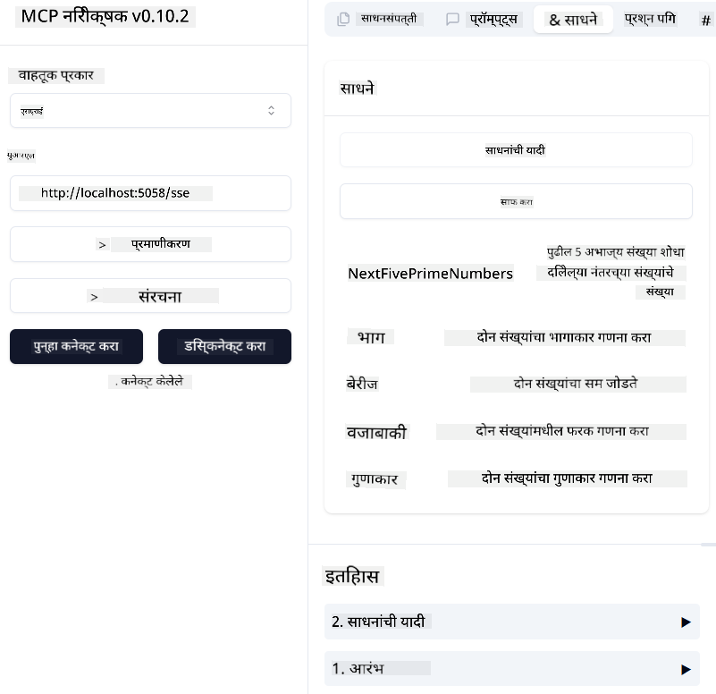
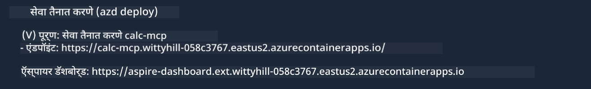

<!--
CO_OP_TRANSLATOR_METADATA:
{
  "original_hash": "5020a3e1a1c7f30c00f9e37f1fa208e3",
  "translation_date": "2025-05-17T14:06:58+00:00",
  "source_file": "04-PracticalImplementation/samples/csharp/README.md",
  "language_code": "mr"
}
-->
# नमुना

मागील उदाहरणामध्ये स्थानिक .NET प्रकल्प `sdio` प्रकारासह कसा वापरायचा ते दाखवले आहे. आणि कंटेनरमध्ये स्थानिक सर्व्हर कसा चालवायचा. अनेक परिस्थितींमध्ये हे एक चांगले समाधान आहे. तथापि, क्लाउड वातावरणासारखे सर्व्हर दूरस्थपणे चालवणे उपयुक्त ठरू शकते. इथेच `http` प्रकार उपयोगी ठरतो.

`04-PracticalImplementation` फोल्डरमधील समाधान पाहताना, हे मागीलपेक्षा अधिक क्लिष्ट दिसू शकते. पण प्रत्यक्षात, तसे नाही. प्रकल्प `src/mcpserver/mcpserver.csproj` नीट पाहिल्यास, तुम्हाला दिसेल की ते मुख्यतः मागील उदाहरणासारखेच कोड आहे. फक्त फरक एवढाच आहे की आम्ही HTTP विनंत्या हाताळण्यासाठी वेगळी लायब्ररी `ModelContextProtocol.AspNetCore` वापरत आहोत. आणि आम्ही `IsPrime` पद्धत खाजगी करण्यासाठी बदलतो, फक्त हे दर्शवण्यासाठी की तुम्ही तुमच्या कोडमध्ये खाजगी पद्धती ठेवू शकता. बाकीचा कोड पूर्वीसारखाच आहे.

इतर प्रकल्प [.NET Aspire](https://learn.microsoft.com/dotnet/aspire/get-started/aspire-overview) चे आहेत. समाधानात .NET Aspire असणे विकासकाच्या अनुभवाला सुधारते आणि निरीक्षणास मदत करते. सर्व्हर चालवण्यासाठी आवश्यक नाही, पण तुमच्या समाधानात असणे चांगली प्रथा आहे.

## सर्व्हर स्थानिकपणे सुरू करा

1. VS Code मधून (C# DevKit विस्तारासह), समाधान `04-PracticalImplementation\samples\csharp\src\Calculator-chap4.sln` उघडा.
2. सर्व्हर सुरू करण्यासाठी `F5` दाबा. यामुळे .NET Aspire डॅशबोर्डसह वेब ब्राउझर सुरू होईल.

किंवा

1. टर्मिनलमधून, फोल्डर `04-PracticalImplementation\samples\csharp\src` मध्ये जा.
2. सर्व्हर सुरू करण्यासाठी पुढील आदेश चालवा:
   ```bash
    dotnet run --project .\AppHost
   ```

3. डॅशबोर्डमधून, `http` URL लक्षात ठेवा. हे `http://localhost:5058/`.

## Test `SSE` सारखे असावे, ModelContext प्रोटोकॉल इंस्पेक्टरसह.

तुमच्याकडे Node.js 22.7.5 आणि अधिक असल्यास, तुम्ही ModelContext प्रोटोकॉल इंस्पेक्टर वापरून तुमचा सर्व्हर चाचणी करू शकता.

सर्व्हर सुरू करा आणि टर्मिनलमध्ये पुढील आदेश चालवा:

```bash
npx @modelcontextprotocol/inspector@latest
```



- `SSE` as the Transport type. SSE stand for Server-Sent Events. 
- In the Url field, enter the URL of the server noted earlier,and append `/sse` निवडा. हे `http` असावे (नाही `https`) something like `http://localhost:5058/sse`.
- select the Connect button.

A nice thing about the Inspector is that it provide a nice visibility on what is happening.

- Try listing the availables tools
- Try some of them, it should works just like before.


## Test `SSE` with Github Copilot Chat in VS Code

To use the `SSE` transport with Github Copilot Chat, change the configuration of the `mcp-calc` पूर्वी तयार केलेला सर्व्हर असावा:

```json
"mcp-calc": {
    "type": "sse",
    "url": "http://localhost:5058/sse"
}
```

काही चाचण्या करा:
- 6780 नंतर 3 अभाज्य संख्यांची मागणी करा. लक्षात ठेवा की Copilot नवीन साधने `NextFivePrimeNumbers` वापरेल आणि फक्त पहिल्या 3 अभाज्य संख्या परत करेल.
- 111 नंतर 7 अभाज्य संख्यांची मागणी करा, काय होते ते पाहण्यासाठी.


# सर्व्हर Azure वर तैनात करा

चला सर्व्हर Azure वर तैनात करूया जेणेकरून अधिक लोक त्याचा वापर करू शकतील.

टर्मिनलमधून, फोल्डर `04-PracticalImplementation\samples\csharp\src` मध्ये जा आणि पुढील आदेश चालवा:

```bash
azd init
```

हे Azure संसाधनांची संरचना आणि तुमच्या Infrastructure as Code (IaC) ची स्थानिकपणे काही फाइल्स तयार करेल.

मग, सर्व्हर Azure वर तैनात करण्यासाठी पुढील आदेश चालवा:

```bash
azd up
```

तैनाती पूर्ण झाल्यावर, तुम्हाला असे संदेश दिसेल:



Aspire डॅशबोर्डमध्ये जा आणि `HTTP` URL MCP Inspector आणि Github Copilot Chat मध्ये वापरण्यासाठी लक्षात ठेवा.


## पुढे काय?

आम्ही वेगवेगळे वाहतूक प्रकार आणि चाचणी साधने वापरून पाहतो आणि आमचा MCP सर्व्हर Azure वर तैनात करतो. पण काय जर आमच्या सर्व्हरला खाजगी संसाधनांमध्ये प्रवेश करणे आवश्यक असेल? उदाहरणार्थ, डेटाबेस किंवा खाजगी API? पुढील अध्यायात, आम्ही आमच्या सर्व्हरची सुरक्षा कशी सुधारू शकतो ते पाहू.

**अस्वीकृती**:
हा दस्तऐवज AI भाषांतर सेवा [Co-op Translator](https://github.com/Azure/co-op-translator) वापरून भाषांतरित करण्यात आला आहे. आम्ही अचूकतेसाठी प्रयत्नशील असलो तरी कृपया लक्षात ठेवा की स्वयंचलित भाषांतरे त्रुटी किंवा अपूर्णता असू शकतात. मूळ भाषेतील दस्तऐवज प्राधिकृत स्रोत मानला पाहिजे. महत्त्वपूर्ण माहितीसाठी, व्यावसायिक मानवी भाषांतराची शिफारस केली जाते. या भाषांतराच्या वापरामुळे उद्भवणाऱ्या कोणत्याही गैरसमज किंवा चुकीच्या अर्थ लावण्यास आम्ही जबाबदार नाही.