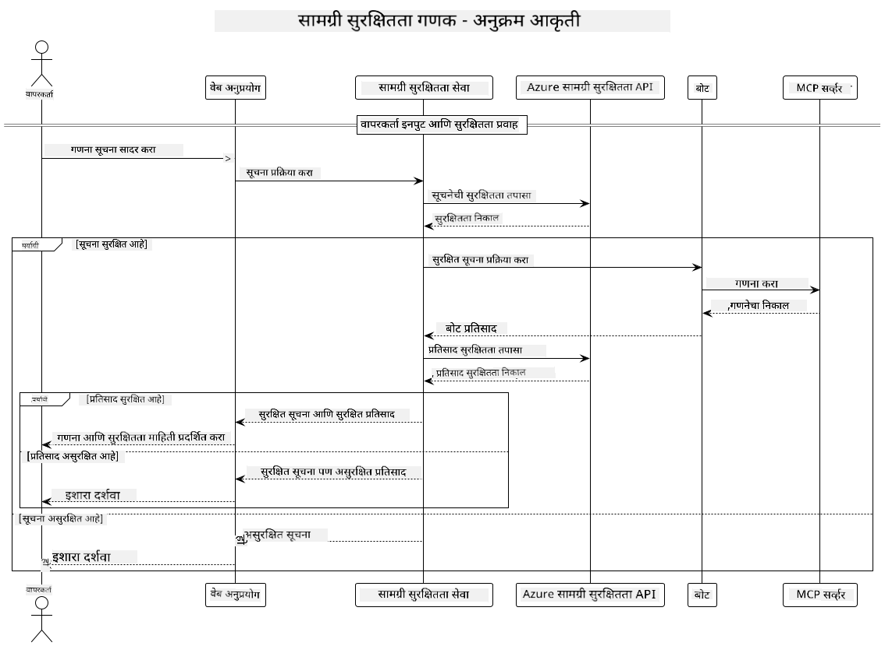

<!--
CO_OP_TRANSLATOR_METADATA:
{
  "original_hash": "e5ea5e7582f70008ea9bec3b3820f20a",
  "translation_date": "2025-07-13T23:14:26+00:00",
  "source_file": "04-PracticalImplementation/samples/java/containerapp/README.md",
  "language_code": "mr"
}
-->
## सिस्टम आर्किटेक्चर

हा प्रकल्प वेब अनुप्रयोग दाखवतो जो वापरकर्त्याच्या प्रॉम्प्ट्सना Model Context Protocol (MCP) द्वारे कॅल्क्युलेटर सेवेकडे पाठवण्यापूर्वी कंटेंट सेफ्टी तपासणी करतो.



### ते कसे कार्य करते

1. **वापरकर्ता इनपुट**: वापरकर्ता वेब इंटरफेसमध्ये गणिती प्रॉम्प्ट टाकतो  
2. **कंटेंट सेफ्टी स्क्रीनिंग (इनपुट)**: प्रॉम्प्ट Azure Content Safety API द्वारे विश्लेषित केला जातो  
3. **सेफ्टी निर्णय (इनपुट)**:  
   - जर कंटेंट सुरक्षित असेल (सर्व श्रेणींमध्ये गंभीरता < 2), तर तो कॅल्क्युलेटरकडे पाठवला जातो  
   - जर कंटेंट संभाव्य धोकादायक म्हणून चिन्हांकित असेल, तर प्रक्रिया थांबवून चेतावणी परत केली जाते  
4. **कॅल्क्युलेटर इंटिग्रेशन**: सुरक्षित कंटेंट LangChain4j द्वारे प्रक्रिया केली जाते, जे MCP कॅल्क्युलेटर सर्व्हरशी संवाद साधते  
5. **कंटेंट सेफ्टी स्क्रीनिंग (आउटपुट)**: बॉटच्या प्रतिसादाचे Azure Content Safety API द्वारे विश्लेषण केले जाते  
6. **सेफ्टी निर्णय (आउटपुट)**:  
   - जर बॉट प्रतिसाद सुरक्षित असेल, तर तो वापरकर्त्यास दाखवला जातो  
   - जर बॉट प्रतिसाद संभाव्य धोकादायक असेल, तर तो चेतावणीने बदलला जातो  
7. **प्रतिसाद**: निकाल (जर सुरक्षित असतील) वापरकर्त्यास दोन्ही सेफ्टी विश्लेषणांसह दाखवले जातात

## Model Context Protocol (MCP) वापरून कॅल्क्युलेटर सेवा

हा प्रकल्प दाखवतो की LangChain4j मधून कॅल्क्युलेटर MCP सेवा कशी कॉल करायची. अंमलबजावणीसाठी स्थानिक MCP सर्व्हर पोर्ट 8080 वर चालवला जातो जो कॅल्क्युलेटर ऑपरेशन्स पुरवतो.

### Azure Content Safety सेवा सेटअप करणे

कंटेंट सेफ्टी फिचर्स वापरण्यापूर्वी, तुम्हाला Azure Content Safety सेवा रिसोर्स तयार करावा लागेल:

1. [Azure Portal](https://portal.azure.com) मध्ये साइन इन करा  
2. "Create a resource" वर क्लिक करा आणि "Content Safety" शोधा  
3. "Content Safety" निवडा आणि "Create" वर क्लिक करा  
4. तुमच्या रिसोर्ससाठी एक अनोखा नाव द्या  
5. तुमची सबस्क्रिप्शन आणि रिसोर्स ग्रुप निवडा (किंवा नवीन तयार करा)  
6. समर्थित प्रदेश निवडा ([Region availability](https://azure.microsoft.com/en-us/global-infrastructure/services/?products=cognitive-services) तपासा)  
7. योग्य प्राइसिंग टियर निवडा  
8. "Create" वर क्लिक करून रिसोर्स डिप्लॉय करा  
9. डिप्लॉयमेंट पूर्ण झाल्यावर "Go to resource" वर क्लिक करा  
10. डाव्या पॅनलमध्ये "Resource Management" अंतर्गत "Keys and Endpoint" निवडा  
11. पुढील टप्प्यासाठी कीज आणि एंडपॉइंट URL कॉपी करा

### पर्यावरणीय व्हेरिएबल्स कॉन्फिगर करणे

GitHub मॉडेल्स प्रमाणीकरणासाठी `GITHUB_TOKEN` पर्यावरणीय व्हेरिएबल सेट करा:  
```sh
export GITHUB_TOKEN=<your_github_token>
```

कंटेंट सेफ्टी फिचर्ससाठी सेट करा:  
```sh
export CONTENT_SAFETY_ENDPOINT=<your_content_safety_endpoint>
export CONTENT_SAFETY_KEY=<your_content_safety_key>
```

हे पर्यावरणीय व्हेरिएबल्स अनुप्रयोगाला Azure Content Safety सेवेशी प्रमाणीकरण करण्यासाठी वापरले जातात. जर हे व्हेरिएबल्स सेट नसतील, तर अनुप्रयोग डेमो उद्दिष्टांसाठी प्लेसहोल्डर मूल्ये वापरेल, पण कंटेंट सेफ्टी फिचर्स योग्यरित्या कार्य करणार नाहीत.

### कॅल्क्युलेटर MCP सर्व्हर सुरू करणे

क्लायंट चालवण्यापूर्वी, तुम्हाला स्थानिक होस्टवर पोर्ट 8080 वर SSE मोडमध्ये कॅल्क्युलेटर MCP सर्व्हर सुरू करावा लागेल.

## प्रकल्पाचे वर्णन

हा प्रकल्प Model Context Protocol (MCP) चे LangChain4j सोबत इंटिग्रेशन दाखवतो ज्याद्वारे कॅल्क्युलेटर सेवा कॉल करता येतात. मुख्य वैशिष्ट्ये:

- बेसिक गणिती ऑपरेशन्ससाठी MCP वापरून कॅल्क्युलेटर सेवेशी कनेक्ट होणे  
- वापरकर्त्याच्या प्रॉम्प्ट्स आणि बॉट प्रतिसादांवर द्वि-स्तरीय कंटेंट सेफ्टी तपासणी  
- GitHub च्या gpt-4.1-nano मॉडेलसोबत LangChain4j द्वारे इंटिग्रेशन  
- MCP ट्रान्सपोर्टसाठी Server-Sent Events (SSE) वापरणे

## कंटेंट सेफ्टी इंटिग्रेशन

हा प्रकल्प वापरकर्त्याच्या इनपुट्स आणि सिस्टम प्रतिसादांमध्ये हानिकारक कंटेंट नसल्याची खात्री करण्यासाठी सखोल कंटेंट सेफ्टी फिचर्स समाविष्ट करतो:

1. **इनपुट स्क्रीनिंग**: सर्व वापरकर्ता प्रॉम्प्ट्सवर द्वेषवृत्ती, हिंसा, आत्महानी, लैंगिक सामग्री यांसारख्या हानिकारक श्रेणींसाठी तपासणी केली जाते.  
2. **आउटपुट स्क्रीनिंग**: संभाव्य अनकॅन्सर्ड मॉडेल्स वापरत असतानाही, सर्व तयार केलेले प्रतिसाद त्याच कंटेंट सेफ्टी फिल्टर्समधून तपासले जातात आणि नंतर वापरकर्त्यास दाखवले जातात.

हा द्वि-स्तरीय दृष्टिकोन वापरून कोणतेही AI मॉडेल वापरले तरी सिस्टम सुरक्षित राहते, वापरकर्त्यांना हानिकारक इनपुट्स आणि संभाव्य समस्याग्रस्त AI-निर्मित आउटपुट्सपासून संरक्षण मिळते.

## वेब क्लायंट

अॅप्लिकेशनमध्ये वापरकर्त्यांना Content Safety Calculator सिस्टमशी संवाद साधण्यासाठी सोपा वेब इंटरफेस आहे:

### वेब इंटरफेस वैशिष्ट्ये

- गणिती प्रॉम्प्ट टाकण्यासाठी सोपा, समजण्यास सोपा फॉर्म  
- द्वि-स्तरीय कंटेंट सेफ्टी व्हॅलिडेशन (इनपुट आणि आउटपुट)  
- प्रॉम्प्ट आणि प्रतिसादाच्या सेफ्टीसाठी रिअल-टाइम फीडबॅक  
- सहज समजण्यासाठी रंग-कोडेड सेफ्टी निर्देशक  
- विविध उपकरणांवर काम करणारा स्वच्छ, प्रतिसादक्षम डिझाइन  
- वापरकर्त्यांना मार्गदर्शन करण्यासाठी उदाहरणार्थ सुरक्षित प्रॉम्प्ट्स

### वेब क्लायंट वापरणे

1. अॅप्लिकेशन सुरू करा:  
   ```sh
   mvn spring-boot:run
   ```

2. तुमचा ब्राउझर उघडा आणि `http://localhost:8087` वर जा

3. दिलेल्या टेक्स्ट एरियामध्ये गणिती प्रॉम्प्ट टाका (उदा., "Calculate the sum of 24.5 and 17.3")

4. "Submit" वर क्लिक करा तुमची विनंती प्रक्रिया करण्यासाठी

5. निकाल पहा, ज्यामध्ये समाविष्ट असेल:  
   - तुमच्या प्रॉम्प्टचा कंटेंट सेफ्टी विश्लेषण  
   - गणना केलेला निकाल (जर प्रॉम्प्ट सुरक्षित असेल तर)  
   - बॉटच्या प्रतिसादाचा कंटेंट सेफ्टी विश्लेषण  
   - जर इनपुट किंवा आउटपुटमध्ये कोणतीही चेतावणी असेल तर ती

वेब क्लायंट आपोआप दोन्ही कंटेंट सेफ्टी तपासण्या हाताळतो, ज्यामुळे कोणतेही AI मॉडेल वापरले तरी सर्व संवाद सुरक्षित आणि योग्य राहतात.

**अस्वीकरण**:  
हा दस्तऐवज AI अनुवाद सेवा [Co-op Translator](https://github.com/Azure/co-op-translator) वापरून अनुवादित केला आहे. आम्ही अचूकतेसाठी प्रयत्नशील असलो तरी, कृपया लक्षात घ्या की स्वयंचलित अनुवादांमध्ये चुका किंवा अचूकतेची कमतरता असू शकते. मूळ दस्तऐवज त्याच्या स्थानिक भाषेत अधिकृत स्रोत मानला जावा. महत्त्वाच्या माहितीसाठी व्यावसायिक मानवी अनुवाद करण्याची शिफारस केली जाते. या अनुवादाच्या वापरामुळे उद्भवणाऱ्या कोणत्याही गैरसमजुती किंवा चुकीच्या अर्थलागी आम्ही जबाबदार नाही.