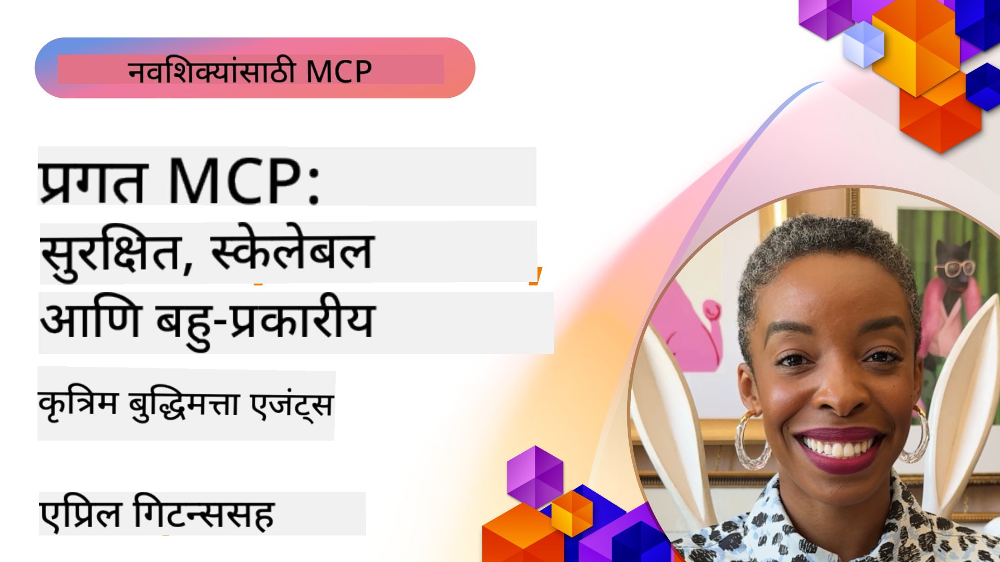

<!--
CO_OP_TRANSLATOR_METADATA:
{
  "original_hash": "d204bc94ea6027d06a703b21b711ca57",
  "translation_date": "2025-08-18T15:33:29+00:00",
  "source_file": "05-AdvancedTopics/README.md",
  "language_code": "mr"
}
-->
# MCP मधील प्रगत विषय

_(वरील प्रतिमेवर क्लिक करून या धड्याचा व्हिडिओ पहा)_

या प्रकरणात मॉडेल कॉन्टेक्स्ट प्रोटोकॉल (MCP) अंमलबजावणीतील प्रगत विषयांचा समावेश आहे, ज्यामध्ये मल्टी-मोडल इंटिग्रेशन, स्केलेबिलिटी, सुरक्षा सर्वोत्तम पद्धती आणि एंटरप्राइझ इंटिग्रेशन यांचा समावेश आहे. आधुनिक AI प्रणालींच्या मागण्या पूर्ण करण्यासाठी मजबूत आणि उत्पादन-तयार MCP अनुप्रयोग तयार करण्यासाठी हे विषय महत्त्वाचे आहेत.

## आढावा

या धड्यात मॉडेल कॉन्टेक्स्ट प्रोटोकॉल अंमलबजावणीतील प्रगत संकल्पना, विशेषतः मल्टी-मोडल इंटिग्रेशन, स्केलेबिलिटी, सुरक्षा सर्वोत्तम पद्धती आणि एंटरप्राइझ इंटिग्रेशन यावर लक्ष केंद्रित केले आहे. एंटरप्राइझ वातावरणातील जटिल आवश्यकता हाताळण्यासाठी उत्पादन-ग्रेड MCP अनुप्रयोग तयार करण्यासाठी हे विषय आवश्यक आहेत.

## शिकण्याची उद्दिष्टे

या धड्याच्या शेवटी, तुम्ही खालील गोष्टी करू शकाल:

- MCP फ्रेमवर्कमध्ये मल्टी-मोडल क्षमता अंमलात आणा
- उच्च मागणी असलेल्या परिस्थितीसाठी स्केलेबल MCP आर्किटेक्चर डिझाइन करा
- MCP च्या सुरक्षा तत्त्वांशी संरेखित सुरक्षा सर्वोत्तम पद्धती लागू करा
- MCP ला एंटरप्राइझ AI प्रणाली आणि फ्रेमवर्कसह समाकलित करा
- उत्पादन वातावरणात कार्यक्षमता आणि विश्वसनीयता अनुकूलित करा

## धडे आणि नमुना प्रकल्प

| लिंक | शीर्षक | वर्णन |
|------|-------|-------------|
| [5.1 Azure सह समाकलन](./mcp-integration/README.md) | Azure सह समाकलित करा | Azure वर तुमचा MCP सर्व्हर कसा समाकलित करायचा ते शिका |
| [5.2 मल्टी-मोडल नमुना](./mcp-multi-modality/README.md) | MCP मल्टी-मोडल नमुने | ऑडिओ, प्रतिमा आणि मल्टी-मोडल प्रतिसादासाठी नमुने |
| [5.3 MCP OAuth2 नमुना](../../../05-AdvancedTopics/mcp-oauth2-demo) | MCP OAuth2 डेमो | MCP सह OAuth2 दर्शविणारे मिनिमल स्प्रिंग बूट अॅप, अधिकृतता आणि संसाधन सर्व्हर म्हणून. सुरक्षित टोकन जारी करणे, संरक्षित एंडपॉइंट्स, Azure कंटेनर अॅप्स डिप्लॉयमेंट आणि API व्यवस्थापन समाकलन दर्शवते. |
| [5.4 रूट कॉन्टेक्स्ट्स](./mcp-root-contexts/README.md) | रूट कॉन्टेक्स्ट्स | रूट कॉन्टेक्स्ट्स बद्दल अधिक जाणून घ्या आणि त्यांची अंमलबजावणी कशी करायची ते शिका |
| [5.5 रूटिंग](./mcp-routing/README.md) | रूटिंग | रूटिंगचे विविध प्रकार शिका |
| [5.6 सॅम्पलिंग](./mcp-sampling/README.md) | सॅम्पलिंग | सॅम्पलिंगसह कसे कार्य करायचे ते शिका |
| [5.7 स्केलिंग](./mcp-scaling/README.md) | स्केलिंग | स्केलिंग बद्दल जाणून घ्या |
| [5.8 सुरक्षा](./mcp-security/README.md) | सुरक्षा | तुमचा MCP सर्व्हर सुरक्षित करा |
| [5.9 वेब शोध नमुना](./web-search-mcp/README.md) | वेब शोध MCP | Python MCP सर्व्हर आणि क्लायंट SerpAPI सह समाकलित करून रिअल-टाइम वेब, बातम्या, उत्पादन शोध आणि Q&A साठी. मल्टी-टूल ऑर्केस्ट्रेशन, बाह्य API समाकलन आणि मजबूत त्रुटी हाताळणी दर्शवते. |
| [5.10 रिअलटाइम स्ट्रीमिंग](./mcp-realtimestreaming/README.md) | स्ट्रीमिंग | आजच्या डेटा-केंद्रित जगात रिअल-टाइम डेटा स्ट्रीमिंग आवश्यक बनले आहे, जिथे व्यवसाय आणि अनुप्रयोग वेळेवर निर्णय घेण्यासाठी त्वरित माहितीची आवश्यकता असते. |
| [5.11 रिअलटाइम वेब शोध](./mcp-realtimesearch/README.md) | वेब शोध | रिअल-टाइम वेब शोध कसा MCP रिअल-टाइम वेब शोध बदलतो, AI मॉडेल्स, शोध इंजिन्स आणि अनुप्रयोगांमध्ये संदर्भ व्यवस्थापनासाठी प्रमाणित दृष्टिकोन प्रदान करून. |
| [5.12 मॉडेल कॉन्टेक्स्ट प्रोटोकॉल सर्व्हरसाठी Entra ID प्रमाणीकरण](./mcp-security-entra/README.md) | Entra ID प्रमाणीकरण | Microsoft Entra ID एक मजबूत क्लाउड-आधारित ओळख आणि प्रवेश व्यवस्थापन समाधान प्रदान करते, ज्यामुळे फक्त अधिकृत वापरकर्ते आणि अनुप्रयोग तुमच्या MCP सर्व्हरशी संवाद साधू शकतात याची खात्री होते. |
| [5.13 Azure AI Foundry Agent समाकलन](./mcp-foundry-agent-integration/README.md) | Azure AI Foundry समाकलन | मॉडेल कॉन्टेक्स्ट प्रोटोकॉल सर्व्हरला Azure AI Foundry एजंट्ससह समाकलित कसे करायचे ते शिका, शक्तिशाली टूल ऑर्केस्ट्रेशन आणि एंटरप्राइझ AI क्षमता सक्षम करून प्रमाणित बाह्य डेटा स्रोत कनेक्शनसह. |
| [5.14 कॉन्टेक्स्ट इंजिनिअरिंग](./mcp-contextengineering/README.md) | कॉन्टेक्स्ट इंजिनिअरिंग | MCP सर्व्हरसाठी कॉन्टेक्स्ट इंजिनिअरिंग तंत्रांच्या भविष्यातील संधी, ज्यामध्ये कॉन्टेक्स्ट ऑप्टिमायझेशन, डायनॅमिक कॉन्टेक्स्ट व्यवस्थापन आणि MCP फ्रेमवर्कमध्ये प्रभावी प्रॉम्प्ट इंजिनिअरिंगसाठी धोरणांचा समावेश आहे. |

## अतिरिक्त संदर्भ

प्रगत MCP विषयांवरील सर्वात अद्ययावत माहितीसाठी, खालील संदर्भ पहा:
- [MCP दस्तऐवज](https://modelcontextprotocol.io/)
- [MCP तपशील](https://spec.modelcontextprotocol.io/)
- [GitHub रिपॉझिटरी](https://github.com/modelcontextprotocol)

## मुख्य मुद्दे

- मल्टी-मोडल MCP अंमलबजावणी AI क्षमता मजकूर प्रक्रिया पलीकडे वाढवते
- एंटरप्राइझ डिप्लॉयमेंटसाठी स्केलेबिलिटी आवश्यक आहे आणि ती आडव्या आणि उभ्या स्केलिंगद्वारे हाताळली जाऊ शकते
- व्यापक सुरक्षा उपाय डेटा संरक्षित करतात आणि योग्य प्रवेश नियंत्रण सुनिश्चित करतात
- Azure OpenAI आणि Microsoft AI Foundry सारख्या प्लॅटफॉर्मसह एंटरप्राइझ समाकलन MCP क्षमता वाढवते
- प्रगत MCP अंमलबजावणींना अनुकूलित आर्किटेक्चर आणि संसाधन व्यवस्थापनाची काळजी घेण्याचा फायदा होतो

## व्यायाम

विशिष्ट उपयोग प्रकरणासाठी एंटरप्राइझ-ग्रेड MCP अंमलबजावणी डिझाइन करा:

1. तुमच्या उपयोग प्रकरणासाठी मल्टी-मोडल आवश्यकता ओळखा
2. संवेदनशील डेटा संरक्षित करण्यासाठी आवश्यक सुरक्षा नियंत्रणांचे रूपरेषा तयार करा
3. बदलत्या लोड हाताळण्यासाठी स्केलेबल आर्किटेक्चर डिझाइन करा
4. एंटरप्राइझ AI प्रणालींसह समाकलन बिंदूंची योजना करा
5. संभाव्य कार्यक्षमता अडथळे आणि शमन धोरणे दस्तऐवजीकरण करा

## अतिरिक्त संसाधने

- [Azure OpenAI दस्तऐवज](https://learn.microsoft.com/en-us/azure/ai-services/openai/)
- [Microsoft AI Foundry दस्तऐवज](https://learn.microsoft.com/en-us/ai-services/)

---

## पुढे काय

- [5.1 MCP समाकलन](./mcp-integration/README.md)

**अस्वीकरण**:  
हा दस्तऐवज AI भाषांतर सेवा [Co-op Translator](https://github.com/Azure/co-op-translator) चा वापर करून भाषांतरित करण्यात आला आहे. आम्ही अचूकतेसाठी प्रयत्नशील असलो तरी कृपया लक्षात ठेवा की स्वयंचलित भाषांतरे त्रुटी किंवा अचूकतेच्या अभावाने युक्त असू शकतात. मूळ भाषेतील दस्तऐवज हा अधिकृत स्रोत मानला जावा. महत्त्वाच्या माहितीसाठी व्यावसायिक मानवी भाषांतराची शिफारस केली जाते. या भाषांतराचा वापर करून उद्भवलेल्या कोणत्याही गैरसमज किंवा चुकीच्या अर्थासाठी आम्ही जबाबदार राहणार नाही.