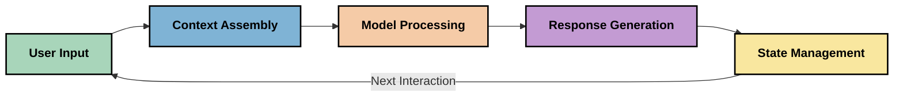
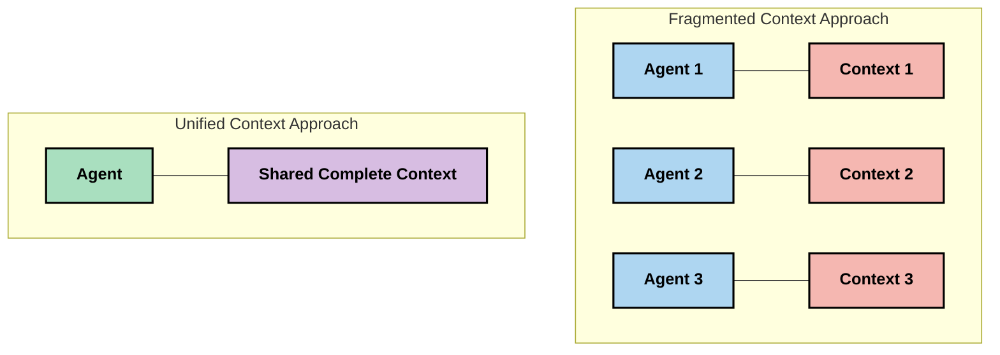
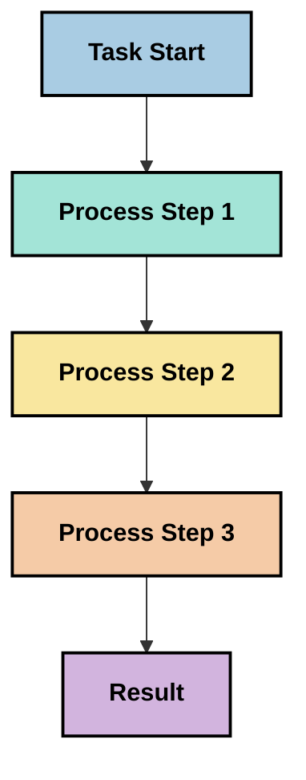
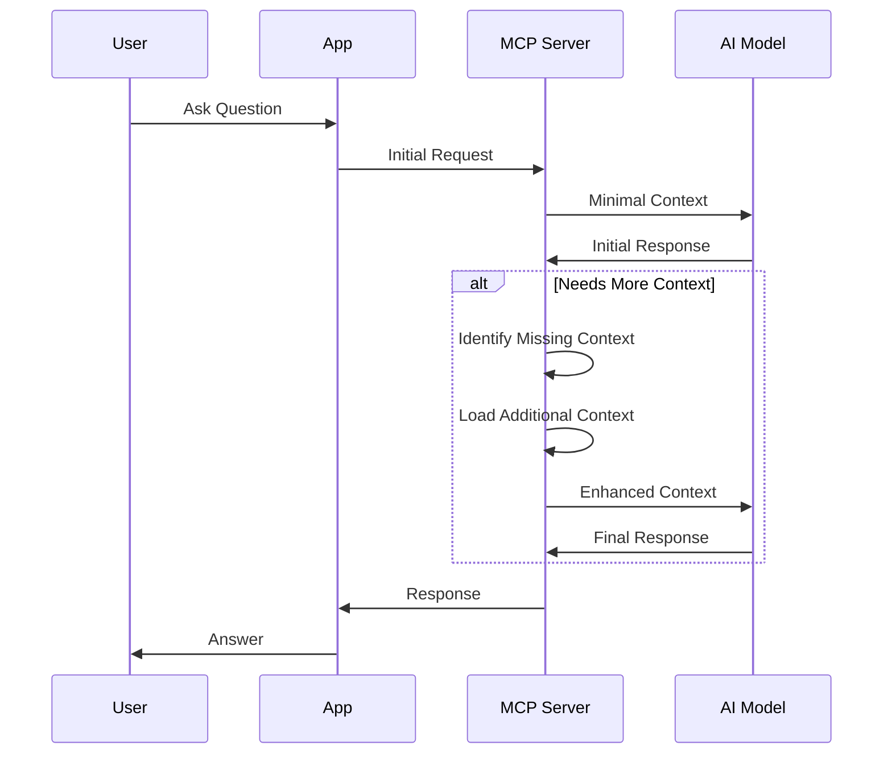
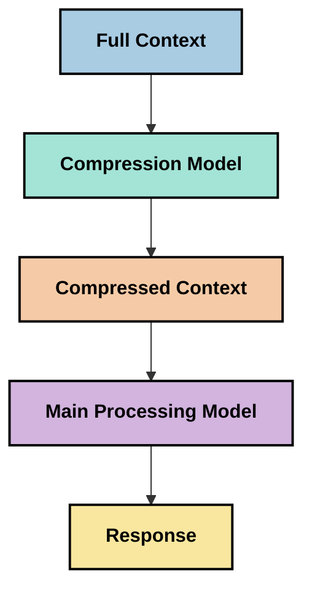

<!--
CO_OP_TRANSLATOR_METADATA:
{
  "original_hash": "5762e8e74dd99d8b7dbb31e69a82561e",
  "translation_date": "2025-07-17T01:41:32+00:00",
  "source_file": "05-AdvancedTopics/mcp-contextengineering/README.md",
  "language_code": "mr"
}
-->
# Context Engineering: MCP इकोसिस्टममधील एक उदयोन्मुख संकल्पना

## आढावा

Context engineering ही AI क्षेत्रातील एक उदयोन्मुख संकल्पना आहे जी ग्राहक आणि AI सेवा यांच्यातील संवादादरम्यान माहिती कशी रचली जाते, वितरित केली जाते आणि राखली जाते याचा अभ्यास करते. Model Context Protocol (MCP) इकोसिस्टम विकसित होत असताना, संदर्भ प्रभावीपणे कसा व्यवस्थापित करायचा हे समजून घेणे अधिक महत्त्वाचे ठरते. हा मॉड्यूल context engineering या संकल्पनेची ओळख करून देतो आणि MCP अंमलबजावणीत त्याच्या संभाव्य वापरांचा शोध घेतो.

## शिकण्याचे उद्दिष्टे

या मॉड्यूलच्या शेवटी, तुम्ही सक्षम असाल:

- context engineering या उदयोन्मुख संकल्पनेची आणि MCP अनुप्रयोगांमधील त्याच्या संभाव्य भूमिकेची समज प्राप्त करणे
- context व्यवस्थापनातील मुख्य आव्हाने ओळखणे ज्यावर MCP प्रोटोकॉल डिझाइन लक्ष केंद्रित करते
- चांगल्या context हाताळणीद्वारे मॉडेल कार्यक्षमता सुधारण्यासाठी तंत्रे शोधणे
- context प्रभावीपणाचे मापन आणि मूल्यांकन करण्याच्या पद्धतींचा विचार करणे
- MCP फ्रेमवर्कद्वारे AI अनुभव सुधारण्यासाठी या उदयोन्मुख संकल्पनांचा वापर करणे

## Context Engineering ची ओळख

Context engineering ही एक उदयोन्मुख संकल्पना आहे जी वापरकर्ते, अनुप्रयोग आणि AI मॉडेल्स यांच्यातील माहिती प्रवाहाच्या नियोजन आणि व्यवस्थापनावर लक्ष केंद्रित करते. prompt engineering सारख्या प्रस्थापित क्षेत्रांपेक्षा वेगळी, context engineering अजूनही व्यावसायिकांकडून परिभाषित केली जात आहे कारण ते AI मॉडेल्सना योग्य वेळी योग्य माहिती देण्याच्या अनोख्या आव्हानांवर काम करत आहेत.

मोठ्या भाषा मॉडेल्स (LLMs) विकसित होत असताना, संदर्भाचे महत्त्व अधिक स्पष्ट झाले आहे. आपण पुरवलेला संदर्भाचा दर्जा, सुसंगतता आणि रचना थेट मॉडेलच्या आउटपुटवर परिणाम करतात. context engineering या नात्याचा अभ्यास करते आणि प्रभावी संदर्भ व्यवस्थापनासाठी तत्त्वे विकसित करण्याचा प्रयत्न करते.

> "2025 मध्ये, तिथल्या मॉडेल्स खूप बुद्धिमान आहेत. पण सर्वात हुशार माणूसही त्याला काय करायचं आहे याचा संदर्भ न मिळाल्यास त्याचे काम प्रभावीपणे करू शकणार नाही... 'Context engineering' हा prompt engineering चा पुढील स्तर आहे. हे गतिशील प्रणालीमध्ये हे स्वयंचलितपणे करण्याबाबत आहे." — Walden Yan, Cognition AI

Context engineering मध्ये समाविष्ट असू शकते:

1. **Context Selection**: दिलेल्या कार्यासाठी कोणती माहिती संबंधित आहे हे ठरवणे
2. **Context Structuring**: मॉडेलच्या समजुतीसाठी माहितीचे आयोजन करणे
3. **Context Delivery**: माहिती मॉडेल्सना कशी आणि केव्हा पाठवायची याचे ऑप्टिमायझेशन करणे
4. **Context Maintenance**: संदर्भाची स्थिती आणि त्याचा कालांतराने विकास व्यवस्थापित करणे
5. **Context Evaluation**: संदर्भाच्या प्रभावीपणाचे मापन आणि सुधारणा करणे

हे लक्ष केंद्रित करणारे क्षेत्र MCP इकोसिस्टमसाठी विशेषतः महत्त्वाचे आहे, जे अनुप्रयोगांना LLMs कडे संदर्भ प्रदान करण्याचा एक मानकीकृत मार्ग देते.

## संदर्भ प्रवासाचा दृष्टिकोन

context engineering चे एक दृष्टीकोन म्हणजे माहिती MCP प्रणालीतून कशी प्रवास करते हे ट्रेस करणे:



### संदर्भ प्रवासातील मुख्य टप्पे:

1. **User Input**: वापरकर्त्याकडून आलेली मूळ माहिती (मजकूर, प्रतिमा, दस्तऐवज)
2. **Context Assembly**: वापरकर्त्याच्या इनपुटसह प्रणाली संदर्भ, संभाषण इतिहास आणि इतर प्राप्त माहिती एकत्र करणे
3. **Model Processing**: AI मॉडेल एकत्रित संदर्भ प्रक्रिया करते
4. **Response Generation**: मॉडेल दिलेल्या संदर्भावर आधारित आउटपुट तयार करते
5. **State Management**: संवादानुसार प्रणालीची अंतर्गत स्थिती अद्ययावत करणे

हा दृष्टिकोन AI प्रणालीतील संदर्भाच्या गतिशील स्वरूपावर प्रकाश टाकतो आणि प्रत्येक टप्प्यावर माहिती कशी सर्वोत्तम प्रकारे व्यवस्थापित करायची याबाबत महत्त्वाचे प्रश्न उपस्थित करतो.

## Context Engineering मधील उदयोन्मुख तत्त्वे

context engineering क्षेत्र आकार घेत असताना, काही प्राथमिक तत्त्वे व्यावसायिकांकडून समोर येत आहेत. ही तत्त्वे MCP अंमलबजावणीच्या निवडींना मार्गदर्शन करू शकतात:

### तत्त्व 1: संदर्भ पूर्णपणे शेअर करा

संदर्भ प्रणालीतील सर्व घटकांमध्ये पूर्णपणे शेअर केला पाहिजे, अनेक एजंट्स किंवा प्रक्रियांमध्ये तुटलेला नसावा. जेव्हा संदर्भ वितरित केला जातो, तेव्हा प्रणालीच्या एका भागात घेतलेले निर्णय दुसऱ्या भागातील निर्णयांशी विसंगत होऊ शकतात.



MCP अनुप्रयोगांमध्ये, याचा अर्थ असा की संदर्भ संपूर्ण पाइपलाइनमध्ये अखंडपणे प्रवाहित होईल असे सिस्टम डिझाइन करणे आवश्यक आहे, न कि विभागलेले.

### तत्त्व 2: कृतींमध्ये अप्रत्यक्ष निर्णय असतात हे ओळखा

मॉडेलने घेतलेली प्रत्येक कृती संदर्भ कसा समजून घ्यायचा याबाबत अप्रत्यक्ष निर्णय व्यक्त करते. जेव्हा अनेक घटक वेगवेगळ्या संदर्भांवर कार्य करतात, तेव्हा हे अप्रत्यक्ष निर्णय विसंगत होऊ शकतात, ज्यामुळे परिणाम असुसंगत होतात.

हे तत्त्व MCP अनुप्रयोगांसाठी महत्त्वाचे आहे:
- तुटलेल्या संदर्भासह समांतर अंमलबजावणीपेक्षा जटिल कार्यांची रेषीय प्रक्रिया प्राधान्य द्या
- सर्व निर्णय बिंदूंना समान संदर्भ माहिती उपलब्ध असावी याची खात्री करा
- अशा प्रणाली डिझाइन करा जिथे नंतरचे टप्पे आधीच्या निर्णयांचा पूर्ण संदर्भ पाहू शकतील

### तत्त्व 3: संदर्भाची खोली आणि विंडो मर्यादा यामध्ये संतुलन ठेवा

संवाद आणि प्रक्रिया वाढत गेल्याने संदर्भ विंडो ओव्हरफ्लो होतात. प्रभावी context engineering या व्यापक संदर्भ आणि तांत्रिक मर्यादांमधील तणाव व्यवस्थापित करण्याचे मार्ग शोधते.

शोधल्या जाणाऱ्या संभाव्य पद्धतींमध्ये समाविष्ट आहेत:
- संदर्भ संकुचन जे आवश्यक माहिती राखून टोकन वापर कमी करते
- सध्याच्या गरजेनुसार संदर्भ प्रगतपणे लोड करणे
- पूर्वीच्या संवादांचे सारांश तयार करणे, महत्त्वाचे निर्णय आणि तथ्ये जपून ठेवणे

## संदर्भ आव्हाने आणि MCP प्रोटोकॉल डिझाइन

Model Context Protocol (MCP) संदर्भ व्यवस्थापनाच्या अनोख्या आव्हानांना लक्षात घेऊन डिझाइन केला गेला आहे. या आव्हानांची समज MCP प्रोटोकॉल डिझाइनच्या मुख्य पैलूंचे स्पष्टीकरण करते:

### आव्हान 1: संदर्भ विंडो मर्यादा
बहुतेक AI मॉडेल्सना निश्चित संदर्भ विंडो आकार असतो, ज्यामुळे ते एकावेळी किती माहिती प्रक्रिया करू शकतात यावर मर्यादा येते.

**MCP डिझाइन प्रतिसाद:**  
- प्रोटोकॉल संरचित, संसाधन-आधारित संदर्भाला समर्थन देतो जो प्रभावीपणे संदर्भित केला जाऊ शकतो  
- संसाधने पृष्ठांमध्ये विभागली जाऊ शकतात आणि प्रगतपणे लोड केली जाऊ शकतात

### आव्हान 2: सुसंगतता ठरवणे
संदर्भात कोणती माहिती सर्वात संबंधित आहे हे ठरवणे कठीण आहे.

**MCP डिझाइन प्रतिसाद:**  
- गरजेनुसार माहिती गतिशीलपणे मिळवण्यासाठी लवचिक साधने उपलब्ध  
- संरचित प्रॉम्प्ट्समुळे संदर्भाचे सुसंगत आयोजन शक्य

### आव्हान 3: संदर्भ टिकवून ठेवणे
संवादांदरम्यान स्थिती व्यवस्थापित करण्यासाठी संदर्भाचे काळजीपूर्वक ट्रॅकिंग आवश्यक आहे.

**MCP डिझाइन प्रतिसाद:**  
- मानकीकृत सत्र व्यवस्थापन  
- संदर्भ विकासासाठी स्पष्ट संवाद नमुने

### आव्हान 4: बहु-माध्यम संदर्भ
वेगवेगळ्या प्रकारच्या डेटासाठी (मजकूर, प्रतिमा, संरचित डेटा) वेगळ्या हाताळणीची गरज असते.

**MCP डिझाइन प्रतिसाद:**  
- प्रोटोकॉल विविध सामग्री प्रकारांना अनुकूल  
- बहु-माध्यम माहितीचे मानकीकृत सादरीकरण

### आव्हान 5: सुरक्षा आणि गोपनीयता
संदर्भात संवेदनशील माहिती असू शकते ज्याचे संरक्षण आवश्यक आहे.

**MCP डिझाइन प्रतिसाद:**  
- क्लायंट आणि सर्व्हर जबाबदाऱ्यांमध्ये स्पष्ट सीमा  
- डेटा उघड होण्यापासून बचावासाठी स्थानिक प्रक्रिया पर्याय

हे आव्हान समजून घेणे आणि MCP कसे त्यांना हाताळते हे जाणून घेणे अधिक प्रगत context engineering तंत्रांचा शोध घेण्यासाठी पाया तयार करते.

## उदयोन्मुख Context Engineering पद्धती

context engineering क्षेत्र विकसित होत असताना, काही आशादायक पद्धती समोर येत आहेत. या सध्याच्या विचारसरणीचे प्रतिनिधित्व करतात, प्रस्थापित सर्वोत्तम पद्धती नाहीत, आणि MCP अंमलबजावणीसह अनुभव वाढल्यावर बदलू शकतात.

### 1. सिंगल-थ्रेडेड रेषीय प्रक्रिया

context वितरित करणाऱ्या मल्टी-एजंट आर्किटेक्चरच्या तुलनेत, काही व्यावसायिकांना सिंगल-थ्रेडेड रेषीय प्रक्रिया अधिक सुसंगत निकाल देते असे आढळले आहे. हे एकत्रित संदर्भ राखण्याच्या तत्त्वाशी जुळते.



ही पद्धत समांतर प्रक्रियेइतकी कार्यक्षम वाटू शकत नाही, पण प्रत्येक टप्पा आधीच्या निर्णयांच्या पूर्ण समजुतीवर आधारित असल्यामुळे अधिक सुसंगत आणि विश्वासार्ह निकाल देते.

### 2. संदर्भ तुकडे करणे आणि प्राधान्य देणे

मोठ्या संदर्भांना व्यवस्थापनीय तुकड्यांमध्ये विभागणे आणि सर्वात महत्त्वाच्या भागांना प्राधान्य देणे.

```python
# Conceptual Example: Context Chunking and Prioritization
def process_with_chunked_context(documents, query):
    # 1. Break documents into smaller chunks
    chunks = chunk_documents(documents)
    
    # 2. Calculate relevance scores for each chunk
    scored_chunks = [(chunk, calculate_relevance(chunk, query)) for chunk in chunks]
    
    # 3. Sort chunks by relevance score
    sorted_chunks = sorted(scored_chunks, key=lambda x: x[1], reverse=True)
    
    # 4. Use the most relevant chunks as context
    context = create_context_from_chunks([chunk for chunk, score in sorted_chunks[:5]])
    
    # 5. Process with the prioritized context
    return generate_response(context, query)
```

वरील संकल्पना मोठ्या दस्तऐवजांना तुकड्यांमध्ये विभागून फक्त सर्वात संबंधित भाग निवडण्याचा दाखला देते. ही पद्धत संदर्भ विंडो मर्यादांमध्ये काम करण्यास मदत करते आणि मोठ्या ज्ञानसंग्रहाचा फायदा घेते.

### 3. प्रगत संदर्भ लोडिंग

संपूर्ण संदर्भ एकावेळी लोड करण्याऐवजी गरजेनुसार प्रगतपणे लोड करणे.



प्रगत संदर्भ लोडिंग कमी संदर्भाने सुरू होते आणि फक्त आवश्यकतेनुसार वाढवते. यामुळे सोप्या प्रश्नांसाठी टोकन वापर लक्षणीयरीत्या कमी होतो आणि जटिल प्रश्न हाताळण्याची क्षमता टिकून राहते.

### 4. संदर्भ संकुचन आणि सारांश

आवश्यक माहिती जपून संदर्भाचा आकार कमी करणे.



संदर्भ संकुचनावर लक्ष केंद्रित केले जाते:
- पुनरावृत्तीची माहिती काढून टाकणे  
- लांब सामग्रीचे सारांश तयार करणे  
- मुख्य तथ्ये आणि तपशील काढणे  
- महत्त्वाचे संदर्भ घटक जपणे  
- टोकन कार्यक्षमतेसाठी ऑप्टिमायझेशन

ही पद्धत संदर्भ विंडोमध्ये लांब संवाद टिकवण्यासाठी किंवा मोठ्या दस्तऐवजांची कार्यक्षम प्रक्रिया करण्यासाठी विशेषतः उपयुक्त आहे. काही व्यावसायिक संवाद इतिहासाच्या संदर्भ संकुचन आणि सारांशासाठी विशेष मॉडेल्स वापरत आहेत.

## अन्वेषणात्मक Context Engineering विचार

context engineering चा अभ्यास करताना, MCP अंमलबजावणीसह काम करताना काही विचार करणे उपयुक्त ठरू शकते. हे ठराविक सर्वोत्तम पद्धती नाहीत, तर तुमच्या विशिष्ट वापरासाठी सुधारणा करू शकतील अशा क्षेत्रांवर लक्ष केंद्रित करतात.

### तुमचे संदर्भ उद्दिष्टे विचारात घ्या

जटिल संदर्भ व्यवस्थापन उपाय अंमलात आणण्यापूर्वी, तुम्ही काय साध्य करू इच्छिता हे स्पष्ट करा:
- मॉडेलला यशस्वी होण्यासाठी कोणती विशिष्ट माहिती आवश्यक आहे?
- कोणती माहिती आवश्यक आहे आणि कोणती पूरक आहे?
- तुमच्या कार्यक्षमतेच्या मर्यादा काय आहेत (प्रतिक्रिया वेळ, टोकन मर्यादा, खर्च)?

### स्तरित संदर्भ पद्धतींचा शोध घ्या

काही व्यावसायिकांना संकल्पनात्मक स्तरांमध्ये संदर्भ मांडल्याने यश मिळाले आहे:
- **Core Layer**: मॉडेलला नेहमी आवश्यक असलेली मूलभूत माहिती  
- **Situational Layer**: सध्याच्या संवादाशी संबंधित संदर्भ  
- **Supporting Layer**: अतिरिक्त माहिती जी उपयुक्त ठरू शकते  
- **Fallback Layer**: गरजेनुसार प्रवेश होणारी माहिती

### पुनर्प्राप्ती धोरणांचा अभ्यास करा

तुमच्या संदर्भाची प्रभावीता कशी माहिती मिळवली जाते यावर अवलंबून असते:
- संकल्पनात्मकदृष्ट्या संबंधित माहिती शोधण्यासाठी semantic search आणि embeddings  
- विशिष्ट तथ्यात्मक तपशीलांसाठी keyword-based search  
- अनेक पुनर्प्राप्ती पद्धती एकत्र करणारे हायब्रिड दृष्टिकोन  
- श्रेणी, तारीख किंवा स्रोतांनुसार metadata filtering करून शोध कमी करणे

### संदर्भ सुसंगततेसह प्रयोग करा

तुमच्या संदर्भाची रचना आणि प्रवाह मॉडेलच्या समजुतीवर परिणाम करू शकतो:
- संबंधित माहिती एकत्र गटबद्ध करणे  
- सुसंगत फॉरमॅटिंग आणि आयोजन वापरणे  
- योग्य ठिकाणी तार्किक किंवा कालक्रमानुसार क्रमवारी राखणे  
- विरोधाभासी माहिती टाळणे

### मल्टी-एजंट आर्किटेक्चरच्या तोट्यांचा विचार करा

मल्टी-एजंट आर्किटेक्चर अनेक AI फ्रेमवर्कमध्ये लोकप्रिय असले तरी, संदर्भ व्यवस्थापनासाठी त्यात महत्त्वाचे आव्हाने असतात:
- संदर्भ तुटल्यामुळे एजंट्समध्ये विसंगत निर्णय होऊ शकतात  
- समांतर प्रक्रिया संघर्ष निर्माण करू शकते ज्यांचे निराकरण कठीण असते  
- एजंट्समधील संवादाचा ओव्हरहेड कार्यक्षमतेवर परिणाम करू शकतो  
- सुसंगतता राखण्यासाठी जटिल स्थिती व्यवस्थापन आवश्यक

अनेक वेळा, एकाच एजंटसह व्यापक संदर्भ व्यवस्थापन अनेक तुटलेल्या संदर्भ असलेल्या विशेष एजंट्सच्या तुलनेत अधिक विश्वासार्ह निकाल देते.

### मूल्यांकन पद्धती विकसित करा

context engineering सुधारण्यासाठी, यश कसे मोजाल याचा विचार करा:
- वेगवेगळ्या संदर्भ रचनांची A/B चाचणी  
- टोकन वापर आणि प्रतिसाद वेळेवर लक्ष ठेवणे  
- वापरकर्ता समाधान आणि कार्य पूर्णत्व दर ट्रॅक करणे  
- संदर्भ धोरणे का आणि कधी अयशस्वी होतात याचा विश्लेषण

हे विचार context engineering क्षेत्रातील सक्रिय अन्वेषण दर्शवतात. क्षेत्र विकसित होत असताना अधिक ठोस नमुने आणि पद्धती समोर येतील.

## संदर्भ प्रभावीतेचे मापन: एक विकसित होत असलेले फ्रेमवर्क

context engineering संकल्पना म्हणून उदयास येत असताना, व्यावसायिक त्याच्या प्रभावीतेचे मापन कसे करावे याचा शोध घेत आहेत. अजून कोणताही प्रस्थापित फ्रेमवर्क नाही, पण विविध मेट्रिक्स विचारात घेतले जात आहेत जे भविष्यातील कामासाठी मार्गदर्शन करू शकतात.

### संभाव्य मापन परिमाणे

#### 1. इनपुट कार्यक्षमता विचार

- **Context-to-Response Ratio**: प्रतिसादाच्या आकाराच्या तुलनेत किती संदर्भ आवश्यक आहे?  
- **Token Utilization**: दिलेल्या संदर्भातील किती टोकन्स प्रतिसादावर परिणाम करतात?  
- **Context Reduction**: मूळ माहिती कितपत प्रभावीपणे संकुचित केली जाऊ शकते?

#### 2. कार्यक्षमता विचार

- **Latency Impact**: संदर्भ व्यवस्थापनामुळे प्रतिसाद वेळ कसा प्रभावित होतो?  
- **Token Economy**: टोकन वापर प्रभावीपणे ऑप्टिमाइझ केला जातो का?  
- **Retrieval Precision**: मिळालेली माहिती कितपत संबंधित आहे?  
- **Resource Utilization**: कोणते संगणकीय संसाधने लागतात?

#### 3. गुणवत्ता विचार

- **Response Relevance**: प्रतिसाद प्रश्नाशी कितपत सुसंगत आहे?  
- **Factual Accuracy**: संदर्भ व्यवस्थापनामुळे तथ्यात्मक अचूकता सुधारते का?  
- **Consistency**: समान प्रश्नांवर प्रतिसाद सुसंगत आहेत का?  
- **Hallucination Rate**: चांगल्या संदर्भामुळे मॉडेलच्या भ्रम निर्माण होण्याची शक्यता कमी होते का?

#### 4. वापरकर्ता अनुभव विचार

- **Follow-up Rate**: वापरकर्त्यांना किती वेळा स्पष्टीकरणाची गरज भासते?  
- **Task Completion**: वापरकर्ते त्यांचे उद्दिष्ट यशस्वीपणे पूर्ण करतात का?  
-
- [Model Context Protocol Website](https://modelcontextprotocol.io/)
- [Model Context Protocol Specification](https://github.com/modelcontextprotocol/modelcontextprotocol)
- [MCP Documentation](https://modelcontextprotocol.io/docs)
- [MCP C# SDK](https://github.com/modelcontextprotocol/csharp-sdk)
- [MCP Python SDK](https://github.com/modelcontextprotocol/python-sdk)
- [MCP TypeScript SDK](https://github.com/modelcontextprotocol/typescript-sdk)
- [MCP Inspector](https://github.com/modelcontextprotocol/inspector) - MCP सर्व्हरसाठी व्हिज्युअल टेस्टिंग टूल

### Context Engineering लेख
- [Multi-Agents तयार करू नका: Context Engineering चे तत्त्वे](https://cognition.ai/blog/dont-build-multi-agents) - Walden Yan यांचे context engineering तत्त्वांवरील विचार
- [एजंट तयार करण्यासाठी व्यावहारिक मार्गदर्शक](https://cdn.openai.com/business-guides-and-resources/a-practical-guide-to-building-agents.pdf) - OpenAI कडून प्रभावी एजंट डिझाइनसाठी मार्गदर्शक
- [प्रभावी एजंट तयार करणे](https://www.anthropic.com/engineering/building-effective-agents) - Anthropic चा एजंट विकास दृष्टिकोन

### संबंधित संशोधन
- [मोठ्या भाषा मॉडेलसाठी डायनॅमिक रिट्रीव्हल ऑगमेंटेशन](https://arxiv.org/abs/2310.01487) - डायनॅमिक रिट्रीव्हल पद्धतींवरील संशोधन
- [मध्यभागी हरवले: भाषा मॉडेल्स लांब संदर्भ कसे वापरतात](https://arxiv.org/abs/2307.03172) - संदर्भ प्रक्रिया पद्धतींवरील महत्त्वाचे संशोधन
- [CLIP Latents सह हायएरार्किकल टेक्स्ट-आधारित इमेज जनरेशन](https://arxiv.org/abs/2204.06125) - DALL-E 2 पेपर आणि संदर्भ रचनेवरील अंतर्दृष्टी
- [मोठ्या भाषा मॉडेल आर्किटेक्चरमध्ये संदर्भाची भूमिका तपासणे](https://aclanthology.org/2023.findings-emnlp.124/) - संदर्भ हाताळणीवरील अलीकडील संशोधन
- [मल्टी-एजंट सहकार्य: एक सर्वेक्षण](https://arxiv.org/abs/2304.03442) - मल्टी-एजंट सिस्टम्स आणि त्यांच्या आव्हानांवरील संशोधन

### अतिरिक्त संसाधने
- [Context Window ऑप्टिमायझेशन तंत्रे](https://learn.microsoft.com/en-us/azure/ai-services/openai/concepts/context-window)
- [प्रगत RAG तंत्रे](https://www.microsoft.com/en-us/research/blog/retrieval-augmented-generation-rag-and-frontier-models/)
- [Semantic Kernel दस्तऐवज](https://github.com/microsoft/semantic-kernel)
- [Context व्यवस्थापनासाठी AI टूलकिट](https://github.com/microsoft/aitoolkit)

## पुढे काय
- [6. Community Contributions](../../06-CommunityContributions/README.md)

**अस्वीकरण**:  
हा दस्तऐवज AI अनुवाद सेवा [Co-op Translator](https://github.com/Azure/co-op-translator) वापरून अनुवादित केला आहे. आम्ही अचूकतेसाठी प्रयत्नशील असलो तरी, कृपया लक्षात घ्या की स्वयंचलित अनुवादांमध्ये चुका किंवा अचूकतेची कमतरता असू शकते. मूळ दस्तऐवज त्याच्या स्थानिक भाषेत अधिकृत स्रोत मानला जावा. महत्त्वाच्या माहितीसाठी व्यावसायिक मानवी अनुवाद करण्याची शिफारस केली जाते. या अनुवादाच्या वापरामुळे उद्भवणाऱ्या कोणत्याही गैरसमजुती किंवा चुकीच्या अर्थलागी आम्ही जबाबदार नाही.