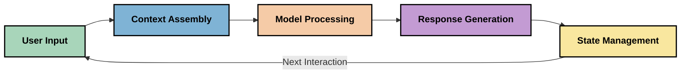
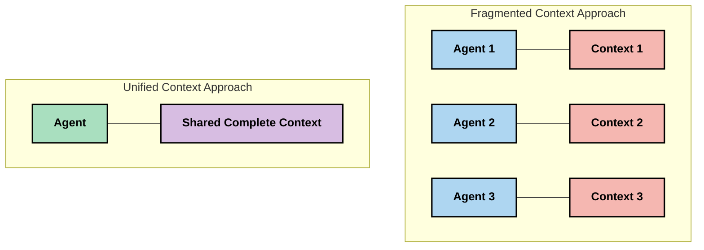
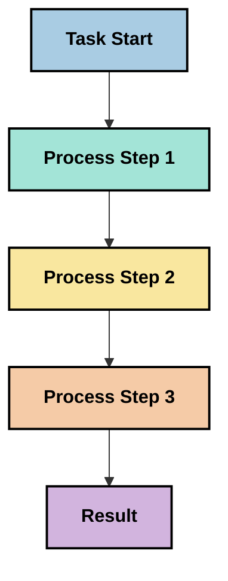
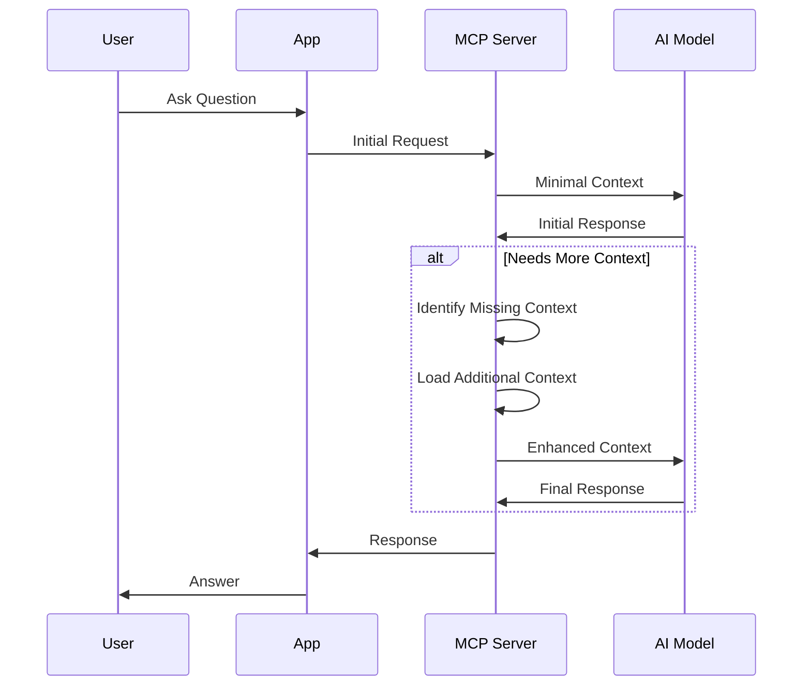
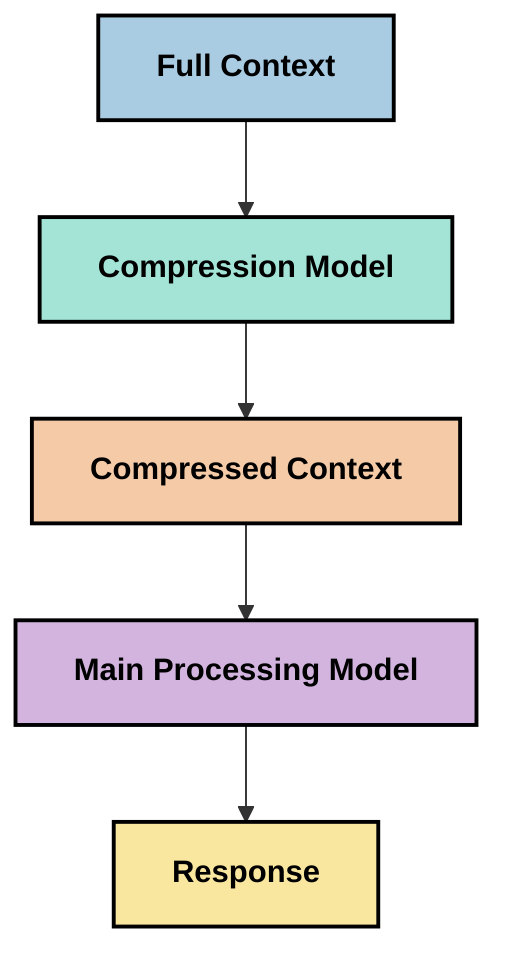

<!--
CO_OP_TRANSLATOR_METADATA:
{
  "original_hash": "fd169ca3071b81b5ee282e194bc823df",
  "translation_date": "2025-09-15T20:09:26+00:00",
  "source_file": "05-AdvancedTopics/mcp-contextengineering/README.md",
  "language_code": "mr"
}
-->
# संदर्भ अभियांत्रिकी: MCP परिसंस्थेमधील एक उदयोन्मुख संकल्पना

## आढावा

संदर्भ अभियांत्रिकी ही AI क्षेत्रातील एक नवीन संकल्पना आहे जी ग्राहक आणि AI सेवांमधील संवादादरम्यान माहिती कशी संरचित, वितरित आणि टिकवली जाते याचा अभ्यास करते. मॉडेल संदर्भ प्रोटोकॉल (MCP) परिसंस्थेचा विकास होत असताना, संदर्भ प्रभावीपणे व्यवस्थापित करण्याचे महत्त्व वाढत आहे. या मॉड्यूलमध्ये संदर्भ अभियांत्रिकीची संकल्पना आणि MCP अंमलबजावणींमध्ये तिच्या संभाव्य उपयोगांचा अभ्यास केला जातो.

## शिकण्याची उद्दिष्टे

या मॉड्यूलच्या शेवटी, तुम्ही खालील गोष्टी सक्षमपणे करू शकाल:

- संदर्भ अभियांत्रिकीची उदयोन्मुख संकल्पना आणि MCP अनुप्रयोगांमध्ये तिची संभाव्य भूमिका समजून घेणे
- MCP प्रोटोकॉल डिझाइनने संबोधित केलेल्या संदर्भ व्यवस्थापनातील प्रमुख आव्हाने ओळखणे
- चांगल्या संदर्भ हाताळणीद्वारे मॉडेल कार्यक्षमता सुधारण्यासाठी तंत्रांचा अभ्यास करणे
- संदर्भ प्रभावीपणा मोजण्यासाठी आणि मूल्यांकन करण्यासाठी दृष्टिकोन विचारात घेणे
- MCP फ्रेमवर्कद्वारे AI अनुभव सुधारण्यासाठी या उदयोन्मुख संकल्पनांचा उपयोग करणे

## संदर्भ अभियांत्रिकीची ओळख

संदर्भ अभियांत्रिकी ही वापरकर्ते, अनुप्रयोग आणि AI मॉडेल्स यांच्यातील माहिती प्रवाहाच्या विचारपूर्वक डिझाइन आणि व्यवस्थापनावर लक्ष केंद्रित करणारी एक नवीन संकल्पना आहे. प्रॉम्प्ट अभियांत्रिकीसारख्या स्थापित क्षेत्रांपेक्षा वेगळे, संदर्भ अभियांत्रिकी अद्याप व्यावसायिकांनी परिभाषित केली आहे कारण ते AI मॉडेल्सना योग्य वेळी योग्य माहिती प्रदान करण्याच्या अनोख्या आव्हानांवर काम करत आहेत.

जसे मोठ्या भाषा मॉडेल्स (LLMs) विकसित झाले आहेत, संदर्भाचे महत्त्व अधिक स्पष्ट झाले आहे. आपण प्रदान केलेल्या संदर्भाची गुणवत्ता, सुसंगती आणि रचना थेट मॉडेलच्या आउटपुटवर परिणाम करते. संदर्भ अभियांत्रिकी या नातेसंबंधाचा अभ्यास करते आणि प्रभावी संदर्भ व्यवस्थापनासाठी तत्त्वे विकसित करण्याचा प्रयत्न करते.

> "२०२५ मध्ये, उपलब्ध मॉडेल्स अत्यंत बुद्धिमान आहेत. पण जसे सर्वात हुशार माणूसही त्याला काय करायचे आहे याचा संदर्भ नसल्यास प्रभावीपणे काम करू शकत नाही... 'संदर्भ अभियांत्रिकी' ही प्रॉम्प्ट अभियांत्रिकीची पुढची पायरी आहे. हे गतिशील प्रणालीमध्ये स्वयंचलितपणे हे करण्याबद्दल आहे." — वाल्डन यान, कॉग्निशन AI

संदर्भ अभियांत्रिकीमध्ये खालील गोष्टींचा समावेश असू शकतो:

1. **संदर्भ निवड**: दिलेल्या कार्यासाठी कोणती माहिती संबंधित आहे हे ठरवणे
2. **संदर्भ संरचना**: मॉडेल समज वाढवण्यासाठी माहितीचे आयोजन करणे
3. **संदर्भ वितरण**: मॉडेल्सना माहिती कशी आणि कधी पाठवायची याचा अनुकूलन करणे
4. **संदर्भ देखभाल**: संदर्भाची स्थिती आणि कालांतराने त्याचा विकास व्यवस्थापित करणे
5. **संदर्भ मूल्यांकन**: संदर्भाच्या प्रभावीतेचे मोजमाप आणि सुधारणा करणे

या लक्ष केंद्रित क्षेत्रे MCP परिसंस्थेसाठी विशेषतः संबंधित आहेत, जी LLMs ला संदर्भ प्रदान करण्यासाठी एक प्रमाणित मार्ग प्रदान करते.

## संदर्भ प्रवासाचा दृष्टिकोन

संदर्भ अभियांत्रिकीचे दृश्य MCP प्रणालीमधील माहितीचा प्रवास कसा होतो हे ट्रेस करून पाहता येते:



### संदर्भ प्रवासातील प्रमुख टप्पे:

1. **वापरकर्ता इनपुट**: वापरकर्त्यांकडून आलेली कच्ची माहिती (मजकूर, प्रतिमा, दस्तऐवज)
2. **संदर्भ संकलन**: वापरकर्ता इनपुट, प्रणाली संदर्भ, संभाषण इतिहास आणि इतर पुनर्प्राप्त माहिती एकत्र करणे
3. **मॉडेल प्रक्रिया**: संकलित संदर्भावर AI मॉडेल प्रक्रिया करते
4. **प्रतिसाद निर्मिती**: मॉडेल प्रदान केलेल्या संदर्भावर आधारित आउटपुट तयार करते
5. **स्थिती व्यवस्थापन**: संवादाच्या आधारे प्रणाली तिची अंतर्गत स्थिती अद्यतनित करते

हा दृष्टिकोन AI प्रणालींमधील संदर्भाच्या गतिशील स्वरूपावर प्रकाश टाकतो आणि प्रत्येक टप्प्यावर माहिती कशी उत्तम प्रकारे व्यवस्थापित करावी याबद्दल महत्त्वाचे प्रश्न उपस्थित करतो.

## संदर्भ अभियांत्रिकीतील उदयोन्मुख तत्त्वे

संदर्भ अभियांत्रिकी क्षेत्र आकार घेत असताना, काही सुरुवातीची तत्त्वे व्यावसायिकांकडून समोर येत आहेत. ही तत्त्वे MCP अंमलबजावणी निवडींना माहिती देण्यास मदत करू शकतात:

### तत्त्व १: संदर्भ पूर्णपणे सामायिक करा

संदर्भ प्रणालीतील सर्व घटकांमध्ये पूर्णपणे सामायिक केला पाहिजे, तो अनेक एजंट्स किंवा प्रक्रियांमध्ये विखंडित होऊ नये. जेव्हा संदर्भ वितरित केला जातो, तेव्हा प्रणालीतील एका भागात घेतलेले निर्णय इतरत्र घेतलेल्या निर्णयांशी विरोधाभासी असू शकतात.



MCP अनुप्रयोगांमध्ये, याचा अर्थ संदर्भ संपूर्ण पाइपलाइनमध्ये अखंडपणे वाहतो याची खात्री करण्यासाठी प्रणाली डिझाइन करणे, तो विभागलेला न ठेवणे.

### तत्त्व २: कृतींमध्ये अंतर्निहित निर्णय असतात हे ओळखा

मॉडेल घेतलेली प्रत्येक कृती संदर्भ कसा समजायचा याबद्दल अंतर्निहित निर्णयांचा समावेश करते. जेव्हा अनेक घटक वेगवेगळ्या संदर्भांवर कार्य करतात, तेव्हा हे अंतर्निहित निर्णय विरोधाभासी असू शकतात, ज्यामुळे विसंगत परिणाम होतात.

या तत्त्वाचे MCP अनुप्रयोगांसाठी महत्त्वाचे परिणाम आहेत:
- विखंडित संदर्भासह समांतर अंमलबजावणीऐवजी जटिल कार्यांचे रेखीय प्रक्रिया प्राधान्य द्या
- सर्व निर्णय बिंदूंना समान संदर्भ माहिती उपलब्ध असल्याची खात्री करा
- नंतरच्या टप्प्यांना पूर्वीच्या निर्णयांचा पूर्ण संदर्भ दिसू शकेल अशा प्रकारे प्रणाली डिझाइन करा

### तत्त्व ३: संदर्भ खोली आणि विंडो मर्यादांमध्ये संतुलन राखा

संभाषणे आणि प्रक्रिया लांब होत गेल्याने संदर्भ विंडो अखेर भरून जाते. प्रभावी संदर्भ अभियांत्रिकी व्यापक संदर्भ आणि तांत्रिक मर्यादा यांच्यातील तणाव व्यवस्थापित करण्याच्या दृष्टिकोनांचा अभ्यास करते.

सध्या अभ्यासात असलेल्या संभाव्य दृष्टिकोनांमध्ये समाविष्ट आहे:
- टोकन वापर कमी करताना आवश्यक माहिती टिकवून ठेवणारे संदर्भ संक्षेपण
- वर्तमान गरजांशी संबंधिततेवर आधारित संदर्भाचे प्रगत लोडिंग
- महत्त्वाचे निर्णय आणि तथ्ये टिकवून ठेवताना मागील संवादांचे संक्षेपण

## संदर्भ आव्हाने आणि MCP प्रोटोकॉल डिझाइन

मॉडेल संदर्भ प्रोटोकॉल (MCP) संदर्भ व्यवस्थापनाच्या अनोख्या आव्हानांची जाणीव ठेवून डिझाइन केले गेले आहे. ही आव्हाने समजून घेणे MCP प्रोटोकॉल डिझाइनच्या प्रमुख पैलू स्पष्ट करण्यात मदत करते:

### आव्हान १: संदर्भ विंडो मर्यादा
बहुतेक AI मॉडेल्समध्ये निश्चित संदर्भ विंडो आकार असतो, ज्यामुळे ते एकावेळी किती माहिती प्रक्रिया करू शकतात यावर मर्यादा येते.

**MCP डिझाइन प्रतिसाद:** 
- प्रोटोकॉल संरचित, संसाधन-आधारित संदर्भाला समर्थन देते जो कार्यक्षमतेने संदर्भित केला जाऊ शकतो
- संसाधने पृष्ठांमध्ये विभागली जाऊ शकतात आणि प्रगत लोड केली जाऊ शकतात

### आव्हान २: संबंधितता निर्धारण
संदर्भात समाविष्ट करण्यासाठी कोणती माहिती सर्वात संबंधित आहे हे ठरवणे कठीण आहे.

**MCP डिझाइन प्रतिसाद:**
- लवचिक साधने गरजेनुसार माहितीचे गतिशील पुनर्प्राप्ती सक्षम करतात
- संरचित प्रॉम्प्ट्स सुसंगत संदर्भ आयोजन सक्षम करतात

### आव्हान ३: संदर्भ टिकवणे
संवादांमध्ये स्थिती व्यवस्थापित करणे संदर्भाचे काळजीपूर्वक ट्रॅकिंग आवश्यक करते.

**MCP डिझाइन प्रतिसाद:**
- प्रमाणित सत्र व्यवस्थापन
- संदर्भ विकासासाठी स्पष्टपणे परिभाषित संवाद नमुने

### आव्हान ४: मल्टी-मोडल संदर्भ
मजकूर, प्रतिमा, संरचित डेटा यासारख्या वेगवेगळ्या प्रकारच्या डेटासाठी वेगवेगळ्या हाताळणीची आवश्यकता असते.

**MCP डिझाइन प्रतिसाद:**
- प्रोटोकॉल डिझाइन विविध सामग्री प्रकारांना सामावून घेते
- मल्टी-मोडल माहितीचे प्रमाणित प्रतिनिधित्व

### आव्हान ५: सुरक्षा आणि गोपनीयता
संदर्भामध्ये संवेदनशील माहिती असते जी संरक्षित केली पाहिजे.

**MCP डिझाइन प्रतिसाद:**
- क्लायंट आणि सर्व्हर जबाबदाऱ्यांमधील स्पष्ट सीमा
- डेटा एक्सपोजर कमी करण्यासाठी स्थानिक प्रक्रिया पर्याय

ही आव्हाने आणि MCP त्यांना कसे संबोधित करते हे समजून घेणे अधिक प्रगत संदर्भ अभियांत्रिकी तंत्रांचा अभ्यास करण्यासाठी एक पाया प्रदान करते.

## संदर्भ अभियांत्रिकीतील उदयोन्मुख दृष्टिकोन

संदर्भ अभियांत्रिकी क्षेत्र विकसित होत असताना, अनेक आशादायक दृष्टिकोन समोर येत आहेत. हे स्थापित सर्वोत्तम पद्धतींऐवजी सध्याच्या विचारांचे प्रतिनिधित्व करतात आणि MCP अंमलबजावणीसह अधिक अनुभव मिळाल्याने विकसित होण्याची शक्यता आहे.

### १. सिंगल-थ्रेडेड रेखीय प्रक्रिया

संदर्भ वितरित करणाऱ्या मल्टी-एजंट आर्किटेक्चरच्या विरोधात, काही व्यावसायिकांना असे आढळले आहे की सिंगल-थ्रेडेड रेखीय प्रक्रिया अधिक सुसंगत परिणाम देते. हे एकत्रित संदर्भ राखण्याच्या तत्त्वाशी जुळते.



हा दृष्टिकोन समांतर प्रक्रियेपेक्षा कमी कार्यक्षम वाटू शकतो, परंतु प्रत्येक चरण पूर्वीच्या निर्णयांच्या संपूर्ण समजुतीवर आधारित असल्यामुळे तो अधिक सुसंगत आणि विश्वासार्ह परिणाम देतो.

### २. संदर्भ तुकडे करणे आणि प्राधान्य देणे

मोठ्या संदर्भांना व्यवस्थापनीय तुकड्यांमध्ये विभागणे आणि सर्वात महत्त्वाच्या गोष्टींना प्राधान्य देणे.

```python
# Conceptual Example: Context Chunking and Prioritization
def process_with_chunked_context(documents, query):
    # 1. Break documents into smaller chunks
    chunks = chunk_documents(documents)
    
    # 2. Calculate relevance scores for each chunk
    scored_chunks = [(chunk, calculate_relevance(chunk, query)) for chunk in chunks]
    
    # 3. Sort chunks by relevance score
    sorted_chunks = sorted(scored_chunks, key=lambda x: x[1], reverse=True)
    
    # 4. Use the most relevant chunks as context
    context = create_context_from_chunks([chunk for chunk, score in sorted_chunks[:5]])
    
    # 5. Process with the prioritized context
    return generate_response(context, query)
```

वरील संकल्पना मोठ्या दस्तऐवजांना व्यवस्थापनीय तुकड्यांमध्ये विभागून संदर्भासाठी सर्वात संबंधित भाग निवडण्याचा मार्ग स्पष्ट करते. हा दृष्टिकोन संदर्भ विंडो मर्यादांमध्ये काम करण्यास मदत करू शकतो आणि तरीही मोठ्या ज्ञानाच्या आधारांचा लाभ घेऊ शकतो.

### ३. प्रगत संदर्भ लोडिंग

संदर्भ सर्व एकाच वेळी लोड करण्याऐवजी आवश्यकतेनुसार प्रगत लोड करणे.



प्रगत संदर्भ लोडिंग किमान संदर्भासह सुरू होते आणि आवश्यकतेनुसारच विस्तारते. हे सोप्या क्वेरींसाठी टोकन वापर लक्षणीयरीत्या कमी करू शकते आणि तरीही जटिल प्रश्न हाताळण्याची क्षमता टिकवून ठेवते.

### ४. संदर्भ संक्षेपण आणि संक्षेप

आवश्यक माहिती टिकवून ठेवताना संदर्भाचा आकार कमी करणे.



संदर्भ संक्षेपण लक्ष केंद्रित करते:
- अनावश्यक माहिती काढून टाकणे
- लांब सामग्रीचे संक्षेप करणे
- महत्त्वाचे तथ्ये आणि तपशील काढणे
- महत्त्वाचे संदर्भ घटक टिकवून ठेवणे
- टोकन कार्यक्षमतेसाठी अनुकूलन करणे

हा दृष्टिकोन दीर्घ संभाषणांना संदर्भ विंडोमध्ये टिकवून ठेवण्यासाठी किंवा मोठ्या दस्तऐवजांची कार्यक्षमतेने प्रक्रिया करण्यासाठी विशेषतः उपयुक्त ठरू शकतो. काही व्यावसायिक संभाषण इतिहासाचे संदर्भ संक्षेपण आणि संक्षेप करण्यासाठी विशेष मॉडेल्स वापरत आहेत.

## शोधात्मक संदर्भ अभियांत्रिकी विचार

MCP अंमलबजावणीसह काम करताना संदर्भ अभियांत्रिकीच्या उदयोन्मुख क्षेत्राचा अभ्यास करताना काही विचार लक्षात ठेवण्यासारखे आहेत. हे प्रिस्क्रिप्टिव्ह सर्वोत्तम पद्धती नाहीत, परंतु तुमच्या विशिष्ट उपयोग प्रकरणात सुधारणा देऊ शकतील अशा शोध क्षेत्रे आहेत.

### तुमचे संदर्भ उद्दिष्ट विचारात घ्या

जटिल संदर्भ व्यवस्थापन उपाय अंमलात आणण्यापूर्वी, तुम्ही काय साध्य करण्याचा प्रयत्न करत आहात हे स्पष्टपणे मांडणे:
- मॉडेलला यशस्वी होण्यासाठी कोणती विशिष्ट माहिती आवश्यक आहे?
- कोणती माहिती आवश्यक आहे आणि पूरक आहे?
- तुमच्या कार्यक्षमता मर्यादा काय आहेत (विलंब, टोकन मर्यादा, खर्च)?

### स्तरित संदर्भ दृष्टिकोनांचा अभ्यास करा

काही व्यावसायिकांना संकल्पनात्मक स्तरांमध्ये व्यवस्थापित संदर्भासह यश मिळत आहे:
- **कोर स्तर**: मॉडेलला नेहमी आवश्यक असलेली आवश्यक माहिती
- **स्थितीजन्य स्तर**: वर्तमान संवादाशी संबंधित संदर्भ
- **समर्थन स्तर**: अतिरिक्त माहिती जी उपयुक्त असू शकते
- **फॉलबॅक स्तर**: आवश्यक असल्यासच प्रवेश केलेली माहिती

### पुनर्प्राप्ती रणनीतींचा अभ्यास करा

तुमच्या संदर्भाची प्रभावीता अनेकदा तुम्ही माहिती कशी पुनर्प्राप्त करता यावर अवलंबून असते:
- संकल्पनात्मकदृष्ट्या संबंधित माहिती शोधण्यासाठी सेमॅंटिक शोध आणि एम्बेडिंग्ज
- विशिष्ट तथ्यात्मक तपशीलांसाठी कीवर्ड-आधारित शोध
- अनेक पुनर्प्राप्ती पद्धती एकत्र करणारे हायब्रिड दृष्टिकोन
- श्रेणी, तारीख किंवा स्रोतांवर आधारित स्कोप कमी करण्यासाठी मेटाडेटा फिल्टरिंग

### संदर्भ सुसंगतीसह प्रयोग करा

तुमच्या संदर्भाची रचना आणि प्रवाह मॉडेल समजुतीवर परिणाम करू शकतो:
- संबंधित माहिती एकत्र गटबद्ध करणे
- सुसंगत स्वरूपन आणि आयोजन वापरणे
- योग्य ठिकाणी तार्किक किंवा कालक्रमानुसार क्रम राखणे
- विरोधाभासी माहिती टाळणे

### मल्टी-एजंट आर्किटेक्चरचे व्यापार विचारात घ्या

मल्टी-एजंट आर्किटेक्चर अनेक AI फ्रेमवर्कमध्ये लोकप्रिय असताना, संदर्भ व्यवस्थापनासाठी त्यांच्यासोबत महत्त्वपूर्ण आव्हाने येतात:
- संदर्भ विखंडन एजंट्समध्ये विसंगत निर्णय घेऊ शकते
- समांतर प्रक्रिया विरोधाभास निर्माण करू शकते ज्याचे निराकरण करणे कठीण आहे
- एजंट्समधील संवाद ओव्हरहेड कार्यक्षमता लाभ कमी करू शकतो
- सुसंगती टिकवण्यासाठी जटिल स्थिती व्यवस्थापन आवश्यक आहे

अनेक प्रकरणांमध्ये, विखंडित संदर्भासह अनेक विशेष एजंट्सपेक्षा व्यापक संदर्भ व्यवस्थापनासह एकल-एजंट दृष्टिकोन अधिक विश्वासार्ह परिणाम देऊ शकतो.

### मूल्यांकन पद्धती विकसित करा

संदर्भ अभियांत्रिकी वेळोवेळी सुधारण्यासाठी, तुम्ही यश कसे मोजाल याचा विचार करा:
- वेगवेगळ्या संदर्भ संरचनांचे A/B चाचणी
- टोकन वापर आणि प्रतिसाद वेळेचे निरीक्षण
- वापरकर्ता समाधान आणि कार्य पूर्णता दर ट्रॅक करणे
- संदर्भ रणनीती का आणि कधी अपयशी होतात याचे विश्लेषण करणे

हे विचार संदर्भ अभियांत्रिकी क्षेत्रातील सक्रिय शोध क्षेत्रांचे प्रतिनिधित्व करतात. क्षेत्र परिपक्व होत असताना, अधिक निश्चित नमुने आणि पद्धती उदयास येण्याची शक्यता आहे.

## संदर्भ प्रभावीतेचे मोजमाप: एक विकसित फ्रेमवर्क

संदर्भ अभियांत्रिकी एक संकल्पना म्हणून उदयास येत असताना, व्यावसायिक त्याची प्रभावीता कशी मोजता येईल याचा अभ्यास करत आहेत. अद्याप कोणतेही स्थापित फ्रेमवर्क अस्तित्वात नाही, परंतु विविध मेट्रिक्स विचारात घेतल्या जात आहेत ज्या भविष्यातील कामाला मार्गदर्शन करू शकतात.

### संभाव्य मोजमाप परिमाणे

#### १. इनपुट कार्यक्षमतेचे विचार

- **संदर्भ-ते-प्रतिसाद गुणोत्तर**: प्रतिसादाच्या आकाराच्या तुलनेत किती संदर्भ आवश्यक आहे?
- **टोकन उपयोग**: प्रदान केलेल्या संदर्भ टोकनपैकी किती प्रतिसादावर प्रभाव टाकतात?
- **संदर्भ कमी करणे**: कच्च्या माहितीचे किती प्रभावीपणे संक्षेपण करता येईल?


- [मॉडेल कॉन्टेक्स्ट प्रोटोकॉल वेबसाइट](https://modelcontextprotocol.io/)
- [मॉडेल कॉन्टेक्स्ट प्रोटोकॉल स्पेसिफिकेशन](https://github.com/modelcontextprotocol/modelcontextprotocol)
- [MCP दस्तऐवज](https://modelcontextprotocol.io/docs)
- [MCP C# SDK](https://github.com/modelcontextprotocol/csharp-sdk)
- [MCP Python SDK](https://github.com/modelcontextprotocol/python-sdk)
- [MCP TypeScript SDK](https://github.com/modelcontextprotocol/typescript-sdk)
- [MCP निरीक्षक](https://github.com/modelcontextprotocol/inspector) - MCP सर्व्हर साठी व्हिज्युअल टेस्टिंग टूल

### कॉन्टेक्स्ट इंजिनिअरिंग लेख
- [मल्टी-एजंट्स तयार करू नका: कॉन्टेक्स्ट इंजिनिअरिंगचे तत्त्व](https://cognition.ai/blog/dont-build-multi-agents) - वाल्डन यान यांचे कॉन्टेक्स्ट इंजिनिअरिंग तत्त्वांवरील विचार
- [एजंट्स तयार करण्यासाठी व्यावहारिक मार्गदर्शक](https://cdn.openai.com/business-guides-and-resources/a-practical-guide-to-building-agents.pdf) - प्रभावी एजंट डिझाइनसाठी OpenAI ची मार्गदर्शिका
- [प्रभावी एजंट्स तयार करणे](https://www.anthropic.com/engineering/building-effective-agents) - एजंट विकासासाठी Anthropic चा दृष्टिकोन

### संबंधित संशोधन
- [मोठ्या भाषा मॉडेल्ससाठी डायनॅमिक रिट्रीव्हल ऑग्मेंटेशन](https://arxiv.org/abs/2310.01487) - डायनॅमिक रिट्रीव्हल पद्धतींवरील संशोधन
- [मध्यभागी हरवले: भाषा मॉडेल्स लांब कॉन्टेक्स्ट्स कसे वापरतात](https://arxiv.org/abs/2307.03172) - कॉन्टेक्स्ट प्रक्रिया पद्धतींवरील महत्त्वाचे संशोधन
- [CLIP लेटेंट्ससह हायरार्किकल टेक्स्ट-कंडिशन्ड इमेज जनरेशन](https://arxiv.org/abs/2204.06125) - DALL-E 2 पेपर, कॉन्टेक्स्ट स्ट्रक्चरिंगवरील अंतर्दृष्टीसह
- [मोठ्या भाषा मॉडेल आर्किटेक्चरमध्ये कॉन्टेक्स्टची भूमिका शोधणे](https://aclanthology.org/2023.findings-emnlp.124/) - कॉन्टेक्स्ट हाताळणीवरील अलीकडील संशोधन
- [मल्टी-एजंट सहयोग: एक सर्वेक्षण](https://arxiv.org/abs/2304.03442) - मल्टी-एजंट सिस्टम्स आणि त्यांच्या आव्हानांवरील संशोधन

### अतिरिक्त संसाधने
- [कॉन्टेक्स्ट विंडो ऑप्टिमायझेशन तंत्र](https://learn.microsoft.com/en-us/azure/ai-services/openai/concepts/context-window)
- [प्रगत RAG तंत्र](https://www.microsoft.com/en-us/research/blog/retrieval-augmented-generation-rag-and-frontier-models/)
- [सेमॅंटिक कर्नल दस्तऐवज](https://github.com/microsoft/semantic-kernel)
- [कॉन्टेक्स्ट व्यवस्थापनासाठी AI टूलकिट](https://github.com/microsoft/aitoolkit)

## पुढे काय 

- [5.15 MCP कस्टम ट्रान्सपोर्ट](../mcp-transport/README.md)

---

**अस्वीकरण**:  
हा दस्तऐवज AI भाषांतर सेवा [Co-op Translator](https://github.com/Azure/co-op-translator) वापरून भाषांतरित करण्यात आला आहे. आम्ही अचूकतेसाठी प्रयत्नशील असलो तरी, कृपया लक्षात ठेवा की स्वयंचलित भाषांतरांमध्ये त्रुटी किंवा अचूकतेचा अभाव असू शकतो. मूळ भाषेतील दस्तऐवज हा अधिकृत स्रोत मानला जावा. महत्त्वाच्या माहितीसाठी, व्यावसायिक मानवी भाषांतराची शिफारस केली जाते. या भाषांतराचा वापर करून निर्माण होणाऱ्या कोणत्याही गैरसमज किंवा चुकीच्या अर्थासाठी आम्ही जबाबदार राहणार नाही.