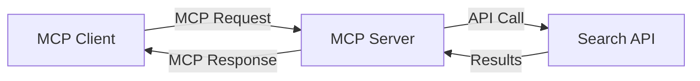
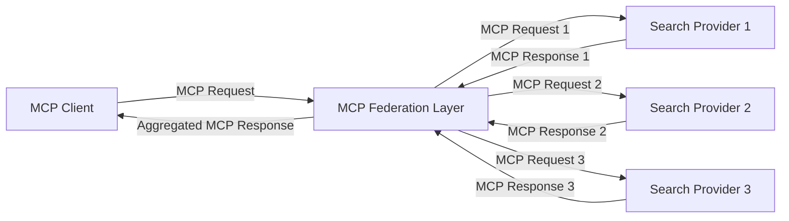
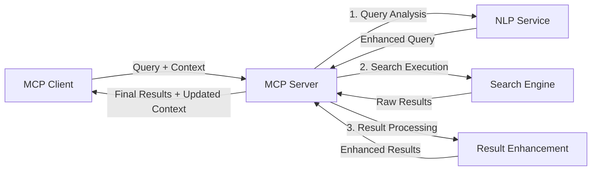

<!--
CO_OP_TRANSLATOR_METADATA:
{
  "original_hash": "eb12652eb7bd17f2193b835a344425c6",
  "translation_date": "2025-06-26T13:51:25+00:00",
  "source_file": "05-AdvancedTopics/mcp-realtimesearch/README.md",
  "language_code": "mr"
}
-->
## कोड उदाहरणांची सूचना

> **महत्त्वाची नोंद**: खालील कोड उदाहरणे Model Context Protocol (MCP) आणि वेब सर्च कार्यक्षमतेच्या एकत्रिकरणाचे प्रदर्शन करतात. ते अधिकृत MCP SDK च्या नमुन्यांचे अनुसरण करतात, पण शैक्षणिक हेतूने सोपे केले गेले आहेत.
> 
> या उदाहरणांमध्ये दाखवले आहे:
> 
> 1. **Python अंमलबजावणी**: FastMCP सर्व्हरची अंमलबजावणी जी वेब सर्च टूल पुरवते आणि बाह्य सर्च API शी कनेक्ट होते. हे उदाहरण योग्य आयुष्यकाल व्यवस्थापन, संदर्भ हाताळणी, आणि टूल अंमलबजावणी दाखवते, [अधिकृत MCP Python SDK](https://github.com/modelcontextprotocol/python-sdk) च्या नमुन्यांचे अनुसरण करून. सर्व्हर शिफारस केलेल्या Streamable HTTP ट्रान्सपोर्टचा वापर करतो जो जुन्या SSE ट्रान्सपोर्टच्या जागी उत्पादनासाठी वापरला जातो.
> 
> 2. **JavaScript अंमलबजावणी**: TypeScript/JavaScript मध्ये FastMCP नमुन्याचा वापर करून [अधिकृत MCP TypeScript SDK](https://github.com/modelcontextprotocol/typescript-sdk) मधील सर्च सर्व्हर तयार करणे, योग्य टूल व्याख्या आणि क्लायंट कनेक्शनसह. हे सत्र व्यवस्थापन आणि संदर्भ जतन करण्यासाठी शिफारस केलेल्या ताज्या पद्धतींचे अनुसरण करते.
> 
> या उदाहरणांमध्ये उत्पादन वापरासाठी अतिरिक्त त्रुटी हाताळणी, प्रमाणीकरण, आणि विशिष्ट API एकत्रीकरण कोड आवश्यक आहे. दाखवलेले सर्च API एंडपॉइंट (`https://api.search-service.example/search`) हे प्लेसहोल्डर आहेत आणि ते वास्तविक सर्च सेवा एंडपॉइंटसह बदलणे आवश्यक आहे.
> 
> पूर्ण अंमलबजावणी तपशील आणि अद्ययावत पद्धतींसाठी, कृपया [अधिकृत MCP तपशीलवार वर्णन](https://spec.modelcontextprotocol.io/) आणि SDK दस्तऐवज पहा.

## मुख्य संकल्पना

### Model Context Protocol (MCP) फ्रेमवर्क

MCP हे AI मॉडेल्स, अनुप्रयोग आणि सेवा यांच्यात संदर्भ आदान-प्रदान करण्यासाठी एक प्रमाणित मार्ग पुरवते. रिअल-टाइम वेब सर्चमध्ये, हा फ्रेमवर्क सुसंगत, बहु-टर्न सर्च अनुभव तयार करण्यासाठी अत्यावश्यक आहे. मुख्य घटकांमध्ये समाविष्ट आहेत:

1. **क्लायंट-सर्व्हर आर्किटेक्चर**: MCP सर्च क्लायंट (विनंती करणारे) आणि सर्च सर्व्हर (पुरवठादार) यांच्यात स्पष्ट विभागणी करतो, ज्यामुळे लवचिक तैनाती मॉडेल्स शक्य होतात.

2. **JSON-RPC संवाद**: हा प्रोटोकॉल JSON-RPC वापरतो, ज्यामुळे वेब तंत्रज्ञानांसह सुसंगत राहतो आणि विविध प्लॅटफॉर्मवर सहज अंमलात आणता येतो.

3. **संदर्भ व्यवस्थापन**: MCP बहु-परस्परसंवादांमध्ये सर्च संदर्भ राखण्यासाठी, अद्ययावत करण्यासाठी, आणि वापरण्यासाठी संरचित पद्धती परिभाषित करतो.

4. **टूल व्याख्या**: सर्च क्षमता प्रमाणित टूल्स म्हणून उघड केली जातात ज्यात स्पष्ट परिमाण आणि परतावा मूल्ये असतात.

5. **स्ट्रीमिंग समर्थन**: रिअल-टाइम सर्चसाठी आवश्यक असलेल्या परिणामांचे प्रगत स्वरूपात आगमन शक्य करणारे स्ट्रीमिंग समर्थित आहे.

### वेब सर्च एकत्रीकरण नमुने

MCP वेब सर्चसह एकत्रित करताना, काही नमुने दिसून येतात:

#### 1. थेट सर्च पुरवठादार एकत्रीकरण

या नमुन्यात, MCP सर्व्हर थेट एका किंवा अधिक सर्च API शी संवाद साधतो, MCP विनंत्यांना API-विशिष्ट कॉलमध्ये भाषांतरित करतो आणि परिणाम MCP प्रतिसादांमध्ये स्वरूपित करतो.

#### 2. संदर्भ जतन करणारे संघटित सर्च

हा नमुना अनेक MCP-सुसंगत सर्च पुरवठादारांमध्ये सर्च क्वेरीज वितरित करतो, ज्यापैकी प्रत्येक वेगवेगळ्या प्रकारच्या सामग्री किंवा सर्च क्षमतांमध्ये तज्ज्ञ असू शकतो, आणि एकसंध संदर्भ राखतो.

#### 3. संदर्भ समृद्ध सर्च साखळी

या नमुन्यात, सर्च प्रक्रिया अनेक टप्प्यांमध्ये विभागली जाते, प्रत्येक टप्प्यात संदर्भ समृद्ध होतो, ज्यामुळे परिणाम अधिकाधिक सुसंगत होतात.

### सर्च संदर्भ घटक

MCP-आधारित वेब सर्चमध्ये, संदर्भामध्ये सहसा समाविष्ट असते:

- **क्वेरी इतिहास**: सत्रातील मागील सर्च क्वेरीज
- **वापरकर्ता प्राधान्ये**: भाषा, प्रदेश, सुरक्षित सर्च सेटिंग्ज
- **परस्परसंवाद इतिहास**: कोणते परिणाम क्लिक केले गेले, परिणामांवर घालवलेला वेळ
- **सर्च परिमाण**: फिल्टर्स, सॉर्ट ऑर्डर, आणि इतर सर्च सुधारक
- **डोमेन ज्ञान**: सर्चशी संबंधित विषय-विशिष्ट संदर्भ
- **कालिक संदर्भ**: वेळेवर आधारित सुसंगतता घटक
- **स्त्रोत प्राधान्ये**: विश्वासार्ह किंवा प्राधान्य दिलेले माहिती स्त्रोत

## वापर प्रकरणे आणि अनुप्रयोग

### संशोधन आणि माहिती संकलन

MCP संशोधन कार्यप्रवाह सुधारते:

- संशोधन संदर्भ सत्रांमध्ये जतन करून
- अधिक प्रगत आणि संदर्भानुसार सुसंगत क्वेरीज सक्षम करून
- बहु-स्त्रोत सर्च संघटनाला समर्थन देऊन
- सर्च परिणामांमधून ज्ञान काढण्यास मदत करून

### रिअल-टाइम न्यूज आणि ट्रेंड मॉनिटरिंग

MCP-संचालित सर्च न्यूज मॉनिटरिंगसाठी फायदे देते:

- उदयोन्मुख बातम्या जवळजवळ रिअल-टाइममध्ये शोधणे
- संदर्भानुसार संबंधित माहिती फिल्टर करणे
- अनेक स्त्रोतांमध्ये विषय आणि घटक ट्रॅक करणे
- वापरकर्ता संदर्भावर आधारित वैयक्तिकृत न्यूज अलर्ट्स

### AI-संपादित ब्राउझिंग आणि संशोधन

MCP AI-संपादित ब्राउझिंगसाठी नवीन शक्यता निर्माण करतो:

- चालू ब्राउझर क्रियाकलापावर आधारित संदर्भानुसार सर्च सूचना
- वेब सर्चचे LLM-संचालित सहाय्यकांसह अखंड एकत्रीकरण
- संदर्भ राखून बहु-टर्न सर्च सुधारणा
- तथ्य तपासणी आणि माहिती सत्यापन वाढवणे

## भविष्यातील ट्रेंड्स आणि नवकल्पना

### वेब सर्चमधील MCP चा विकास

आगामी काळात, MCP या बाबतीत प्रगती करेल:

- **मल्टिमॉडल सर्च**: मजकूर, प्रतिमा, ऑडिओ, आणि व्हिडिओ सर्च संदर्भ राखून एकत्र करणे
- **विकेंद्रित सर्च**: वितरित आणि संघटित सर्च परिसंस्था समर्थित करणे
- **सर्च गोपनीयता**: संदर्भ-आधारित गोपनीयता राखणारे सर्च तंत्र
- **क्वेरी समजूतदारपणा**: नैसर्गिक भाषा सर्च क्वेरीजचे खोल अर्थपूर्ण विश्लेषण

### तंत्रज्ञानातील संभाव्य प्रगती

भविष्यात MCP सर्च आकार देणारी उदयोन्मुख तंत्रज्ञान:

1. **न्यूरल सर्च आर्किटेक्चर्स**: MCP साठी अनुकूल केलेले एम्बेडिंग-आधारित सर्च सिस्टम
2. **वैयक्तिकृत सर्च संदर्भ**: वापरकर्त्यांच्या सर्च पद्धती वेळेनुसार शिकणे
3. **ज्ञान ग्राफ एकत्रीकरण**: डोमेन-विशिष्ट ज्ञान ग्राफ्सद्वारे संदर्भ समृद्ध सर्च
4. **क्रॉस-मॉडल संदर्भ**: वेगवेगळ्या सर्च प्रकारांमध्ये संदर्भ राखणे

## प्रायोगिक सराव

### सराव 1: मूलभूत MCP सर्च पाइपलाइन सेटअप करणे

या सरावात, आपण शिकाल:

- मूलभूत MCP सर्च वातावरण कसे कॉन्फिगर करावे
- वेब सर्चसाठी संदर्भ हँडलर्स कसे अंमलात आणावे
- सर्च पुनरावृत्त्यांमध्ये संदर्भ जतन कसा तपासावा आणि पडताळावा

### सराव 2: MCP सर्चसह संशोधन सहाय्यक तयार करणे

पूर्ण अनुप्रयोग तयार करा जे:

- नैसर्गिक भाषा संशोधन प्रश्न प्रक्रिया करते
- संदर्भानुसार वेब सर्च करते
- अनेक स्त्रोतांमधून माहिती संकलित करते
- संघटित संशोधन निष्कर्ष सादर करते

### सराव 3: MCP सह बहु-स्त्रोत सर्च संघटन अंमलबजावणी

प्रगत सराव ज्यात समाविष्ट आहे:

- संदर्भानुसार क्वेरी अनेक सर्च इंजिनवर पाठवणे
- परिणामांचे रँकिंग आणि एकत्रीकरण
- सर्च परिणामांची संदर्भानुसार डुप्लिकेट काढणी
- स्त्रोत-विशिष्ट मेटाडेटा हाताळणी

## अतिरिक्त संसाधने

- [Model Context Protocol Specification](https://spec.modelcontextprotocol.io/) - अधिकृत MCP तपशीलवार वर्णन आणि प्रोटोकॉल दस्तऐवज
- [Model Context Protocol Documentation](https://modelcontextprotocol.io/) - तपशीलवार ट्युटोरियल्स आणि अंमलबजावणी मार्गदर्शक
- [MCP Python SDK](https://github.com/modelcontextprotocol/python-sdk) - MCP प्रोटोकॉलचे अधिकृत Python अंमलबजावणी
- [MCP TypeScript SDK](https://github.com/modelcontextprotocol/typescript-sdk) - MCP प्रोटोकॉलचे अधिकृत TypeScript अंमलबजावणी
- [MCP Reference Servers](https://github.com/modelcontextprotocol/servers) - MCP सर्व्हरची संदर्भ अंमलबजावणी
- [Bing Web Search API Documentation](https://learn.microsoft.com/en-us/bing/search-apis/bing-web-search/overview) - मायक्रोसॉफ्टची वेब सर्च API
- [Google Custom Search JSON API](https://developers.google.com/custom-search/v1/overview) - गुगलची प्रोग्रामेबल सर्च इंजिन
- [SerpAPI Documentation](https://serpapi.com/search-api) - सर्च इंजिन परिणाम पृष्ठ API
- [Meilisearch Documentation](https://www.meilisearch.com/docs) - मुक्त स्रोत सर्च इंजिन
- [Elasticsearch Documentation](https://www.elastic.co/guide/index.html) - वितरित सर्च आणि विश्लेषण इंजिन
- [LangChain Documentation](https://python.langchain.com/docs/get_started/introduction) - LLMs सह अनुप्रयोग तयार करणे

## शिकण्याचे परिणाम

हा मॉड्यूल पूर्ण केल्यावर, आपण सक्षम असाल:

- रिअल-टाइम वेब सर्चच्या मूलभूत तत्त्वे आणि त्याच्या आव्हानांची समज
- Model Context Protocol (MCP) कसे रिअल-टाइम वेब सर्च क्षमता सुधारते हे समजावणे
- लोकप्रिय फ्रेमवर्क आणि API वापरून MCP-आधारित सर्च सोल्यूशन्सची अंमलबजावणी करणे
- MCP सह स्केलेबल, उच्च कार्यक्षमता असलेल्या सर्च आर्किटेक्चर डिझाइन आणि तैनात करणे
- MCP संकल्पना विविध वापर प्रकरणांमध्ये लागू करणे, जसे की सेमँटिक सर्च, संशोधन सहाय्यक, आणि AI-संपादित ब्राउझिंग
- MCP-आधारित सर्च तंत्रज्ञानातील उदयोन्मुख ट्रेंड्स आणि भविष्यातील नवकल्पना मूल्यांकन करणे

### विश्वास आणि सुरक्षितता बाबतीत विचार

MCP-आधारित वेब सर्च सोल्यूशन्स अंमलात आणताना, MCP तपशीलवार वर्णनातील खालील महत्त्वाच्या तत्त्वांचा विचार करा:

1. **वापरकर्ता संमती आणि नियंत्रण**: वापरकर्त्यांनी सर्व डेटा प्रवेश आणि ऑपरेशन्ससाठी स्पष्ट संमती दिली पाहिजे आणि ते समजले पाहिजे. विशेषतः वेब सर्च अंमलबजावणीसाठी जे बाह्य डेटा स्रोतांमध्ये प्रवेश करू शकतात.

2. **डेटा गोपनीयता**: सर्च क्वेरीज आणि परिणामांचा योग्य हाताळणी करणे, विशेषतः जे संवेदनशील माहिती असू शकते. वापरकर्ता डेटाचे संरक्षण करण्यासाठी योग्य प्रवेश नियंत्रण अंमलात आणा.

3. **टूल सुरक्षितता**: सर्च टूल्ससाठी योग्य अधिकृतता आणि प्रमाणीकरण अंमलात आणा, कारण ते मनमानी कोड अंमलबजावणीमुळे संभाव्य सुरक्षा धोके असू शकतात. टूलचे वर्णन अविश्वसनीय मानावे जोपर्यंत ते विश्वसनीय सर्व्हरकडून मिळाले नाही.

4. **स्पष्ट दस्तऐवजीकरण**: आपल्या MCP-आधारित सर्च अंमलबजावणीच्या क्षमता, मर्यादा, आणि सुरक्षा बाबत स्पष्ट दस्तऐवजीकरण पुरवा, MCP तपशीलवार वर्णनातील अंमलबजावणी मार्गदर्शकांचे पालन करून.

5. **मजबूत संमती प्रक्रिया**: प्रत्येक टूल वापरण्यापूर्वी त्याचे काय कार्य आहे हे स्पष्टपणे सांगणारे मजबूत संमती आणि अधिकृतता प्रवाह तयार करा, विशेषतः जे बाह्य वेब संसाधनांशी संवाद साधतात.

MCP सुरक्षा आणि विश्वास व सुरक्षितता बाबतीत पूर्ण तपशीलांसाठी, कृपया [अधिकृत दस्तऐवज](https://modelcontextprotocol.io/specification/2025-03-26#security-and-trust-%26-safety) पहा.

## पुढे काय

- [5.11 Model Context Protocol सर्व्हरसाठी Entra ID प्रमाणीकरण](../mcp-security-entra/README.md)

**अस्वीकरण**:  
हा दस्तऐवज AI अनुवाद सेवा [Co-op Translator](https://github.com/Azure/co-op-translator) वापरून अनुवादित केला आहे. आम्ही अचूकतेसाठी प्रयत्नशील असलो तरी, कृपया लक्षात ठेवा की स्वयंचलित अनुवादांमध्ये चुका किंवा अचूकतेची कमतरता असू शकते. मूळ दस्तऐवज त्याच्या मूळ भाषेत अधिकृत स्रोत मानला पाहिजे. महत्त्वाच्या माहितीसाठी व्यावसायिक मानवी अनुवाद करण्याचा सल्ला दिला जातो. या अनुवादाच्या वापरामुळे उद्भवणाऱ्या कोणत्याही गैरसमजुती किंवा चुकीच्या अर्थलागी आम्ही जबाबदार नाही.