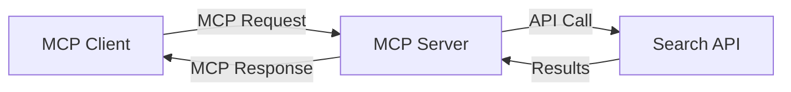
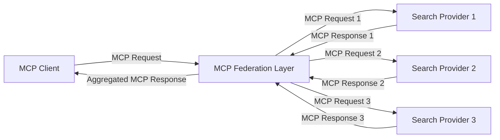
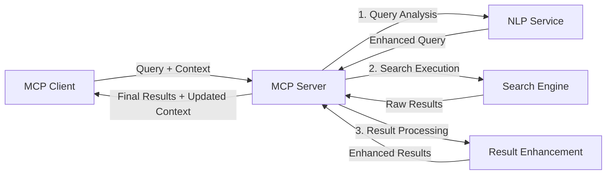

<!--
CO_OP_TRANSLATOR_METADATA:
{
  "original_hash": "333a03e51f90bdf3e6f1ba1694c73f36",
  "translation_date": "2025-07-17T00:24:48+00:00",
  "source_file": "05-AdvancedTopics/mcp-realtimesearch/README.md",
  "language_code": "mr"
}
-->
## कोड उदाहरणांची सूचना

> **महत्त्वाची नोंद**: खालील कोड उदाहरणे Model Context Protocol (MCP) च्या वेब सर्च कार्यक्षमतेशी एकत्रीकरण कसे करतात हे दाखवतात. ही उदाहरणे अधिकृत MCP SDK च्या पॅटर्न आणि रचनेचे अनुसरण करतात, पण शैक्षणिक उद्देशांसाठी सोपी केली आहेत.
> 
> या उदाहरणांमध्ये दाखवले आहे:
> 
> 1. **Python अंमलबजावणी**: FastMCP सर्व्हरची अंमलबजावणी जी वेब सर्च टूल पुरवते आणि बाह्य सर्च API शी कनेक्ट होते. हे उदाहरण योग्य आयुष्यकाल व्यवस्थापन, संदर्भ हाताळणी, आणि टूल अंमलबजावणी दाखवते, जे [अधिकृत MCP Python SDK](https://github.com/modelcontextprotocol/python-sdk) च्या पॅटर्ननुसार आहे. सर्व्हरने शिफारस केलेला Streamable HTTP ट्रान्सपोर्ट वापरला आहे, जो जुन्या SSE ट्रान्सपोर्टच्या जागी उत्पादनासाठी वापरला जातो.
> 
> 2. **JavaScript अंमलबजावणी**: TypeScript/JavaScript मध्ये FastMCP पॅटर्न वापरून [अधिकृत MCP TypeScript SDK](https://github.com/modelcontextprotocol/typescript-sdk) नुसार सर्च सर्व्हर तयार करणे, योग्य टूल व्याख्या आणि क्लायंट कनेक्शन्ससह. हे सत्र व्यवस्थापन आणि संदर्भ जपण्यासाठी नवीनतम शिफारस केलेले पॅटर्न अनुसरते.
> 
> या उदाहरणांमध्ये उत्पादन वापरासाठी अतिरिक्त त्रुटी हाताळणी, प्रमाणीकरण, आणि विशिष्ट API एकत्रीकरण कोड आवश्यक आहे. दाखवलेले सर्च API एंडपॉइंट (`https://api.search-service.example/search`) हे प्लेसहोल्डर आहेत आणि प्रत्यक्ष सर्च सेवा एंडपॉइंटने बदलणे आवश्यक आहे.
> 
> पूर्ण अंमलबजावणी तपशील आणि सर्वात अद्ययावत पद्धतींसाठी कृपया [अधिकृत MCP स्पेसिफिकेशन](https://spec.modelcontextprotocol.io/) आणि SDK दस्तऐवज पहा.

## मुख्य संकल्पना

### Model Context Protocol (MCP) फ्रेमवर्क

मूलत: Model Context Protocol AI मॉडेल्स, अनुप्रयोग, आणि सेवा यांच्यात संदर्भ विनिमय करण्याचा एक प्रमाणित मार्ग पुरवतो. रिअल-टाइम वेब सर्चमध्ये, हा फ्रेमवर्क सुसंगत, बहु-चरणीय सर्च अनुभव तयार करण्यासाठी अत्यावश्यक आहे. मुख्य घटकांमध्ये समाविष्ट आहेत:

1. **क्लायंट-सर्व्हर आर्किटेक्चर**: MCP सर्च क्लायंट्स (विनंती करणारे) आणि सर्च सर्व्हर्स (पुरवठादार) यांच्यात स्पष्ट विभाजन करतो, ज्यामुळे लवचिक तैनाती मॉडेल्स शक्य होतात.

2. **JSON-RPC संवाद**: हा प्रोटोकॉल संदेश विनिमयासाठी JSON-RPC वापरतो, ज्यामुळे वेब तंत्रज्ञानांसोबत सुसंगतता आणि विविध प्लॅटफॉर्मवर सुलभ अंमलबजावणी होते.

3. **संदर्भ व्यवस्थापन**: MCP अनेक संवादांमध्ये सर्च संदर्भ राखण्यासाठी, अद्ययावत करण्यासाठी, आणि वापरण्यासाठी संरचित पद्धती परिभाषित करतो.

4. **टूल व्याख्या**: सर्च क्षमता प्रमाणित टूल्स म्हणून उघडकीस आणल्या जातात ज्यात स्पष्ट परिमाणे आणि परतावा मूल्ये असतात.

5. **स्ट्रीमिंग समर्थन**: प्रोटोकॉल स्ट्रीमिंग परिणामांना समर्थन देतो, जे रिअल-टाइम सर्चसाठी आवश्यक आहे जिथे परिणाम क्रमाक्रमाने येऊ शकतात.

### वेब सर्च एकत्रीकरण पॅटर्न

MCP वेब सर्चसह एकत्र करताना, काही पॅटर्न दिसून येतात:

#### 1. थेट सर्च पुरवठादार एकत्रीकरण

या पॅटर्नमध्ये, MCP सर्व्हर थेट एका किंवा अधिक सर्च API शी संवाद साधतो, MCP विनंत्यांना API-विशिष्ट कॉलमध्ये रूपांतरित करतो आणि परिणाम MCP प्रतिसादांमध्ये स्वरूपित करतो.

#### 2. संदर्भ जपणाऱ्या फेडरेटेड सर्च

हा पॅटर्न अनेक MCP-सुसंगत सर्च पुरवठादारांमध्ये सर्च क्वेरीज वितरित करतो, जे वेगवेगळ्या प्रकारच्या सामग्री किंवा सर्च क्षमतांमध्ये विशेष असू शकतात, आणि एकसंध संदर्भ राखतो.

#### 3. संदर्भ-संपन्न सर्च चेन

या पॅटर्नमध्ये, सर्च प्रक्रिया अनेक टप्प्यांमध्ये विभागली जाते, प्रत्येक टप्प्यात संदर्भ समृद्ध केला जातो, ज्यामुळे हळूहळू अधिक संबंधित परिणाम मिळतात.

### सर्च संदर्भ घटक

MCP-आधारित वेब सर्चमध्ये, संदर्भ सामान्यतः यांचा समावेश करतो:

- **क्वेरी इतिहास**: सत्रातील मागील सर्च क्वेरीज
- **वापरकर्ता प्राधान्ये**: भाषा, प्रदेश, सुरक्षित सर्च सेटिंग्ज
- **परस्परसंवाद इतिहास**: कोणते परिणाम क्लिक केले गेले, परिणामांवर घालवलेला वेळ
- **सर्च परिमाणे**: फिल्टर्स, क्रमवारी, आणि इतर सर्च सुधारक
- **डोमेन ज्ञान**: सर्चशी संबंधित विषय-विशिष्ट संदर्भ
- **कालिक संदर्भ**: वेळ-आधारित प्रासंगिकता घटक
- **स्रोत प्राधान्ये**: विश्वासार्ह किंवा प्राधान्य दिलेले माहिती स्रोत

## वापर प्रकरणे आणि अनुप्रयोग

### संशोधन आणि माहिती संकलन

MCP संशोधन कार्यप्रवाह सुधारतो:

- संशोधन संदर्भ सत्रांमध्ये जपणे
- अधिक प्रगत आणि संदर्भानुसार संबंधित क्वेरीज सक्षम करणे
- बहु-स्रोत सर्च फेडरेशनला समर्थन देणे
- सर्च परिणामांमधून ज्ञान काढणे सुलभ करणे

### रिअल-टाइम बातम्या आणि ट्रेंड मॉनिटरिंग

MCP-शक्तीशाली सर्च बातम्या मॉनिटरिंगसाठी फायदे देते:

- उदयोन्मुख बातम्या जवळजवळ रिअल-टाइममध्ये शोधणे
- संबंधित माहितीचे संदर्भानुसार फिल्टरिंग
- अनेक स्रोतांमध्ये विषय आणि घटक ट्रॅकिंग
- वापरकर्ता संदर्भावर आधारित वैयक्तिकृत बातमी सूचना

### AI-समृद्ध ब्राउझिंग आणि संशोधन

MCP AI-समृद्ध ब्राउझिंगसाठी नवीन शक्यता निर्माण करतो:

- चालू ब्राउझर क्रियाकलापावर आधारित संदर्भानुसार सर्च सूचना
- वेब सर्चचे LLM-शक्तीशाली सहाय्यकांसह अखंड एकत्रीकरण
- संदर्भ राखून बहु-चरणीय सर्च सुधारणा
- तथ्य तपासणी आणि माहिती पडताळणी सुधारित करणे

## भविष्यातील प्रवाह आणि नवकल्पना

### वेब सर्चमधील MCP चा विकास

पुढे पाहता, आम्ही MCP च्या विकासाची अपेक्षा करतो ज्यात:

- **मल्टीमॉडल सर्च**: मजकूर, प्रतिमा, ऑडिओ, आणि व्हिडिओ सर्चचे संदर्भ जपून एकत्रीकरण
- **विकेंद्रीकृत सर्च**: वितरित आणि फेडरेटेड सर्च परिसंस्थांना समर्थन
- **शोध गोपनीयता**: संदर्भ-जाणणाऱ्या गोपनीयता राखणाऱ्या शोध यंत्रणा  
- **प्रश्न समजून घेणे**: नैसर्गिक भाषेतील शोध प्रश्नांचे सखोल अर्थपूर्ण विश्लेषण  

### तंत्रज्ञानातील संभाव्य प्रगती  

उभरत असलेली तंत्रज्ञान जी MCP शोधाच्या भविष्यात आकार देणार आहेत:  

1. **न्यूरल शोध आर्किटेक्चर**: MCP साठी अनुकूलित एम्बेडिंग-आधारित शोध प्रणाली  
2. **वैयक्तिकृत शोध संदर्भ**: वेळोवेळी वैयक्तिक वापरकर्त्यांच्या शोध पद्धती शिकणे  
3. **ज्ञान ग्राफ एकत्रीकरण**: क्षेत्रविशिष्ट ज्ञान ग्राफद्वारे संदर्भात्मक शोध सुधारित करणे  
4. **क्रॉस-मोडल संदर्भ**: वेगवेगळ्या शोध प्रकारांमध्ये संदर्भ राखणे  

## प्रत्यक्ष सराव  

### सराव 1: मूलभूत MCP शोध पाइपलाइन सेटअप करणे  

या सरावात, तुम्ही शिकाल कसे:  
- मूलभूत MCP शोध वातावरण कॉन्फिगर करायचे  
- वेब शोधासाठी संदर्भ हँडलर्स अंमलात आणायचे  
- शोध पुनरावृत्त्यांमध्ये संदर्भ जपण्याची चाचणी आणि पडताळणी करायची  

### सराव 2: MCP शोधासह संशोधन सहाय्यक तयार करणे  

पूर्ण अ‍ॅप्लिकेशन तयार करा जे:  
- नैसर्गिक भाषेतील संशोधन प्रश्न प्रक्रिया करते  
- संदर्भ-जाणणाऱ्या वेब शोध करतो  
- अनेक स्रोतांमधून माहिती संकलित करतो  
- संघटित संशोधन निष्कर्ष सादर करतो  

### सराव 3: MCP सह बहु-स्रोत शोध फेडरेशन अंमलात आणणे  

प्रगत सराव ज्यामध्ये समाविष्ट आहे:  
- संदर्भ-जाणणाऱ्या प्रश्नांचे अनेक शोध इंजिनांकडे वितरण  
- निकालांचे क्रमांकन आणि संकलन  
- शोध निकालांचे संदर्भात्मक पुनरावृत्ती टाळणे  
- स्रोत-विशिष्ट मेटाडेटा हाताळणे  

## अतिरिक्त संसाधने  

- [Model Context Protocol Specification](https://spec.modelcontextprotocol.io/) - अधिकृत MCP तपशील आणि सविस्तर प्रोटोकॉल दस्तऐवज  
- [Model Context Protocol Documentation](https://modelcontextprotocol.io/) - सविस्तर ट्युटोरियल्स आणि अंमलबजावणी मार्गदर्शक  
- [MCP Python SDK](https://github.com/modelcontextprotocol/python-sdk) - MCP प्रोटोकॉलची अधिकृत Python अंमलबजावणी  
- [MCP TypeScript SDK](https://github.com/modelcontextprotocol/typescript-sdk) - MCP प्रोटोकॉलची अधिकृत TypeScript अंमलबजावणी  
- [MCP Reference Servers](https://github.com/modelcontextprotocol/servers) - MCP सर्व्हरची संदर्भ अंमलबजावणी  
- [Bing Web Search API Documentation](https://learn.microsoft.com/en-us/bing/search-apis/bing-web-search/overview) - Microsoft चे वेब शोध API  
- [Google Custom Search JSON API](https://developers.google.com/custom-search/v1/overview) - Google चे प्रोग्रामेबल शोध इंजिन  
- [SerpAPI Documentation](https://serpapi.com/search-api) - शोध इंजिन निकाल पृष्ठ API  
- [Meilisearch Documentation](https://www.meilisearch.com/docs) - मुक्त स्रोत शोध इंजिन  
- [Elasticsearch Documentation](https://www.elastic.co/guide/index.html) - वितरित शोध आणि विश्लेषण इंजिन  
- [LangChain Documentation](https://python.langchain.com/docs/get_started/introduction) - LLM वापरून अ‍ॅप्लिकेशन्स तयार करणे  

## शिकण्याचे परिणाम  

हा मॉड्यूल पूर्ण केल्यावर, तुम्ही सक्षम असाल:  

- रिअल-टाइम वेब शोध आणि त्याच्या आव्हानांची मूलतत्त्वे समजून घेणे  
- Model Context Protocol (MCP) कसे रिअल-टाइम वेब शोध क्षमता वाढवते हे स्पष्ट करणे  
- लोकप्रिय फ्रेमवर्क्स आणि API वापरून MCP-आधारित शोध उपाय अंमलात आणणे  
- MCP सह स्केलेबल, उच्च-कार्यक्षम शोध आर्किटेक्चर डिझाइन आणि तैनात करणे  
- MCP संकल्पना विविध वापर प्रकरणांमध्ये लागू करणे जसे की अर्थपूर्ण शोध, संशोधन सहाय्यक, आणि AI-समृद्ध ब्राउझिंग  
- MCP-आधारित शोध तंत्रज्ञानातील उदयोन्मुख ट्रेंड आणि भविष्यातील नवकल्पना मूल्यांकन करणे  

### विश्वास आणि सुरक्षा विचार  

MCP-आधारित वेब शोध उपाय अंमलात आणताना, MCP तपशीलातील खालील महत्त्वाच्या तत्त्वांची आठवण ठेवा:  

1. **वापरकर्ता संमती आणि नियंत्रण**: वापरकर्त्यांनी सर्व डेटा प्रवेश आणि ऑपरेशन्ससाठी स्पष्ट संमती द्यावी आणि समजून घ्यावी. हे विशेषतः वेब शोध अंमलबजावणीसाठी महत्त्वाचे आहे जिथे बाह्य डेटा स्रोतांमध्ये प्रवेश होऊ शकतो.  

2. **डेटा गोपनीयता**: शोध प्रश्न आणि निकाल योग्य प्रकारे हाताळा, विशेषतः जेव्हा त्यात संवेदनशील माहिती असू शकते. वापरकर्ता डेटाचे संरक्षण करण्यासाठी योग्य प्रवेश नियंत्रण लागू करा.  

3. **साधनांची सुरक्षा**: शोध साधनांसाठी योग्य अधिकृतता आणि पडताळणी करा, कारण त्यातून मनमानी कोड अंमलबजावणीमुळे सुरक्षा धोके उद्भवू शकतात. साधनांच्या वर्तनाचे वर्णन अविश्वसनीय समजावे जोपर्यंत ते विश्वासार्ह सर्व्हरकडून मिळालेले नाहीत.  

4. **स्पष्ट दस्तऐवजीकरण**: तुमच्या MCP-आधारित शोध अंमलबजावणीच्या क्षमता, मर्यादा आणि सुरक्षा विचारांची स्पष्ट माहिती द्या, MCP तपशीलातील अंमलबजावणी मार्गदर्शकांचे पालन करत.  

5. **मजबूत संमती प्रक्रिया**: प्रत्येक साधन काय करते हे स्पष्टपणे समजावून सांगणाऱ्या मजबूत संमती आणि अधिकृतता प्रक्रिया तयार करा, विशेषतः जेव्हा साधने बाह्य वेब संसाधनांशी संवाद साधतात.  

MCP सुरक्षा आणि विश्वास व सुरक्षा विचारांसाठी संपूर्ण तपशीलासाठी, [अधिकृत दस्तऐवज](https://modelcontextprotocol.io/specification/2025-03-26#security-and-trust-%26-safety) पहा.  

## पुढे काय  

- [5.12 Entra ID Authentication for Model Context Protocol Servers](../mcp-security-entra/README.md)

**अस्वीकरण**:  
हा दस्तऐवज AI अनुवाद सेवा [Co-op Translator](https://github.com/Azure/co-op-translator) वापरून अनुवादित केला आहे. आम्ही अचूकतेसाठी प्रयत्नशील असलो तरी, कृपया लक्षात घ्या की स्वयंचलित अनुवादांमध्ये चुका किंवा अचूकतेचा अभाव असू शकतो. मूळ दस्तऐवज त्याच्या स्थानिक भाषेत अधिकृत स्रोत मानला जावा. महत्त्वाच्या माहितीसाठी व्यावसायिक मानवी अनुवाद करण्याची शिफारस केली जाते. या अनुवादाच्या वापरामुळे उद्भवलेल्या कोणत्याही गैरसमजुती किंवा चुकीच्या अर्थलागी आम्ही जबाबदार नाही.