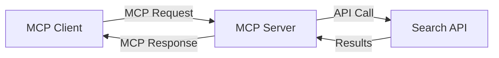
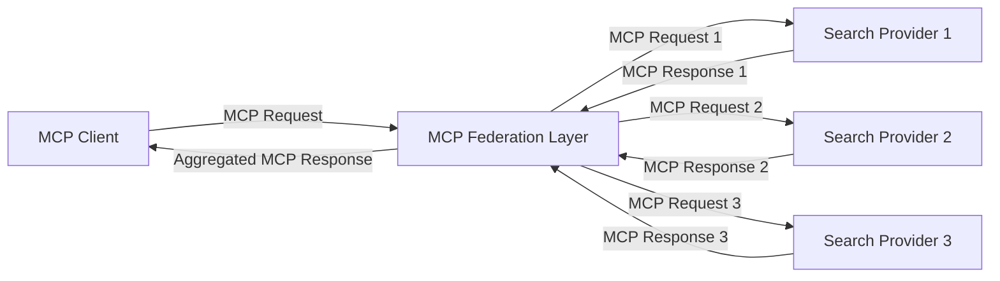
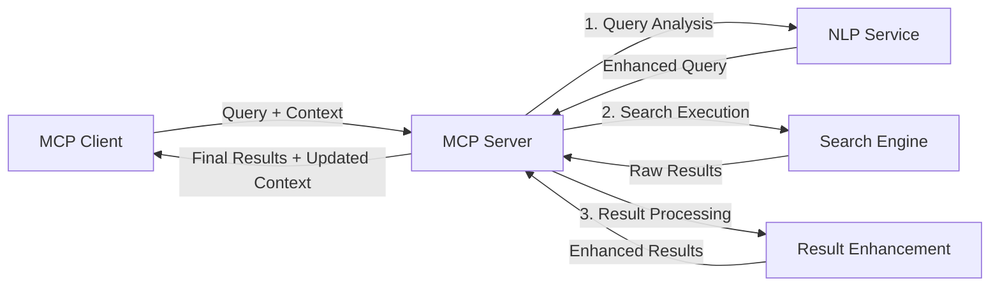

<!--
CO_OP_TRANSLATOR_METADATA:
{
  "original_hash": "16bef2c93c6a86d4ca6a8ce9e120e384",
  "translation_date": "2025-06-13T02:39:48+00:00",
  "source_file": "05-AdvancedTopics/mcp-realtimesearch/README.md",
  "language_code": "mr"
}
-->
## कोड उदाहरणांची सूचना

> **महत्त्वाची टीप**: खालील कोड उदाहरणे Model Context Protocol (MCP) चा वेब सर्च कार्यक्षमतेशी एकत्रीकरण दर्शवितात. ही उदाहरणे अधिकृत MCP SDK च्या नमुन्यांचे पालन करतात, पण शैक्षणिक उद्देशांसाठी सोपी केली आहेत.
> 
> ही उदाहरणे दर्शवितात:
> 
> 1. **Python अंमलबजावणी**: FastMCP सर्व्हर अंमलबजावणी जी वेब सर्च टूल पुरवते आणि बाह्य सर्च API शी जोडते. हे उदाहरण योग्य आयुष्यकाल व्यवस्थापन, संदर्भ हाताळणी, आणि टूल अंमलबजावणी दर्शविते, [अधिकृत MCP Python SDK](https://github.com/modelcontextprotocol/python-sdk) च्या नमुन्यांचे अनुसरण करून. सर्व्हर शिफारस केलेल्या Streamable HTTP ट्रान्सपोर्टचा वापर करतो, जो जुन्या SSE ट्रान्सपोर्ट पेक्षा उत्पादनासाठी अधिक उपयुक्त आहे.
> 
> 2. **JavaScript अंमलबजावणी**: TypeScript/JavaScript मध्ये FastMCP नमुन्याचा वापर करून [अधिकृत MCP TypeScript SDK](https://github.com/modelcontextprotocol/typescript-sdk) मधून सर्च सर्व्हर तयार करणे, योग्य टूल व्याख्या आणि क्लायंट कनेक्शन्ससह. हे नवीनतम शिफारस केलेल्या सत्र व्यवस्थापन आणि संदर्भ जपण्याच्या पद्धतींचे पालन करते.
> 
> उत्पादन वापरासाठी या उदाहरणांना अधिक त्रुटी हाताळणी, प्रमाणीकरण, आणि विशिष्ट API समाकलन कोड आवश्यक आहे. दिलेले सर्च API एंडपॉइंट (`https://api.search-service.example/search`) फक्त उदाहरणार्थ आहेत आणि ते प्रत्यक्ष सर्च सेवा एंडपॉइंटने बदलावे लागतील.
> 
> पूर्ण अंमलबजावणी तपशीलांसाठी आणि सर्वात अद्ययावत पद्धतींसाठी, कृपया [अधिकृत MCP तपशीलवार माहिती](https://spec.modelcontextprotocol.io/) आणि SDK दस्तऐवज पहा.

## मुख्य संकल्पना

### Model Context Protocol (MCP) फ्रेमवर्क

मूलत: Model Context Protocol AI मॉडेल्स, अनुप्रयोग आणि सेवा यांच्यात संदर्भ देवाणघेवाण करण्यासाठी एक मानकीकृत मार्ग पुरवतो. रिअल-टाइम वेब सर्चमध्ये, हा फ्रेमवर्क सुसंगत, बहु-चरण सर्च अनुभव तयार करण्यासाठी अत्यावश्यक आहे. मुख्य घटकांमध्ये समाविष्ट आहे:

1. **क्लायंट-सर्व्हर आर्किटेक्चर**: MCP सर्च क्लायंट (विनंती करणारे) आणि सर्च सर्व्हर (पुरवठादार) यांच्यात स्पष्ट विभाजन निर्माण करतो, ज्यामुळे लवचिक तैनाती मॉडेल्स शक्य होतात.

2. **JSON-RPC संवाद**: प्रोटोकॉल संदेश देवाणघेवाणसाठी JSON-RPC वापरतो, ज्यामुळे वेब तंत्रज्ञानांसोबत सुसंगतता आणि विविध प्लॅटफॉर्मवर सुलभ अंमलबजावणी शक्य होते.

3. **संदर्भ व्यवस्थापन**: MCP अनेक संवादांमध्ये सर्च संदर्भ राखण्यासाठी, अद्ययावत करण्यासाठी आणि वापरण्यासाठी संरचित पद्धती परिभाषित करतो.

4. **टूल व्याख्या**: सर्च क्षमता मानकीकृत टूल्स म्हणून उघड केली जातात ज्यांचे स्पष्ट परिमाण आणि परतावा मूल्ये असतात.

5. **स्ट्रीमिंग समर्थन**: प्रोटोकॉल स्ट्रीमिंग परिणामांना समर्थन देतो, जे रिअल-टाइम सर्चसाठी आवश्यक आहे जिथे परिणाम क्रमशः येतात.

### वेब सर्च समाकलन नमुने

MCP वेब सर्चसह समाकलित करताना, काही नमुने दिसून येतात:

#### 1. थेट सर्च पुरवठादार समाकलन

या नमुन्यात, MCP सर्व्हर थेट एका किंवा अधिक सर्च API शी संवाद साधतो, MCP विनंत्यांना API-विशिष्ट कॉलमध्ये रूपांतरित करतो आणि परिणामांना MCP प्रतिसाद म्हणून स्वरूपित करतो.

#### 2. संदर्भ जपणाऱ्या फेडरेटेड सर्च

हा नमुना सर्च क्वेरीज अनेक MCP-सुसंगत सर्च पुरवठादारांमध्ये वितरित करतो, जे कदाचित वेगवेगळ्या प्रकारच्या सामग्री किंवा सर्च क्षमतांमध्ये तज्ञ असू शकतात, आणि एकसंध संदर्भ राखतो.

#### 3. संदर्भ-समृद्ध सर्च साखळी

या नमुन्यात, सर्च प्रक्रिया अनेक टप्प्यांमध्ये विभागली जाते, ज्यात प्रत्येक टप्प्यावर संदर्भ समृद्ध होतो, परिणामी अधिक संबंधित परिणाम प्राप्त होतात.

### सर्च संदर्भ घटक

MCP-आधारित वेब सर्चमध्ये संदर्भ सामान्यतः समाविष्ट करतो:

- **क्वेरी इतिहास**: सत्रातील मागील सर्च क्वेरीज
- **वापरकर्ता प्राधान्ये**: भाषा, प्रदेश, सुरक्षित सर्च सेटिंग्ज
- **परस्परसंवाद इतिहास**: कोणते परिणाम क्लिक केले गेले, परिणामांवर घालवलेला वेळ
- **सर्च पॅरामीटर्स**: फिल्टर्स, क्रमवारी, आणि इतर सर्च सुधारक
- **डोमेन ज्ञान**: शोधाशी संबंधित विषय-विशिष्ट संदर्भ
- **कालिक संदर्भ**: वेळ-आधारित संबंधित घटक
- **स्रोत प्राधान्ये**: विश्वासार्ह किंवा प्राधान्य दिलेले माहिती स्रोत

## वापर प्रकरणे आणि अनुप्रयोग

### संशोधन आणि माहिती संकलन

MCP संशोधन कार्यप्रवाह सुधारतो:

- संशोधन संदर्भ सत्रांमध्ये जपणे
- अधिक प्रगत आणि संदर्भानुसार संबंधित क्वेरीज सक्षम करणे
- बहु-स्रोत सर्च फेडरेशनला समर्थन देणे
- सर्च परिणामांमधून ज्ञान काढणे सुलभ करणे

### रिअल-टाइम न्यूज आणि ट्रेंड मॉनिटरिंग

MCP-शक्तीवर आधारित सर्च न्यूज मॉनिटरिंगसाठी फायदे देते:

- उदयोन्मुख बातम्यांची जवळजवळ रिअल-टाइम शोध
- संबंधित माहितीचे संदर्भानुसार फिल्टरिंग
- अनेक स्रोतांमध्ये विषय आणि घटक ट्रॅकिंग
- वापरकर्ता संदर्भावर आधारित वैयक्तिकृत न्यूज अलर्ट्स

### AI-शक्तीने वाढवलेले ब्राउझिंग आणि संशोधन

MCP AI-शक्तीने वाढवलेल्या ब्राउझिंगसाठी नवीन शक्यता निर्माण करतो:

- चालू ब्राउझर क्रियाकलापावर आधारित संदर्भानुसार सर्च सूचना
- वेब सर्च आणि LLM-शक्तीने चालणाऱ्या सहाय्यकांचा अखंड समाकलन
- बहु-चरण सर्च परिष्करण संदर्भ जपून
- सुधारित तथ्य तपासणी आणि माहिती पडताळणी

## भविष्यातील प्रवाह आणि नवकल्पना

### वेब सर्चमधील MCP चे विकास

पुढे पाहता, आम्ही MCP खालील बाबींसाठी विकसित होण्याची अपेक्षा करतो:

- **मल्टीमॉडल सर्च**: मजकूर, प्रतिमा, ऑडिओ, आणि व्हिडिओ सर्चचे संदर्भ जपून समाकलन
- **विकेंद्रित सर्च**: वितरित आणि फेडरेटेड सर्च परिसंस्था समर्थन
- **सर्च गोपनीयता**: संदर्भ-जाणणारी गोपनीयता-संरक्षित सर्च यंत्रणा
- **क्वेरी समज**: नैसर्गिक भाषेतील सर्च क्वेरीजचे खोलवर अर्थपूर्ण विश्लेषण

### तंत्रज्ञानातील संभाव्य प्रगती

MCP सर्चच्या भविष्यासाठी आकार देणारी उदयोन्मुख तंत्रज्ञान:

1. **न्यूरल सर्च आर्किटेक्चर**: एम्बेडिंग-आधारित सर्च सिस्टम्स जे MCP साठी अनुकूलित आहेत
2. **वैयक्तिकृत सर्च संदर्भ**: वेळेनुसार वैयक्तिक वापरकर्त्याचे सर्च नमुने शिकणे
3. **ज्ञान ग्राफ समाकलन**: डोमेन-विशिष्ट ज्ञान ग्राफ्सने सुधारित संदर्भ सर्च
4. **क्रॉस-मॉडल संदर्भ**: वेगवेगळ्या सर्च प्रकारांमध्ये संदर्भ जपणे

## प्रत्यक्ष सराव

### सराव 1: मूलभूत MCP सर्च पाइपलाइन सेट करणे

या सरावात, तुम्ही शिकाल:

- मूलभूत MCP सर्च पर्यावरण कॉन्फिगर करणे
- वेब सर्चसाठी संदर्भ हाताळणारे तयार करणे
- सर्च पुनरावृत्त्यांमध्ये संदर्भ जपण्याची चाचणी आणि पडताळणी करणे

### सराव 2: MCP सर्चसह संशोधन सहाय्यक तयार करणे

पूर्ण अनुप्रयोग तयार करा जे:

- नैसर्गिक भाषा संशोधन प्रश्न प्रक्रिया करेल
- संदर्भ-जाणणाऱ्या वेब सर्च करेल
- अनेक स्रोतांमधून माहिती एकत्रित करेल
- संघटित संशोधन निष्कर्ष सादर करेल

### सराव 3: MCP सह बहु-स्रोत सर्च फेडरेशन अंमलबजावणी

प्रगत सराव ज्यात समाविष्ट आहे:

- संदर्भ-जाणणाऱ्या क्वेरी वितरण अनेक सर्च इंजिनमध्ये
- परिणाम क्रमवारी आणि संमिश्रण
- संदर्भानुसार सर्च परिणामांची डुप्लिकेट काढणी
- स्रोत-विशिष्ट मेटाडेटा हाताळणी

## अतिरिक्त संसाधने

- [Model Context Protocol Specification](https://spec.modelcontextprotocol.io/) - अधिकृत MCP तपशीलवार माहिती आणि प्रोटोकॉल दस्तऐवज
- [Model Context Protocol Documentation](https://modelcontextprotocol.io/) - सविस्तर ट्युटोरियल आणि अंमलबजावणी मार्गदर्शक
- [MCP Python SDK](https://github.com/modelcontextprotocol/python-sdk) - MCP प्रोटोकॉलची अधिकृत Python अंमलबजावणी
- [MCP TypeScript SDK](https://github.com/modelcontextprotocol/typescript-sdk) - MCP प्रोटोकॉलची अधिकृत TypeScript अंमलबजावणी
- [MCP Reference Servers](https://github.com/modelcontextprotocol/servers) - MCP सर्व्हरची संदर्भ अंमलबजावणी
- [Bing Web Search API Documentation](https://learn.microsoft.com/en-us/bing/search-apis/bing-web-search/overview) - मायक्रोसॉफ्टची वेब सर्च API
- [Google Custom Search JSON API](https://developers.google.com/custom-search/v1/overview) - गुगलची प्रोग्रामेबल सर्च इंजिन
- [SerpAPI Documentation](https://serpapi.com/search-api) - सर्च इंजिन परिणाम पृष्ठ API
- [Meilisearch Documentation](https://www.meilisearch.com/docs) - मुक्त स्रोत सर्च इंजिन
- [Elasticsearch Documentation](https://www.elastic.co/guide/index.html) - वितरित सर्च आणि विश्लेषण इंजिन
- [LangChain Documentation](https://python.langchain.com/docs/get_started/introduction) - LLM वापरून अनुप्रयोग तयार करणे

## शिकण्याचे परिणाम

या मॉड्यूल पूर्ण केल्यावर, तुम्ही सक्षम असाल:

- रिअल-टाइम वेब सर्चची मूलतत्त्वे आणि त्याच्या आव्हानांची समज
- Model Context Protocol (MCP) कसे रिअल-टाइम वेब सर्च क्षमता सुधारते हे समजावून सांगणे
- लोकप्रिय फ्रेमवर्क आणि API वापरून MCP-आधारित सर्च सोल्यूशन्सची अंमलबजावणी करणे
- MCP सह स्केलेबल, उच्च कार्यक्षमतेची सर्च आर्किटेक्चर डिझाइन आणि तैनात करणे
- MCP संकल्पना विविध वापर प्रकरणांमध्ये लागू करणे, जसे की सेमँटिक सर्च, संशोधन सहाय्यक, आणि AI-शक्तीने वाढवलेले ब्राउझिंग
- MCP-आधारित सर्च तंत्रज्ञानातील उदयोन्मुख प्रवाह आणि भविष्यातील नवकल्पना मूल्यांकन करणे

### विश्वास आणि सुरक्षितता विचार

MCP-आधारित वेब सर्च सोल्यूशन्स अंमलात आणताना, MCP तपशीलवार माहितीतील खालील महत्त्वाच्या तत्त्वांची आठवण ठेवा:

1. **वापरकर्ता संमती आणि नियंत्रण**: वापरकर्त्यांनी सर्व डेटा प्रवेश आणि ऑपरेशन्ससाठी स्पष्ट संमती द्यावी आणि समजून घ्यावी. विशेषतः वेब सर्च अंमलबजावणीसाठी जे बाह्य डेटा स्रोतांमध्ये प्रवेश करू शकतात.

2. **डेटा गोपनीयता**: सर्च क्वेरीज आणि परिणामांची योग्य हाताळणी सुनिश्चित करा, विशेषतः जेव्हा त्यात संवेदनशील माहिती असू शकते. वापरकर्ता डेटाचे संरक्षण करण्यासाठी योग्य प्रवेश नियंत्रण अंमलात आणा.

3. **टूल सुरक्षितता**: सर्च टूल्ससाठी योग्य प्राधिकरण आणि पडताळणी अंमलात आणा, कारण ते मनमानी कोड अंमलबजावणीमुळे सुरक्षा धोका दर्शवू शकतात. टूलच्या वर्तनाचे वर्णन फक्त विश्वासार्ह सर्व्हरकडून मिळाल्यासच विश्वासार्ह मानावे.

4. **स्पष्ट दस्तऐवजीकरण**: तुमच्या MCP-आधारित सर्च अंमलबजावणीच्या क्षमता, मर्यादा, आणि सुरक्षा विचारांबाबत स्पष्ट दस्तऐवज पुरवा, MCP तपशीलवार माहितीतील अंमलबजावणी मार्गदर्शकांचे पालन करत.

5. **मजबूत संमती प्रवाह**: प्रत्येक टूल काय करते याचे स्पष्ट स्पष्टीकरण देणारे मजबूत संमती आणि प्राधिकरण प्रवाह तयार करा, विशेषतः जे बाह्य वेब संसाधनांशी संवाद साधतात.

MCP सुरक्षा आणि विश्वास-सुरक्षितता विषयी संपूर्ण तपशीलांसाठी, कृपया [अधिकृत दस्तऐवज](https://modelcontextprotocol.io/specification/2025-03-26#security-and-trust-%26-safety) पहा.

## पुढे काय

- [6. समुदाय योगदान](../../06-CommunityContributions/README.md)

**अस्वीकरण**:  
हा दस्तऐवज AI अनुवाद सेवा [Co-op Translator](https://github.com/Azure/co-op-translator) चा वापर करून अनुवादित केला आहे. आम्ही अचूकतेसाठी प्रयत्न करतो, तरी कृपया लक्षात ठेवा की स्वयंचलित अनुवादांमध्ये चुका किंवा अचूकतेची कमतरता असू शकते. मूळ दस्तऐवज त्याच्या स्थानिक भाषेत अधिकृत स्रोत मानला जावा. महत्त्वाच्या माहितीकरिता व्यावसायिक मानवी अनुवाद करण्याची शिफारस केली जाते. या अनुवादाच्या वापरामुळे उद्भवलेल्या कोणत्याही गैरसमजुती किंवा चुकीच्या अर्थलाभांसाठी आम्ही जबाबदार नाही.