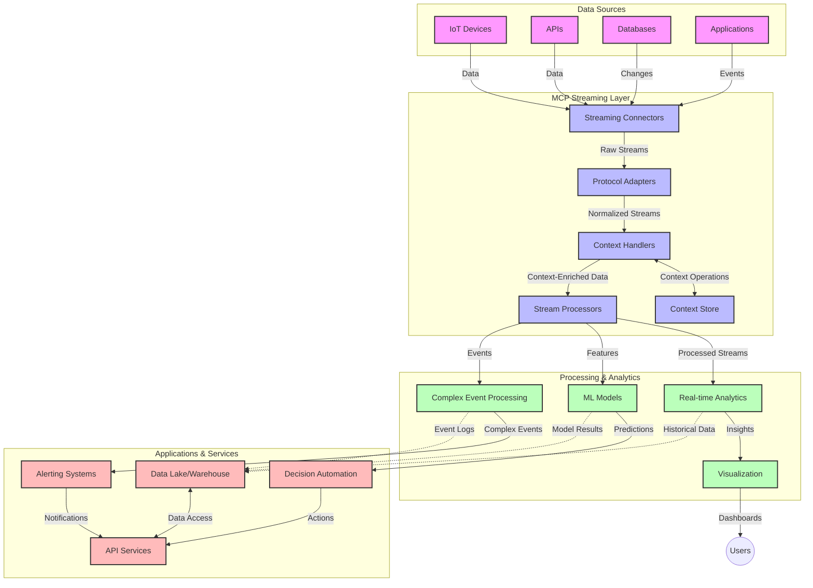

<!--
CO_OP_TRANSLATOR_METADATA:
{
  "original_hash": "195f7287638b77a549acadd96c8f981c",
  "translation_date": "2025-06-12T23:24:08+00:00",
  "source_file": "05-AdvancedTopics/mcp-realtimestreaming/README.md",
  "language_code": "mr"
}
-->
# मॉडेल संदर्भ प्रोटोकॉल रिअल-टाइम डेटा स्ट्रीमिंगसाठी

## आढावा

आजच्या डेटा-चालित जगात, जिथे व्यवसाय आणि अनुप्रयोगांना त्वरित माहितीची गरज असते, तिथे रिअल-टाइम डेटा स्ट्रीमिंग अत्यंत महत्त्वाचे झाले आहे. मॉडेल संदर्भ प्रोटोकॉल (MCP) हे या रिअल-टाइम स्ट्रीमिंग प्रक्रियांना अधिक कार्यक्षम बनविण्यात एक मोठी प्रगती आहे, ज्यामुळे डेटा प्रक्रिया कार्यक्षम होते, संदर्भाची अखंडता टिकते आणि संपूर्ण प्रणालीची कार्यक्षमता सुधारते.

हा मॉड्यूल MCP कसा रिअल-टाइम डेटा स्ट्रीमिंगमध्ये बदल घडवून आणतो, यावर प्रकाश टाकतो, ज्याद्वारे AI मॉडेल्स, स्ट्रीमिंग प्लॅटफॉर्म्स आणि अनुप्रयोगांमध्ये संदर्भ व्यवस्थापनासाठी एक मानकीकृत पद्धत प्रदान केली जाते.

## रिअल-टाइम डेटा स्ट्रीमिंगची ओळख

रिअल-टाइम डेटा स्ट्रीमिंग ही अशी तंत्रज्ञानात्मक संकल्पना आहे जी डेटा सतत तयार होताच त्याचा ट्रान्सफर, प्रक्रिया आणि विश्लेषण करण्यास सक्षम करते, ज्यामुळे सिस्टम्स नवीन माहितीवर त्वरित प्रतिक्रिया देऊ शकतात. पारंपरिक बॅच प्रक्रियेच्या तुलनेत, जी स्थिर डेटासेट्सवर कार्य करते, स्ट्रीमिंगमध्ये डेटा सतत प्रवाहित होतो, ज्यामुळे कमी विलंबात अंतर्दृष्टी आणि क्रिया मिळतात.

### रिअल-टाइम डेटा स्ट्रीमिंगचे मुख्य संकल्पना:

- **सतत डेटा प्रवाह**: डेटा सतत, अखंड इव्हेंट्स किंवा रेकॉर्ड्सच्या स्वरूपात प्रक्रिया होतो.
- **कमी विलंब प्रक्रिया**: डेटा तयार होण्यापासून प्रक्रिया होण्यापर्यंतचा वेळ कमी ठेवणे.
- **स्केलेबिलिटी**: स्ट्रीमिंग आर्किटेक्चरला वेगवेगळ्या प्रमाणात आणि वेगाने डेटा हाताळता यावा लागतो.
- **फॉल्ट टॉलरन्स**: सिस्टम्सना अपयशांपासून टिकून राहणे आवश्यक आहे जेणेकरून डेटा प्रवाह अखंड राहील.
- **स्टेटफुल प्रक्रिया**: इव्हेंट्समधील संदर्भ कायम ठेवणे महत्त्वाचे आहे जेणेकरून विश्लेषण अर्थपूर्ण होईल.

### मॉडेल संदर्भ प्रोटोकॉल आणि रिअल-टाइम स्ट्रीमिंग

मॉडेल संदर्भ प्रोटोकॉल (MCP) रिअल-टाइम स्ट्रीमिंगच्या काही महत्त्वाच्या अडचणींना सोडवतो:

1. **संदर्भ अखंडता**: MCP वितरित स्ट्रीमिंग घटकांमध्ये संदर्भ कसा टिकवायचा यासाठी एकसंध मानक तयार करतो, ज्यामुळे AI मॉडेल्स आणि प्रक्रिया नोड्सना संबंधित ऐतिहासिक आणि पर्यावरणीय संदर्भ उपलब्ध होतो.

2. **कार्यक्षम स्टेट व्यवस्थापन**: संदर्भ प्रसारणासाठी संरचित यंत्रणा पुरवून, MCP स्ट्रीमिंग पाईपलाईन्समधील स्टेट व्यवस्थापनाचा ओव्हरहेड कमी करतो.

3. **इंटरऑपरेबिलिटी**: विविध स्ट्रीमिंग तंत्रज्ञान आणि AI मॉडेल्सदरम्यान संदर्भ शेअरिंगसाठी सामान्य भाषा तयार करतो, ज्यामुळे अधिक लवचिक आणि विस्तृत आर्किटेक्चर शक्य होतात.

4. **स्ट्रीमिंगसाठी ऑप्टिमाइझ्ड संदर्भ**: MCP अमलात आणताना, कोणते संदर्भ घटक रिअल-टाइम निर्णयांसाठी महत्त्वाचे आहेत हे प्राधान्य देऊन कामगिरी आणि अचूकता दोन्ही सुधारतो.

5. **अनुकूली प्रक्रिया**: योग्य संदर्भ व्यवस्थापनामुळे MCP वापरून स्ट्रीमिंग सिस्टम्स डेटा मधील बदलत्या परिस्थिती आणि नमुन्यांनुसार प्रक्रिया डायनॅमिकली समायोजित करू शकतात.

आधुनिक अनुप्रयोगांमध्ये, IoT सेन्सर नेटवर्क्सपासून वित्तीय ट्रेडिंग प्लॅटफॉर्म्सपर्यंत, MCP आणि स्ट्रीमिंग तंत्रज्ञानांच्या एकत्रिकरणामुळे अधिक बुद्धिमान, संदर्भ-सजग प्रक्रिया शक्य होते, जी गुंतागुंतीच्या आणि बदलत्या परिस्थितींना रिअल-टाइममध्ये योग्य प्रतिसाद देऊ शकते.

## शिकण्याचे उद्दिष्टे

या धड्याच्या शेवटी, तुम्ही सक्षम असाल:

- रिअल-टाइम डेटा स्ट्रीमिंगच्या मूलभूत गोष्टी आणि त्यातील अडचणी समजून घेणे
- मॉडेल संदर्भ प्रोटोकॉल (MCP) कसा रिअल-टाइम डेटा स्ट्रीमिंग सुधारतो हे समजावणे
- Kafka आणि Pulsar सारख्या लोकप्रिय फ्रेमवर्क्स वापरून MCP-आधारित स्ट्रीमिंग सोल्यूशन्स तयार करणे
- MCP वापरून फॉल्ट-टॉलरंट, उच्च कार्यक्षमतेची स्ट्रीमिंग आर्किटेक्चर डिझाइन आणि डिप्लॉय करणे
- MCP संकल्पना IoT, वित्तीय ट्रेडिंग आणि AI-चालित विश्लेषणाच्या उपयोग प्रकरणांमध्ये लागू करणे
- MCP-आधारित स्ट्रीमिंग तंत्रज्ञानातील उदयोन्मुख ट्रेंड्स आणि भविष्यातील नवकल्पना मूल्यांकन करणे

### व्याख्या आणि महत्त्व

रिअल-टाइम डेटा स्ट्रीमिंग म्हणजे कमी विलंबात डेटा सतत तयार होणे, प्रक्रिया होणे आणि वितरित होणे. बॅच प्रक्रियेच्या तुलनेत, जिथे डेटा गटांमध्ये गोळा होतो आणि नंतर प्रक्रिया होतो, स्ट्रीमिंगमध्ये डेटा येताच क्रमिकरित्या प्रक्रिया होतो, ज्यामुळे त्वरित अंतर्दृष्टी आणि क्रिया शक्य होतात.

रिअल-टाइम डेटा स्ट्रीमिंगची मुख्य वैशिष्ट्ये:

- **कमी विलंब**: मिलीसेकंदांपासून सेकंदांपर्यंत डेटा प्रक्रिया आणि विश्लेषण
- **सतत प्रवाह**: विविध स्रोतांकडून अखंड डेटा प्रवाह
- **तात्काळ प्रक्रिया**: डेटा येताच विश्लेषण करणे, बॅचमध्ये नाही
- **इव्हेंट-चालित आर्किटेक्चर**: घडणाऱ्या घटनांवर त्वरित प्रतिक्रिया देणे

### पारंपरिक डेटा स्ट्रीमिंगमधील अडचणी

पारंपरिक डेटा स्ट्रीमिंग पद्धतींना काही मर्यादा आहेत:

1. **संदर्भ गमावणे**: वितरित सिस्टम्समध्ये संदर्भ टिकवणे कठीण होणे
2. **स्केलेबिलिटी समस्या**: मोठ्या प्रमाणात आणि वेगाने डेटा हाताळताना अडचणी
3. **इंटिग्रेशनची गुंतागुंत**: वेगवेगळ्या सिस्टम्समधील इंटरऑपरेबिलिटी समस्या
4. **विलंब व्यवस्थापन**: थ्रूपुट आणि प्रक्रिया वेळ यांच्यात समतोल राखणे
5. **डेटा सुसंगतता**: स्ट्रीममध्ये डेटा अचूक आणि पूर्ण राहिला याची खात्री करणे

## मॉडेल संदर्भ प्रोटोकॉल (MCP) समजून घेणे

### MCP म्हणजे काय?

मॉडेल संदर्भ प्रोटोकॉल (MCP) हा एक मानकीकृत संवाद प्रोटोकॉल आहे जो AI मॉडेल्स आणि अनुप्रयोगांमधील कार्यक्षम संवाद सुलभ करण्यासाठी तयार केला गेला आहे. रिअल-टाइम डेटा स्ट्रीमिंगच्या संदर्भात, MCP खालील बाबींसाठी एक फ्रेमवर्क पुरवतो:

- डेटा पाईपलाईनमध्ये संदर्भ जपणे
- डेटा विनिमय स्वरूप मानकीकृत करणे
- मोठ्या डेटासेट्सच्या ट्रान्समिशनचे ऑप्टिमायझेशन करणे
- मॉडेल-टू-मॉडेल आणि मॉडेल-टू-अनुप्रयोग संवाद सुधारणा

### मुख्य घटक आणि आर्किटेक्चर

रिअल-टाइम स्ट्रीमिंगसाठी MCP आर्किटेक्चरमध्ये काही महत्त्वाचे घटक असतात:

1. **संदर्भ हँडलर्स**: स्ट्रीमिंग पाईपलाईनमध्ये संदर्भ माहिती व्यवस्थापित आणि जपतात
2. **स्ट्रीम प्रोसेसर**: संदर्भ-आधारित तंत्र वापरून येणारा डेटा प्रक्रिया करतात
3. **प्रोटोकॉल अडॅप्टर्स**: वेगवेगळ्या स्ट्रीमिंग प्रोटोकॉल्समधील रूपांतरण करतात, संदर्भ जपून ठेवतात
4. **संदर्भ स्टोअर**: संदर्भ माहिती कार्यक्षमतेने संग्रहित आणि पुनर्प्राप्त करतात
5. **स्ट्रीमिंग कनेक्टर्स**: विविध स्ट्रीमिंग प्लॅटफॉर्म्सशी (Kafka, Pulsar, Kinesis, इ.) कनेक्ट करतात



### MCP कसा रिअल-टाइम डेटा हाताळणी सुधारतो

MCP पारंपरिक स्ट्रीमिंग अडचणींना खालील प्रकारे हाताळतो:

- **संदर्भ अखंडता**: संपूर्ण पाईपलाईनमध्ये डेटा पॉइंट्समधील संबंध टिकवणे
- **ऑप्टिमाइझ्ड ट्रान्समिशन**: बुद्धिमान संदर्भ व्यवस्थापनाद्वारे डेटा विनिमयातील पुनरावृत्ती कमी करणे
- **मानकीकृत इंटरफेसेस**: स्ट्रीमिंग घटकांसाठी सुसंगत API पुरवणे
- **कमी विलंब**: कार्यक्षम संदर्भ हाताळणीमुळे प्रक्रिया ओव्हरहेड कमी करणे
- **वाढीव स्केलेबिलिटी**: संदर्भ जपून क्षैतिज स्केलिंगला समर्थन देणे

## एकत्रीकरण आणि अंमलबजावणी

रिअल-टाइम डेटा स्ट्रीमिंग सिस्टम्सना कार्यक्षमता आणि संदर्भ अखंडता दोन्ही टिकवण्यासाठी काळजीपूर्वक आर्किटेक्चर डिझाइन आणि अंमलबजावणीची गरज असते. मॉडेल संदर्भ प्रोटोकॉल AI मॉडेल्स आणि स्ट्रीमिंग तंत्रज्ञान यांच्यात एकसंध एकत्रिकरणासाठी मानकीकृत पद्धत पुरवतो, ज्यामुळे अधिक प्रगत, संदर्भ-जाणणाऱ्या प्रक्रिया पाईपलाईन्स शक्य होतात.

### स्ट्रीमिंग आर्किटेक्चरमध्ये MCP एकत्रीकरणाचा आढावा

रिअल-टाइम स्ट्रीमिंग वातावरणात MCP अंमलबजावणी करताना काही महत्त्वाच्या बाबी विचारात घेतल्या जातात:

1. **संदर्भ सिरिअलायझेशन आणि ट्रान्सपोर्ट**: MCP संदर्भ माहिती स्ट्रीमिंग डेटा पॅकेट्समध्ये कार्यक्षमतेने एनकोड करण्यासाठी यंत्रणा पुरवतो, ज्यामुळे आवश्यक संदर्भ डेटा प्रवाहात कायम राहतो. यात स्ट्रीमिंग ट्रान्सपोर्टसाठी ऑप्टिमाइझ केलेले मानकीकृत सिरिअलायझेशन फॉरमॅट्स असतात.

2. **स्टेटफुल स्ट्रीम प्रक्रिया**: MCP अधिक बुद्धिमान स्टेटफुल प्रक्रिया सक्षम करतो, ज्यामुळे प्रक्रिया नोड्समध्ये संदर्भ सुसंगतपणे टिकवता येतो. हे विशेषतः वितरित स्ट्रीमिंग आर्किटेक्चरमध्ये जिथे स्टेट व्यवस्थापन कठीण असते, तेथे उपयुक्त ठरते.

3. **इव्हेंट-टाइम विरुद्ध प्रोसेसिंग-टाइम**: MCP अंमलबजावणींना इव्हेंट्स केव्हा घडले आणि ते कधी प्रक्रिया होत आहेत यातील फरक लक्षात घेणे आवश्यक असते. प्रोटोकॉलमध्ये इव्हेंट टाइम सेमॅंटिक्स टिकवणारा कालिक संदर्भ समाविष्ट केला जाऊ शकतो.

4. **बॅकप्रेशर व्यवस्थापन**: संदर्भ हाताळणी मानकीकृत करून, MCP स्ट्रीमिंग सिस्टम्समध्ये बॅकप्रेशर नियंत्रणास मदत करतो, ज्यामुळे घटक त्यांच्या प्रक्रिया क्षमतेबाबत संवाद साधू शकतात आणि प्रवाह समायोजित करू शकतात.

5. **संदर्भ विंडोइंग आणि एकत्रीकरण**: MCP अधिक प्रगत विंडोइंग ऑपरेशन्सना मदत करतो, ज्याद्वारे कालिक आणि संबंधीत संदर्भांचे संरचित प्रतिनिधित्व केले जाते, ज्यामुळे इव्हेंट स्ट्रीम्सवर अर्थपूर्ण एकत्रीकरण शक्य होते.

6. **एक्सॅक्टली-वनस प्रोसेसिंग**: ज्या स्ट्रीमिंग सिस्टम्सना एक्सॅक्टली-वनस सेमॅंटिक्सची गरज असते, MCP प्रक्रिया मेटाडेटा समाविष्ट करून वितरित घटकांमध्ये प्रक्रिया स्थिती ट्रॅक आणि पडताळणी करण्यात मदत करतो.

विविध स्ट्रीमिंग तंत्रज्ञानांमध्ये MCP अंमलबजावणी एकसंध संदर्भ व्यवस्थापनासाठी एकसंध पद्धत तयार करते, ज्यामुळे सानुकूल एकत्रीकरण कोडची गरज कमी होते आणि डेटा प्रवाहादरम्यान संदर्भ टिकवण्याची क्षमता वाढते.

### विविध डेटा स्ट्रीमिंग फ्रेमवर्क्समध्ये MCP

हे उदाहरणे सध्याच्या MCP स्पेसिफिकेशनवर आधारित आहेत, जे JSON-RPC आधारित प्रोटोकॉल वापरते आणि वेगवेगळ्या ट्रान्सपोर्ट मेकॅनिझम्ससह कार्य करते. कोड दाखवतो की कसे तुम्ही कस्टम ट्रान्सपोर्ट्स तयार करू शकता जे Kafka आणि Pulsar सारख्या स्ट्रीमिंग प्लॅटफॉर्म्सशी एकत्रित होतात आणि MCP प्रोटोकॉलशी पूर्ण सुसंगत राहतात.

हे उदाहरणे दर्शवतात की कसे स्ट्रीमिंग प्लॅटफॉर्म्स MCP सह एकत्रित करून रिअल-टाइम डेटा प्रक्रिया करता येते आणि संदर्भ-जाणणारी जागरूकता कायम ठेवता येते, जी MCP च्या केंद्रस्थानी आहे. हा दृष्टिकोन जून 2025 पर्यंतच्या MCP स्पेसिफिकेशनच्या वर्तमान स्थितीशी कोड नमुन्यांची अचूकता सुनिश्चित करतो.

MCP लोकप्रिय स्ट्रीमिंग फ्रेमवर्क्ससह एकत्रित केला जाऊ शकतो:

#### Apache Kafka एकत्रीकरण

```python
import asyncio
import json
from typing import Dict, Any, Optional
from confluent_kafka import Consumer, Producer, KafkaError
from mcp.client import Client, ClientCapabilities
from mcp.core.message import JsonRpcMessage
from mcp.core.transports import Transport

# Custom transport class to bridge MCP with Kafka
class KafkaMCPTransport(Transport):
    def __init__(self, bootstrap_servers: str, input_topic: str, output_topic: str):
        self.bootstrap_servers = bootstrap_servers
        self.input_topic = input_topic
        self.output_topic = output_topic
        self.producer = Producer({'bootstrap.servers': bootstrap_servers})
        self.consumer = Consumer({
            'bootstrap.servers': bootstrap_servers,
            'group.id': 'mcp-client-group',
            'auto.offset.reset': 'earliest'
        })
        self.message_queue = asyncio.Queue()
        self.running = False
        self.consumer_task = None
        
    async def connect(self):
        """Connect to Kafka and start consuming messages"""
        self.consumer.subscribe([self.input_topic])
        self.running = True
        self.consumer_task = asyncio.create_task(self._consume_messages())
        return self
        
    async def _consume_messages(self):
        """Background task to consume messages from Kafka and queue them for processing"""
        while self.running:
            try:
                msg = self.consumer.poll(1.0)
                if msg is None:
                    await asyncio.sleep(0.1)
                    continue
                
                if msg.error():
                    if msg.error().code() == KafkaError._PARTITION_EOF:
                        continue
                    print(f"Consumer error: {msg.error()}")
                    continue
                
                # Parse the message value as JSON-RPC
                try:
                    message_str = msg.value().decode('utf-8')
                    message_data = json.loads(message_str)
                    mcp_message = JsonRpcMessage.from_dict(message_data)
                    await self.message_queue.put(mcp_message)
                except Exception as e:
                    print(f"Error parsing message: {e}")
            except Exception as e:
                print(f"Error in consumer loop: {e}")
                await asyncio.sleep(1)
    
    async def read(self) -> Optional[JsonRpcMessage]:
        """Read the next message from the queue"""
        try:
            message = await self.message_queue.get()
            return message
        except Exception as e:
            print(f"Error reading message: {e}")
            return None
    
    async def write(self, message: JsonRpcMessage) -> None:
        """Write a message to the Kafka output topic"""
        try:
            message_json = json.dumps(message.to_dict())
            self.producer.produce(
                self.output_topic,
                message_json.encode('utf-8'),
                callback=self._delivery_report
            )
            self.producer.poll(0)  # Trigger callbacks
        except Exception as e:
            print(f"Error writing message: {e}")
    
    def _delivery_report(self, err, msg):
        """Kafka producer delivery callback"""
        if err is not None:
            print(f'Message delivery failed: {err}')
        else:
            print(f'Message delivered to {msg.topic()} [{msg.partition()}]')
    
    async def close(self) -> None:
        """Close the transport"""
        self.running = False
        if self.consumer_task:
            self.consumer_task.cancel()
            try:
                await self.consumer_task
            except asyncio.CancelledError:
                pass
        self.consumer.close()
        self.producer.flush()

# Example usage of the Kafka MCP transport
async def kafka_mcp_example():
    # Create MCP client with Kafka transport
    client = Client(
        {"name": "kafka-mcp-client", "version": "1.0.0"},
        ClientCapabilities({})
    )
    
    # Create and connect the Kafka transport
    transport = KafkaMCPTransport(
        bootstrap_servers="localhost:9092",
        input_topic="mcp-responses",
        output_topic="mcp-requests"
    )
    
    await client.connect(transport)
    
    try:
        # Initialize the MCP session
        await client.initialize()
        
        # Example of executing a tool via MCP
        response = await client.execute_tool(
            "process_data",
            {
                "data": "sample data",
                "metadata": {
                    "source": "sensor-1",
                    "timestamp": "2025-06-12T10:30:00Z"
                }
            }
        )
        
        print(f"Tool execution response: {response}")
        
        # Clean shutdown
        await client.shutdown()
    finally:
        await transport.close()

# Run the example
if __name__ == "__main__":
    asyncio.run(kafka_mcp_example())
```

#### Apache Pulsar अंमलबजावणी

```python
import asyncio
import json
import pulsar
from typing import Dict, Any, Optional
from mcp.core.message import JsonRpcMessage
from mcp.core.transports import Transport
from mcp.server import Server, ServerOptions
from mcp.server.tools import Tool, ToolExecutionContext, ToolMetadata

# Create a custom MCP transport that uses Pulsar
class PulsarMCPTransport(Transport):
    def __init__(self, service_url: str, request_topic: str, response_topic: str):
        self.service_url = service_url
        self.request_topic = request_topic
        self.response_topic = response_topic
        self.client = pulsar.Client(service_url)
        self.producer = self.client.create_producer(response_topic)
        self.consumer = self.client.subscribe(
            request_topic,
            "mcp-server-subscription",
            consumer_type=pulsar.ConsumerType.Shared
        )
        self.message_queue = asyncio.Queue()
        self.running = False
        self.consumer_task = None
    
    async def connect(self):
        """Connect to Pulsar and start consuming messages"""
        self.running = True
        self.consumer_task = asyncio.create_task(self._consume_messages())
        return self
    
    async def _consume_messages(self):
        """Background task to consume messages from Pulsar and queue them for processing"""
        while self.running:
            try:
                # Non-blocking receive with timeout
                msg = self.consumer.receive(timeout_millis=500)
                
                # Process the message
                try:
                    message_str = msg.data().decode('utf-8')
                    message_data = json.loads(message_str)
                    mcp_message = JsonRpcMessage.from_dict(message_data)
                    await self.message_queue.put(mcp_message)
                    
                    # Acknowledge the message
                    self.consumer.acknowledge(msg)
                except Exception as e:
                    print(f"Error processing message: {e}")
                    # Negative acknowledge if there was an error
                    self.consumer.negative_acknowledge(msg)
            except Exception as e:
                # Handle timeout or other exceptions
                await asyncio.sleep(0.1)
    
    async def read(self) -> Optional[JsonRpcMessage]:
        """Read the next message from the queue"""
        try:
            message = await self.message_queue.get()
            return message
        except Exception as e:
            print(f"Error reading message: {e}")
            return None
    
    async def write(self, message: JsonRpcMessage) -> None:
        """Write a message to the Pulsar output topic"""
        try:
            message_json = json.dumps(message.to_dict())
            self.producer.send(message_json.encode('utf-8'))
        except Exception as e:
            print(f"Error writing message: {e}")
    
    async def close(self) -> None:
        """Close the transport"""
        self.running = False
        if self.consumer_task:
            self.consumer_task.cancel()
            try:
                await self.consumer_task
            except asyncio.CancelledError:
                pass
        self.consumer.close()
        self.producer.close()
        self.client.close()

# Define a sample MCP tool that processes streaming data
@Tool(
    name="process_streaming_data",
    description="Process streaming data with context preservation",
    metadata=ToolMetadata(
        required_capabilities=["streaming"]
    )
)
async def process_streaming_data(
    ctx: ToolExecutionContext,
    data: str,
    source: str,
    priority: str = "medium"
) -> Dict[str, Any]:
    """
    Process streaming data while preserving context
    
    Args:
        ctx: Tool execution context
        data: The data to process
        source: The source of the data
        priority: Priority level (low, medium, high)
        
    Returns:
        Dict containing processed results and context information
    """
    # Example processing that leverages MCP context
    print(f"Processing data from {source} with priority {priority}")
    
    # Access conversation context from MCP
    conversation_id = ctx.conversation_id if hasattr(ctx, 'conversation_id') else "unknown"
    
    # Return results with enhanced context
    return {
        "processed_data": f"Processed: {data}",
        "context": {
            "conversation_id": conversation_id,
            "source": source,
            "priority": priority,
            "processing_timestamp": ctx.get_current_time_iso()
        }
    }

# Example MCP server implementation using Pulsar transport
async def run_mcp_server_with_pulsar():
    # Create MCP server
    server = Server(
        {"name": "pulsar-mcp-server", "version": "1.0.0"},
        ServerOptions(
            capabilities={"streaming": True}
        )
    )
    
    # Register our tool
    server.register_tool(process_streaming_data)
    
    # Create and connect Pulsar transport
    transport = PulsarMCPTransport(
        service_url="pulsar://localhost:6650",
        request_topic="mcp-requests",
        response_topic="mcp-responses"
    )
    
    try:
        # Start the server with the Pulsar transport
        await server.run(transport)
    finally:
        await transport.close()

# Run the server
if __name__ == "__main__":
    asyncio.run(run_mcp_server_with_pulsar())
```

### डिप्लॉयमेंटसाठी सर्वोत्तम पद्धती

रिअल-टाइम स्ट्रीमिंगसाठी MCP अंमलबजावणी करताना:

1. **फॉल्ट टॉलरन्ससाठी डिझाइन करा**:
   - योग्य त्रुटी हाताळणी अंमलात आणा
   - अयशस्वी संदेशांसाठी डेड-लेटर क्यूज वापरा
   - आयडेम्पोटेंट प्रोसेसर डिझाइन करा

2. **कार्यक्षमतेसाठी ऑप्टिमाइझ करा**:
   - योग्य बफर साइज कॉन्फिगर करा
   - जिथे योग्य आहे तिथे बॅचिंग वापरा
   - बॅकप्रेशर मेकॅनिझम्स अंमलात आणा

3. **मॉनिटर आणि निरीक्षण करा**:
   - स्ट्रीम प्रक्रिया मेट्रिक्स ट्रॅक करा
   - संदर्भ प्रसारणावर लक्ष ठेवा
   - अनियमिततेसाठी अलर्ट सेट करा

4. **तुमच्या स्ट्रीम्स सुरक्षित करा**:
   - संवेदनशील डेटासाठी एन्क्रिप्शन अंमलात आणा
   - प्रमाणीकरण आणि प्राधिकरण वापरा
   - योग्य प्रवेश नियंत्रण लागू करा

### IoT आणि एज कम्प्युटिंगमध्ये MCP

MCP IoT स्ट्रीमिंग सुधारतो:

- प्रक्रिया पाईपलाईनमध्ये डिव्हाइस संदर्भ जपतो
- एज-टू-क्लाउड डेटा स्ट्रीमिंग कार्यक्षम करतो
- IoT डेटा स्ट्रीम्सवर रिअल-टाइम विश्लेषणास समर्थन देतो
- संदर्भासह डिव्हाइस-टू-डिव्हाइस संवाद सुलभ करतो

उदाहरण: स्मार्ट सिटी सेन्सर नेटवर्क्स  
```
Sensors → Edge Gateways → MCP Stream Processors → Real-time Analytics → Automated Responses
```

### आर्थिक व्यवहार आणि उच्च-वारंवारता ट्रेडिंगमधील भूमिका

MCP आर्थिक डेटा स्ट्रीमिंगसाठी महत्त्वाचे फायदे पुरवतो:

- ट्रेडिंग निर्णयांसाठी अल्ट्रा-लो विलंब प्रक्रिया
- संपूर्ण प्रक्रियेदरम्यान व्यवहार संदर्भ टिकवणे
- संदर्भ-जाणणाऱ्या कॉम्प्लेक्स इव्हेंट प्रोसेसिंगला समर्थन
- वितरित ट्रेडिंग सिस्टम्समध्ये डेटा सुसंगतता सुनिश्चित करणे

### AI-चालित डेटा विश्लेषण सुधारित करणे

MCP स्ट्रीमिंग विश्लेषणासाठी नवीन शक्यता निर्माण करतो:

- रिअल-टाइम मॉडेल प्रशिक्षण आणि अनुमान
- स्ट्रीमिंग डेटावर सतत शिक्षण
- संदर्भ-जाणणारी वैशिष्ट्ये काढणे
- संदर्भ जपलेल्या मल्टि-मॉडेल अनुमान पाईपलाईन्स

## भविष्यातील ट्रेंड्स आणि नवकल्पना

### रिअल-टाइम वातावरणात MCP ची प्रगती

आगामी काळात, MCP पुढील बाबींसाठी विकसित होईल अशी अपेक्षा आहे:

- **क्वांटम कम्प्युटिंग एकत्रीकरण**: क्वांटम-आधारित स्ट्रीमिंग सिस्टमसाठी तयारी
- **एज-नेटिव्ह प्रक्रिया**: अधिक संदर्भ-जाणणारी प्रक्रिया एज डिव्हाइसेसवर हलवणे
- **स्वयंचलित स्ट्रीम व्यवस्थापन**: स्वतः सुधारणा करणाऱ्या स्ट्रीमिंग पाईपलाईन्स
- **फेडरेटेड स्ट्रीमिंग**: गोपनीयता जपत वितरित प्रक्रिया

### तंत्रज्ञानातील संभाव्य प्रगती

MCP स्ट्रीमिंगच्या भविष्यातील रूपरेषा ठरवणारी उदयोन्मुख तंत्रज्ञान:


**अस्वीकरण**:  
हा दस्तऐवज AI भाषांतर सेवा [Co-op Translator](https://github.com/Azure/co-op-translator) वापरून भाषांतरित केला आहे. आम्ही अचूकतेसाठी प्रयत्न करतो, तरी कृपया लक्षात ठेवा की स्वयंचलित भाषांतरांमध्ये चुका किंवा अचूकतेचा अभाव असू शकतो. मूळ दस्तऐवज त्याच्या स्थानिक भाषेत अधिकृत स्रोत मानला जावा. महत्त्वाची माहिती असल्यास, व्यावसायिक मानवी भाषांतर करणे शिफारसीय आहे. या भाषांतराच्या वापरामुळे होणाऱ्या कोणत्याही गैरसमजुतींसाठी किंवा चुकीच्या अर्थसंग्रहासाठी आम्ही जबाबदार नाही.