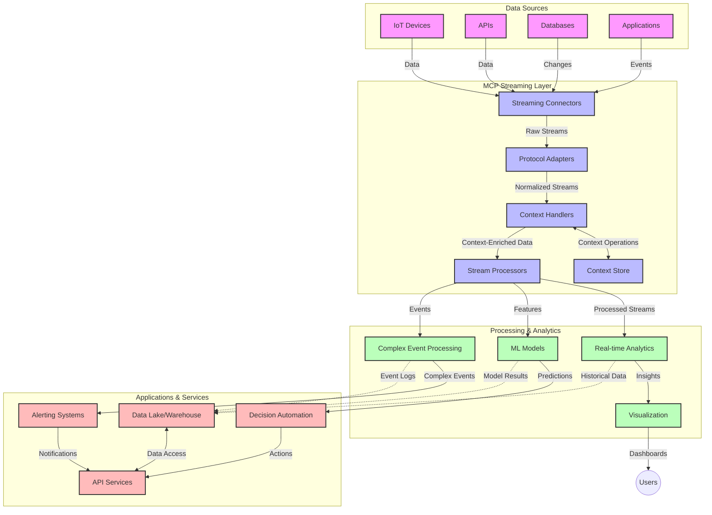

<!--
CO_OP_TRANSLATOR_METADATA:
{
  "original_hash": "b41174ac781ebf228b2043cbdfc09105",
  "translation_date": "2025-06-12T00:25:40+00:00",
  "source_file": "05-AdvancedTopics/mcp-realtimestreaming/README.md",
  "language_code": "mr"
}
-->
# रिअल-टाइम डेटा स्ट्रीमिंगसाठी मॉडेल कॉन्टेक्स्ट प्रोटोकॉल

## आढावा

आजच्या डेटा-चालित जगात, जिथे व्यवसाय आणि अनुप्रयोगांना त्वरित माहितीची गरज असते ज्यामुळे ते वेळेवर निर्णय घेऊ शकतील, तिथे रिअल-टाइम डेटा स्ट्रीमिंग अत्यंत महत्त्वाचे ठरले आहे. मॉडेल कॉन्टेक्स्ट प्रोटोकॉल (MCP) हा या रिअल-टाइम स्ट्रीमिंग प्रक्रियांना अधिक कार्यक्षम, संदर्भपूर्ण आणि संपूर्ण प्रणालीच्या कामगिरीत सुधारणा करणारा एक महत्त्वाचा प्रगती आहे.

हा मॉड्यूल MCP कसा रिअल-टाइम डेटा स्ट्रीमिंगमध्ये बदल घडवतो, हे तपासतो, जे AI मॉडेल्स, स्ट्रीमिंग प्लॅटफॉर्म्स आणि अनुप्रयोगांमध्ये संदर्भ व्यवस्थापनासाठी एक प्रमाणित पद्धत प्रदान करतो.

## रिअल-टाइम डेटा स्ट्रीमिंगची ओळख

रिअल-टाइम डेटा स्ट्रीमिंग ही एक तंत्रज्ञानात्मक पद्धत आहे जी डेटा सतत उत्पन्न होताच त्याचा सतत ट्रान्सफर, प्रक्रिया आणि विश्लेषण करण्यास सक्षम करते, ज्यामुळे सिस्टम्स नवीन माहितीस त्वरित प्रतिसाद देऊ शकतात. पारंपरिक बॅच प्रोसेसिंगच्या तुलनेत, जी स्थिर डेटासेटवर कार्य करते, स्ट्रीमिंगमध्ये डेटा सतत प्रवाहित होत असतो, ज्यामुळे कमी विलंबाने अंतर्दृष्टी आणि क्रिया मिळतात.

### रिअल-टाइम डेटा स्ट्रीमिंगचे मुख्य संकल्पना:

- **सतत डेटा प्रवाह**: डेटा सतत, अखंड घटनां किंवा रेकॉर्ड्सच्या स्वरूपात प्रक्रिया होतो.
- **कमी विलंब प्रक्रिया**: डेटा निर्माण आणि प्रक्रियेच्या दरम्यानचा वेळ कमी ठेवण्यावर लक्ष.
- **स्केलेबिलिटी**: स्ट्रीमिंग आर्किटेक्चरला बदलत्या डेटा प्रमाण आणि वेगाला हाताळता यावे लागते.
- **फॉल्ट टॉलरन्स**: सिस्टम्समध्ये अपयशांपासून बचाव असावा, ज्यामुळे डेटा प्रवाह अखंड राहतो.
- **स्टेटफुल प्रक्रिया**: घटनांदरम्यान संदर्भ कायम ठेवणे महत्त्वाचे असते.

### मॉडेल कॉन्टेक्स्ट प्रोटोकॉल आणि रिअल-टाइम स्ट्रीमिंग

MCP रिअल-टाइम स्ट्रीमिंगच्या वातावरणातील काही महत्त्वाच्या अडचणींवर मात करतो:

1. **संदर्भ सातत्य**: MCP वितरित स्ट्रीमिंग घटकांमध्ये संदर्भ कसा कायम ठेवायचा यासाठी एकसंध मानक तयार करतो, ज्यामुळे AI मॉडेल्स आणि प्रक्रिया नोड्सना संबंधित ऐतिहासिक आणि पर्यावरणीय संदर्भ मिळतो.

2. **कार्यक्षम स्टेट व्यवस्थापन**: संदर्भ प्रसारणासाठी संरचित यंत्रणा पुरवून, MCP स्ट्रीमिंग पाइपलाइनमधील स्टेट व्यवस्थापनाचा ओव्हरहेड कमी करतो.

3. **परस्परसंवाद क्षमता**: MCP विविध स्ट्रीमिंग तंत्रज्ञान आणि AI मॉडेल्समधील संदर्भ शेअरिंगसाठी एक सामान्य भाषा तयार करतो, ज्यामुळे अधिक लवचिक आणि विस्तारयोग्य आर्किटेक्चर शक्य होते.

4. **स्ट्रीमिंगसाठी अनुकूल संदर्भ**: MCP अंमलबजावणी रिअल-टाइम निर्णयांसाठी सर्वात महत्त्वाच्या संदर्भ घटकांना प्राधान्य देऊ शकतात, ज्यामुळे कामगिरी आणि अचूकता दोन्ही सुधारतात.

5. **अनुकूली प्रक्रिया**: योग्य संदर्भ व्यवस्थापनामुळे, MCP वापरून स्ट्रीमिंग सिस्टम्स डेटा मधील बदलत्या परिस्थिती आणि नमुन्यांनुसार प्रक्रिया गतिमानपणे समायोजित करू शकतात.

आधुनिक अनुप्रयोगांमध्ये, IoT सेन्सर नेटवर्कपासून वित्तीय ट्रेडिंग प्लॅटफॉर्मपर्यंत, MCP आणि स्ट्रीमिंग तंत्रज्ञानांच्या एकत्रिकरणामुळे अधिक बुद्धिमान, संदर्भ-जाणकार प्रक्रिया शक्य होते, जी रिअल-टाइममध्ये गुंतागुंतीच्या आणि बदलत्या परिस्थितींना योग्य प्रतिसाद देते.

## शिकण्याचे उद्दिष्ट

या धड्याच्या शेवटी, तुम्ही सक्षम असाल:

- रिअल-टाइम डेटा स्ट्रीमिंगच्या मूलभूत तत्त्वे आणि त्यातील अडचणी समजून घेणे
- मॉडेल कॉन्टेक्स्ट प्रोटोकॉल (MCP) कसा रिअल-टाइम डेटा स्ट्रीमिंग सुधारतो ते स्पष्ट करणे
- Kafka आणि Pulsar सारख्या लोकप्रिय फ्रेमवर्क्स वापरून MCP-आधारित स्ट्रीमिंग सोल्यूशन्स अंमलात आणणे
- MCP सह फॉल्ट-टॉलरंट, उच्च-कार्यक्षमतेच्या स्ट्रीमिंग आर्किटेक्चर डिझाइन आणि डिप्लॉय करणे
- IoT, वित्तीय ट्रेडिंग आणि AI-चालित विश्लेषणाच्या वापरप्रकरणांमध्ये MCP संकल्पना लागू करणे
- MCP-आधारित स्ट्रीमिंग तंत्रज्ञानातील उदयोन्मुख ट्रेंड आणि भविष्यातील नवकल्पना मूल्यांकन करणे

### व्याख्या आणि महत्त्व

रिअल-टाइम डेटा स्ट्रीमिंग म्हणजे कमी विलंबाने डेटा सतत तयार होणे, प्रक्रिया होणे आणि वितरित होणे. बॅच प्रोसेसिंगमध्ये डेटा गोळा करून गटांमध्ये प्रक्रिया केली जाते, तर स्ट्रीमिंगमध्ये डेटा येताच त्यावर टप्प्याटप्प्याने प्रक्रिया केली जाते, ज्यामुळे त्वरित अंतर्दृष्टी आणि क्रिया शक्य होतात.

रिअल-टाइम डेटा स्ट्रीमिंगची मुख्य वैशिष्ट्ये:

- **कमी विलंब**: डेटा प्रक्रिया आणि विश्लेषण काही मिलीसेकंदांपासून सेकंदांपर्यंत होते
- **सतत प्रवाह**: विविध स्रोतांकडून अखंड डेटा प्रवाह
- **तत्काळ प्रक्रिया**: डेटा येताच त्यावर विश्लेषण, बॅचमध्ये नव्हे
- **इव्हेंट-ड्रिव्हन आर्किटेक्चर**: घटना घडताच त्यावर प्रतिसाद देणे

### पारंपरिक डेटा स्ट्रीमिंगमधील अडचणी

पारंपरिक डेटा स्ट्रीमिंग पद्धतींना अनेक मर्यादा भेडसावतात:

1. **संदर्भ गमावणे**: वितरित सिस्टम्समध्ये संदर्भ कायम ठेवणे कठीण असते
2. **स्केलेबिलिटी समस्या**: मोठ्या प्रमाणात आणि वेगाने येणाऱ्या डेटाला हाताळणे आव्हानात्मक
3. **इंटीग्रेशनची गुंतागुंत**: विविध सिस्टम्समधील परस्परसंवादात अडचणी
4. **विलंब व्यवस्थापन**: थ्रूपुट आणि प्रक्रिया वेळ यांचा समतोल राखणे
5. **डेटा सुसंगतता**: स्ट्रीममधील डेटा अचूक आणि पूर्ण असण्याची खात्री करणे

## मॉडेल कॉन्टेक्स्ट प्रोटोकॉल (MCP) समजून घेणे

### MCP म्हणजे काय?

मॉडेल कॉन्टेक्स्ट प्रोटोकॉल (MCP) हा एक प्रमाणित संवाद प्रोटोकॉल आहे जो AI मॉडेल्स आणि अनुप्रयोगांमधील कार्यक्षम संवादासाठी डिझाइन केला आहे. रिअल-टाइम डेटा स्ट्रीमिंगच्या संदर्भात, MCP खालील बाबींसाठी फ्रेमवर्क पुरवतो:

- डेटा पाइपलाइनमध्ये संदर्भ जपणे
- डेटा एक्सचेंज फॉरमॅट्सचे प्रमाणितीकरण
- मोठ्या डेटासेटच्या ट्रान्समिशनचे ऑप्टिमायझेशन
- मॉडेल-टू-मॉडेल आणि मॉडेल-टू-अनुप्रयोग संवाद सुधारणा

### मुख्य घटक आणि आर्किटेक्चर

रिअल-टाइम स्ट्रीमिंगसाठी MCP आर्किटेक्चरमध्ये काही महत्त्वाचे घटक असतात:

1. **Context Handlers**: स्ट्रीमिंग पाइपलाइनमध्ये संदर्भ माहिती व्यवस्थापित आणि जपतात
2. **Stream Processors**: संदर्भ-जाणकार तंत्र वापरून येणाऱ्या डेटा स्ट्रीमवर प्रक्रिया करतात
3. **Protocol Adapters**: वेगवेगळ्या स्ट्रीमिंग प्रोटोकॉल्समध्ये संदर्भ जपून रूपांतर करतात
4. **Context Store**: संदर्भ माहिती कार्यक्षमतेने साठवते आणि पुनर्प्राप्त करते
5. **Streaming Connectors**: विविध स्ट्रीमिंग प्लॅटफॉर्म्स (Kafka, Pulsar, Kinesis, इ.) शी कनेक्ट होतात



### MCP रिअल-टाइम डेटा हाताळणी कशी सुधारते

MCP पारंपरिक स्ट्रीमिंग अडचणींवर मात करते:

- **संदर्भ अखंडता**: संपूर्ण पाइपलाइनमधील डेटा पॉइंट्समधील संबंध कायम ठेवणे
- **ऑप्टिमाइझ्ड ट्रान्समिशन**: बुद्धिमान संदर्भ व्यवस्थापनाद्वारे डेटा एक्सचेंजमधील पुनरावृत्ती कमी करणे
- **प्रमाणित इंटरफेस**: स्ट्रीमिंग घटकांसाठी सुसंगत API पुरवणे
- **कमी विलंब**: कार्यक्षम संदर्भ हाताळणीमुळे प्रक्रिया ओव्हरहेड कमी करणे
- **स्केलेबिलिटी सुधारणा**: संदर्भ जपून क्षैतिज स्केलिंगला समर्थन देणे

## एकत्रीकरण आणि अंमलबजावणी

रिअल-टाइम डेटा स्ट्रीमिंग सिस्टम्समध्ये कार्यक्षमता आणि संदर्भ अखंडता दोन्ही राखण्यासाठी काळजीपूर्वक आर्किटेक्चरल डिझाइन आणि अंमलबजावणी आवश्यक असते. मॉडेल कॉन्टेक्स्ट प्रोटोकॉल AI मॉडेल्स आणि स्ट्रीमिंग तंत्रज्ञान एकत्र करण्यासाठी प्रमाणित पद्धत पुरवतो, ज्यामुळे अधिक प्रगत, संदर्भ-जाणकार प्रक्रिया पाइपलाइन तयार करता येतात.

### स्ट्रीमिंग आर्किटेक्चरमध्ये MCP चे एकत्रीकरण

रिअल-टाइम स्ट्रीमिंग वातावरणात MCP अंमलात आणताना खालील बाबी लक्षात घ्याव्यात:

1. **संदर्भ सिरीयलायझेशन आणि ट्रान्सपोर्ट**: MCP संदर्भ माहिती स्ट्रीमिंग डेटा पॅकेट्समध्ये एन्कोड करण्यासाठी कार्यक्षम यंत्रणा पुरवतो, ज्यामुळे आवश्यक संदर्भ डेटा संपूर्ण पाइपलाइनमध्ये साथ देतो. यात स्ट्रीमिंग ट्रान्सपोर्टसाठी ऑप्टिमाइज्ड प्रमाणित सिरीयलायझेशन फॉरमॅट्सचा समावेश असतो.

2. **स्टेटफुल स्ट्रीम प्रक्रिया**: MCP संदर्भ सादरीकरण सतत ठेवून अधिक बुद्धिमान स्टेटफुल प्रक्रिया सक्षम करतो. हे विशेषतः वितरित स्ट्रीमिंग आर्किटेक्चरमध्ये महत्त्वाचे असते जिथे स्टेट व्यवस्थापन आव्हानात्मक असते.

3. **इव्हेंट-टाइम vs. प्रोसेसिंग-टाइम**: MCP अंमलबजावणीमध्ये इव्हेंट कधी घडले आणि कधी प्रक्रिया झाली यातील फरक हाताळणे आवश्यक असते. प्रोटोकॉल इव्हेंट टाइम सेमॅंटिक्स जपणारा काळजीपूर्वक संदर्भ समाविष्ट करू शकतो.

4. **बॅकप्रेशर व्यवस्थापन**: संदर्भ हाताळणी प्रमाणित करून, MCP स्ट्रीमिंग सिस्टम्समधील बॅकप्रेशर नियंत्रित करण्यात मदत करतो, ज्यामुळे घटक त्यांच्या प्रक्रिया क्षमता संवाद साधू शकतात आणि प्रवाह समायोजित करू शकतात.

5. **संदर्भ विंडोइंग आणि एकत्रीकरण**: MCP कालिक आणि सापेक्ष संदर्भांचे संरचित सादरीकरण पुरवून अधिक प्रगत विंडोइंग ऑपरेशन्स सक्षम करतो, ज्यामुळे इव्हेंट स्ट्रीम्सवर अधिक अर्थपूर्ण एकत्रीकरण करता येते.

6. **एकदाच प्रक्रिया (Exactly-Once Processing)**: जे स्ट्रीमिंग सिस्टम्स एकदाच प्रक्रिया करण्याची खात्री देतात, त्यात MCP प्रक्रिया मेटाडेटा समाविष्ट करू शकतो, ज्यामुळे वितरित घटकांमध्ये प्रक्रिया स्थिती ट्रॅक आणि सत्यापित करता येते.

विविध स्ट्रीमिंग तंत्रज्ञानांमध्ये MCP ची अंमलबजावणी संदर्भ व्यवस्थापनासाठी एकसंध दृष्टिकोन निर्माण करते, ज्यामुळे कस्टम इंटीग्रेशन कोडची गरज कमी होते आणि पाइपलाइनमधून डेटा प्रवाहित होताना अर्थपूर्ण संदर्भ जपणे सुधारते.

### विविध डेटा स्ट्रीमिंग फ्रेमवर्क्समधील MCP

खालील उदाहरणे सध्याच्या MCP तपशीलांनुसार आहेत, जे JSON-RPC आधारित प्रोटोकॉलवर केंद्रित आहेत आणि वेगवेगळ्या ट्रान्सपोर्ट यंत्रणा वापरतात. हे कोड कसे कस्टम ट्रान्सपोर्ट अंमलात आणता येतात जे Kafka आणि Pulsar सारख्या स्ट्रीमिंग प्लॅटफॉर्म्सशी संलग्न होतात आणि MCP प्रोटोकॉलशी पूर्ण सुसंगत राहतात हे दाखवतात.

हे उदाहरणे दर्शवितात की स्ट्रीमिंग प्लॅटफॉर्म्स कसे MCP सह एकत्र करून रिअल-टाइम डेटा प्रक्रिया करता येते, तर MCP च्या केंद्रस्थानी असलेल्या संदर्भ-जाणकारपणाला कायम ठेवता येते. ही पद्धत जून 2025 पर्यंतच्या MCP तपशीलांची अचूक स्थिती प्रतिबिंबित करते.

MCP लोकप्रिय स्ट्रीमिंग फ्रेमवर्क्ससह एकत्र करता येतो, जसे की:

#### Apache Kafka एकत्रीकरण

```python
import asyncio
import json
from typing import Dict, Any, Optional
from confluent_kafka import Consumer, Producer, KafkaError
from mcp.client import Client, ClientCapabilities
from mcp.core.message import JsonRpcMessage
from mcp.core.transports import Transport

# Custom transport class to bridge MCP with Kafka
class KafkaMCPTransport(Transport):
    def __init__(self, bootstrap_servers: str, input_topic: str, output_topic: str):
        self.bootstrap_servers = bootstrap_servers
        self.input_topic = input_topic
        self.output_topic = output_topic
        self.producer = Producer({'bootstrap.servers': bootstrap_servers})
        self.consumer = Consumer({
            'bootstrap.servers': bootstrap_servers,
            'group.id': 'mcp-client-group',
            'auto.offset.reset': 'earliest'
        })
        self.message_queue = asyncio.Queue()
        self.running = False
        self.consumer_task = None
        
    async def connect(self):
        """Connect to Kafka and start consuming messages"""
        self.consumer.subscribe([self.input_topic])
        self.running = True
        self.consumer_task = asyncio.create_task(self._consume_messages())
        return self
        
    async def _consume_messages(self):
        """Background task to consume messages from Kafka and queue them for processing"""
        while self.running:
            try:
                msg = self.consumer.poll(1.0)
                if msg is None:
                    await asyncio.sleep(0.1)
                    continue
                
                if msg.error():
                    if msg.error().code() == KafkaError._PARTITION_EOF:
                        continue
                    print(f"Consumer error: {msg.error()}")
                    continue
                
                # Parse the message value as JSON-RPC
                try:
                    message_str = msg.value().decode('utf-8')
                    message_data = json.loads(message_str)
                    mcp_message = JsonRpcMessage.from_dict(message_data)
                    await self.message_queue.put(mcp_message)
                except Exception as e:
                    print(f"Error parsing message: {e}")
            except Exception as e:
                print(f"Error in consumer loop: {e}")
                await asyncio.sleep(1)
    
    async def read(self) -> Optional[JsonRpcMessage]:
        """Read the next message from the queue"""
        try:
            message = await self.message_queue.get()
            return message
        except Exception as e:
            print(f"Error reading message: {e}")
            return None
    
    async def write(self, message: JsonRpcMessage) -> None:
        """Write a message to the Kafka output topic"""
        try:
            message_json = json.dumps(message.to_dict())
            self.producer.produce(
                self.output_topic,
                message_json.encode('utf-8'),
                callback=self._delivery_report
            )
            self.producer.poll(0)  # Trigger callbacks
        except Exception as e:
            print(f"Error writing message: {e}")
    
    def _delivery_report(self, err, msg):
        """Kafka producer delivery callback"""
        if err is not None:
            print(f'Message delivery failed: {err}')
        else:
            print(f'Message delivered to {msg.topic()} [{msg.partition()}]')
    
    async def close(self) -> None:
        """Close the transport"""
        self.running = False
        if self.consumer_task:
            self.consumer_task.cancel()
            try:
                await self.consumer_task
            except asyncio.CancelledError:
                pass
        self.consumer.close()
        self.producer.flush()

# Example usage of the Kafka MCP transport
async def kafka_mcp_example():
    # Create MCP client with Kafka transport
    client = Client(
        {"name": "kafka-mcp-client", "version": "1.0.0"},
        ClientCapabilities({})
    )
    
    # Create and connect the Kafka transport
    transport = KafkaMCPTransport(
        bootstrap_servers="localhost:9092",
        input_topic="mcp-responses",
        output_topic="mcp-requests"
    )
    
    await client.connect(transport)
    
    try:
        # Initialize the MCP session
        await client.initialize()
        
        # Example of executing a tool via MCP
        response = await client.execute_tool(
            "process_data",
            {
                "data": "sample data",
                "metadata": {
                    "source": "sensor-1",
                    "timestamp": "2025-06-12T10:30:00Z"
                }
            }
        )
        
        print(f"Tool execution response: {response}")
        
        # Clean shutdown
        await client.shutdown()
    finally:
        await transport.close()

# Run the example
if __name__ == "__main__":
    asyncio.run(kafka_mcp_example())
```

#### Apache Pulsar अंमलबजावणी

```python
import asyncio
import json
import pulsar
from typing import Dict, Any, Optional
from mcp.core.message import JsonRpcMessage
from mcp.core.transports import Transport
from mcp.server import Server, ServerOptions
from mcp.server.tools import Tool, ToolExecutionContext, ToolMetadata

# Create a custom MCP transport that uses Pulsar
class PulsarMCPTransport(Transport):
    def __init__(self, service_url: str, request_topic: str, response_topic: str):
        self.service_url = service_url
        self.request_topic = request_topic
        self.response_topic = response_topic
        self.client = pulsar.Client(service_url)
        self.producer = self.client.create_producer(response_topic)
        self.consumer = self.client.subscribe(
            request_topic,
            "mcp-server-subscription",
            consumer_type=pulsar.ConsumerType.Shared
        )
        self.message_queue = asyncio.Queue()
        self.running = False
        self.consumer_task = None
    
    async def connect(self):
        """Connect to Pulsar and start consuming messages"""
        self.running = True
        self.consumer_task = asyncio.create_task(self._consume_messages())
        return self
    
    async def _consume_messages(self):
        """Background task to consume messages from Pulsar and queue them for processing"""
        while self.running:
            try:
                # Non-blocking receive with timeout
                msg = self.consumer.receive(timeout_millis=500)
                
                # Process the message
                try:
                    message_str = msg.data().decode('utf-8')
                    message_data = json.loads(message_str)
                    mcp_message = JsonRpcMessage.from_dict(message_data)
                    await self.message_queue.put(mcp_message)
                    
                    # Acknowledge the message
                    self.consumer.acknowledge(msg)
                except Exception as e:
                    print(f"Error processing message: {e}")
                    # Negative acknowledge if there was an error
                    self.consumer.negative_acknowledge(msg)
            except Exception as e:
                # Handle timeout or other exceptions
                await asyncio.sleep(0.1)
    
    async def read(self) -> Optional[JsonRpcMessage]:
        """Read the next message from the queue"""
        try:
            message = await self.message_queue.get()
            return message
        except Exception as e:
            print(f"Error reading message: {e}")
            return None
    
    async def write(self, message: JsonRpcMessage) -> None:
        """Write a message to the Pulsar output topic"""
        try:
            message_json = json.dumps(message.to_dict())
            self.producer.send(message_json.encode('utf-8'))
        except Exception as e:
            print(f"Error writing message: {e}")
    
    async def close(self) -> None:
        """Close the transport"""
        self.running = False
        if self.consumer_task:
            self.consumer_task.cancel()
            try:
                await self.consumer_task
            except asyncio.CancelledError:
                pass
        self.consumer.close()
        self.producer.close()
        self.client.close()

# Define a sample MCP tool that processes streaming data
@Tool(
    name="process_streaming_data",
    description="Process streaming data with context preservation",
    metadata=ToolMetadata(
        required_capabilities=["streaming"]
    )
)
async def process_streaming_data(
    ctx: ToolExecutionContext,
    data: str,
    source: str,
    priority: str = "medium"
) -> Dict[str, Any]:
    """
    Process streaming data while preserving context
    
    Args:
        ctx: Tool execution context
        data: The data to process
        source: The source of the data
        priority: Priority level (low, medium, high)
        
    Returns:
        Dict containing processed results and context information
    """
    # Example processing that leverages MCP context
    print(f"Processing data from {source} with priority {priority}")
    
    # Access conversation context from MCP
    conversation_id = ctx.conversation_id if hasattr(ctx, 'conversation_id') else "unknown"
    
    # Return results with enhanced context
    return {
        "processed_data": f"Processed: {data}",
        "context": {
            "conversation_id": conversation_id,
            "source": source,
            "priority": priority,
            "processing_timestamp": ctx.get_current_time_iso()
        }
    }

# Example MCP server implementation using Pulsar transport
async def run_mcp_server_with_pulsar():
    # Create MCP server
    server = Server(
        {"name": "pulsar-mcp-server", "version": "1.0.0"},
        ServerOptions(
            capabilities={"streaming": True}
        )
    )
    
    # Register our tool
    server.register_tool(process_streaming_data)
    
    # Create and connect Pulsar transport
    transport = PulsarMCPTransport(
        service_url="pulsar://localhost:6650",
        request_topic="mcp-requests",
        response_topic="mcp-responses"
    )
    
    try:
        # Start the server with the Pulsar transport
        await server.run(transport)
    finally:
        await transport.close()

# Run the server
if __name__ == "__main__":
    asyncio.run(run_mcp_server_with_pulsar())
```

### तैनातीसाठी सर्वोत्तम पद्धती

MCP रिअल-टाइम स्ट्रीमिंगसाठी अंमलात आणताना:

1. **फॉल्ट टॉलरन्ससाठी डिझाइन करा**:
   - योग्य त्रुटी हाताळणी अंमलात आणा
   - अयशस्वी संदेशांसाठी डेड-लेटर क्यूज वापरा
   - आयडेम्पोटेंट प्रोसेसर डिझाइन करा

2. **कार्यक्षमतेसाठी ऑप्टिमाइझ करा**:
   - योग्य बफर आकार कॉन्फिगर करा
   - जिथे योग्य असेल तिथे बॅचिंग वापरा
   - बॅकप्रेशर यंत्रणा अंमलात आणा

3. **मॉनिटर आणि निरीक्षण करा**:
   - स्ट्रीम प्रक्रिया मेट्रिक्स ट्रॅक करा
   - संदर्भ प्रसारणावर लक्ष ठेवा
   - अपवादांसाठी अलर्ट सेट करा

4. **तुमचे स्ट्रीम सुरक्षित करा**:
   - संवेदनशील डेटासाठी एन्क्रिप्शन वापरा
   - प्रमाणीकरण आणि प्राधिकरण वापरा
   - योग्य प्रवेश नियंत्रण लागू करा

### IoT आणि एज कम्प्यूटिंगमध्ये MCP

MCP IoT स्ट्रीमिंगमध्ये सुधारणा करते:

- डिव्हाइस संदर्भ प्रक्रिया पाइपलाइनमध्ये जपतो
- एज-टू-क्लाउड डेटा स्ट्रीमिंग कार्यक्षम करतो
- IoT डेटा स्ट्रीमवर रिअल-टाइम विश्लेषणाला समर्थन देतो
- संदर्भासह डिव्हाइस-टू-डिव्हाइस संवाद सुलभ करतो

उदाहरण: स्मार्ट सिटी सेन्सर नेटवर्क्स  
```
Sensors → Edge Gateways → MCP Stream Processors → Real-time Analytics → Automated Responses
```

### वित्तीय व्यवहार आणि उच्च-वारंवारता ट्रेडिंगमधील भूमिका

वित्तीय डेटा स्ट्रीमिंगसाठी MCP महत्त्वाचे फायदे पुरवतो:

- ट्रेडिंग निर्णयांसाठी अल्ट्रा-लो विलंब प्रक्रिया
- संपूर्ण प्रक्रियेदरम्यान व्यवहार संदर्भ कायम ठेवणे
- संदर्भ-जाणकार गुंतागुंतीच्या इव्हेंट प्रक्रियेला समर्थन
- वितरित ट्रेडिंग सिस्टम्समध्ये डेटा सुसंगतता सुनिश्चित करणे

### AI-चालित डेटा विश्लेषण सुधारणा

MCP स्ट्रीमिंग विश्लेषणासाठी नवीन शक्यता निर्माण करतो:

- रिअल-टाइम मॉडेल प्रशिक्षण आणि अनुमान
- स्ट्रीमिंग डेटावर सतत शिक्षण
- संदर्भ-जाणकार वैशिष्ट्ये एक्स्ट्रॅक्शन
- जपलेल्या संदर्भासह बहु-मॉडेल अनुमान पाइपलाइन

## भविष्यातील ट्रेंड्स आणि नवकल्पना

### रिअल-टाइम वातावरणातील MCP चे विकास

आगामी काळात, MCP या बाबींवर काम करेल:

- **क्वांटम कम्प्यूटिंग एकत्रीकरण**: क्वांटम-आधारित स्ट्रीमिंग सिस्टम्ससाठी तयारी
- **एज-नेटिव्ह प्रक्रिया**: अधिक संदर्भ-जाणकार प्रक्रिया एज डिव्हाइसेसवर हलवणे
- **स्वयंचलित स्ट्रीम व्यवस्थापन**: स्वतःचे ऑप्टिमायझेशन करणाऱ्या स्ट्रीमिंग पाइपलाइन
- **संघटित स्ट्रीमिंग**: गोपनीयता जपत वितरित प्रक्रिया

### तंत्रज्ञानातील संभाव्य प्रगती

MCP स्ट्रीमिंगच्या भविष्यातील रूपासाठी उदयोन्मुख तंत्रज्ञान:

1. **AI-ऑप्टिमाइझ्ड स्ट्रीमिंग प्रोटोकॉल्स**: AI कार्यभारांसाठी विशेष डिझाइन केलेले प्रोटोकॉल्स
2. **न्यूरोमॉर्फिक कम्प्यूटिंग एकत्रीकरण**: मेंदू-सदृश संगणन स्ट्रीम प्रक्रिया साठी
3. **सर्व्हरलेस स्ट्रीमिंग**: इन्फ्रास्ट्रक्चर व्यवस्थापनाशिवाय इव्हेंट-ड्रिव्हन, स्केलेबल स्ट्रीमिंग
4. **वितरित संदर्भ स्टोअर्स**

**अस्वीकरण**:  
हा दस्तऐवज AI भाषांतर सेवा [Co-op Translator](https://github.com/Azure/co-op-translator) वापरून भाषांतरित केला आहे. आम्ही अचूकतेसाठी प्रयत्न करतो, तरी कृपया लक्षात घ्या की स्वयंचलित भाषांतरांमध्ये चुका किंवा अचूकतेचा अभाव असू शकतो. मूळ दस्तऐवज त्याच्या स्थानिक भाषेत अधिकृत स्रोत म्हणून मानला पाहिजे. महत्त्वाच्या माहितीसाठी व्यावसायिक मानवी भाषांतर शिफारस केली जाते. या भाषांतराच्या वापरामुळे होणाऱ्या कोणत्याही गैरसमजुती किंवा चुकीसाठी आम्ही जबाबदार नाही.