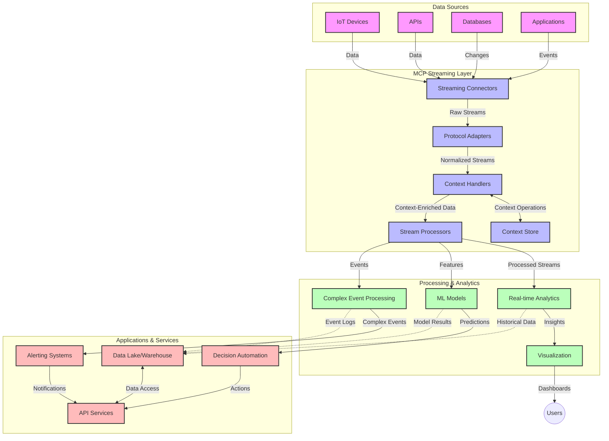

<!--
CO_OP_TRANSLATOR_METADATA:
{
  "original_hash": "68c518dbff8a3b127ed2aa934054c56c",
  "translation_date": "2025-06-11T17:07:18+00:00",
  "source_file": "05-AdvancedTopics/mcp-realtimestreaming/README.md",
  "language_code": "mr"
}
-->
# Model Context Protocol for Real-Time Data Streaming

## Overview

आजच्या डेटा-चालित जगात, व्यवसाय आणि अनुप्रयोगांना त्वरित माहिती मिळणे आवश्यक आहे जेणेकरून ते योग्य वेळी निर्णय घेऊ शकतील. Model Context Protocol (MCP) हा रिअल-टाइम स्ट्रीमिंग प्रक्रियांचा कार्यक्षमतेने वापर करण्यासाठी एक महत्त्वपूर्ण प्रगती आहे, ज्यामुळे डेटा प्रक्रिया अधिक जलद होते, संदर्भ टिकवून ठेवला जातो, आणि संपूर्ण प्रणालीची कामगिरी सुधारते.

हा मॉड्यूल MCP कसा रिअल-टाइम डेटा स्ट्रीमिंगमध्ये बदल घडवून आणतो हे सांगतो, ज्यामुळे AI मॉडेल्स, स्ट्रीमिंग प्लॅटफॉर्म आणि अनुप्रयोगांमध्ये संदर्भ व्यवस्थापनासाठी एकसंध पद्धत उपलब्ध होते.

## रिअल-टाइम डेटा स्ट्रीमिंगची ओळख

रिअल-टाइम डेटा स्ट्रीमिंग ही अशी तंत्रज्ञानात्मक पद्धत आहे जी डेटा सतत तयार होताच तो ट्रान्सफर, प्रक्रिया आणि विश्लेषण करण्यास सक्षम करते, ज्यामुळे सिस्टम्स नवीन माहितीवर त्वरित प्रतिक्रिया देऊ शकतात. पारंपरिक बॅच प्रोसेसिंगपेक्षा वेगळी, जी स्थिर डेटासेटवर काम करते, स्ट्रीमिंगमध्ये डेटा सतत प्रवाहित होतो आणि कमी विलंबात परिणाम मिळतात.

### रिअल-टाइम डेटा स्ट्रीमिंगचे मुख्य संकल्पना:

- **सतत डेटा प्रवाह**: डेटा सतत, अखंड घटनांच्या किंवा रेकॉर्ड्सच्या स्वरूपात प्रक्रिया होतो.
- **कमी विलंब प्रक्रिया**: डेटा तयार होण्यापासून प्रक्रिया होईपर्यंतचा वेळ कमी करण्यावर भर.
- **वाढवता येण्याजोगी प्रणाली**: स्ट्रीमिंग आर्किटेक्चरला बदलत्या डेटा प्रमाण आणि वेगाला हाताळता यावे लागते.
- **फॉल्ट टॉलरन्स**: सिस्टम्सला अपयशांपासून सुरक्षित ठेवणे आवश्यक आहे जेणेकरून डेटा प्रवाह अखंड राहील.
- **स्टेटफुल प्रोसेसिंग**: घटनांमधील संदर्भ टिकवणे महत्त्वाचे असते जेणेकरून अर्थपूर्ण विश्लेषण करता येईल.

### Model Context Protocol आणि रिअल-टाइम स्ट्रीमिंग

Model Context Protocol (MCP) रिअल-टाइम स्ट्रीमिंगमध्ये खालील महत्त्वाच्या अडचणींना सामोरे जातो:

1. **संदर्भाची सातत्य**: MCP वितरित स्ट्रीमिंग घटकांमध्ये संदर्भ कसा टिकवून ठेवायचा यासाठी एकसंध मानक तयार करतो, ज्यामुळे AI मॉडेल्स आणि प्रक्रिया नोड्सना संबंधित ऐतिहासिक आणि पर्यावरणीय संदर्भ उपलब्ध होतो.

2. **कार्यक्षम स्टेट व्यवस्थापन**: संदर्भ प्रसारणासाठी रचनेत पद्धती पुरवून MCP स्ट्रीमिंग पाइपलाइनमधील स्टेट व्यवस्थापनाचा भार कमी करतो.

3. **इंटरऑपरेबिलिटी**: MCP विविध स्ट्रीमिंग तंत्रज्ञान आणि AI मॉडेल्समधील संदर्भ शेअरिंगसाठी एक सामान्य भाषा तयार करतो, ज्यामुळे अधिक लवचीक आणि विस्तारक्षम आर्किटेक्चर शक्य होतात.

4. **स्ट्रीमिंग-ऑप्टिमाइझ्ड संदर्भ**: MCP अमलात आणल्यावर कोणते संदर्भ घटक रिअल-टाइम निर्णयांसाठी सर्वाधिक महत्त्वाचे आहेत हे प्राधान्य देऊ शकतो, ज्यामुळे कार्यक्षमता आणि अचूकता दोन्ही सुधारतात.

5. **अनुकूली प्रक्रिया**: योग्य संदर्भ व्यवस्थापनामुळे MCP वापरून स्ट्रीमिंग सिस्टम्स डेटा मधील बदलत्या परिस्थिती आणि नमुन्यांनुसार प्रक्रिया गतिमानपणे समायोजित करू शकतात.

आधुनिक अनुप्रयोगांमध्ये, जसे IoT सेन्सर नेटवर्क्सपासून ते वित्तीय ट्रेडिंग प्लॅटफॉर्मपर्यंत, MCP आणि स्ट्रीमिंग तंत्रज्ञानांचे एकत्रीकरण अधिक बुद्धिमान, संदर्भ-जाणकार प्रक्रिया सक्षम करते, जी गुंतागुंतीच्या आणि बदलत्या परिस्थितींना रिअल-टाइममध्ये योग्य प्रतिसाद देऊ शकते.

## शिकण्याचे उद्दिष्ट

या धड्याच्या शेवटी, तुम्ही सक्षम असाल:

- रिअल-टाइम डेटा स्ट्रीमिंगच्या मूलभूत गोष्टी आणि त्याच्या आव्हानांची समज
- Model Context Protocol (MCP) रिअल-टाइम डेटा स्ट्रीमिंग कशी सुधारते हे समजावून सांगणे
- Kafka आणि Pulsar सारख्या लोकप्रिय फ्रेमवर्क्स वापरून MCP-आधारित स्ट्रीमिंग सोल्यूशन्सची अंमलबजावणी करणे
- MCP वापरून दोष-प्रतिरोधक, उच्च-कार्यक्षमतेच्या स्ट्रीमिंग आर्किटेक्चरची रचना आणि तैनाती करणे
- IoT, वित्तीय ट्रेडिंग, आणि AI-आधारित विश्लेषण वापर प्रकरणांमध्ये MCP संकल्पना लागू करणे
- MCP-आधारित स्ट्रीमिंग तंत्रज्ञानातील उदयोन्मुख ट्रेंड्स आणि भविष्यातील नवकल्पनांचे मूल्यांकन करणे

### व्याख्या आणि महत्त्व

रिअल-टाइम डेटा स्ट्रीमिंग म्हणजे डेटा सतत निर्माण होणे, प्रक्रिया होणे आणि कमी विलंबात वितरित होणे. बॅच प्रोसेसिंगमध्ये डेटा गटात गोळा करून प्रक्रिया केली जाते, तर स्ट्रीमिंगमध्ये डेटा येताच टप्प्याटप्प्याने प्रक्रिया होतो, ज्यामुळे त्वरित अंतर्दृष्टी आणि क्रिया शक्य होतात.

रिअल-टाइम डेटा स्ट्रीमिंगची मुख्य वैशिष्ट्ये:

- **कमी विलंब**: डेटा प्रक्रिया आणि विश्लेषण काही मिलीसेकंदांपासून सेकंदांपर्यंत
- **सतत प्रवाह**: विविध स्रोतांकडून अखंड डेटा प्रवाह
- **तत्काळ प्रक्रिया**: डेटा येताच त्याचे विश्लेषण, बॅचमध्ये नाही
- **इव्हेंट-ड्रिव्हन आर्किटेक्चर**: घटना घडल्यावर त्वरित प्रतिसाद देणे

### पारंपरिक डेटा स्ट्रीमिंगमधील आव्हाने

पारंपरिक डेटा स्ट्रीमिंगमध्ये काही मर्यादा आहेत:

1. **संदर्भ हरवणे**: वितरित प्रणालींमध्ये संदर्भ टिकवणे कठीण
2. **वाढवता येण्यास अडचण**: उच्च-प्रमाण, उच्च-वेग डेटा हाताळताना समस्या
3. **समाकलन गुंतागुंत**: वेगवेगळ्या प्रणालींमध्ये इंटरऑपरेबिलिटीची अडचण
4. **विलंब व्यवस्थापन**: थ्रूपुट आणि प्रक्रिया वेळ यामध्ये समतोल राखणे
5. **डेटा सुसंगतता**: संपूर्ण स्ट्रीममध्ये डेटा अचूकता आणि पूर्णता सुनिश्चित करणे

## Model Context Protocol (MCP) समजून घेणे

### MCP म्हणजे काय?

Model Context Protocol (MCP) हा एक मानकीकृत संवाद प्रोटोकॉल आहे जो AI मॉडेल्स आणि अनुप्रयोगांमधील कार्यक्षम संवादासाठी डिझाइन केला आहे. रिअल-टाइम डेटा स्ट्रीमिंगच्या संदर्भात, MCP खालील गोष्टींसाठी फ्रेमवर्क पुरवतो:

- डेटा पाइपलाइनमध्ये संदर्भ टिकवणे
- डेटा एक्सचेंज फॉरमॅट्सचे मानकीकरण
- मोठ्या डेटासेटच्या ट्रान्समिशनचे ऑप्टिमायझेशन
- मॉडेल-टू-मॉडेल आणि मॉडेल-टू-अनुप्रयोग संवाद सुधारणा

### मुख्य घटक आणि आर्किटेक्चर

रिअल-टाइम स्ट्रीमिंगसाठी MCP आर्किटेक्चरमध्ये खालील मुख्य घटक असतात:

1. **Context Handlers**: स्ट्रीमिंग पाइपलाइनमध्ये संदर्भ माहिती व्यवस्थापित करतात आणि टिकवून ठेवतात
2. **Stream Processors**: संदर्भ-आधारित तंत्र वापरून येणाऱ्या डेटा स्ट्रीम्सवर प्रक्रिया करतात
3. **Protocol Adapters**: विविध स्ट्रीमिंग प्रोटोकॉल्समध्ये रूपांतरण करतात आणि संदर्भ टिकवून ठेवतात
4. **Context Store**: संदर्भ माहिती कार्यक्षमतेने संग्रहित आणि पुनर्प्राप्त करतात
5. **Streaming Connectors**: Kafka, Pulsar, Kinesis इत्यादी विविध स्ट्रीमिंग प्लॅटफॉर्मशी कनेक्ट करतात



### MCP कसा रिअल-टाइम डेटा हाताळणी सुधारतो

MCP पारंपरिक स्ट्रीमिंग आव्हानांवर मात करतो:

- **संदर्भ अखंडता**: संपूर्ण पाइपलाइनमध्ये डेटा पॉइंट्समधील संबंध टिकवणे
- **ऑप्टिमाइझ्ड ट्रान्समिशन**: बुद्धिमान संदर्भ व्यवस्थापनाद्वारे डेटा एक्सचेंजमधील पुनरावृत्ती कमी करणे
- **मानकीकृत इंटरफेस**: स्ट्रीमिंग घटकांसाठी सुसंगत API पुरवणे
- **कमी विलंब**: कार्यक्षम संदर्भ हाताळणीमुळे प्रक्रिया ओव्हरहेड कमी करणे
- **सुधारित वाढवता येण्याजोगीपणा**: संदर्भ टिकवून ठेवताना क्षैतिज स्केलिंगला समर्थन देणे

## एकत्रीकरण आणि अंमलबजावणी

रिअल-टाइम डेटा स्ट्रीमिंग सिस्टम्समध्ये कार्यक्षमता आणि संदर्भ अखंडता टिकवण्यासाठी काळजीपूर्वक आर्किटेक्चरल डिझाइन आणि अंमलबजावणी आवश्यक असते. Model Context Protocol AI मॉडेल्स आणि स्ट्रीमिंग तंत्रज्ञानांचे एकसंधीकरण करण्यासाठी मानकीकृत पद्धत पुरवतो, ज्यामुळे अधिक प्रगत, संदर्भ-जाणकार प्रक्रिया पाइपलाइन तयार होतात.

### स्ट्रीमिंग आर्किटेक्चरमध्ये MCP चे एकत्रीकरण

रिअल-टाइम स्ट्रीमिंगमध्ये MCP अंमलबजावणी करताना काही महत्त्वाचे मुद्दे:

1. **संदर्भ सिरिअलायझेशन आणि ट्रान्सपोर्ट**: MCP संदर्भ माहिती एन्कोड करण्यासाठी कार्यक्षम यंत्रणा पुरवतो, ज्यामुळे आवश्यक संदर्भ डेटा प्रक्रिया पाइपलाइनमध्ये डेटा सोबत फिरतो. यात स्ट्रीमिंग ट्रान्सपोर्टसाठी ऑप्टिमाइझ्ड सिरिअलायझेशन फॉरमॅट्सचा समावेश आहे.

2. **स्टेटफुल स्ट्रीम प्रोसेसिंग**: MCP संदर्भ प्रतिनिधित्व सर्व प्रक्रिया नोड्समध्ये एकसंध ठेवून अधिक बुद्धिमान स्टेटफुल प्रोसेसिंग सक्षम करतो. हे वितरित स्ट्रीमिंग आर्किटेक्चरमध्ये जिथे स्टेट व्यवस्थापन कठीण असते तिथे विशेषतः उपयुक्त आहे.

3. **इव्हेंट-टाइम विरुद्ध प्रोसेसिंग-टाइम**: MCP रिअल-टाइम स्ट्रीमिंग सिस्टममध्ये इव्हेंट कधी घडले आणि कधी प्रक्रिया झाली यातील फरक सांभाळतो. प्रोटोकॉलमध्ये इव्हेंट टाइम सेमॅंटिक्स टिकवून ठेवण्यासाठी कालसापेक्ष संदर्भ समाविष्ट केला जातो.

4. **बॅकप्रेशर व्यवस्थापन**: संदर्भ हाताळणी मानकीकृत करून MCP स्ट्रीमिंग सिस्टममध्ये बॅकप्रेशर व्यवस्थापनात मदत करतो, ज्यामुळे घटक त्यांच्या प्रक्रिया क्षमता दर्शवू शकतात आणि फ्लो समायोजित करू शकतात.

5. **संदर्भ विंडोइंग आणि एकत्रीकरण**: MCP काळजीपूर्वक कालसापेक्ष आणि संबंधीत संदर्भ संरचना पुरवून अधिक प्रगत विंडोइंग ऑपरेशन्ससाठी मदत करतो, ज्यामुळे इव्हेंट स्ट्रीम्समधील अर्थपूर्ण एकत्रीकरण शक्य होते.

6. **एक्झॅक्टली-वन प्रोसेसिंग**: ज्या स्ट्रीमिंग सिस्टम्सना एक्झॅक्टली-वन सेमॅंटिक्सची गरज असते, MCP प्रक्रिया स्थिती ट्रॅक आणि पडताळणी करण्यासाठी प्रक्रिया मेटाडेटा समाविष्ट करू शकतो.

विविध स्ट्रीमिंग तंत्रज्ञानांमध्ये MCP ची अंमलबजावणी संदर्भ व्यवस्थापनासाठी एकसंध पद्धत तयार करते, ज्यामुळे कस्टम समाकलन कोडची गरज कमी होते आणि डेटा पाइपलाइनमधून संदर्भ टिकवण्याची क्षमता वाढते.

### विविध डेटा स्ट्रीमिंग फ्रेमवर्कमध्ये MCP

MCP खालील लोकप्रिय स्ट्रीमिंग फ्रेमवर्क्समध्ये समाकलित करता येतो:

#### Apache Kafka समाकलन

```python
from mcp_streaming import MCPKafkaConnector

# Initialize MCP Kafka connector
connector = MCPKafkaConnector(
    bootstrap_servers='localhost:9092',
    context_preservation=True
)

# Create a context-aware consumer
consumer = connector.create_consumer('input-topic')

# Process streaming data with context
for message in consumer:
    context = message.get_context()
    data = message.get_value()
    
    # Process with context awareness
    result = process_with_context(data, context)
    
    # Produce output with preserved context
    connector.produce('output-topic', result, context=context)
```

#### Apache Pulsar अंमलबजावणी

```python
from mcp_streaming import MCPPulsarClient

# Initialize MCP Pulsar client
client = MCPPulsarClient('pulsar://localhost:6650')

# Subscribe with context awareness
consumer = client.subscribe('input-topic', 'subscription-name', 
                           context_enabled=True)

# Process messages with context preservation
while True:
    message = consumer.receive()
    context = message.get_context()
    
    # Process with context
    result = process_with_context(message.data(), context)
    
    # Acknowledge the message
    consumer.acknowledge(message)
    
    # Send result with preserved context
    producer = client.create_producer('output-topic')
    producer.send(result, context=context)
```

### तैनातीसाठी सर्वोत्तम पद्धती

MCP रिअल-टाइम स्ट्रीमिंगसाठी अंमलात आणताना:

1. **फॉल्ट टॉलरन्ससाठी डिझाइन करा**:
   - योग्य त्रुटी हाताळणी अंमलात आणा
   - अपयशी संदेशांसाठी डेड-लेटर क्यू वापरा
   - आयडेम्पोटेंट प्रोसेसर डिझाइन करा

2. **कार्यक्षमता सुधारित करा**:
   - योग्य बफर साइज कॉन्फिगर करा
   - जिथे योग्य असेल तिथे बॅचिंग वापरा
   - बॅकप्रेशर यंत्रणा अंमलात आणा

3. **मॉनिटर आणि निरीक्षण करा**:
   - स्ट्रीम प्रक्रिया मेट्रिक्स ट्रॅक करा
   - संदर्भ प्रसारावर लक्ष ठेवा
   - अनियमिततेसाठी अलर्ट सेट करा

4. **तुमच्या स्ट्रीम्स सुरक्षित करा**:
   - संवेदनशील डेटासाठी एन्क्रिप्शन वापरा
   - प्रमाणीकरण आणि अधिकृतता वापरा
   - योग्य प्रवेश नियंत्रण लागू करा

### IoT आणि Edge Computing मध्ये MCP

MCP IoT स्ट्रीमिंगमध्ये सुधारणा करते:

- प्रक्रिया पाइपलाइनमध्ये डिव्हाइस संदर्भ टिकवणे
- Edge ते क्लाउड डेटा स्ट्रीमिंग कार्यक्षम करणे
- IoT डेटा स्ट्रीम्सवर रिअल-टाइम विश्लेषण समर्थित करणे
- संदर्भासह डिव्हाइस-टू-डिव्हाइस संवाद सुलभ करणे

उदाहरण: स्मार्ट सिटी सेन्सर नेटवर्क्स  
```
Sensors → Edge Gateways → MCP Stream Processors → Real-time Analytics → Automated Responses
```

### वित्तीय व्यवहार आणि उच्च-वारंवारता ट्रेडिंगमधील भूमिका

वित्तीय डेटा स्ट्रीमिंगसाठी MCP खालील फायदे देतो:

- ट्रेडिंग निर्णयांसाठी अल्ट्रा-कमी विलंब प्रक्रिया
- संपूर्ण प्रक्रियेत व्यवहार संदर्भ टिकवणे
- संदर्भासह क्लिष्ट इव्हेंट प्रोसेसिंगला समर्थन देणे
- वितरित ट्रेडिंग सिस्टम्समध्ये डेटा सुसंगतता सुनिश्चित करणे

### AI-चालित डेटा विश्लेषण सुधारणा

MCP स्ट्रीमिंग विश्लेषणासाठी नवीन संधी निर्माण करतो:

- रिअल-टाइम मॉडेल प्रशिक्षण आणि अनुमान
- स्ट्रीमिंग डेटामधून सातत्यपूर्ण शिक्षण
- संदर्भ-जाणकार फिचर एक्स्ट्रॅक्शन
- संदर्भ टिकवून ठेवणाऱ्या मल्टी-मॉडेल अनुमान पाइपलाइन

## भविष्यातील ट्रेंड्स आणि नवकल्पना

### रिअल-टाइम वातावरणातील MCP चे विकास

पुढील काळात, MCP खालील बाबींना तोंड देईल अशी अपेक्षा आहे:

- **क्वांटम संगणक समाकलन**: क्वांटम-आधारित स्ट्रीमिंग सिस्टम्ससाठी तयारी
- **Edge-नेटिव्ह प्रक्रिया**: अधिक संदर्भ-जाणकार प्रक्रिया Edge डिव्हाइसेसवर हलवणे
- **स्वायत्त स्ट्रीम व्यवस्थापन**: स्वतःचे ऑप्टिमायझेशन करणाऱ्या स्ट्रीमिंग पाइपलाइन
- **संघटित स्ट्रीमिंग**: गोपनीयता राखत वितरित प्रक्रिया

### तंत्रज्ञानातील संभाव्य प्रगती

MCP स्ट्रीमिंगच्या भविष्यात आकार देणारी उदयोन्मुख तंत्रज्ञानं:

1. **AI-ऑप्टिमाइझ्ड स्ट्रीमिंग प्रोटोकॉल्स**: AI कार्यभारासाठी विशेषतः डिझाइन केलेले प्रोटोकॉल
2. **न्यूरोमॉर्फिक संगणक समाकलन**: मेंदू-सदृश संगणक स्ट्रीम प्रक्रिया साठी
3. **सर्व्हरलेस स्ट्रीमिंग**: इन्फ्रास्ट्रक्चर व्यवस्थापनाशिवाय इव्हेंट-ड्रिव्हन, स्केलेबल स्ट्रीमिंग
4. **वितरित संदर्भ स्टोअर्स**: जागतिक पातळीवर वितरित पण अत्यंत सुसंगत संदर्भ व्यवस्थापन

## प्रायोगिक व्यायाम

### व्यायाम 1: मूलभूत MCP स्ट्रीमिंग पाइपलाइन सेटअप

या व्यायामात, तुम्ही शिकाल:

- मूलभूत MCP स्ट्रीमिंग वातावरण कॉन्फिगर करणे
- स्ट्रीम प्रोसेसिंगसाठी संदर्भ हँडलर्स अंमलात आणणे
- संदर्भ टिकवून ठेवण्याची चाचणी आणि पडताळणी करणे

### व्यायाम 2: रिअल-टाइम अ‍ॅनालिटिक्स डॅशबोर्ड तयार करणे

पूर्ण अनुप्रयोग तयार करा जे:

- MCP वापरून स्ट्रीमिंग डेटा ग्रहण करते
- संदर्भ टिकवून स्ट्रीमवर प्रक्रिया करते
- निकाल रिअल-टाइममध्ये दृश्यरूपात सादर करते

### व्यायाम 3: MCP सह क्लिष्ट इव्हेंट प्रोसेसिंग अंमलबजावणी

उन्नत व्यायाम ज्यामध्ये:

- स्ट्रीम्समधील पॅटर्न शोधणे
- अनेक स्ट्रीम्समधील संदर्भात्मक संबंध
- टिकवलेल्या संदर्भास

**अस्वीकरण**:  
हा दस्तऐवज AI अनुवाद सेवा [Co-op Translator](https://github.com/Azure/co-op-translator) वापरून अनुवादित केला आहे. आम्ही अचूकतेसाठी प्रयत्न करतो, तरी कृपया लक्षात घ्या की स्वयंचलित अनुवादांमध्ये चुका किंवा अचूकतेच्या त्रुटी असू शकतात. मूळ दस्तऐवज त्याच्या मूळ भाषेत अधिकृत स्रोत मानला जावा. महत्त्वाच्या माहितीसाठी व्यावसायिक मानवी अनुवाद शिफारसीय आहे. या अनुवादाच्या वापरामुळे उद्भवणाऱ्या कोणत्याही गैरसमजुती किंवा चुकीच्या अर्थलाभाबद्दल आम्ही जबाबदार नाही.