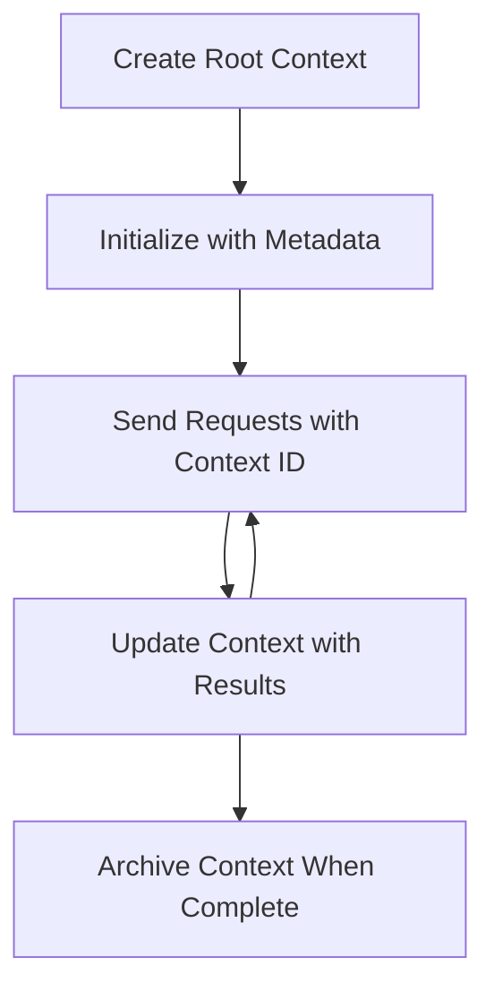

<!--
CO_OP_TRANSLATOR_METADATA:
{
  "original_hash": "ebdb86db46113f1cbd59ce4c74caaa79",
  "translation_date": "2025-07-17T00:22:19+00:00",
  "source_file": "05-AdvancedTopics/mcp-root-contexts/README.md",
  "language_code": "mr"
}
-->
# MCP Root Contexts

Root contexts हे Model Context Protocol मधील एक मूलभूत संकल्पना आहे जी अनेक विनंत्या आणि सत्रांमध्ये संभाषणाचा इतिहास आणि सामायिक स्थिती कायम ठेवण्यासाठी एक सातत्यपूर्ण स्तर प्रदान करते.

## परिचय

या धड्यात, आपण MCP मध्ये root contexts कसे तयार करायचे, व्यवस्थापित करायचे आणि वापरायचे हे पाहू.

## शिकण्याचे उद्दिष्टे

या धड्याच्या शेवटी, तुम्ही सक्षम असाल:

- root contexts चा उद्देश आणि रचना समजून घेणे
- MCP क्लायंट लायब्ररी वापरून root contexts तयार करणे आणि व्यवस्थापित करणे
- .NET, Java, JavaScript, आणि Python अॅप्लिकेशन्समध्ये root contexts अंमलात आणणे
- बहु-टर्न संभाषणे आणि स्थिती व्यवस्थापनासाठी root contexts वापरणे
- root context व्यवस्थापनासाठी सर्वोत्तम पद्धती अंमलात आणणे

## Root Contexts समजून घेणे

Root contexts हे कंटेनर म्हणून काम करतात जे संबंधित संवादांच्या मालिकेचा इतिहास आणि स्थिती ठेवतात. ते खालील गोष्टी सक्षम करतात:

- **संभाषण सातत्य**: सुसंगत बहु-टर्न संभाषणे कायम ठेवणे
- **स्मृती व्यवस्थापन**: संवादांदरम्यान माहिती साठवणे आणि पुनर्प्राप्त करणे
- **स्थिती व्यवस्थापन**: गुंतागुंतीच्या कार्यप्रवाहांमध्ये प्रगती ट्रॅक करणे
- **संदर्भ सामायिकरण**: अनेक क्लायंट्सना एकाच संभाषण स्थितीमध्ये प्रवेश देणे

MCP मध्ये, root contexts चे हे मुख्य वैशिष्ट्ये आहेत:

- प्रत्येक root context ला एक अद्वितीय ओळखपत्र असते.
- त्यात संभाषणाचा इतिहास, वापरकर्त्याच्या पसंती आणि इतर मेटाडेटा असू शकतो.
- ते आवश्यकतेनुसार तयार, प्रवेश आणि संग्रहित केले जाऊ शकतात.
- ते सूक्ष्म-स्तरीय प्रवेश नियंत्रण आणि परवानग्या समर्थन करतात.

## Root Context Lifecycle



## Root Contexts सोबत काम करणे

खाली root contexts कसे तयार आणि व्यवस्थापित करायचे याचे उदाहरण दिले आहे.

### C# अंमलबजावणी

```csharp
// .NET Example: Root Context Management
using Microsoft.Mcp.Client;
using System;
using System.Threading.Tasks;
using System.Collections.Generic;

public class RootContextExample
{
    private readonly IMcpClient _client;
    private readonly IRootContextManager _contextManager;
    
    public RootContextExample(IMcpClient client, IRootContextManager contextManager)
    {
        _client = client;
        _contextManager = contextManager;
    }
    
    public async Task DemonstrateRootContextAsync()
    {
        // 1. Create a new root context
        var contextResult = await _contextManager.CreateRootContextAsync(new RootContextCreateOptions
        {
            Name = "Customer Support Session",
            Metadata = new Dictionary<string, string>
            {
                ["CustomerName"] = "Acme Corporation",
                ["PriorityLevel"] = "High",
                ["Domain"] = "Cloud Services"
            }
        });
        
        string contextId = contextResult.ContextId;
        Console.WriteLine($"Created root context with ID: {contextId}");
        
        // 2. First interaction using the context
        var response1 = await _client.SendPromptAsync(
            "I'm having issues scaling my web service deployment in the cloud.", 
            new SendPromptOptions { RootContextId = contextId }
        );
        
        Console.WriteLine($"First response: {response1.GeneratedText}");
        
        // Second interaction - the model will have access to the previous conversation
        var response2 = await _client.SendPromptAsync(
            "Yes, we're using containerized deployments with Kubernetes.", 
            new SendPromptOptions { RootContextId = contextId }
        );
        
        Console.WriteLine($"Second response: {response2.GeneratedText}");
        
        // 3. Add metadata to the context based on conversation
        await _contextManager.UpdateContextMetadataAsync(contextId, new Dictionary<string, string>
        {
            ["TechnicalEnvironment"] = "Kubernetes",
            ["IssueType"] = "Scaling"
        });
        
        // 4. Get context information
        var contextInfo = await _contextManager.GetRootContextInfoAsync(contextId);
        
        Console.WriteLine("Context Information:");
        Console.WriteLine($"- Name: {contextInfo.Name}");
        Console.WriteLine($"- Created: {contextInfo.CreatedAt}");
        Console.WriteLine($"- Messages: {contextInfo.MessageCount}");
        
        // 5. When the conversation is complete, archive the context
        await _contextManager.ArchiveRootContextAsync(contextId);
        Console.WriteLine($"Archived context {contextId}");
    }
}
```

वरील कोडमध्ये आपण:

1. ग्राहक समर्थन सत्रासाठी root context तयार केला आहे.
2. त्या संदर्भात अनेक संदेश पाठवले, ज्यामुळे मॉडेल स्थिती कायम ठेवू शकले.
3. संभाषणानुसार संदर्भातील संबंधित मेटाडेटा अद्ययावत केला.
4. संभाषणाचा इतिहास समजून घेण्यासाठी संदर्भ माहिती प्राप्त केली.
5. संभाषण पूर्ण झाल्यावर संदर्भ संग्रहित केला.

## उदाहरण: आर्थिक विश्लेषणासाठी Root Context अंमलबजावणी

या उदाहरणात, आपण आर्थिक विश्लेषण सत्रासाठी root context तयार करू, ज्यामुळे अनेक संवादांमध्ये स्थिती कायम ठेवता येईल.

### Java अंमलबजावणी

```java
// Java Example: Root Context Implementation
package com.example.mcp.contexts;

import com.mcp.client.McpClient;
import com.mcp.client.ContextManager;
import com.mcp.models.RootContext;
import com.mcp.models.McpResponse;

import java.util.HashMap;
import java.util.Map;
import java.util.UUID;

public class RootContextsDemo {
    private final McpClient client;
    private final ContextManager contextManager;
    
    public RootContextsDemo(String serverUrl) {
        this.client = new McpClient.Builder()
            .setServerUrl(serverUrl)
            .build();
            
        this.contextManager = new ContextManager(client);
    }
    
    public void demonstrateRootContext() throws Exception {
        // Create context metadata
        Map<String, String> metadata = new HashMap<>();
        metadata.put("projectName", "Financial Analysis");
        metadata.put("userRole", "Financial Analyst");
        metadata.put("dataSource", "Q1 2025 Financial Reports");
        
        // 1. Create a new root context
        RootContext context = contextManager.createRootContext("Financial Analysis Session", metadata);
        String contextId = context.getId();
        
        System.out.println("Created context: " + contextId);
        
        // 2. First interaction
        McpResponse response1 = client.sendPrompt(
            "Analyze the trends in Q1 financial data for our technology division",
            contextId
        );
        
        System.out.println("First response: " + response1.getGeneratedText());
        
        // 3. Update context with important information gained from response
        contextManager.addContextMetadata(contextId, 
            Map.of("identifiedTrend", "Increasing cloud infrastructure costs"));
        
        // Second interaction - using the same context
        McpResponse response2 = client.sendPrompt(
            "What's driving the increase in cloud infrastructure costs?",
            contextId
        );
        
        System.out.println("Second response: " + response2.getGeneratedText());
        
        // 4. Generate a summary of the analysis session
        McpResponse summaryResponse = client.sendPrompt(
            "Summarize our analysis of the technology division financials in 3-5 key points",
            contextId
        );
        
        // Store the summary in context metadata
        contextManager.addContextMetadata(contextId, 
            Map.of("analysisSummary", summaryResponse.getGeneratedText()));
            
        // Get updated context information
        RootContext updatedContext = contextManager.getRootContext(contextId);
        
        System.out.println("Context Information:");
        System.out.println("- Created: " + updatedContext.getCreatedAt());
        System.out.println("- Last Updated: " + updatedContext.getLastUpdatedAt());
        System.out.println("- Analysis Summary: " + 
            updatedContext.getMetadata().get("analysisSummary"));
            
        // 5. Archive context when done
        contextManager.archiveContext(contextId);
        System.out.println("Context archived");
    }
}
```

वरील कोडमध्ये आपण:

1. आर्थिक विश्लेषण सत्रासाठी root context तयार केला आहे.
2. त्या संदर्भात अनेक संदेश पाठवले, ज्यामुळे मॉडेल स्थिती कायम ठेवू शकले.
3. संभाषणानुसार संदर्भातील संबंधित मेटाडेटा अद्ययावत केला.
4. विश्लेषण सत्राचा सारांश तयार केला आणि तो संदर्भ मेटाडेटामध्ये साठवला.
5. संभाषण पूर्ण झाल्यावर संदर्भ संग्रहित केला.

## उदाहरण: Root Context व्यवस्थापन

संभाषणाचा इतिहास आणि स्थिती कायम ठेवण्यासाठी root contexts चे प्रभावी व्यवस्थापन महत्त्वाचे आहे. खाली root context व्यवस्थापन कसे अंमलात आणायचे याचे उदाहरण दिले आहे.

### JavaScript अंमलबजावणी

```javascript
// JavaScript Example: Managing MCP Root Contexts
const { McpClient, RootContextManager } = require('@mcp/client');

class ContextSession {
  constructor(serverUrl, apiKey = null) {
    // Initialize the MCP client
    this.client = new McpClient({
      serverUrl,
      apiKey
    });
    
    // Initialize context manager
    this.contextManager = new RootContextManager(this.client);
  }
  
  /**
   * Create a new conversation context
   * @param {string} sessionName - Name of the conversation session
   * @param {Object} metadata - Additional metadata for the context
   * @returns {Promise<string>} - Context ID
   */
  async createConversationContext(sessionName, metadata = {}) {
    try {
      const contextResult = await this.contextManager.createRootContext({
        name: sessionName,
        metadata: {
          ...metadata,
          createdAt: new Date().toISOString(),
          status: 'active'
        }
      });
      
      console.log(`Created root context '${sessionName}' with ID: ${contextResult.id}`);
      return contextResult.id;
    } catch (error) {
      console.error('Error creating root context:', error);
      throw error;
    }
  }
  
  /**
   * Send a message in an existing context
   * @param {string} contextId - The root context ID
   * @param {string} message - The user's message
   * @param {Object} options - Additional options
   * @returns {Promise<Object>} - Response data
   */
  async sendMessage(contextId, message, options = {}) {
    try {
      // Send the message using the specified context
      const response = await this.client.sendPrompt(message, {
        rootContextId: contextId,
        temperature: options.temperature || 0.7,
        allowedTools: options.allowedTools || []
      });
      
      // Optionally store important insights from the conversation
      if (options.storeInsights) {
        await this.storeConversationInsights(contextId, message, response.generatedText);
      }
      
      return {
        message: response.generatedText,
        toolCalls: response.toolCalls || [],
        contextId
      };
    } catch (error) {
      console.error(`Error sending message in context ${contextId}:`, error);
      throw error;
    }
  }
  
  /**
   * Store important insights from a conversation
   * @param {string} contextId - The root context ID
   * @param {string} userMessage - User's message
   * @param {string} aiResponse - AI's response
   */
  async storeConversationInsights(contextId, userMessage, aiResponse) {
    try {
      // Extract potential insights (in a real app, this would be more sophisticated)
      const combinedText = userMessage + "\n" + aiResponse;
      
      // Simple heuristic to identify potential insights
      const insightWords = ["important", "key point", "remember", "significant", "crucial"];
      
      const potentialInsights = combinedText
        .split(".")
        .filter(sentence => 
          insightWords.some(word => sentence.toLowerCase().includes(word))
        )
        .map(sentence => sentence.trim())
        .filter(sentence => sentence.length > 10);
      
      // Store insights in context metadata
      if (potentialInsights.length > 0) {
        const insights = {};
        potentialInsights.forEach((insight, index) => {
          insights[`insight_${Date.now()}_${index}`] = insight;
        });
        
        await this.contextManager.updateContextMetadata(contextId, insights);
        console.log(`Stored ${potentialInsights.length} insights in context ${contextId}`);
      }
    } catch (error) {
      console.warn('Error storing conversation insights:', error);
      // Non-critical error, so just log warning
    }
  }
  
  /**
   * Get summary information about a context
   * @param {string} contextId - The root context ID
   * @returns {Promise<Object>} - Context information
   */
  async getContextInfo(contextId) {
    try {
      const contextInfo = await this.contextManager.getContextInfo(contextId);
      
      return {
        id: contextInfo.id,
        name: contextInfo.name,
        created: new Date(contextInfo.createdAt).toLocaleString(),
        lastUpdated: new Date(contextInfo.lastUpdatedAt).toLocaleString(),
        messageCount: contextInfo.messageCount,
        metadata: contextInfo.metadata,
        status: contextInfo.status
      };
    } catch (error) {
      console.error(`Error getting context info for ${contextId}:`, error);
      throw error;
    }
  }
  
  /**
   * Generate a summary of the conversation in a context
   * @param {string} contextId - The root context ID
   * @returns {Promise<string>} - Generated summary
   */
  async generateContextSummary(contextId) {
    try {
      // Ask the model to generate a summary of the conversation so far
      const response = await this.client.sendPrompt(
        "Please summarize our conversation so far in 3-4 sentences, highlighting the main points discussed.",
        { rootContextId: contextId, temperature: 0.3 }
      );
      
      // Store the summary in context metadata
      await this.contextManager.updateContextMetadata(contextId, {
        conversationSummary: response.generatedText,
        summarizedAt: new Date().toISOString()
      });
      
      return response.generatedText;
    } catch (error) {
      console.error(`Error generating context summary for ${contextId}:`, error);
      throw error;
    }
  }
  
  /**
   * Archive a context when it's no longer needed
   * @param {string} contextId - The root context ID
   * @returns {Promise<Object>} - Result of the archive operation
   */
  async archiveContext(contextId) {
    try {
      // Generate a final summary before archiving
      const summary = await this.generateContextSummary(contextId);
      
      // Archive the context
      await this.contextManager.archiveContext(contextId);
      
      return {
        status: "archived",
        contextId,
        summary
      };
    } catch (error) {
      console.error(`Error archiving context ${contextId}:`, error);
      throw error;
    }
  }
}

// Example usage
async function demonstrateContextSession() {
  const session = new ContextSession('https://mcp-server-example.com');
  
  try {
    // 1. Create a new context for a product support conversation
    const contextId = await session.createConversationContext(
      'Product Support - Database Performance',
      {
        customer: 'Globex Corporation',
        product: 'Enterprise Database',
        severity: 'Medium',
        supportAgent: 'AI Assistant'
      }
    );
    
    // 2. First message in the conversation
    const response1 = await session.sendMessage(
      contextId,
      "I'm experiencing slow query performance on our database cluster after the latest update.",
      { storeInsights: true }
    );
    console.log('Response 1:', response1.message);
    
    // Follow-up message in the same context
    const response2 = await session.sendMessage(
      contextId,
      "Yes, we've already checked the indexes and they seem to be properly configured.",
      { storeInsights: true }
    );
    console.log('Response 2:', response2.message);
    
    // 3. Get information about the context
    const contextInfo = await session.getContextInfo(contextId);
    console.log('Context Information:', contextInfo);
    
    // 4. Generate and display conversation summary
    const summary = await session.generateContextSummary(contextId);
    console.log('Conversation Summary:', summary);
    
    // 5. Archive the context when done
    const archiveResult = await session.archiveContext(contextId);
    console.log('Archive Result:', archiveResult);
    
    // 6. Handle any errors gracefully
  } catch (error) {
    console.error('Error in context session demonstration:', error);
  }
}

demonstrateContextSession();
```

वरील कोडमध्ये आपण:

1. `createConversationContext` फंक्शन वापरून उत्पादन समर्थन संभाषणासाठी root context तयार केला आहे. या प्रकरणात, संदर्भ डेटाबेस कार्यक्षमता समस्यांबाबत आहे.

2. `sendMessage` फंक्शन वापरून त्या संदर्भात अनेक संदेश पाठवले, ज्यामुळे मॉडेल स्थिती कायम ठेवू शकले. पाठवलेले संदेश हळू क्वेरी कार्यक्षमता आणि निर्देशांक संरचनेबाबत आहेत.

3. संभाषणानुसार संदर्भातील संबंधित मेटाडेटा अद्ययावत केला.

4. `generateContextSummary` फंक्शन वापरून संभाषणाचा सारांश तयार केला आणि तो संदर्भ मेटाडेटामध्ये साठवला.

5. `archiveContext` फंक्शन वापरून संभाषण पूर्ण झाल्यावर संदर्भ संग्रहित केला.

6. त्रुटींचे योग्य हाताळणी केली ज्यामुळे प्रणालीची मजबुती सुनिश्चित झाली.

## बहु-टर्न सहाय्यासाठी Root Context

या उदाहरणात, आपण बहु-टर्न सहाय्य सत्रासाठी root context तयार करू, ज्यामुळे अनेक संवादांमध्ये स्थिती कायम ठेवता येईल.

### Python अंमलबजावणी

```python
# Python Example: Root Context for Multi-Turn Assistance
import asyncio
from datetime import datetime
from mcp_client import McpClient, RootContextManager

class AssistantSession:
    def __init__(self, server_url, api_key=None):
        self.client = McpClient(server_url=server_url, api_key=api_key)
        self.context_manager = RootContextManager(self.client)
    
    async def create_session(self, name, user_info=None):
        """Create a new root context for an assistant session"""
        metadata = {
            "session_type": "assistant",
            "created_at": datetime.now().isoformat(),
        }
        
        # Add user information if provided
        if user_info:
            metadata.update({f"user_{k}": v for k, v in user_info.items()})
            
        # Create the root context
        context = await self.context_manager.create_root_context(name, metadata)
        return context.id
    
    async def send_message(self, context_id, message, tools=None):
        """Send a message within a root context"""
        # Create options with context ID
        options = {
            "root_context_id": context_id
        }
        
        # Add tools if specified
        if tools:
            options["allowed_tools"] = tools
        
        # Send the prompt within the context
        response = await self.client.send_prompt(message, options)
        
        # Update context metadata with conversation progress
        await self.context_manager.update_context_metadata(
            context_id,
            {
                f"message_{datetime.now().timestamp()}": message[:50] + "...",
                "last_interaction": datetime.now().isoformat()
            }
        )
        
        return response
    
    async def get_conversation_history(self, context_id):
        """Retrieve conversation history from a context"""
        context_info = await self.context_manager.get_context_info(context_id)
        messages = await self.client.get_context_messages(context_id)
        
        return {
            "context_info": context_info,
            "messages": messages
        }
    
    async def end_session(self, context_id):
        """End an assistant session by archiving the context"""
        # Generate a summary prompt first
        summary_response = await self.client.send_prompt(
            "Please summarize our conversation and any key points or decisions made.",
            {"root_context_id": context_id}
        )
        
        # Store summary in metadata
        await self.context_manager.update_context_metadata(
            context_id,
            {
                "summary": summary_response.generated_text,
                "ended_at": datetime.now().isoformat(),
                "status": "completed"
            }
        )
        
        # Archive the context
        await self.context_manager.archive_context(context_id)
        
        return {
            "status": "completed",
            "summary": summary_response.generated_text
        }

# Example usage
async def demo_assistant_session():
    assistant = AssistantSession("https://mcp-server-example.com")
    
    # 1. Create session
    context_id = await assistant.create_session(
        "Technical Support Session",
        {"name": "Alex", "technical_level": "advanced", "product": "Cloud Services"}
    )
    print(f"Created session with context ID: {context_id}")
    
    # 2. First interaction
    response1 = await assistant.send_message(
        context_id, 
        "I'm having trouble with the auto-scaling feature in your cloud platform.",
        ["documentation_search", "diagnostic_tool"]
    )
    print(f"Response 1: {response1.generated_text}")
    
    # Second interaction in the same context
    response2 = await assistant.send_message(
        context_id,
        "Yes, I've already checked the configuration settings you mentioned, but it's still not working."
    )
    print(f"Response 2: {response2.generated_text}")
    
    # 3. Get history
    history = await assistant.get_conversation_history(context_id)
    print(f"Session has {len(history['messages'])} messages")
    
    # 4. End session
    end_result = await assistant.end_session(context_id)
    print(f"Session ended with summary: {end_result['summary']}")

if __name__ == "__main__":
    asyncio.run(demo_assistant_session())
```

वरील कोडमध्ये आपण:

1. `create_session` फंक्शन वापरून तांत्रिक समर्थन सत्रासाठी root context तयार केला आहे. संदर्भात वापरकर्त्याची माहिती जसे नाव आणि तांत्रिक पातळी समाविष्ट आहे.

2. `send_message` फंक्शन वापरून त्या संदर्भात अनेक संदेश पाठवले, ज्यामुळे मॉडेल स्थिती कायम ठेवू शकले. पाठवलेले संदेश ऑटो-स्केलिंग वैशिष्ट्याशी संबंधित समस्या आहेत.

3. `get_conversation_history` फंक्शन वापरून संभाषणाचा इतिहास प्राप्त केला, ज्यात संदर्भ माहिती आणि संदेशांचा समावेश आहे.

4. `end_session` फंक्शन वापरून सत्र संपवले, संदर्भ संग्रहित केला आणि संभाषणाचा सारांश तयार केला. सारांशात संभाषणातील मुख्य मुद्दे टिपले गेले आहेत.

## Root Context सर्वोत्तम पद्धती

root contexts चे प्रभावी व्यवस्थापन करण्यासाठी काही सर्वोत्तम पद्धती:

- **लक्ष केंद्रीत संदर्भ तयार करा**: वेगवेगळ्या संभाषण उद्दिष्टे किंवा क्षेत्रांसाठी स्वतंत्र root contexts तयार करा ज्यामुळे स्पष्टता राखता येईल.

- **कालबाह्यता धोरणे सेट करा**: जुने संदर्भ संग्रहित किंवा हटवण्यासाठी धोरणे अंमलात आणा ज्यामुळे संचयन व्यवस्थापन आणि डेटा राखणी धोरणांचे पालन होईल.

- **संबंधित मेटाडेटा साठवा**: संभाषणाबाबत महत्त्वाची माहिती संदर्भ मेटाडेटामध्ये साठवा जी नंतर उपयुक्त ठरू शकते.

- **संदर्भ आयडी सातत्याने वापरा**: एकदा संदर्भ तयार झाल्यावर त्याचा आयडी सर्व संबंधित विनंत्यांसाठी सातत्याने वापरा ज्यामुळे सलगता राखता येईल.

- **सारांश तयार करा**: संदर्भ मोठा झाल्यास, आवश्यक माहिती टिपण्यासाठी सारांश तयार करण्याचा विचार करा ज्यामुळे संदर्भाचा आकार व्यवस्थापित करता येईल.

- **प्रवेश नियंत्रण अंमलात आणा**: बहु-वापरकर्ता प्रणालींसाठी, संभाषण संदर्भांच्या गोपनीयता आणि सुरक्षिततेसाठी योग्य प्रवेश नियंत्रण लागू करा.

- **संदर्भ मर्यादा हाताळा**: संदर्भ आकाराच्या मर्यादा लक्षात ठेवा आणि खूप लांब संभाषणे हाताळण्यासाठी धोरणे तयार करा.

- **पूर्ण झाल्यावर संग्रहित करा**: संभाषण पूर्ण झाल्यावर संदर्भ संग्रहित करा ज्यामुळे संसाधने मुक्त होतात आणि संभाषणाचा इतिहास जपला जातो.

## पुढे काय

- [5.5 Routing](../mcp-routing/README.md)

**अस्वीकरण**:  
हा दस्तऐवज AI अनुवाद सेवा [Co-op Translator](https://github.com/Azure/co-op-translator) वापरून अनुवादित केला आहे. आम्ही अचूकतेसाठी प्रयत्नशील असलो तरी, कृपया लक्षात घ्या की स्वयंचलित अनुवादांमध्ये चुका किंवा अचूकतेची कमतरता असू शकते. मूळ दस्तऐवज त्याच्या स्थानिक भाषेत अधिकृत स्रोत मानला जावा. महत्त्वाच्या माहितीसाठी व्यावसायिक मानवी अनुवाद करण्याची शिफारस केली जाते. या अनुवादाच्या वापरामुळे उद्भवलेल्या कोणत्याही गैरसमजुती किंवा चुकीच्या अर्थलागी आम्ही जबाबदार नाही.