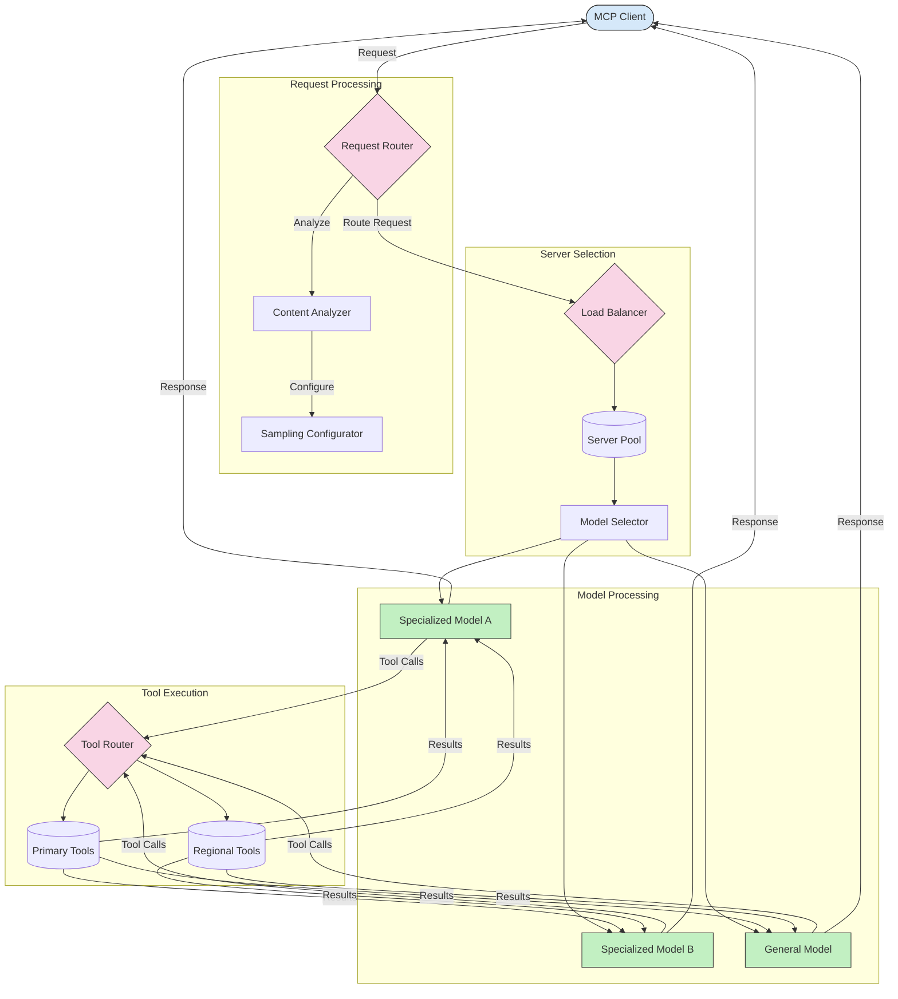

<!--
CO_OP_TRANSLATOR_METADATA:
{
  "original_hash": "2f1b473818b5a6cc9a9bbf777fffa6d4",
  "translation_date": "2025-07-14T21:46:18+00:00",
  "source_file": "05-AdvancedTopics/mcp-routing/README.md",
  "language_code": "mr"
}
-->
## MCP मधील सॅम्पलिंग आणि राउटिंग आर्किटेक्चर

सॅम्पलिंग हा Model Context Protocol (MCP) चा एक महत्त्वाचा घटक आहे जो कार्यक्षम विनंती प्रक्रिया आणि राउटिंगसाठी वापरला जातो. यात येणाऱ्या विनंत्यांचे विश्लेषण करून त्यांना हाताळण्यासाठी सर्वात योग्य मॉडेल किंवा सेवा ठरवली जाते, ज्यासाठी विविध निकष वापरले जातात जसे की सामग्रीचा प्रकार, वापरकर्त्याचा संदर्भ, आणि सिस्टमचा लोड.

सॅम्पलिंग आणि राउटिंग एकत्र करून एक मजबूत आर्किटेक्चर तयार करता येते जे संसाधनांचा उत्तम वापर सुनिश्चित करते आणि उच्च उपलब्धता राखते. सॅम्पलिंग प्रक्रियेद्वारे विनंत्यांचे वर्गीकरण केले जाते, तर राउटिंग त्यांना योग्य मॉडेल किंवा सेवेकडे मार्गदर्शन करते.

खालील आकृतीमध्ये सॅम्पलिंग आणि राउटिंग कसे एकत्र काम करतात हे दाखवले आहे:

## पुढे काय

- [5.6 सॅम्पलिंग](../mcp-sampling/README.md)

**अस्वीकरण**:  
हा दस्तऐवज AI अनुवाद सेवा [Co-op Translator](https://github.com/Azure/co-op-translator) वापरून अनुवादित केला आहे. आम्ही अचूकतेसाठी प्रयत्नशील असलो तरी, कृपया लक्षात घ्या की स्वयंचलित अनुवादांमध्ये चुका किंवा अचूकतेची कमतरता असू शकते. मूळ दस्तऐवज त्याच्या स्थानिक भाषेत अधिकृत स्रोत मानला जावा. महत्त्वाच्या माहितीसाठी व्यावसायिक मानवी अनुवाद करण्याची शिफारस केली जाते. या अनुवादाच्या वापरामुळे उद्भवणाऱ्या कोणत्याही गैरसमजुती किंवा चुकीच्या अर्थलागी आम्ही जबाबदार नाही.