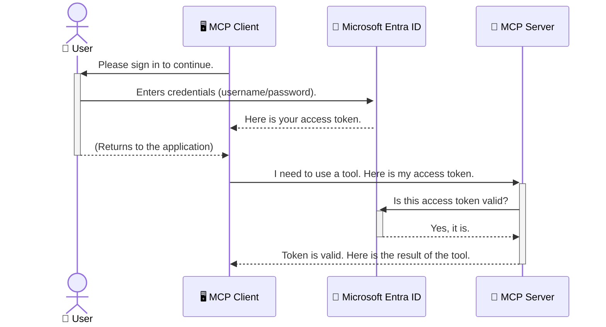

<!--
CO_OP_TRANSLATOR_METADATA:
{
  "original_hash": "6e562d7e5a77c8982da4aa8f762ad1d8",
  "translation_date": "2025-07-02T09:13:04+00:00",
  "source_file": "05-AdvancedTopics/mcp-security-entra/README.md",
  "language_code": "mr"
}
-->
# AI वर्कफ्लोज सुरक्षित करणे: Entra ID Authentication द्वारे Model Context Protocol सर्व्हर सुरक्षित करणे

## परिचय  
Model Context Protocol (MCP) सर्व्हर सुरक्षित करणे हे आपल्या घराच्या मुख्य दरवाजाला लॉक करण्याइतकेच महत्त्वाचे आहे. जर MCP सर्व्हर उघडा ठेवला तर आपली साधने आणि डेटा अनधिकृत प्रवेशासाठी उघडे राहतात, ज्यामुळे सुरक्षा भंग होऊ शकतो. Microsoft Entra ID एक मजबूत क्लाउड-आधारित ओळख आणि प्रवेश व्यवस्थापन सेवा आहे, जी फक्त अधिकृत वापरकर्ते आणि अनुप्रयोगांना आपल्या MCP सर्व्हरशी संवाद साधण्याची परवानगी देते. या विभागात, आपण Entra ID प्रमाणीकरण वापरून आपल्या AI वर्कफ्लोज सुरक्षित करण्याबद्दल शिकाल.

## शिक्षण उद्दिष्टे  
या विभागाच्या शेवटी, आपण सक्षम असाल:

- MCP सर्व्हर सुरक्षित करण्याचे महत्त्व समजून घेणे.  
- Microsoft Entra ID आणि OAuth 2.0 प्रमाणीकरणाची मूलभूत माहिती सांगणे.  
- सार्वजनिक आणि गोपनीय क्लायंटमधील फरक ओळखणे.  
- स्थानिक (सार्वजनिक क्लायंट) आणि दूरस्थ (गोपनीय क्लायंट) MCP सर्व्हर परिस्थितींमध्ये Entra ID प्रमाणीकरण राबवणे.  
- AI वर्कफ्लोज विकसित करताना सुरक्षा सर्वोत्तम पद्धतींचा वापर करणे.

## सुरक्षा आणि MCP

जसे आपण आपल्या घराचा मुख्य दरवाजा उघडा ठेवणार नाही तसेच MCP सर्व्हर कोणालाही प्रवेशासाठी उघडा ठेवू नये. आपल्या AI वर्कफ्लोज सुरक्षित ठेवणे ही मजबूत, विश्वासार्ह आणि सुरक्षित अनुप्रयोग तयार करण्यासाठी अत्यावश्यक बाब आहे. या प्रकरणात आपण Microsoft Entra ID वापरून MCP सर्व्हर कसे सुरक्षित करायचे ते शिकाल, ज्यामुळे फक्त अधिकृत वापरकर्ते आणि अनुप्रयोग आपल्या साधने आणि डेटाशी संवाद साधू शकतील.

## MCP सर्व्हर साठी सुरक्षा का आवश्यक आहे

कल्पना करा की तुमच्या MCP सर्व्हरवर असा टूल आहे जो ईमेल पाठवू शकतो किंवा ग्राहक डेटाबेसमध्ये प्रवेश करू शकतो. जर सर्व्हर सुरक्षित नसेल तर कोणताही व्यक्ती तो टूल वापरू शकतो, ज्यामुळे अनधिकृत डेटा प्रवेश, स्पॅम किंवा इतर घातक क्रिया होऊ शकतात.

प्रमाणीकरण राबवून, आपण प्रत्येक विनंतीची पडताळणी करता, ज्यामुळे विनंती करणाऱ्या वापरकर्त्याची किंवा अनुप्रयोगाची ओळख निश्चित होते. हे आपल्या AI वर्कफ्लोज सुरक्षित करण्याचा पहिला आणि सर्वात महत्त्वाचा टप्पा आहे.

## Microsoft Entra ID ची ओळख

[**Microsoft Entra ID**](https://adoption.microsoft.com/microsoft-security/entra/) ही एक क्लाउड-आधारित ओळख आणि प्रवेश व्यवस्थापन सेवा आहे. याला आपल्या अनुप्रयोगांसाठी एक सार्वत्रिक सुरक्षा रक्षक समजा. हे वापरकर्त्यांच्या ओळखीची पडताळणी (authentication) आणि त्यांना काय करता येईल हे ठरविण्याचा (authorization) गुंतागुंतीचा प्रक्रियेची जबाबदारी घेतं.

Entra ID वापरून आपण:

- वापरकर्त्यांसाठी सुरक्षित साइन-इन सक्षम करू शकता.  
- API आणि सेवा संरक्षित करू शकता.  
- प्रवेश धोरणे एका केंद्रीकृत ठिकाणी व्यवस्थापित करू शकता.

MCP सर्व्हर साठी, Entra ID एक मजबूत आणि विश्वासार्ह उपाय प्रदान करतो ज्याद्वारे कोण आपल्या सर्व्हरच्या क्षमतांमध्ये प्रवेश करू शकतो हे नियंत्रित करता येते.

---

## Entra ID Authentication कसे कार्य करते याची समज

Entra ID प्रमाणीकरणासाठी **OAuth 2.0** सारख्या खुले मानके वापरते. तपशील थोडे गुंतागुंतीचे असू शकतात, पण मूळ कल्पना सोपी आहे आणि एका उपमा द्वारे समजून घेता येते.

### OAuth 2.0 ची साधी ओळख: Valet Key (वाहन चालकाची चावी)

OAuth 2.0 ला आपल्या कारसाठी valet सेवा समजा. जेव्हा आपण रेस्टॉरंटमध्ये पोहोचता, तेव्हा आपण valet ला आपली मुख्य चावी देत नाही. त्याऐवजी आपण valet key देता ज्याला मर्यादित परवानग्या असतात—ती कार सुरू करू शकते आणि दरवाजे लॉक करू शकते, पण ट्रंक किंवा glove compartment उघडू शकत नाही.

या उपमेत:

- **आपण** म्हणजे **वापरकर्ता (User)**.  
- **आपली कार** म्हणजे **MCP सर्व्हर** ज्यामध्ये मौल्यवान साधने आणि डेटा आहे.  
- **Valet** म्हणजे **Microsoft Entra ID**.  
- **Parking Attendant** म्हणजे **MCP क्लायंट** (जो अनुप्रयोग सर्व्हरशी संपर्क साधतो).  
- **Valet Key** म्हणजे **Access Token**.

Access token हा Entra ID कडून साइन-इन नंतर MCP क्लायंटला मिळणारा सुरक्षित मजकूराचा स्ट्रिंग आहे. क्लायंट हा टोकन प्रत्येक विनंतीसह MCP सर्व्हरला सादर करतो. सर्व्हर टोकनची पडताळणी करून विनंती कायदेशीर आहे आणि क्लायंटकडे आवश्यक परवानग्या आहेत याची खात्री करतो, आणि आपला खरा पासवर्ड किंवा क्रेडेन्शियल हाताळण्याची गरज नाही.

### प्रमाणीकरण प्रवाह

हा प्रक्रिया कशी चालते ते खालीलप्रमाणे आहे:



### Microsoft Authentication Library (MSAL) ची ओळख

कोडमध्ये प्रवेश करण्यापूर्वी, आपण पाहणार असलेल्या मुख्य घटकाची ओळख करणे आवश्यक आहे: **Microsoft Authentication Library (MSAL)**.

MSAL ही Microsoft द्वारे विकसित केलेली लायब्ररी आहे जी विकसकांसाठी प्रमाणीकरण हाताळणे खूप सोपे करते. आपण सुरक्षात्मक टोकन हाताळणे, साइन-इन व्यवस्थापन आणि सत्र रीफ्रेश करणे यासाठी गुंतागुंतीचा कोड लिहिण्याची गरज नाही, MSAL हे काम करते.

MSAL वापरण्याचे फायदे:

- **सुरक्षित आहे:** उद्योग-मानक प्रोटोकॉल आणि सुरक्षा सर्वोत्तम पद्धती वापरते, ज्यामुळे आपल्या कोडमधील धोके कमी होतात.  
- **विकास सुलभ करते:** OAuth 2.0 आणि OpenID Connect सारख्या प्रोटोकॉलची गुंतागुंत लपवून आपल्याला फक्त काही ओळींच्या कोडने मजबूत प्रमाणीकरण जोडता येते.  
- **देखभाल केली जाते:** Microsoft MSAL नियमितपणे अपडेट करते, नवीन सुरक्षा धोके आणि प्लॅटफॉर्म बदलांसाठी.

MSAL .NET, JavaScript/TypeScript, Python, Java, Go आणि iOS व Android सारख्या मोबाइल प्लॅटफॉर्मसाठी समर्थन देतो. त्यामुळे संपूर्ण तंत्रज्ञान स्टॅकमध्ये एकसारखे प्रमाणीकरण नमुने वापरता येतात.

MSAL बद्दल अधिक जाणून घेण्यासाठी अधिकृत [MSAL ओव्हरव्ह्यू दस्तऐवज](https://learn.microsoft.com/entra/identity-platform/msal-overview) पाहू शकता.

---

## Entra ID वापरून MCP सर्व्हर सुरक्षित करणे: चरण-दर-चरण मार्गदर्शन

आता आपण स्थानिक MCP सर्व्हर सुरक्षित करण्याची प्रक्रिया पाहूया (जो `stdio`) using Entra ID. This example uses a **public client**, which is suitable for applications running on a user's machine, like a desktop app or a local development server.

### Scenario 1: Securing a Local MCP Server (with a Public Client)

In this scenario, we'll look at an MCP server that runs locally, communicates over `stdio`, and uses Entra ID to authenticate the user before allowing access to its tools. The server will have a single tool that fetches the user's profile information from the Microsoft Graph API.

#### 1. Setting Up the Application in Entra ID

Before writing any code, you need to register your application in Microsoft Entra ID. This tells Entra ID about your application and grants it permission to use the authentication service.

1. Navigate to the **[Microsoft Entra portal](https://entra.microsoft.com/)**.
2. Go to **App registrations** and click **New registration**.
3. Give your application a name (e.g., "My Local MCP Server").
4. For **Supported account types**, select **Accounts in this organizational directory only**.
5. You can leave the **Redirect URI** blank for this example.
6. Click **Register**.

Once registered, take note of the **Application (client) ID** and **Directory (tenant) ID**. You'll need these in your code.

#### 2. The Code: A Breakdown

Let's look at the key parts of the code that handle authentication. The full code for this example is available in the [Entra ID - Local - WAM](https://github.com/Azure-Samples/mcp-auth-servers/tree/main/src/entra-id-local-wam) folder of the [mcp-auth-servers GitHub repository](https://github.com/Azure-Samples/mcp-auth-servers).

**`AuthenticationService.cs`**

This class is responsible for handling the interaction with Entra ID.

- **`CreateAsync`**: This method initializes the `PublicClientApplication` from the MSAL (Microsoft Authentication Library). It's configured with your application's `clientId` and `tenantId`.
- **`WithBroker`**: This enables the use of a broker (like the Windows Web Account Manager), which provides a more secure and seamless single sign-on experience.
- **`AcquireTokenAsync` वापरून संवाद साधतो): हा मुख्य मेथड आहे. प्रथम तो शांतपणे टोकन मिळवण्याचा प्रयत्न करतो (जर वापरकर्त्याला वैध सत्र असेल तर पुन्हा साइन-इन करण्याची गरज नाही). जर शांत टोकन मिळाला नाही तर वापरकर्त्याला इंटरॅक्टिव्ह साइन-इनसाठी विनंती केली जाते.

```csharp
// Simplified for clarity
public static async Task<AuthenticationService> CreateAsync(ILogger<AuthenticationService> logger)
{
    var msalClient = PublicClientApplicationBuilder
        .Create(_clientId) // Your Application (client) ID
        .WithAuthority(AadAuthorityAudience.AzureAdMyOrg)
        .WithTenantId(_tenantId) // Your Directory (tenant) ID
        .WithBroker(new BrokerOptions(BrokerOptions.OperatingSystems.Windows))
        .Build();

    // ... cache registration ...

    return new AuthenticationService(logger, msalClient);
}

public async Task<string> AcquireTokenAsync()
{
    try
    {
        // Try silent authentication first
        var accounts = await _msalClient.GetAccountsAsync();
        var account = accounts.FirstOrDefault();

        AuthenticationResult? result = null;

        if (account != null)
        {
            result = await _msalClient.AcquireTokenSilent(_scopes, account).ExecuteAsync();
        }
        else
        {
            // If no account, or silent fails, go interactive
            result = await _msalClient.AcquireTokenInteractive(_scopes).ExecuteAsync();
        }

        return result.AccessToken;
    }
    catch (Exception ex)
    {
        _logger.LogError(ex, "An error occurred while acquiring the token.");
        throw; // Optionally rethrow the exception for higher-level handling
    }
}
```

**`Program.cs`**

This is where the MCP server is set up and the authentication service is integrated.

- **`AddSingleton<AuthenticationService>`**: This registers the `AuthenticationService` with the dependency injection container, so it can be used by other parts of the application (like our tool).
- **`GetUserDetailsFromGraph` tool**: This tool requires an instance of `AuthenticationService`. Before it does anything, it calls `authService.AcquireTokenAsync()` वापरून वैध access token मिळवतो. जर प्रमाणीकरण यशस्वी झाले तर तो टोकन वापरून Microsoft Graph API कॉल करून वापरकर्त्याचे तपशील प्राप्त करतो.

```csharp
// Simplified for clarity
[McpServerTool(Name = "GetUserDetailsFromGraph")]
public static async Task<string> GetUserDetailsFromGraph(
    AuthenticationService authService)
{
    try
    {
        // This will trigger the authentication flow
        var accessToken = await authService.AcquireTokenAsync();

        // Use the token to create a GraphServiceClient
        var graphClient = new GraphServiceClient(
            new BaseBearerTokenAuthenticationProvider(new TokenProvider(authService)));

        var user = await graphClient.Me.GetAsync();

        return System.Text.Json.JsonSerializer.Serialize(user);
    }
    catch (Exception ex)
    {
        return $"Error: {ex.Message}";
    }
}
```

#### 3. हे सगळं कसं कार्य करतं

1. जेव्हा MCP क्लायंट `GetUserDetailsFromGraph` tool, the tool first calls `AcquireTokenAsync`.
2. `AcquireTokenAsync` triggers the MSAL library to check for a valid token.
3. If no token is found, MSAL, through the broker, will prompt the user to sign in with their Entra ID account.
4. Once the user signs in, Entra ID issues an access token.
5. The tool receives the token and uses it to make a secure call to the Microsoft Graph API.
6. The user's details are returned to the MCP client.

This process ensures that only authenticated users can use the tool, effectively securing your local MCP server.

### Scenario 2: Securing a Remote MCP Server (with a Confidential Client)

When your MCP server is running on a remote machine (like a cloud server) and communicates over a protocol like HTTP Streaming, the security requirements are different. In this case, you should use a **confidential client** and the **Authorization Code Flow**. This is a more secure method because the application's secrets are never exposed to the browser.

This example uses a TypeScript-based MCP server that uses Express.js to handle HTTP requests.

#### 1. Setting Up the Application in Entra ID

The setup in Entra ID is similar to the public client, but with one key difference: you need to create a **client secret**.

1. Navigate to the **[Microsoft Entra portal](https://entra.microsoft.com/)**.
2. In your app registration, go to the **Certificates & secrets** tab.
3. Click **New client secret**, give it a description, and click **Add**.
4. **Important:** Copy the secret value immediately. You will not be able to see it again.
5. You also need to configure a **Redirect URI**. Go to the **Authentication** tab, click **Add a platform**, select **Web**, and enter the redirect URI for your application (e.g., `http://localhost:3001/auth/callback`).

> **⚠️ Important Security Note:** For production applications, Microsoft strongly recommends using **secretless authentication** methods such as **Managed Identity** or **Workload Identity Federation** instead of client secrets. Client secrets pose security risks as they can be exposed or compromised. Managed identities provide a more secure approach by eliminating the need to store credentials in your code or configuration.
>
> For more information about managed identities and how to implement them, see the [Managed identities for Azure resources overview](https://learn.microsoft.com/entra/identity/managed-identities-azure-resources/overview).

#### 2. The Code: A Breakdown

This example uses a session-based approach. When the user authenticates, the server stores the access token and refresh token in a session and gives the user a session token. This session token is then used for subsequent requests. The full code for this example is available in the [Entra ID - Confidential client](https://github.com/Azure-Samples/mcp-auth-servers/tree/main/src/entra-id-cca-session) folder of the [mcp-auth-servers GitHub repository](https://github.com/Azure-Samples/mcp-auth-servers).

**`Server.ts`**

This file sets up the Express server and the MCP transport layer.

- **`requireBearerAuth`**: This is middleware that protects the `/sse` and `/message` endpoints. It checks for a valid bearer token in the `Authorization` header of the request.
- **`EntraIdServerAuthProvider`**: This is a custom class that implements the `McpServerAuthorizationProvider` interface. It's responsible for handling the OAuth 2.0 flow.
- **`/auth/callback` या endpoint ला कॉल करतो: हा endpoint Entra ID कडून वापरकर्त्याच्या प्रमाणीकरणानंतर redirect हाताळतो. तो authorization code साठी access token आणि refresh token मध्ये बदल करतो.

```typescript
// Simplified for clarity
const app = express();
const { server } = createServer();
const provider = new EntraIdServerAuthProvider();

// Protect the SSE endpoint
app.get("/sse", requireBearerAuth({
  provider,
  requiredScopes: ["User.Read"]
}), async (req, res) => {
  // ... connect to the transport ...
});

// Protect the message endpoint
app.post("/message", requireBearerAuth({
  provider,
  requiredScopes: ["User.Read"]
}), async (req, res) => {
  // ... handle the message ...
});

// Handle the OAuth 2.0 callback
app.get("/auth/callback", (req, res) => {
  provider.handleCallback(req.query.code, req.query.state)
    .then(result => {
      // ... handle success or failure ...
    });
});
```

**`Tools.ts`**

This file defines the tools that the MCP server provides. The `getUserDetails` टूल पूर्वीच्या उदाहरणासारखाच आहे, पण तो access token session मधून घेतो.

```typescript
// Simplified for clarity
server.setRequestHandler(CallToolRequestSchema, async (request) => {
  const { name } = request.params;
  const context = request.params?.context as { token?: string } | undefined;
  const sessionToken = context?.token;

  if (name === ToolName.GET_USER_DETAILS) {
    if (!sessionToken) {
      throw new AuthenticationError("Authentication token is missing or invalid. Ensure the token is provided in the request context.");
    }

    // Get the Entra ID token from the session store
    const tokenData = tokenStore.getToken(sessionToken);
    const entraIdToken = tokenData.accessToken;

    const graphClient = Client.init({
      authProvider: (done) => {
        done(null, entraIdToken);
      }
    });

    const user = await graphClient.api('/me').get();

    // ... return user details ...
  }
});
```

**`auth/EntraIdServerAuthProvider.ts`**

This class handles the logic for:

- Redirecting the user to the Entra ID sign-in page.
- Exchanging the authorization code for an access token.
- Storing the tokens in the `tokenStore`.
- Refreshing the access token when it expires.

#### 3. How It All Works Together

1. When a user first tries to connect to the MCP server, the `requireBearerAuth` middleware will see that they don't have a valid session and will redirect them to the Entra ID sign-in page.
2. The user signs in with their Entra ID account.
3. Entra ID redirects the user back to the `/auth/callback` endpoint with an authorization code.
4. The server exchanges the code for an access token and a refresh token, stores them, and creates a session token which is sent to the client.
5. The client can now use this session token in the `Authorization` header for all future requests to the MCP server.
6. When the `getUserDetails` टूल कॉल केल्यावर session token वापरून Entra ID access token शोधते आणि त्यानंतर Microsoft Graph API कॉल करते.

हा प्रवाह सार्वजनिक क्लायंटच्या तुलनेत अधिक गुंतागुंतीचा आहे, पण इंटरनेट-फेसिंग endpoints साठी आवश्यक आहे. कारण दूरस्थ MCP सर्व्हर सार्वजनिक इंटरनेटवर उपलब्ध असतात, त्यांना अनधिकृत प्रवेश आणि संभाव्य हल्ल्यांपासून सुरक्षित ठेवण्यासाठी अधिक मजबूत सुरक्षा उपायांची गरज असते.

## सुरक्षा सर्वोत्तम पद्धती

- **नेहमी HTTPS वापरा:** क्लायंट आणि सर्व्हरमधील संवाद एन्क्रिप्ट करा ज्यामुळे टोकन्स चोरी होण्यापासून सुरक्षित राहतील.  
- **Role-Based Access Control (RBAC) राबवा:** फक्त वापरकर्ता प्रमाणीकरण झालाय का हे तपासू नका; त्याला काय अधिकार आहेत हे देखील तपासा. Entra ID मध्ये भूमिका परिभाषित करा आणि MCP सर्व्हरमध्ये त्यांची पडताळणी करा.  
- **नियंत्रण आणि लेखा जोखा ठेवा:** सर्व प्रमाणीकरण घटना लॉग करा ज्यामुळे संशयास्पद क्रियाकलाप ओळखता येतील आणि त्यावर प्रतिसाद देता येईल.  
- **दर मर्यादा आणि थ्रॉटलिंग हाताळा:** Microsoft Graph आणि इतर API दर मर्यादा लागू करतात ज्यामुळे गैरवापर रोखता येतो. HTTP 429 (Too Many Requests) प्रतिसादासाठी exponential backoff आणि पुनर्प्रयत्न लॉजिक राबवा. वारंवार वापरल्या जाणाऱ्या डेटाचा कॅशिंगचा विचार करा.  
- **टोकन सुरक्षित साठवणूक:** Access आणि refresh टोकन्स सुरक्षितपणे साठवा. स्थानिक अनुप्रयोगांसाठी सिस्टमच्या सुरक्षित साठवणूक यंत्रणांचा वापर करा. सर्व्हर अनुप्रयोगांसाठी एन्क्रिप्टेड साठवणूक किंवा Azure Key Vault सारख्या सुरक्षित की व्यवस्थापन सेवा वापराचा विचार करा.  
- **टोकन कालबाह्यता हाताळणी:** Access टोकन्सची मर्यादित आयुष्य असते. वापरकर्ता पुन्हा प्रमाणीकरण न करता seamless अनुभवासाठी refresh टोकन्स वापरून टोकन आपोआप रीफ्रेश करा.  
- **Azure API Management वापरण्याचा विचार करा:** MCP सर्व्हरमध्ये थेट सुरक्षा राबवण्यापेक्षा, API गेटवे जसे Azure API Management अनेक सुरक्षा बाबी आपोआप हाताळू शकतात, जसे प्रमाणीकरण, अधिकृतता, दर मर्यादा आणि निरीक्षण. हे क्लायंट आणि MCP सर्व्हरमधील केंद्रीकृत सुरक्षा थर प्रदान करतात. MCP साठी API गेटवे वापरण्याबाबत अधिक माहितीसाठी आमचा [Azure API Management Your Auth Gateway For MCP Servers](https://techcommunity.microsoft.com/blog/integrationsonazureblog/azure-api-management-your-auth-gateway-for-mcp-servers/4402690) पाहा.

## मुख्य मुद्दे

- MCP सर्व्हर सुरक्षित ठेवणे म्हणजे आपला डेटा आणि साधने संरक्षित ठेवणे.  
- Microsoft Entra ID प्रमाणीकरण आणि अधिकृततेसाठी एक मजबूत आणि प्रमाणित उपाय आहे.  
- स्थानिक अनुप्रयोगांसाठी **सार्वजनिक क्लायंट** आणि दूरस्थ सर्व्हरसाठी **गोपनीय क्लायंट** वापरा.  
- वेब अनुप्रयोगांसाठी **Authorization Code Flow** हा सर्वात सुरक्षित पर्याय आहे.

## सराव प्रश्न

1. तुम्ही तयार करू इच्छित असलेला MCP सर्व्हर स्थानिक असेल की दूरस्थ?  
2. तुमच्या उत्तरावरून, तुम्ही सार्वजनिक क्लायंट वापराल की गोपनीय क्लायंट?  
3. Microsoft Graph वर क्रिया करण्यासाठी तुमचा MCP सर्व्हर कोणती परवानगी मागेल?

## प्रत्यक्ष सराव

### सराव 1: Entra ID मध्ये अनुप्रयोग नोंदणी करा  
Microsoft Entra पोर्टलवर जा.  
तुमच्या MCP सर्व्हर साठी नवीन अनुप्रयोग नोंदणी करा.  
Application (client) ID आणि Directory (tenant) ID नोंद करा.

### सराव 2: स्थानिक MCP सर्व्हर सुरक्षित करा (सार्वजनिक क्लायंट)  
- MSAL वापरून वापरकर्ता प्रमाणीकरणासाठी कोड उदाहरणानुसार काम करा.  
- Microsoft Graph मधून वापरकर्त्याचे तपशील आणणाऱ्या MCP टूलला कॉल करून प्रमाणीकरण प्रवाह तपासा.

### सराव 3: दूरस्थ MCP सर्व्हर सुरक्षित करा (गोपनीय क्लायंट)  
- Entra ID मध्ये गोपनीय क्लायंट नोंदणी करा आणि client secret तयार करा.  
- Express.js MCP सर्व्हरमध्ये Authorization Code Flow कॉन्फिगर करा.  
- संरक्षित endpoints तपासा आणि टोकन-आधारित प्रवेश पुष्टी करा.

### सराव 4: सुरक्षा सर्वोत्तम पद्धती लागू करा  
- स्थानिक किंवा दूरस्थ सर्व्हरसाठी HTTPS सक्षम करा.  
- सर्व्हर लॉजिकमध्ये role-based access control (RBAC) राबवा.  
- टोकन कालबाह्यता हाताळणी आणि सुरक्षित साठवणूक जोडा.

## संसाधने

1. **MSAL ओव्हरव्ह्यू दस्तऐवज**  
   Microsoft Authentication Library (MSAL) कशी सुरक्षित टोकन प्राप्ती सुलभ करते याबद्दल जाणून घ्या:  
   [MSAL Overview on Microsoft Learn](https://learn.microsoft.com/en-gb/entra/msal/overview)

2. **Azure-Samples/mcp-auth-servers GitHub रिपॉझिटरी**  
   MCP सर्व्हरचे प्रमाणीकरण प्रवाह दाखवणारे संदर्भ अंमलबजावणी:  
   [Azure-Samples/mcp-auth-servers on GitHub](https://github.com/Azure-Samples/mcp-auth-servers)

3. **Azure Resources साठी Managed Identities ओव्हरव्ह्यू**  
   सिस्टम किंवा वापरकर्ता-निर्धारित व्यवस्थापित ओळखींचा वापर करून गुपिते कशी टाळायची ते समजून घ्या:  
   [Managed Identities Overview on Microsoft Learn](https://learn.microsoft.com/en-us/entra/identity/managed-identities-azure-resources/)

4. **Azure API Management: MCP सर्व्हर साठी तुमचा Auth Gateway**  
   MCP सर्व्हरसाठी OAuth2 गेटवे म्हणून APIM कसा वापरायचा याचा सखोल आढावा:  
   [Azure API Management Your Auth Gateway For MCP Servers](https://techcommunity.microsoft.com/blog/integrationsonazureblog/azure-api-management-your-auth-gateway-for-mcp-servers/4402690)

5. **Microsoft Graph Permissions Reference**  
   Microsoft Graph साठी अधिकृत आणि अनुप्रयोग परवानग्यांची संपूर्ण यादी:  
   [Microsoft Graph Permissions Reference](https://learn.microsoft.com/zh-tw/graph/permissions-reference)

## शिकण्याचे परिणाम  
हा विभाग पूर्ण केल्यावर, आपण सक्षम असाल:

- MCP सर्व्हर आणि AI वर्कफ्लोजसाठी प्रमाणीकरण का आवश्यक आहे हे स्पष्ट करण्यास.  
- स्थानिक आणि दूरस्थ MCP सर्व्हर परिस्थितीसाठी Entra ID प्रमाणीकरण सेटअप आणि कॉन्फिगर करण्यास.  
- आपल्या सर्व्हरच्या वितरणानुसार योग्य क्लायंट प्रकार (सार्वजनिक किंवा गोपनीय) निवडण्यास.  
- सुरक्षित कोडिंग पद्धती राबवण्यास, ज्यात टोकन साठवणूक आणि भूमिका आधारित अधिकृतता समाविष्ट आहे.  
- आपल्या MCP सर्व्हर आणि त्याच्या साधनांना अनधिकृत प्रवेशापासून आत्मविश्वासाने संरक्षित करण्यास.

## पुढे काय

- [5.13 Model Context Protocol (MCP) Integration with Azure AI Foundry](../mcp-foundry-agent-integration/README.md)

**अस्वीकरण**:  
हा दस्तऐवज AI भाषांतर सेवा [Co-op Translator](https://github.com/Azure/co-op-translator) चा वापर करून भाषांतरित केला आहे. आम्ही अचूकतेसाठी प्रयत्न करतो, तरी कृपया लक्षात ठेवा की स्वयंचलित भाषांतरांमध्ये चुका किंवा अचूकतेत त्रुटी असू शकतात. मूळ दस्तऐवज त्याच्या स्थानिक भाषेत अधिकृत स्रोत मानला जावा. महत्त्वाच्या माहितीसाठी व्यावसायिक मानवी भाषांतर शिफारस केली जाते. या भाषांतराच्या वापरामुळे उद्भवलेल्या कोणत्याही गैरसमजुती किंवा चुकीच्या अर्थलागीसाठी आम्ही जबाबदार नाही.