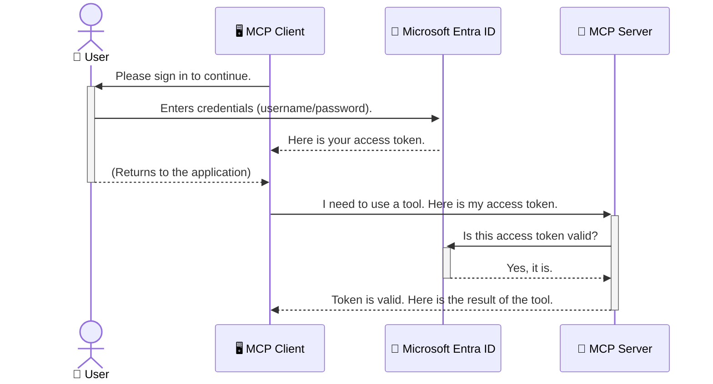

<!--
CO_OP_TRANSLATOR_METADATA:
{
  "original_hash": "6e562d7e5a77c8982da4aa8f762ad1d8",
  "translation_date": "2025-07-14T02:56:33+00:00",
  "source_file": "05-AdvancedTopics/mcp-security-entra/README.md",
  "language_code": "mr"
}
-->
# AI वर्कफ्लोज सुरक्षित करणे: Model Context Protocol सर्व्हरसाठी Entra ID प्रमाणीकरण

## परिचय  
तुमच्या Model Context Protocol (MCP) सर्व्हरचे संरक्षण करणे म्हणजे तुमच्या घराचा मुख्य दरवाजा लॉक करणे इतकेच महत्त्वाचे आहे. तुमचा MCP सर्व्हर उघडा ठेवणे म्हणजे तुमची साधने आणि डेटा अनधिकृत प्रवेशासाठी उघडे ठेवणे, ज्यामुळे सुरक्षा भंग होऊ शकतो. Microsoft Entra ID एक मजबूत क्लाउड-आधारित ओळख आणि प्रवेश व्यवस्थापन सेवा प्रदान करते, ज्यामुळे फक्त अधिकृत वापरकर्ते आणि अनुप्रयोग तुमच्या MCP सर्व्हरशी संवाद साधू शकतात. या विभागात, तुम्हाला Entra ID प्रमाणीकरण वापरून तुमचे AI वर्कफ्लोज कसे सुरक्षित करायचे ते शिकवले जाईल.

## शिकण्याचे उद्दिष्ट  
या विभागाच्या शेवटी, तुम्ही खालील गोष्टी करू शकाल:

- MCP सर्व्हर सुरक्षित करण्याचे महत्त्व समजून घेणे.
- Microsoft Entra ID आणि OAuth 2.0 प्रमाणीकरणाची मूलतत्त्वे समजावून सांगणे.
- सार्वजनिक आणि गोपनीय क्लायंटमधील फरक ओळखणे.
- स्थानिक (सार्वजनिक क्लायंट) आणि रिमोट (गोपनीय क्लायंट) MCP सर्व्हर परिस्थितींमध्ये Entra ID प्रमाणीकरण कसे अंमलात आणायचे ते शिकणे.
- AI वर्कफ्लोज विकसित करताना सुरक्षा सर्वोत्तम पद्धती लागू करणे.

## सुरक्षा आणि MCP

जसे तुम्ही तुमच्या घराचा मुख्य दरवाजा उघडा ठेवणार नाही, तसंच तुम्ही तुमचा MCP सर्व्हर कोणालाही प्रवेशासाठी उघडा ठेवू नये. तुमचे AI वर्कफ्लोज सुरक्षित ठेवणे म्हणजे मजबूत, विश्वासार्ह आणि सुरक्षित अनुप्रयोग तयार करणे आवश्यक आहे. या प्रकरणात, तुम्हाला Microsoft Entra ID वापरून तुमचे MCP सर्व्हर सुरक्षित करण्याचा परिचय दिला जाईल, ज्यामुळे फक्त अधिकृत वापरकर्ते आणि अनुप्रयोग तुमच्या साधनांशी आणि डेटाशी संवाद साधू शकतील.

## MCP सर्व्हरसाठी सुरक्षा का महत्त्वाची आहे

कल्पना करा की तुमच्या MCP सर्व्हरवर एक साधन आहे जे ईमेल पाठवू शकते किंवा ग्राहक डेटाबेसमध्ये प्रवेश करू शकते. जर सर्व्हर सुरक्षित नसेल, तर कोणालाही ते साधन वापरण्याची संधी मिळेल, ज्यामुळे अनधिकृत डेटा प्रवेश, स्पॅम किंवा इतर हानिकारक क्रियाकलाप होऊ शकतात.

प्रमाणीकरण अंमलात आणल्याने, तुम्ही प्रत्येक विनंतीची पडताळणी करता, ज्यामुळे विनंती करणाऱ्या वापरकर्त्याची किंवा अनुप्रयोगाची ओळख निश्चित होते. हे तुमच्या AI वर्कफ्लोज सुरक्षित करण्याचा पहिला आणि सर्वात महत्त्वाचा टप्पा आहे.

## Microsoft Entra ID परिचय

[**Microsoft Entra ID**](https://adoption.microsoft.com/microsoft-security/entra/) ही एक क्लाउड-आधारित ओळख आणि प्रवेश व्यवस्थापन सेवा आहे. याला तुमच्या अनुप्रयोगांसाठी एक सार्वत्रिक सुरक्षा रक्षक समजा. हे वापरकर्त्यांच्या ओळखीची पडताळणी (प्रमाणीकरण) आणि त्यांना काय करण्याची परवानगी आहे हे ठरवण्याचा (अधिकृतता) गुंतागुंतीचा प्रक्रिया हाताळते.

Entra ID वापरून तुम्ही:

- वापरकर्त्यांसाठी सुरक्षित साइन-इन सक्षम करू शकता.
- API आणि सेवा संरक्षित करू शकता.
- प्रवेश धोरणे एका केंद्रीकृत ठिकाणाहून व्यवस्थापित करू शकता.

MCP सर्व्हरसाठी, Entra ID एक मजबूत आणि विश्वासार्ह उपाय प्रदान करते ज्याद्वारे कोण MCP सर्व्हरच्या क्षमतांपर्यंत प्रवेश करू शकतो हे नियंत्रित करता येते.

---

## जादू समजून घेणे: Entra ID प्रमाणीकरण कसे कार्य करते

Entra ID प्रमाणीकरणासाठी **OAuth 2.0** सारख्या खुले मानक वापरते. तपशील जटिल असू शकतात, पण मूळ संकल्पना सोपी आहे आणि एक उपमा वापरून समजून घेता येते.

### OAuth 2.0 ची सौम्य ओळख: व्हॅलेट की

OAuth 2.0 ला तुमच्या कारसाठी व्हॅलेट सेवा समजा. जेव्हा तुम्ही रेस्टॉरंटला जाता, तेव्हा तुम्ही व्हॅलेटला तुमची मुख्य की देत नाही. त्याऐवजी, तुम्ही एक **व्हॅलेट की** देता ज्याला मर्यादित परवानग्या असतात—ती कार सुरू करू शकते आणि दरवाजे लॉक करू शकते, पण ट्रंक किंवा ग्लोव्ह कॉम्पार्टमेंट उघडू शकत नाही.

या उपमेत:

- **तुम्ही** म्हणजे **वापरकर्ता**.
- **तुमची कार** म्हणजे **MCP सर्व्हर** ज्यात मौल्यवान साधने आणि डेटा आहे.
- **व्हॅलेट** म्हणजे **Microsoft Entra ID**.
- **पार्किंग अटेंडंट** म्हणजे **MCP क्लायंट** (जो अनुप्रयोग सर्व्हरशी संवाद साधत आहे).
- **व्हॅलेट की** म्हणजे **Access Token**.

Access token हा Entra ID कडून साइन-इन केल्यानंतर MCP क्लायंटला मिळणारा सुरक्षित मजकूराचा स्ट्रिंग आहे. क्लायंट हा टोकन प्रत्येक विनंतीसह MCP सर्व्हरला सादर करतो. सर्व्हर टोकनची पडताळणी करून विनंती वैध आहे का आणि क्लायंटकडे आवश्यक परवानग्या आहेत का हे तपासू शकतो, आणि तुमचे खरे प्रमाणपत्र (जसे की पासवर्ड) हाताळण्याची गरज नाही.

### प्रमाणीकरण प्रवाह

प्रक्रिया प्रत्यक्षात कशी चालते ते खालीलप्रमाणे:



### Microsoft Authentication Library (MSAL) ची ओळख

कोडमध्ये खोलवर जाण्यापूर्वी, एक महत्त्वाचा घटक ओळखून घेणे आवश्यक आहे: **Microsoft Authentication Library (MSAL)**.

MSAL ही Microsoft द्वारे विकसित केलेली लायब्ररी आहे जी विकसकांसाठी प्रमाणीकरण हाताळणे खूप सोपे करते. तुम्हाला सुरक्षा टोकन हाताळणे, साइन-इन व्यवस्थापित करणे आणि सत्र रिफ्रेश करणे यासाठी जटिल कोड लिहावे लागत नाही, MSAL हे सर्व काम करते.

MSAL वापरण्याची शिफारस खालील कारणांसाठी केली जाते:

- **सुरक्षित आहे:** हे उद्योगमानक प्रोटोकॉल आणि सुरक्षा सर्वोत्तम पद्धती वापरते, ज्यामुळे तुमच्या कोडमधील धोके कमी होतात.
- **विकास सुलभ करते:** OAuth 2.0 आणि OpenID Connect प्रोटोकॉलची गुंतागुंत लपवून, काही ओळींच्या कोडने मजबूत प्रमाणीकरण जोडण्यास मदत करते.
- **देखभाल केली जाते:** Microsoft MSAL नियमितपणे अद्ययावत करते जेणेकरून नवीन सुरक्षा धोके आणि प्लॅटफॉर्म बदल हाताळले जातील.

MSAL .NET, JavaScript/TypeScript, Python, Java, Go आणि iOS, Android सारख्या मोबाइल प्लॅटफॉर्मसाठी उपलब्ध आहे. त्यामुळे तुम्ही तुमच्या तंत्रज्ञानाच्या संपूर्ण स्टॅकमध्ये एकसारखे प्रमाणीकरण नमुने वापरू शकता.

MSAL बद्दल अधिक जाणून घेण्यासाठी, अधिकृत [MSAL आढावा दस्तऐवज](https://learn.microsoft.com/entra/identity-platform/msal-overview) पाहू शकता.

---

## Entra ID वापरून तुमचा MCP सर्व्हर सुरक्षित करणे: टप्प्याटप्प्याने मार्गदर्शन

आता, Entra ID वापरून स्थानिक MCP सर्व्हर (जो `stdio` द्वारे संवाद साधतो) कसा सुरक्षित करायचा ते पाहूया. हा उदाहरण **सार्वजनिक क्लायंट** वापरतो, जो वापरकर्त्याच्या संगणकावर चालणाऱ्या अनुप्रयोगांसाठी योग्य आहे, जसे की डेस्कटॉप अॅप किंवा स्थानिक विकास सर्व्हर.

### परिस्थिती 1: स्थानिक MCP सर्व्हर सुरक्षित करणे (सार्वजनिक क्लायंटसह)

या परिस्थितीत, आपण स्थानिकपणे चालणारा MCP सर्व्हर पाहणार आहोत जो `stdio` द्वारे संवाद साधतो आणि वापरकर्त्याला प्रवेश देण्यापूर्वी Entra ID प्रमाणीकरण वापरतो. सर्व्हरकडे एक साधन असेल जे Microsoft Graph API कडून वापरकर्त्याची प्रोफाइल माहिती आणते.

#### 1. Entra ID मध्ये अनुप्रयोग सेटअप करणे

कोड लिहिण्यापूर्वी, तुम्हाला तुमचा अनुप्रयोग Microsoft Entra ID मध्ये नोंदणी करावा लागेल. यामुळे Entra ID ला तुमच्या अनुप्रयोगाची माहिती मिळते आणि प्रमाणीकरण सेवा वापरण्याची परवानगी दिली जाते.

1. **[Microsoft Entra पोर्टल](https://entra.microsoft.com/)** वर जा.
2. **App registrations** मध्ये जाऊन **New registration** क्लिक करा.
3. तुमच्या अनुप्रयोगाला नाव द्या (उदा. "My Local MCP Server").
4. **Supported account types** मध्ये **Accounts in this organizational directory only** निवडा.
5. या उदाहरणासाठी **Redirect URI** रिक्त ठेवू शकता.
6. **Register** क्लिक करा.

नोंदणी झाल्यानंतर, **Application (client) ID** आणि **Directory (tenant) ID** लक्षात ठेवा. कोडमध्ये यांची गरज भासेल.

#### 2. कोड: एक विहंगावलोकन

प्रमाणीकरण हाताळणाऱ्या कोडच्या मुख्य भागाकडे पाहूया. या उदाहरणाचा पूर्ण कोड [Entra ID - Local - WAM](https://github.com/Azure-Samples/mcp-auth-servers/tree/main/src/entra-id-local-wam) फोल्डरमध्ये [mcp-auth-servers GitHub रिपॉझिटरी](https://github.com/Azure-Samples/mcp-auth-servers) मध्ये उपलब्ध आहे.

**`AuthenticationService.cs`**

हा वर्ग Entra ID सोबत संवाद साधण्याची जबाबदारी घेतो.

- **`CreateAsync`**: MSAL मधील `PublicClientApplication` सुरू करतो. तुमच्या अनुप्रयोगाचा `clientId` आणि `tenantId` वापरून कॉन्फिगर केला जातो.
- **`WithBroker`**: Windows Web Account Manager सारख्या ब्रोकर्सचा वापर सक्षम करतो, ज्यामुळे अधिक सुरक्षित आणि सुलभ सिंगल साइन-ऑन अनुभव मिळतो.
- **`AcquireTokenAsync`**: मुख्य पद्धत आहे. प्रथम तो टोकन शांतपणे मिळवण्याचा प्रयत्न करतो (जर वापरकर्त्याचा वैध सत्र असेल तर पुन्हा साइन-इन करावे लागत नाही). जर शांत टोकन मिळाले नाही, तर वापरकर्त्याला इंटरॅक्टिव्ह साइन-इनसाठी विचारले जाते.

```csharp
// Simplified for clarity
public static async Task<AuthenticationService> CreateAsync(ILogger<AuthenticationService> logger)
{
    var msalClient = PublicClientApplicationBuilder
        .Create(_clientId) // Your Application (client) ID
        .WithAuthority(AadAuthorityAudience.AzureAdMyOrg)
        .WithTenantId(_tenantId) // Your Directory (tenant) ID
        .WithBroker(new BrokerOptions(BrokerOptions.OperatingSystems.Windows))
        .Build();

    // ... cache registration ...

    return new AuthenticationService(logger, msalClient);
}

public async Task<string> AcquireTokenAsync()
{
    try
    {
        // Try silent authentication first
        var accounts = await _msalClient.GetAccountsAsync();
        var account = accounts.FirstOrDefault();

        AuthenticationResult? result = null;

        if (account != null)
        {
            result = await _msalClient.AcquireTokenSilent(_scopes, account).ExecuteAsync();
        }
        else
        {
            // If no account, or silent fails, go interactive
            result = await _msalClient.AcquireTokenInteractive(_scopes).ExecuteAsync();
        }

        return result.AccessToken;
    }
    catch (Exception ex)
    {
        _logger.LogError(ex, "An error occurred while acquiring the token.");
        throw; // Optionally rethrow the exception for higher-level handling
    }
}
```

**`Program.cs`**

इथे MCP सर्व्हर सेटअप केला जातो आणि प्रमाणीकरण सेवा समाकलित केली जाते.

- **`AddSingleton<AuthenticationService>`**: `AuthenticationService` ला dependency injection कंटेनरमध्ये नोंदणी करतो, ज्यामुळे अनुप्रयोगाच्या इतर भागांमध्ये (जसे की साधन) वापरता येते.
- **`GetUserDetailsFromGraph` साधन**: या साधनाला `AuthenticationService` ची गरज असते. काहीही करण्यापूर्वी, ते `authService.AcquireTokenAsync()` कॉल करून वैध access token मिळवते. प्रमाणीकरण यशस्वी झाल्यास, तो टोकन वापरून Microsoft Graph API कॉल करून वापरकर्त्याचे तपशील आणते.

```csharp
// Simplified for clarity
[McpServerTool(Name = "GetUserDetailsFromGraph")]
public static async Task<string> GetUserDetailsFromGraph(
    AuthenticationService authService)
{
    try
    {
        // This will trigger the authentication flow
        var accessToken = await authService.AcquireTokenAsync();

        // Use the token to create a GraphServiceClient
        var graphClient = new GraphServiceClient(
            new BaseBearerTokenAuthenticationProvider(new TokenProvider(authService)));

        var user = await graphClient.Me.GetAsync();

        return System.Text.Json.JsonSerializer.Serialize(user);
    }
    catch (Exception ex)
    {
        return $"Error: {ex.Message}";
    }
}
```

#### 3. संपूर्ण प्रक्रिया कशी कार्य करते

1. जेव्हा MCP क्लायंट `GetUserDetailsFromGraph` साधन वापरू इच्छितो, तेव्हा साधन प्रथम `AcquireTokenAsync` कॉल करते.
2. `AcquireTokenAsync` MSAL लायब्ररीला वैध टोकन तपासण्यास सांगते.
3. जर टोकन सापडला नाही, तर MSAL ब्रोकर्सच्या माध्यमातून वापरकर्त्याला Entra ID खात्याने साइन-इन करण्यास सांगते.
4. वापरकर्ता साइन-इन केल्यावर, Entra ID access token जारी करते.
5. साधन टोकन प्राप्त करून Microsoft Graph API ला सुरक्षित कॉल करते.
6. वापरकर्त्याचे तपशील MCP क्लायंटला परत मिळतात.

ही प्रक्रिया सुनिश्चित करते की फक्त प्रमाणीकरण केलेले वापरकर्तेच साधन वापरू शकतात, ज्यामुळे तुमचा स्थानिक MCP सर्व्हर सुरक्षित होतो.

### परिस्थिती 2: रिमोट MCP सर्व्हर सुरक्षित करणे (गोपनीय क्लायंटसह)

जेव्हा तुमचा MCP सर्व्हर रिमोट मशीनवर (जसे की क्लाउड सर्व्हर) चालतो आणि HTTP Streaming सारख्या प्रोटोकॉलवर संवाद साधतो, तेव्हा सुरक्षा गरजा वेगळ्या असतात. या परिस्थितीत, तुम्हाला **गोपनीय क्लायंट** आणि **Authorization Code Flow** वापरावे लागते. ही अधिक सुरक्षित पद्धत आहे कारण अनुप्रयोगाचे रहस्य ब्राउझरमध्ये कधीही उघड होत नाही.

हे उदाहरण TypeScript-आधारित MCP सर्व्हर वापरते जे Express.js वापरून HTTP विनंत्या हाताळते.

#### 1. Entra ID मध्ये अनुप्रयोग सेटअप करणे

Entra ID मध्ये सेटअप सार्वजनिक क्लायंटसारखाच आहे, पण एक महत्त्वाचा फरक आहे: तुम्हाला **client secret** तयार करावा लागतो.

1. **[Microsoft Entra पोर्टल](https://entra.microsoft.com/)** वर जा.
2. तुमच्या अॅप नोंदणीमध्ये **Certificates & secrets** टॅबवर जा.
3. **New client secret** क्लिक करा, वर्णन द्या आणि **Add** करा.
4. **महत्त्वाचे:** secret value लगेच कॉपी करा. नंतर ते पाहता येणार नाही.
5. तुम्हाला **Redirect URI** देखील कॉन्फिगर करावी लागेल. **Authentication** टॅबमध्ये जा, **Add a platform** क्लिक करा, **Web** निवडा आणि तुमच्या अनुप्रयोगासाठी redirect URI द्या (उदा. `http://localhost:3001/auth/callback`).

> **⚠️ महत्त्वाची सुरक्षा सूचना:** उत्पादन अनुप्रयोगांसाठी, Microsoft कडून **secretless authentication** पद्धती जसे की **Managed Identity** किंवा **Workload Identity Federation** वापरण्याची जोरदार शिफारस केली जाते. client secrets सुरक्षिततेस धोका निर्माण करतात कारण ते उघड होऊ शकतात किंवा चोरी होऊ शकतात. Managed identities अधिक सुरक्षित पर्याय आहेत कारण त्यात क्रेडेन्शियल्स कोड किंवा कॉन्फिगरेशनमध्ये साठवण्याची गरज नाही.
>
> Managed identities आणि त्यांची अंमलबजावणी कशी करायची याबद्दल अधिक माहितीसाठी, [Managed identities for Azure resources overview](https://learn.microsoft.com/entra/identity/managed-identities-azure-resources/overview) पहा.

#### 2. कोड: एक विहंगावलोकन

हे उदाहरण सत्र-आधारित पद्धत वापरते. वापरकर्ता प्रमाणीकरण केल्यावर, सर्व्हर access token आणि refresh token सत्रात साठवतो आणि वापरकर्त्याला सत्र टोकन देतो. नंतरच्या विनंत्यांसाठी हा सत्र टोकन वापरला जातो. या उदाहरणाचा पूर्ण कोड [Entra ID - Confidential client](https://github.com/Azure-Samples/mcp-auth-servers/tree/main/src/entra-id-cca-session) फोल्डरमध्ये [mcp-auth-servers GitHub रिपॉझिटरी](https://github.com/Azure-Samples/mcp-auth-servers) मध्ये उपलब्ध आहे.

**`Server.ts`**

हा फाइल Express सर्व्हर आणि MCP ट्रान्सपोर्ट लेयर सेटअप करतो.

- **`requireBearerAuth`**: हे मिडलवेअर `/sse` आणि `/message` एंडपॉइंट्स संरक्षित करते. ते विनंतीच्या `Authorization` हेडरमध्ये वैध bearer token तपासते.
- **`EntraIdServerAuthProvider`**: हा एक कस्टम क्लास आहे जो `McpServerAuthorizationProvider` इंटरफेस अंमलात आणतो. OAuth 2.0 प्रवाह हाताळण्याची जबाबदारी त्याची आहे.
- **`/auth/callback`**: हा एंडपॉइंट वापरकर्त्याच्या Entra ID साइन-इन नंतर redirect होतो. तो authorization code बदलून access token आणि refresh token मिळवतो.

```typescript
// Simplified for clarity
const app = express();
const { server } = createServer();
const provider = new EntraIdServerAuthProvider();

// Protect the SSE endpoint
app.get("/sse", requireBearerAuth({
  provider,
  requiredScopes: ["User.Read"]
}), async (req, res) => {
  // ... connect to the transport ...
});

// Protect the message endpoint
app.post("/message", requireBearerAuth({
  provider,
  requiredScopes: ["User.Read"]
}), async (req, res) => {
  // ... handle the message ...
});

// Handle the OAuth 2.0 callback
app.get("/auth/callback", (req, res) => {
  provider.handleCallback(req.query.code, req.query.state)
    .then(result => {
      // ... handle success or failure ...
    });
});
```

**`Tools.ts`**

हा फाइल MCP सर्व्हर प्रदान करणारी साधने परिभाषित करतो. `getUserDetails` साधन मागील उदाहरणासारखेच आहे, पण ते access token सत्रातून घेतो.

```typescript
// Simplified for clarity
server.setRequestHandler(CallToolRequestSchema, async (request) => {
  const { name } = request.params;
  const context = request.params?.context as { token?: string } | undefined;
  const sessionToken = context?.token;

  if (name === ToolName.GET_USER_DETAILS) {
    if (!sessionToken) {
      throw new AuthenticationError("Authentication token is missing or invalid. Ensure the token is provided in the request context.");
    }

    // Get the Entra ID token from the session store
    const tokenData = tokenStore.getToken(sessionToken);
    const entraIdToken = tokenData.accessToken;

    const graphClient = Client.init({
      authProvider: (done) => {
        done(null, entraIdToken);
      }
    });

    const user = await graphClient.api('/me').get();

    // ... return user details ...
  }
});
```

**`auth/EntraIdServerAuthProvider.ts`**

हा वर्ग खालील लॉजिक हाताळतो:

- वापरकर्त्याला Entra ID साइन-इन पृष्ठावर redirect करणे.
- authorization code बदलून access token मिळवणे.
- `tokenStore` मध्ये टोकन साठवणे.
- access token कालबाह्य झाल्यावर रिफ्रेश करणे.

#### 3. संपूर्ण प्रक्रिया कशी कार्य करते

1. जेव्हा वापरकर्ता प्रथम MCP सर्व्हरशी कनेक्ट होण्याचा प्रयत्न करतो, तेव्हा `requireBearerAuth` मिडलवेअर पाहते की त्याच्याकडे वैध सत्र नाही आणि त्याला Entra ID साइन-इन पृष्ठावर redirect करते.
2. वापरकर्ता त्याच्या Entra ID खात्याने साइन-इन करतो.
3. Entra ID वापरकर्त्याला `/auth/callback` एंडपॉइंटवर authorization code सह परत पाठवते.
4. सर्व्हर कोड बदलून access token आणि refresh token मिळवतो, त्यांना साठवतो आणि एक session token तयार करतो जो क्लायंटला पाठवला जातो.  
5. क्लायंट आता या session token ला `Authorization` हेडरमध्ये वापरून MCP सर्व्हरकडे पुढील सर्व विनंत्यांसाठी वापरू शकतो.  
6. जेव्हा `getUserDetails` टूल कॉल केले जाते, तेव्हा ते session token वापरून Entra ID access token शोधते आणि नंतर त्याचा वापर Microsoft Graph API कॉल करण्यासाठी करते.  

हा प्रवाह सार्वजनिक क्लायंटच्या प्रवाहापेक्षा जास्त गुंतागुंतीचा आहे, पण इंटरनेटवर उपलब्ध असलेल्या endpoints साठी आवश्यक आहे. कारण रिमोट MCP सर्व्हर सार्वजनिक इंटरनेटवर उपलब्ध असतात, त्यांना अनधिकृत प्रवेश आणि संभाव्य हल्ल्यांपासून संरक्षणासाठी अधिक मजबूत सुरक्षा उपायांची गरज असते.  


## सुरक्षा सर्वोत्तम पद्धती

- **नेहमी HTTPS वापरा**: क्लायंट आणि सर्व्हरमधील संवाद एन्क्रिप्ट करा जेणेकरून टोकन्स चोरी होण्यापासून संरक्षण मिळेल.  
- **Role-Based Access Control (RBAC) लागू करा**: फक्त वापरकर्ता प्रमाणित आहे का हे तपासू नका; त्याला काय अधिकार आहेत तेही तपासा. Entra ID मध्ये भूमिका परिभाषित करू शकता आणि आपल्या MCP सर्व्हरमध्ये त्यांची तपासणी करू शकता.  
- **निगराणी आणि ऑडिट करा**: सर्व प्रमाणीकरण घटना लॉग करा जेणेकरून संशयास्पद क्रियाकलाप ओळखता येतील आणि त्यावर प्रतिक्रिया देता येईल.  
- **रेट लिमिटिंग आणि थ्रॉटलिंग हाताळा**: Microsoft Graph आणि इतर API मध्ये गैरवापर टाळण्यासाठी रेट लिमिटिंग असते. आपल्या MCP सर्व्हरमध्ये एक्स्पोनेंशियल बॅकऑफ आणि पुनःप्रयत्न लॉजिक लागू करा जेणेकरून HTTP 429 (Too Many Requests) प्रतिसाद सौम्यपणे हाताळता येतील. वारंवार वापरल्या जाणाऱ्या डेटाचा कॅशिंग करणे API कॉल कमी करण्यासाठी उपयुक्त ठरू शकते.  
- **टोकन सुरक्षित साठवणूक**: access tokens आणि refresh tokens सुरक्षितपणे साठवा. स्थानिक अ‍ॅप्लिकेशन्ससाठी, सिस्टमच्या सुरक्षित साठवण यंत्रणांचा वापर करा. सर्व्हर अ‍ॅप्लिकेशन्ससाठी, एन्क्रिप्टेड साठवणूक किंवा Azure Key Vault सारख्या सुरक्षित की व्यवस्थापन सेवा वापरण्याचा विचार करा.  
- **टोकन कालबाह्यता हाताळणी**: access tokens ची मर्यादित आयुष्य असते. seamless वापरकर्ता अनुभव राखण्यासाठी refresh tokens वापरून टोकन आपोआप रिफ्रेश करण्याची व्यवस्था करा, ज्यामुळे पुनःप्रमाणीकरणाची गरज भासणार नाही.  
- **Azure API Management वापरण्याचा विचार करा**: आपल्या MCP सर्व्हरमध्ये थेट सुरक्षा लागू केल्याने तुम्हाला सूक्ष्म नियंत्रण मिळते, पण API गेटवे जसे की Azure API Management अनेक सुरक्षा बाबी आपोआप हाताळू शकतात, जसे की प्रमाणीकरण, अधिकृतता, रेट लिमिटिंग आणि निरीक्षण. हे एक केंद्रीकृत सुरक्षा स्तर प्रदान करतात जे क्लायंट आणि MCP सर्व्हर दरम्यान असते. MCP साठी API गेटवे वापरण्याबाबत अधिक माहितीसाठी आमचा [Azure API Management Your Auth Gateway For MCP Servers](https://techcommunity.microsoft.com/blog/integrationsonazureblog/azure-api-management-your-auth-gateway-for-mcp-servers/4402690) पहा.  


## मुख्य मुद्दे

- आपल्या MCP सर्व्हरचे संरक्षण करणे हे आपल्या डेटा आणि टूल्सचे रक्षण करण्यासाठी अत्यंत महत्त्वाचे आहे.  
- Microsoft Entra ID प्रमाणीकरण आणि अधिकृततेसाठी एक मजबूत आणि स्केलेबल उपाय प्रदान करते.  
- स्थानिक अ‍ॅप्लिकेशन्ससाठी **public client** आणि रिमोट सर्व्हरसाठी **confidential client** वापरा.  
- वेब अ‍ॅप्लिकेशन्ससाठी **Authorization Code Flow** हा सर्वात सुरक्षित पर्याय आहे.  


## सराव

1. तुम्ही तयार करणार असलेला MCP सर्व्हर स्थानिक असेल की रिमोट?  
2. तुमच्या उत्तरानुसार, तुम्ही public client वापराल की confidential client?  
3. Microsoft Graph वर क्रिया करण्यासाठी तुमचा MCP सर्व्हर कोणती परवानगी मागेल?  


## प्रत्यक्ष सराव

### सराव 1: Entra ID मध्ये अ‍ॅप्लिकेशन नोंदणी करा  
Microsoft Entra पोर्टलवर जा.  
तुमच्या MCP सर्व्हरसाठी नवीन अ‍ॅप्लिकेशन नोंदणी करा.  
Application (client) ID आणि Directory (tenant) ID नोंद करा.  

### सराव 2: स्थानिक MCP सर्व्हर सुरक्षित करा (Public Client)  
- वापरकर्ता प्रमाणीकरणासाठी MSAL (Microsoft Authentication Library) समाकलित करण्यासाठी कोड उदाहरणाचे अनुसरण करा.  
- Microsoft Graph मधून वापरकर्ता तपशील मिळवणारा MCP टूल कॉल करून प्रमाणीकरण प्रवाहाची चाचणी करा.  

### सराव 3: रिमोट MCP सर्व्हर सुरक्षित करा (Confidential Client)  
- Entra ID मध्ये confidential client नोंदणी करा आणि client secret तयार करा.  
- तुमच्या Express.js MCP सर्व्हरमध्ये Authorization Code Flow कॉन्फिगर करा.  
- संरक्षित endpoints ची चाचणी करा आणि टोकन-आधारित प्रवेशाची पुष्टी करा.  

### सराव 4: सुरक्षा सर्वोत्तम पद्धती लागू करा  
- तुमच्या स्थानिक किंवा रिमोट सर्व्हरसाठी HTTPS सक्षम करा.  
- सर्व्हर लॉजिकमध्ये role-based access control (RBAC) लागू करा.  
- टोकन कालबाह्यता हाताळणी आणि सुरक्षित टोकन साठवणूक जोडा.  


## संसाधने

1. **MSAL आढावा दस्तऐवज**  
   Microsoft Authentication Library (MSAL) कसे सुरक्षित टोकन मिळवते हे जाणून घ्या:  
   [MSAL Overview on Microsoft Learn](https://learn.microsoft.com/en-gb/entra/msal/overview)  

2. **Azure-Samples/mcp-auth-servers GitHub रेपॉजिटरी**  
   MCP सर्व्हरचे प्रमाणीकरण प्रवाह दाखवणारे संदर्भ अंमलबजावणी:  
   [Azure-Samples/mcp-auth-servers on GitHub](https://github.com/Azure-Samples/mcp-auth-servers)  

3. **Azure Resources साठी Managed Identities आढावा**  
   सिस्टम किंवा वापरकर्ता-निर्धारित managed identities वापरून गुपिते कशी टाळायची ते समजून घ्या:  
   [Managed Identities Overview on Microsoft Learn](https://learn.microsoft.com/en-us/entra/identity/managed-identities-azure-resources/)  

4. **Azure API Management: MCP सर्व्हरसाठी तुमचे Auth Gateway**  
   MCP सर्व्हरसाठी सुरक्षित OAuth2 गेटवे म्हणून APIM वापरण्याचा सखोल अभ्यास:  
   [Azure API Management Your Auth Gateway For MCP Servers](https://techcommunity.microsoft.com/blog/integrationsonazureblog/azure-api-management-your-auth-gateway-for-mcp-servers/4402690)  

5. **Microsoft Graph Permissions संदर्भ**  
   Microsoft Graph साठी प्रतिनिधीत्व आणि अ‍ॅप्लिकेशन परवानग्यांची सविस्तर यादी:  
   [Microsoft Graph Permissions Reference](https://learn.microsoft.com/zh-tw/graph/permissions-reference)  


## शिकण्याचे परिणाम  
या विभागानंतर, तुम्ही सक्षम असाल:

- MCP सर्व्हर आणि AI वर्कफ्लो साठी प्रमाणीकरण का महत्त्वाचे आहे हे स्पष्टपणे सांगू शकणे.  
- स्थानिक आणि रिमोट MCP सर्व्हर परिस्थितीसाठी Entra ID प्रमाणीकरण सेटअप आणि कॉन्फिगर करणे.  
- तुमच्या सर्व्हरच्या तैनातीवर आधारित योग्य क्लायंट प्रकार (public किंवा confidential) निवडणे.  
- सुरक्षित कोडिंग पद्धती, ज्यात टोकन साठवणूक आणि भूमिका-आधारित अधिकृतता यांचा समावेश आहे, अमलात आणणे.  
- तुमचा MCP सर्व्हर आणि त्याचे टूल्स अनधिकृत प्रवेशापासून आत्मविश्वासाने सुरक्षित ठेवणे.  


## पुढे काय

- [5.13 Model Context Protocol (MCP) Integration with Azure AI Foundry](../mcp-foundry-agent-integration/README.md)

**अस्वीकरण**:  
हा दस्तऐवज AI अनुवाद सेवा [Co-op Translator](https://github.com/Azure/co-op-translator) वापरून अनुवादित केला आहे. आम्ही अचूकतेसाठी प्रयत्नशील असलो तरी, कृपया लक्षात घ्या की स्वयंचलित अनुवादांमध्ये चुका किंवा अचूकतेची कमतरता असू शकते. मूळ दस्तऐवज त्याच्या स्थानिक भाषेत अधिकृत स्रोत मानला जावा. महत्त्वाच्या माहितीसाठी व्यावसायिक मानवी अनुवाद करण्याची शिफारस केली जाते. या अनुवादाच्या वापरामुळे उद्भवणाऱ्या कोणत्याही गैरसमजुती किंवा चुकीच्या अर्थलागी आम्ही जबाबदार नाही.