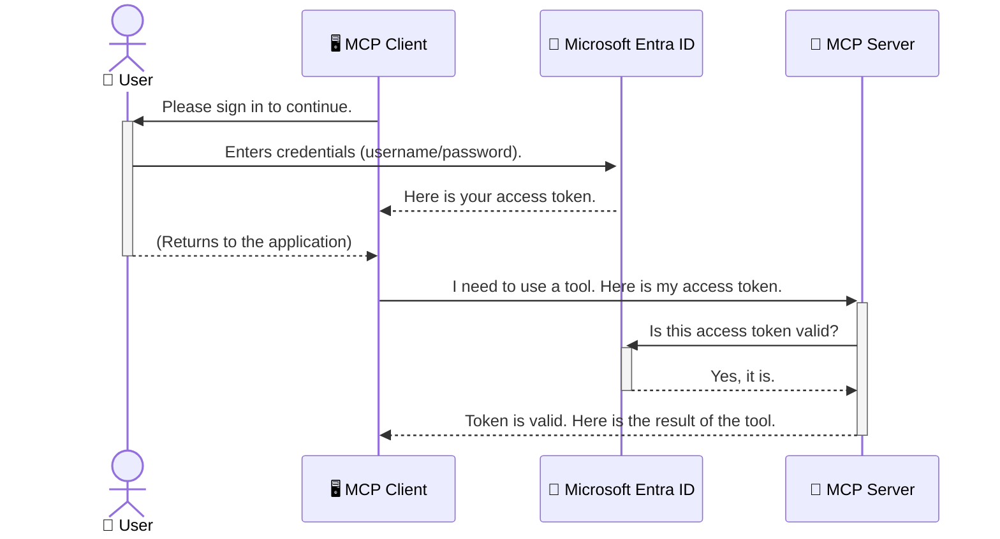

<!--
CO_OP_TRANSLATOR_METADATA:
{
  "original_hash": "0abf26a6c4dbe905d5d49ccdc0ccfe92",
  "translation_date": "2025-06-26T16:24:27+00:00",
  "source_file": "05-AdvancedTopics/mcp-security-entra/README.md",
  "language_code": "mr"
}
-->
# AI वर्कफ्लो सुरक्षित करणे: Model Context Protocol सर्व्हरसाठी Entra ID प्रमाणीकरण

## परिचय  
तुमच्या Model Context Protocol (MCP) सर्व्हरचे संरक्षण करणे म्हणजे तुमच्या घराच्या मुख्य दरवाजाला लॉक लावल्यासारखे महत्त्वाचे आहे. तुमचा MCP सर्व्हर उघडा ठेवणे म्हणजे तुमच्या साधनांना आणि डेटाला अनधिकृत प्रवेशासाठी खुलं सोडणे, ज्यामुळे सुरक्षा भंग होऊ शकतात. Microsoft Entra ID एक मजबूत क्लाऊड-आधारित ओळख आणि प्रवेश व्यवस्थापन उपाय प्रदान करते, ज्यामुळे फक्त अधिकृत वापरकर्ते आणि अनुप्रयोग तुमच्या MCP सर्व्हरशी संवाद साधू शकतात. या विभागात, तुम्ही Entra ID प्रमाणीकरण वापरून तुमच्या AI वर्कफ्लोचे संरक्षण कसे करायचे हे शिकाल.

## शिकण्याची उद्दिष्टे  
या विभागाच्या शेवटी, तुम्ही सक्षम असाल:

- MCP सर्व्हर सुरक्षित करण्याचे महत्त्व समजून घेणे.
- Microsoft Entra ID आणि OAuth 2.0 प्रमाणीकरणाच्या मूलभूत गोष्टी समजावून सांगणे.
- सार्वजनिक आणि गोपनीय क्लायंटमधील फरक ओळखणे.
- स्थानिक (सार्वजनिक क्लायंट) आणि दूरस्थ (गोपनीय क्लायंट) MCP सर्व्हर परिस्थितींमध्ये Entra ID प्रमाणीकरण अंमलात आणणे.
- AI वर्कफ्लो विकसित करताना सुरक्षा सर्वोत्तम पद्धती लागू करणे.

## सुरक्षा आणि MCP  

जसे तुम्ही तुमच्या घराचा मुख्य दरवाजा उघडा ठेवणार नाही, तसंच तुम्ही तुमचा MCP सर्व्हर कोणालाही प्रवेशासाठी खुला ठेवू नये. तुमच्या AI वर्कफ्लोचे संरक्षण करणे म्हणजे मजबूत, विश्वासार्ह आणि सुरक्षित अनुप्रयोग तयार करणे आवश्यक आहे. या प्रकरणात, तुम्हाला Microsoft Entra ID वापरून तुमच्या MCP सर्व्हरचे संरक्षण कसे करायचे हे शिकवले जाईल, ज्यामुळे फक्त अधिकृत वापरकर्ते आणि अनुप्रयोग तुमच्या साधनांशी आणि डेटाशी संवाद साधू शकतील.

## MCP सर्व्हरसाठी सुरक्षा का महत्त्वाची आहे  

कल्पना करा की तुमच्या MCP सर्व्हरवर एक साधन आहे जे ईमेल पाठवू शकते किंवा ग्राहक डेटाबेसमध्ये प्रवेश करू शकते. जर सर्व्हर अनसुरक्षित असेल तर कोणालाही ते साधन वापरता येईल, ज्यामुळे अनधिकृत डेटा प्रवेश, स्पॅम किंवा इतर हानिकारक क्रियाकलाप होऊ शकतात.

प्रमाणीकरण अंमलात आणल्याने, तुम्ही प्रत्येक विनंतीची खात्री करता की ती वैध आहे, आणि विनंती करणारा वापरकर्ता किंवा अनुप्रयोग कोण आहे हे पडताळता येते. हे तुमच्या AI वर्कफ्लोचे संरक्षण करण्याचा पहिला आणि सर्वात महत्त्वाचा टप्पा आहे.

## Microsoft Entra ID परिचय  

[**Microsoft Entra ID**](https://adoption.microsoft.com/microsoft-security/entra/) ही क्लाऊड-आधारित ओळख आणि प्रवेश व्यवस्थापन सेवा आहे. याला तुमच्या अनुप्रयोगांसाठी एक सार्वत्रिक सुरक्षा रक्षक समजा. हे वापरकर्त्यांच्या ओळखीची पडताळणी (प्रमाणीकरण) आणि त्यांना काय करण्याची परवानगी आहे हे ठरविण्याचा (अधिकृतता) गुंतागुंतीचा प्रक्रियेला हाताळते.

Entra ID वापरून तुम्ही:

- वापरकर्त्यांसाठी सुरक्षित साइन-इन सक्षम करू शकता.
- API आणि सेवा संरक्षित करू शकता.
- प्रवेश धोरणे एका केंद्रीकृत ठिकाणाहून व्यवस्थापित करू शकता.

MCP सर्व्हरसाठी, Entra ID एक मजबूत आणि विश्वासार्ह उपाय प्रदान करते ज्याद्वारे कोण तुमच्या सर्व्हरच्या क्षमतांपर्यंत पोहोचू शकतो हे नियंत्रित करता येते.

---

## Entra ID प्रमाणीकरण कसे कार्य करते हे समजून घेणे  

Entra ID प्रमाणीकरणासाठी **OAuth 2.0** सारख्या खुल्या मानकांचा वापर करते. तपशील थोडे गुंतागुंतीचे असू शकतात, पण मूळ संकल्पना सोपी आहे आणि एका उदाहरणाद्वारे समजून घेता येते.

### OAuth 2.0 ची साधी ओळख: Valet Key (वाहन ठेवणाऱ्या कळीचा)  

OAuth 2.0 म्हणजे तुमच्या कारसाठी वाहन ठेवणाऱ्या सेवेप्रमाणे समजा. जेव्हा तुम्ही रेस्टॉरंटला पोहोचता, तेव्हा तुम्ही तुमची मुख्य कळी वाहन ठेवणाऱ्याला देत नाही. त्याऐवजी, तुम्ही एक **valet key** देता ज्याला मर्यादित परवानग्या असतात—ती कार सुरू करू शकते आणि दरवाजे लॉक करू शकते, पण ट्रंक किंवा ग्लोव्ह कम्पार्टमेंट उघडू शकत नाही.

या उदाहरणात:

- **तुम्ही** म्हणजे **वापरकर्ता**.
- **तुमची कार** म्हणजे **MCP सर्व्हर** ज्यात महत्त्वाची साधने आणि डेटा आहे.
- **Valet** म्हणजे **Microsoft Entra ID**.
- **Parking Attendant** म्हणजे **MCP क्लायंट** (जो सर्व्हरशी संवाद साधण्याचा प्रयत्न करतो).
- **Valet Key** म्हणजे **Access Token**.

Access token हा एक सुरक्षित मजकूराचा स्ट्रिंग आहे जो MCP क्लायंटला Entra ID कडून साइन-इन नंतर मिळतो. क्लायंट नंतर हा टोकन प्रत्येक विनंतीसह MCP सर्व्हरला सादर करतो. सर्व्हर हा टोकन पडताळून खात्री करतो की विनंती वैध आहे आणि क्लायंटकडे आवश्यक परवानग्या आहेत, तेही तुमचे खरे प्रमाणपत्र (जसे की पासवर्ड) हाताळण्याची गरज न पडता.

### प्रमाणीकरण प्रवाह  

प्रक्रिया प्रत्यक्षात कशी चालते ते पुढीलप्रमाणे:



### Microsoft Authentication Library (MSAL) ची ओळख  

कोडमध्ये पुढे जाऊन, एक महत्त्वाचा घटक म्हणजे **Microsoft Authentication Library (MSAL)**.

MSAL ही Microsoft कडून विकसित केलेली एक लायब्ररी आहे जी विकसकांसाठी प्रमाणीकरण हाताळणे खूप सोपे करते. तुम्हाला सुरक्षा टोकन्स हाताळण्यासाठी, साइन-इन व्यवस्थापित करण्यासाठी आणि सत्र रीफ्रेश करण्यासाठी संपूर्ण गुंतागुंतीचा कोड लिहावा लागत नाही, MSAL हे काम सहज करते.

MSAL वापरणे यासाठी शिफारसीय आहे कारण:

- **हे सुरक्षित आहे:** उद्योगमानक प्रोटोकॉल आणि सुरक्षा सर्वोत्तम पद्धतींचे पालन करते, ज्यामुळे तुमच्या कोडमधील धोके कमी होतात.
- **हे विकास सुलभ करते:** OAuth 2.0 आणि OpenID Connect प्रोटोकॉलची गुंतागुंत लपवून ठेऊन, फक्त काही ओळींच्या कोडने मजबूत प्रमाणीकरण जोडता येते.
- **हे कायमस्वरूपी अपडेट होते:** Microsoft नियमितपणे MSAL चे अपडेट्स आणि सुरक्षा सुधारणांसाठी देखभाल करते.

MSAL अनेक भाषा आणि अ‍ॅप्लिकेशन फ्रेमवर्कसाठी उपलब्ध आहे, जसे की .NET, JavaScript/TypeScript, Python, Java, Go, आणि मोबाइल प्लॅटफॉर्म्स iOS आणि Android. याचा अर्थ तुम्ही तुमच्या तंत्रज्ञान स्टॅकवर एकसारख्या प्रमाणीकरण पद्धती वापरू शकता.

MSAL बद्दल अधिक जाणून घेण्यासाठी, तुम्ही अधिकृत [MSAL overview documentation](https://learn.microsoft.com/entra/identity-platform/msal-overview) पाहू शकता.

---

## Entra ID वापरून तुमचा MCP सर्व्हर सुरक्षित करणे: टप्प्याटप्प्याने मार्गदर्शन  

आता, स्थानिक MCP सर्व्हर (जो `stdio`) using Entra ID. This example uses a **public client**, which is suitable for applications running on a user's machine, like a desktop app or a local development server.

### Scenario 1: Securing a Local MCP Server (with a Public Client)

In this scenario, we'll look at an MCP server that runs locally, communicates over `stdio`, and uses Entra ID to authenticate the user before allowing access to its tools. The server will have a single tool that fetches the user's profile information from the Microsoft Graph API.

#### 1. Setting Up the Application in Entra ID

Before writing any code, you need to register your application in Microsoft Entra ID. This tells Entra ID about your application and grants it permission to use the authentication service.

1. Navigate to the **[Microsoft Entra portal](https://entra.microsoft.com/)**.
2. Go to **App registrations** and click **New registration**.
3. Give your application a name (e.g., "My Local MCP Server").
4. For **Supported account types**, select **Accounts in this organizational directory only**.
5. You can leave the **Redirect URI** blank for this example.
6. Click **Register**.

Once registered, take note of the **Application (client) ID** and **Directory (tenant) ID**. You'll need these in your code.

#### 2. The Code: A Breakdown

Let's look at the key parts of the code that handle authentication. The full code for this example is available in the [Entra ID - Local - WAM](https://github.com/Azure-Samples/mcp-auth-servers/tree/main/src/entra-id-local-wam) folder of the [mcp-auth-servers GitHub repository](https://github.com/Azure-Samples/mcp-auth-servers).

**`AuthenticationService.cs`**

This class is responsible for handling the interaction with Entra ID.

- **`CreateAsync`**: This method initializes the `PublicClientApplication` from the MSAL (Microsoft Authentication Library). It's configured with your application's `clientId` and `tenantId`.
- **`WithBroker`**: This enables the use of a broker (like the Windows Web Account Manager), which provides a more secure and seamless single sign-on experience.
- **`AcquireTokenAsync` वापरून संवाद साधतो) सुरक्षित करण्याचा मार्ग पाहूया: ही मुख्य पद्धत आहे. हे प्रथम शांतपणे टोकन मिळवण्याचा प्रयत्न करते (जर वापरकर्त्याला आधीच वैध सत्र असेल तर त्याला पुन्हा साइन-इन करावे लागणार नाही). जर शांतपणे टोकन मिळवता आले नाही, तर वापरकर्त्याला संवादात्मक साइन-इनसाठी विचारणा केली जाते.

```csharp
// Simplified for clarity
public static async Task<AuthenticationService> CreateAsync(ILogger<AuthenticationService> logger)
{
    var msalClient = PublicClientApplicationBuilder
        .Create(_clientId) // Your Application (client) ID
        .WithAuthority(AadAuthorityAudience.AzureAdMyOrg)
        .WithTenantId(_tenantId) // Your Directory (tenant) ID
        .WithBroker(new BrokerOptions(BrokerOptions.OperatingSystems.Windows))
        .Build();

    // ... cache registration ...

    return new AuthenticationService(logger, msalClient);
}

public async Task<string> AcquireTokenAsync()
{
    try
    {
        // Try silent authentication first
        var accounts = await _msalClient.GetAccountsAsync();
        var account = accounts.FirstOrDefault();

        AuthenticationResult? result = null;

        if (account != null)
        {
            result = await _msalClient.AcquireTokenSilent(_scopes, account).ExecuteAsync();
        }
        else
        {
            // If no account, or silent fails, go interactive
            result = await _msalClient.AcquireTokenInteractive(_scopes).ExecuteAsync();
        }

        return result.AccessToken;
    }
    catch (Exception ex)
    {
        _logger.LogError(ex, "An error occurred while acquiring the token.");
        throw; // Optionally rethrow the exception for higher-level handling
    }
}
```

**`Program.cs`**

This is where the MCP server is set up and the authentication service is integrated.

- **`AddSingleton<AuthenticationService>`**: This registers the `AuthenticationService` with the dependency injection container, so it can be used by other parts of the application (like our tool).
- **`GetUserDetailsFromGraph` tool**: This tool requires an instance of `AuthenticationService`. Before it does anything, it calls `authService.AcquireTokenAsync()` वापरून वैध access token मिळवतो. जर प्रमाणीकरण यशस्वी झाले, तर हा टोकन वापरून Microsoft Graph API कॉल करतो आणि वापरकर्त्याचे तपशील प्राप्त करतो.

```csharp
// Simplified for clarity
[McpServerTool(Name = "GetUserDetailsFromGraph")]
public static async Task<string> GetUserDetailsFromGraph(
    AuthenticationService authService)
{
    try
    {
        // This will trigger the authentication flow
        var accessToken = await authService.AcquireTokenAsync();

        // Use the token to create a GraphServiceClient
        var graphClient = new GraphServiceClient(
            new BaseBearerTokenAuthenticationProvider(new TokenProvider(authService)));

        var user = await graphClient.Me.GetAsync();

        return System.Text.Json.JsonSerializer.Serialize(user);
    }
    catch (Exception ex)
    {
        return $"Error: {ex.Message}";
    }
}
```

#### ३. सर्व काही एकत्र कसे कार्य करते  

1. जेव्हा MCP क्लायंट `GetUserDetailsFromGraph` tool, the tool first calls `AcquireTokenAsync`.
2. `AcquireTokenAsync` triggers the MSAL library to check for a valid token.
3. If no token is found, MSAL, through the broker, will prompt the user to sign in with their Entra ID account.
4. Once the user signs in, Entra ID issues an access token.
5. The tool receives the token and uses it to make a secure call to the Microsoft Graph API.
6. The user's details are returned to the MCP client.

This process ensures that only authenticated users can use the tool, effectively securing your local MCP server.

### Scenario 2: Securing a Remote MCP Server (with a Confidential Client)

When your MCP server is running on a remote machine (like a cloud server) and communicates over a protocol like HTTP Streaming, the security requirements are different. In this case, you should use a **confidential client** and the **Authorization Code Flow**. This is a more secure method because the application's secrets are never exposed to the browser.

This example uses a TypeScript-based MCP server that uses Express.js to handle HTTP requests.

#### 1. Setting Up the Application in Entra ID

The setup in Entra ID is similar to the public client, but with one key difference: you need to create a **client secret**.

1. Navigate to the **[Microsoft Entra portal](https://entra.microsoft.com/)**.
2. In your app registration, go to the **Certificates & secrets** tab.
3. Click **New client secret**, give it a description, and click **Add**.
4. **Important:** Copy the secret value immediately. You will not be able to see it again.
5. You also need to configure a **Redirect URI**. Go to the **Authentication** tab, click **Add a platform**, select **Web**, and enter the redirect URI for your application (e.g., `http://localhost:3001/auth/callback`).

> **⚠️ Important Security Note:** For production applications, Microsoft strongly recommends using **secretless authentication** methods such as **Managed Identity** or **Workload Identity Federation** instead of client secrets. Client secrets pose security risks as they can be exposed or compromised. Managed identities provide a more secure approach by eliminating the need to store credentials in your code or configuration.
>
> For more information about managed identities and how to implement them, see the [Managed identities for Azure resources overview](https://learn.microsoft.com/entra/identity/managed-identities-azure-resources/overview).

#### 2. The Code: A Breakdown

This example uses a session-based approach. When the user authenticates, the server stores the access token and refresh token in a session and gives the user a session token. This session token is then used for subsequent requests. The full code for this example is available in the [Entra ID - Confidential client](https://github.com/Azure-Samples/mcp-auth-servers/tree/main/src/entra-id-cca-session) folder of the [mcp-auth-servers GitHub repository](https://github.com/Azure-Samples/mcp-auth-servers).

**`Server.ts`**

This file sets up the Express server and the MCP transport layer.

- **`requireBearerAuth`**: This is middleware that protects the `/sse` and `/message` endpoints. It checks for a valid bearer token in the `Authorization` header of the request.
- **`EntraIdServerAuthProvider`**: This is a custom class that implements the `McpServerAuthorizationProvider` interface. It's responsible for handling the OAuth 2.0 flow.
- **`/auth/callback` या endpoint ला कॉल करतो: हा endpoint वापरकर्त्याच्या प्रमाणीकरणानंतर Entra ID कडून redirect हँडल करतो. तो authorization code बदलून access token आणि refresh token मिळवतो.

```typescript
// Simplified for clarity
const app = express();
const { server } = createServer();
const provider = new EntraIdServerAuthProvider();

// Protect the SSE endpoint
app.get("/sse", requireBearerAuth({
  provider,
  requiredScopes: ["User.Read"]
}), async (req, res) => {
  // ... connect to the transport ...
});

// Protect the message endpoint
app.post("/message", requireBearerAuth({
  provider,
  requiredScopes: ["User.Read"]
}), async (req, res) => {
  // ... handle the message ...
});

// Handle the OAuth 2.0 callback
app.get("/auth/callback", (req, res) => {
  provider.handleCallback(req.query.code, req.query.state)
    .then(result => {
      // ... handle success or failure ...
    });
});
```

**`Tools.ts`**

This file defines the tools that the MCP server provides. The `getUserDetails` साधन मागील उदाहरणासारखे आहे, पण ते सत्रातून access token मिळवते.

```typescript
// Simplified for clarity
server.setRequestHandler(CallToolRequestSchema, async (request) => {
  const { name } = request.params;
  const context = request.params?.context as { token?: string } | undefined;
  const sessionToken = context?.token;

  if (name === ToolName.GET_USER_DETAILS) {
    if (!sessionToken) {
      throw new AuthenticationError("Authentication token is missing or invalid. Ensure the token is provided in the request context.");
    }

    // Get the Entra ID token from the session store
    const tokenData = tokenStore.getToken(sessionToken);
    const entraIdToken = tokenData.accessToken;

    const graphClient = Client.init({
      authProvider: (done) => {
        done(null, entraIdToken);
      }
    });

    const user = await graphClient.api('/me').get();

    // ... return user details ...
  }
});
```

**`auth/EntraIdServerAuthProvider.ts`**

This class handles the logic for:

- Redirecting the user to the Entra ID sign-in page.
- Exchanging the authorization code for an access token.
- Storing the tokens in the `tokenStore`.
- Refreshing the access token when it expires.

#### 3. How It All Works Together

1. When a user first tries to connect to the MCP server, the `requireBearerAuth` middleware will see that they don't have a valid session and will redirect them to the Entra ID sign-in page.
2. The user signs in with their Entra ID account.
3. Entra ID redirects the user back to the `/auth/callback` endpoint with an authorization code.
4. The server exchanges the code for an access token and a refresh token, stores them, and creates a session token which is sent to the client.
5. The client can now use this session token in the `Authorization` header for all future requests to the MCP server.
6. When the `getUserDetails` साधन कॉल केल्यावर, ते सत्र टोकन वापरून Entra ID access token शोधते आणि नंतर ते वापरून Microsoft Graph API कॉल करते.

हा प्रवाह सार्वजनिक क्लायंट प्रवाहापेक्षा अधिक गुंतागुंतीचा आहे, पण इंटरनेटवरील endpoints साठी आवश्यक आहे. कारण दूरस्थ MCP सर्व्हर सार्वजनिक इंटरनेटवर उपलब्ध असतात, त्यांना अनधिकृत प्रवेश आणि संभाव्य हल्ल्यांपासून संरक्षणासाठी अधिक मजबूत सुरक्षा उपायांची गरज असते.

## सुरक्षा सर्वोत्तम पद्धती  

- **नेहमी HTTPS वापरा**: क्लायंट आणि सर्व्हरमधील संवाद एन्क्रिप्ट करा जेणेकरून टोकन्स चोरी होऊ नयेत.
- **Role-Based Access Control (RBAC) लागू करा**: फक्त वापरकर्ता प्रमाणीकरण झाला आहे का ते तपासू नका; त्याला काय अधिकार आहेत ते तपासा. तुम्ही Entra ID मध्ये भूमिका ठरवू शकता आणि तुमच्या MCP सर्व्हरमध्ये त्या तपासू शकता.
- **नियंत्रण आणि ऑडिटिंग करा**: सर्व प्रमाणीकरण घटनांचे लॉग ठेवा जेणेकरून संशयास्पद क्रियाकलाप ओळखता येतील.
- **रेट लिमिटिंग आणि थ्रॉटलिंग हाताळा**: Microsoft Graph आणि इतर API रेट लिमिटिंग वापरतात ज्यामुळे गैरवापर टाळता येतो. MCP सर्व्हरमध्ये एक्स्पोनेंशियल बॅकऑफ आणि पुनर्प्रयत्न लॉजिक वापरा जेणेकरून HTTP 429 (अत्यधिक विनंत्या) प्रतिसाद योग्यरित्या हाताळता येतील. वारंवार वापरल्या जाणाऱ्या डेटाचे कॅशिंग करून API कॉल कमी करा.
- **टोकन सुरक्षित साठवणूक**: Access tokens आणि refresh tokens सुरक्षितपणे साठवा. स्थानिक अनुप्रयोगांसाठी, सिस्टमची सुरक्षित साठवण यंत्रणा वापरा. सर्व्हर अनुप्रयोगांसाठी, एन्क्रिप्टेड साठवणूक किंवा Azure Key Vault सारख्या सुरक्षित की व्यवस्थापन सेवा वापरण्याचा विचार करा.
- **टोकन कालबाह्यता हाताळणी**: Access tokens ची वैधता मर्यादित असते. Refresh tokens वापरून आपोआप टोकन रीफ्रेश करण्याची सोय करा जेणेकरून वापरकर्त्याला पुन्हा साइन-इन करावे लागणार नाही.
- **Azure API Management वापरण्याचा विचार करा**: MCP सर्व्हरमध्ये थेट सुरक्षा अंमलात आणल्याने तुम्हाला सूक्ष्म नियंत्रण मिळते, पण API गेटवे जसे Azure API Management अनेक सुरक्षा चिंता स्वयंचलितपणे हाताळू शकतात, जसे प्रमाणीकरण, अधिकृतता, रेट लिमिटिंग आणि मॉनिटरिंग. हे तुमच्या क्लायंट्स आणि MCP सर्व्हरमधील मध्यवर्ती सुरक्षा थर प्रदान करतात. MCP साठी API गेटवे वापरण्याबाबत अधिक माहितीसाठी आमचा [Azure API Management Your Auth Gateway For MCP Servers](https://techcommunity.microsoft.com/blog/integrationsonazureblog/azure-api-management-your-auth-gateway-for-mcp-servers/4402690) पहा.

## मुख्य मुद्दे  

- तुमचा MCP सर्व्हर सुरक्षित करणे म्हणजे तुमचा डेटा आणि साधने संरक्षित करणे.
- Microsoft Entra ID प्रमाणीकरण आणि अधिकृततेसाठी एक मजबूत आणि स्केलेबल उपाय प्रदान करते.
- स्थानिक अनुप्रयोगांसाठी **सार्वजनिक क्लायंट** आणि दूरस्थ सर्व्हरसाठी **गोपनीय क्लायंट** वापरा.
- वेब अनुप्रयोगांसाठी **Authorization Code Flow** हा सर्वात सुरक्षित पर्याय आहे.

## व्यायाम  

1. तुम्ही कदाचित कोणता MCP सर्व्हर तयार कराल याचा विचार करा. तो स्थानिक सर्व्हर असेल की दूरस्थ सर्व्हर?
2. तुमच्या उत्तरानुसार, तुम्ही सार्वजनिक क्लायंट वापराल की गोपनीय क्लायंट?
3. Microsoft Graph विरोधात क्रिया करण्यासाठी तुमच्या MCP सर्व्हरला कोणती परवानगी मागायची?

## प्रत्यक्ष व्यायाम  

### व्यायाम 1: Entra ID मध्ये अनुप्रयोग नोंदणी करा  
Microsoft Entra पोर्टलवर जा.  
तुमच्या MCP सर्व्हरसाठी नवीन अनुप्रयोग नोंदणी करा.  
Application (client) ID आणि Directory (tenant) ID नोंद करा.

### व्यायाम 2: स्थानिक MCP सर्व्हर सुरक्षित करा (सार्वजनिक क्लायंट)  
- वापरकर्ता प्रमाणीकरणासाठी MSAL (Microsoft Authentication Library) समाकलित करण्यासाठी कोड उदाहरणाचे पालन करा.  
- Microsoft Graph मधून वापरकर्त्याचा तपशील मिळवणारे MCP टूल कॉल करून प्रमाणीकरण प्रवाह तपासा.

### व्यायाम 3: दूरस्थ MCP सर्व्हर सुरक्षित करा (गोपनीय क्लायंट)  
- Entra ID मध्ये गोपनीय क्लायंट नोंदणी करा आणि क्लायंट सीक्रेट तयार करा.  
- तुमचा Express.js MCP सर्व्हर Authorization Code Flow वापरण्यासाठी कॉन्फिगर करा.  
- संरक्षित endpoints ची चाचणी करा आणि टोकन-आधारित प्रवेशाची पुष्टी करा.

### व्यायाम 4: सुरक्षा सर्वोत्तम पद्धती लागू करा  
- तुमच्या स्थानिक किंवा दूरस्थ सर्व्हरसाठी HTTPS सक्षम करा.  
- सर्व्हर लॉजिकमध्ये भूमिका-आधारित प्रवेश नियंत्रण (RBAC) लागू करा.  
- टोकन कालबाह्यता हाताळणी आणि सुरक्षित टोकन साठवणूक जोडा.

## संसाधने  

1. **MSAL ओव्हरव्ह्यू डॉक्युमेंटेशन**  
   Microsoft Authentication Library (MSAL) कशी सुरक्षित टोकन मिळवण्याची सोय करते हे जाणून घ्या:  
   [MSAL Overview on Microsoft Learn](https://learn.microsoft.com/en-gb/entra/msal/overview)

2. **Azure-Samples/mcp-auth-servers GitHub रिपॉझिटरी**  
   प्रमाणीकरण प्रवाह दाखवणाऱ्या MCP सर्व्हरच्या संदर्भासाठी:  
   [Azure-Samples/mcp-auth-servers on GitHub](https://github.com/Azure-Samples/mcp-auth-servers)

3. **Azure Resources साठी Managed Identities परिचय**  
   सिस्टम किंवा वापरकर्ता-निर्धारित व्यवस्थापित ओळखी वापरून गुपिते कशी टाळायची ते समजून घ्या:  
   [Managed Identities Overview on Microsoft Learn](https://learn.microsoft.com/en-us/entra/identity/managed-identities-azure-resources/)

4. **Azure API Management: MCP सर्व्हरसाठी तुमचा Auth Gateway**  
   MCP सर्व्हरसाठी OAuth2 गेटवे म्हणून APIM कसे वापरायचे याचे सखोल वर्णन:  
   [Azure API Management Your Auth Gateway For MCP Servers](https://techcommunity.microsoft.com/blog/integrationsonazureblog/azure-api-management-your-auth-gateway-for-mcp-servers/4402690)

5. **Microsoft Graph Permissions संदर्भ**  
   Microsoft Graph साठी प्रतिनिधित्व आणि अनुप्रयोग परवानग्यांची सविस्तर यादी:  
   [Microsoft Graph Permissions Reference](https://learn.microsoft.com/zh-tw/graph/permissions-reference)

## शिकण्याचे परिणाम  
हा विभाग पूर्ण केल्यावर, तुम्ही:

- MCP सर्व्हर आणि AI वर्कफ्लोसाठी प्रमाणीकरण का महत्त्वाचे आहे हे स्पष्ट करू शकाल.  
- स्थानिक आणि दूरस्थ MCP सर्व्हर परिस्थितीसाठी Entra ID प्रमाणीकरण सेटअप आणि कॉन्फिगर करू शकाल.  
- तुमच्या सर्व्हरच्या तैनातीवर आधारित योग्य क्लायंट प्रकार (सार्वजनिक किंवा गोपनीय) निव

**अस्वीकरण**:  
हा दस्तऐवज AI अनुवाद सेवा [Co-op Translator](https://github.com/Azure/co-op-translator) चा वापर करून अनुवादित केला आहे. आम्ही अचूकतेसाठी प्रयत्न करतो, परंतु कृपया लक्षात ठेवा की स्वयंचलित अनुवादांमध्ये चुका किंवा अचूकतेचा अभाव असू शकतो. मूळ दस्तऐवज त्याच्या स्थानिक भाषेत अधिकृत स्रोत मानला पाहिजे. महत्त्वाच्या माहितीकरिता व्यावसायिक मानवी अनुवादाची शिफारस केली जाते. या अनुवादाच्या वापरामुळे उद्भवलेल्या कोणत्याही गैरसमजुती किंवा चुकीच्या अर्थलाभासाठी आम्ही जबाबदार नाही.