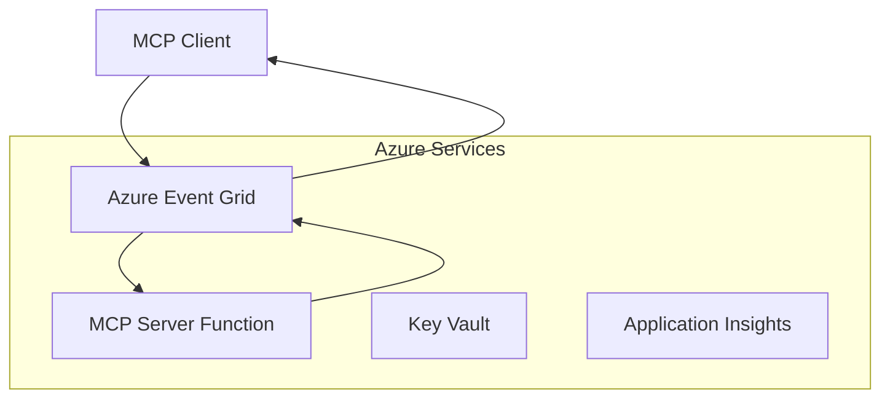
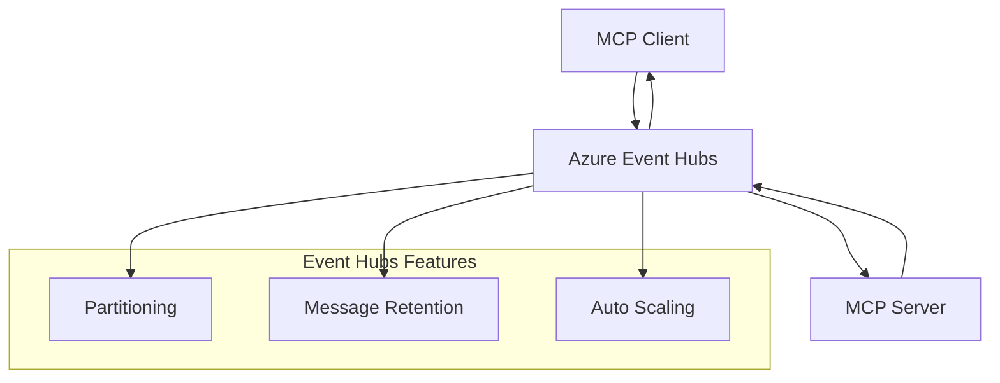

<!--
CO_OP_TRANSLATOR_METADATA:
{
  "original_hash": "c71c60af76120a517809a6cfba47e9a3",
  "translation_date": "2025-09-15T21:31:58+00:00",
  "source_file": "05-AdvancedTopics/mcp-transport/README.md",
  "language_code": "mr"
}
-->
# MCP कस्टम ट्रान्सपोर्ट्स - प्रगत अंमलबजावणी मार्गदर्शक

मॉडेल कॉन्टेक्स्ट प्रोटोकॉल (MCP) ट्रान्सपोर्ट यंत्रणांमध्ये लवचिकता प्रदान करते, ज्यामुळे विशेष एंटरप्राइझ वातावरणासाठी कस्टम अंमलबजावणी शक्य होते. हे प्रगत मार्गदर्शक Azure Event Grid आणि Azure Event Hubs चा उपयोग करून कस्टम ट्रान्सपोर्ट अंमलबजावणीचे उदाहरण देतो, ज्यामुळे स्केलेबल, क्लाउड-नेटिव MCP सोल्यूशन्स तयार करता येतात.

## परिचय

MCP चे मानक ट्रान्सपोर्ट्स (stdio आणि HTTP स्ट्रीमिंग) बहुतेक वापरासाठी उपयुक्त असले तरी, एंटरप्राइझ वातावरणात सुधारित स्केलेबिलिटी, विश्वसनीयता आणि विद्यमान क्लाउड पायाभूत सुविधांसोबत एकत्रीकरणासाठी विशेष ट्रान्सपोर्ट यंत्रणा आवश्यक असते. कस्टम ट्रान्सपोर्ट्स MCP ला क्लाउड-नेटिव मेसेजिंग सेवांचा उपयोग करण्यास सक्षम करतात, ज्यामुळे असिंक्रोनस संवाद, इव्हेंट-ड्रिव्हन आर्किटेक्चर आणि वितरित प्रक्रिया शक्य होते.

ही शिकवण MCP च्या नवीनतम स्पेसिफिकेशन (2025-06-18), Azure मेसेजिंग सेवा आणि स्थापित एंटरप्राइझ एकत्रीकरण पॅटर्नवर आधारित प्रगत ट्रान्सपोर्ट अंमलबजावणीचा अभ्यास करते.

### **MCP ट्रान्सपोर्ट आर्किटेक्चर**

**MCP स्पेसिफिकेशन (2025-06-18) मधून:**

- **मानक ट्रान्सपोर्ट्स**: stdio (शिफारस केलेले), HTTP स्ट्रीमिंग (दूरस्थ परिस्थितीसाठी)
- **कस्टम ट्रान्सपोर्ट्स**: MCP मेसेज एक्सचेंज प्रोटोकॉल अंमलबजावणी करणारे कोणतेही ट्रान्सपोर्ट
- **मेसेज फॉर्मॅट**: JSON-RPC 2.0 MCP-विशिष्ट विस्तारांसह
- **द्विदिशात्मक संवाद**: सूचना आणि प्रतिसादांसाठी पूर्ण डुप्लेक्स संवाद आवश्यक

## शिकण्याची उद्दिष्टे

या प्रगत शिकवणीच्या शेवटी, तुम्ही खालील गोष्टी सक्षमपणे करू शकाल:

- **कस्टम ट्रान्सपोर्ट आवश्यकता समजून घेणे**: कोणत्याही ट्रान्सपोर्ट लेयरवर MCP प्रोटोकॉल अंमलबजावणी करताना अनुपालन राखणे
- **Azure Event Grid ट्रान्सपोर्ट तयार करणे**: Azure Event Grid चा उपयोग करून इव्हेंट-ड्रिव्हन MCP सर्व्हर्स तयार करणे
- **Azure Event Hubs ट्रान्सपोर्ट अंमलबजावणी**: Azure Event Hubs चा उपयोग करून उच्च-थ्रूपुट MCP सोल्यूशन्स डिझाइन करणे
- **एंटरप्राइझ पॅटर्न लागू करणे**: विद्यमान Azure पायाभूत सुविधा आणि सुरक्षा मॉडेल्ससह कस्टम ट्रान्सपोर्ट्स एकत्र करणे
- **ट्रान्सपोर्ट विश्वसनीयता हाताळणे**: एंटरप्राइझ परिस्थितीसाठी मेसेज टिकाऊपणा, क्रम आणि त्रुटी हाताळणी अंमलबजावणी करणे
- **कामगिरी सुधारित करणे**: स्केल, लेटन्सी आणि थ्रूपुट आवश्यकता पूर्ण करण्यासाठी ट्रान्सपोर्ट सोल्यूशन्स डिझाइन करणे

## **ट्रान्सपोर्ट आवश्यकता**

### **MCP स्पेसिफिकेशन (2025-06-18) मधील मुख्य आवश्यकता**

```yaml
Message Protocol:
  format: "JSON-RPC 2.0 with MCP extensions"
  bidirectional: "Full duplex communication required"
  ordering: "Message ordering must be preserved per session"
  
Transport Layer:
  reliability: "Transport MUST handle connection failures gracefully"
  security: "Transport MUST support secure communication"
  identification: "Each session MUST have unique identifier"
  
Custom Transport:
  compliance: "MUST implement complete MCP message exchange"
  extensibility: "MAY add transport-specific features"
  interoperability: "MUST maintain protocol compatibility"
```

## **Azure Event Grid ट्रान्सपोर्ट अंमलबजावणी**

Azure Event Grid एक सर्व्हरलेस इव्हेंट राउटिंग सेवा प्रदान करते, जी इव्हेंट-ड्रिव्हन MCP आर्किटेक्चरसाठी आदर्श आहे. ही अंमलबजावणी स्केलेबल, सैल-संलग्न MCP प्रणाली कशी तयार करावी हे दाखवते.

### **आर्किटेक्चर विहंगावलोकन**



### **C# अंमलबजावणी - Event Grid ट्रान्सपोर्ट**

```csharp
using Azure.Messaging.EventGrid;
using Microsoft.Extensions.Azure;
using System.Text.Json;

public class EventGridMcpTransport : IMcpTransport
{
    private readonly EventGridPublisherClient _publisher;
    private readonly string _topicEndpoint;
    private readonly string _clientId;
    
    public EventGridMcpTransport(string topicEndpoint, string accessKey, string clientId)
    {
        _publisher = new EventGridPublisherClient(
            new Uri(topicEndpoint), 
            new AzureKeyCredential(accessKey));
        _topicEndpoint = topicEndpoint;
        _clientId = clientId;
    }
    
    public async Task SendMessageAsync(McpMessage message)
    {
        var eventGridEvent = new EventGridEvent(
            subject: $"mcp/{_clientId}",
            eventType: "MCP.MessageReceived",
            dataVersion: "1.0",
            data: JsonSerializer.Serialize(message))
        {
            Id = Guid.NewGuid().ToString(),
            EventTime = DateTimeOffset.UtcNow
        };
        
        await _publisher.SendEventAsync(eventGridEvent);
    }
    
    public async Task<McpMessage> ReceiveMessageAsync(CancellationToken cancellationToken)
    {
        // Event Grid is push-based, so implement webhook receiver
        // This would typically be handled by Azure Functions trigger
        throw new NotImplementedException("Use EventGridTrigger in Azure Functions");
    }
}

// Azure Function for receiving Event Grid events
[FunctionName("McpEventGridReceiver")]
public async Task<IActionResult> HandleEventGridMessage(
    [EventGridTrigger] EventGridEvent eventGridEvent,
    ILogger log)
{
    try
    {
        var mcpMessage = JsonSerializer.Deserialize<McpMessage>(
            eventGridEvent.Data.ToString());
        
        // Process MCP message
        var response = await _mcpServer.ProcessMessageAsync(mcpMessage);
        
        // Send response back via Event Grid
        await _transport.SendMessageAsync(response);
        
        return new OkResult();
    }
    catch (Exception ex)
    {
        log.LogError(ex, "Error processing Event Grid MCP message");
        return new BadRequestResult();
    }
}
```

### **TypeScript अंमलबजावणी - Event Grid ट्रान्सपोर्ट**

```typescript
import { EventGridPublisherClient, AzureKeyCredential } from "@azure/eventgrid";
import { McpTransport, McpMessage } from "./mcp-types";

export class EventGridMcpTransport implements McpTransport {
    private publisher: EventGridPublisherClient;
    private clientId: string;
    
    constructor(
        private topicEndpoint: string,
        private accessKey: string,
        clientId: string
    ) {
        this.publisher = new EventGridPublisherClient(
            topicEndpoint,
            new AzureKeyCredential(accessKey)
        );
        this.clientId = clientId;
    }
    
    async sendMessage(message: McpMessage): Promise<void> {
        const event = {
            id: crypto.randomUUID(),
            source: `mcp-client-${this.clientId}`,
            type: "MCP.MessageReceived",
            time: new Date(),
            data: message
        };
        
        await this.publisher.sendEvents([event]);
    }
    
    // Event-driven receive via Azure Functions
    onMessage(handler: (message: McpMessage) => Promise<void>): void {
        // Implementation would use Azure Functions Event Grid trigger
        // This is a conceptual interface for the webhook receiver
    }
}

// Azure Functions implementation
import { app, InvocationContext, EventGridEvent } from "@azure/functions";

app.eventGrid("mcpEventGridHandler", {
    handler: async (event: EventGridEvent, context: InvocationContext) => {
        try {
            const mcpMessage = event.data as McpMessage;
            
            // Process MCP message
            const response = await mcpServer.processMessage(mcpMessage);
            
            // Send response via Event Grid
            await transport.sendMessage(response);
            
        } catch (error) {
            context.error("Error processing MCP message:", error);
            throw error;
        }
    }
});
```

### **Python अंमलबजावणी - Event Grid ट्रान्सपोर्ट**

```python
from azure.eventgrid import EventGridPublisherClient, EventGridEvent
from azure.core.credentials import AzureKeyCredential
import asyncio
import json
from typing import Callable, Optional
import uuid
from datetime import datetime

class EventGridMcpTransport:
    def __init__(self, topic_endpoint: str, access_key: str, client_id: str):
        self.client = EventGridPublisherClient(
            topic_endpoint, 
            AzureKeyCredential(access_key)
        )
        self.client_id = client_id
        self.message_handler: Optional[Callable] = None
    
    async def send_message(self, message: dict) -> None:
        """Send MCP message via Event Grid"""
        event = EventGridEvent(
            data=message,
            subject=f"mcp/{self.client_id}",
            event_type="MCP.MessageReceived",
            data_version="1.0"
        )
        
        await self.client.send(event)
    
    def on_message(self, handler: Callable[[dict], None]) -> None:
        """Register message handler for incoming events"""
        self.message_handler = handler

# Azure Functions implementation
import azure.functions as func
import logging

def main(event: func.EventGridEvent) -> None:
    """Azure Functions Event Grid trigger for MCP messages"""
    try:
        # Parse MCP message from Event Grid event
        mcp_message = json.loads(event.get_body().decode('utf-8'))
        
        # Process MCP message
        response = process_mcp_message(mcp_message)
        
        # Send response back via Event Grid
        # (Implementation would create new Event Grid client)
        
    except Exception as e:
        logging.error(f"Error processing MCP Event Grid message: {e}")
        raise
```

## **Azure Event Hubs ट्रान्सपोर्ट अंमलबजावणी**

Azure Event Hubs उच्च-थ्रूपुट, रिअल-टाइम स्ट्रीमिंग क्षमता MCP परिस्थितीसाठी प्रदान करते, ज्यांना कमी लेटन्सी आणि उच्च मेसेज व्हॉल्यूम आवश्यक आहे.

### **आर्किटेक्चर विहंगावलोकन**



### **C# अंमलबजावणी - Event Hubs ट्रान्सपोर्ट**

```csharp
using Azure.Messaging.EventHubs;
using Azure.Messaging.EventHubs.Producer;
using Azure.Messaging.EventHubs.Consumer;
using System.Text;

public class EventHubsMcpTransport : IMcpTransport, IDisposable
{
    private readonly EventHubProducerClient _producer;
    private readonly EventHubConsumerClient _consumer;
    private readonly string _consumerGroup;
    private readonly CancellationTokenSource _cancellationTokenSource;
    
    public EventHubsMcpTransport(
        string connectionString, 
        string eventHubName,
        string consumerGroup = "$Default")
    {
        _producer = new EventHubProducerClient(connectionString, eventHubName);
        _consumer = new EventHubConsumerClient(
            consumerGroup, 
            connectionString, 
            eventHubName);
        _consumerGroup = consumerGroup;
        _cancellationTokenSource = new CancellationTokenSource();
    }
    
    public async Task SendMessageAsync(McpMessage message)
    {
        var messageBody = JsonSerializer.Serialize(message);
        var eventData = new EventData(Encoding.UTF8.GetBytes(messageBody));
        
        // Add MCP-specific properties
        eventData.Properties.Add("MessageType", message.Method ?? "response");
        eventData.Properties.Add("MessageId", message.Id);
        eventData.Properties.Add("Timestamp", DateTimeOffset.UtcNow);
        
        await _producer.SendAsync(new[] { eventData });
    }
    
    public async Task StartReceivingAsync(
        Func<McpMessage, Task> messageHandler)
    {
        await foreach (PartitionEvent partitionEvent in _consumer.ReadEventsAsync(
            _cancellationTokenSource.Token))
        {
            try
            {
                var messageBody = Encoding.UTF8.GetString(
                    partitionEvent.Data.EventBody.ToArray());
                var mcpMessage = JsonSerializer.Deserialize<McpMessage>(messageBody);
                
                await messageHandler(mcpMessage);
            }
            catch (Exception ex)
            {
                // Handle deserialization or processing errors
                Console.WriteLine($"Error processing message: {ex.Message}");
            }
        }
    }
    
    public void Dispose()
    {
        _cancellationTokenSource?.Cancel();
        _producer?.DisposeAsync().AsTask().Wait();
        _consumer?.DisposeAsync().AsTask().Wait();
        _cancellationTokenSource?.Dispose();
    }
}
```

### **TypeScript अंमलबजावणी - Event Hubs ट्रान्सपोर्ट**

```typescript
import { 
    EventHubProducerClient, 
    EventHubConsumerClient, 
    EventData 
} from "@azure/event-hubs";

export class EventHubsMcpTransport implements McpTransport {
    private producer: EventHubProducerClient;
    private consumer: EventHubConsumerClient;
    private isReceiving = false;
    
    constructor(
        private connectionString: string,
        private eventHubName: string,
        private consumerGroup: string = "$Default"
    ) {
        this.producer = new EventHubProducerClient(
            connectionString, 
            eventHubName
        );
        this.consumer = new EventHubConsumerClient(
            consumerGroup,
            connectionString,
            eventHubName
        );
    }
    
    async sendMessage(message: McpMessage): Promise<void> {
        const eventData: EventData = {
            body: JSON.stringify(message),
            properties: {
                messageType: message.method || "response",
                messageId: message.id,
                timestamp: new Date().toISOString()
            }
        };
        
        await this.producer.sendBatch([eventData]);
    }
    
    async startReceiving(
        messageHandler: (message: McpMessage) => Promise<void>
    ): Promise<void> {
        if (this.isReceiving) return;
        
        this.isReceiving = true;
        
        const subscription = this.consumer.subscribe({
            processEvents: async (events, context) => {
                for (const event of events) {
                    try {
                        const messageBody = event.body as string;
                        const mcpMessage: McpMessage = JSON.parse(messageBody);
                        
                        await messageHandler(mcpMessage);
                        
                        // Update checkpoint for at-least-once delivery
                        await context.updateCheckpoint(event);
                    } catch (error) {
                        console.error("Error processing Event Hubs message:", error);
                    }
                }
            },
            processError: async (err, context) => {
                console.error("Event Hubs error:", err);
            }
        });
    }
    
    async close(): Promise<void> {
        this.isReceiving = false;
        await this.producer.close();
        await this.consumer.close();
    }
}
```

### **Python अंमलबजावणी - Event Hubs ट्रान्सपोर्ट**

```python
from azure.eventhub import EventHubProducerClient, EventHubConsumerClient
from azure.eventhub import EventData
import json
import asyncio
from typing import Callable, Dict, Any
import logging

class EventHubsMcpTransport:
    def __init__(
        self, 
        connection_string: str, 
        eventhub_name: str,
        consumer_group: str = "$Default"
    ):
        self.producer = EventHubProducerClient.from_connection_string(
            connection_string, 
            eventhub_name=eventhub_name
        )
        self.consumer = EventHubConsumerClient.from_connection_string(
            connection_string,
            consumer_group=consumer_group,
            eventhub_name=eventhub_name
        )
        self.is_receiving = False
    
    async def send_message(self, message: Dict[str, Any]) -> None:
        """Send MCP message via Event Hubs"""
        event_data = EventData(json.dumps(message))
        
        # Add MCP-specific properties
        event_data.properties = {
            "messageType": message.get("method", "response"),
            "messageId": message.get("id"),
            "timestamp": "2025-01-14T10:30:00Z"  # Use actual timestamp
        }
        
        async with self.producer:
            event_data_batch = await self.producer.create_batch()
            event_data_batch.add(event_data)
            await self.producer.send_batch(event_data_batch)
    
    async def start_receiving(
        self, 
        message_handler: Callable[[Dict[str, Any]], None]
    ) -> None:
        """Start receiving MCP messages from Event Hubs"""
        if self.is_receiving:
            return
        
        self.is_receiving = True
        
        async with self.consumer:
            await self.consumer.receive(
                on_event=self._on_event_received(message_handler),
                starting_position="-1"  # Start from beginning
            )
    
    def _on_event_received(self, handler: Callable):
        """Internal event handler wrapper"""
        async def handle_event(partition_context, event):
            try:
                # Parse MCP message from Event Hubs event
                message_body = event.body_as_str(encoding='UTF-8')
                mcp_message = json.loads(message_body)
                
                # Process MCP message
                await handler(mcp_message)
                
                # Update checkpoint for at-least-once delivery
                await partition_context.update_checkpoint(event)
                
            except Exception as e:
                logging.error(f"Error processing Event Hubs message: {e}")
        
        return handle_event
    
    async def close(self) -> None:
        """Clean up transport resources"""
        self.is_receiving = False
        await self.producer.close()
        await self.consumer.close()
```

## **प्रगत ट्रान्सपोर्ट पॅटर्न्स**

### **मेसेज टिकाऊपणा आणि विश्वसनीयता**

```csharp
// Implementing message durability with retry logic
public class ReliableTransportWrapper : IMcpTransport
{
    private readonly IMcpTransport _innerTransport;
    private readonly RetryPolicy _retryPolicy;
    
    public async Task SendMessageAsync(McpMessage message)
    {
        await _retryPolicy.ExecuteAsync(async () =>
        {
            try
            {
                await _innerTransport.SendMessageAsync(message);
            }
            catch (TransportException ex) when (ex.IsRetryable)
            {
                // Log and retry
                throw;
            }
        });
    }
}
```

### **ट्रान्सपोर्ट सुरक्षा एकत्रीकरण**

```csharp
// Integrating Azure Key Vault for transport security
public class SecureTransportFactory
{
    private readonly SecretClient _keyVaultClient;
    
    public async Task<IMcpTransport> CreateEventGridTransportAsync()
    {
        var accessKey = await _keyVaultClient.GetSecretAsync("EventGridAccessKey");
        var topicEndpoint = await _keyVaultClient.GetSecretAsync("EventGridTopic");
        
        return new EventGridMcpTransport(
            topicEndpoint.Value.Value,
            accessKey.Value.Value,
            Environment.MachineName
        );
    }
}
```

### **ट्रान्सपोर्ट मॉनिटरिंग आणि निरीक्षण**

```csharp
// Adding telemetry to custom transports
public class ObservableTransport : IMcpTransport
{
    private readonly IMcpTransport _transport;
    private readonly ILogger _logger;
    private readonly TelemetryClient _telemetryClient;
    
    public async Task SendMessageAsync(McpMessage message)
    {
        using var activity = Activity.StartActivity("MCP.Transport.Send");
        activity?.SetTag("transport.type", "EventGrid");
        activity?.SetTag("message.method", message.Method);
        
        var stopwatch = Stopwatch.StartNew();
        
        try
        {
            await _transport.SendMessageAsync(message);
            
            _telemetryClient.TrackDependency(
                "EventGrid",
                "SendMessage",
                DateTime.UtcNow.Subtract(stopwatch.Elapsed),
                stopwatch.Elapsed,
                true
            );
        }
        catch (Exception ex)
        {
            _telemetryClient.TrackException(ex);
            throw;
        }
    }
}
```

## **एंटरप्राइझ एकत्रीकरण परिस्थिती**

### **परिस्थिती 1: वितरित MCP प्रक्रिया**

Azure Event Grid चा उपयोग करून MCP विनंत्या अनेक प्रक्रिया नोड्समध्ये वितरित करणे:

```yaml
Architecture:
  - MCP Client sends requests to Event Grid topic
  - Multiple Azure Functions subscribe to process different tool types
  - Results aggregated and returned via separate response topic
  
Benefits:
  - Horizontal scaling based on message volume
  - Fault tolerance through redundant processors
  - Cost optimization with serverless compute
```

### **परिस्थिती 2: रिअल-टाइम MCP स्ट्रीमिंग**

Azure Event Hubs चा उपयोग करून उच्च-वारंवारता MCP संवाद:

```yaml
Architecture:
  - MCP Client streams continuous requests via Event Hubs
  - Stream Analytics processes and routes messages
  - Multiple consumers handle different aspect of processing
  
Benefits:
  - Low latency for real-time scenarios
  - High throughput for batch processing
  - Built-in partitioning for parallel processing
```

### **परिस्थिती 3: हायब्रिड ट्रान्सपोर्ट आर्किटेक्चर**

वेगवेगळ्या वापरासाठी अनेक ट्रान्सपोर्ट्स एकत्र करणे:

```csharp
public class HybridMcpTransport : IMcpTransport
{
    private readonly IMcpTransport _realtimeTransport; // Event Hubs
    private readonly IMcpTransport _batchTransport;    // Event Grid
    private readonly IMcpTransport _fallbackTransport; // HTTP Streaming
    
    public async Task SendMessageAsync(McpMessage message)
    {
        // Route based on message characteristics
        var transport = message.Method switch
        {
            "tools/call" when IsRealtime(message) => _realtimeTransport,
            "resources/read" when IsBatch(message) => _batchTransport,
            _ => _fallbackTransport
        };
        
        await transport.SendMessageAsync(message);
    }
}
```

## **कामगिरी सुधारणा**

### **Event Grid साठी मेसेज बॅचिंग**

```csharp
public class BatchingEventGridTransport : IMcpTransport
{
    private readonly List<McpMessage> _messageBuffer = new();
    private readonly Timer _flushTimer;
    private const int MaxBatchSize = 100;
    
    public async Task SendMessageAsync(McpMessage message)
    {
        lock (_messageBuffer)
        {
            _messageBuffer.Add(message);
            
            if (_messageBuffer.Count >= MaxBatchSize)
            {
                _ = Task.Run(FlushMessages);
            }
        }
    }
    
    private async Task FlushMessages()
    {
        List<McpMessage> toSend;
        lock (_messageBuffer)
        {
            toSend = new List<McpMessage>(_messageBuffer);
            _messageBuffer.Clear();
        }
        
        if (toSend.Any())
        {
            var events = toSend.Select(CreateEventGridEvent);
            await _publisher.SendEventsAsync(events);
        }
    }
}
```

### **Event Hubs साठी विभाजन धोरण**

```csharp
public class PartitionedEventHubsTransport : IMcpTransport
{
    public async Task SendMessageAsync(McpMessage message)
    {
        // Partition by client ID for session affinity
        var partitionKey = ExtractClientId(message);
        
        var eventData = new EventData(JsonSerializer.SerializeToUtf8Bytes(message))
        {
            PartitionKey = partitionKey
        };
        
        await _producer.SendAsync(new[] { eventData });
    }
}
```

## **कस्टम ट्रान्सपोर्ट्सची चाचणी**

### **युनिट टेस्टिंग टेस्ट डबल्ससह**

```csharp
[Test]
public async Task EventGridTransport_SendMessage_PublishesCorrectEvent()
{
    // Arrange
    var mockPublisher = new Mock<EventGridPublisherClient>();
    var transport = new EventGridMcpTransport(mockPublisher.Object);
    var message = new McpMessage { Method = "tools/list", Id = "test-123" };
    
    // Act
    await transport.SendMessageAsync(message);
    
    // Assert
    mockPublisher.Verify(
        x => x.SendEventAsync(
            It.Is<EventGridEvent>(e => 
                e.EventType == "MCP.MessageReceived" &&
                e.Subject == "mcp/test-client"
            )
        ),
        Times.Once
    );
}
```

### **Azure टेस्ट कंटेनर्ससह इंटिग्रेशन टेस्टिंग**

```csharp
[Test]
public async Task EventHubsTransport_IntegrationTest()
{
    // Using Testcontainers for integration testing
    var eventHubsContainer = new EventHubsContainer()
        .WithEventHub("test-hub");
    
    await eventHubsContainer.StartAsync();
    
    var transport = new EventHubsMcpTransport(
        eventHubsContainer.GetConnectionString(),
        "test-hub"
    );
    
    // Test message round-trip
    var sentMessage = new McpMessage { Method = "test", Id = "123" };
    McpMessage receivedMessage = null;
    
    await transport.StartReceivingAsync(msg => {
        receivedMessage = msg;
        return Task.CompletedTask;
    });
    
    await transport.SendMessageAsync(sentMessage);
    await Task.Delay(1000); // Allow for message processing
    
    Assert.That(receivedMessage?.Id, Is.EqualTo("123"));
}
```

## **सर्वोत्तम पद्धती आणि मार्गदर्शक तत्त्वे**

### **ट्रान्सपोर्ट डिझाइन तत्त्वे**

1. **Idempotency**: डुप्लिकेट्स हाताळण्यासाठी मेसेज प्रक्रिया idempotent ठेवा
2. **त्रुटी हाताळणी**: व्यापक त्रुटी हाताळणी आणि मृत पत्रिका रांगा अंमलबजावणी करा
3. **मॉनिटरिंग**: तपशीलवार टेलीमेट्री आणि आरोग्य तपासणी जोडा
4. **सुरक्षा**: व्यवस्थापित ओळख आणि किमान विशेषाधिकार प्रवेश वापरा
5. **कामगिरी**: तुमच्या विशिष्ट लेटन्सी आणि थ्रूपुट आवश्यकता पूर्ण करण्यासाठी डिझाइन करा

### **Azure-विशिष्ट शिफारसी**

1. **व्यवस्थापित ओळख वापरा**: उत्पादनात कनेक्शन स्ट्रिंग्स टाळा
2. **सर्किट ब्रेकर्स अंमलबजावणी करा**: Azure सेवा अडथळ्यांपासून संरक्षण करा
3. **खर्च मॉनिटर करा**: मेसेज व्हॉल्यूम आणि प्रक्रिया खर्च ट्रॅक करा
4. **स्केलसाठी योजना करा**: विभाजन आणि स्केलिंग धोरणे लवकर डिझाइन करा
5. **संपूर्ण चाचणी करा**: व्यापक चाचणीसाठी Azure DevTest Labs वापरा

## **निष्कर्ष**

कस्टम MCP ट्रान्सपोर्ट्स Azure च्या मेसेजिंग सेवांचा उपयोग करून शक्तिशाली एंटरप्राइझ परिस्थिती सक्षम करतात. Event Grid किंवा Event Hubs ट्रान्सपोर्ट्स अंमलबजावणी करून, तुम्ही स्केलेबल, विश्वसनीय MCP सोल्यूशन्स तयार करू शकता, जे विद्यमान Azure पायाभूत सुविधांसोबत सहजपणे एकत्रित होतात.

प्रदान केलेली उदाहरणे कस्टम ट्रान्सपोर्ट्स अंमलबजावणीसाठी उत्पादन-तयार पॅटर्न्स दर्शवतात, MCP प्रोटोकॉल अनुपालन आणि Azure सर्वोत्तम पद्धती राखून.

## **अतिरिक्त संसाधने**

- [MCP स्पेसिफिकेशन 2025-06-18](https://spec.modelcontextprotocol.io/specification/2025-06-18/)
- [Azure Event Grid दस्तऐवज](https://docs.microsoft.com/azure/event-grid/)
- [Azure Event Hubs दस्तऐवज](https://docs.microsoft.com/azure/event-hubs/)
- [Azure Functions Event Grid Trigger](https://docs.microsoft.com/azure/azure-functions/functions-bindings-event-grid)
- [Azure SDK for .NET](https://github.com/Azure/azure-sdk-for-net)
- [Azure SDK for TypeScript](https://github.com/Azure/azure-sdk-for-js)
- [Azure SDK for Python](https://github.com/Azure/azure-sdk-for-python)

---

> *हा मार्गदर्शक उत्पादन MCP प्रणालींसाठी व्यावहारिक अंमलबजावणी पॅटर्नवर लक्ष केंद्रित करतो. तुमच्या विशिष्ट आवश्यकता आणि Azure सेवा मर्यादांनुसार ट्रान्सपोर्ट अंमलबजावणीची नेहमीच पडताळणी करा.*
> **सध्याचा मानक**: हा मार्गदर्शक [MCP स्पेसिफिकेशन 2025-06-18](https://spec.modelcontextprotocol.io/specification/2025-06-18/) ट्रान्सपोर्ट आवश्यकता आणि एंटरप्राइझ वातावरणासाठी प्रगत ट्रान्सपोर्ट पॅटर्न्स प्रतिबिंबित करतो.

## पुढे काय?
- [6. समुदाय योगदान](../../06-CommunityContributions/README.md)

---

**अस्वीकरण**:  
हा दस्तऐवज AI भाषांतर सेवा [Co-op Translator](https://github.com/Azure/co-op-translator) वापरून भाषांतरित करण्यात आला आहे. आम्ही अचूकतेसाठी प्रयत्नशील असलो तरी कृपया लक्षात ठेवा की स्वयंचलित भाषांतरे त्रुटी किंवा अचूकतेच्या अभावाने युक्त असू शकतात. मूळ भाषेतील दस्तऐवज हा अधिकृत स्रोत मानला जावा. महत्त्वाच्या माहितीसाठी व्यावसायिक मानवी भाषांतराची शिफारस केली जाते. या भाषांतराचा वापर करून उद्भवलेल्या कोणत्याही गैरसमज किंवा चुकीच्या अर्थासाठी आम्ही जबाबदार राहणार नाही.