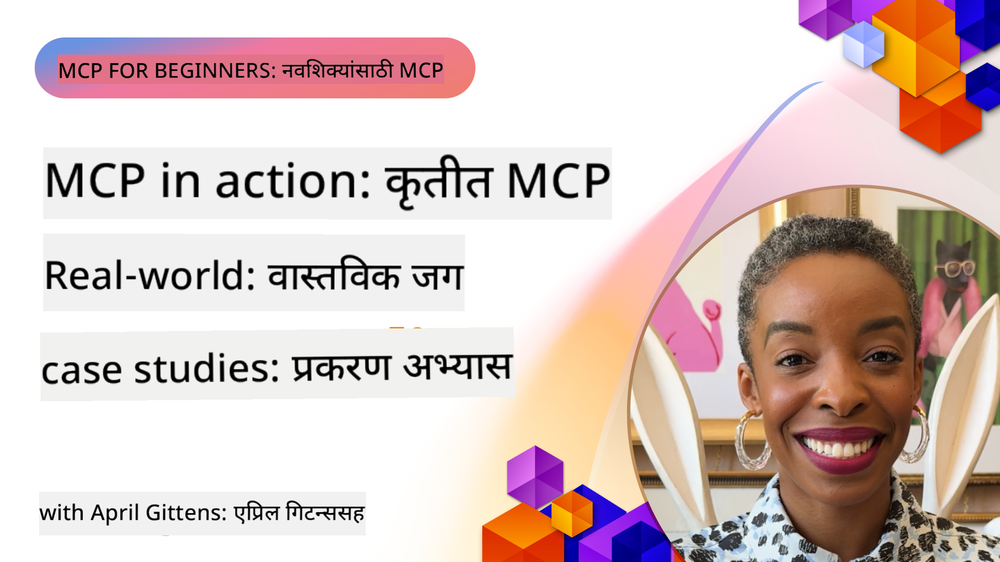

<!--
CO_OP_TRANSLATOR_METADATA:
{
  "original_hash": "1611dc5f6a2a35a789fc4c95fc5bfbe8",
  "translation_date": "2025-09-26T18:06:29+00:00",
  "source_file": "09-CaseStudy/README.md",
  "language_code": "mr"
}
-->
# MCP क्रियेत: वास्तविक जगातील केस स्टडीज

_(वरील प्रतिमेवर क्लिक करून या धड्याचा व्हिडिओ पहा)_

मॉडेल कॉन्टेक्स्ट प्रोटोकॉल (MCP) AI अनुप्रयोगांना डेटा, साधने आणि सेवांसोबत संवाद साधण्याच्या पद्धतीत क्रांती घडवत आहे. या विभागात विविध एंटरप्राइझ परिस्थितींमध्ये MCP च्या व्यावहारिक उपयोगाचे प्रदर्शन करणाऱ्या वास्तविक जगातील केस स्टडीज सादर केल्या आहेत.

## आढावा

या विभागात MCP अंमलबजावणीचे ठोस उदाहरणे दिली आहेत, ज्यामध्ये संस्थांनी या प्रोटोकॉलचा उपयोग करून जटिल व्यवसाय आव्हाने कशी सोडवली आहेत हे दाखवले आहे. या केस स्टडीजचा अभ्यास करून तुम्हाला MCP च्या बहुपयोगिता, स्केलेबिलिटी आणि व्यावहारिक फायदे याबद्दल अंतर्दृष्टी मिळेल.

## मुख्य शिक्षण उद्दिष्टे

या केस स्टडीजचा अभ्यास करून तुम्ही:

- MCP विशिष्ट व्यवसाय समस्यांचे निराकरण कसे करू शकते हे समजून घ्याल
- विविध एकत्रीकरण पद्धती आणि आर्किटेक्चरल दृष्टिकोन शिकाल
- एंटरप्राइझ वातावरणात MCP अंमलबजावणीसाठी सर्वोत्तम पद्धती ओळखाल
- वास्तविक जगातील अंमलबजावणीमध्ये आलेल्या आव्हाने आणि उपाय याबद्दल अंतर्दृष्टी मिळवाल
- तुमच्या स्वतःच्या प्रकल्पांमध्ये समान पद्धती लागू करण्याच्या संधी ओळखाल

## वैशिष्ट्यीकृत केस स्टडीज

### 1. [Azure AI ट्रॅव्हल एजंट्स – संदर्भ अंमलबजावणी](./travelagentsample.md)

ही केस स्टडी Microsoft च्या व्यापक संदर्भ समाधानाचा अभ्यास करते, ज्यामध्ये MCP, Azure OpenAI आणि Azure AI Search वापरून मल्टी-एजंट, AI-सक्षम प्रवास नियोजन अनुप्रयोग कसा तयार करायचा हे दाखवले आहे. प्रकल्पात हे दाखवले आहे:

- MCP द्वारे मल्टी-एजंट समन्वय
- Azure AI Search सह एंटरप्राइझ डेटा एकत्रीकरण
- Azure सेवांचा वापर करून सुरक्षित, स्केलेबल आर्किटेक्चर
- पुनर्वापरयोग्य MCP घटकांसह विस्तारक्षम साधने
- Azure OpenAI द्वारे समर्थित संभाषणात्मक वापरकर्ता अनुभव

आर्किटेक्चर आणि अंमलबजावणी तपशील MCP ला समन्वय स्तर म्हणून वापरून जटिल, मल्टी-एजंट प्रणाली तयार करण्याबद्दल मौल्यवान अंतर्दृष्टी प्रदान करतात.

### 2. [YouTube डेटामधून Azure DevOps आयटम्स अपडेट करणे](./UpdateADOItemsFromYT.md)

ही केस स्टडी MCP चा उपयोग करून कार्यप्रवाह प्रक्रिया स्वयंचलित करण्याचा व्यावहारिक उपयोग दाखवते. MCP साधनांचा उपयोग कसा करायचा हे दाखवले आहे:

- ऑनलाइन प्लॅटफॉर्म (YouTube) मधून डेटा काढणे
- Azure DevOps प्रणालींमध्ये कार्य आयटम्स अपडेट करणे
- पुनरावृत्तीयोग्य स्वयंचलित कार्यप्रवाह तयार करणे
- वेगवेगळ्या प्रणालींमध्ये डेटा एकत्रीकरण

हे उदाहरण दाखवते की तुलनेने सोप्या MCP अंमलबजावणी देखील नियमित कार्ये स्वयंचलित करून आणि प्रणालींमध्ये डेटा सुसंगतता सुधारून महत्त्वपूर्ण कार्यक्षमता लाभ प्रदान करू शकतात.

### 3. [MCP सह रिअल-टाइम दस्तऐवज पुनर्प्राप्ती](./docs-mcp/README.md)

ही केस स्टडी Python कन्सोल क्लायंट MCP सर्व्हरशी जोडून रिअल-टाइम, संदर्भ-जाणकार Microsoft दस्तऐवज पुनर्प्राप्ती आणि लॉगिंग कसे करायचे याबद्दल मार्गदर्शन करते. तुम्ही शिकाल:

- Python क्लायंट आणि अधिकृत MCP SDK वापरून MCP सर्व्हरशी कसे कनेक्ट करायचे
- कार्यक्षम, रिअल-टाइम डेटा पुनर्प्राप्तीसाठी स्ट्रीमिंग HTTP क्लायंट वापरणे
- सर्व्हरवरील दस्तऐवज साधनांना कॉल करणे आणि प्रतिसाद थेट कन्सोलमध्ये लॉग करणे
- टर्मिनल सोडल्याशिवाय तुमच्या कार्यप्रवाहात अद्ययावत Microsoft दस्तऐवज समाकलित करणे

या अध्यायात हाताळण्याचे कार्य, किमान कार्यरत कोड नमुना आणि सखोल शिक्षणासाठी अतिरिक्त संसाधनांचे दुवे समाविष्ट आहेत. MCP कसे दस्तऐवज प्रवेश आणि विकसक उत्पादकता सुधारू शकते हे समजण्यासाठी संपूर्ण वॉकथ्रू आणि कोड पाहा.

### 4. [MCP सह इंटरएक्टिव स्टडी प्लॅन जनरेटर वेब अॅप](./docs-mcp/README.md)

ही केस स्टडी Chainlit आणि Model Context Protocol (MCP) वापरून वैयक्तिकृत अभ्यास योजना तयार करण्यासाठी एक इंटरएक्टिव वेब अनुप्रयोग कसा तयार करायचा हे दाखवते. वापरकर्ते विषय (उदा. "AI-900 प्रमाणपत्र") आणि अभ्यास कालावधी (उदा. 8 आठवडे) निर्दिष्ट करू शकतात, आणि अॅप आठवड्याच्या-आठवड्याच्या शिफारस केलेल्या सामग्रीचे विहंगावलोकन प्रदान करेल. Chainlit संभाषणात्मक चॅट इंटरफेस सक्षम करते, ज्यामुळे अनुभव आकर्षक आणि अनुकूल होतो.

- Chainlit द्वारे समर्थित संभाषणात्मक वेब अॅप
- विषय आणि कालावधीसाठी वापरकर्ता-चालित प्रॉम्प्ट्स
- MCP वापरून आठवड्याच्या-आठवड्याच्या सामग्री शिफारसी
- चॅट इंटरफेसमध्ये रिअल-टाइम, अनुकूल प्रतिसाद

हा प्रकल्प दाखवतो की संभाषणात्मक AI आणि MCP कसे एकत्रित केले जाऊ शकते जेणेकरून आधुनिक वेब वातावरणात गतिशील, वापरकर्ता-चालित शैक्षणिक साधने तयार करता येतील.

### 5. [VS Code मध्ये MCP सर्व्हरसह इन-एडिटर डॉक्स](./docs-mcp/README.md)

ही केस स्टडी दाखवते की Microsoft Learn Docs थेट तुमच्या VS Code वातावरणात MCP सर्व्हर वापरून कसे आणायचे—ब्राउझर टॅब स्विच करण्याची गरज नाही! तुम्ही शिकाल:

- VS Code मध्ये MCP पॅनेल किंवा कमांड पॅलेट वापरून डॉक्स त्वरित शोधणे आणि वाचणे
- दस्तऐवज संदर्भित करणे आणि दुवे थेट तुमच्या README किंवा कोर्स मार्कडाउन फाइल्समध्ये समाविष्ट करणे
- GitHub Copilot आणि MCP एकत्रितपणे वापरून AI-सक्षम दस्तऐवज आणि कोड कार्यप्रवाह
- रिअल-टाइम अभिप्राय आणि Microsoft-स्रोत अचूकतेसह तुमचे दस्तऐवज सत्यापित करणे आणि सुधारित करणे
- सतत दस्तऐवज सत्यापनासाठी GitHub कार्यप्रवाहांसह MCP समाकलित करणे

अंमलबजावणीमध्ये समाविष्ट आहे:

- सोप्या सेटअपसाठी उदाहरण `.vscode/mcp.json` कॉन्फिगरेशन
- इन-एडिटर अनुभवाचे स्क्रीनशॉट-आधारित वॉकथ्रू
- उत्पादकता वाढवण्यासाठी Copilot आणि MCP एकत्रित करण्यासाठी टिप्स

हा परिदृश्य कोर्स लेखक, दस्तऐवज लेखक आणि विकसकांसाठी आदर्श आहे जे दस्तऐवज, Copilot आणि सत्यापन साधनांसह काम करत असताना त्यांच्या संपादकावर लक्ष केंद्रित करू इच्छितात—सर्व MCP द्वारे समर्थित.

### 6. [APIM MCP सर्व्हर तयार करणे](./apimsample.md)

ही केस स्टडी Azure API Management (APIM) वापरून MCP सर्व्हर कसे तयार करायचे याबद्दल चरण-दर-चरण मार्गदर्शक प्रदान करते. यात समाविष्ट आहे:

- Azure API Management मध्ये MCP सर्व्हर सेट करणे
- MCP साधन म्हणून API ऑपरेशन्स उघड करणे
- दर मर्यादित आणि सुरक्षा धोरणे कॉन्फिगर करणे
- Visual Studio Code आणि GitHub Copilot वापरून MCP सर्व्हरची चाचणी करणे

हे उदाहरण दाखवते की Azure च्या क्षमतांचा उपयोग करून मजबूत MCP सर्व्हर कसे तयार करायचे, जे विविध अनुप्रयोगांमध्ये वापरले जाऊ शकते आणि AI प्रणालींच्या एंटरप्राइझ API सह एकत्रीकरण सुधारते.

### 7. [GitHub MCP रजिस्ट्रि — एजेंटिक एकत्रीकरण वेगवान करणे](https://github.com/mcp)

ही केस स्टडी GitHub च्या MCP रजिस्ट्रिचा अभ्यास करते, ज्याने सप्टेंबर 2025 मध्ये लॉन्च केलेल्या AI इकोसिस्टममधील एक महत्त्वाचे आव्हान सोडवले: मॉडेल कॉन्टेक्स्ट प्रोटोकॉल (MCP) सर्व्हर्सच्या विखुरलेल्या शोध आणि अंमलबजावणी.

#### आढावा
**MCP रजिस्ट्रि** विखुरलेल्या MCP सर्व्हर्सच्या समस्येचे निराकरण करते, जे पूर्वी एकत्रीकरण मंद आणि त्रुटी-प्रवण बनवायचे. हे सर्व्हर्स AI एजंट्सना APIs, डेटाबेस आणि दस्तऐवज स्रोतांसारख्या बाह्य प्रणालींसोबत संवाद साधण्यास सक्षम करतात.

#### समस्या विधान
एजेंटिक कार्यप्रवाह तयार करणाऱ्या विकसकांना अनेक आव्हाने होती:
- **MCP सर्व्हर्सचा खराब शोध** विविध प्लॅटफॉर्मवर
- **पुनरावृत्ती सेटअप प्रश्न** फोरम आणि दस्तऐवजांमध्ये विखुरलेले
- **सुरक्षा जोखीम** अप्रमाणित आणि अविश्वसनीय स्रोतांमुळे
- **मानक नसणे** सर्व्हर गुणवत्ता आणि सुसंगततेमध्ये

#### उपाय आर्किटेक्चर
GitHub च्या MCP रजिस्ट्रि विश्वासार्ह MCP सर्व्हर्स केंद्रीकृत करते, ज्यामध्ये प्रमुख वैशिष्ट्ये आहेत:
- **वन-क्लिक इंस्टॉल** VS Code द्वारे एकत्रित करण्यासाठी
- **सिग्नल-ओव्हर-नॉईज सॉर्टिंग** स्टार्स, क्रियाकलाप आणि समुदाय सत्यापनाद्वारे
- **थेट एकत्रीकरण** GitHub Copilot आणि इतर MCP-सुसंगत साधनांसह
- **ओपन योगदान मॉडेल** समुदाय आणि एंटरप्राइझ भागीदारांना योगदान देण्यास सक्षम करते

#### व्यवसाय प्रभाव
रजिस्ट्रिने मोजता येणारे सुधारणा दिल्या आहेत:
- **जलद ऑनबोर्डिंग** Microsoft Learn MCP सर्व्हरसारख्या साधनांसाठी, जे अधिकृत दस्तऐवज थेट एजंट्समध्ये प्रवाहित करते
- **उत्पादकता सुधारित** `github-mcp-server` सारख्या विशेष सर्व्हर्सद्वारे, नैसर्गिक भाषा GitHub ऑटोमेशन सक्षम करते (PR तयार करणे, CI पुन्हा चालवणे, कोड स्कॅनिंग)
- **मजबूत इकोसिस्टम विश्वास** क्युरेटेड लिस्टिंग आणि पारदर्शक कॉन्फिगरेशन मानकांद्वारे

#### धोरणात्मक मूल्य
एजंट जीवनचक्र व्यवस्थापन आणि पुनरुत्पादनीय कार्यप्रवाहांमध्ये विशेष तज्ञांसाठी, MCP रजिस्ट्रि प्रदान करते:
- **मॉड्यूलर एजंट अंमलबजावणी** मानक घटकांसह
- **रजिस्ट्रि-बॅक्ड मूल्यांकन पाइपलाइन** सुसंगत चाचणी आणि सत्यापनासाठी
- **क्रॉस-टूल इंटरऑपरेबिलिटी** विविध AI प्लॅटफॉर्ममध्ये सहज एकत्रीकरण सक्षम करते

ही केस स्टडी दाखवते की MCP रजिस्ट्रि फक्त एक निर्देशिका नाही—हे स्केलेबल, वास्तविक जगातील मॉडेल एकत्रीकरण आणि एजंटिक प्रणाली अंमलबजावणीसाठी एक मूलभूत प्लॅटफॉर्म आहे.

## निष्कर्ष

या सात व्यापक केस स्टडीज मॉडेल कॉन्टेक्स्ट प्रोटोकॉलच्या विविध वास्तविक जगातील परिस्थितींमध्ये उल्लेखनीय बहुपयोगिता आणि व्यावहारिक उपयोग दाखवतात. जटिल मल्टी-एजंट प्रवास नियोजन प्रणाली आणि एंटरप्राइझ API व्यवस्थापनापासून ते सुव्यवस्थित दस्तऐवज कार्यप्रवाह आणि क्रांतिकारक GitHub MCP रजिस्ट्रि पर्यंत, ही उदाहरणे MCP कसे AI प्रणालींना साधने, डेटा आणि सेवा जोडण्यासाठी एक मानक, स्केलेबल मार्ग प्रदान करते हे दाखवतात.

केस स्टडीज MCP अंमलबजावणीचे अनेक पैलू कव्हर करतात:
- **एंटरप्राइझ एकत्रीकरण**: Azure API Management आणि Azure DevOps ऑटोमेशन
- **मल्टी-एजंट समन्वय**: समन्वयित AI एजंट्ससह प्रवास नियोजन
- **विकसक उत्पादकता**: VS Code एकत्रीकरण आणि रिअल-टाइम दस्तऐवज प्रवेश
- **इकोसिस्टम विकास**: GitHub च्या MCP रजिस्ट्रि एक मूलभूत प्लॅटफॉर्म म्हणून
- **शैक्षणिक अनुप्रयोग**: इंटरएक्टिव स्टडी प्लॅन जनरेटर आणि संभाषणात्मक इंटरफेस

या अंमलबजावणींचा अभ्यास करून तुम्हाला महत्त्वपूर्ण अंतर्दृष्टी मिळेल:
- **आर्किटेक्चरल पद्धती** विविध स्केल्स आणि उपयोगांसाठी
- **अंमलबजावणी धोरणे** कार्यक्षमता आणि देखभाल यामध्ये संतुलन राखण्यासाठी
- **सुरक्षा आणि स्केलेबिलिटी** उत्पादन अंमलबजावणीसाठी विचार
- **सर्वोत्तम पद्धती** MCP सर्व्हर विकास आणि क्लायंट एकत्रीकरणासाठी
- **इकोसिस्टम विचार** परस्पर जोडलेली AI-सक्षम समाधान तयार करण्यासाठी

ही उदाहरणे सामूहिकपणे दाखवतात की MCP फक्त एक सैद्धांतिक फ्रेमवर्क नाही तर जटिल व्यवसाय आव्हाने सोडवण्यासाठी व्यावहारिक उपाय सक्षम करणारा एक परिपक्व, उत्पादन-तयार प्रोटोकॉल आहे. तुम्ही साधे ऑटोमेशन साधने तयार करत असाल किंवा अत्याधुनिक मल्टी-एजंट प्रणाली तयार करत असाल, येथे दाखवलेल्या पद्धती आणि दृष्टिकोन तुमच्या स्वतःच्या MCP प्रकल्पांसाठी एक मजबूत पाया प्रदान करतात.

## अतिरिक्त संसाधने

- [Azure AI ट्रॅव्हल एजंट्स GitHub रिपॉझिटरी](https://github.com/Azure-Samples/azure-ai-travel-agents)
- [Azure DevOps MCP साधन](https://github.com/microsoft/azure-devops-mcp)
- [Playwright MCP साधन](https://github.com/microsoft/playwright-mcp)
- [Microsoft Docs MCP सर्व्हर](https://github.com/MicrosoftDocs/mcp)
- [GitHub MCP रजिस्ट्रि — एजेंटिक एकत्रीकरण वेगवान करणे](https://github.com/mcp)
- [MCP समुदाय उदाहरणे](https://github.com/microsoft/mcp)

पुढे: हाताळण्याचा प्रयोग [AI कार्यप्रवाह सुव्यवस्थित करणे: AI टूलकिटसह MCP सर्व्हर तयार करणे](../10-StreamliningAIWorkflowsBuildingAnMCPServerWithAIToolkit/README.md)

---

