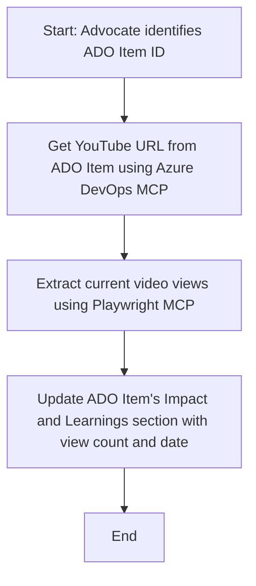

<!--
CO_OP_TRANSLATOR_METADATA:
{
  "original_hash": "14a2dfbea55ef735660a06bd6bdfe5f3",
  "translation_date": "2025-07-14T06:10:50+00:00",
  "source_file": "09-CaseStudy/UpdateADOItemsFromYT.md",
  "language_code": "mr"
}
-->
# केस स्टडी: YouTube डेटावरून Azure DevOps आयटम्स अपडेट करणे MCP वापरून

> **Disclaimer:** YouTube सारख्या प्लॅटफॉर्मवरून डेटा वापरून Azure DevOps आयटम्स अपडेट करण्यासाठी आधीपासूनच ऑनलाइन टूल्स आणि रिपोर्ट्स उपलब्ध आहेत जे हे काम स्वयंचलित करू शकतात. खालील उदाहरण फक्त MCP टूल्स कसे ऑटोमेशन आणि इंटिग्रेशनसाठी वापरता येतात हे दाखवण्यासाठी दिलेले आहे.

## आढावा

ही केस स्टडी Model Context Protocol (MCP) आणि त्याच्या टूल्सचा वापर करून Azure DevOps (ADO) वर्क आयटम्स ऑनलाइन प्लॅटफॉर्म्समधून मिळालेल्या माहितीने कशी स्वयंचलितपणे अपडेट करता येतात याचे एक उदाहरण दाखवते. वर्णन केलेले उदाहरण हे या टूल्सच्या व्यापक क्षमतांपैकी एक आहे, जे अनेक समान ऑटोमेशन गरजांसाठी सानुकूल करता येऊ शकतात.

या उदाहरणात, एक Advocate ADO आयटम्स वापरून ऑनलाइन सत्रांचे ट्रॅकिंग करतो, ज्यामध्ये प्रत्येक आयटममध्ये YouTube व्हिडिओ URL असतो. MCP टूल्सचा वापर करून Advocate ADO आयटम्समध्ये व्हिडिओच्या नवीनतम मेट्रिक्स, जसे की व्ह्यू काउंट, नियमित आणि स्वयंचलित पद्धतीने अपडेट करू शकतो. हा दृष्टिकोन इतर वापरांच्या बाबतीतही लागू होऊ शकतो जिथे ऑनलाइन स्रोतांमधून माहिती ADO किंवा इतर सिस्टममध्ये समाकलित करणे आवश्यक असते.

## परिस्थिती

एक Advocate ऑनलाइन सत्रांचा आणि समुदायातील सहभागाचा परिणाम ट्रॅक करण्यासाठी जबाबदार आहे. प्रत्येक सत्र 'DevRel' प्रोजेक्टमधील ADO वर्क आयटम म्हणून नोंदवले जाते, आणि त्या वर्क आयटममध्ये YouTube व्हिडिओ URL साठी एक फील्ड असते. सत्राचा पोहोच अचूकपणे रिपोर्ट करण्यासाठी Advocate ला व्हिडिओच्या सध्याच्या व्ह्यूजची संख्या आणि ही माहिती कधी मिळवली गेली याची तारीख ADO आयटममध्ये अपडेट करणे आवश्यक असते.

## वापरलेली टूल्स

- [Azure DevOps MCP](https://github.com/microsoft/azure-devops-mcp): MCP द्वारे ADO वर्क आयटम्समध्ये प्रोग्रामॅटिक प्रवेश आणि अपडेट्स सक्षम करते.
- [Playwright MCP](https://github.com/microsoft/playwright-mcp): वेब पेजेसवरून, जसे की YouTube व्हिडिओ स्टॅटिस्टिक्स, थेट डेटा काढण्यासाठी ब्राउझर क्रिया स्वयंचलित करते.

## टप्प्याटप्प्याने कार्यप्रवाह

1. **ADO आयटम ओळखणे**: 'DevRel' प्रोजेक्टमधील ADO वर्क आयटम आयडी (उदा. 1234) पासून सुरुवात करा.
2. **YouTube URL मिळवणे**: Azure DevOps MCP टूल वापरून वर्क आयटममधून YouTube URL मिळवा.
3. **व्हिडिओ व्ह्यूज काढणे**: Playwright MCP टूल वापरून YouTube URL वर जा आणि सध्याचा व्ह्यू काउंट काढा.
4. **ADO आयटम अपडेट करणे**: Azure DevOps MCP टूल वापरून 'Impact and Learnings' विभागात नवीनतम व्ह्यू काउंट आणि माहिती मिळाल्याची तारीख लिहा.

## उदाहरण प्रॉम्प्ट

```bash
- Work with the ADO Item ID: 1234
- The project is '2025-Awesome'
- Get the YouTube URL for the ADO item
- Use Playwright to get the current views from the YouTube video
- Update the ADO item with the current video views and the updated date of the information
```

## Mermaid फ्लोचार्ट



## तांत्रिक अंमलबजावणी

- **MCP ऑर्केस्ट्रेशन**: हा कार्यप्रवाह MCP सर्व्हरद्वारे नियंत्रित केला जातो, जो Azure DevOps MCP आणि Playwright MCP टूल्सच्या वापराचे समन्वय साधतो.
- **स्वयंचलन**: हा प्रक्रिया मॅन्युअली ट्रिगर केली जाऊ शकते किंवा नियमित अंतराने चालवण्यासाठी शेड्यूल केली जाऊ शकते जेणेकरून ADO आयटम्स अपडेट राहतील.
- **विस्तारयोग्यता**: हा पद्धत इतर ऑनलाइन मेट्रिक्स (उदा. लाईक्स, कमेंट्स) किंवा इतर प्लॅटफॉर्म्समधून डेटा अपडेट करण्यासाठीही वापरता येऊ शकते.

## परिणाम आणि प्रभाव

- **कार्यक्षमता**: Advocate साठी व्हिडिओ मेट्रिक्स मिळवणे आणि अपडेट करणे यासाठी मॅन्युअल मेहनत कमी होते.
- **अचूकता**: ADO आयटम्समध्ये ऑनलाइन स्रोतांमधून उपलब्ध असलेला सर्वात अलीकडील डेटा प्रतिबिंबित होतो.
- **पुनरावृत्तीयोग्यता**: इतर डेटा स्रोत किंवा मेट्रिक्ससह समान परिस्थितींसाठी पुन्हा वापरता येणारा कार्यप्रवाह उपलब्ध होतो.

## संदर्भ

- [Azure DevOps MCP](https://github.com/microsoft/azure-devops-mcp)
- [Playwright MCP](https://github.com/microsoft/playwright-mcp)
- [Model Context Protocol (MCP)](https://modelcontextprotocol.io/)

**अस्वीकरण**:  
हा दस्तऐवज AI अनुवाद सेवा [Co-op Translator](https://github.com/Azure/co-op-translator) वापरून अनुवादित केला आहे. आम्ही अचूकतेसाठी प्रयत्नशील असलो तरी, कृपया लक्षात घ्या की स्वयंचलित अनुवादांमध्ये चुका किंवा अचूकतेची कमतरता असू शकते. मूळ दस्तऐवज त्याच्या स्थानिक भाषेत अधिकृत स्रोत मानला जावा. महत्त्वाच्या माहितीसाठी व्यावसायिक मानवी अनुवाद करण्याची शिफारस केली जाते. या अनुवादाच्या वापरामुळे उद्भवणाऱ्या कोणत्याही गैरसमजुती किंवा चुकीच्या अर्थलागी आम्ही जबाबदार नाही.