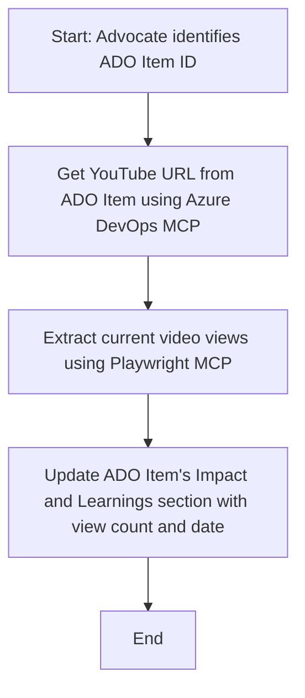

<!--
CO_OP_TRANSLATOR_METADATA:
{
  "original_hash": "14a2dfbea55ef735660a06bd6bdfe5f3",
  "translation_date": "2025-06-13T21:33:29+00:00",
  "source_file": "09-CaseStudy/UpdateADOItemsFromYT.md",
  "language_code": "mr"
}
-->
# केस स्टडी: YouTube डेटा वापरून Azure DevOps आयटम्स अपडेट करणे MCP सह

> **अस्वीकरण:** Azure DevOps आयटम्सना YouTube सारख्या प्लॅटफॉर्ममधील डेटाने अपडेट करण्यासाठी ऑनलाइन टूल्स आणि रिपोर्ट्स आधीच उपलब्ध आहेत. खालील उदाहरण फक्त MCP टूल्सचा वापर करून ऑटोमेशन आणि इंटिग्रेशन कसे करता येईल हे दाखवण्यासाठी दिले आहे.

## आढावा

ही केस स्टडी Model Context Protocol (MCP) आणि त्याच्या टूल्सचा वापर करून Azure DevOps (ADO) वर्क आयटम्सना ऑनलाइन प्लॅटफॉर्म्समधून मिळालेली माहिती, जसे की YouTube, वापरून अपडेट करण्याचा एक उदाहरण दाखवते. दिलेला सीनारिओ हे टूल्सच्या विस्तृत क्षमतांपैकी एक उदाहरण आहे, जे अनेक ऑटोमेशन गरजांसाठी सानुकूल करता येऊ शकतात.

या उदाहरणात, एक Advocate ADO आयटम्स वापरून ऑनलाइन सत्रांचे ट्रॅकिंग करतो, जिथे प्रत्येक आयटममध्ये YouTube व्हिडिओ URL असतो. MCP टूल्सचा वापर करून, Advocate ADO आयटम्सना व्हिडिओच्या नवीनतम मेट्रिक्स, जसे की व्ह्यू काउंट, नियमितपणे आणि ऑटोमेटेड पद्धतीने अपडेट करू शकतो. ही पद्धत अशा इतर वापरासाठीही लागू शकते जिथे ऑनलाइन स्रोतांमधून माहिती ADO किंवा इतर सिस्टममध्ये समाकलित करायची असते.

## सीनारिओ

एक Advocate ऑनलाइन सत्रे आणि कम्युनिटी एंगेजमेंट्सचा परिणाम ट्रॅक करण्यासाठी जबाबदार आहे. प्रत्येक सत्र 'DevRel' प्रोजेक्टमधील ADO वर्क आयटम म्हणून नोंदवले जाते, आणि त्या वर्क आयटममध्ये YouTube व्हिडिओ URL साठी एक फील्ड असते. सत्राचा पोहोच अचूकपणे रिपोर्ट करण्यासाठी, Advocate ला ADO आयटममध्ये व्हिडिओच्या सध्याच्या व्ह्यूजची संख्या आणि माहिती कधी मिळवली गेली हे अपडेट करणे आवश्यक आहे.

## वापरलेली टूल्स

- [Azure DevOps MCP](https://github.com/microsoft/azure-devops-mcp): MCP द्वारे ADO वर्क आयटम्सना प्रोग्रामॅटिक ऍक्सेस आणि अपडेट करण्यास मदत करते.
- [Playwright MCP](https://github.com/microsoft/playwright-mcp): ब्राउझर क्रिया ऑटोमेट करून वेबपेजेसमधून, जसे की YouTube व्हिडिओ स्टॅटिस्टिक्स, थेट डेटा काढते.

## टप्प्याटप्प्याने कार्यप्रवाह

1. **ADO आयटम ओळखा**: 'DevRel' प्रोजेक्टमधील ADO वर्क आयटम आयडी (उदा. 1234) पासून सुरुवात करा.
2. **YouTube URL मिळवा**: Azure DevOps MCP टूल वापरून वर्क आयटममधून YouTube URL मिळवा.
3. **व्हिडिओ व्ह्यूज काढा**: Playwright MCP टूल वापरून YouTube URL वर जा आणि सध्याचा व्ह्यू काउंट काढा.
4. **ADO आयटम अपडेट करा**: Azure DevOps MCP टूल वापरून 'Impact and Learnings' सेक्शनमध्ये नवीनतम व्ह्यू काउंट आणि माहिती मिळाल्याचा दिनांक लिहा.

## उदाहरण प्रॉम्प्ट

```bash
- Work with the ADO Item ID: 1234
- The project is '2025-Awesome'
- Get the YouTube URL for the ADO item
- Use Playwright to get the current views from the YouTube video
- Update the ADO item with the current video views and the updated date of the information
```

## Mermaid फ्लोचार्ट



## तांत्रिक अंमलबजावणी

- **MCP ऑर्केस्ट्रेशन**: हा कार्यप्रवाह MCP सर्व्हरद्वारे नियंत्रित केला जातो, जो Azure DevOps MCP आणि Playwright MCP टूल्सचा समन्वय करतो.
- **ऑटोमेशन**: हा प्रोसेस मॅन्युअली सुरू केला जाऊ शकतो किंवा नियमित अंतराने चालण्यासाठी शेड्यूल केला जाऊ शकतो जेणेकरून ADO आयटम्स अपडेट राहतील.
- **विस्तारक्षमता**: हाच नमुना इतर ऑनलाइन मेट्रिक्स (उदा. लाईक्स, कमेंट्स) किंवा इतर प्लॅटफॉर्म्समधून ADO आयटम्स अपडेट करण्यासाठी वापरता येऊ शकतो.

## परिणाम आणि प्रभाव

- **कार्यक्षमता**: Advocate साठी व्हिडिओ मेट्रिक्स मिळवण्याचा आणि अपडेट करण्याचा मॅन्युअल प्रयत्न कमी करतो.
- **अचूकता**: ADO आयटम्स ऑनलाइन स्रोतांमधून उपलब्ध असलेल्या सर्वात अलीकडील डेटाचे प्रतिबिंब दाखवतात.
- **पुनरावृत्ती क्षमता**: अशाच इतर डेटास्रोतांशी संबंधित सीनारिओसाठी पुन्हा वापरता येणारा कार्यप्रवाह प्रदान करतो.

## संदर्भ

- [Azure DevOps MCP](https://github.com/microsoft/azure-devops-mcp)
- [Playwright MCP](https://github.com/microsoft/playwright-mcp)
- [Model Context Protocol (MCP)](https://modelcontextprotocol.io/)

**अस्वीकरण**:  
हा दस्तऐवज AI भाषांतर सेवा [Co-op Translator](https://github.com/Azure/co-op-translator) वापरून भाषांतरित केला आहे. आम्ही अचूकतेसाठी प्रयत्नशील असलो तरी, कृपया लक्षात ठेवा की स्वयंचलित भाषांतरांमध्ये चुका किंवा अचूकतेची कमतरता असू शकते. मूळ दस्तऐवज त्याच्या स्थानिक भाषेत अधिकृत स्रोत मानला पाहिजे. महत्त्वाची माहिती असल्यास, व्यावसायिक मानवी भाषांतर करण्याची शिफारस केली जाते. या भाषांतराचा वापर केल्यामुळे उद्भवलेल्या कोणत्याही गैरसमजुतींसाठी किंवा चुकीच्या अर्थसंग्रहांसाठी आम्ही जबाबदार नाही.