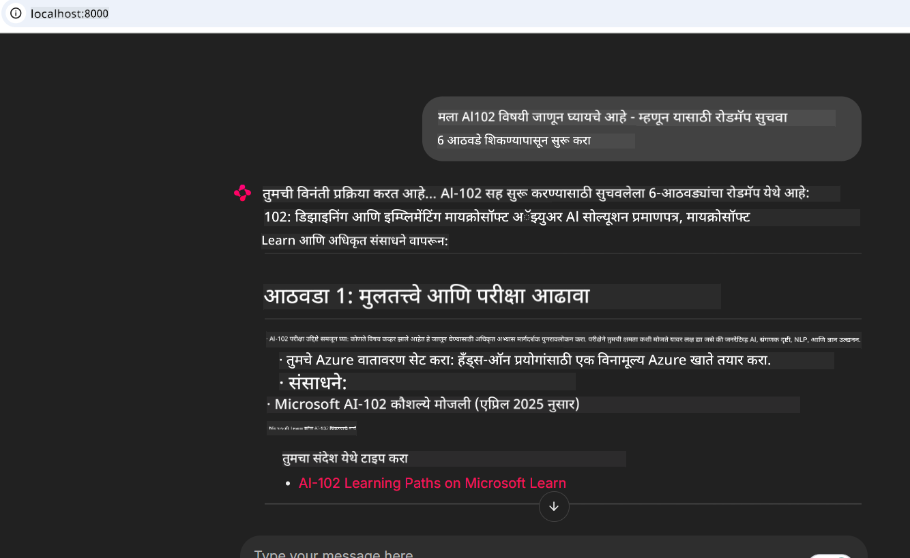

<!--
CO_OP_TRANSLATOR_METADATA:
{
  "original_hash": "4319d291c9d124ecafea52b3d04bfa0e",
  "translation_date": "2025-07-14T06:21:18+00:00",
  "source_file": "09-CaseStudy/docs-mcp/README.md",
  "language_code": "mr"
}
-->
# केस स्टडी: क्लायंटकडून Microsoft Learn Docs MCP सर्व्हरशी कनेक्ट होणे

तुम्ही कधीही डॉक्युमेंटेशन साइट्स, Stack Overflow आणि अनंत सर्च इंजिन टॅब्समध्ये गोंधळलेले आहात का, आणि त्याच वेळी तुमच्या कोडमधील एखादा प्रश्न सोडवण्याचा प्रयत्न करत आहात? कदाचित तुम्ही डॉक्युमेंटेशनसाठी दुसरा मॉनिटर वापरता, किंवा सतत तुमच्या IDE आणि ब्राउझरमध्ये अल्ट-टॅब करता. जर तुम्ही डॉक्युमेंटेशन थेट तुमच्या वर्कफ्लोमध्ये आणू शकलात—तुमच्या अॅप्समध्ये, IDE मध्ये किंवा तुमच्या स्वतःच्या कस्टम टूल्समध्ये एकत्रित—तर ते किती सोयीचे होईल? या केस स्टडीमध्ये, आपण पाहणार आहोत की Microsoft Learn Docs MCP सर्व्हरशी थेट कनेक्ट होऊन हे कसे करता येईल.

## आढावा

आधुनिक विकास म्हणजे फक्त कोड लिहिणे नाही—तर योग्य वेळी योग्य माहिती मिळवणे आहे. डॉक्युमेंटेशन सर्वत्र आहे, पण ते सहसा जिथे सर्वात जास्त गरज असते तिथे नसते: तुमच्या टूल्स आणि वर्कफ्लोमध्ये. डॉक्युमेंटेशन थेट तुमच्या अॅप्लिकेशन्समध्ये एकत्रित करून, तुम्ही वेळ वाचवू शकता, संदर्भ बदलण्याची गरज कमी करू शकता आणि उत्पादकता वाढवू शकता. या विभागात, आपण Microsoft Learn Docs MCP सर्व्हरशी क्लायंट कसे कनेक्ट करायचे ते पाहणार आहोत, ज्यामुळे तुम्हाला तुमच्या अॅपमधून बाहेर न निघता रिअल-टाइम, संदर्भ-आधारित डॉक्युमेंटेशन मिळू शकेल.

आपण कनेक्शन स्थापन करण्याची प्रक्रिया, विनंती पाठविणे आणि स्ट्रीमिंग प्रतिसाद प्रभावीपणे हाताळण्याची पद्धत पाहणार आहोत. हा दृष्टिकोन तुमचा वर्कफ्लो सुलभ करतो आणि अधिक स्मार्ट, उपयुक्त डेव्हलपर टूल्स तयार करण्याचा मार्ग उघडतो.

## शिकण्याचे उद्दिष्ट

हे का करतोय? कारण सर्वोत्तम डेव्हलपर अनुभव म्हणजे ते जे अडथळे दूर करतात. कल्पना करा की तुमचा कोड एडिटर, चॅटबॉट किंवा वेब अॅप Microsoft Learn मधील नवीनतम सामग्री वापरून तुमच्या डॉक्युमेंटेशन प्रश्नांना त्वरित उत्तर देतो. या प्रकरणाच्या शेवटी, तुम्हाला कळेल की:

- डॉक्युमेंटेशनसाठी MCP सर्व्हर-क्लायंट संवादाची मूलतत्त्वे समजून घेणे
- Microsoft Learn Docs MCP सर्व्हरशी कनेक्ट होण्यासाठी कन्सोल किंवा वेब अॅप्लिकेशन तयार करणे
- रिअल-टाइम डॉक्युमेंटेशन मिळवण्यासाठी स्ट्रीमिंग HTTP क्लायंट वापरणे
- तुमच्या अॅप्लिकेशनमध्ये डॉक्युमेंटेशन प्रतिसाद लॉग करणे आणि समजून घेणे

हे कौशल्य तुम्हाला असे टूल्स तयार करण्यात मदत करेल जे केवळ प्रतिसाद देणारे नाहीत, तर खरोखरच संवादात्मक आणि संदर्भ-आधारित असतील.

## परिस्थिती 1 - MCP सह रिअल-टाइम डॉक्युमेंटेशन मिळवणे

या परिस्थितीत, आपण Microsoft Learn Docs MCP सर्व्हरशी क्लायंट कसे कनेक्ट करायचे ते पाहणार आहोत, ज्यामुळे तुम्हाला तुमच्या अॅपमधून बाहेर न निघता रिअल-टाइम, संदर्भ-आधारित डॉक्युमेंटेशन मिळू शकेल.

चला हे प्रत्यक्षात आणूया. तुमचे काम म्हणजे एक अॅप लिहिणे जे Microsoft Learn Docs MCP सर्व्हरशी कनेक्ट होईल, `microsoft_docs_search` टूल कॉल करेल आणि स्ट्रीमिंग प्रतिसाद कन्सोलवर लॉग करेल.

### हा दृष्टिकोन का?
कारण हा अधिक प्रगत एकत्रीकरणासाठी पाया आहे—तुम्हाला चॅटबॉट, IDE विस्तार किंवा वेब डॅशबोर्ड तयार करायचा असो.

या परिस्थितीसाठी कोड आणि सूचना तुम्हाला या केस स्टडीतील [`solution`](./solution/README.md) फोल्डरमध्ये सापडतील. खालील टप्पे कनेक्शन सेटअपमध्ये मार्गदर्शन करतील:
- कनेक्शनसाठी अधिकृत MCP SDK आणि स्ट्रीमिंग HTTP क्लायंट वापरा
- डॉक्युमेंटेशन मिळवण्यासाठी क्वेरी पॅरामीटरसह `microsoft_docs_search` टूल कॉल करा
- योग्य लॉगिंग आणि त्रुटी हाताळणी अंमलात आणा
- वापरकर्त्यांना अनेक शोध क्वेरी टाकण्याची परवानगी देणारा संवादात्मक कन्सोल इंटरफेस तयार करा

ही परिस्थिती दाखवते की:
- Docs MCP सर्व्हरशी कसे कनेक्ट करायचे
- क्वेरी कशी पाठवायची
- निकाल कसे पार्स आणि प्रिंट करायचे

सोल्यूशन चालवताना असे दिसू शकते:

```
Prompt> What is Azure Key Vault?
Answer> Azure Key Vault is a cloud service for securely storing and accessing secrets. ...
```

खाली एक किमान नमुना सोल्यूशन दिले आहे. पूर्ण कोड आणि तपशील सोल्यूशन फोल्डरमध्ये उपलब्ध आहेत.

<details>
<summary>Python</summary>

```python
import asyncio
from mcp.client.streamable_http import streamablehttp_client
from mcp import ClientSession

async def main():
    async with streamablehttp_client("https://learn.microsoft.com/api/mcp") as (read_stream, write_stream, _):
        async with ClientSession(read_stream, write_stream) as session:
            await session.initialize()
            result = await session.call_tool("microsoft_docs_search", {"query": "Azure Functions best practices"})
            print(result.content)

if __name__ == "__main__":
    asyncio.run(main())
```

- पूर्ण अंमलबजावणी आणि लॉगिंगसाठी, [`scenario1.py`](../../../../09-CaseStudy/docs-mcp/solution/python/scenario1.py) पहा.
- स्थापनेची आणि वापराची माहिती [`README.md`](./solution/python/README.md) फाईलमध्ये आहे.
</details>

## परिस्थिती 2 - MCP सह संवादात्मक अभ्यास योजना जनरेटर वेब अॅप

या परिस्थितीत, तुम्ही Docs MCP वेब विकास प्रकल्पात कसे एकत्रित करायचे ते शिकाल. उद्दिष्ट आहे वापरकर्त्यांना Microsoft Learn डॉक्युमेंटेशन थेट वेब इंटरफेसवरून शोधण्याची सुविधा देणे, ज्यामुळे डॉक्युमेंटेशन तुमच्या अॅप किंवा साइटमध्ये त्वरित उपलब्ध होईल.

तुम्ही पाहाल की कसे:
- वेब अॅप सेटअप करायचा
- Docs MCP सर्व्हरशी कनेक्ट करायचे
- वापरकर्त्याचा इनपुट हाताळायचा आणि निकाल दाखवायचे

सोल्यूशन चालवताना असे दिसू शकते:

```
User> I want to learn about AI102 - so suggest the roadmap to get it started from learn for 6 weeks

Assistant> Here’s a detailed 6-week roadmap to start your preparation for the AI-102: Designing and Implementing a Microsoft Azure AI Solution certification, using official Microsoft resources and focusing on exam skills areas:

---
## Week 1: Introduction & Fundamentals
- **Understand the Exam**: Review the [AI-102 exam skills outline](https://learn.microsoft.com/en-us/credentials/certifications/exams/ai-102/).
- **Set up Azure**: Sign up for a free Azure account if you don't have one.
- **Learning Path**: [Introduction to Azure AI services](https://learn.microsoft.com/en-us/training/modules/intro-to-azure-ai/)
- **Focus**: Get familiar with Azure portal, AI capabilities, and necessary tools.

....more weeks of the roadmap...

Let me know if you want module-specific recommendations or need more customized weekly tasks!
```

खाली एक किमान नमुना सोल्यूशन दिले आहे. पूर्ण कोड आणि तपशील सोल्यूशन फोल्डरमध्ये उपलब्ध आहेत.



<details>
<summary>Python (Chainlit)</summary>

Chainlit हे संभाषणात्मक AI वेब अॅप्स तयार करण्यासाठी एक फ्रेमवर्क आहे. हे संवादात्मक चॅटबॉट्स आणि सहाय्यक तयार करणे सोपे करते जे MCP टूल्स कॉल करू शकतात आणि निकाल रिअल-टाइममध्ये दाखवू शकतात. हे जलद प्रोटोटायपिंग आणि वापरकर्ता-अनुकूल इंटरफेससाठी आदर्श आहे.

```python
import chainlit as cl
import requests

MCP_URL = "https://learn.microsoft.com/api/mcp"

@cl.on_message
def handle_message(message):
    query = {"question": message}
    response = requests.post(MCP_URL, json=query)
    if response.ok:
        result = response.json()
        cl.Message(content=result.get("answer", "No answer found.")).send()
    else:
        cl.Message(content="Error: " + response.text).send()
```

- पूर्ण अंमलबजावणीसाठी [`scenario2.py`](../../../../09-CaseStudy/docs-mcp/solution/python/scenario2.py) पहा.
- सेटअप आणि चालवण्याच्या सूचना [`README.md`](./solution/python/README.md) मध्ये आहेत.
</details>

## परिस्थिती 3: VS Code मध्ये MCP सर्व्हरसह इन-एडिटर डॉक्युमेंटेशन

जर तुम्हाला Microsoft Learn Docs थेट VS Code मध्ये मिळवायचे असतील (ब्राउझर टॅब्स बदलण्याऐवजी), तर तुम्ही तुमच्या एडिटरमध्ये MCP सर्व्हर वापरू शकता. यामुळे तुम्हाला:
- VS Code मध्ये कोडिंग करताना बाहेर न निघता डॉक्युमेंटेशन शोधणे आणि वाचणे शक्य होते.
- README किंवा कोर्स फाइल्समध्ये थेट डॉक्युमेंटेशन संदर्भ आणि लिंक समाविष्ट करणे.
- GitHub Copilot आणि MCP एकत्र वापरून एक अखंड, AI-शक्तीशाली डॉक्युमेंटेशन वर्कफ्लो तयार करणे.

**तुम्हाला कसे करायचे ते पाहायला मिळेल:**
- तुमच्या वर्कस्पेस रूटमध्ये वैध `.vscode/mcp.json` फाइल कशी जोडायची (खाली उदाहरण पहा).
- VS Code मध्ये MCP पॅनेल उघडणे किंवा कमांड पॅलेट वापरून डॉक्युमेंटेशन शोधणे आणि समाविष्ट करणे.
- काम करताना तुमच्या मार्कडाउन फाइल्समध्ये थेट डॉक्युमेंटेशन संदर्भ देणे.
- GitHub Copilot सह हा वर्कफ्लो एकत्र करून अधिक उत्पादकता मिळवणे.

VS Code मध्ये MCP सर्व्हर सेटअप करण्याचे उदाहरण:

```json
{
  "servers": {
    "LearnDocsMCP": {
      "url": "https://learn.microsoft.com/api/mcp"
    }
  }
}
```

</details>

> स्क्रीनशॉट्स आणि टप्प्याटप्प्याने मार्गदर्शनासाठी [`README.md`](./solution/scenario3/README.md) पहा.


हा दृष्टिकोन तांत्रिक कोर्स तयार करणाऱ्यांसाठी, डॉक्युमेंटेशन लिहिणाऱ्यांसाठी किंवा वारंवार संदर्भ घेणाऱ्या कोड विकासकांसाठी आदर्श आहे.

## मुख्य मुद्दे

डॉक्युमेंटेशन थेट तुमच्या टूल्समध्ये एकत्रित करणे फक्त सोयीचे नाही—तर उत्पादकतेसाठी एक मोठा बदल आहे. Microsoft Learn Docs MCP सर्व्हरशी तुमच्या क्लायंटकडून कनेक्ट होऊन, तुम्ही:

- कोड आणि डॉक्युमेंटेशनमधील संदर्भ बदलणे टाळू शकता
- रिअल-टाइममध्ये अद्ययावत, संदर्भ-आधारित डॉक्युमेंटेशन मिळवू शकता
- अधिक स्मार्ट, संवादात्मक डेव्हलपर टूल्स तयार करू शकता

हे कौशल्य तुम्हाला असे सोल्यूशन्स तयार करण्यात मदत करेल जे केवळ कार्यक्षम नाहीत, तर वापरण्यास आनंददायकही आहेत.

## अतिरिक्त संसाधने

तुमची समज अधिक खोल करण्यासाठी, हे अधिकृत संसाधने तपासा:

- [Microsoft Learn Docs MCP Server (GitHub)](https://github.com/MicrosoftDocs/mcp)
- [Azure MCP Server सह सुरुवात करा (mcp-python)](https://learn.microsoft.com/en-us/azure/developer/azure-mcp-server/get-started#create-the-python-app)
- [Azure MCP Server म्हणजे काय?](https://learn.microsoft.com/en-us/azure/developer/azure-mcp-server/)
- [Model Context Protocol (MCP) परिचय](https://modelcontextprotocol.io/introduction)
- [MCP Server कडून प्लगइन्स कसे जोडायचे (Python)](https://learn.microsoft.com/en-us/semantic-kernel/concepts/plugins/adding-mcp-plugins)

**अस्वीकरण**:  
हा दस्तऐवज AI अनुवाद सेवा [Co-op Translator](https://github.com/Azure/co-op-translator) वापरून अनुवादित केला आहे. आम्ही अचूकतेसाठी प्रयत्नशील असलो तरी, कृपया लक्षात घ्या की स्वयंचलित अनुवादांमध्ये चुका किंवा अचूकतेची कमतरता असू शकते. मूळ दस्तऐवज त्याच्या स्थानिक भाषेत अधिकृत स्रोत मानला जावा. महत्त्वाच्या माहितीसाठी व्यावसायिक मानवी अनुवाद करण्याची शिफारस केली जाते. या अनुवादाच्या वापरामुळे उद्भवणाऱ्या कोणत्याही गैरसमजुती किंवा चुकीच्या अर्थलागी आम्ही जबाबदार नाही.