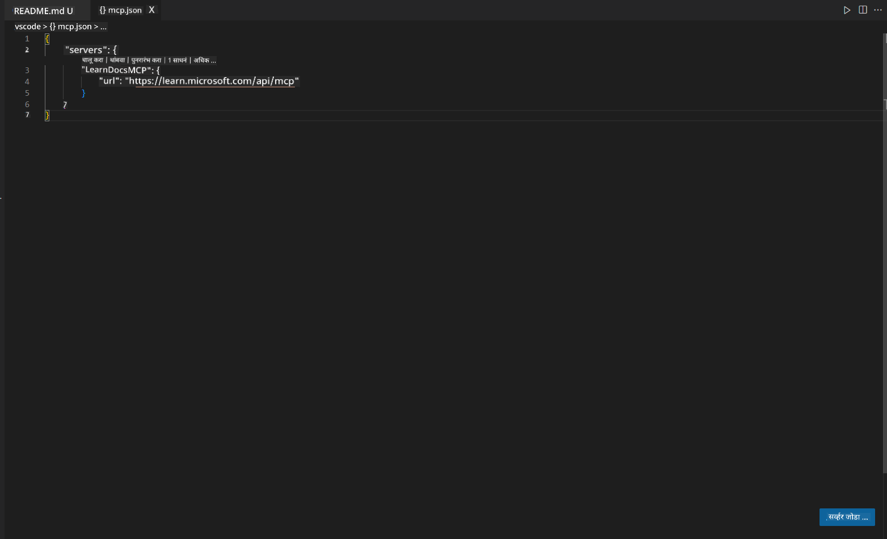
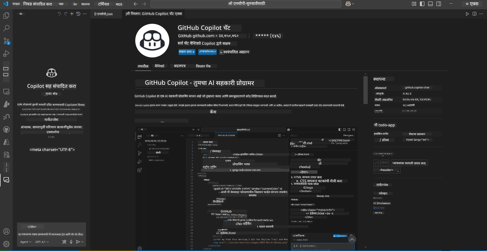
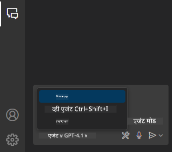
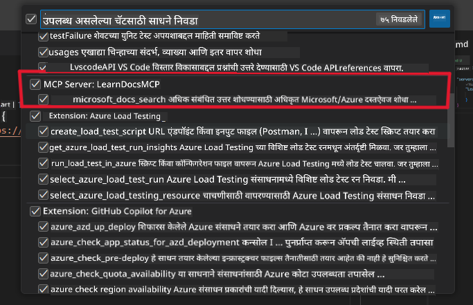
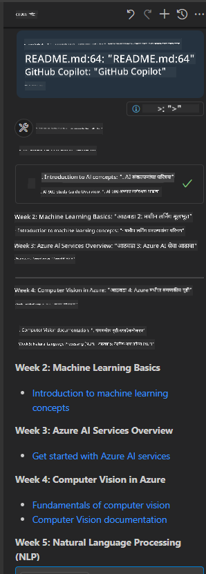
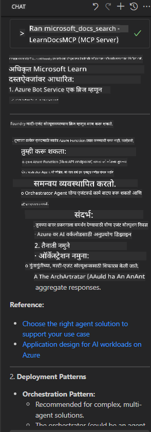

<!--
CO_OP_TRANSLATOR_METADATA:
{
  "original_hash": "db532b1ec386c9ce38c791653dc3c881",
  "translation_date": "2025-07-14T06:49:24+00:00",
  "source_file": "09-CaseStudy/docs-mcp/solution/scenario3/README.md",
  "language_code": "mr"
}
-->
# Scenario 3: VS Code मध्ये MCP Server सह इन-एडिटर डॉक्युमेंटेशन

## आढावा

या परिस्थितीत, तुम्ही Microsoft Learn Docs थेट Visual Studio Code मध्ये MCP server वापरून कसे आणायचे ते शिकाल. सतत ब्राउझर टॅब्स बदलण्याऐवजी, तुम्ही तुमच्या एडिटरमध्येच अधिकृत डॉक्युमेंटेशन शोधू, वाचू आणि संदर्भ देऊ शकता. हा दृष्टिकोन तुमचा कामाचा प्रवाह सुलभ करतो, लक्ष केंद्रित ठेवतो आणि GitHub Copilot सारख्या साधनांसोबत सहज समाकलन सक्षम करतो.

- VS Code मध्येच डॉक्युमेंटेशन शोधा आणि वाचा, कोडिंग वातावरण सोडण्याची गरज नाही.
- README किंवा कोर्स फाइल्समध्ये थेट डॉक्युमेंटेशन संदर्भ आणि लिंक समाविष्ट करा.
- GitHub Copilot आणि MCP एकत्र वापरून AI-शक्तीने चालणारा डॉक्युमेंटेशन प्रवाह अनुभव करा.

## शिकण्याचे उद्दिष्ट

या प्रकरणाच्या शेवटी, तुम्हाला VS Code मध्ये MCP server सेटअप आणि वापर कसा करायचा हे समजेल ज्यामुळे तुमचा डॉक्युमेंटेशन आणि विकास प्रवाह सुधारेल. तुम्ही सक्षम असाल:

- डॉक्युमेंटेशन शोधण्यासाठी MCP server वापरण्यासाठी तुमचे वर्कस्पेस कॉन्फिगर करणे.
- VS Code मधून थेट डॉक्युमेंटेशन शोधणे आणि समाविष्ट करणे.
- GitHub Copilot आणि MCP चा एकत्रित वापर करून अधिक उत्पादक, AI-समृद्ध कार्यप्रवाह तयार करणे.

हे कौशल्य तुम्हाला लक्ष केंद्रित ठेवण्यास, डॉक्युमेंटेशनची गुणवत्ता सुधारण्यास आणि विकसक किंवा तांत्रिक लेखक म्हणून तुमची उत्पादकता वाढवण्यास मदत करतील.

## उपाय

इन-एडिटर डॉक्युमेंटेशन प्रवेश साध्य करण्यासाठी, तुम्ही MCP server, VS Code आणि GitHub Copilot यांचे समाकलन करणाऱ्या काही टप्प्यांचे अनुसरण कराल. हा उपाय कोर्स लेखक, डॉक्युमेंटेशन लेखक आणि विकसकांसाठी आदर्श आहे जे एडिटरमध्येच लक्ष केंद्रित ठेवून डॉक्युमेंटेशन आणि Copilot सह काम करू इच्छितात.

- कोर्स किंवा प्रोजेक्ट डॉक्युमेंटेशन लिहिताना README मध्ये जलद संदर्भ लिंक जोडा.
- Copilot वापरून कोड तयार करा आणि MCP वापरून तत्काळ संबंधित डॉक्युमेंटेशन शोधा आणि उद्धृत करा.
- तुमच्या एडिटरमध्ये लक्ष केंद्रित ठेवा आणि उत्पादकता वाढवा.

### टप्प्याटप्प्याने मार्गदर्शक

सुरू करण्यासाठी, खालील टप्पे फॉलो करा. प्रत्येक टप्प्यासाठी, तुम्ही assets फोल्डरमधून स्क्रीनशॉट जोडू शकता ज्यामुळे प्रक्रिया स्पष्ट होईल.

1. **MCP कॉन्फिगरेशन जोडा:**
   तुमच्या प्रोजेक्टच्या मूळ फोल्डरमध्ये `.vscode/mcp.json` फाइल तयार करा आणि खालील कॉन्फिगरेशन जोडा:
   ```json
   {
     "servers": {
       "LearnDocsMCP": {
         "url": "https://learn.microsoft.com/api/mcp"
       }
     }
   }
   ```
   ही कॉन्फिगरेशन VS Code ला [`Microsoft Learn Docs MCP server`](https://github.com/MicrosoftDocs/mcp) शी कसे कनेक्ट करायचे ते सांगते.
   
   
    
2. **GitHub Copilot Chat पॅनेल उघडा:**
   जर तुमच्याकडे GitHub Copilot एक्सटेंशन आधीपासून नसेल, तर VS Code मधील Extensions दृश्यात जाऊन ते इन्स्टॉल करा. तुम्ही ते थेट [Visual Studio Code Marketplace](https://marketplace.visualstudio.com/items?itemName=GitHub.copilot-chat) वरून डाउनलोड करू शकता. नंतर, साइडबारमधून Copilot Chat पॅनेल उघडा.

   

3. **एजंट मोड सक्षम करा आणि साधने तपासा:**
   Copilot Chat पॅनेलमध्ये एजंट मोड सक्षम करा.

   

   एजंट मोड सक्षम केल्यानंतर, MCP server उपलब्ध साधनांमध्ये आहे का ते तपासा. यामुळे Copilot एजंटला संबंधित माहिती मिळवण्यासाठी डॉक्युमेंटेशन सर्व्हर वापरण्याची परवानगी मिळते.
   
   

4. **नवीन चॅट सुरू करा आणि एजंटला प्रश्न विचारा:**
   Copilot Chat पॅनेलमध्ये नवीन चॅट उघडा. आता तुम्ही तुमचे डॉक्युमेंटेशन प्रश्न एजंटला विचारू शकता. एजंट MCP server वापरून संबंधित Microsoft Learn डॉक्युमेंटेशन थेट तुमच्या एडिटरमध्ये आणेल.

   - *"मी विषय X साठी अभ्यास योजना लिहित आहे. मी ८ आठवडे अभ्यास करणार आहे, प्रत्येक आठवड्यासाठी मला कोणता कंटेंट घ्यावा याचा सल्ला द्या."*

   

5. **लाइव्ह क्वेरी:**

   > Azure AI Foundry Discord मधील [#get-help](https://discord.gg/D6cRhjHWSC) विभागातून एक लाइव्ह क्वेरी घेऊया ([मूळ संदेश पहा](https://discord.com/channels/1113626258182504448/1385498306720829572)):
   
   *"मी Azure AI Foundry वर विकसित केलेल्या AI एजंट्ससह मल्टी-एजंट सोल्यूशन कसे डिप्लॉय करायचे याबाबत उत्तर शोधत आहे. Copilot Studio चॅनेल्ससारखा थेट डिप्लॉयमेंट मार्ग नाही. तर, एंटरप्राइझ वापरकर्त्यांसाठी वेगवेगळ्या मार्गांनी हे डिप्लॉयमेंट कसे करायचे जेणेकरून ते संवाद साधू शकतील आणि काम पूर्ण करू शकतील?
अनेक लेख/ब्लॉग्समध्ये सांगितले आहे की Azure Bot सेवा वापरून हे काम करता येईल जी MS Teams आणि Azure AI Foundry एजंट्स यांच्यात ब्रिज म्हणून काम करेल, पण जर मी Azure bot सेटअप केला जो Azure AI Foundry वरील Orchestrator Agent शी Azure function द्वारे कनेक्ट होतो, तर हे काम होईल का? किंवा मल्टी एजंट सोल्यूशनमधील प्रत्येक AI एजंटसाठी वेगवेगळे Azure function तयार करावे लागतील का जे Bot framework मध्ये ऑर्केस्ट्रेशन करेल? इतर कोणतेही सुचवणूक स्वागतार्ह आहे."*

   

   एजंट संबंधित डॉक्युमेंटेशन लिंक आणि सारांशांसह प्रतिसाद देईल, जे तुम्ही थेट तुमच्या markdown फाइल्समध्ये समाविष्ट करू शकता किंवा कोडमध्ये संदर्भ म्हणून वापरू शकता.

### नमुना क्वेरीज

खाली काही उदाहरणे दिली आहेत जी तुम्ही वापरून पाहू शकता. या क्वेरीजमुळे MCP server आणि Copilot कसे एकत्र काम करून त्वरित, संदर्भानुसार डॉक्युमेंटेशन आणि संदर्भ प्रदान करतात हे समजेल, तेही VS Code सोडल्याशिवाय:

- "Azure Functions triggers कसे वापरायचे ते दाखवा."
- "Azure Key Vault च्या अधिकृत डॉक्युमेंटेशनसाठी लिंक समाविष्ट करा."
- "Azure संसाधने सुरक्षित करण्यासाठी सर्वोत्तम पद्धती कोणत्या आहेत?"
- "Azure AI सेवांसाठी क्विकस्टार्ट शोधा."

या क्वेरीजमुळे MCP server आणि Copilot कसे एकत्र काम करून त्वरित, संदर्भानुसार डॉक्युमेंटेशन आणि संदर्भ प्रदान करतात हे दाखवले जाईल, तेही VS Code सोडल्याशिवाय.

---

**अस्वीकरण**:  
हा दस्तऐवज AI अनुवाद सेवा [Co-op Translator](https://github.com/Azure/co-op-translator) वापरून अनुवादित केला आहे. आम्ही अचूकतेसाठी प्रयत्नशील असलो तरी, कृपया लक्षात घ्या की स्वयंचलित अनुवादांमध्ये चुका किंवा अचूकतेचा अभाव असू शकतो. मूळ दस्तऐवज त्याच्या स्थानिक भाषेत अधिकृत स्रोत मानला जावा. महत्त्वाच्या माहितीसाठी व्यावसायिक मानवी अनुवाद करण्याची शिफारस केली जाते. या अनुवादाच्या वापरामुळे उद्भवलेल्या कोणत्याही गैरसमजुती किंवा चुकीच्या अर्थलागी आम्ही जबाबदार नाही.