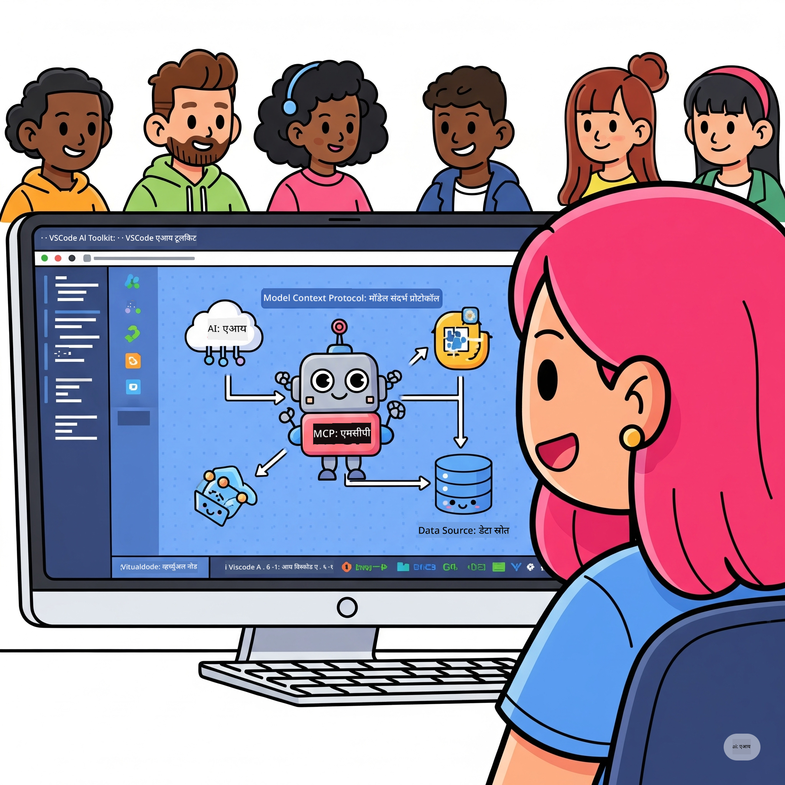

<!--
CO_OP_TRANSLATOR_METADATA:
{
  "original_hash": "1b000fd6e1b04c047578bfc5d07d54eb",
  "translation_date": "2025-08-18T15:51:26+00:00",
  "source_file": "10-StreamliningAIWorkflowsBuildingAnMCPServerWithAIToolkit/README.md",
  "language_code": "mr"
}
-->
# एआय वर्कफ्लो सुलभ करणे: एआय टूलकिटसह MCP सर्व्हर तयार करणे

## 🎯 आढावा

_(वरील प्रतिमेवर क्लिक करून या धड्याचा व्हिडिओ पहा)_

**मॉडेल कॉन्टेक्स्ट प्रोटोकॉल (MCP) कार्यशाळेत** आपले स्वागत आहे! ही सर्वसमावेशक प्रात्यक्षिक कार्यशाळा दोन अत्याधुनिक तंत्रज्ञान एकत्र आणते, जे एआय अनुप्रयोग विकासात क्रांती घडवून आणतात:

- **🔗 मॉडेल कॉन्टेक्स्ट प्रोटोकॉल (MCP)**: एआय-टूल एकत्रीकरणासाठी एक खुला मानक
- **🛠️ व्हिज्युअल स्टुडिओ कोडसाठी एआय टूलकिट (AITK)**: मायक्रोसॉफ्टचा शक्तिशाली एआय विकास विस्तार

### 🎓 आपण काय शिकाल

या कार्यशाळेच्या शेवटी, आपण एआय मॉडेल्सना वास्तविक जगातील साधने आणि सेवांशी जोडणाऱ्या बुद्धिमान अनुप्रयोगांची निर्मिती करण्याची कला आत्मसात कराल. स्वयंचलित चाचण्यांपासून सानुकूल API एकत्रीकरणापर्यंत, आपण जटिल व्यावसायिक आव्हानांवर उपाय शोधण्यासाठी व्यावहारिक कौशल्ये मिळवाल.

## 🏗️ तंत्रज्ञान संच

### 🔌 मॉडेल कॉन्टेक्स्ट प्रोटोकॉल (MCP)

MCP म्हणजे **"एआयसाठी USB-C"** - एक सार्वत्रिक मानक जे एआय मॉडेल्सना बाह्य साधने आणि डेटा स्रोतांशी जोडते.

**✨ मुख्य वैशिष्ट्ये:**

- 🔄 **मानकीकृत एकत्रीकरण**: एआय-टूल कनेक्शनसाठी सार्वत्रिक इंटरफेस
- 🏛️ **लवचिक आर्किटेक्चर**: स्थानिक आणि रिमोट सर्व्हर stdio/SSE ट्रान्सपोर्टद्वारे
- 🧰 **समृद्ध इकोसिस्टम**: एकाच प्रोटोकॉलमध्ये साधने, प्रॉम्प्ट्स आणि संसाधने
- 🔒 **एंटरप्राइझ-रेडी**: अंगभूत सुरक्षा आणि विश्वासार्हता

**🎯 MCP का महत्त्वाचे आहे:**
जसे USB-C ने केबल गोंधळ संपवला, तसे MCP एआय एकत्रीकरणातील गुंतागुंत संपवते. एक प्रोटोकॉल, अमर्याद शक्यता.

### 🤖 व्हिज्युअल स्टुडिओ कोडसाठी एआय टूलकिट (AITK)

मायक्रोसॉफ्टचा प्रमुख एआय विकास विस्तार जो VS कोडला एआय पॉवरहाऊसमध्ये रूपांतरित करतो.

**🚀 मुख्य क्षमता:**

- 📦 **मॉडेल कॅटलॉग**: Azure AI, GitHub, Hugging Face, Ollama मधील मॉडेल्समध्ये प्रवेश
- ⚡ **स्थानिक अनुमान**: ONNX-ऑप्टिमाइझ्ड CPU/GPU/NPU कार्यक्षमता
- 🏗️ **एजंट बिल्डर**: MCP एकत्रीकरणासह दृश्यात्मक एआय एजंट विकास
- 🎭 **मल्टी-मोडल**: मजकूर, व्हिजन आणि संरचित आउटपुट समर्थन

**💡 विकास फायदे:**

- झिरो-कॉन्फिगरेशन मॉडेल डिप्लॉयमेंट
- दृश्यात्मक प्रॉम्प्ट इंजिनिअरिंग
- रिअल-टाइम चाचणी प्लेग्राउंड
- सहज MCP सर्व्हर एकत्रीकरण

## 📚 शिकण्याचा प्रवास

### [🚀 मॉड्यूल 1: एआय टूलकिट मूलतत्त्वे](./lab1/README.md)

**कालावधी**: 15 मिनिटे

- 🛠️ व्हिज्युअल स्टुडिओ कोडसाठी एआय टूलकिट स्थापित करा आणि कॉन्फिगर करा
- 🗂️ मॉडेल कॅटलॉग एक्सप्लोर करा (GitHub, ONNX, OpenAI, Anthropic, Google मधील 100+ मॉडेल्स)
- 🎮 रिअल-टाइम मॉडेल चाचणीसाठी इंटरएक्टिव्ह प्लेग्राउंड मास्टर करा
- 🤖 एजंट बिल्डरसह आपला पहिला एआय एजंट तयार करा
- 📊 अंगभूत मेट्रिक्ससह मॉडेल कार्यक्षमता मूल्यांकन करा (F1, प्रासंगिकता, समानता, सुसंगतता)
- ⚡ बॅच प्रोसेसिंग आणि मल्टी-मोडल समर्थन क्षमता शिका

**🎯 शिकण्याचा परिणाम**: AITK क्षमतांची सखोल समज असलेला कार्यक्षम एआय एजंट तयार करा

### [🌐 मॉड्यूल 2: MCP सह एआय टूलकिट मूलतत्त्वे](./lab2/README.md)

**कालावधी**: 20 मिनिटे

- 🧠 मॉडेल कॉन्टेक्स्ट प्रोटोकॉल (MCP) आर्किटेक्चर आणि संकल्पना आत्मसात करा
- 🌐 मायक्रोसॉफ्टच्या MCP सर्व्हर इकोसिस्टमचा अभ्यास करा
- 🤖 Playwright MCP सर्व्हर वापरून ब्राउझर ऑटोमेशन एजंट तयार करा
- 🔧 MCP सर्व्हर्सना एआय टूलकिट एजंट बिल्डरसह एकत्रित करा
- 📊 आपल्या एजंट्समध्ये MCP साधने कॉन्फिगर करा आणि चाचणी करा
- 🚀 MCP-सक्षम एजंट्स उत्पादनासाठी निर्यात करा आणि तैनात करा

**🎯 शिकण्याचा परिणाम**: बाह्य साधनांनी सुपरचार्ज केलेला एआय एजंट तैनात करा

### [🔧 मॉड्यूल 3: एआय टूलकिटसह प्रगत MCP विकास](./lab3/README.md)

**कालावधी**: 20 मिनिटे

- 💻 एआय टूलकिट वापरून सानुकूल MCP सर्व्हर तयार करा
- 🐍 नवीनतम MCP Python SDK (v1.9.3) कॉन्फिगर करा आणि वापरा
- 🔍 डीबगिंगसाठी MCP इंस्पेक्टर सेटअप करा आणि वापरा
- 🛠️ व्यावसायिक डीबगिंग वर्कफ्लोसह वेदर MCP सर्व्हर तयार करा
- 🧪 एजंट बिल्डर आणि इंस्पेक्टर वातावरणात MCP सर्व्हर्स डीबग करा

**🎯 शिकण्याचा परिणाम**: आधुनिक साधनांसह सानुकूल MCP सर्व्हर्स विकसित करा आणि डीबग करा

### [🐙 मॉड्यूल 4: व्यावहारिक MCP विकास - सानुकूल GitHub क्लोन सर्व्हर](./lab4/README.md)

**कालावधी**: 30 मिनिटे

- 🏗️ विकास वर्कफ्लोसाठी वास्तविक-जगातील GitHub क्लोन MCP सर्व्हर तयार करा
- 🔄 सत्यापन आणि त्रुटी हाताळणीसह स्मार्ट रिपॉझिटरी क्लोनिंग अंमलात आणा
- 📁 बुद्धिमान डिरेक्टरी व्यवस्थापन आणि VS कोड एकत्रीकरण तयार करा
- 🤖 GitHub Copilot एजंट मोड सानुकूल MCP साधनांसह वापरा
- 🛡️ उत्पादन-तयार विश्वासार्हता आणि क्रॉस-प्लॅटफॉर्म सुसंगतता लागू करा

**🎯 शिकण्याचा परिणाम**: विकास वर्कफ्लो सुलभ करणारा उत्पादन-तयार MCP सर्व्हर तैनात करा

## 💡 वास्तविक-जगातील अनुप्रयोग आणि प्रभाव

### 🏢 एंटरप्राइझ वापर प्रकरणे

#### 🔄 DevOps ऑटोमेशन

आपल्या विकास वर्कफ्लोला बुद्धिमान ऑटोमेशनसह रूपांतरित करा:

- **स्मार्ट रिपॉझिटरी व्यवस्थापन**: एआय-चालित कोड पुनरावलोकन आणि मर्ज निर्णय
- **बुद्धिमान CI/CD**: कोड बदलांवर आधारित स्वयंचलित पाइपलाइन ऑप्टिमायझेशन
- **इश्यू ट्रायज**: स्वयंचलित बग वर्गीकरण आणि असाइनमेंट

#### 🧪 गुणवत्ता हमी क्रांती

एआय-सक्षम ऑटोमेशनसह चाचणी उंचावणे:

- **बुद्धिमान चाचणी निर्मिती**: स्वयंचलितपणे सर्वसमावेशक चाचणी संच तयार करा
- **व्हिज्युअल रिग्रेशन चाचणी**: UI बदलांसाठी एआय-चालित शोध
- **कामगिरी निरीक्षण**: सक्रिय समस्या ओळख आणि निराकरण

#### 📊 डेटा पाइपलाइन बुद्धिमत्ता

स्मार्ट डेटा प्रक्रिया वर्कफ्लो तयार करा:

- **अडॅप्टिव्ह ETL प्रक्रिया**: स्वयंचलित डेटा रूपांतरणे
- **अनोमली डिटेक्शन**: रिअल-टाइम डेटा गुणवत्ता निरीक्षण
- **बुद्धिमान रूटिंग**: स्मार्ट डेटा फ्लो व्यवस्थापन

#### 🎧 ग्राहक अनुभव सुधारणा

अपवादात्मक ग्राहक संवाद तयार करा:

- **संदर्भ-जाणकार समर्थन**: ग्राहक इतिहासासह प्रवेश असलेले एआय एजंट्स
- **सक्रिय समस्या निराकरण**: प्रेडिक्टिव्ह ग्राहक सेवा
- **मल्टी-चॅनेल एकत्रीकरण**: प्लॅटफॉर्मवर एकसंध एआय अनुभव

## 🛠️ पूर्वअट आणि सेटअप

### 💻 प्रणाली आवश्यकता

| घटक | आवश्यकता | टिप्पण्या |
|-----------|-------------|-------|
| **ऑपरेटिंग सिस्टम** | Windows 10+, macOS 10.15+, Linux | कोणतेही आधुनिक OS |
| **व्हिज्युअल स्टुडिओ कोड** | नवीनतम स्थिर आवृत्ती | AITK साठी आवश्यक |
| **Node.js** | v18.0+ आणि npm | MCP सर्व्हर विकासासाठी |
| **Python** | 3.10+ | वैकल्पिक, Python MCP सर्व्हर्ससाठी |
| **मेमरी** | किमान 8GB RAM | स्थानिक मॉडेल्ससाठी 16GB शिफारस केलेले |

### 🔧 विकास वातावरण

#### शिफारस केलेले VS कोड विस्तार

- **AI Toolkit** (ms-windows-ai-studio.windows-ai-studio)
- **Python** (ms-python.python)
- **Python Debugger** (ms-python.debugpy)
- **GitHub Copilot** (GitHub.copilot) - वैकल्पिक पण उपयुक्त

#### वैकल्पिक साधने

- **uv**: आधुनिक Python पॅकेज व्यवस्थापक
- **MCP Inspector**: MCP सर्व्हर्ससाठी दृश्यात्मक डीबगिंग साधन
- **Playwright**: वेब ऑटोमेशन उदाहरणांसाठी

## 🎖️ शिकण्याचे परिणाम आणि प्रमाणपत्र मार्ग

### 🏆 कौशल्य प्रावीण्य चेकलिस्ट

ही कार्यशाळा पूर्ण करून, आपण खालील गोष्टींमध्ये प्रावीण्य मिळवाल:

#### 🎯 मुख्य क्षमता

- [ ] **MCP प्रोटोकॉल प्रावीण्य**: आर्किटेक्चर आणि अंमलबजावणी पॅटर्नची सखोल समज
- [ ] **AITK प्रवीणता**: जलद विकासासाठी एआय टूलकिटचा तज्ज्ञ-स्तरीय वापर
- [ ] **सानुकूल सर्व्हर विकास**: उत्पादन MCP सर्व्हर्स तयार करणे, तैनात करणे आणि देखभाल करणे
- [ ] **साधन एकत्रीकरण उत्कृष्टता**: विद्यमान विकास वर्कफ्लोशी एआय सहजपणे कनेक्ट करणे
- [ ] **समस्या सोडवण्याचा अनुप्रयोग**: शिकलेल्या कौशल्यांचा वास्तविक व्यावसायिक आव्हानांवर उपयोग

#### 🔧 तांत्रिक कौशल्ये

- [ ] VS कोडमध्ये एआय टूलकिट सेट अप करा आणि कॉन्फिगर करा
- [ ] सानुकूल MCP सर्व्हर्स डिझाइन करा आणि अंमलात आणा
- [ ] GitHub मॉडेल्सना MCP आर्किटेक्चरशी एकत्रित करा
- [ ] Playwright सह स्वयंचलित चाचणी वर्कफ्लो तयार करा
- [ ] उत्पादनासाठी एआय एजंट्स तैनात करा
- [ ] MCP सर्व्हर कार्यक्षमता डीबग करा आणि ऑप्टिमाइझ करा

#### 🚀 प्रगत क्षमता

- [ ] एंटरप्राइझ-स्केल एआय एकत्रीकरणांचे आर्किटेक्चर तयार करा
- [ ] एआय अनुप्रयोगांसाठी सुरक्षा सर्वोत्तम पद्धती अंमलात आणा
- [ ] स्केलेबल MCP सर्व्हर आर्किटेक्चर डिझाइन करा
- [ ] विशिष्ट डोमेनसाठी सानुकूल टूल चेन तयार करा
- [ ] इतरांना एआय-नेटिव्ह विकासात मार्गदर्शन करा

## 📖 अतिरिक्त संसाधने

- [MCP Specification](https://modelcontextprotocol.io/docs)
- [AI Toolkit GitHub Repository](https://github.com/microsoft/vscode-ai-toolkit)
- [Sample MCP Servers Collection](https://github.com/modelcontextprotocol/servers)
- [Best Practices Guide](https://modelcontextprotocol.io/docs/best-practices)

---

**🚀 आपला एआय विकास वर्कफ्लो क्रांतिकारी बनवण्यासाठी तयार आहात?**

चला, MCP आणि एआय टूलकिटसह बुद्धिमान अनुप्रयोगांचे भविष्य एकत्र तयार करूया!

**अस्वीकरण**:  
हा दस्तऐवज AI भाषांतर सेवा [Co-op Translator](https://github.com/Azure/co-op-translator) वापरून भाषांतरित करण्यात आला आहे. आम्ही अचूकतेसाठी प्रयत्नशील असलो तरी कृपया लक्षात ठेवा की स्वयंचलित भाषांतरांमध्ये त्रुटी किंवा अचूकतेचा अभाव असू शकतो. मूळ भाषेतील दस्तऐवज हा अधिकृत स्रोत मानला जावा. महत्त्वाच्या माहितीसाठी व्यावसायिक मानवी भाषांतराची शिफारस केली जाते. या भाषांतराचा वापर करून उद्भवलेल्या कोणत्याही गैरसमज किंवा चुकीच्या अर्थासाठी आम्ही जबाबदार राहणार नाही.