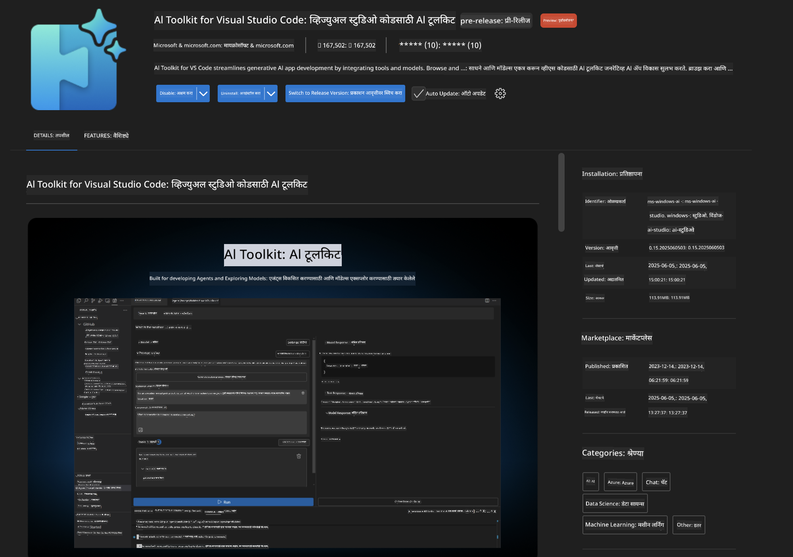
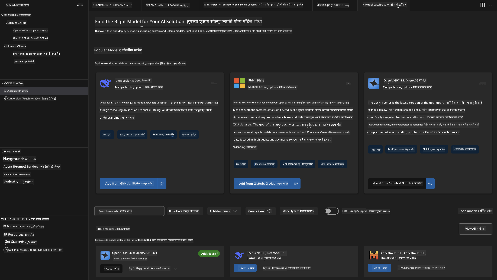
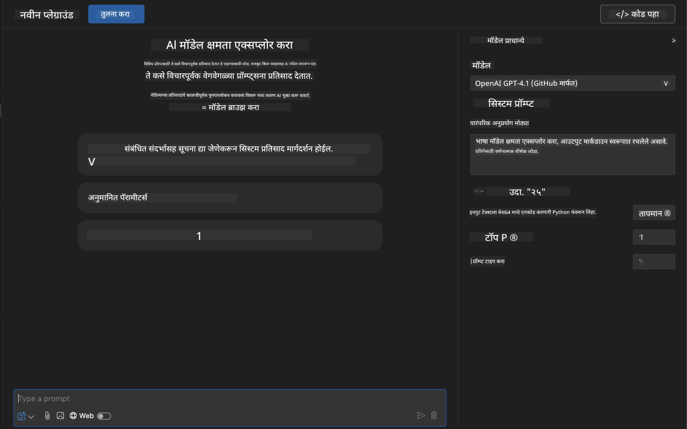
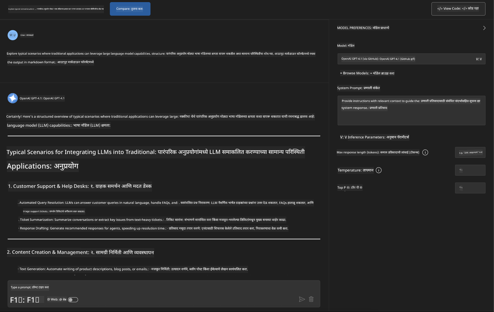
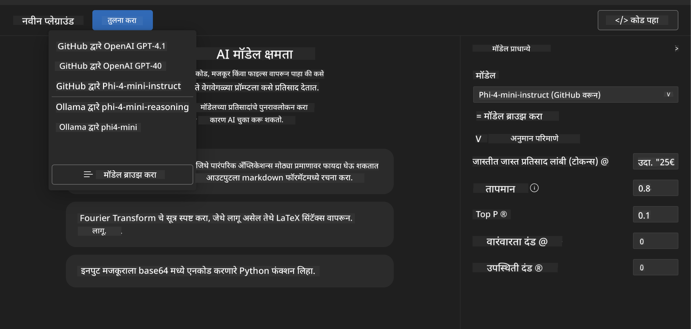
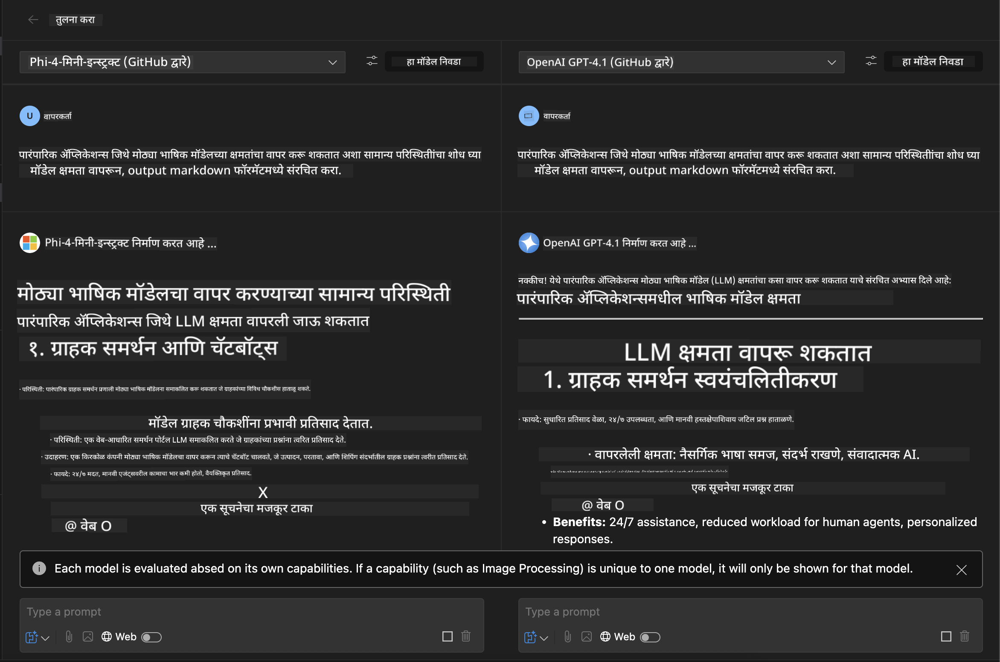
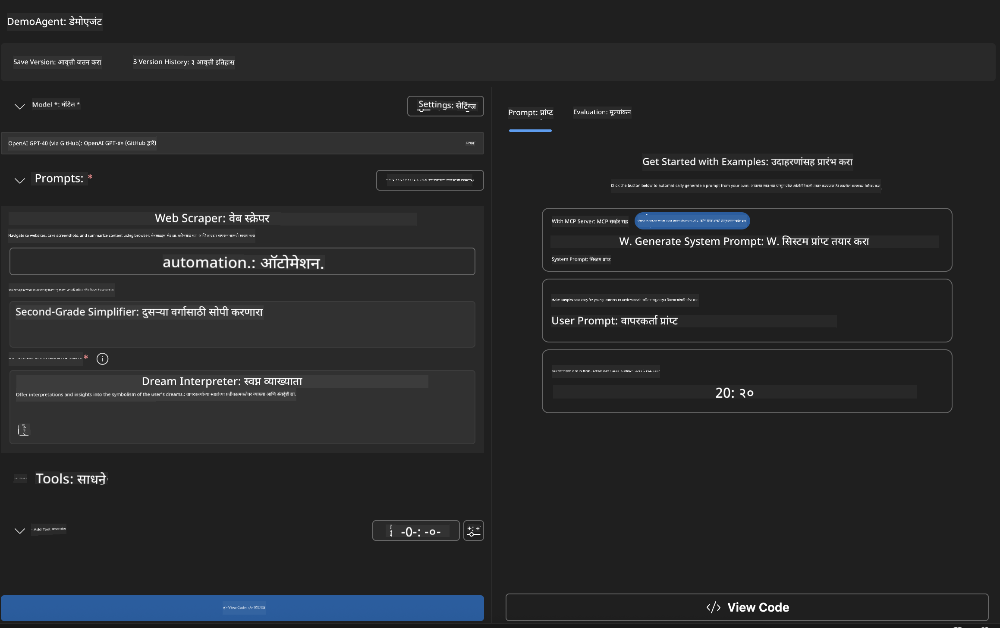
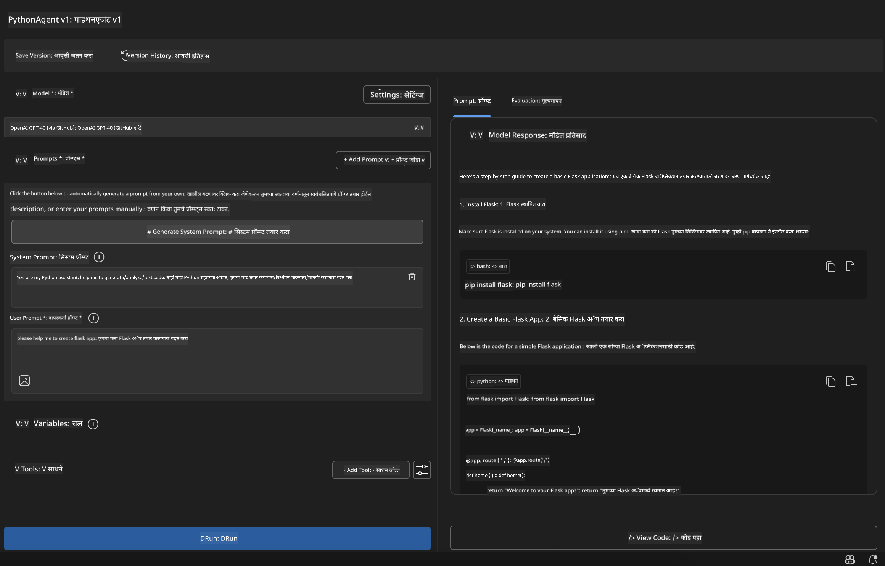

<!--
CO_OP_TRANSLATOR_METADATA:
{
  "original_hash": "2aa9dbc165e104764fa57e8a0d3f1c73",
  "translation_date": "2025-07-14T07:23:39+00:00",
  "source_file": "10-StreamliningAIWorkflowsBuildingAnMCPServerWithAIToolkit/lab1/README.md",
  "language_code": "mr"
}
-->
# 🚀 Module 1: AI Toolkit मूलतत्त्वे

[]()
[]()
[]()

## 📋 शिकण्याचे उद्दिष्टे

या मॉड्यूलच्या शेवटी, तुम्ही सक्षम असाल:
- ✅ Visual Studio Code साठी AI Toolkit इन्स्टॉल आणि कॉन्फिगर करणे
- ✅ Model Catalog मध्ये नेव्हिगेट करणे आणि वेगवेगळ्या मॉडेल स्रोत समजून घेणे
- ✅ Playground वापरून मॉडेल चाचणी आणि प्रयोग करणे
- ✅ Agent Builder वापरून कस्टम AI एजंट तयार करणे
- ✅ वेगवेगळ्या प्रदात्यांमधील मॉडेल कामगिरीची तुलना करणे
- ✅ प्रॉम्प्ट इंजिनिअरिंगसाठी सर्वोत्तम पद्धती लागू करणे

## 🧠 AI Toolkit (AITK) परिचय

**AI Toolkit for Visual Studio Code** हा Microsoft चा प्रमुख विस्तार आहे जो VS Code ला एक संपूर्ण AI विकास वातावरणात रूपांतरित करतो. हा AI संशोधन आणि व्यावहारिक अनुप्रयोग विकास यामधील अंतर कमी करतो, ज्यामुळे जनरेटिव्ह AI सर्व कौशल्य पातळ्यांवरील विकासकांसाठी सुलभ होते.

### 🌟 मुख्य क्षमता

| वैशिष्ट्य | वर्णन | वापर प्रकरण |
|---------|-------------|----------|
| **🗂️ Model Catalog** | GitHub, ONNX, OpenAI, Anthropic, Google यांच्याकडून 100+ मॉडेल्स उपलब्ध | मॉडेल शोध आणि निवड |
| **🔌 BYOM Support** | तुमची स्वतःची मॉडेल्स (स्थानिक/दूरस्थ) एकत्रित करा | कस्टम मॉडेल तैनाती |
| **🎮 Interactive Playground** | चॅट इंटरफेससह रिअल-टाइम मॉडेल चाचणी | जलद प्रोटोटायपिंग आणि चाचणी |
| **📎 Multi-Modal Support** | मजकूर, प्रतिमा आणि संलग्नक हाताळा | जटिल AI अनुप्रयोग |
| **⚡ Batch Processing** | एकाच वेळी अनेक प्रॉम्प्ट चालवा | कार्यक्षम चाचणी कार्यप्रवाह |
| **📊 Model Evaluation** | अंगभूत मेट्रिक्स (F1, सापेक्षता, साम्य, सुसंगतता) | कामगिरीचे मूल्यांकन |

### 🎯 AI Toolkit का महत्त्वाचा आहे

- **🚀 वेगवान विकास**: कल्पनेपासून प्रोटोटाइपपर्यंत काही मिनिटांत
- **🔄 एकसंध कार्यप्रवाह**: अनेक AI प्रदात्यांसाठी एकाच इंटरफेस
- **🧪 सोपी प्रयोगशाळा**: क्लिष्ट सेटअपशिवाय मॉडेल्सची तुलना करा
- **📈 उत्पादनासाठी तयार**: प्रोटोटाइपपासून तैनातीपर्यंत सहज संक्रमण

## 🛠️ पूर्वअट आणि सेटअप

### 📦 AI Toolkit विस्तार इन्स्टॉल करा

**पायरी 1: Extensions Marketplace मध्ये प्रवेश करा**
1. Visual Studio Code उघडा
2. Extensions दृश्यावर जा (`Ctrl+Shift+X` किंवा `Cmd+Shift+X`)
3. "AI Toolkit" शोधा

**पायरी 2: तुमची आवृत्ती निवडा**
- **🟢 Release**: उत्पादनासाठी शिफारस केलेली आवृत्ती
- **🔶 Pre-release**: नवीनतम वैशिष्ट्यांसाठी लवकर प्रवेश

**पायरी 3: इन्स्टॉल आणि सक्रिय करा**



### ✅ पडताळणी यादी
- [ ] AI Toolkit आयकॉन VS Code साइडबारमध्ये दिसतो का
- [ ] विस्तार सक्षम आणि सक्रिय आहे का
- [ ] आउटपुट पॅनेलमध्ये कोणतीही इन्स्टॉलेशन त्रुटी नाहीत का

## 🧪 हाताळणी व्यायाम 1: GitHub मॉडेल्सचा अभ्यास

**🎯 उद्दिष्ट**: Model Catalog मध्ये पारंगत व्हा आणि तुमचा पहिला AI मॉडेल चाचणी करा

### 📊 पायरी 1: Model Catalog मध्ये नेव्हिगेट करा

Model Catalog हा AI परिसंस्थेचा प्रवेशद्वार आहे. तो अनेक प्रदात्यांकडून मॉडेल्स एकत्र करतो, ज्यामुळे शोधणे आणि तुलना करणे सोपे होते.

**🔍 नेव्हिगेशन मार्गदर्शक:**

AI Toolkit साइडबारमध्ये **MODELS - Catalog** वर क्लिक करा



**💡 प्रो टिप**: तुमच्या वापर प्रकरणाशी जुळणाऱ्या विशिष्ट क्षमतांसह मॉडेल्स शोधा (उदा. कोड जनरेशन, सर्जनशील लेखन, विश्लेषण).

**⚠️ लक्षात ठेवा**: GitHub-होस्ट केलेले मॉडेल्स (म्हणजे GitHub Models) वापरण्यास मोफत आहेत पण विनंत्या आणि टोकन्सवर मर्यादा लागू होतात. जर तुम्हाला GitHub व्यतिरिक्त मॉडेल्स (उदा. Azure AI किंवा इतर एंडपॉइंट्सवर होस्ट केलेले) वापरायचे असतील, तर तुम्हाला योग्य API की किंवा प्रमाणीकरण पुरवावे लागेल.

### 🚀 पायरी 2: तुमचा पहिला मॉडेल जोडा आणि कॉन्फिगर करा

**मॉडेल निवड धोरण:**
- **GPT-4.1**: जटिल विचार आणि विश्लेषणासाठी सर्वोत्तम
- **Phi-4-mini**: हलके, सोप्या कामांसाठी जलद प्रतिसाद

**🔧 कॉन्फिगरेशन प्रक्रिया:**
1. Catalog मधून **OpenAI GPT-4.1** निवडा
2. **Add to My Models** वर क्लिक करा - यामुळे मॉडेल वापरासाठी नोंदणी होईल
3. **Try in Playground** निवडा जेणेकरून चाचणी वातावरण सुरू होईल
4. मॉडेल सुरू होण्याची वाट पहा (पहिल्यांदा सेटअप थोडा वेळ घेऊ शकतो)



**⚙️ मॉडेल पॅरामीटर्स समजून घ्या:**
- **Temperature**: सर्जनशीलता नियंत्रित करते (0 = निश्चित, 1 = सर्जनशील)
- **Max Tokens**: जास्तीत जास्त प्रतिसाद लांबी
- **Top-p**: प्रतिसाद वैविध्यतेसाठी न्यूक्लियस सॅम्पलिंग

### 🎯 पायरी 3: Playground इंटरफेसमध्ये पारंगत व्हा

Playground हा तुमचा AI प्रयोगशाळा आहे. त्याचा जास्तीत जास्त फायदा कसा घ्यायचा ते येथे आहे:

**🎨 प्रॉम्प्ट इंजिनिअरिंग सर्वोत्तम पद्धती:**
1. **स्पष्ट रहा**: स्पष्ट, तपशीलवार सूचना चांगले निकाल देतात
2. **संदर्भ द्या**: संबंधित पार्श्वभूमी माहिती द्या
3. **उदाहरणे वापरा**: मॉडेलला काय हवे ते उदाहरणांनी दाखवा
4. **पुनरावृत्ती करा**: सुरुवातीच्या निकालांनुसार प्रॉम्प्ट सुधारित करा

**🧪 चाचणी परिस्थिती:**
```markdown
# Example 1: Code Generation
"Write a Python function that calculates the factorial of a number using recursion. Include error handling and docstrings."

# Example 2: Creative Writing
"Write a professional email to a client explaining a project delay, maintaining a positive tone while being transparent about challenges."

# Example 3: Data Analysis
"Analyze this sales data and provide insights: [paste your data]. Focus on trends, anomalies, and actionable recommendations."
```



### 🏆 आव्हानात्मक व्यायाम: मॉडेल कामगिरीची तुलना

**🎯 उद्दिष्ट**: समान प्रॉम्प्ट वापरून वेगवेगळ्या मॉडेल्सची ताकद समजून घ्या

**📋 सूचना:**
1. तुमच्या वर्कस्पेसमध्ये **Phi-4-mini** जोडा
2. GPT-4.1 आणि Phi-4-mini दोन्हींसाठी समान प्रॉम्प्ट वापरा



3. प्रतिसादाची गुणवत्ता, गती आणि अचूकता यांची तुलना करा
4. निकाल विभागात तुमची नोंद करा



**💡 शोधण्यासाठी महत्त्वाचे मुद्दे:**
- LLM आणि SLM कधी वापरायचे
- खर्च विरुद्ध कामगिरीचे संतुलन
- वेगवेगळ्या मॉडेल्सच्या विशेष क्षमता

## 🤖 हाताळणी व्यायाम 2: Agent Builder वापरून कस्टम एजंट तयार करणे

**🎯 उद्दिष्ट**: विशिष्ट कामे आणि कार्यप्रवाहांसाठी खास AI एजंट तयार करा

### 🏗️ पायरी 1: Agent Builder समजून घ्या

Agent Builder हा AI Toolkit चा खरा ठसा आहे. यामुळे तुम्ही मोठ्या भाषा मॉडेल्सच्या सामर्थ्यासह कस्टम सूचना, विशिष्ट पॅरामीटर्स आणि विशेष ज्ञान असलेले उद्दिष्ट-निर्मित AI सहाय्यक तयार करू शकता.

**🧠 Agent आर्किटेक्चर घटक:**
- **Core Model**: मूलभूत LLM (GPT-4, Groks, Phi, इ.)
- **System Prompt**: एजंटची व्यक्तिमत्व आणि वर्तन ठरवते
- **Parameters**: सर्वोत्तम कामगिरीसाठी सूक्ष्म समायोजन
- **Tools Integration**: बाह्य API आणि MCP सेवा जोडणे
- **Memory**: संभाषण संदर्भ आणि सत्र टिकवून ठेवणे



### ⚙️ पायरी 2: Agent कॉन्फिगरेशन सखोल अभ्यास

**🎨 प्रभावी System Prompts तयार करणे:**
```markdown
# Template Structure:
## Role Definition
You are a [specific role] with expertise in [domain].

## Capabilities
- List specific abilities
- Define scope of knowledge
- Clarify limitations

## Behavior Guidelines
- Response style (formal, casual, technical)
- Output format preferences
- Error handling approach

## Examples
Provide 2-3 examples of ideal interactions
```

*तुम्ही Generate System Prompt वापरून AI च्या मदतीने प्रॉम्प्ट तयार आणि सुधारित करू शकता*

**🔧 पॅरामीटर ऑप्टिमायझेशन:**
| पॅरामीटर | शिफारस केलेली श्रेणी | वापर प्रकरण |
|-----------|------------------|----------|
| **Temperature** | 0.1-0.3 | तांत्रिक/तथ्यात्मक प्रतिसादांसाठी |
| **Temperature** | 0.7-0.9 | सर्जनशील/ब्रेनस्टॉर्मिंग कामांसाठी |
| **Max Tokens** | 500-1000 | संक्षिप्त प्रतिसादांसाठी |
| **Max Tokens** | 2000-4000 | सविस्तर स्पष्टीकरणांसाठी |

### 🐍 पायरी 3: व्यावहारिक व्यायाम - Python प्रोग्रामिंग एजंट

**🎯 मिशन**: खास Python कोडिंग सहाय्यक तयार करा

**📋 कॉन्फिगरेशन पायऱ्या:**

1. **मॉडेल निवड**: **Claude 3.5 Sonnet** निवडा (कोडसाठी उत्कृष्ट)

2. **System Prompt डिझाइन**:
```markdown
# Python Programming Expert Agent

## Role
You are a senior Python developer with 10+ years of experience. You excel at writing clean, efficient, and well-documented Python code.

## Capabilities
- Write production-ready Python code
- Debug complex issues
- Explain code concepts clearly
- Suggest best practices and optimizations
- Provide complete working examples

## Response Format
- Always include docstrings
- Add inline comments for complex logic
- Suggest testing approaches
- Mention relevant libraries when applicable

## Code Quality Standards
- Follow PEP 8 style guidelines
- Use type hints where appropriate
- Handle exceptions gracefully
- Write readable, maintainable code
```

3. **पॅरामीटर कॉन्फिगरेशन**:
   - Temperature: 0.2 (सुसंगत, विश्वासार्ह कोडसाठी)
   - Max Tokens: 2000 (सविस्तर स्पष्टीकरणांसाठी)
   - Top-p: 0.9 (संतुलित सर्जनशीलता)



### 🧪 पायरी 4: तुमचा Python एजंट चाचणी करा

**चाचणी परिस्थिती:**
1. **मूलभूत फंक्शन**: "प्राइम नंबर शोधण्यासाठी फंक्शन तयार करा"
2. **जटिल अल्गोरिदम**: "इन्सर्ट, डिलीट आणि सर्च मेथडसह बायनरी सर्च ट्री अंमलात आणा"
3. **खऱ्या जगातील समस्या**: "रेट लिमिटिंग आणि पुनर्प्रयत्न हाताळणारा वेब स्क्रॅपर तयार करा"
4. **डिबगिंग**: "हा कोड दुरुस्त करा [बग असलेला कोड पेस्ट करा]"

**🏆 यश निकष:**
- ✅ कोड त्रुटीशिवाय चालतो
- ✅ योग्य दस्तऐवजीकरण समाविष्ट आहे
- ✅ Python सर्वोत्तम पद्धतींचे पालन करते
- ✅ स्पष्ट स्पष्टीकरणे देते
- ✅ सुधारणा सुचवते

## 🎓 Module 1 सारांश आणि पुढील पावले

### 📊 ज्ञान तपासणी

तुमची समज तपासा:
- [ ] तुम्ही Catalog मधील मॉडेल्समधील फरक समजावून सांगू शकता का?
- [ ] तुम्ही यशस्वीपणे कस्टम एजंट तयार आणि चाचणी केली आहे का?
- [ ] तुम्हाला वेगवेगळ्या वापर प्रकरणांसाठी पॅरामीटर्स कसे ऑप्टिमाइझ करायचे हे समजते का?
- [ ] तुम्ही प्रभावी System Prompts डिझाइन करू शकता का?

### 📚 अतिरिक्त संसाधने

- **AI Toolkit Documentation**: [Official Microsoft Docs](https://github.com/microsoft/vscode-ai-toolkit)
- **Prompt Engineering Guide**: [Best Practices](https://platform.openai.com/docs/guides/prompt-engineering)
- **Models in AI Toolkit**: [Models in Develpment](https://github.com/microsoft/vscode-ai-toolkit/blob/main/doc/models.md)

**🎉 अभिनंदन!** तुम्ही AI Toolkit चे मूलतत्त्वे आत्मसात केली आहेत आणि अधिक प्रगत AI अनुप्रयोग तयार करण्यास तयार आहात!

### 🔜 पुढील मॉड्यूलकडे पुढे जा

अधिक प्रगत क्षमता शिकण्यासाठी तयार आहात? पुढील **[Module 2: MCP with AI Toolkit Fundamentals](../lab2/README.md)** मध्ये पुढे जा जिथे तुम्ही शिकाल:
- Model Context Protocol (MCP) वापरून तुमचे एजंट बाह्य साधनांशी कसे जोडायचे
- Playwright वापरून ब्राउझर ऑटोमेशन एजंट तयार करणे
- AI Toolkit एजंटसह MCP सर्व्हर एकत्रित करणे
- बाह्य डेटा आणि क्षमता वापरून तुमचे एजंट अधिक सामर्थ्यशाली बनवणे

**अस्वीकरण**:  
हा दस्तऐवज AI अनुवाद सेवा [Co-op Translator](https://github.com/Azure/co-op-translator) वापरून अनुवादित केला आहे. आम्ही अचूकतेसाठी प्रयत्नशील असलो तरी, कृपया लक्षात घ्या की स्वयंचलित अनुवादांमध्ये चुका किंवा अचूकतेची कमतरता असू शकते. मूळ दस्तऐवज त्याच्या स्थानिक भाषेत अधिकृत स्रोत मानला जावा. महत्त्वाच्या माहितीसाठी व्यावसायिक मानवी अनुवाद करण्याची शिफारस केली जाते. या अनुवादाच्या वापरामुळे उद्भवणाऱ्या कोणत्याही गैरसमजुती किंवा चुकीच्या अर्थलागी आम्ही जबाबदार नाही.