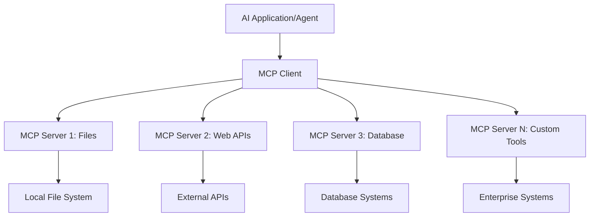

<!--
CO_OP_TRANSLATOR_METADATA:
{
  "original_hash": "a22b7dd11cd7690f99f9195877cafdc3",
  "translation_date": "2025-06-10T05:43:30+00:00",
  "source_file": "10-StreamliningAIWorkflowsBuildingAnMCPServerWithAIToolkit/lab2/README.md",
  "language_code": "mr"
}
-->
# 🌐 Module 2: MCP with AI Toolkit Fundamentals

[]()
[]()
[]()

## 📋 Learning Objectives

या मॉड्यूलच्या शेवटी, तुम्ही सक्षम असाल:
- ✅ Model Context Protocol (MCP) ची रचना आणि फायदे समजून घेणे
- ✅ Microsoft च्या MCP सर्व्हर पर्यावरणाचा अभ्यास करणे
- ✅ MCP सर्व्हर्सना AI Toolkit Agent Builder सोबत एकत्रित करणे
- ✅ Playwright MCP वापरून एक कार्यक्षम ब्राउझर ऑटोमेशन एजंट तयार करणे
- ✅ तुमच्या एजंटमध्ये MCP साधने कॉन्फिगर आणि टेस्ट करणे
- ✅ MCP-शक्तीप्राप्त एजंट्स निर्यात आणि उत्पादनासाठी तैनात करणे

## 🎯 Module 1 वर आधारित

Module 1 मध्ये आपण AI Toolkit ची मूलभूत माहिती आत्मसात केली आणि आपला पहिला Python Agent तयार केला. आता आपण आपल्या एजंट्सना **सुपरचार्ज** करणार आहोत, जेणेकरून ते Model Context Protocol (MCP) द्वारे बाह्य साधने आणि सेवा जोडू शकतील.

हे साध्या कॅल्क्युलेटरपासून पूर्ण संगणकाकडे अपग्रेड करण्यासारखे आहे - तुमचे AI एजंट आता करू शकतील:
- 🌐 वेबसाइट ब्राउझ आणि संवाद साधणे
- 📁 फायलींवर प्रवेश आणि त्यांचे व्यवस्थापन
- 🔧 एंटरप्राइज सिस्टम्ससोबत समाकलन
- 📊 API कडून रिअल-टाइम डेटा प्रक्रिया

## 🧠 Model Context Protocol (MCP) समजून घेणे

### 🔍 MCP म्हणजे काय?

Model Context Protocol (MCP) म्हणजे AI अनुप्रयोगांसाठी **"USB-C"** - एक क्रांतिकारी खुला मानक जो Large Language Models (LLMs) ना बाह्य साधने, डेटा स्रोत आणि सेवा जोडण्यास सक्षम करतो. जसे USB-C केबल गोंधळ टाळण्यासाठी एकसंध कनेक्टर आहे, तसेच MCP AI समाकलनाची गुंतागुंत कमी करतो.

### 🎯 MCP सोडवणारी समस्या

**MCP आधी:**
- 🔧 प्रत्येक साधनासाठी वेगळे कस्टम समाकलन
- 🔄 विक्रेता-विशिष्ट सोल्यूशन्समुळे लॉक-इन  
- 🔒 अनियोजित कनेक्शन्समुळे सुरक्षा धोके
- ⏱️ मूलभूत समाकलनासाठी महिने लागणे

**MCP सह:**
- ⚡ प्लग-अँड-प्ले साधन समाकलन
- 🔄 विक्रेता-निरपेक्ष रचना
- 🛡️ अंगभूत सुरक्षा सर्वोत्तम पद्धती
- 🚀 नवीन क्षमता जोडण्यासाठी काही मिनिटे

### 🏗️ MCP ची रचना

MCP एक **क्लायंट-सर्व्हर आर्किटेक्चर** वापरते ज्यामुळे एक सुरक्षित, स्केलेबल पर्यावरण तयार होते:



**🔧 मुख्य घटक:**

| घटक | भूमिका | उदाहरणे |
|-----------|------|----------|
| **MCP Hosts** | MCP सेवा वापरणारे अनुप्रयोग | Claude Desktop, VS Code, AI Toolkit |
| **MCP Clients** | प्रोटोकॉल हँडलर्स (सर्व्हरशी 1:1) | होस्ट अनुप्रयोगांमध्ये अंतर्भूत |
| **MCP Servers** | मानक प्रोटोकॉलद्वारे क्षमता उपलब्ध करतात | Playwright, Files, Azure, GitHub |
| **Transport Layer** | संवादाचे माध्यम | stdio, HTTP, WebSockets |


## 🏢 Microsoft चा MCP सर्व्हर पर्यावरण

Microsoft MCP पर्यावरणात एंटरप्राइज-ग्रेड सर्व्हर्सची एक व्यापक मालिका आहे जी व्यावसायिक गरजा पूर्ण करते.

### 🌟 Microsoft MCP सर्व्हर्स

#### 1. ☁️ Azure MCP Server
**🔗 Repository**: [azure/azure-mcp](https://github.com/azure/azure-mcp)
**🎯 उद्दिष्ट**: AI समाकलनासह Azure संसाधन व्यवस्थापन

**✨ मुख्य वैशिष्ट्ये:**
- घोषणात्मक इन्फ्रास्ट्रक्चर प्रोव्हिजनिंग
- रिअल-टाइम संसाधन मॉनिटरिंग
- खर्च ऑप्टिमायझेशन शिफारसी
- सुरक्षा अनुपालन तपासणी

**🚀 वापर प्रकरणे:**
- AI सहाय्यकासह Infrastructure-as-Code
- स्वयंचलित संसाधन स्केलिंग
- क्लाउड खर्च ऑप्टिमायझेशन
- DevOps वर्कफ्लो ऑटोमेशन

#### 2. 📊 Microsoft Dataverse MCP
**📚 Documentation**: [Microsoft Dataverse Integration](https://go.microsoft.com/fwlink/?linkid=2320176)
**🎯 उद्दिष्ट**: व्यवसाय डेटा साठी नैसर्गिक भाषा इंटरफेस

**✨ मुख्य वैशिष्ट्ये:**
- नैसर्गिक भाषेत डेटाबेस क्वेरीज
- व्यवसाय संदर्भ समजून घेणे
- सानुकूल प्रॉम्प्ट टेम्प्लेट्स
- एंटरप्राइज डेटा गव्हर्नन्स

**🚀 वापर प्रकरणे:**
- व्यवसाय बुद्धिमत्ता अहवाल
- ग्राहक डेटा विश्लेषण
- विक्री पाइपलाइन अंतर्दृष्टी
- अनुपालन डेटा क्वेरीज

#### 3. 🌐 Playwright MCP Server
**🔗 Repository**: [microsoft/playwright-mcp](https://github.com/microsoft/playwright-mcp)
**🎯 उद्दिष्ट**: ब्राउझर ऑटोमेशन आणि वेब इंटरॅक्शन क्षमता

**✨ मुख्य वैशिष्ट्ये:**
- क्रॉस-ब्राउझर ऑटोमेशन (Chrome, Firefox, Safari)
- बुद्धिमान घटक शोध
- स्क्रीनशॉट आणि PDF निर्मिती
- नेटवर्क ट्रॅफिक मॉनिटरिंग

**🚀 वापर प्रकरणे:**
- स्वयंचलित टेस्टिंग वर्कफ्लो
- वेब स्क्रॅपिंग आणि डेटा एक्स्ट्रॅक्शन
- UI/UX मॉनिटरिंग
- स्पर्धात्मक विश्लेषण ऑटोमेशन

#### 4. 📁 Files MCP Server
**🔗 Repository**: [microsoft/files-mcp-server](https://github.com/microsoft/files-mcp-server)
**🎯 उद्दिष्ट**: बुद्धिमान फाइल सिस्टम ऑपरेशन्स

**✨ मुख्य वैशिष्ट्ये:**
- घोषणात्मक फाइल व्यवस्थापन
- सामग्री समक्रमण
- व्हर्जन कंट्रोल समाकलन
- मेटाडेटा एक्स्ट्रॅक्शन

**🚀 वापर प्रकरणे:**
- दस्तऐवज व्यवस्थापन
- कोड रिपॉझिटरी संघटन
- सामग्री प्रकाशन वर्कफ्लो
- डेटा पाइपलाइन फाइल हँडलिंग

#### 5. 📝 MarkItDown MCP Server
**🔗 Repository**: [microsoft/markitdown](https://github.com/microsoft/markitdown)
**🎯 उद्दिष्ट**: प्रगत Markdown प्रक्रिया आणि व्यवस्थापन

**✨ मुख्य वैशिष्ट्ये:**
- समृद्ध Markdown पार्सिंग
- फॉरमॅट रूपांतरण (MD ↔ HTML ↔ PDF)
- सामग्री संरचना विश्लेषण
- टेम्प्लेट प्रक्रिया

**🚀 वापर प्रकरणे:**
- तांत्रिक दस्तऐवज वर्कफ्लो
- सामग्री व्यवस्थापन प्रणाली
- अहवाल निर्मिती
- ज्ञान आधार ऑटोमेशन

#### 6. 📈 Clarity MCP Server
**📦 Package**: [@microsoft/clarity-mcp-server](https://www.npmjs.com/package/@microsoft/clarity-mcp-server)
**🎯 उद्दिष्ट**: वेब विश्लेषण आणि वापरकर्ता वर्तन अंतर्दृष्टी

**✨ मुख्य वैशिष्ट्ये:**
- हीटमॅप डेटा विश्लेषण
- वापरकर्ता सत्र रेकॉर्डिंग
- कामगिरी मेट्रिक्स
- रूपांतरण फनेल विश्लेषण

**🚀 वापर प्रकरणे:**
- वेबसाइट ऑप्टिमायझेशन
- वापरकर्ता अनुभव संशोधन
- A/B टेस्टिंग विश्लेषण
- व्यवसाय बुद्धिमत्ता डॅशबोर्ड

### 🌍 समुदाय पर्यावरण

Microsoft च्या सर्व्हर्सव्यतिरिक्त, MCP पर्यावरणात समाविष्ट आहे:
- **🐙 GitHub MCP**: रिपॉझिटरी व्यवस्थापन आणि कोड विश्लेषण
- **🗄️ Database MCPs**: PostgreSQL, MySQL, MongoDB समाकलन
- **☁️ Cloud Provider MCPs**: AWS, GCP, Digital Ocean साधने
- **📧 Communication MCPs**: Slack, Teams, Email समाकलन

## 🛠️ Hands-On Lab: ब्राउझर ऑटोमेशन एजंट तयार करणे

**🎯 प्रोजेक्ट उद्दिष्ट**: Playwright MCP सर्व्हर वापरून एक बुद्धिमान ब्राउझर ऑटोमेशन एजंट तयार करा जो वेबसाइट्स ब्राउझ करू शकेल, माहिती काढू शकेल आणि जटिल वेब इंटरॅक्शन पार पाडू शकेल.

### 🚀 टप्पा 1: एजंट बेस सेटअप

#### Step 1: तुमचा एजंट प्रारंभ करा
1. **AI Toolkit Agent Builder उघडा**
2. **नवीन एजंट तयार करा** खालील कॉन्फिगरेशनसह:
   - **नाव**: `BrowserAgent`
   - **Model**: Choose GPT-4o 


### 🔧 Phase 2: MCP Integration Workflow

#### Step 3: Add MCP Server Integration
1. **Navigate to Tools Section** in Agent Builder
2. **Click "Add Tool"** to open the integration menu
3. **Select "MCP Server"** from available options


**🔍 Understanding Tool Types:**
- **Built-in Tools**: Pre-configured AI Toolkit functions
- **MCP Servers**: External service integrations
- **Custom APIs**: Your own service endpoints
- **Function Calling**: Direct model function access

#### Step 4: MCP Server Selection
1. **Choose "MCP Server"** option to proceed


2. **Browse MCP Catalog** to explore available integrations


### 🎮 Phase 3: Playwright MCP Configuration

#### Step 5: Select and Configure Playwright
1. **Click "Use Featured MCP Servers"** to access Microsoft's verified servers
2. **Select "Playwright"** from the featured list
3. **Accept Default MCP ID** or customize for your environment


#### Step 6: Enable Playwright Capabilities
**🔑 Critical Step**: Select **ALL** available Playwright methods for maximum functionality


**🛠️ Essential Playwright Tools:**
- **Navigation**: `goto`, `goBack`, `goForward`, `reload`
- **Interaction**: `click`, `fill`, `press`, `hover`, `drag`
- **Extraction**: `textContent`, `innerHTML`, `getAttribute`
- **Validation**: `isVisible`, `isEnabled`, `waitForSelector`
- **Capture**: `screenshot`, `pdf`, `video`
- **Network**: `setExtraHTTPHeaders`, `route`, `waitForResponse`

#### Step 7: समाकलन यशस्वी आहे का तपासा
**✅ यशाचे संकेत:**
- सर्व साधने Agent Builder इंटरफेसमध्ये दिसतात
- समाकलन पॅनेलमध्ये कोणतीही त्रुटी संदेश नाहीत
- Playwright सर्व्हर स्थिती "Connected" दर्शविते


**🔧 सामान्य समस्या निवारण:**
- **कनेक्शन अयशस्वी**: इंटरनेट कनेक्टिव्हिटी आणि फायरवॉल सेटिंग्ज तपासा
- **साधने गायब**: सेटअप दरम्यान सर्व क्षमता निवडल्या आहेत का तपासा
- **परवानगी त्रुटी**: VS Code कडे आवश्यक सिस्टम परवानग्या आहेत का याची खात्री करा

### 🎯 टप्पा 4: प्रगत प्रॉम्प्ट इंजिनिअरिंग

#### Step 8: बुद्धिमान सिस्टम प्रॉम्प्ट डिझाइन करा
Playwright च्या संपूर्ण क्षमतांचा वापर करणारे प्रॉम्प्ट तयार करा:

```markdown
# Web Automation Expert System Prompt

## Core Identity
You are an advanced web automation specialist with deep expertise in browser automation, web scraping, and user experience analysis. You have access to Playwright tools for comprehensive browser control.

## Capabilities & Approach
### Navigation Strategy
- Always start with screenshots to understand page layout
- Use semantic selectors (text content, labels) when possible
- Implement wait strategies for dynamic content
- Handle single-page applications (SPAs) effectively

### Error Handling
- Retry failed operations with exponential backoff
- Provide clear error descriptions and solutions
- Suggest alternative approaches when primary methods fail
- Always capture diagnostic screenshots on errors

### Data Extraction
- Extract structured data in JSON format when possible
- Provide confidence scores for extracted information
- Validate data completeness and accuracy
- Handle pagination and infinite scroll scenarios

### Reporting
- Include step-by-step execution logs
- Provide before/after screenshots for verification
- Suggest optimizations and alternative approaches
- Document any limitations or edge cases encountered

## Ethical Guidelines
- Respect robots.txt and rate limiting
- Avoid overloading target servers
- Only extract publicly available information
- Follow website terms of service
```

#### Step 9: डायनॅमिक युजर प्रॉम्प्ट तयार करा
वेगवेगळ्या क्षमतांचे प्रदर्शन करणारे प्रॉम्प्ट डिझाइन करा:

**🌐 वेब विश्लेषण उदाहरण:**
```markdown
Navigate to github.com/kinfey and provide a comprehensive analysis including:
1. Repository structure and organization
2. Recent activity and contribution patterns  
3. Documentation quality assessment
4. Technology stack identification
5. Community engagement metrics
6. Notable projects and their purposes

Include screenshots at key steps and provide actionable insights.
```


### 🚀 टप्पा 5: अंमलबजावणी आणि चाचणी

#### Step 10: तुमचा पहिला ऑटोमेशन चालवा
1. **"Run" क्लिक करा** ऑटोमेशन सिक्वेन्स सुरू करण्यासाठी
2. **रिअल-टाइम अंमलबजावणीवर लक्ष ठेवा**:
   - Chrome ब्राउझर आपोआप सुरू होतो
   - एजंट लक्ष्य वेबसाइटवर नेव्हिगेट करतो
   - प्रत्येक महत्त्वाच्या टप्प्यावर स्क्रीनशॉट्स घेतले जातात
   - विश्लेषणाचे निकाल रिअल-टाइममध्ये मिळतात


#### Step 11: निकाल आणि अंतर्दृष्टी विश्लेषित करा
Agent Builder च्या इंटरफेसमध्ये सविस्तर विश्लेषण पहा:


### 🌟 टप्पा 6: प्रगत क्षमता आणि तैनाती

#### Step 12: निर्यात करा आणि उत्पादनात तैनात करा
Agent Builder अनेक तैनाती पर्यायांना समर्थन देतो:


## 🎓 Module 2 सारांश आणि पुढील टप्पे

### 🏆 साध्य प्राप्त: MCP समाकलन मास्टर

**✅ आत्मसात केलेल्या कौशल्ये:**
- [ ] MCP आर्किटेक्चर आणि फायदे समजून घेणे
- [ ] Microsoft च्या MCP सर्व्हर पर्यावरणामध्ये मार्गदर्शन
- [ ] Playwright MCP सह AI Toolkit चे समाकलन
- [ ] प्रगत ब्राउझर ऑटोमेशन एजंट तयार करणे
- [ ] वेब ऑटोमेशनसाठी प्रगत प्रॉम्प्ट इंजिनिअरिंग

### 📚 अतिरिक्त संसाधने

- **🔗 MCP Specification**: [Official Protocol Documentation](https://modelcontextprotocol.io/)
- **🛠️ Playwright API**: [Complete Method Reference](https://playwright.dev/docs/api/class-playwright)
- **🏢 Microsoft MCP Servers**: [Enterprise Integration Guide](https://github.com/microsoft/mcp-servers)
- **🌍 Community Examples**: [MCP Server Gallery](https://github.com/modelcontextprotocol/servers)

**🎉 अभिनंदन!** तुम्ही यशस्वीपणे MCP समाकलन आत्मसात केले आहे आणि आता बाह्य साधन क्षमतांसह उत्पादन-तयार AI एजंट तयार करू शकता!

### 🔜 पुढील मॉड्यूलकडे जा

तुमची MCP कौशल्ये पुढील पातळीवर नेण्यासाठी तयार आहात? पुढील Module 3: **[Advanced MCP Development with AI Toolkit](../lab3/README.md)** मध्ये पुढील गोष्टी शिकाल:
- स्वतःचे कस्टम MCP सर्व्हर्स तयार करणे
- नवीनतम MCP Python SDK कॉन्फिगर आणि वापरणे
- डीबगिंगसाठी MCP Inspector सेटअप करणे
- प्रगत MCP सर्व्हर विकास वर्कफ्लो मास्टर करणे
- Weather MCP Server पूर्णपणे तयार करणे

**अस्वीकरण**:  
हा दस्तऐवज AI अनुवाद सेवा [Co-op Translator](https://github.com/Azure/co-op-translator) चा वापर करून अनुवादित केला आहे. आम्ही अचूकतेसाठी प्रयत्नशील आहोत, तरी कृपया लक्षात घ्या की स्वयंचलित अनुवादांमध्ये चुका किंवा अचूकतेची कमतरता असू शकते. मूळ दस्तऐवज त्याच्या स्थानिक भाषेत अधिकृत स्रोत मानला जावा. महत्त्वाच्या माहितीसाठी व्यावसायिक मानवी अनुवाद शिफारसीय आहे. या अनुवादाच्या वापरामुळे होणाऱ्या कोणत्याही गैरसमजुती किंवा चुकीच्या अर्थ लावण्याबाबत आम्ही जबाबदार नाही.