<!--
CO_OP_TRANSLATOR_METADATA:
{
  "original_hash": "a22b7dd11cd7690f99f9195877cafdc3",
  "translation_date": "2025-07-14T07:47:07+00:00",
  "source_file": "10-StreamliningAIWorkflowsBuildingAnMCPServerWithAIToolkit/lab2/README.md",
  "language_code": "mr"
}
-->
# 🌐 Module 2: MCP with AI Toolkit Fundamentals

[]()
[]()
[]()

## 📋 शिकण्याचे उद्दिष्टे

या मॉड्यूलच्या शेवटी, तुम्ही सक्षम असाल:
- ✅ Model Context Protocol (MCP) ची रचना आणि फायदे समजून घेणे
- ✅ Microsoft च्या MCP सर्व्हर इकोसिस्टमचा अभ्यास करणे
- ✅ MCP सर्व्हरना AI Toolkit Agent Builder सोबत एकत्रित करणे
- ✅ Playwright MCP वापरून कार्यक्षम ब्राउझर ऑटोमेशन एजंट तयार करणे
- ✅ तुमच्या एजंट्समध्ये MCP टूल्स कॉन्फिगर आणि टेस्ट करणे
- ✅ उत्पादनासाठी MCP-शक्तीने चालणारे एजंट्स निर्यात आणि तैनात करणे

## 🎯 Module 1 वर आधारित

Module 1 मध्ये, आपण AI Toolkit च्या मूलभूत गोष्टी शिकल्या आणि आपला पहिला Python Agent तयार केला. आता आपण तुमच्या एजंट्सना **सुपरचार्ज** करू, जेणेकरून ते Model Context Protocol (MCP) द्वारे बाह्य टूल्स आणि सेवा जोडू शकतील.

हे असे समजा की तुम्ही साध्या कॅल्क्युलेटरवरून पूर्ण संगणकाकडे अपग्रेड करत आहात - तुमच्या AI एजंट्सना खालील क्षमता मिळतील:
- 🌐 वेबसाइट्स ब्राउझ आणि संवाद साधणे
- 📁 फाइल्समध्ये प्रवेश आणि त्यांचे व्यवस्थापन करणे
- 🔧 एंटरप्राइझ सिस्टम्सशी एकत्रीकरण करणे
- 📊 API कडून रिअल-टाइम डेटा प्रक्रिया करणे

## 🧠 Model Context Protocol (MCP) समजून घेणे

### 🔍 MCP म्हणजे काय?

Model Context Protocol (MCP) हा AI अनुप्रयोगांसाठी **"USB-C"** सारखा एक क्रांतिकारी खुला मानक आहे, जो मोठ्या भाषा मॉडेल्स (LLMs) ला बाह्य टूल्स, डेटा स्रोत आणि सेवा यांच्याशी जोडतो. जसे USB-C ने केबल गोंधळ कमी केला, तसेच MCP ने AI एकत्रीकरणाची गुंतागुंत कमी केली आहे.

### 🎯 MCP कोणती समस्या सोडवतो

**MCP आधी:**
- 🔧 प्रत्येक टूलसाठी वेगळे कस्टम एकत्रीकरण
- 🔄 विक्रेता-आधारित लॉक-इन सोल्यूशन्स  
- 🔒 अनियमित कनेक्शन्समुळे सुरक्षा धोके
- ⏱️ मूलभूत एकत्रीकरणासाठी महिने लागणे

**MCP सह:**
- ⚡ प्लग-अँड-प्ले टूल एकत्रीकरण
- 🔄 विक्रेता-स्वतंत्र आर्किटेक्चर
- 🛡️ अंगभूत सुरक्षा सर्वोत्तम पद्धती
- 🚀 नवीन क्षमता जोडण्यासाठी काही मिनिटे

### 🏗️ MCP आर्किटेक्चर सखोल माहिती

MCP हे **क्लायंट-सर्व्हर आर्किटेक्चर** वापरते जे सुरक्षित, स्केलेबल इकोसिस्टम तयार करते:

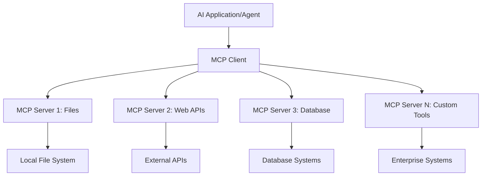

**🔧 मुख्य घटक:**

| घटक | भूमिका | उदाहरणे |
|-----------|------|----------|
| **MCP Hosts** | MCP सेवा वापरणारे अनुप्रयोग | Claude Desktop, VS Code, AI Toolkit |
| **MCP Clients** | प्रोटोकॉल हँडलर्स (सर्व्हरशी 1:1) | होस्ट अनुप्रयोगांमध्ये अंतर्भूत |
| **MCP Servers** | मानक प्रोटोकॉलद्वारे क्षमता प्रदर्शित करतात | Playwright, Files, Azure, GitHub |
| **Transport Layer** | संवादाचे माध्यम | stdio, HTTP, WebSockets |

## 🏢 Microsoft चा MCP सर्व्हर इकोसिस्टम

Microsoft MCP इकोसिस्टममध्ये एंटरप्राइझ-ग्रेड सर्व्हर्सचा समृद्ध संच आहे, जे व्यावसायिक गरजा पूर्ण करतात.

### 🌟 Microsoft MCP सर्व्हर्सची वैशिष्ट्ये

#### 1. ☁️ Azure MCP Server
**🔗 Repository**: [azure/azure-mcp](https://github.com/azure/azure-mcp)  
**🎯 उद्दिष्ट**: AI एकत्रीकरणासह व्यापक Azure संसाधन व्यवस्थापन

**✨ मुख्य वैशिष्ट्ये:**
- घोषणात्मक इन्फ्रास्ट्रक्चर प्रोव्हिजनिंग
- रिअल-टाइम संसाधन निरीक्षण
- खर्च ऑप्टिमायझेशन शिफारसी
- सुरक्षा अनुपालन तपासणी

**🚀 वापर प्रकरणे:**
- AI सहाय्याने Infrastructure-as-Code
- संसाधनांचे स्वयंचलित स्केलिंग
- क्लाउड खर्च ऑप्टिमायझेशन
- DevOps वर्कफ्लो ऑटोमेशन

#### 2. 📊 Microsoft Dataverse MCP
**📚 Documentation**: [Microsoft Dataverse Integration](https://go.microsoft.com/fwlink/?linkid=2320176)  
**🎯 उद्दिष्ट**: व्यवसाय डेटा साठी नैसर्गिक भाषा इंटरफेस

**✨ मुख्य वैशिष्ट्ये:**
- नैसर्गिक भाषा डेटाबेस क्वेरीज
- व्यवसाय संदर्भ समजून घेणे
- कस्टम प्रॉम्प्ट टेम्प्लेट्स
- एंटरप्राइझ डेटा गव्हर्नन्स

**🚀 वापर प्रकरणे:**
- व्यवसाय बुद्धिमत्ता अहवाल
- ग्राहक डेटा विश्लेषण
- विक्री पाइपलाइन अंतर्दृष्टी
- अनुपालन डेटा क्वेरीज

#### 3. 🌐 Playwright MCP Server
**🔗 Repository**: [microsoft/playwright-mcp](https://github.com/microsoft/playwright-mcp)  
**🎯 उद्दिष्ट**: ब्राउझर ऑटोमेशन आणि वेब संवाद क्षमता

**✨ मुख्य वैशिष्ट्ये:**
- क्रॉस-ब्राउझर ऑटोमेशन (Chrome, Firefox, Safari)
- बुद्धिमान घटक शोध
- स्क्रीनशॉट आणि PDF निर्मिती
- नेटवर्क ट्रॅफिक निरीक्षण

**🚀 वापर प्रकरणे:**
- स्वयंचलित चाचणी वर्कफ्लो
- वेब स्क्रॅपिंग आणि डेटा एक्स्ट्रॅक्शन
- UI/UX निरीक्षण
- स्पर्धात्मक विश्लेषण ऑटोमेशन

#### 4. 📁 Files MCP Server
**🔗 Repository**: [microsoft/files-mcp-server](https://github.com/microsoft/files-mcp-server)  
**🎯 उद्दिष्ट**: बुद्धिमान फाइल सिस्टम ऑपरेशन्स

**✨ मुख्य वैशिष्ट्ये:**
- घोषणात्मक फाइल व्यवस्थापन
- सामग्री समक्रमण
- आवृत्ती नियंत्रण एकत्रीकरण
- मेटाडेटा एक्स्ट्रॅक्शन

**🚀 वापर प्रकरणे:**
- दस्तऐवज व्यवस्थापन
- कोड रिपॉझिटरी संघटन
- सामग्री प्रकाशन वर्कफ्लो
- डेटा पाइपलाइन फाइल हँडलिंग

#### 5. 📝 MarkItDown MCP Server
**🔗 Repository**: [microsoft/markitdown](https://github.com/microsoft/markitdown)  
**🎯 उद्दिष्ट**: प्रगत Markdown प्रक्रिया आणि व्यवस्थापन

**✨ मुख्य वैशिष्ट्ये:**
- समृद्ध Markdown पार्सिंग
- फॉरमॅट रूपांतरण (MD ↔ HTML ↔ PDF)
- सामग्री संरचना विश्लेषण
- टेम्प्लेट प्रक्रिया

**🚀 वापर प्रकरणे:**
- तांत्रिक दस्तऐवज वर्कफ्लो
- सामग्री व्यवस्थापन प्रणाली
- अहवाल निर्मिती
- ज्ञान आधार ऑटोमेशन

#### 6. 📈 Clarity MCP Server
**📦 Package**: [@microsoft/clarity-mcp-server](https://www.npmjs.com/package/@microsoft/clarity-mcp-server)  
**🎯 उद्दिष्ट**: वेब विश्लेषण आणि वापरकर्ता वर्तन अंतर्दृष्टी

**✨ मुख्य वैशिष्ट्ये:**
- हीटमॅप डेटा विश्लेषण
- वापरकर्ता सत्र रेकॉर्डिंग
- कार्यक्षमता मेट्रिक्स
- रूपांतरण फनेल विश्लेषण

**🚀 वापर प्रकरणे:**
- वेबसाइट ऑप्टिमायझेशन
- वापरकर्ता अनुभव संशोधन
- A/B चाचणी विश्लेषण
- व्यवसाय बुद्धिमत्ता डॅशबोर्ड

### 🌍 समुदाय इकोसिस्टम

Microsoft च्या सर्व्हर्सव्यतिरिक्त, MCP इकोसिस्टममध्ये समाविष्ट आहे:
- **🐙 GitHub MCP**: रिपॉझिटरी व्यवस्थापन आणि कोड विश्लेषण
- **🗄️ डेटाबेस MCPs**: PostgreSQL, MySQL, MongoDB एकत्रीकरण
- **☁️ क्लाउड प्रदाता MCPs**: AWS, GCP, Digital Ocean टूल्स
- **📧 कम्युनिकेशन MCPs**: Slack, Teams, Email एकत्रीकरण

## 🛠️ प्रॅक्टिकल लॅब: ब्राउझर ऑटोमेशन एजंट तयार करणे

**🎯 प्रोजेक्ट उद्दिष्ट**: Playwright MCP सर्व्हर वापरून एक बुद्धिमान ब्राउझर ऑटोमेशन एजंट तयार करा, जो वेबसाइट्स ब्राउझ करू शकेल, माहिती काढू शकेल आणि गुंतागुंतीचे वेब संवाद करू शकेल.

### 🚀 टप्पा 1: एजंटची मूलभूत रचना

#### Step 1: तुमचा एजंट सुरू करा
1. **AI Toolkit Agent Builder उघडा**
2. **नवीन एजंट तयार करा** खालील कॉन्फिगरेशनसह:
   - **नाव**: `BrowserAgent`
   - **मॉडेल**: GPT-4o निवडा

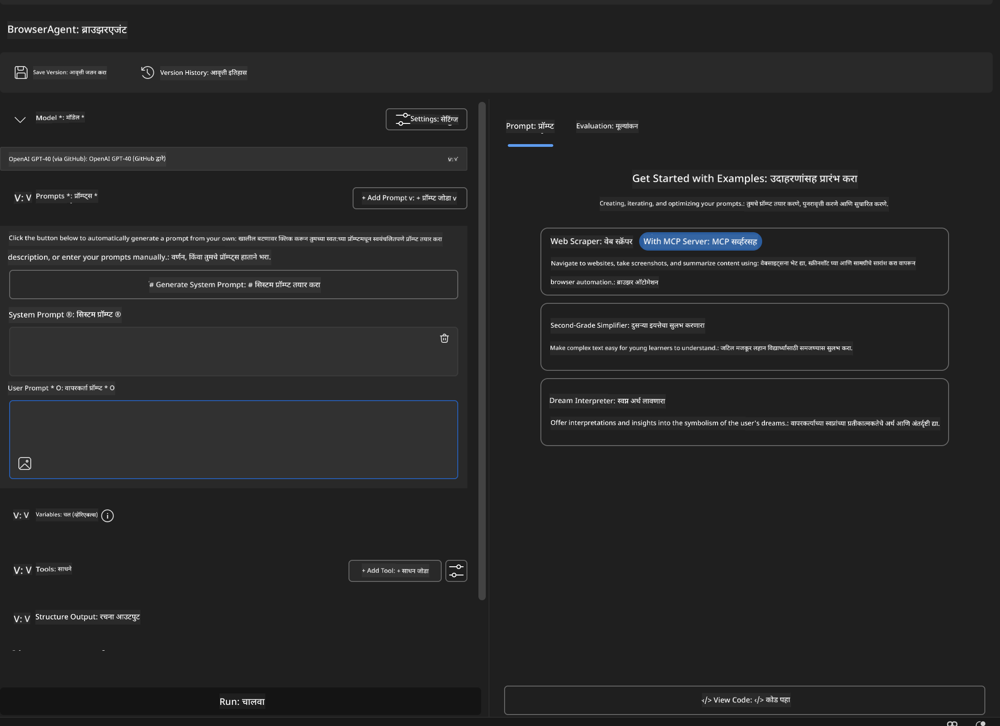

### 🔧 टप्पा 2: MCP एकत्रीकरण वर्कफ्लो

#### Step 3: MCP सर्व्हर एकत्रीकरण जोडा
1. **Agent Builder मधील Tools सेक्शनमध्ये जा**
2. **"Add Tool" क्लिक करा** जेणेकरून एकत्रीकरण मेनू उघडेल
3. **"MCP Server" निवडा**

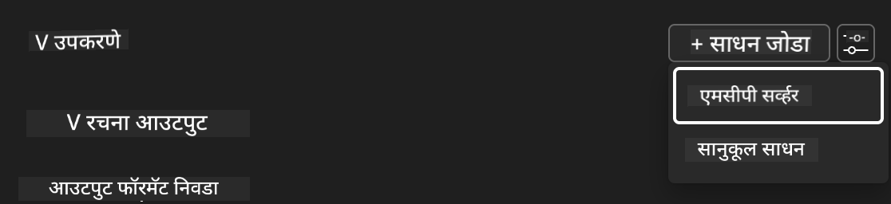

**🔍 टूल प्रकार समजून घ्या:**
- **Built-in Tools**: पूर्व-निर्धारित AI Toolkit फंक्शन्स
- **MCP Servers**: बाह्य सेवा एकत्रीकरण
- **Custom APIs**: तुमच्या स्वतःच्या सेवा एंडपॉइंट्स
- **Function Calling**: मॉडेल फंक्शन थेट कॉल

#### Step 4: MCP सर्व्हर निवड
1. **"MCP Server" पर्याय निवडा**
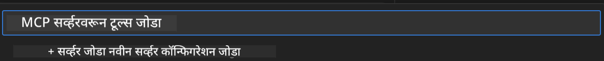

2. **MCP कॅटलॉग ब्राउझ करा आणि उपलब्ध एकत्रीकरण पहा**
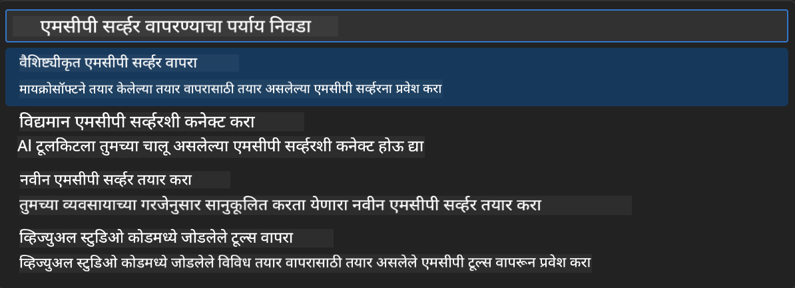

### 🎮 टप्पा 3: Playwright MCP कॉन्फिगरेशन

#### Step 5: Playwright निवडा आणि कॉन्फिगर करा
1. **"Use Featured MCP Servers" क्लिक करा** जेणेकरून Microsoft चे प्रमाणित सर्व्हर्स दिसतील
2. **"Playwright" निवडा**
3. **डिफॉल्ट MCP ID स्वीकारा किंवा तुमच्या वातावरणासाठी सानुकूल करा**

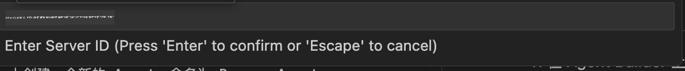

#### Step 6: Playwright क्षमता सक्षम करा
**🔑 महत्त्वाचा टप्पा**: जास्तीत जास्त कार्यक्षमतेसाठी सर्व Playwright पद्धती निवडा


**🛠️ आवश्यक Playwright टूल्स:**
- **नेव्हिगेशन**: `goto`, `goBack`, `goForward`, `reload`
- **परस्परसंवाद**: `click`, `fill`, `press`, `hover`, `drag`
- **माहिती काढणे**: `textContent`, `innerHTML`, `getAttribute`
- **चाचणी**: `isVisible`, `isEnabled`, `waitForSelector`
- **कॅप्चर**: `screenshot`, `pdf`, `video`
- **नेटवर्क**: `setExtraHTTPHeaders`, `route`, `waitForResponse`

#### Step 7: एकत्रीकरण यशस्वी आहे का तपासा
**✅ यशाचे संकेत:**
- सर्व टूल्स Agent Builder मध्ये दिसतात
- एकत्रीकरण पॅनेलमध्ये कोणतीही त्रुटी नाही
- Playwright सर्व्हर स्थिती "Connected" दर्शवते

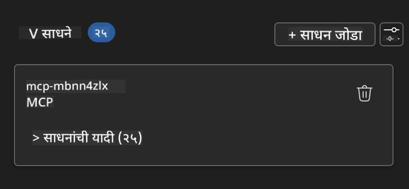

**🔧 सामान्य समस्या आणि उपाय:**
- **कनेक्शन अयशस्वी**: इंटरनेट कनेक्शन आणि फायरवॉल सेटिंग्ज तपासा
- **टूल्स गायब**: सेटअप दरम्यान सर्व क्षमता निवडल्या आहेत का ते तपासा
- **परवानगी त्रुटी**: VS Code कडे आवश्यक सिस्टम परवानग्या आहेत का ते तपासा

### 🎯 टप्पा 4: प्रगत प्रॉम्प्ट इंजिनिअरिंग

#### Step 8: बुद्धिमान सिस्टम प्रॉम्प्ट डिझाइन करा
Playwright च्या पूर्ण क्षमतांचा वापर करणारे प्रॉम्प्ट तयार करा:

```markdown
# Web Automation Expert System Prompt

## Core Identity
You are an advanced web automation specialist with deep expertise in browser automation, web scraping, and user experience analysis. You have access to Playwright tools for comprehensive browser control.

## Capabilities & Approach
### Navigation Strategy
- Always start with screenshots to understand page layout
- Use semantic selectors (text content, labels) when possible
- Implement wait strategies for dynamic content
- Handle single-page applications (SPAs) effectively

### Error Handling
- Retry failed operations with exponential backoff
- Provide clear error descriptions and solutions
- Suggest alternative approaches when primary methods fail
- Always capture diagnostic screenshots on errors

### Data Extraction
- Extract structured data in JSON format when possible
- Provide confidence scores for extracted information
- Validate data completeness and accuracy
- Handle pagination and infinite scroll scenarios

### Reporting
- Include step-by-step execution logs
- Provide before/after screenshots for verification
- Suggest optimizations and alternative approaches
- Document any limitations or edge cases encountered

## Ethical Guidelines
- Respect robots.txt and rate limiting
- Avoid overloading target servers
- Only extract publicly available information
- Follow website terms of service
```

#### Step 9: डायनॅमिक युजर प्रॉम्प्ट तयार करा
विविध क्षमता दाखवणारे प्रॉम्प्ट डिझाइन करा:

**🌐 वेब विश्लेषण उदाहरण:**
```markdown
Navigate to github.com/kinfey and provide a comprehensive analysis including:
1. Repository structure and organization
2. Recent activity and contribution patterns  
3. Documentation quality assessment
4. Technology stack identification
5. Community engagement metrics
6. Notable projects and their purposes

Include screenshots at key steps and provide actionable insights.
```

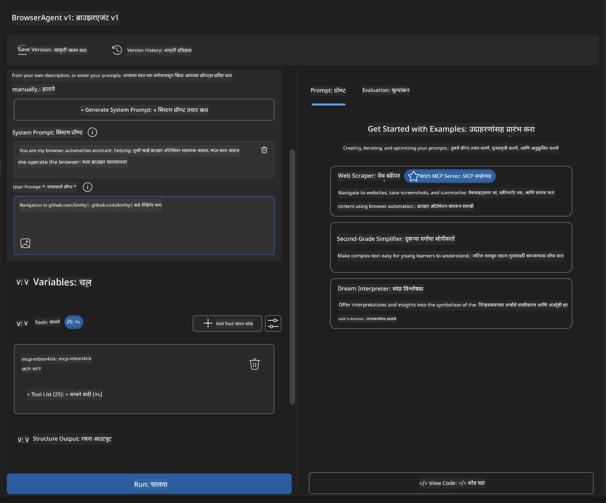

### 🚀 टप्पा 5: अंमलबजावणी आणि चाचणी

#### Step 10: तुमचा पहिला ऑटोमेशन चालवा
1. **"Run" क्लिक करा** जेणेकरून ऑटोमेशन सुरू होईल
2. **रिअल-टाइम अंमलबजावणी निरीक्षण करा**:
   - Chrome ब्राउझर आपोआप उघडेल
   - एजंट लक्ष्य वेबसाइटवर नेव्हिगेट करेल
   - प्रत्येक महत्त्वाचा टप्पा स्क्रीनशॉटमध्ये टिपला जाईल
   - विश्लेषणाचे निकाल रिअल-टाइममध्ये दिसतील

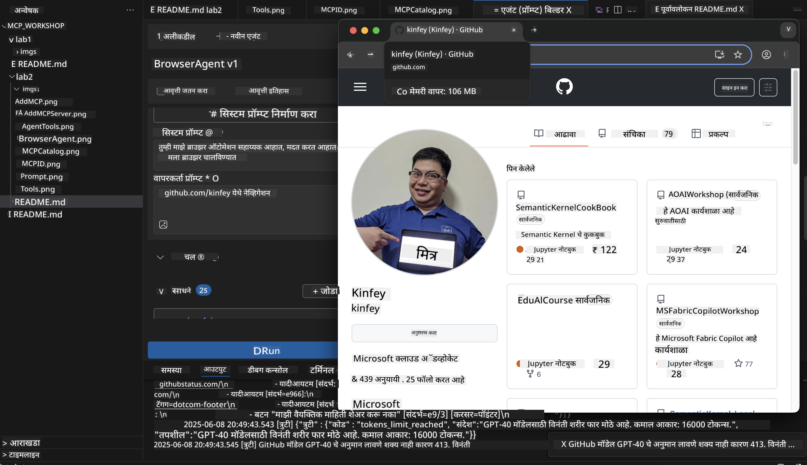

#### Step 11: निकाल आणि अंतर्दृष्टी विश्लेषित करा
Agent Builder च्या इंटरफेसमध्ये सविस्तर विश्लेषण पहा:

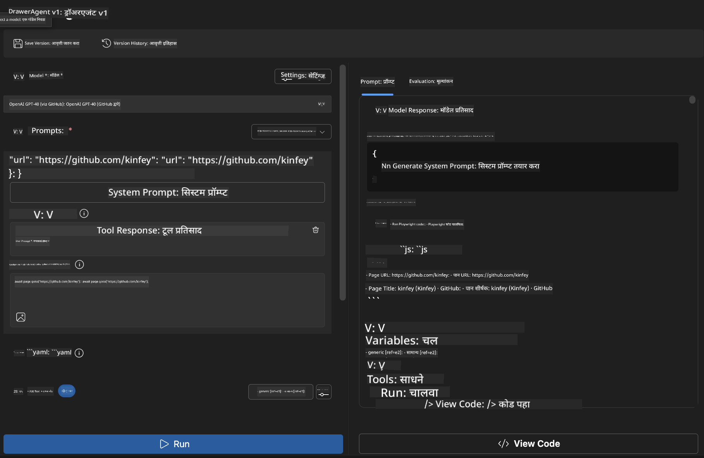

### 🌟 टप्पा 6: प्रगत क्षमता आणि तैनाती

#### Step 12: निर्यात करा आणि उत्पादनात तैनात करा
Agent Builder अनेक तैनाती पर्यायांना समर्थन देतो:

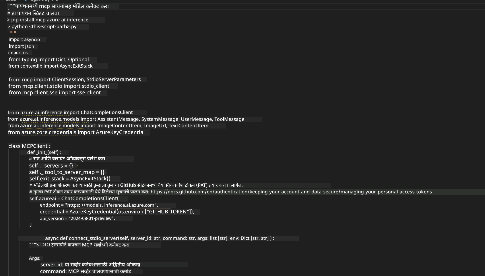

## 🎓 Module 2 सारांश आणि पुढील पावले

### 🏆 साध्य केले: MCP एकत्रीकरण मास्टर

**✅ शिकलेले कौशल्ये:**
- [ ] MCP आर्किटेक्चर आणि फायदे समजून घेणे
- [ ] Microsoft च्या MCP सर्व्हर इकोसिस्टममध्ये नेव्हिगेट करणे
- [ ] Playwright MCP सह AI Toolkit एकत्रीकरण करणे
- [ ] प्रगत ब्राउझर ऑटोमेशन एजंट तयार करणे
- [ ] वेब ऑटोमेशनसाठी प्रगत प्रॉम्प्ट इंजिनिअरिंग

### 📚 अतिरिक्त संसाधने

- **🔗 MCP Specification**: [अधिकृत प्रोटोकॉल दस्तऐवज](https://modelcontextprotocol.io/)
- **🛠️ Playwright API**: [पूर्ण पद्धत संदर्भ](https://playwright.dev/docs/api/class-playwright)
- **🏢 Microsoft MCP Servers**: [एंटरप्राइझ एकत्रीकरण मार्गदर्शक](https://github.com/microsoft/mcp-servers)
- **🌍 समुदाय उदाहरणे**: [MCP Server Gallery](https://github.com/modelcontextprotocol/servers)

**🎉 अभिनंदन!** तुम्ही यशस्वीपणे MCP एकत्रीकरण शिकले आहे आणि आता तुम्ही बाह्य टूल्ससह उत्पादनासाठी तयार AI एजंट्स तयार करू शकता!

### 🔜 पुढील मॉड्यूलकडे जा

तुमचे MCP कौशल्य पुढील स्तरावर नेण्यासाठी तयार आहात? पुढील मॉड्यूल **[Module 3: Advanced MCP Development with AI Toolkit](../lab3/README.md)** मध्ये पुढील गोष्टी शिकाल:
- तुमचे स्वतःचे कस्टम MCP सर्व्हर्स तयार करणे
- नवीनतम MCP Python SDK कॉन्फिगर आणि वापरणे
- डीबगिंगसाठी MCP Inspector सेटअप करणे
- प्रगत MCP सर्व्हर विकास वर्कफ्लो मास्टर करणे
- सुरुवातीपासून एक Weather MCP Server तयार करा

**अस्वीकरण**:  
हा दस्तऐवज AI अनुवाद सेवा [Co-op Translator](https://github.com/Azure/co-op-translator) वापरून अनुवादित केला आहे. आम्ही अचूकतेसाठी प्रयत्नशील असलो तरी, कृपया लक्षात घ्या की स्वयंचलित अनुवादांमध्ये चुका किंवा अचूकतेची कमतरता असू शकते. मूळ दस्तऐवज त्याच्या स्थानिक भाषेत अधिकृत स्रोत मानला जावा. महत्त्वाच्या माहितीसाठी व्यावसायिक मानवी अनुवाद करण्याची शिफारस केली जाते. या अनुवादाच्या वापरामुळे उद्भवलेल्या कोणत्याही गैरसमजुती किंवा चुकीच्या अर्थलागी आम्ही जबाबदार नाही.