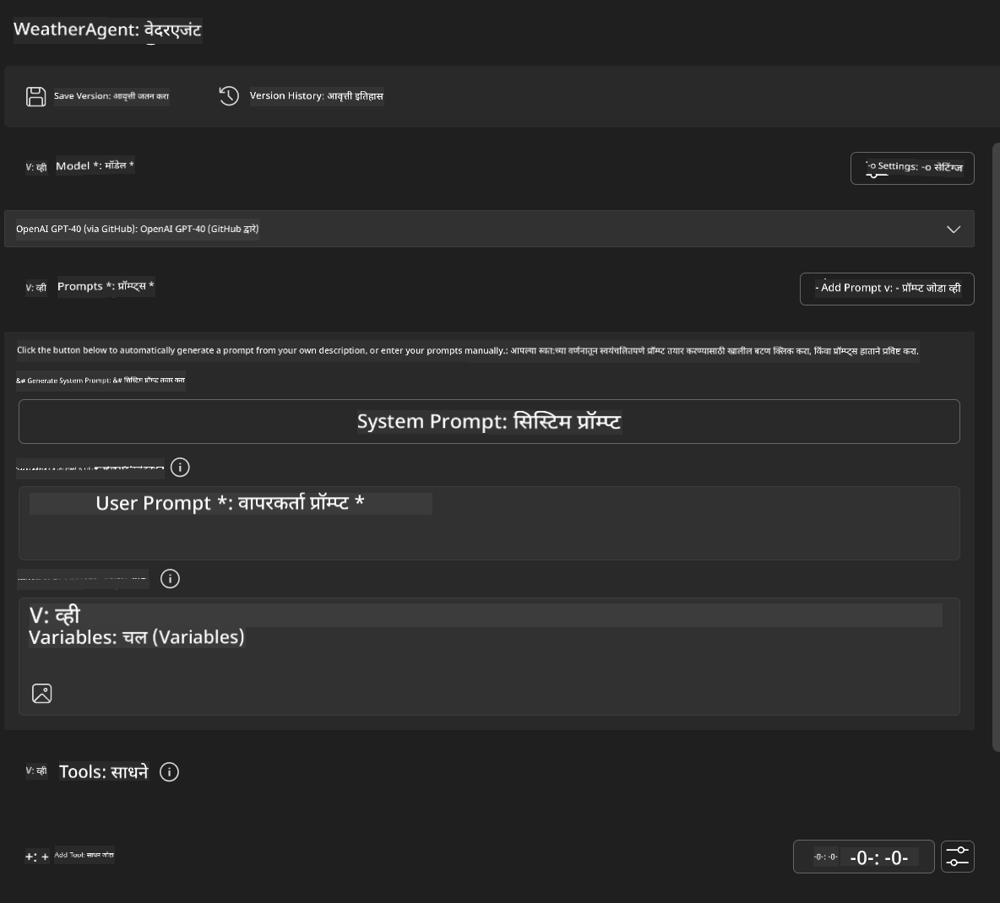
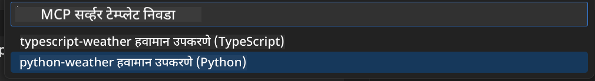
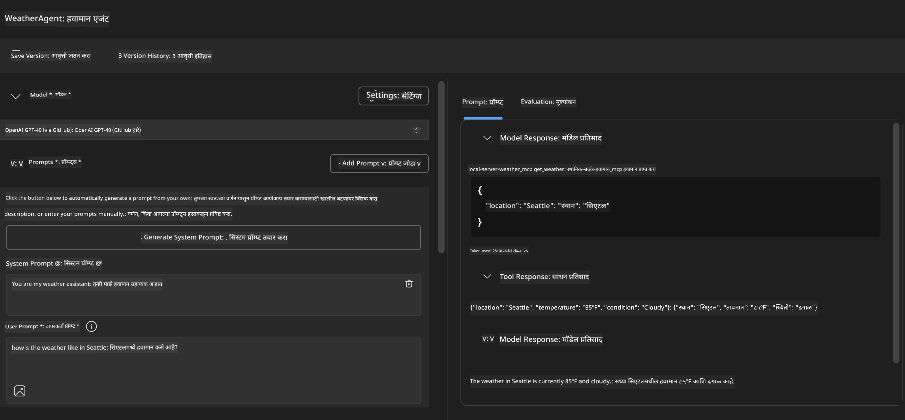
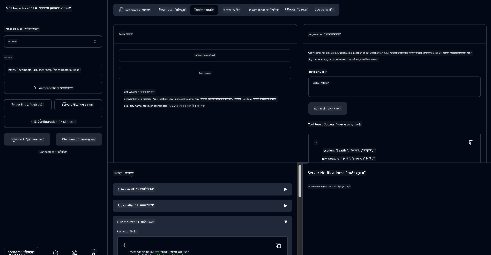

<!--
CO_OP_TRANSLATOR_METADATA:
{
  "original_hash": "dd8da3f75addcef453fe11f02a270217",
  "translation_date": "2025-07-14T08:11:12+00:00",
  "source_file": "10-StreamliningAIWorkflowsBuildingAnMCPServerWithAIToolkit/lab3/README.md",
  "language_code": "mr"
}
-->
# 🔧 Module 3: AI Toolkit सह प्रगत MCP विकास


## 🎯 शिकण्याचे उद्दिष्ट

या लॅबच्या शेवटी, तुम्ही सक्षम असाल:

- ✅ AI Toolkit वापरून कस्टम MCP सर्व्हर तयार करणे
- ✅ नवीनतम MCP Python SDK (v1.9.3) कॉन्फिगर आणि वापरणे
- ✅ डीबगिंगसाठी MCP Inspector सेटअप आणि वापर
- ✅ Agent Builder आणि Inspector दोन्ही वातावरणात MCP सर्व्हर डीबग करणे
- ✅ प्रगत MCP सर्व्हर विकास कार्यप्रवाह समजून घेणे

## 📋 पूर्वअट

- Lab 2 (MCP Fundamentals) पूर्ण केलेले असणे
- AI Toolkit विस्तारासह VS Code स्थापित असणे
- Python 3.10+ पर्यावरण
- Inspector सेटअपसाठी Node.js आणि npm

## 🏗️ तुम्ही काय तयार करणार आहात

या लॅबमध्ये, तुम्ही एक **Weather MCP Server** तयार कराल जो खालील गोष्टी दाखवेल:
- कस्टम MCP सर्व्हर अंमलबजावणी
- AI Toolkit Agent Builder सह एकत्रीकरण
- व्यावसायिक डीबगिंग कार्यप्रवाह
- आधुनिक MCP SDK वापराचे नमुने

---

## 🔧 मुख्य घटकांचे आढावा

### 🐍 MCP Python SDK
Model Context Protocol Python SDK कस्टम MCP सर्व्हर तयार करण्यासाठी पाया पुरवतो. तुम्ही आवृत्ती 1.9.3 वापराल ज्यात सुधारित डीबगिंग क्षमता आहेत.

### 🔍 MCP Inspector
एक शक्तिशाली डीबगिंग साधन जे प्रदान करते:
- रिअल-टाइम सर्व्हर मॉनिटरिंग
- टूल कार्यान्वयनाचे दृश्यांकन
- नेटवर्क विनंती/प्रतिसाद तपासणी
- संवादात्मक चाचणी वातावरण

---

## 📖 टप्प्याटप्प्याने अंमलबजावणी

### टप्पा 1: Agent Builder मध्ये WeatherAgent तयार करा

1. AI Toolkit विस्ताराद्वारे VS Code मध्ये **Agent Builder सुरू करा**
2. खालील कॉन्फिगरेशनसह **नवीन एजंट तयार करा**:
   - एजंट नाव: `WeatherAgent`



### टप्पा 2: MCP Server प्रोजेक्ट प्रारंभ करा

1. Agent Builder मध्ये **Tools → Add Tool** वर जा
2. उपलब्ध पर्यायांमधून **"MCP Server" निवडा**
3. **"Create A new MCP Server" निवडा**
4. `python-weather` टेम्प्लेट निवडा
5. तुमच्या सर्व्हरचे नाव द्या: `weather_mcp`



### टप्पा 3: प्रोजेक्ट उघडा आणि तपासा

1. VS Code मध्ये तयार केलेला प्रोजेक्ट उघडा
2. प्रोजेक्टची रचना तपासा:
   ```
   weather_mcp/
   ├── src/
   │   ├── __init__.py
   │   └── server.py
   ├── inspector/
   │   ├── package.json
   │   └── package-lock.json
   ├── .vscode/
   │   ├── launch.json
   │   └── tasks.json
   ├── pyproject.toml
   └── README.md
   ```

### टप्पा 4: नवीनतम MCP SDK मध्ये अपग्रेड करा

> **🔍 का अपग्रेड करायचे?** आम्हाला सुधारित वैशिष्ट्ये आणि चांगल्या डीबगिंगसाठी नवीनतम MCP SDK (v1.9.3) आणि Inspector सेवा (0.14.0) वापरायची आहे.

#### 4a. Python Dependencies अपडेट करा

**`pyproject.toml` संपादित करा:** [./code/weather_mcp/pyproject.toml](../../../../10-StreamliningAIWorkflowsBuildingAnMCPServerWithAIToolkit/lab3/code/weather_mcp/pyproject.toml) अपडेट करा

#### 4b. Inspector कॉन्फिगरेशन अपडेट करा

**`inspector/package.json` संपादित करा:** [./code/weather_mcp/inspector/package.json](../../../../10-StreamliningAIWorkflowsBuildingAnMCPServerWithAIToolkit/lab3/code/weather_mcp/inspector/package.json) अपडेट करा

#### 4c. Inspector Dependencies अपडेट करा

**`inspector/package-lock.json` संपादित करा:** [./code/weather_mcp/inspector/package-lock.json](../../../../10-StreamliningAIWorkflowsBuildingAnMCPServerWithAIToolkit/lab3/code/weather_mcp/inspector/package-lock.json) अपडेट करा

> **📝 टीप:** या फाईलमध्ये विस्तृत dependency व्याख्या आहेत. खाली आवश्यक रचना दिली आहे - पूर्ण सामग्री योग्य dependency निवारण सुनिश्चित करते.

> **⚡ पूर्ण Package Lock:** पूर्ण package-lock.json मध्ये सुमारे 3000 ओळी dependency व्याख्या आहेत. वरील रचना मुख्य आहे - संपूर्ण dependency निवारणासाठी दिलेली फाईल वापरा.

### टप्पा 5: VS Code डीबगिंग कॉन्फिगरेशन सेट करा

*टीप: कृपया निर्दिष्ट केलेल्या मार्गातील फाईल कॉपी करून स्थानिक फाईल बदला*

#### 5a. Launch कॉन्फिगरेशन अपडेट करा

**`.vscode/launch.json` संपादित करा:**

```json
{
  "version": "0.2.0",
  "configurations": [
    {
      "name": "Attach to Local MCP",
      "type": "debugpy",
      "request": "attach",
      "connect": {
        "host": "localhost",
        "port": 5678
      },
      "presentation": {
        "hidden": true
      },
      "internalConsoleOptions": "neverOpen",
      "postDebugTask": "Terminate All Tasks"
    },
    {
      "name": "Launch Inspector (Edge)",
      "type": "msedge",
      "request": "launch",
      "url": "http://localhost:6274?timeout=60000&serverUrl=http://localhost:3001/sse#tools",
      "cascadeTerminateToConfigurations": [
        "Attach to Local MCP"
      ],
      "presentation": {
        "hidden": true
      },
      "internalConsoleOptions": "neverOpen"
    },
    {
      "name": "Launch Inspector (Chrome)",
      "type": "chrome",
      "request": "launch",
      "url": "http://localhost:6274?timeout=60000&serverUrl=http://localhost:3001/sse#tools",
      "cascadeTerminateToConfigurations": [
        "Attach to Local MCP"
      ],
      "presentation": {
        "hidden": true
      },
      "internalConsoleOptions": "neverOpen"
    }
  ],
  "compounds": [
    {
      "name": "Debug in Agent Builder",
      "configurations": [
        "Attach to Local MCP"
      ],
      "preLaunchTask": "Open Agent Builder",
    },
    {
      "name": "Debug in Inspector (Edge)",
      "configurations": [
        "Launch Inspector (Edge)",
        "Attach to Local MCP"
      ],
      "preLaunchTask": "Start MCP Inspector",
      "stopAll": true
    },
    {
      "name": "Debug in Inspector (Chrome)",
      "configurations": [
        "Launch Inspector (Chrome)",
        "Attach to Local MCP"
      ],
      "preLaunchTask": "Start MCP Inspector",
      "stopAll": true
    }
  ]
}
```

**`.vscode/tasks.json` संपादित करा:**

```
{
  "version": "2.0.0",
  "tasks": [
    {
      "label": "Start MCP Server",
      "type": "shell",
      "command": "python -m debugpy --listen 127.0.0.1:5678 src/__init__.py sse",
      "isBackground": true,
      "options": {
        "cwd": "${workspaceFolder}",
        "env": {
          "PORT": "3001"
        }
      },
      "problemMatcher": {
        "pattern": [
          {
            "regexp": "^.*$",
            "file": 0,
            "location": 1,
            "message": 2
          }
        ],
        "background": {
          "activeOnStart": true,
          "beginsPattern": ".*",
          "endsPattern": "Application startup complete|running"
        }
      }
    },
    {
      "label": "Start MCP Inspector",
      "type": "shell",
      "command": "npm run dev:inspector",
      "isBackground": true,
      "options": {
        "cwd": "${workspaceFolder}/inspector",
        "env": {
          "CLIENT_PORT": "6274",
          "SERVER_PORT": "6277",
        }
      },
      "problemMatcher": {
        "pattern": [
          {
            "regexp": "^.*$",
            "file": 0,
            "location": 1,
            "message": 2
          }
        ],
        "background": {
          "activeOnStart": true,
          "beginsPattern": "Starting MCP inspector",
          "endsPattern": "Proxy server listening on port"
        }
      },
      "dependsOn": [
        "Start MCP Server"
      ]
    },
    {
      "label": "Open Agent Builder",
      "type": "shell",
      "command": "echo ${input:openAgentBuilder}",
      "presentation": {
        "reveal": "never"
      },
      "dependsOn": [
        "Start MCP Server"
      ],
    },
    {
      "label": "Terminate All Tasks",
      "command": "echo ${input:terminate}",
      "type": "shell",
      "problemMatcher": []
    }
  ],
  "inputs": [
    {
      "id": "openAgentBuilder",
      "type": "command",
      "command": "ai-mlstudio.agentBuilder",
      "args": {
        "initialMCPs": [ "local-server-weather_mcp" ],
        "triggeredFrom": "vsc-tasks"
      }
    },
    {
      "id": "terminate",
      "type": "command",
      "command": "workbench.action.tasks.terminate",
      "args": "terminateAll"
    }
  ]
}
```

---

## 🚀 तुमचा MCP सर्व्हर चालवा आणि चाचणी करा

### टप्पा 6: Dependencies इन्स्टॉल करा

कॉन्फिगरेशन बदल केल्यानंतर खालील आदेश चालवा:

**Python dependencies इन्स्टॉल करा:**
```bash
uv sync
```

**Inspector dependencies इन्स्टॉल करा:**
```bash
cd inspector
npm install
```

### टप्पा 7: Agent Builder मध्ये डीबग करा

1. **F5 दाबा** किंवा **"Debug in Agent Builder"** कॉन्फिगरेशन वापरा
2. डीबग पॅनेलमधून compound कॉन्फिगरेशन निवडा
3. सर्व्हर सुरू होईपर्यंत आणि Agent Builder उघडेल तोपर्यंत थांबा
4. नैसर्गिक भाषा क्वेरीसह तुमचा weather MCP सर्व्हर चाचणी करा

खालीलप्रमाणे इनपुट द्या

SYSTEM_PROMPT

```
You are my weather assistant
```

USER_PROMPT

```
How's the weather like in Seattle
```



### टप्पा 8: MCP Inspector सह डीबग करा

1. **"Debug in Inspector"** कॉन्फिगरेशन वापरा (Edge किंवा Chrome)
2. `http://localhost:6274` येथे Inspector इंटरफेस उघडा
3. संवादात्मक चाचणी वातावरण एक्सप्लोर करा:
   - उपलब्ध टूल्स पहा
   - टूल कार्यान्वयन चाचणी करा
   - नेटवर्क विनंत्या तपासा
   - सर्व्हर प्रतिसाद डीबग करा



---

## 🎯 मुख्य शिकण्याचे परिणाम

या लॅब पूर्ण करून, तुम्ही:

- [x] AI Toolkit टेम्प्लेट वापरून कस्टम MCP सर्व्हर तयार केला आहे
- [x] सुधारित कार्यक्षमतेसाठी नवीनतम MCP SDK (v1.9.3) मध्ये अपग्रेड केले आहे
- [x] Agent Builder आणि Inspector दोन्हींसाठी व्यावसायिक डीबगिंग कार्यप्रवाह कॉन्फिगर केले आहेत
- [x] संवादात्मक सर्व्हर चाचणीसाठी MCP Inspector सेटअप केला आहे
- [x] MCP विकासासाठी VS Code डीबगिंग कॉन्फिगरेशनमध्ये प्रावीण्य मिळवले आहे

## 🔧 प्रगत वैशिष्ट्ये तपासली

| वैशिष्ट्य | वर्णन | वापर प्रकरण |
|---------|-------------|----------|
| **MCP Python SDK v1.9.3** | नवीनतम प्रोटोकॉल अंमलबजावणी | आधुनिक सर्व्हर विकास |
| **MCP Inspector 0.14.0** | संवादात्मक डीबगिंग साधन | रिअल-टाइम सर्व्हर चाचणी |
| **VS Code Debugging** | एकात्मिक विकास वातावरण | व्यावसायिक डीबगिंग कार्यप्रवाह |
| **Agent Builder Integration** | थेट AI Toolkit कनेक्शन | एंड-टू-एंड एजंट चाचणी |

## 📚 अतिरिक्त संसाधने

- [MCP Python SDK Documentation](https://modelcontextprotocol.io/docs/sdk/python)
- [AI Toolkit Extension Guide](https://code.visualstudio.com/docs/ai/ai-toolkit)
- [VS Code Debugging Documentation](https://code.visualstudio.com/docs/editor/debugging)
- [Model Context Protocol Specification](https://modelcontextprotocol.io/docs/concepts/architecture)

---

**🎉 अभिनंदन!** तुम्ही यशस्वीरित्या Lab 3 पूर्ण केला आहे आणि आता व्यावसायिक विकास कार्यप्रवाह वापरून कस्टम MCP सर्व्हर तयार, डीबग आणि तैनात करू शकता.

### 🔜 पुढील Module कडे पुढे जा

तुमच्या MCP कौशल्यांचा वापर प्रत्यक्ष विकास कार्यप्रवाहात करण्यास तयार आहात? पुढे जा **[Module 4: Practical MCP Development - Custom GitHub Clone Server](../lab4/README.md)** येथे जिथे तुम्ही:
- GitHub रिपॉझिटरी ऑपरेशन्स स्वयंचलित करणारा उत्पादन-तयार MCP सर्व्हर तयार कराल
- MCP द्वारे GitHub रिपॉझिटरी क्लोनिंग कार्यक्षमता अंमलात आणाल
- VS Code आणि GitHub Copilot Agent Mode सह कस्टम MCP सर्व्हर एकत्रित कराल
- उत्पादन वातावरणात कस्टम MCP सर्व्हर चाचणी आणि तैनात कराल
- विकसकांसाठी व्यावहारिक कार्यप्रवाह स्वयंचलन शिकाल

**अस्वीकरण**:  
हा दस्तऐवज AI अनुवाद सेवा [Co-op Translator](https://github.com/Azure/co-op-translator) वापरून अनुवादित केला आहे. आम्ही अचूकतेसाठी प्रयत्नशील असलो तरी, कृपया लक्षात घ्या की स्वयंचलित अनुवादांमध्ये चुका किंवा अचूकतेची कमतरता असू शकते. मूळ दस्तऐवज त्याच्या स्थानिक भाषेत अधिकृत स्रोत मानला जावा. महत्त्वाच्या माहितीसाठी व्यावसायिक मानवी अनुवाद करण्याची शिफारस केली जाते. या अनुवादाच्या वापरामुळे उद्भवणाऱ्या कोणत्याही गैरसमजुती किंवा चुकीच्या अर्थलागी आम्ही जबाबदार नाही.