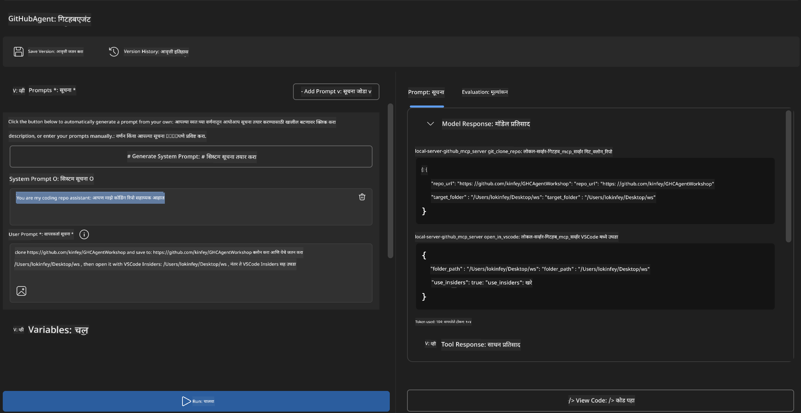
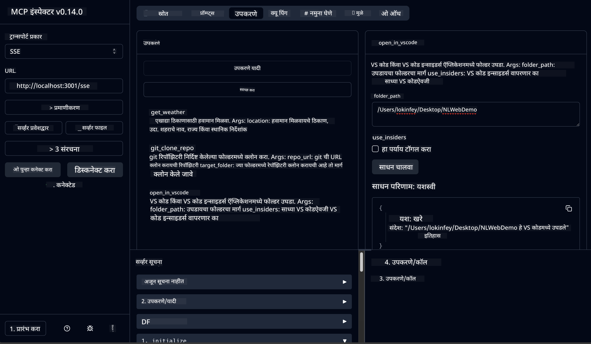

<!--
CO_OP_TRANSLATOR_METADATA:
{
  "original_hash": "f83bc722dc758efffd68667d6a1db470",
  "translation_date": "2025-07-14T08:39:34+00:00",
  "source_file": "10-StreamliningAIWorkflowsBuildingAnMCPServerWithAIToolkit/lab4/README.md",
  "language_code": "mr"
}
-->
# 🐙 Module 4: Practical MCP Development - Custom GitHub Clone Server


> **⚡ जलद प्रारंभ:** फक्त 30 मिनिटांत GitHub रिपॉझिटरी क्लोनिंग आणि VS Code इंटिग्रेशन स्वयंचलित करणारा उत्पादनासाठी तयार MCP सर्व्हर तयार करा!

## 🎯 शिकण्याचे उद्दिष्टे

या लॅबच्या शेवटी, तुम्ही सक्षम असाल:

- ✅ वास्तविक विकास कार्यप्रवाहांसाठी कस्टम MCP सर्व्हर तयार करणे
- ✅ MCP द्वारे GitHub रिपॉझिटरी क्लोनिंगची कार्यक्षमता अंमलात आणणे
- ✅ कस्टम MCP सर्व्हर VS Code आणि Agent Builder सोबत इंटिग्रेट करणे
- ✅ GitHub Copilot Agent Mode कस्टम MCP टूल्ससह वापरणे
- ✅ उत्पादन वातावरणात कस्टम MCP सर्व्हरची चाचणी आणि तैनाती करणे

## 📋 पूर्वअट

- Labs 1-3 पूर्ण केलेले असणे (MCP मूलतत्त्वे आणि प्रगत विकास)
- GitHub Copilot सदस्यता ([मुफ्त साइनअप उपलब्ध](https://github.com/github-copilot/signup))
- AI Toolkit आणि GitHub Copilot एक्सटेंशन्ससह VS Code
- Git CLI स्थापित आणि कॉन्फिगर केलेले

## 🏗️ प्रकल्पाचा आढावा

### **वास्तविक विकास आव्हान**
विकसक म्हणून, आपण वारंवार GitHub वापरून रिपॉझिटरी क्लोन करतो आणि VS Code किंवा VS Code Insiders मध्ये उघडतो. हा मॅन्युअल प्रक्रिया खालीलप्रमाणे आहे:
1. टर्मिनल/कमांड प्रॉम्प्ट उघडणे
2. इच्छित निर्देशिकेत जाणे
3. `git clone` कमांड चालवणे
4. क्लोन केलेल्या निर्देशिकेत VS Code उघडणे

**आमचा MCP उपाय हे सर्व एका बुद्धिमान कमांडमध्ये सुलभ करतो!**

### **तुम्ही काय तयार करणार आहात**
एक **GitHub Clone MCP Server** (`git_mcp_server`) जो खालील सुविधा देतो:

| वैशिष्ट्य | वर्णन | फायदा |
|---------|-------------|---------|
| 🔄 **स्मार्ट रिपॉझिटरी क्लोनिंग** | GitHub रिपॉझिटरी वैधता तपासून क्लोन करा | स्वयंचलित त्रुटी तपासणी |
| 📁 **बुद्धिमान निर्देशिका व्यवस्थापन** | निर्देशिका सुरक्षितपणे तपासा आणि तयार करा | ओव्हरराइट होण्यापासून संरक्षण |
| 🚀 **क्रॉस-प्लॅटफॉर्म VS Code इंटिग्रेशन** | प्रोजेक्ट्स VS Code/Insiders मध्ये उघडा | अखंड कार्यप्रवाह संक्रमण |
| 🛡️ **मजबूत त्रुटी हाताळणी** | नेटवर्क, परवानगी आणि पथ समस्या हाताळा | उत्पादनासाठी तयार विश्वसनीयता |

---

## 📖 टप्प्याटप्प्याने अंमलबजावणी

### टप्पा 1: Agent Builder मध्ये GitHub Agent तयार करा

1. AI Toolkit एक्सटेंशनद्वारे **Agent Builder** सुरू करा
2. खालील कॉन्फिगरेशनसह **नवीन एजंट तयार करा:**
   ```
   Agent Name: GitHubAgent
   ```

3. **कस्टम MCP सर्व्हर प्रारंभ करा:**
   - **Tools** → **Add Tool** → **MCP Server** येथे जा
   - **"Create A new MCP Server"** निवडा
   - जास्तीत जास्त लवचिकतेसाठी **Python template** निवडा
   - **सर्व्हर नाव:** `git_mcp_server`

### टप्पा 2: GitHub Copilot Agent Mode कॉन्फिगर करा

1. VS Code मध्ये **GitHub Copilot** उघडा (Ctrl/Cmd + Shift + P → "GitHub Copilot: Open")
2. Copilot इंटरफेसमध्ये **Agent Model** निवडा
3. सुधारित विचारशक्तीसाठी **Claude 3.7 मॉडेल** निवडा
4. टूल प्रवेशासाठी **MCP इंटिग्रेशन सक्षम करा**

> **💡 प्रो टिप:** Claude 3.7 विकास कार्यप्रवाह आणि त्रुटी हाताळणी पद्धतींचे उत्कृष्ट समज प्रदान करतो.

### टप्पा 3: मुख्य MCP सर्व्हर कार्यक्षमता अंमलात आणा

**GitHub Copilot Agent Mode सह खालील तपशीलवार प्रॉम्प्ट वापरा:**

```
Create two MCP tools with the following comprehensive requirements:

🔧 TOOL A: clone_repository
Requirements:
- Clone any GitHub repository to a specified local folder
- Return the absolute path of the successfully cloned project
- Implement comprehensive validation:
  ✓ Check if target directory already exists (return error if exists)
  ✓ Validate GitHub URL format (https://github.com/user/repo)
  ✓ Verify git command availability (prompt installation if missing)
  ✓ Handle network connectivity issues
  ✓ Provide clear error messages for all failure scenarios

🚀 TOOL B: open_in_vscode
Requirements:
- Open specified folder in VS Code or VS Code Insiders
- Cross-platform compatibility (Windows/Linux/macOS)
- Use direct application launch (not terminal commands)
- Auto-detect available VS Code installations
- Handle cases where VS Code is not installed
- Provide user-friendly error messages

Additional Requirements:
- Follow MCP 1.9.3 best practices
- Include proper type hints and documentation
- Implement logging for debugging purposes
- Add input validation for all parameters
- Include comprehensive error handling
```

### टप्पा 4: तुमचा MCP सर्व्हर चाचणी करा

#### 4a. Agent Builder मध्ये चाचणी

1. Agent Builder साठी डिबग कॉन्फिगरेशन सुरू करा
2. तुमच्या एजंटसाठी खालील सिस्टम प्रॉम्प्ट कॉन्फिगर करा:

```
SYSTEM_PROMPT:
You are my intelligent coding repository assistant. You help developers efficiently clone GitHub repositories and set up their development environment. Always provide clear feedback about operations and handle errors gracefully.
```

3. वास्तविक वापरकर्ता परिस्थितींसह चाचणी करा:

```
USER_PROMPT EXAMPLES:

Scenario : Basic Clone and Open
"Clone {Your GitHub Repo link such as https://github.com/kinfey/GHCAgentWorkshop
 } and save to {The global path you specify}, then open it with VS Code Insiders"
```



**अपेक्षित निकाल:**
- ✅ यशस्वी क्लोनिंग आणि पथ पुष्टीकरण
- ✅ स्वयंचलित VS Code लॉन्च
- ✅ अवैध परिस्थितींसाठी स्पष्ट त्रुटी संदेश
- ✅ कोपऱ्यांच्या प्रकरणांची योग्य हाताळणी

#### 4b. MCP Inspector मध्ये चाचणी




---

**🎉 अभिनंदन!** तुम्ही यशस्वीपणे एक व्यावहारिक, उत्पादनासाठी तयार MCP सर्व्हर तयार केला आहे जो वास्तविक विकास कार्यप्रवाहातील आव्हाने सोडवतो. तुमचा कस्टम GitHub क्लोन सर्व्हर MCP च्या शक्तीचा वापर करून विकासकांची उत्पादकता स्वयंचलित आणि सुधारित करतो.

### 🏆 मिळवलेली पदवी:
- ✅ **MCP Developer** - कस्टम MCP सर्व्हर तयार केला
- ✅ **Workflow Automator** - विकास प्रक्रियांचे सुलभीकरण केले  
- ✅ **Integration Expert** - अनेक विकास टूल्स जोडले
- ✅ **Production Ready** - तैनात करण्यायोग्य उपाय तयार केले

---

## 🎓 कार्यशाळा पूर्ण: Model Context Protocol सह तुमचा प्रवास

**प्रिय कार्यशाळा सहभागी,**

Model Context Protocol कार्यशाळेच्या सर्व चार मॉड्यूल्स पूर्ण केल्याबद्दल अभिनंदन! तुम्ही AI Toolkit च्या मूलभूत संकल्पनांपासून सुरुवात करून उत्पादनासाठी तयार MCP सर्व्हर तयार करण्यापर्यंतचा प्रवास पार केला आहे, जे वास्तविक विकास आव्हाने सोडवतात.

### 🚀 तुमचा शिकण्याचा मार्ग:

**[Module 1](../lab1/README.md)**: AI Toolkit मूलतत्त्वे, मॉडेल चाचणी, आणि तुमचा पहिला AI एजंट तयार करणे शिकले.

**[Module 2](../lab2/README.md)**: MCP आर्किटेक्चर समजून घेतले, Playwright MCP इंटिग्रेट केले, आणि पहिला ब्राउझर ऑटोमेशन एजंट तयार केला.

**[Module 3](../lab3/README.md)**: कस्टम MCP सर्व्हर विकासात प्रगती केली, Weather MCP सर्व्हर तयार केला आणि डिबगिंग टूल्समध्ये पारंगत झाले.

**[Module 4](../lab4/README.md)**: आता तुम्ही सर्व काही वापरून व्यावहारिक GitHub रिपॉझिटरी कार्यप्रवाह स्वयंचलित करणारे टूल तयार केले आहे.

### 🌟 तुम्ही काय पारंगत झाले:

- ✅ **AI Toolkit पर्यावरण**: मॉडेल्स, एजंट्स, आणि इंटिग्रेशन पॅटर्न्स
- ✅ **MCP आर्किटेक्चर**: क्लायंट-सर्व्हर डिझाइन, ट्रान्सपोर्ट प्रोटोकॉल्स, आणि सुरक्षा
- ✅ **विकासक टूल्स**: Playground पासून Inspector आणि उत्पादन तैनातीपर्यंत
- ✅ **कस्टम विकास**: स्वतःचे MCP सर्व्हर तयार करणे, चाचणी करणे आणि तैनात करणे
- ✅ **व्यावहारिक अनुप्रयोग**: AI वापरून वास्तविक कार्यप्रवाह आव्हाने सोडवणे

### 🔮 पुढील पावले:

1. **तुमचा स्वतःचा MCP सर्व्हर तयार करा**: तुमच्या खास कार्यप्रवाहांसाठी स्वयंचलितीकरण करा
2. **MCP समुदायात सहभागी व्हा**: तुमची निर्मिती शेअर करा आणि इतरांकडून शिका
3. **प्रगत इंटिग्रेशन एक्सप्लोर करा**: MCP सर्व्हर एंटरप्राइझ सिस्टम्सशी जोडा
4. **ओपन सोर्समध्ये योगदान द्या**: MCP टूलिंग आणि दस्तऐवजीकरण सुधारण्यात मदत करा

लक्षात ठेवा, ही कार्यशाळा फक्त सुरुवात आहे. Model Context Protocol पर्यावरण जलद गतीने विकसित होत आहे, आणि तुम्ही आता AI-चालित विकास टूल्सच्या आघाडीवर आहात.

**शिकण्याच्या तुमच्या समर्पणासाठी आणि सहभागासाठी धन्यवाद!**

आम्हाला आशा आहे की ही कार्यशाळा तुम्हाला असे विचार देईल जे तुमच्या विकास प्रवासात AI टूल्स कसे तयार आणि वापरायचे यामध्ये क्रांती घडवून आणतील.

**कोडिंगचा आनंद घ्या!**

---

**अस्वीकरण**:  
हा दस्तऐवज AI अनुवाद सेवा [Co-op Translator](https://github.com/Azure/co-op-translator) वापरून अनुवादित केला आहे. आम्ही अचूकतेसाठी प्रयत्नशील असलो तरी, कृपया लक्षात घ्या की स्वयंचलित अनुवादांमध्ये चुका किंवा अचूकतेची कमतरता असू शकते. मूळ दस्तऐवज त्याच्या स्थानिक भाषेत अधिकृत स्रोत मानला जावा. महत्त्वाच्या माहितीसाठी व्यावसायिक मानवी अनुवाद करण्याची शिफारस केली जाते. या अनुवादाच्या वापरामुळे उद्भवणाऱ्या कोणत्याही गैरसमजुती किंवा चुकीच्या अर्थलागी आम्ही जबाबदार नाही.