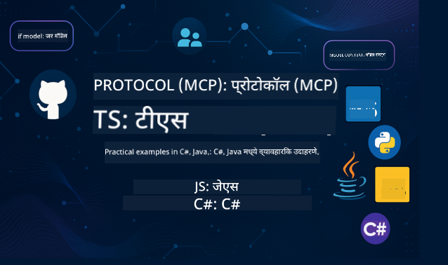

<!--
CO_OP_TRANSLATOR_METADATA:
{
  "original_hash": "5957474e94fe62b2e334f2664abb6e9b",
  "translation_date": "2025-05-20T16:33:31+00:00",
  "source_file": "README.md",
  "language_code": "mr"
}
-->
 

या स्त्रोतांचा वापर सुरू करण्यासाठी खालील टप्पे पूर्ण करा :
1. **Repository फोर्क करा**: क्लिक करा 
2. **Repository क्लोन करा**:   `git clone https://github.com/microsoft/mcp-for-beginners.git`
3. [**Azure AI Foundry Discord मध्ये सामील व्हा आणि तज्ञ व इतर विकसकांशी भेटा**](https://discord.com/invite/ByRwuEEgH4)

### 🌐 बहुभाषिक समर्थन

#### GitHub Action द्वारे समर्थित (स्वयंचलित आणि नेहमी अद्ययावत)
[फ्रेंच](../fr/README.md) | [स्पॅनिश](../es/README.md) | [जर्मन](../de/README.md) | [रशियन](../ru/README.md) | [अरबी](../ar/README.md) | [फारसी (पर्शियन)](../fa/README.md) | [उर्दू](../ur/README.md) | [चिनी (सोपंल)](../zh/README.md) | [चिनी (परंपरागत, मकाऊ)](../mo/README.md) | [चिनी (परंपरागत, हॉंगकॉंग)](../hk/README.md) | [चिनी (परंपरागत, तैवान)](../tw/README.md) | [जपानी](../ja/README.md) | [कोरियन](../ko/README.md) | [हिंदी](../hi/README.md) | [बंगाली](../bn/README.md) | [मराठी](./README.md) | [नेपाली](../ne/README.md) | [पंजाबी (गुरमुखी)](../pa/README.md) | [पोर्तुगीज (पुर्तगाल)](../pt/README.md) | [पोर्तुगीज (ब्राझील)](../br/README.md) | [इटालियन](../it/README.md) | [पोलिश](../pl/README.md) | [तुर्की](../tr/README.md) | [ग्रीक](../el/README.md) | [थाई](../th/README.md) | [स्वीडिश](../sv/README.md) | [डॅनिश](../da/README.md) | [नॉर्वेजियन](../no/README.md) | [फिन्निश](../fi/README.md) | [डच](../nl/README.md) | [हिब्रू](../he/README.md) | [व्हिएतनामी](../vi/README.md) | [इंडोनेशियन](../id/README.md) | [मलय](../ms/README.md) | [टागालॉग (फिलीपिनो)](../tl/README.md) | [स्वाहिली](../sw/README.md) | [हंगेरियन](../hu/README.md) | [चेक](../cs/README.md) | [स्लोव्हाक](../sk/README.md) | [रोमानियन](../ro/README.md) | [बल्गेरियन](../bg/README.md) | [सर्बियन (सिरिलिक)](../sr/README.md) | [क्रोएशियन](../hr/README.md) | [स्लोव्हेनियन](../sl/README.md) कृपया आउटपुट डावीकडून उजवीकडे लिहा.
# 🚀 मॉडेल कॉन्टेक्स्ट प्रोटोकॉल (MCP) बिगिनर्ससाठी अभ्यासक्रम

## **C#, Java, JavaScript, Python, आणि TypeScript मध्ये हाताळणी कोड उदाहरणांसह MCP शिका**

## 🧠 मॉडेल कॉन्टेक्स्ट प्रोटोकॉल अभ्यासक्रमाचा आढावा

**मॉडेल कॉन्टेक्स्ट प्रोटोकॉल (MCP)** हा एक अत्याधुनिक फ्रेमवर्क आहे जो AI मॉडेल्स आणि क्लायंट अ‍ॅप्लिकेशन्समधील संवादासाठी मानकीकरण करण्यासाठी तयार केला गेला आहे. हा ओपन-सोर्स अभ्यासक्रम एक संरचित शिक्षण मार्ग प्रदान करतो, ज्यामध्ये व्यावहारिक कोडिंग उदाहरणे आणि वास्तविक वापराच्या प्रकरणांसह, C#, Java, JavaScript, TypeScript, आणि Python सारख्या लोकप्रिय प्रोग्रामिंग भाषांमध्ये शिकवले जाते.

तुम्ही AI डेव्हलपर, सिस्टीम आर्किटेक्ट किंवा सॉफ्टवेअर इंजिनिअर असाल, हा मार्गदर्शक MCP च्या मूलभूत तत्त्वे आणि अंमलबजावणीच्या रणनीतींवर प्रभुत्व मिळवण्यासाठी तुमचा सर्वसमावेशक स्रोत आहे.

## 🔗 अधिकृत MCP संसाधने

- 📘 [MCP Documentation](https://modelcontextprotocol.io/) – सविस्तर ट्युटोरियल्स आणि वापरकर्ता मार्गदर्शिका  
- 📜 [MCP Specification](https://spec.modelcontextprotocol.io/) – प्रोटोकॉल आर्किटेक्चर आणि तांत्रिक संदर्भ  
- 🧑‍💻 [MCP GitHub Repository](https://github.com/modelcontextprotocol) – ओपन-सोर्स SDKs, टूल्स, आणि कोड नमुने  

## 🧭 MCP अभ्यासक्रमाची पूर्ण रचना

| चॅप्टर | शीर्षक | वर्णन | लिंक |
|--|--|--|--|
| 00 | **MCP परिचय** | मॉडेल कॉन्टेक्स्ट प्रोटोकॉलचा आढावा आणि AI पाइपलाइन्समधील त्याचे महत्त्व, MCP म्हणजे काय, मानकीकरण का आवश्यक आहे, आणि व्यावहारिक वापर आणि फायदे | [Introduction](./00-Introduction/README.md) |
| 01 | **मूलभूत संकल्पना स्पष्ट** | MCP च्या मूलभूत संकल्पनांचा सखोल अभ्यास, क्लायंट-सर्व्हर आर्किटेक्चर, मुख्य प्रोटोकॉल घटक, आणि मेसेजिंग पॅटर्न्स | [Core Concepts](./01-CoreConcepts/README.md) |
| 02 | **MCP मध्ये सुरक्षा** | MCP-आधारित प्रणालीतील सुरक्षा धोके ओळखणे, सुरक्षित अंमलबजावणीसाठी तंत्रे आणि सर्वोत्तम पद्धती | [Security](/02-Security/readme.md) |
| 03 | **MCP सह सुरुवात** | वातावरण सेटअप आणि कॉन्फिगरेशन, मूलभूत MCP सर्व्हर आणि क्लायंट तयार करणे, विद्यमान अ‍ॅप्लिकेशन्समध्ये MCP एकत्रित करणे | [Getting Started](./03-GettingStarted/README.md) |
| 3.1 | **पहिला सर्व्हर** | MCP प्रोटोकॉल वापरून मूलभूत सर्व्हर सेटअप करणे, सर्व्हर-क्लायंट संवाद समजून घेणे, आणि सर्व्हरची चाचणी करणे | [First Server](./03-GettingStarted/01-first-server/README.md) |
| 3.2 | **पहिला क्लायंट** | MCP प्रोटोकॉल वापरून मूलभूत क्लायंट सेटअप करणे, क्लायंट-सर्व्हर संवाद समजून घेणे, आणि क्लायंटची चाचणी करणे | [First Client](./03-GettingStarted/02-client/README.md) |
| 3.3 | **LLM सह क्लायंट** | मोठ्या भाषा मॉडेल (LLM) सह MCP प्रोटोकॉल वापरून क्लायंट सेटअप करणे | [Client with LLM](./03-GettingStarted/03-llm-client/README.md) |
| 3.4 | **Visual Studio Code सह सर्व्हर वापरणे** | Visual Studio Code सेटअप करणे जेणेकरून MCP प्रोटोकॉल वापरून सर्व्हर वापरता येईल | [Consuming a server with Visual Studio Code](./03-GettingStarted/04-vscode/README.md) |
| 3.5 | **SSE वापरून सर्व्हर तयार करणे** | SSE आपल्याला इंटरनेटवर सर्व्हर एक्सपोज करण्यास मदत करते. या विभागात तुम्हाला SSE वापरून सर्व्हर तयार करायला शिकवले जाईल | [Creating a server using SSE](./03-GettingStarted/05-sse-server/README.md) |
| 3.6 | **AI Toolkit वापरा** | AI Toolkit हा एक उत्कृष्ट साधन आहे जो तुमच्या AI आणि MCP वर्कफ्लोचे व्यवस्थापन करण्यात मदत करेल. | [Use AI Toolkit](./03-GettingStarted/06-aitk/README.md) |
| 3.7 | **तुमचा सर्व्हर चाचणी करा** | चाचणी हा विकास प्रक्रियेचा महत्त्वाचा भाग आहे. या विभागात तुम्हाला विविध साधने वापरून चाचणी करायला मदत केली जाईल. | [Testing your server](./03-GettingStarted/07-testing/README.md) |
| 3.8 | **तुमचा सर्व्हर डिप्लॉय करा** | स्थानिक विकासापासून उत्पादनात कसा जाता येईल? या विभागात तुम्हाला तुमचा सर्व्हर विकसित आणि डिप्लॉय करायला शिकवले जाईल. | [Deploy your server](./03-GettingStarted/08-deployment/README.md) |
| 04 | **व्यावहारिक अंमलबजावणी** | विविध भाषांमध्ये SDK वापरणे, डिबगिंग, चाचणी, आणि प्रमाणीकरण, पुनर्वापरयोग्य प्रॉम्प्ट टेम्पलेट्स आणि वर्कफ्लो तयार करणे | [Practical Implementation](./04-PracticalImplementation/README.md) |
| 05 | **MCP मधील प्रगत विषय** | बहुमाध्यम AI वर्कफ्लोज आणि विस्तारक्षमता, सुरक्षित स्केलिंग धोरणे, एंटरप्राइज इकोसिस्टममध्ये MCP | [Advanced Topics](./05-AdvancedTopics/README.md) |
| 06 | **समुदायातील योगदान** | कोड आणि दस्तऐवज कसे योगदान द्यायचे, GitHub द्वारे सहकार्य, समुदाय-चालित सुधारणा आणि अभिप्राय | [Community Contributions](./06-CommunityContributions/README.md) |
| 07 | **प्रारंभिक स्वीकारापासून मिळालेल्या शिकवणी** | वास्तविक अंमलबजावणी आणि काय यशस्वी झाले, MCP-आधारित उपाय तयार करणे आणि डिप्लॉय करणे, ट्रेंड्स आणि भविष्यातील रोडमॅप | [Insights](./07-LessonsFromEarlyAdoption/README.md) |
| 08 | **MCP साठी सर्वोत्तम पद्धती** | कार्यक्षमता सुधारणा आणि ऑप्टिमायझेशन, दोष-प्रतिरोधक MCP प्रणाली डिझाइन करणे, चाचणी आणि लवचीकता धोरणे | [Best Practices](./08-BestPractices/README.md) |
| 09 | **MCP केस स्टडीज** | MCP सोल्यूशन आर्किटेक्चर्सचे सखोल विश्लेषण, डिप्लॉयमेंट ब्लूप्रिंट्स आणि इंटिग्रेशन टिप्स, अ‍ॅनोटेटेड डायग्राम्स आणि प्रोजेक्ट वॉकथ्रूज | [Case Studies](./09-CaseStudy/README.md) |

## नमुना प्रोजेक्ट्स

### 🧮 MCP कॅल्क्युलेटर नमुना प्रोजेक्ट्स:

  
<strong>भाषेनुसार कोड अंमलबजावणी एक्सप्लोर करा</strong>

  - [C# MCP सर्व्हर उदाहरण](./03-GettingStarted/samples/csharp/README.md)
  - [Java MCP कॅल्क्युलेटर](./03-GettingStarted/samples/java/calculator/README.md)
  - [JavaScript MCP डेमो](./03-GettingStarted/samples/javascript/README.md)
  - [Python MCP सर्व्हर](../../03-GettingStarted/samples/python/mcp_calculator_server.py)
  - [TypeScript MCP उदाहरण](./03-GettingStarted/samples/typescript/README.md)

### 💡 MCP प्रगत कॅल्क्युलेटर प्रोजेक्ट्स:

  
<strong>प्रगत नमुने एक्सप्लोर करा</strong>

  - [प्रगत C# नमुना](./04-PracticalImplementation/samples/csharp/README.md)
  - [Java कंटेनर अ‍ॅप उदाहरण](./04-PracticalImplementation/samples/java/containerapp/README.md)
  - [JavaScript प्रगत नमुना](./04-PracticalImplementation/samples/javascript/README.md)
  - [Python गुंतागुंतीची अंमलबजावणी](../../04-PracticalImplementation/samples/python/mcp_sample.py)

- [TypeScript Container Sample](./04-PracticalImplementation/samples/typescript/README.md)

## 🎯 MCP शिकण्याच्या पूर्वअट

या अभ्यासक्रमाचा जास्तीत जास्त फायदा घेण्यासाठी, तुमच्याकडे असावे:

- C#, Java, किंवा Python ची प्राथमिक माहिती
- क्लायंट-सर्व्हर मॉडेल आणि APIs ची समज
- (ऐच्छिक) मशीन लर्निंग संकल्पनांची ओळख

## 🛠️ हा अभ्यासक्रम प्रभावीपणे कसा वापरायचा

या मार्गदर्शकातील प्रत्येक धड्यात समाविष्ट आहे:

1. MCP संकल्पनांची स्पष्ट समज  
2. अनेक भाषांमधील थेट कोड उदाहरणे  
3. खऱ्या MCP अॅप्लिकेशन्स तयार करण्यासाठी व्यायाम  
4. प्रगत शिकणाऱ्यांसाठी अतिरिक्त संसाधने  

## 📜 परवाना माहिती

हे सामग्री **MIT License** अंतर्गत परवानाधारक आहे. अटी आणि शर्तींसाठी, पहा [LICENSE](../../LICENSE).

## 🤝 योगदान मार्गदर्शक तत्त्वे

हा प्रकल्प योगदान आणि सूचना स्वीकारतो. बहुतेक योगदानासाठी तुम्हाला Contributor License Agreement (CLA) सहमत व्हावे लागते, ज्यात तुम्ही घोषित करता की तुम्हाला तुमचे योगदान वापरण्याचा अधिकार आहे. तपशीलांसाठी भेट द्या <https://cla.opensource.microsoft.com>.

तुम्ही जेव्हा pull request सबमिट करता, तेव्हा CLA bot आपोआप ठरवेल की तुम्हाला CLA द्यावी लागेल का आणि PR योग्यरित्या चिन्हांकित करेल (उदा., status check, comment). फक्त bot कडून दिलेल्या सूचना पाळा. हे तुम्हाला सर्व repos मध्ये एकदाच करावे लागेल.

हा प्रकल्प [Microsoft Open Source Code of Conduct](https://opensource.microsoft.com/codeofconduct/) स्वीकारतो. अधिक माहितीसाठी पहा [Code of Conduct FAQ](https://opensource.microsoft.com/codeofconduct/faq/) किंवा [opencode@microsoft.com](mailto:opencode@microsoft.com) वर संपर्क करा.

## 🎒 इतर कोर्सेस
आमची टीम इतर कोर्सेस तयार करते! तपासा:

- [AI Agents For Beginners](https://github.com/microsoft/ai-agents-for-beginners?WT.mc_id=academic-105485-koreyst)
- [Generative AI for Beginners using .NET](https://github.com/microsoft/Generative-AI-for-beginners-dotnet?WT.mc_id=academic-105485-koreyst)
- [Generative AI for Beginners](https://github.com/microsoft/generative-ai-for-beginners?WT.mc_id=academic-105485-koreyst)
- [ML for Beginners](https://aka.ms/ml-beginners?WT.mc_id=academic-105485-koreyst)
- [Data Science for Beginners](https://aka.ms/datascience-beginners?WT.mc_id=academic-105485-koreyst)
- [AI for Beginners](https://aka.ms/ai-beginners?WT.mc_id=academic-105485-koreyst)
- [Cybersecurity for Beginners](https://github.com/microsoft/Security-101??WT.mc_id=academic-96948-sayoung)
- [Web Dev for Beginners](https://aka.ms/webdev-beginners?WT.mc_id=academic-105485-koreyst)
- [IoT for Beginners](https://aka.ms/iot-beginners?WT.mc_id=academic-105485-koreyst)
- [XR Development for Beginners](https://github.com/microsoft/xr-development-for-beginners?WT.mc_id=academic-105485-koreyst)
- [Mastering GitHub Copilot for AI Paired Programming](https://aka.ms/GitHubCopilotAI?WT.mc_id=academic-105485-koreyst)
- [Mastering GitHub Copilot for C#/.NET Developers](https://github.com/microsoft/mastering-github-copilot-for-dotnet-csharp-developers?WT.mc_id=academic-105485-koreyst)
- [Choose Your Own Copilot Adventure](https://github.com/microsoft/CopilotAdventures?WT.mc_id=academic-105485-koreyst)

## ™️ ट्रेडमार्क सूचना

या प्रकल्पात प्रकल्प, उत्पादने किंवा सेवा यांचे ट्रेडमार्क किंवा लोगो असू शकतात. Microsoft ट्रेडमार्क किंवा लोगोचा अधिकृत वापर
[Microsoft's Trademark & Brand Guidelines](https://www.microsoft.com/legal/intellectualproperty/trademarks/usage/general) च्या अटींनुसारच करावा.
Microsoft ट्रेडमार्क किंवा लोगोचा या प्रकल्पाच्या सुधारित आवृत्त्यांमध्ये वापर केल्यास गोंधळ किंवा Microsoft ची स्पॉन्सरशिप सूचित होऊ नये.
तृतीय-पक्ष ट्रेडमार्क किंवा लोगोचा वापर त्या तृतीय-पक्षांच्या धोरणांनुसार असेल.

**अस्वीकरण**:  
हा दस्तऐवज AI भाषांतर सेवा [Co-op Translator](https://github.com/Azure/co-op-translator) वापरून भाषांतरित करण्यात आला आहे. आम्ही अचूकतेसाठी प्रयत्न करतो, तरी कृपया लक्षात घ्या की स्वयंचलित भाषांतरांमध्ये चुका किंवा अचूकतेची कमतरता असू शकते. मूळ दस्तऐवज त्याच्या स्थानिक भाषेत अधिकृत स्रोत मानला जावा. महत्त्वाच्या माहितीसाठी व्यावसायिक मानवी भाषांतर शिफारस केली जाते. या भाषांतराच्या वापरामुळे उद्भवलेल्या कोणत्याही गैरसमजुती किंवा चुकीसाठी आम्ही जबाबदार नाही.