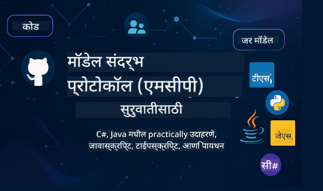

<!--
CO_OP_TRANSLATOR_METADATA:
{
  "original_hash": "2a21391378c12ecfef50f866329dfde0",
  "translation_date": "2025-05-17T05:21:35+00:00",
  "source_file": "README.md",
  "language_code": "mr"
}
-->

या संसाधनांचा वापर सुरू करण्यासाठी खालील पायऱ्या अनुसरा:
1. **रेपॉजिटरी फोर्क करा**: क्लिक करा 
2. **रेपॉजिटरी क्लोन करा**: `git clone https://github.com/microsoft/mcp-for-beginners.git`
3. [**Microsoft Azure AI Foundry Discord मध्ये सामील व्हा आणि तज्ञ व सहकारी विकसकांना भेटा**](https://discord.com/invite/ByRwuEEgH4)

### 🌐 बहुभाषिक समर्थन

#### GitHub Action द्वारे समर्थित (स्वयंचलित आणि नेहमी अद्ययावत)
[फ्रेंच](../fr/README.md) | [स्पॅनिश](../es/README.md) | [जर्मन](../de/README.md) | [रशियन](../ru/README.md) | [अरबी](../ar/README.md) | [पर्शियन (फारसी)](../fa/README.md) | [उर्दू](../ur/README.md) | [चायनीज (सरलीकृत)](../zh/README.md) | [चायनीज (पारंपारिक, मकाऊ)](../mo/README.md) | [चायनीज (पारंपारिक, हाँगकाँग)](../hk/README.md) | [चायनीज (पारंपारिक, तैवान)](../tw/README.md) | [जपानी](../ja/README.md) | [कोरियन](../ko/README.md) | [हिंदी](../hi/README.md) | [बंगाली](../bn/README.md) | [मराठी](./README.md) | [नेपाली](../ne/README.md) | [पंजाबी (गुरमुखी)](../pa/README.md) | [पोर्तुगीज (पोर्तुगाल)](../pt/README.md) | [पोर्तुगीज (ब्राझील)](../br/README.md) | [इटालियन](../it/README.md) | [पोलिश](../pl/README.md) | [तुर्की](../tr/README.md) | [ग्रीक](../el/README.md) | [थाई](../th/README.md) | [स्वीडिश](../sv/README.md) | [डॅनिश](../da/README.md) | [नॉर्वेजियन](../no/README.md) | [फिन्निश](../fi/README.md) | [डच](../nl/README.md) | [हिब्रू](../he/README.md) | [व्हिएतनामी](../vi/README.md) | [इंडोनेशियन](../id/README.md) | [मलय](../ms/README.md) | [टागालोग (फिलिपिनो)](../tl/README.md) | [स्वाहिली](../sw/README.md) | [हंगेरियन](../hu/README.md) | [चेक](../cs/README.md) | [स्लोव्हाक](../sk/README.md) | [रोमेनियन](../ro/README.md) | [बुल्गेरियन](../bg/README.md) | [सर्बियन (सिरिलिक)](../sr/README.md) | [क्रोएशियन](../hr/README.md) | [स्लोव्हेनियन](../sl/README.md)
# 🚀 नवशिक्यांसाठी मॉडेल संदर्भ प्रोटोकॉल (MCP) अभ्यासक्रमासाठी अंतिम मार्गदर्शक

## **C#, Java, JavaScript, Python, आणि TypeScript मध्ये कोड उदाहरणांसह MCP शिकणे**

## 🧠 मॉडेल संदर्भ प्रोटोकॉल अभ्यासक्रमाचे विहंगावलोकन

**मॉडेल संदर्भ प्रोटोकॉल (MCP)** हा एक अत्याधुनिक फ्रेमवर्क आहे जो AI मॉडेल्स आणि क्लायंट अनुप्रयोगांमधील संवादांचे मानकीकरण करण्यासाठी डिझाइन केला आहे. हा मुक्त-स्रोत अभ्यासक्रम एक संरचित शिकण्याचा मार्ग प्रदान करतो, जो C#, Java, JavaScript, TypeScript, आणि Python सारख्या लोकप्रिय प्रोग्रामिंग भाषांमध्ये व्यावहारिक कोडिंग उदाहरणे आणि वास्तववादी उपयोग प्रकरणांसह संपूर्ण आहे.

तुम्ही AI विकसक, प्रणाली आर्किटेक्ट किंवा सॉफ्टवेअर अभियंता असाल, तर MCP मूलतत्त्वे आणि अंमलबजावणी धोरणे मास्टर करण्यासाठी हे मार्गदर्शक तुमचे सर्वसमावेशक साधन आहे.

## 🔗 अधिकृत MCP संसाधने

- 📘 [MCP दस्तऐवजीकरण](https://modelcontextprotocol.io/) – सविस्तर ट्यूटोरियल्स आणि वापरकर्ता मार्गदर्शक  
- 📜 [MCP तपशील](https://spec.modelcontextprotocol.io/) – प्रोटोकॉल आर्किटेक्चर आणि तांत्रिक संदर्भ  
- 🧑‍💻 [MCP GitHub रिपॉझिटरी](https://github.com/modelcontextprotocol) – मुक्त-स्रोत SDKs, साधने, आणि कोड नमुने  

## 🧭 MCP अभ्यासक्रमाची संपूर्ण रचना

### 📌 [MCP परिचय](./00-Introduction/README.md)

- मॉडेल संदर्भ प्रोटोकॉल काय आहे?
- AI पाइपलाइन्समध्ये मानकीकरण का महत्त्वाचे आहे
- MCP चे व्यावहारिक उपयोग प्रकरणे आणि फायदे

### 🧩 [मूलभूत संकल्पना स्पष्ट केल्या](./01-CoreConcepts/README.md)

- MCP मध्ये क्लायंट-सर्व्हर आर्किटेक्चर समजून घेणे
- मुख्य प्रोटोकॉल घटक: विनंत्या, प्रतिसाद, आणि योजना
- MCP संदेशवहन आणि डेटा विनिमय नमुने

### 🔐 [MCP मध्ये सुरक्षा](./02-Security/readme.md)

- MCP आधारित प्रणालींमध्ये सुरक्षा धोके ओळखणे
- अंमलबजावणी सुरक्षित करण्यासाठी तंत्र आणि सर्वोत्तम पद्धती

### 🚀 [MCP सह सुरुवात](./03-GettingStarted/README.md)

- पर्यावरण सेटअप आणि कॉन्फिगरेशन
- मूलभूत MCP सर्व्हर्स आणि क्लायंट्स तयार करणे
- विद्यमान अनुप्रयोगांसह MCP समाकलित करणे

#### 🧮 MCP कॅल्क्युलेटर नमुना प्रकल्प:

  
<strong>भाषेनुसार कोड अंमलबजावणी एक्सप्लोर करा</strong>

  - [C# MCP सर्व्हर उदाहरण](./03-GettingStarted/samples/csharp/README.md)
  - [Java MCP कॅल्क्युलेटर](./03-GettingStarted/samples/java/calculator/README.md)
  - [JavaScript MCP डेमो](./03-GettingStarted/samples/javascript/README.md)
  - [Python MCP सर्व्हर](../../03-GettingStarted/samples/python/mcp_calculator_server.py)
  - [TypeScript MCP उदाहरण](./03-GettingStarted/samples/typescript/README.md)

### 🛠️ [व्यावहारिक अंमलबजावणी](./04-PracticalImplementation/README.md)

- विविध भाषांमधील SDKs वापरणे
- डीबगिंग, चाचणी, आणि प्रमाणीकरण
- पुनर्वापरयोग्य प्रॉम्प्ट टेम्पलेट्स आणि कार्यप्रवाह तयार करणे

#### 💡 MCP प्रगत कॅल्क्युलेटर प्रकल्प:

  
<strong>प्रगत नमुने एक्सप्लोर करा</strong>

  - [प्रगत C# नमुना](./04-PracticalImplementation/samples/csharp/README.md)
  - [Java कंटेनर अॅप उदाहरण](./04-PracticalImplementation/samples/java/containerapp/README.md)
  - [JavaScript प्रगत नमुना](./04-PracticalImplementation/samples/javascript/README.md)
  - [Python जटिल अंमलबजावणी](../../04-PracticalImplementation/samples/python/mcp_sample.py)
  - [TypeScript कंटेनर नमुना](./04-PracticalImplementation/samples/typescript/README.md)

### 🎓 [MCP मधील प्रगत विषय](./05-AdvancedTopics/README.md)

- मल्टी-मोडल AI कार्यप्रवाह आणि विस्तारयोग्यता
- सुरक्षित स्केलिंग धोरणे
- एंटरप्राइझ इकोसिस्टममधील MCP

### 🌍 [समुदाय योगदान](./06-CommunityContributions/README.md)

- कोड आणि दस्तऐवज कसे योगदान द्यावे
- GitHub द्वारे सहकार्य करणे
- समुदाय चालित सुधारणा आणि अभिप्राय

### 📈 [प्रारंभिक अवलंबनातून अंतर्दृष्टी](./07-CaseStudies/README.md)

- वास्तविक जगातील अंमलबजावणी आणि काय कार्य केले
- MCP आधारित उपाय तयार करणे आणि तैनात करणे
- ट्रेंड आणि भविष्यातील रोडमॅप

### 📏 [MCP साठी सर्वोत्तम पद्धती](./08-BestPractices/README.md)

- कार्यप्रदर्शन ट्यूनिंग आणि ऑप्टिमायझेशन
- दोष-सहिष्णु MCP प्रणाली डिझाइन करणे
- चाचणी आणि लवचिकता धोरणे

### 📊 [MCP केस स्टडीज](./09-CaseStudy/Readme.md)

- MCP समाधान आर्किटेक्चर्स मध्ये खोलवर जाणे
- तैनाती ब्लूप्रिंट्स आणि एकत्रीकरण टिप्स
- वर्णनात्मक आकृत्या आणि प्रकल्प वॉकथ्रू

## 🎯 MCP शिकण्यासाठी पूर्वतयारी

या अभ्यासक्रमाचा अधिकतम लाभ घेण्यासाठी, तुम्हाला आवश्यक आहे:

- C#, Java, किंवा Python चे मूलभूत ज्ञान
- क्लायंट-सर्व्हर मॉडेल आणि API चे आकलन
- (पर्यायी) मशीन लर्निंग संकल्पनांशी परिचितता

## 🛠️ या अभ्यासक्रमाचा प्रभावीपणे वापर कसा करावा

या मार्गदर्शकातील प्रत्येक धडा समाविष्ट करतो:

1. MCP संकल्पनांचे स्पष्ट स्पष्टीकरण  
2. विविध भाषांमध्ये लाइव्ह कोड उदाहरणे  
3. वास्तविक MCP अनुप्रयोग तयार करण्यासाठी सराव  
4. प्रगत शिकणाऱ्यांसाठी अतिरिक्त संसाधने  

## 📜 परवाना माहिती

हे सामग्री **MIT परवाना** अंतर्गत परवानाकृत आहे. अटी आणि शर्तींसाठी, [LICENSE](../../LICENSE) पहा.

## 🤝 योगदान मार्गदर्शक तत्त्वे

हा प्रकल्प योगदान आणि सूचना स्वागत करतो. बहुतेक योगदानांसाठी तुम्हाला योगदानकर्ता परवाना करार (CLA) सहमत होणे आवश्यक आहे ज्यामध्ये तुम्हाला अधिकार आहेत आणि प्रत्यक्षात आम्हाला तुमच्या योगदानाचा वापर करण्याचे अधिकार देण्याची घोषणा केली जाते. तपशीलांसाठी, <https://cla.opensource.microsoft.com> ला भेट द्या.

जेव्हा तुम्ही पुल विनंती सबमिट करता, तेव्हा CLA बॉट आपोआप ठरवेल की तुम्हाला CLA प्रदान करणे आवश्यक आहे की नाही आणि PR ला योग्यरित्या सजवेल (उदा., स्थिती तपासणी, टिप्पणी). बॉटद्वारे प्रदान केलेल्या सूचनांचे अनुसरण करा. तुम्हाला आमच्या CLA वापरणाऱ्या सर्व रिपॉझिटरींमध्ये हे फक्त एकदाच करणे आवश्यक आहे.

या प्रकल्पाने [Microsoft Open Source Code of Conduct](https://opensource.microsoft.com/codeofconduct/) स्वीकारला आहे. अधिक माहितीसाठी [Code of Conduct FAQ](https://opensource.microsoft.com/codeofconduct/faq/) पहा किंवा [opencode@microsoft.com](mailto:opencode@microsoft.com) वर कोणतेही अतिरिक्त प्रश्न किंवा टिप्पण्या पाठवा.

## ™️ ट्रेडमार्क सूचना

या प्रकल्पामध्ये प्रकल्प, उत्पादने किंवा सेवांसाठी ट्रेडमार्क किंवा लोगो असू शकतात. Microsoft ट्रेडमार्क किंवा लोगोच्या अधिकृत वापरास [Microsoft's Trademark & Brand Guidelines](https://www.microsoft.com/legal/intellectualproperty/trademarks/usage/general) चे पालन करणे आवश्यक आहे. या प्रकल्पाच्या सुधारित आवृत्त्यांमध्ये Microsoft ट्रेडमार्क किंवा लोगोचा वापर गोंधळ निर्माण करणार नाही किंवा Microsoft प्रायोजनाचा अर्थ लावणार नाही. तृतीय-पक्ष ट्रेडमार्क किंवा लोगोचा कोणताही वापर त्या तृतीय-पक्षाच्या धोरणांच्या अधीन आहे.

**अस्वीकरण**:  
हा दस्तऐवज AI भाषांतर सेवा [Co-op Translator](https://github.com/Azure/co-op-translator) वापरून अनुवादित करण्यात आला आहे. आम्ही अचूकतेसाठी प्रयत्नशील असलो तरी कृपया लक्षात ठेवा की स्वयंचलित भाषांतरे त्रुटी किंवा अशुद्धता असू शकतात. मूळ दस्तऐवज त्याच्या मूळ भाषेत प्रामाणिक स्त्रोत मानला पाहिजे. महत्त्वपूर्ण माहितीसाठी, व्यावसायिक मानवी भाषांतराची शिफारस केली जाते. या भाषांतराचा वापर करून उद्भवणाऱ्या कोणत्याही गैरसमज किंवा चुकीच्या अर्थासाठी आम्ही जबाबदार नाही.