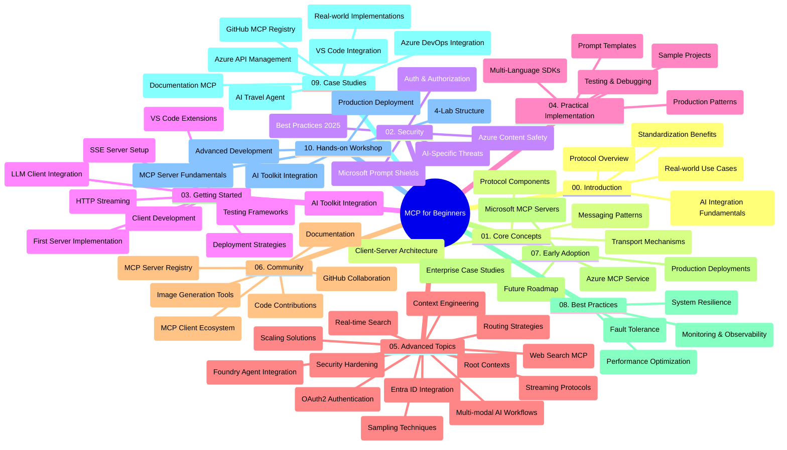

<!--
CO_OP_TRANSLATOR_METADATA:
{
  "original_hash": "719117a0a5f34ade7b5dfb61ee06fb13",
  "translation_date": "2025-09-26T18:05:57+00:00",
  "source_file": "study_guide.md",
  "language_code": "mr"
}
-->
# मॉडेल कॉन्टेक्स्ट प्रोटोकॉल (MCP) नवशिक्यांसाठी - अभ्यास मार्गदर्शक

हा अभ्यास मार्गदर्शक "मॉडेल कॉन्टेक्स्ट प्रोटोकॉल (MCP) नवशिक्यांसाठी" अभ्यासक्रमाच्या रिपॉझिटरीची रचना आणि सामग्रीचे विहंगावलोकन प्रदान करतो. रिपॉझिटरीमध्ये सहजपणे नेव्हिगेट करण्यासाठी आणि उपलब्ध संसाधनांचा अधिकाधिक उपयोग करण्यासाठी या मार्गदर्शकाचा वापर करा.

## रिपॉझिटरी विहंगावलोकन

मॉडेल कॉन्टेक्स्ट प्रोटोकॉल (MCP) हा AI मॉडेल्स आणि क्लायंट अ‍ॅप्लिकेशन्समधील संवादासाठी एक मानक फ्रेमवर्क आहे. सुरुवातीला Anthropic ने तयार केलेला MCP आता अधिकृत GitHub संघटनेद्वारे व्यापक MCP समुदायाद्वारे देखरेख केली जाते. या रिपॉझिटरीमध्ये C#, Java, JavaScript, Python, आणि TypeScript मधील कोड उदाहरणांसह व्यावहारिक अभ्यासक्रम प्रदान केला आहे, जो AI विकसक, प्रणाली आर्किटेक्ट्स आणि सॉफ्टवेअर अभियंते यांच्यासाठी डिझाइन केला आहे.

## व्हिज्युअल अभ्यासक्रम नकाशा

## रिपॉझिटरी रचना

रिपॉझिटरी दहा मुख्य विभागांमध्ये आयोजित केली आहे, प्रत्येक विभाग MCP च्या वेगवेगळ्या पैलूंवर लक्ष केंद्रित करतो:

1. **परिचय (00-Introduction/)**
   - मॉडेल कॉन्टेक्स्ट प्रोटोकॉलचे विहंगावलोकन
   - AI पाइपलाइन्समध्ये मानकीकरण का महत्त्वाचे आहे
   - व्यावहारिक उपयोग प्रकरणे आणि फायदे

2. **मूलभूत संकल्पना (01-CoreConcepts/)**
   - क्लायंट-सर्व्हर आर्किटेक्चर
   - मुख्य प्रोटोकॉल घटक
   - MCP मधील मेसेजिंग पॅटर्न

3. **सुरक्षा (02-Security/)**
   - MCP-आधारित प्रणालींमधील सुरक्षा धोके
   - अंमलबजावणी सुरक्षित करण्यासाठी सर्वोत्तम पद्धती
   - प्रमाणीकरण आणि अधिकृतता धोरणे
   - **संपूर्ण सुरक्षा दस्तऐवज**:
     - MCP सुरक्षा सर्वोत्तम पद्धती 2025
     - Azure सामग्री सुरक्षा अंमलबजावणी मार्गदर्शक
     - MCP सुरक्षा नियंत्रण आणि तंत्र
     - MCP सर्वोत्तम पद्धती जलद संदर्भ
   - **महत्त्वाचे सुरक्षा विषय**:
     - प्रॉम्प्ट इंजेक्शन आणि टूल विषबाधा हल्ले
     - सत्र हायजॅकिंग आणि गोंधळलेल्या डेप्युटी समस्या
     - टोकन पासथ्रू असुरक्षितता
     - अत्यधिक परवानग्या आणि प्रवेश नियंत्रण
     - AI घटकांसाठी पुरवठा साखळी सुरक्षा
     - Microsoft Prompt Shields एकत्रीकरण

4. **सुरुवात करणे (03-GettingStarted/)**
   - वातावरण सेटअप आणि कॉन्फिगरेशन
   - मूलभूत MCP सर्व्हर आणि क्लायंट तयार करणे
   - विद्यमान अ‍ॅप्लिकेशन्ससह एकत्रीकरण
   - समाविष्ट विभाग:
     - पहिली सर्व्हर अंमलबजावणी
     - क्लायंट विकास
     - LLM क्लायंट एकत्रीकरण
     - VS कोड एकत्रीकरण
     - सर्व्हर-सेंट इव्हेंट्स (SSE) सर्व्हर
     - HTTP स्ट्रीमिंग
     - AI टूलकिट एकत्रीकरण
     - चाचणी धोरणे
     - तैनाती मार्गदर्शक तत्त्वे

5. **व्यावहारिक अंमलबजावणी (04-PracticalImplementation/)**
   - विविध प्रोग्रामिंग भाषांमध्ये SDK वापरणे
   - डीबगिंग, चाचणी, आणि प्रमाणीकरण तंत्र
   - पुनर्वापरयोग्य प्रॉम्प्ट टेम्पलेट्स आणि वर्कफ्लो तयार करणे
   - अंमलबजावणी उदाहरणांसह नमुना प्रकल्प

6. **प्रगत विषय (05-AdvancedTopics/)**
   - कॉन्टेक्स्ट इंजिनिअरिंग तंत्र
   - फाउंड्री एजंट एकत्रीकरण
   - मल्टी-मोडल AI वर्कफ्लो
   - OAuth2 प्रमाणीकरण डेमो
   - रिअल-टाइम शोध क्षमता
   - रिअल-टाइम स्ट्रीमिंग
   - रूट कॉन्टेक्स्ट्स अंमलबजावणी
   - रूटिंग धोरणे
   - सॅम्पलिंग तंत्र
   - स्केलिंग दृष्टिकोन
   - सुरक्षा विचार
   - Entra ID सुरक्षा एकत्रीकरण
   - वेब शोध एकत्रीकरण

7. **समुदाय योगदान (06-CommunityContributions/)**
   - कोड आणि दस्तऐवज कसे योगदान द्यावे
   - GitHub द्वारे सहकार्य करणे
   - समुदाय-चालित सुधारणा आणि अभिप्राय
   - विविध MCP क्लायंट्स वापरणे (Claude Desktop, Cline, VSCode)
   - लोकप्रिय MCP सर्व्हर्ससह काम करणे ज्यामध्ये प्रतिमा निर्मिती समाविष्ट आहे

8. **प्रारंभिक स्वीकारण्याचे धडे (07-LessonsfromEarlyAdoption/)**
   - वास्तविक-जगातील अंमलबजावणी आणि यशोगाथा
   - MCP-आधारित उपाय तयार करणे आणि तैनात करणे
   - ट्रेंड्स आणि भविष्यातील रोडमॅप
   - **Microsoft MCP सर्व्हर्स मार्गदर्शक**: 10 उत्पादन-तयार Microsoft MCP सर्व्हर्ससाठी व्यापक मार्गदर्शक ज्यामध्ये समाविष्ट आहे:
     - Microsoft Learn Docs MCP Server
     - Azure MCP Server (15+ विशेषीकृत कनेक्टर्स)
     - GitHub MCP Server
     - Azure DevOps MCP Server
     - MarkItDown MCP Server
     - SQL Server MCP Server
     - Playwright MCP Server
     - Dev Box MCP Server
     - Azure AI Foundry MCP Server
     - Microsoft 365 Agents Toolkit MCP Server

9. **सर्वोत्तम पद्धती (08-BestPractices/)**
   - कार्यक्षमता ट्यूनिंग आणि ऑप्टिमायझेशन
   - दोष-सहिष्णु MCP प्रणाली डिझाइन करणे
   - चाचणी आणि लवचिकता धोरणे

10. **केस स्टडीज (09-CaseStudy/)**
    - **सात व्यापक केस स्टडीज** विविध परिस्थितींमध्ये MCP ची अष्टपैलूता दर्शवित आहेत:
    - **Azure AI Travel Agents**: Azure OpenAI आणि AI Search सह मल्टी-एजंट ऑर्केस्ट्रेशन
    - **Azure DevOps Integration**: YouTube डेटा अपडेट्ससह वर्कफ्लो प्रक्रिया स्वयंचलित करणे
    - **रिअल-टाइम दस्तऐवज पुनर्प्राप्ती**: स्ट्रीमिंग HTTP सह Python कन्सोल क्लायंट
    - **इंटरॅक्टिव स्टडी प्लॅन जनरेटर**: Chainlit वेब अ‍ॅप सह संवादात्मक AI
    - **इन-एडिटर दस्तऐवज**: GitHub Copilot वर्कफ्लो सह VS कोड एकत्रीकरण
    - **Azure API Management**: MCP सर्व्हर तयार करून एंटरप्राइझ API एकत्रीकरण
    - **GitHub MCP Registry**: इकोसिस्टम विकास आणि एजंटिक एकत्रीकरण प्लॅटफॉर्म
    - एंटरप्राइझ एकत्रीकरण, विकसक उत्पादकता, आणि इकोसिस्टम विकास यामध्ये अंमलबजावणी उदाहरणे

11. **हँड्स-ऑन कार्यशाळा (10-StreamliningAIWorkflowsBuildingAnMCPServerWithAIToolkit/)**
    - MCP सह AI टूलकिट एकत्रित करणारी व्यापक हँड्स-ऑन कार्यशाळा
    - वास्तविक-जगातील साधनांसह AI मॉडेल्स जोडणारे बुद्धिमान अ‍ॅप्लिकेशन्स तयार करणे
    - मूलभूत गोष्टी, सानुकूल सर्व्हर विकास, आणि उत्पादन तैनाती धोरणे कव्हर करणारे व्यावहारिक मॉड्यूल्स
    - **लॅब रचना**:
      - लॅब 1: MCP सर्व्हर मूलभूत गोष्टी
      - लॅब 2: प्रगत MCP सर्व्हर विकास
      - लॅब 3: AI टूलकिट एकत्रीकरण
      - लॅब 4: उत्पादन तैनाती आणि स्केलिंग
    - चरण-दर-चरण सूचना असलेला लॅब-आधारित शिक्षण दृष्टिकोन

## अतिरिक्त संसाधने

रिपॉझिटरीमध्ये समर्थन संसाधने समाविष्ट आहेत:

- **प्रतिमा फोल्डर**: अभ्यासक्रमभर वापरलेली आकृत्या आणि चित्रे समाविष्ट आहेत
- **अनुवाद**: दस्तऐवजांचे स्वयंचलित अनुवादांसह बहुभाषिक समर्थन
- **अधिकृत MCP संसाधने**:
  - [MCP दस्तऐवज](https://modelcontextprotocol.io/)
  - [MCP तपशील](https://spec.modelcontextprotocol.io/)
  - [MCP GitHub रिपॉझिटरी](https://github.com/modelcontextprotocol)

## या रिपॉझिटरीचा वापर कसा करावा

1. **क्रमिक शिक्षण**: संरचित शिक्षण अनुभवासाठी अध्याय क्रमाने (00 ते 10) अनुसरण करा.
2. **भाषा-विशिष्ट लक्ष केंद्रित**: तुम्हाला विशिष्ट प्रोग्रामिंग भाषेत रस असल्यास, तुमच्या पसंतीच्या भाषेतील अंमलबजावणीसाठी नमुना निर्देशिका एक्सप्लोर करा.
3. **व्यावहारिक अंमलबजावणी**: तुमचे वातावरण सेट अप करण्यासाठी आणि तुमचा पहिला MCP सर्व्हर आणि क्लायंट तयार करण्यासाठी "सुरुवात करणे" विभागासह प्रारंभ करा.
4. **प्रगत अन्वेषण**: मूलभूत गोष्टींमध्ये आरामदायक झाल्यानंतर, तुमचे ज्ञान वाढवण्यासाठी प्रगत विषयांमध्ये जा.
5. **समुदाय सहभाग**: GitHub चर्चांद्वारे आणि Discord चॅनेलद्वारे MCP समुदायामध्ये सामील व्हा, तज्ञ आणि सह-विकसकांशी कनेक्ट व्हा.

## MCP क्लायंट्स आणि साधने

अभ्यासक्रम विविध MCP क्लायंट्स आणि साधनांचा समावेश करतो:

1. **अधिकृत क्लायंट्स**:
   - Visual Studio Code 
   - MCP in Visual Studio Code
   - Claude Desktop
   - Claude in VSCode 
   - Claude API

2. **समुदाय क्लायंट्स**:
   - Cline (टर्मिनल-आधारित)
   - Cursor (कोड संपादक)
   - ChatMCP
   - Windsurf

3. **MCP व्यवस्थापन साधने**:
   - MCP CLI
   - MCP Manager
   - MCP Linker
   - MCP Router

## लोकप्रिय MCP सर्व्हर्स

रिपॉझिटरी विविध MCP सर्व्हर्सची ओळख करून देते, ज्यामध्ये समाविष्ट आहे:

1. **अधिकृत Microsoft MCP सर्व्हर्स**:
   - Microsoft Learn Docs MCP Server
   - Azure MCP Server (15+ विशेषीकृत कनेक्टर्स)
   - GitHub MCP Server
   - Azure DevOps MCP Server
   - MarkItDown MCP Server
   - SQL Server MCP Server
   - Playwright MCP Server
   - Dev Box MCP Server
   - Azure AI Foundry MCP Server
   - Microsoft 365 Agents Toolkit MCP Server

2. **अधिकृत संदर्भ सर्व्हर्स**:
   - Filesystem
   - Fetch
   - Memory
   - Sequential Thinking

3. **प्रतिमा निर्मिती**:
   - Azure OpenAI DALL-E 3
   - Stable Diffusion WebUI
   - Replicate

4. **विकास साधने**:
   - Git MCP
   - Terminal Control
   - Code Assistant

5. **विशेषीकृत सर्व्हर्स**:
   - Salesforce
   - Microsoft Teams
   - Jira & Confluence

## योगदान

ही रिपॉझिटरी समुदायाकडून योगदानांचे स्वागत करते. MCP इकोसिस्टममध्ये प्रभावीपणे योगदान कसे द्यावे यासाठी समुदाय योगदान विभाग पहा.

## बदलांचा इतिहास

| तारीख | बदल |
|------|---------|
| 26 सप्टेंबर, 2025 | - GitHub MCP Registry केस स्टडी 09-CaseStudy विभागात जोडले - सात व्यापक केस स्टडीज दर्शविण्यासाठी केस स्टडीज अद्यतनित केल्या - विशिष्ट अंमलबजावणी तपशीलांसह केस स्टडी वर्णने सुधारित केली - GitHub MCP Registry समाविष्ट करण्यासाठी व्हिज्युअल अभ्यासक्रम नकाशा अद्यतनित केला - इकोसिस्टम विकास लक्ष केंद्रित करण्यासाठी अभ्यास मार्गदर्शक रचना सुधारित केली |
| 18 जुलै, 2025 | - Microsoft MCP Servers Guide समाविष्ट करण्यासाठी रिपॉझिटरी रचना अद्यतनित केली - 10 उत्पादन-तयार Microsoft MCP सर्व्हर्सची व्यापक यादी जोडली - अधिकृत Microsoft MCP सर्व्हर्ससह लोकप्रिय MCP सर्व्हर्स विभाग सुधारित केला - वास्तविक फाइल उदाहरणांसह केस स्टडीज विभाग अद्यतनित केला - हँड्स-ऑन कार्यशाळेसाठी लॅब रचना तपशील जोडले |
| 16 जुलै, 2025 | - विद्यमान सामग्री प्रतिबिंबित करण्यासाठी रिपॉझिटरी रचना अद्यतनित केली - MCP क्लायंट्स आणि साधने विभाग जोडला - लोकप्रिय MCP सर्व्हर्स विभाग जोडला - विद्यमान विषयांसह व्हिज्युअल अभ्यासक्रम नकाशा अद्यतनित केला - सर्व प्रगत क्षेत्रांसह प्रगत विषय विभाग सुधारित केला - वास्तविक उदाहरणांसह केस स्टडीज अद्यतनित केल्या - MCP चा उगम Anthropic ने तयार केला असल्याचे स्पष्ट केले |
| 11 जून, 2025 | - अभ्यास मार्गदर्शकाची प्रारंभिक निर्मिती - व्हिज्युअल अभ्यासक्रम नकाशा जोडला - रिपॉझिटरी रचना रेखाटली - नमुना प्रकल्प आणि अतिरिक्त संसाधने समाविष्ट केली |

---

*हा अभ्यास मार्गदर्शक 26 सप्टेंबर, 2025 रोजी अद्यतनित केला गेला आणि त्या तारखेपर्यंतच्या रिपॉझिटरीचे विहंगावलोकन प्रदान करतो. त्या तारखेनंतर रिपॉझिटरी सामग्री अद्यतनित केली जाऊ शकते.*

---

