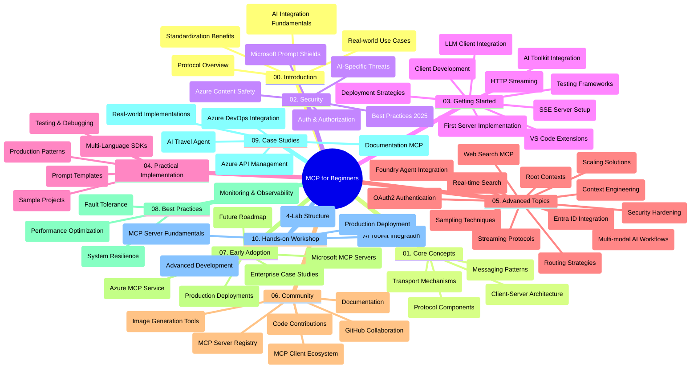

<!--
CO_OP_TRANSLATOR_METADATA:
{
  "original_hash": "e2c6ed897fa98fa08e0146101776c7ff",
  "translation_date": "2025-07-18T09:32:58+00:00",
  "source_file": "study_guide.md",
  "language_code": "mr"
}
-->
# Model Context Protocol (MCP) for Beginners - अभ्यास मार्गदर्शक

हा अभ्यास मार्गदर्शक "Model Context Protocol (MCP) for Beginners" अभ्यासक्रमासाठी रिपॉझिटरीची रचना आणि सामग्री याचा आढावा देतो. रिपॉझिटरीमध्ये सहजपणे नेव्हिगेट करण्यासाठी आणि उपलब्ध संसाधनांचा सर्वोत्तम वापर करण्यासाठी हा मार्गदर्शक वापरा.

## रिपॉझिटरीचा आढावा

Model Context Protocol (MCP) हा AI मॉडेल्स आणि क्लायंट अ‍ॅप्लिकेशन्समधील संवादासाठी एक मानकीकृत फ्रेमवर्क आहे. सुरुवातीला Anthropic ने तयार केलेला MCP आता अधिक व्यापक MCP समुदायाद्वारे अधिकृत GitHub संस्थेद्वारे देखभाल केला जातो. ही रिपॉझिटरी AI डेव्हलपर्स, सिस्टीम आर्किटेक्ट्स आणि सॉफ्टवेअर इंजिनियर्ससाठी C#, Java, JavaScript, Python, आणि TypeScript मध्ये हाताळणीसाठी कोड उदाहरणांसह एक संपूर्ण अभ्यासक्रम प्रदान करते.

## व्हिज्युअल अभ्यासक्रम नकाशा

## रिपॉझिटरीची रचना

रिपॉझिटरी दहा मुख्य विभागांमध्ये विभागलेली आहे, प्रत्येक विभाग MCP च्या वेगवेगळ्या पैलूंवर लक्ष केंद्रित करतो:

1. **Introduction (00-Introduction/)**
   - Model Context Protocol चे आढावा
   - AI पाइपलाइनमध्ये मानकीकरण का महत्त्वाचे आहे
   - व्यावहारिक वापर आणि फायदे

2. **Core Concepts (01-CoreConcepts/)**
   - क्लायंट-सर्व्हर आर्किटेक्चर
   - मुख्य प्रोटोकॉल घटक
   - MCP मधील मेसेजिंग पॅटर्न्स

3. **Security (02-Security/)**
   - MCP-आधारित प्रणालींमधील सुरक्षा धोके
   - सुरक्षित अंमलबजावणीसाठी सर्वोत्तम पद्धती
   - प्रमाणीकरण आणि अधिकृतता धोरणे
   - **संपूर्ण सुरक्षा दस्तऐवज**:
     - MCP Security Best Practices 2025
     - Azure Content Safety Implementation Guide
     - MCP Security Controls and Techniques
     - MCP Best Practices Quick Reference
   - **महत्त्वाचे सुरक्षा विषय**:
     - प्रॉम्प्ट इंजेक्शन आणि टूल पॉइझनिंग हल्ले
     - सेशन हायजॅकिंग आणि कन्फ्यूज्ड डेप्युटी समस्या
     - टोकन पासथ्रू असुरक्षितता
     - जास्त परवानग्या आणि प्रवेश नियंत्रण
     - AI घटकांसाठी सप्लाय चेन सुरक्षा
     - Microsoft Prompt Shields चे एकत्रीकरण

4. **Getting Started (03-GettingStarted/)**
   - पर्यावरण सेटअप आणि कॉन्फिगरेशन
   - मूलभूत MCP सर्व्हर आणि क्लायंट तयार करणे
   - विद्यमान अ‍ॅप्लिकेशन्ससह एकत्रीकरण
   - यामध्ये समाविष्ट विभाग:
     - पहिल्या सर्व्हरची अंमलबजावणी
     - क्लायंट विकास
     - LLM क्लायंट एकत्रीकरण
     - VS Code एकत्रीकरण
     - Server-Sent Events (SSE) सर्व्हर
     - HTTP स्ट्रीमिंग
     - AI Toolkit एकत्रीकरण
     - चाचणी धोरणे
     - तैनाती मार्गदर्शक

5. **Practical Implementation (04-PracticalImplementation/)**
   - विविध प्रोग्रामिंग भाषांमध्ये SDK वापरणे
   - डीबगिंग, चाचणी आणि प्रमाणीकरण तंत्रे
   - पुनर्वापरयोग्य प्रॉम्प्ट टेम्पलेट्स आणि वर्कफ्लोज तयार करणे
   - अंमलबजावणीसह नमुना प्रकल्प

6. **Advanced Topics (05-AdvancedTopics/)**
   - संदर्भ अभियांत्रिकी तंत्रे
   - Foundry एजंट एकत्रीकरण
   - मल्टी-मोडल AI वर्कफ्लोज
   - OAuth2 प्रमाणीकरण डेमो
   - रिअल-टाइम शोध क्षमता
   - रिअल-टाइम स्ट्रीमिंग
   - रूट संदर्भांची अंमलबजावणी
   - राउटिंग धोरणे
   - सॅम्पलिंग तंत्रे
   - स्केलिंग पद्धती
   - सुरक्षा विचार
   - Entra ID सुरक्षा एकत्रीकरण
   - वेब शोध एकत्रीकरण

7. **Community Contributions (06-CommunityContributions/)**
   - कोड आणि दस्तऐवज कसे योगदान द्यावे
   - GitHub द्वारे सहकार्य
   - समुदाय-चालित सुधारणा आणि अभिप्राय
   - विविध MCP क्लायंट्स वापरणे (Claude Desktop, Cline, VSCode)
   - लोकप्रिय MCP सर्व्हर्ससह काम करणे, ज्यात इमेज जनरेशन देखील आहे

8. **Lessons from Early Adoption (07-LessonsfromEarlyAdoption/)**
   - प्रत्यक्ष अंमलबजावणी आणि यशोगाथा
   - MCP-आधारित सोल्यूशन्स तयार करणे आणि तैनात करणे
   - ट्रेंड्स आणि भविष्यातील रोडमॅप
   - **Microsoft MCP Servers Guide**: 10 उत्पादनासाठी तयार Microsoft MCP सर्व्हर्ससाठी संपूर्ण मार्गदर्शक, ज्यात समाविष्ट आहेत:
     - Microsoft Learn Docs MCP Server
     - Azure MCP Server (15+ विशेष कनेक्टर्स)
     - GitHub MCP Server
     - Azure DevOps MCP Server
     - MarkItDown MCP Server
     - SQL Server MCP Server
     - Playwright MCP Server
     - Dev Box MCP Server
     - Azure AI Foundry MCP Server
     - Microsoft 365 Agents Toolkit MCP Server

9. **Best Practices (08-BestPractices/)**
   - कार्यक्षमता ट्यूनिंग आणि ऑप्टिमायझेशन
   - दोष सहनशील MCP प्रणाली डिझाइन करणे
   - चाचणी आणि टिकाऊपणा धोरणे

10. **Case Studies (09-CaseStudy/)**
    - Azure API Management एकत्रीकरण नमुना
    - ट्रॅव्हल एजंट अंमलबजावणी नमुना
    - Azure DevOps एकत्रीकरण YouTube अपडेटसह
    - दस्तऐवज MCP अंमलबजावणी उदाहरणे
    - सविस्तर दस्तऐवजासह अंमलबजावणी उदाहरणे

11. **Hands-on Workshop (10-StreamliningAIWorkflowsBuildingAnMCPServerWithAIToolkit/)**
    - MCP आणि AI Toolkit यांचा समावेश असलेले संपूर्ण व्यावहारिक कार्यशाळा
    - AI मॉडेल्स आणि प्रत्यक्ष जगातील साधने यांच्यात बुद्धिमान अ‍ॅप्लिकेशन्स तयार करणे
    - मूलभूत गोष्टी, कस्टम सर्व्हर विकास, आणि उत्पादन तैनाती धोरणे यांचा समावेश असलेले व्यावहारिक मॉड्यूल्स
    - **लॅब रचना**:
      - लॅब 1: MCP सर्व्हर मूलभूत तत्त्वे
      - लॅब 2: प्रगत MCP सर्व्हर विकास
      - लॅब 3: AI Toolkit एकत्रीकरण
      - लॅब 4: उत्पादन तैनाती आणि स्केलिंग
    - टप्प्याटप्प्याने मार्गदर्शित लॅब-आधारित शिक्षण पद्धत

## अतिरिक्त संसाधने

रिपॉझिटरीमध्ये सहाय्यक संसाधने समाविष्ट आहेत:

- **Images फोल्डर**: अभ्यासक्रमात वापरलेली आकृत्या आणि चित्रे
- **Translations**: दस्तऐवजांचे स्वयंचलित बहुभाषिक भाषांतर समर्थन
- **अधिकृत MCP संसाधने**:
  - [MCP Documentation](https://modelcontextprotocol.io/)
  - [MCP Specification](https://spec.modelcontextprotocol.io/)
  - [MCP GitHub Repository](https://github.com/modelcontextprotocol)

## ही रिपॉझिटरी कशी वापरावी

1. **क्रमिक शिक्षण**: अध्याय 00 ते 10 पर्यंत क्रमाने वाचा, ज्यामुळे संरचित शिक्षण मिळेल.
2. **भाषा-विशिष्ट लक्ष**: जर तुम्हाला एखाद्या विशिष्ट प्रोग्रामिंग भाषेत रस असेल, तर त्या भाषेतील अंमलबजावणीसाठी नमुना निर्देशिकांचा अभ्यास करा.
3. **व्यावहारिक अंमलबजावणी**: "Getting Started" विभागापासून सुरुवात करा, पर्यावरण सेटअप करा आणि तुमचा पहिला MCP सर्व्हर व क्लायंट तयार करा.
4. **प्रगत अभ्यास**: मूलभूत गोष्टी समजल्यावर प्रगत विषयांमध्ये खोलवर जा.
5. **समुदाय सहभाग**: GitHub चर्चा आणि Discord चॅनेल्सद्वारे MCP समुदायात सहभागी व्हा, तज्ञ आणि इतर डेव्हलपर्सशी संपर्क साधा.

## MCP क्लायंट्स आणि साधने

अभ्यासक्रमात विविध MCP क्लायंट्स आणि साधने समाविष्ट आहेत:

1. **अधिकृत क्लायंट्स**:
   - Visual Studio Code
   - MCP in Visual Studio Code
   - Claude Desktop
   - Claude in VSCode
   - Claude API

2. **समुदाय क्लायंट्स**:
   - Cline (टर्मिनल-आधारित)
   - Cursor (कोड एडिटर)
   - ChatMCP
   - Windsurf

3. **MCP व्यवस्थापन साधने**:
   - MCP CLI
   - MCP Manager
   - MCP Linker
   - MCP Router

## लोकप्रिय MCP सर्व्हर्स

रिपॉझिटरीमध्ये विविध MCP सर्व्हर्सची ओळख करून दिली आहे, ज्यात समाविष्ट आहेत:

1. **अधिकृत Microsoft MCP सर्व्हर्स**:
   - Microsoft Learn Docs MCP Server
   - Azure MCP Server (15+ विशेष कनेक्टर्स)
   - GitHub MCP Server
   - Azure DevOps MCP Server
   - MarkItDown MCP Server
   - SQL Server MCP Server
   - Playwright MCP Server
   - Dev Box MCP Server
   - Azure AI Foundry MCP Server
   - Microsoft 365 Agents Toolkit MCP Server

2. **अधिकृत संदर्भ सर्व्हर्स**:
   - Filesystem
   - Fetch
   - Memory
   - Sequential Thinking

3. **इमेज जनरेशन**:
   - Azure OpenAI DALL-E 3
   - Stable Diffusion WebUI
   - Replicate

4. **विकास साधने**:
   - Git MCP
   - Terminal Control
   - Code Assistant

5. **विशेषीकृत सर्व्हर्स**:
   - Salesforce
   - Microsoft Teams
   - Jira & Confluence

## योगदान देणे

ही रिपॉझिटरी समुदायाकडून योगदानांचे स्वागत करते. MCP परिसंस्थेसाठी प्रभावी योगदान कसे द्यावे यासाठी Community Contributions विभाग पहा.

## बदलनोंची नोंद

| तारीख | बदल |
|-------|-------|
| 18 जुलै, 2025 | - Microsoft MCP Servers Guide सह रिपॉझिटरी रचना अद्ययावत केली - 10 उत्पादनासाठी तयार Microsoft MCP सर्व्हर्सची संपूर्ण यादी जोडली - लोकप्रिय MCP सर्व्हर्स विभागात अधिकृत Microsoft MCP सर्व्हर्स समाविष्ट केले - Case Studies विभागात प्रत्यक्ष फाइल उदाहरणे अद्ययावत केली - Hands-on Workshop साठी लॅब रचना तपशील जोडले |
| 16 जुलै, 2025 | - वर्तमान सामग्री प्रतिबिंबित करण्यासाठी रिपॉझिटरी रचना अद्ययावत केली - MCP क्लायंट्स आणि साधने विभाग जोडले - लोकप्रिय MCP सर्व्हर्स विभाग जोडले - सर्व वर्तमान विषयांसह व्हिज्युअल अभ्यासक्रम नकाशा अद्ययावत केला - सर्व विशेष क्षेत्रांसह प्रगत विषय विभाग सुधारित केला - प्रत्यक्ष उदाहरणांसह Case Studies अद्ययावत केल्या - MCP ची सुरुवात Anthropic कडून झाली हे स्पष्ट केले |
| 11 जून, 2025 | - अभ्यास मार्गदर्शकाची प्राथमिक निर्मिती - व्हिज्युअल अभ्यासक्रम नकाशा जोडला - रिपॉझिटरी रचना मांडली - नमुना प्रकल्प आणि अतिरिक्त संसाधने समाविष्ट केली |

---

*हा अभ्यास मार्गदर्शक 18 जुलै, 2025 रोजी अद्ययावत करण्यात आला असून त्या तारखेपर्यंतच्या रिपॉझिटरीचा आढावा देतो. त्यानंतरची सामग्री अद्ययावत केली जाऊ शकते.*

**अस्वीकरण**:  
हा दस्तऐवज AI अनुवाद सेवा [Co-op Translator](https://github.com/Azure/co-op-translator) वापरून अनुवादित केला आहे. आम्ही अचूकतेसाठी प्रयत्न करतो, तरी कृपया लक्षात घ्या की स्वयंचलित अनुवादांमध्ये चुका किंवा अचूकतेचा अभाव असू शकतो. मूळ दस्तऐवज त्याच्या स्थानिक भाषेत अधिकृत स्रोत मानला जावा. महत्त्वाच्या माहितीसाठी व्यावसायिक मानवी अनुवाद करण्याची शिफारस केली जाते. या अनुवादाच्या वापरामुळे उद्भवलेल्या कोणत्याही गैरसमजुती किंवा चुकीच्या अर्थलागी आम्ही जबाबदार नाही.