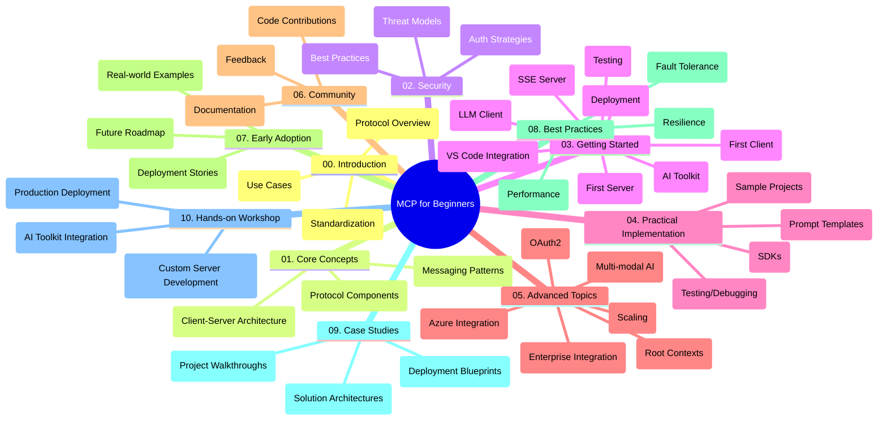

<!--
CO_OP_TRANSLATOR_METADATA:
{
  "original_hash": "a607d4febc94caee9a12b77795f7fc9a",
  "translation_date": "2025-07-13T15:12:31+00:00",
  "source_file": "study_guide.md",
  "language_code": "mr"
}
-->
# Model Context Protocol (MCP) for Beginners - अभ्यास मार्गदर्शक

हा अभ्यास मार्गदर्शक "Model Context Protocol (MCP) for Beginners" अभ्यासक्रमासाठी रिपॉझिटरीची रचना आणि सामग्री याचा आढावा देतो. या मार्गदर्शकाचा वापर करून तुम्ही रिपॉझिटरीमध्ये सहजपणे नेव्हिगेट करू शकता आणि उपलब्ध संसाधनांचा पूर्ण फायदा घेऊ शकता.

## रिपॉझिटरीचा आढावा

Model Context Protocol (MCP) हा AI मॉडेल्स आणि क्लायंट अ‍ॅप्लिकेशन्समधील संवादासाठी एक मानकीकृत फ्रेमवर्क आहे. ही रिपॉझिटरी C#, Java, JavaScript, Python, आणि TypeScript मध्ये हाताळणीसाठी कोड उदाहरणांसह एक व्यापक अभ्यासक्रम प्रदान करते, जो AI विकसक, सिस्टीम आर्किटेक्ट्स आणि सॉफ्टवेअर अभियंत्यांसाठी डिझाइन केलेला आहे.

## व्हिज्युअल अभ्यासक्रम नकाशा

## रिपॉझिटरीची रचना

रिपॉझिटरी दहा मुख्य विभागांमध्ये विभागलेली आहे, ज्यामध्ये MCP च्या विविध पैलूंवर लक्ष केंद्रित केले आहे:

1. **परिचय (00-Introduction/)**
   - Model Context Protocol चे आढावा
   - AI पाइपलाइनमध्ये मानकीकरण का महत्त्वाचे आहे
   - व्यावहारिक वापर आणि फायदे

2. **मूलभूत संकल्पना (01-CoreConcepts/)**
   - क्लायंट-सर्व्हर आर्किटेक्चर
   - मुख्य प्रोटोकॉल घटक
   - MCP मधील मेसेजिंग पॅटर्न्स

3. **सुरक्षा (02-Security/)**
   - MCP-आधारित प्रणालींमधील सुरक्षा धोके
   - सुरक्षित अंमलबजावणीसाठी सर्वोत्तम पद्धती
   - प्रमाणीकरण आणि अधिकृतता धोरणे

4. **प्रारंभ करणे (03-GettingStarted/)**
   - पर्यावरण सेटअप आणि कॉन्फिगरेशन
   - मूलभूत MCP सर्व्हर आणि क्लायंट तयार करणे
   - विद्यमान अ‍ॅप्लिकेशन्सशी एकत्रीकरण
   - पहिला सर्व्हर, पहिला क्लायंट, LLM क्लायंट, VS Code एकत्रीकरण, SSE सर्व्हर, AI Toolkit, चाचणी आणि तैनातीसाठी उपविभाग

5. **व्यावहारिक अंमलबजावणी (04-PracticalImplementation/)**
   - विविध प्रोग्रामिंग भाषांमध्ये SDK वापरणे
   - डीबगिंग, चाचणी आणि प्रमाणीकरण तंत्रे
   - पुनर्वापरासाठी योग्य प्रॉम्प्ट टेम्पलेट्स आणि वर्कफ्लोज तयार करणे
   - अंमलबजावणीसह नमुना प्रकल्प

6. **प्रगत विषय (05-AdvancedTopics/)**
   - मल्टी-मोडल AI वर्कफ्लोज आणि विस्तारक्षमता
   - सुरक्षित स्केलिंग धोरणे
   - एंटरप्राइझ इकोसिस्टममधील MCP
   - Azure एकत्रीकरण, मल्टी-मोडॅलिटी, OAuth2, रूट कॉन्टेक्स्ट्स, राउटिंग, सॅम्पलिंग, स्केलिंग, सुरक्षा, वेब सर्च एकत्रीकरण, आणि स्ट्रीमिंग यांसारखे विशेष विषय

7. **समुदाय योगदान (06-CommunityContributions/)**
   - कोड आणि दस्तऐवज कसे योगदान द्यायचे
   - GitHub द्वारे सहकार्य
   - समुदाय-चालित सुधारणा आणि अभिप्राय

8. **प्रारंभिक स्वीकारापासून शिकवण्या (07-LessonsfromEarlyAdoption/)**
   - प्रत्यक्ष अंमलबजावणी आणि यशोगाथा
   - MCP-आधारित सोल्यूशन्स तयार करणे आणि तैनात करणे
   - ट्रेंड्स आणि भविष्यातील रोडमॅप

9. **सर्वोत्तम पद्धती (08-BestPractices/)**
   - कार्यक्षमता ट्यूनिंग आणि ऑप्टिमायझेशन
   - दोष-प्रतिरोधक MCP प्रणाली डिझाइन करणे
   - चाचणी आणि टिकाऊपणा धोरणे

10. **केस स्टडीज (09-CaseStudy/)**
    - MCP सोल्यूशन आर्किटेक्चरचे सखोल विश्लेषण
    - तैनाती ब्लूप्रिंट्स आणि एकत्रीकरण टिप्स
    - टिप्पणीसहित आकृत्या आणि प्रकल्प मार्गदर्शन

11. **हाताळणी कार्यशाळा (10-StreamliningAIWorkflowsBuildingAnMCPServerWithAIToolkit/)**
    - Microsoft च्या AI Toolkit सह MCP चे संपूर्ण हाताळणी कार्यशाळा
    - AI मॉडेल्सना प्रत्यक्ष जगातील साधनांशी जोडणाऱ्या बुद्धिमान अ‍ॅप्लिकेशन्सची निर्मिती
    - मूलभूत गोष्टी, कस्टम सर्व्हर विकास, आणि उत्पादन तैनाती धोरणे यांचा समावेश असलेले व्यावहारिक मॉड्यूल्स

## नमुना प्रकल्प

रिपॉझिटरीमध्ये विविध प्रोग्रामिंग भाषांमध्ये MCP अंमलबजावणी दाखवणारे अनेक नमुना प्रकल्प आहेत:

### मूलभूत MCP कॅल्क्युलेटर नमुने
- C# MCP सर्व्हर उदाहरण
- Java MCP कॅल्क्युलेटर
- JavaScript MCP डेमो
- Python MCP सर्व्हर
- TypeScript MCP उदाहरण

### प्रगत MCP कॅल्क्युलेटर प्रकल्प
- प्रगत C# नमुना
- Java कंटेनर अ‍ॅप उदाहरण
- JavaScript प्रगत नमुना
- Python क्लिष्ट अंमलबजावणी
- TypeScript कंटेनर नमुना

## अतिरिक्त संसाधने

रिपॉझिटरीमध्ये सहाय्यक संसाधने समाविष्ट आहेत:

- **Images फोल्डर**: अभ्यासक्रमात वापरल्या गेलेल्या आकृत्या आणि चित्रे
- **Translations**: दस्तऐवजांचे स्वयंचलित बहुभाषिक अनुवाद
- **अधिकृत MCP संसाधने**:
  - [MCP Documentation](https://modelcontextprotocol.io/)
  - [MCP Specification](https://spec.modelcontextprotocol.io/)
  - [MCP GitHub Repository](https://github.com/modelcontextprotocol)

## या रिपॉझिटरीचा वापर कसा करावा

1. **क्रमिक शिक्षण**: 00 ते 10 पर्यंतच्या प्रकरणांचे अनुक्रमे पालन करा, ज्यामुळे संरचित शिक्षण अनुभव मिळेल.
2. **भाषा-विशिष्ट लक्ष**: जर तुम्हाला एखाद्या विशिष्ट प्रोग्रामिंग भाषेत रस असेल, तर त्या भाषेतील नमुना निर्देशिकांचा अभ्यास करा.
3. **व्यावहारिक अंमलबजावणी**: "Getting Started" विभागापासून सुरुवात करा, पर्यावरण सेटअप करा आणि तुमचा पहिला MCP सर्व्हर व क्लायंट तयार करा.
4. **प्रगत अन्वेषण**: मूलभूत गोष्टी समजल्यावर प्रगत विषयांमध्ये डुबकी मारा आणि तुमचे ज्ञान वाढवा.
5. **समुदाय सहभाग**: तज्ञ आणि इतर विकसकांशी जोडण्यासाठी [Azure AI Foundry Discord](https://discord.com/invite/ByRwuEEgH4) मध्ये सहभागी व्हा.

## योगदान देणे

ही रिपॉझिटरी समुदायाकडून योगदानांचे स्वागत करते. योगदान कसे द्यायचे यासाठी Community Contributions विभाग पहा.

---

*हा अभ्यास मार्गदर्शक 11 जून 2025 रोजी तयार करण्यात आला असून त्या तारखेपर्यंतच्या रिपॉझिटरीचा आढावा देतो. त्यानंतर रिपॉझिटरीची सामग्री अद्ययावत झाली असू शकते.*

**अस्वीकरण**:  
हा दस्तऐवज AI अनुवाद सेवा [Co-op Translator](https://github.com/Azure/co-op-translator) वापरून अनुवादित केला आहे. आम्ही अचूकतेसाठी प्रयत्नशील असलो तरी, कृपया लक्षात घ्या की स्वयंचलित अनुवादांमध्ये चुका किंवा अचूकतेची कमतरता असू शकते. मूळ दस्तऐवज त्याच्या स्थानिक भाषेत अधिकृत स्रोत मानला जावा. महत्त्वाच्या माहितीसाठी व्यावसायिक मानवी अनुवाद करण्याची शिफारस केली जाते. या अनुवादाच्या वापरामुळे उद्भवलेल्या कोणत्याही गैरसमजुती किंवा चुकीच्या अर्थलागी आम्ही जबाबदार नाही.