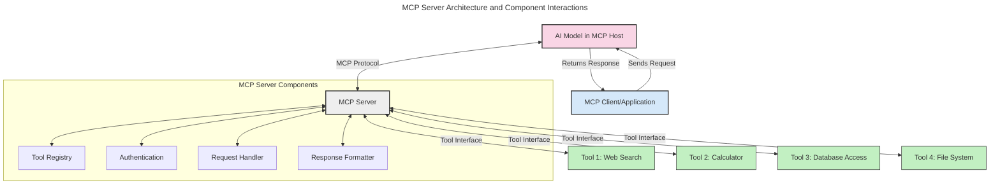
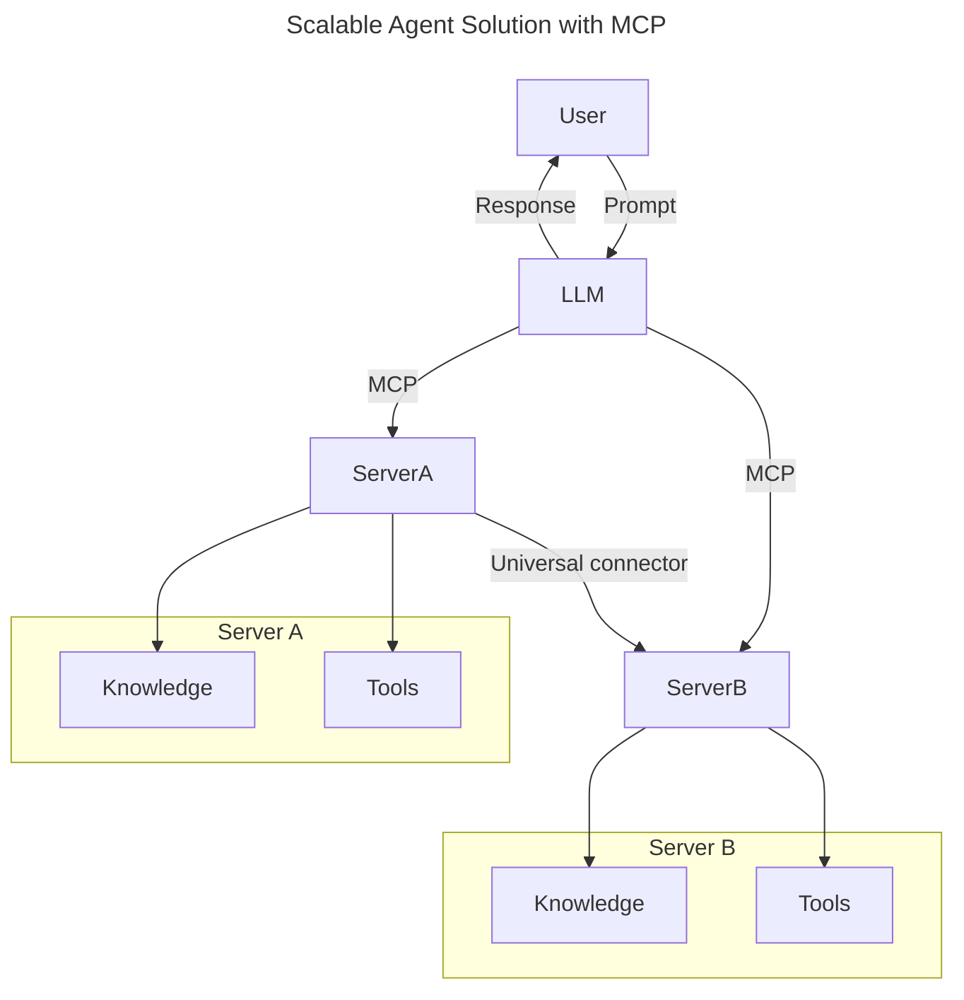
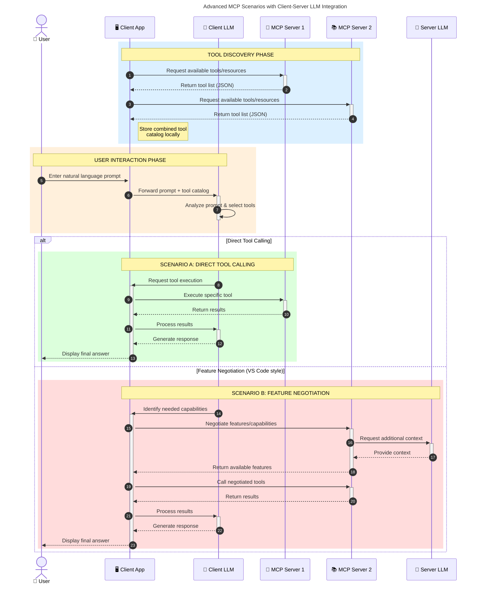

<!--
CO_OP_TRANSLATOR_METADATA:
{
  "original_hash": "105c2ddbb77bc38f7e9df009e1b06e45",
  "translation_date": "2025-07-04T18:12:30+00:00",
  "source_file": "00-Introduction/README.md",
  "language_code": "ms"
}
-->
# Pengenalan kepada Model Context Protocol (MCP): Mengapa Ia Penting untuk Aplikasi AI yang Boleh Diskala

Aplikasi AI generatif adalah satu langkah maju yang hebat kerana ia membolehkan pengguna berinteraksi dengan aplikasi menggunakan arahan bahasa semula jadi. Namun, apabila lebih banyak masa dan sumber dilaburkan dalam aplikasi sebegini, anda ingin memastikan anda boleh mengintegrasikan fungsi dan sumber dengan mudah supaya ia mudah dikembangkan, aplikasi anda boleh menyokong lebih daripada satu model digunakan, dan mengendalikan pelbagai kerumitan model. Ringkasnya, membina aplikasi Gen AI mudah pada permulaan, tetapi apabila ia berkembang dan menjadi lebih kompleks, anda perlu mula menentukan seni bina dan kemungkinan besar perlu bergantung pada piawaian untuk memastikan aplikasi anda dibina secara konsisten. Di sinilah MCP berperanan untuk mengatur dan menyediakan piawaian.

---

## **🔍 Apakah Model Context Protocol (MCP)?**

**Model Context Protocol (MCP)** adalah **antara muka terbuka dan piawai** yang membolehkan Large Language Models (LLMs) berinteraksi dengan lancar bersama alat luaran, API, dan sumber data. Ia menyediakan seni bina yang konsisten untuk meningkatkan fungsi model AI melebihi data latihan mereka, membolehkan sistem AI yang lebih pintar, boleh diskala, dan lebih responsif.

---

## **🎯 Mengapa Standardisasi dalam AI Penting**

Apabila aplikasi AI generatif menjadi lebih kompleks, adalah penting untuk mengamalkan piawaian yang memastikan **kebolehsikalaan, kebolehpengembangan**, dan **kebolehpengurusan**. MCP menangani keperluan ini dengan:

- Menyatukan integrasi model-alat
- Mengurangkan penyelesaian khusus yang rapuh dan sekali guna
- Membenarkan pelbagai model wujud dalam satu ekosistem

---

## **📚 Objektif Pembelajaran**

Menjelang akhir artikel ini, anda akan dapat:

- Mentakrifkan **Model Context Protocol (MCP)** dan kes penggunaannya
- Memahami bagaimana MCP menstandardkan komunikasi model-ke-alat
- Mengenal pasti komponen teras seni bina MCP
- Meneroka aplikasi dunia sebenar MCP dalam konteks perusahaan dan pembangunan

---

## **💡 Mengapa Model Context Protocol (MCP) Merupakan Perubahan Besar**

### **🔗 MCP Menyelesaikan Fragmentasi dalam Interaksi AI**

Sebelum MCP, mengintegrasikan model dengan alat memerlukan:

- Kod khusus untuk setiap pasangan alat-model
- API tidak piawai untuk setiap vendor
- Kerap terputus akibat kemas kini
- Kebolehsikalaan yang lemah dengan lebih banyak alat

### **✅ Manfaat Standardisasi MCP**

| **Manfaat**              | **Penerangan**                                                                |
|--------------------------|-------------------------------------------------------------------------------|
| Interoperabiliti         | LLM berfungsi lancar dengan alat dari vendor yang berbeza                     |
| Konsistensi              | Tingkah laku seragam merentasi platform dan alat                              |
| Kebolehgunaan Semula     | Alat yang dibina sekali boleh digunakan merentasi projek dan sistem           |
| Pembangunan Dipercepat   | Mengurangkan masa pembangunan dengan menggunakan antara muka piawai dan plug-and-play |

---

## **🧱 Gambaran Keseluruhan Seni Bina MCP Tahap Tinggi**

MCP mengikuti **model klien-pelayan**, di mana:

- **MCP Hosts** menjalankan model AI
- **MCP Clients** memulakan permintaan
- **MCP Servers** menyediakan konteks, alat, dan keupayaan

### **Komponen Utama:**

- **Resources** – Data statik atau dinamik untuk model  
- **Prompts** – Aliran kerja yang telah ditetapkan untuk penjanaan berpandu  
- **Tools** – Fungsi boleh laksana seperti carian, pengiraan  
- **Sampling** – Tingkah laku agen melalui interaksi berulang

---

## Cara MCP Servers Berfungsi

Pelayan MCP beroperasi dengan cara berikut:

- **Aliran Permintaan**:  
    1. MCP Client menghantar permintaan kepada Model AI yang berjalan di MCP Host.  
    2. Model AI mengenal pasti bila ia memerlukan alat atau data luaran.  
    3. Model berkomunikasi dengan MCP Server menggunakan protokol piawai.

- **Fungsi MCP Server**:  
    - Daftar Alat: Menyimpan katalog alat yang tersedia dan keupayaannya.  
    - Pengesahan: Mengesahkan kebenaran untuk akses alat.  
    - Pengendali Permintaan: Memproses permintaan alat yang diterima dari model.  
    - Penyusun Balasan: Menstrukturkan output alat dalam format yang difahami model.

- **Pelaksanaan Alat**:  
    - Pelayan menghala permintaan ke alat luaran yang sesuai  
    - Alat melaksanakan fungsi khusus mereka (carian, pengiraan, pertanyaan pangkalan data, dll.)  
    - Keputusan dikembalikan kepada model dalam format yang konsisten.

- **Penyempurnaan Balasan**:  
    - Model AI menggabungkan output alat ke dalam balasannya.  
    - Balasan akhir dihantar kembali ke aplikasi klien.

## 👨‍💻 Cara Membina MCP Server (Dengan Contoh)

Pelayan MCP membolehkan anda mengembangkan keupayaan LLM dengan menyediakan data dan fungsi.

Bersedia untuk mencuba? Berikut adalah contoh membuat pelayan MCP ringkas dalam pelbagai bahasa:

- **Contoh Python**: https://github.com/modelcontextprotocol/python-sdk

- **Contoh TypeScript**: https://github.com/modelcontextprotocol/typescript-sdk

- **Contoh Java**: https://github.com/modelcontextprotocol/java-sdk

- **Contoh C#/.NET**: https://github.com/modelcontextprotocol/csharp-sdk

## 🌍 Kes Penggunaan Dunia Sebenar untuk MCP

MCP membolehkan pelbagai aplikasi dengan mengembangkan keupayaan AI:

| **Aplikasi**               | **Penerangan**                                                                |
|----------------------------|-------------------------------------------------------------------------------|
| Integrasi Data Perusahaan  | Sambungkan LLM ke pangkalan data, CRM, atau alat dalaman                      |
| Sistem AI Agenik           | Membolehkan agen autonomi dengan akses alat dan aliran kerja membuat keputusan |
| Aplikasi Multi-modal       | Gabungkan teks, imej, dan alat audio dalam satu aplikasi AI yang bersatu      |
| Integrasi Data Masa Nyata  | Membawa data langsung ke dalam interaksi AI untuk output yang lebih tepat dan terkini |

### 🧠 MCP = Piawaian Universal untuk Interaksi AI

Model Context Protocol (MCP) bertindak sebagai piawaian universal untuk interaksi AI, sama seperti USB-C menstandardkan sambungan fizikal untuk peranti. Dalam dunia AI, MCP menyediakan antara muka konsisten, membolehkan model (klien) berintegrasi dengan lancar bersama alat luaran dan penyedia data (pelayan). Ini menghapuskan keperluan untuk protokol khusus yang pelbagai bagi setiap API atau sumber data.

Di bawah MCP, alat yang serasi MCP (dirujuk sebagai pelayan MCP) mengikuti piawaian yang bersatu. Pelayan ini boleh menyenaraikan alat atau tindakan yang mereka tawarkan dan melaksanakan tindakan tersebut apabila diminta oleh agen AI. Platform agen AI yang menyokong MCP mampu menemui alat yang tersedia dari pelayan dan memanggilnya melalui protokol piawai ini.

### 💡 Memudahkan Akses kepada Pengetahuan

Selain menawarkan alat, MCP juga memudahkan akses kepada pengetahuan. Ia membolehkan aplikasi menyediakan konteks kepada large language models (LLMs) dengan menghubungkannya kepada pelbagai sumber data. Contohnya, pelayan MCP mungkin mewakili repositori dokumen syarikat, membolehkan agen mengambil maklumat yang relevan mengikut permintaan. Pelayan lain boleh mengendalikan tindakan tertentu seperti menghantar emel atau mengemas kini rekod. Dari perspektif agen, ini hanyalah alat yang boleh digunakan—sesetengah alat mengembalikan data (konteks pengetahuan), manakala yang lain melaksanakan tindakan. MCP menguruskan kedua-duanya dengan cekap.

Agen yang menyambung ke pelayan MCP secara automatik mempelajari keupayaan dan data yang boleh diakses oleh pelayan melalui format piawai. Standardisasi ini membolehkan ketersediaan alat secara dinamik. Contohnya, menambah pelayan MCP baru ke sistem agen menjadikan fungsi pelayan tersebut boleh digunakan serta-merta tanpa memerlukan penyesuaian lanjut pada arahan agen.

Integrasi yang dipermudahkan ini selaras dengan aliran yang digambarkan dalam rajah mermaid, di mana pelayan menyediakan kedua-dua alat dan pengetahuan, memastikan kerjasama lancar merentasi sistem.

### 👉 Contoh: Penyelesaian Agen Boleh Diskala

### 🔄 Senario MCP Lanjutan dengan Integrasi LLM di Pihak Klien

Selain seni bina MCP asas, terdapat senario lanjutan di mana kedua-dua klien dan pelayan mengandungi LLM, membolehkan interaksi yang lebih canggih:

## 🔐 Manfaat Praktikal MCP

Berikut adalah manfaat praktikal menggunakan MCP:

- **Kesegaran**: Model boleh mengakses maklumat terkini melebihi data latihan mereka  
- **Pengembangan Keupayaan**: Model boleh menggunakan alat khusus untuk tugasan yang tidak dilatih  
- **Pengurangan Halusinasi**: Sumber data luaran menyediakan asas fakta  
- **Privasi**: Data sensitif boleh kekal dalam persekitaran selamat tanpa perlu disemat dalam arahan

## 📌 Perkara Penting

Berikut adalah perkara penting untuk menggunakan MCP:

- **MCP** menstandardkan cara model AI berinteraksi dengan alat dan data  
- Menggalakkan **kebolehpengembangan, konsistensi, dan interoperabiliti**  
- MCP membantu **mengurangkan masa pembangunan, meningkatkan kebolehpercayaan, dan mengembangkan keupayaan model**  
- Seni bina klien-pelayan **membolehkan aplikasi AI yang fleksibel dan boleh dikembangkan**

## 🧠 Latihan

Fikirkan tentang aplikasi AI yang anda berminat untuk bina.

- Alat atau data **luaran** manakah yang boleh meningkatkan keupayaannya?  
- Bagaimana MCP boleh menjadikan integrasi **lebih mudah dan boleh dipercayai?**

## Sumber Tambahan

- [MCP GitHub Repository](https://github.com/modelcontextprotocol)

## Apa seterusnya

Seterusnya: [Bab 1: Konsep Teras](../01-CoreConcepts/README.md)

**Penafian**:  
Dokumen ini telah diterjemahkan menggunakan perkhidmatan terjemahan AI [Co-op Translator](https://github.com/Azure/co-op-translator). Walaupun kami berusaha untuk ketepatan, sila ambil maklum bahawa terjemahan automatik mungkin mengandungi kesilapan atau ketidaktepatan. Dokumen asal dalam bahasa asalnya harus dianggap sebagai sumber yang sahih. Untuk maklumat penting, terjemahan profesional oleh manusia adalah disyorkan. Kami tidak bertanggungjawab atas sebarang salah faham atau salah tafsir yang timbul daripada penggunaan terjemahan ini.