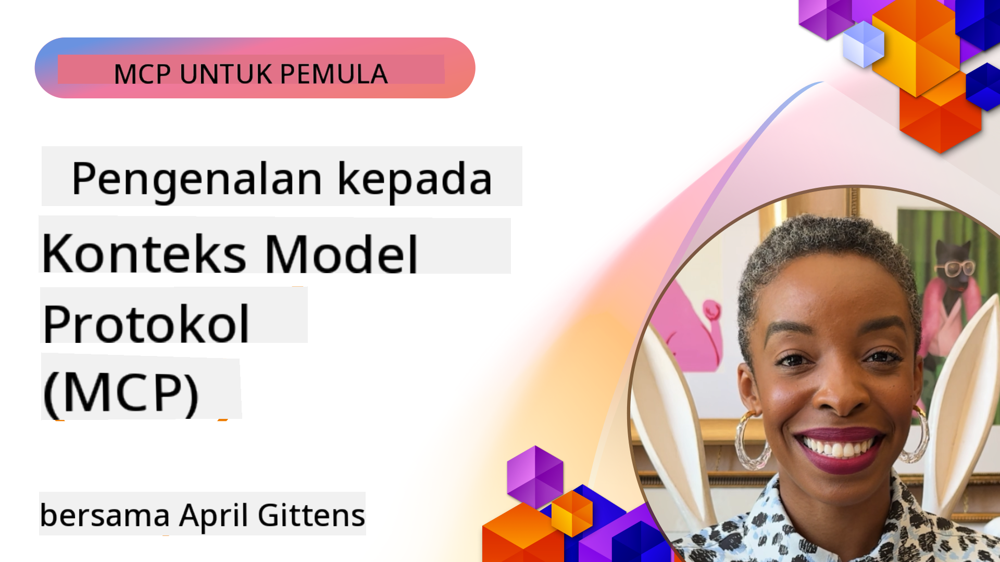
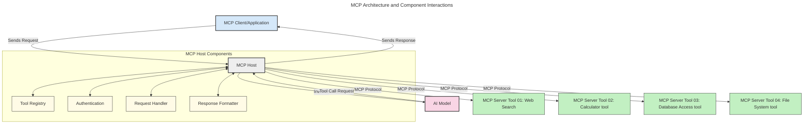
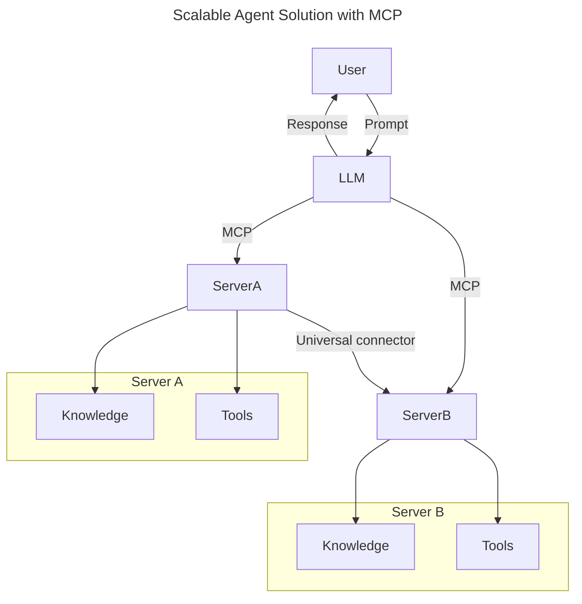
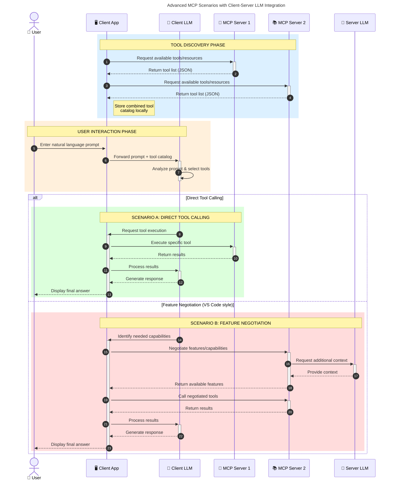

<!--
CO_OP_TRANSLATOR_METADATA:
{
  "original_hash": "0df1ee78a6dd8300f3a040ca5b411c2e",
  "translation_date": "2025-08-18T18:05:36+00:00",
  "source_file": "00-Introduction/README.md",
  "language_code": "ms"
}
-->
# Pengenalan kepada Protokol Konteks Model (MCP): Mengapa Ia Penting untuk Aplikasi AI yang Boleh Diskalakan

_(Klik imej di atas untuk menonton video pelajaran ini)_

Aplikasi AI generatif adalah satu langkah besar ke hadapan kerana ia sering membolehkan pengguna berinteraksi dengan aplikasi menggunakan arahan bahasa semula jadi. Walau bagaimanapun, apabila lebih banyak masa dan sumber dilaburkan dalam aplikasi seperti ini, anda ingin memastikan bahawa anda boleh mengintegrasikan fungsi dan sumber dengan mudah supaya ia mudah diperluaskan, aplikasi anda boleh menyokong lebih daripada satu model yang digunakan, dan mengendalikan pelbagai kerumitan model. Ringkasnya, membina aplikasi AI generatif adalah mudah untuk dimulakan, tetapi apabila ia berkembang dan menjadi lebih kompleks, anda perlu mula menentukan seni bina dan mungkin memerlukan standard untuk memastikan aplikasi anda dibina dengan cara yang konsisten. Di sinilah MCP memainkan peranan untuk mengatur perkara dan menyediakan standard.

---

## **🔍 Apa Itu Protokol Konteks Model (MCP)?**

**Protokol Konteks Model (MCP)** adalah **antara muka terbuka dan standard** yang membolehkan Model Bahasa Besar (LLM) berinteraksi dengan lancar dengan alat luaran, API, dan sumber data. Ia menyediakan seni bina yang konsisten untuk meningkatkan fungsi model AI di luar data latihannya, membolehkan sistem AI yang lebih pintar, boleh diskalakan, dan lebih responsif.

---

## **🎯 Mengapa Standardisasi dalam AI Penting**

Apabila aplikasi AI generatif menjadi lebih kompleks, adalah penting untuk mengguna pakai standard yang memastikan **kebolehskalaan, kebolehluasan, kebolehselenggaraan,** dan **mengelakkan penguncian vendor**. MCP memenuhi keperluan ini dengan:

- Menyatukan integrasi model-alat
- Mengurangkan penyelesaian tersuai yang rapuh
- Membolehkan pelbagai model daripada vendor yang berbeza wujud dalam satu ekosistem

**Nota:** Walaupun MCP mempromosikan dirinya sebagai standard terbuka, tiada rancangan untuk menstandardkan MCP melalui mana-mana badan standard sedia ada seperti IEEE, IETF, W3C, ISO, atau mana-mana badan standard lain.

---

## **📚 Objektif Pembelajaran**

Menjelang akhir artikel ini, anda akan dapat:

- Mendefinisikan **Protokol Konteks Model (MCP)** dan kegunaannya
- Memahami bagaimana MCP menstandardkan komunikasi model-ke-alat
- Mengenal pasti komponen utama seni bina MCP
- Meneroka aplikasi dunia sebenar MCP dalam konteks perusahaan dan pembangunan

---

## **💡 Mengapa Protokol Konteks Model (MCP) Merupakan Perubahan Besar**

### **🔗 MCP Menyelesaikan Fragmentasi dalam Interaksi AI**

Sebelum MCP, integrasi model dengan alat memerlukan:

- Kod tersuai untuk setiap pasangan alat-model
- API tidak standard untuk setiap vendor
- Kerap berlaku gangguan akibat kemas kini
- Kebolehskalaan yang lemah dengan lebih banyak alat

### **✅ Kelebihan Standardisasi MCP**

| **Kelebihan**             | **Penerangan**                                                                 |
|---------------------------|-------------------------------------------------------------------------------|
| Kebolehoperasian          | LLM berfungsi dengan lancar dengan alat daripada pelbagai vendor              |
| Konsistensi               | Tingkah laku seragam merentasi platform dan alat                              |
| Kebolehgunaan semula      | Alat yang dibina sekali boleh digunakan merentasi projek dan sistem           |
| Pembangunan yang dipercepat| Mengurangkan masa pembangunan dengan antara muka standard plug-and-play       |

---

## **🧱 Gambaran Keseluruhan Seni Bina MCP**

MCP mengikuti model **klien-pelayan**, di mana:

- **Hos MCP** menjalankan model AI
- **Klien MCP** memulakan permintaan
- **Pelayan MCP** menyediakan konteks, alat, dan keupayaan

### **Komponen Utama:**

- **Sumber** – Data statik atau dinamik untuk model  
- **Arahan** – Aliran kerja yang telah ditetapkan untuk penjanaan berpandu  
- **Alat** – Fungsi boleh laksana seperti carian, pengiraan  
- **Pensampelan** – Tingkah laku agen melalui interaksi berulang  

---

## Bagaimana Pelayan MCP Berfungsi

Pelayan MCP beroperasi dengan cara berikut:

- **Aliran Permintaan**:
    1. Permintaan dimulakan oleh pengguna akhir atau perisian yang bertindak bagi pihak mereka.
    2. **Klien MCP** menghantar permintaan kepada **Hos MCP**, yang menguruskan runtime Model AI.
    3. **Model AI** menerima arahan pengguna dan mungkin meminta akses kepada alat atau data luaran melalui satu atau lebih panggilan alat.
    4. **Hos MCP**, bukan model secara langsung, berkomunikasi dengan **Pelayan MCP** yang sesuai menggunakan protokol standard.
- **Fungsi Hos MCP**:
    - **Pendaftaran Alat**: Menyimpan katalog alat yang tersedia dan keupayaannya.
    - **Pengesahan**: Mengesahkan kebenaran untuk akses alat.
    - **Pengendali Permintaan**: Memproses permintaan alat yang masuk daripada model.
    - **Pemformat Respons**: Menstrukturkan output alat dalam format yang boleh difahami oleh model.
- **Pelaksanaan Pelayan MCP**:
    - **Hos MCP** mengarahkan panggilan alat kepada satu atau lebih **Pelayan MCP**, setiap satu mendedahkan fungsi khusus (contohnya, carian, pengiraan, pertanyaan pangkalan data).
    - **Pelayan MCP** melaksanakan operasi masing-masing dan mengembalikan hasil kepada **Hos MCP** dalam format yang konsisten.
    - **Hos MCP** memformat dan menyampaikan hasil ini kepada **Model AI**.
- **Penyelesaian Respons**:
    - **Model AI** menggabungkan output alat ke dalam respons akhir.
    - **Hos MCP** menghantar respons ini kembali kepada **Klien MCP**, yang menyampaikannya kepada pengguna akhir atau perisian pemanggil.

## 👨‍💻 Cara Membina Pelayan MCP (Dengan Contoh)

Pelayan MCP membolehkan anda memperluaskan keupayaan LLM dengan menyediakan data dan fungsi.

Sedia mencubanya? Berikut adalah SDK khusus bahasa dan/atau tumpukan dengan contoh membina pelayan MCP mudah dalam pelbagai bahasa/tumpukan:

- **Python SDK**: https://github.com/modelcontextprotocol/python-sdk

- **TypeScript SDK**: https://github.com/modelcontextprotocol/typescript-sdk

- **Java SDK**: https://github.com/modelcontextprotocol/java-sdk

- **C#/.NET SDK**: https://github.com/modelcontextprotocol/csharp-sdk

---

## 🌍 Aplikasi Dunia Sebenar untuk MCP

MCP membolehkan pelbagai aplikasi dengan memperluaskan keupayaan AI:

| **Aplikasi**               | **Penerangan**                                                                 |
|----------------------------|-------------------------------------------------------------------------------|
| Integrasi Data Perusahaan  | Menyambungkan LLM kepada pangkalan data, CRM, atau alat dalaman               |
| Sistem AI Agen             | Membolehkan agen autonomi dengan akses alat dan aliran kerja membuat keputusan|
| Aplikasi Multi-modal       | Menggabungkan teks, imej, dan alat audio dalam satu aplikasi AI yang bersatu  |
| Integrasi Data Masa Nyata  | Membawa data langsung ke dalam interaksi AI untuk output yang lebih tepat dan terkini |

---

### 🧠 MCP = Standard Universal untuk Interaksi AI

Protokol Konteks Model (MCP) bertindak sebagai standard universal untuk interaksi AI, seperti bagaimana USB-C menstandardkan sambungan fizikal untuk peranti. Dalam dunia AI, MCP menyediakan antara muka yang konsisten, membolehkan model (klien) berintegrasi dengan lancar dengan alat luaran dan penyedia data (pelayan). Ini menghapuskan keperluan untuk protokol tersuai yang pelbagai untuk setiap API atau sumber data.

Di bawah MCP, alat yang serasi dengan MCP (dirujuk sebagai pelayan MCP) mengikuti standard yang bersatu. Pelayan ini boleh menyenaraikan alat atau tindakan yang mereka tawarkan dan melaksanakan tindakan tersebut apabila diminta oleh agen AI. Platform agen AI yang menyokong MCP mampu menemui alat yang tersedia daripada pelayan dan memanggilnya melalui protokol standard ini.

---

### 💡 Memudahkan akses kepada pengetahuan

Selain menawarkan alat, MCP juga memudahkan akses kepada pengetahuan. Ia membolehkan aplikasi menyediakan konteks kepada model bahasa besar (LLM) dengan menghubungkannya kepada pelbagai sumber data. Sebagai contoh, pelayan MCP mungkin mewakili repositori dokumen syarikat, membolehkan agen mendapatkan maklumat yang relevan atas permintaan. Pelayan lain boleh mengendalikan tindakan tertentu seperti menghantar e-mel atau mengemas kini rekod. Dari perspektif agen, ini hanyalah alat yang boleh digunakan—sesetengah alat mengembalikan data (konteks pengetahuan), manakala yang lain melaksanakan tindakan. MCP menguruskan kedua-duanya dengan cekap.

Agen yang menyambung kepada pelayan MCP secara automatik mempelajari keupayaan yang tersedia dan data yang boleh diakses pelayan melalui format standard. Standardisasi ini membolehkan ketersediaan alat dinamik. Sebagai contoh, menambah pelayan MCP baharu kepada sistem agen menjadikan fungsinya boleh digunakan dengan segera tanpa memerlukan penyesuaian lanjut pada arahan agen.

Integrasi yang dipermudahkan ini sejajar dengan aliran yang digambarkan dalam rajah berikut, di mana pelayan menyediakan alat dan pengetahuan, memastikan kerjasama yang lancar merentasi sistem.

---

### 👉 Contoh: Penyelesaian Agen yang Boleh Diskalakan

---

### 🔄 Senario MCP Lanjutan dengan Integrasi LLM di Pihak Klien

Selain seni bina MCP asas, terdapat senario lanjutan di mana kedua-dua klien dan pelayan mengandungi LLM, membolehkan interaksi yang lebih canggih. Dalam rajah berikut, **Aplikasi Klien** boleh menjadi IDE dengan beberapa alat MCP yang tersedia untuk digunakan oleh LLM:

---

## 🔐 Manfaat Praktikal MCP

Berikut adalah manfaat praktikal menggunakan MCP:

- **Kesegaran**: Model boleh mengakses maklumat terkini di luar data latihannya
- **Peluasan Keupayaan**: Model boleh memanfaatkan alat khusus untuk tugas yang tidak dilatih
- **Pengurangan Halusinasi**: Sumber data luaran menyediakan asas fakta
- **Privasi**: Data sensitif boleh kekal dalam persekitaran yang selamat dan tidak dimasukkan dalam arahan

---

## 📌 Poin Penting

Berikut adalah poin penting untuk menggunakan MCP:

- **MCP** menstandardkan cara model AI berinteraksi dengan alat dan data
- Menggalakkan **kebolehluasan, konsistensi, dan kebolehoperasian**
- MCP membantu **mengurangkan masa pembangunan, meningkatkan kebolehpercayaan, dan memperluaskan keupayaan model**
- Seni bina klien-pelayan **memungkinkan aplikasi AI yang fleksibel dan boleh diperluaskan**

---

## 🧠 Latihan

Fikirkan tentang aplikasi AI yang anda berminat untuk bina.

- Alat atau data **luaran** mana yang boleh meningkatkan keupayaannya?
- Bagaimana MCP boleh menjadikan integrasi **lebih mudah dan boleh dipercayai?**

---

## Sumber Tambahan

- [Repositori GitHub MCP](https://github.com/modelcontextprotocol)

---

## Apa Seterusnya

Seterusnya: [Bab 1: Konsep Teras](../01-CoreConcepts/README.md)

**Penafian**:  
Dokumen ini telah diterjemahkan menggunakan perkhidmatan terjemahan AI [Co-op Translator](https://github.com/Azure/co-op-translator). Walaupun kami berusaha untuk memastikan ketepatan, sila ambil maklum bahawa terjemahan automatik mungkin mengandungi kesilapan atau ketidaktepatan. Dokumen asal dalam bahasa asalnya harus dianggap sebagai sumber yang berwibawa. Untuk maklumat penting, terjemahan manusia profesional adalah disyorkan. Kami tidak bertanggungjawab atas sebarang salah faham atau salah tafsir yang timbul daripada penggunaan terjemahan ini.