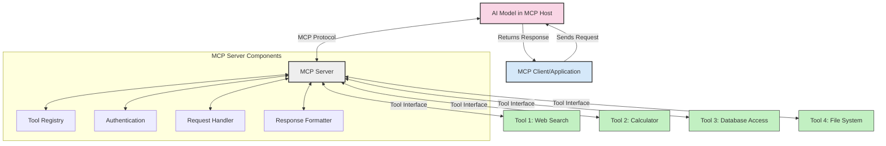
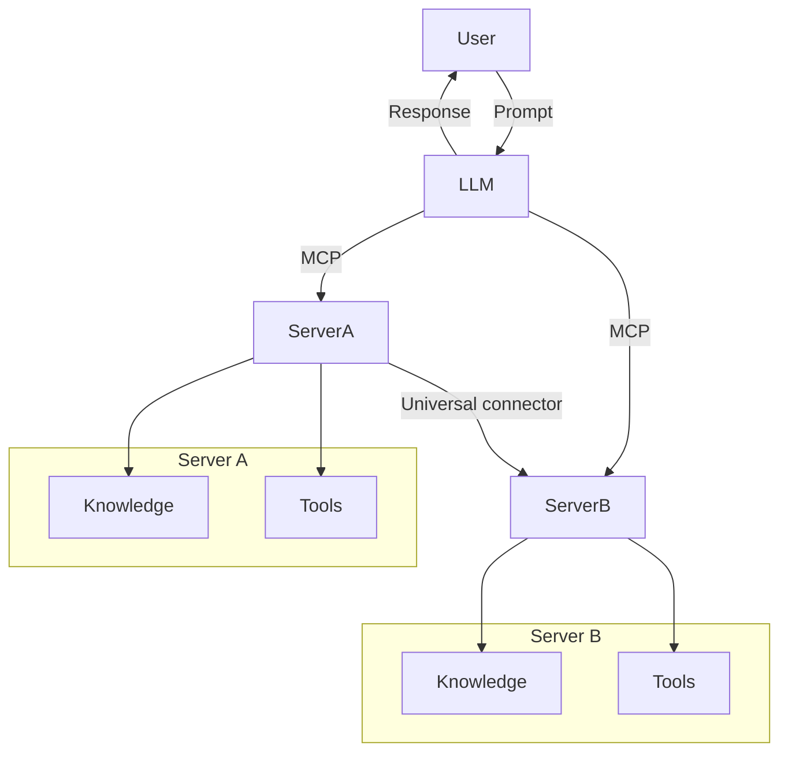

<!--
CO_OP_TRANSLATOR_METADATA:
{
  "original_hash": "02301140adbd807ecf0f17720fa307bc",
  "translation_date": "2025-05-17T06:06:17+00:00",
  "source_file": "00-Introduction/README.md",
  "language_code": "ms"
}
-->
# Pengenalan kepada Protokol Konteks Model (MCP): Mengapa Ia Penting untuk Aplikasi AI yang Boleh Diskalakan

Aplikasi AI generatif adalah satu langkah besar ke hadapan kerana ia sering membolehkan pengguna berinteraksi dengan aplikasi menggunakan arahan bahasa semula jadi. Walau bagaimanapun, apabila lebih banyak masa dan sumber dilaburkan dalam aplikasi tersebut, anda ingin memastikan anda boleh mengintegrasikan fungsi dan sumber dengan mudah supaya ia mudah untuk diperluas, bahawa aplikasi anda boleh memenuhi lebih daripada satu model yang digunakan, dan kerumitannya. Ringkasnya, membina aplikasi Gen AI adalah mudah untuk dimulakan tetapi apabila ia berkembang dan menjadi lebih kompleks, anda perlu mula mentakrifkan seni bina dan kemungkinan besar akan memerlukan piawaian untuk memastikan aplikasi anda dibina dengan cara yang konsisten. Di sinilah MCP datang untuk mengatur perkara, untuk menyediakan piawaian.

---

## **🔍 Apakah Protokol Konteks Model (MCP)?**

**Protokol Konteks Model (MCP)** ialah **antara muka terbuka dan piawai** yang membolehkan Model Bahasa Besar (LLM) berinteraksi dengan lancar dengan alat, API, dan sumber data luaran. Ia menyediakan seni bina yang konsisten untuk meningkatkan fungsi model AI melebihi data latihan mereka, membolehkan sistem AI yang lebih pintar, boleh diskalakan, dan lebih responsif.

---

## **🎯 Mengapa Standardisasi dalam AI Penting**

Apabila aplikasi AI generatif menjadi lebih kompleks, adalah penting untuk menerima pakai piawaian yang memastikan **skalabiliti, kebolehluasan**, dan **kebolehkekalan**. MCP menangani keperluan ini dengan:

- Menyatukan integrasi alat-model
- Mengurangkan penyelesaian khusus yang rapuh dan satu kali
- Membolehkan pelbagai model wujud dalam satu ekosistem

---

## **📚 Objektif Pembelajaran**

Pada akhir artikel ini, anda akan dapat:

- Mentakrifkan **Protokol Konteks Model (MCP)** dan kes penggunaan
- Memahami bagaimana MCP menstandardkan komunikasi model-ke-alat
- Mengenal pasti komponen teras seni bina MCP
- Meneroka aplikasi dunia nyata MCP dalam konteks perusahaan dan pembangunan

---

## **💡 Mengapa Protokol Konteks Model (MCP) Adalah Pengubah Permainan**

### **🔗 MCP Menyelesaikan Pemecahan dalam Interaksi AI**

Sebelum MCP, mengintegrasikan model dengan alat memerlukan:

- Kod khusus untuk setiap pasangan alat-model
- API tidak piawai untuk setiap vendor
- Gangguan kerap disebabkan oleh kemas kini
- Skalabiliti yang lemah dengan lebih banyak alat

### **✅ Manfaat Standardisasi MCP**

| **Manfaat**               | **Penerangan**                                                                |
|---------------------------|--------------------------------------------------------------------------------|
| Interoperabiliti          | LLM berfungsi dengan lancar dengan alat merentasi pelbagai vendor             |
| Konsistensi               | Tingkah laku seragam merentasi platform dan alat                              |
| Kebolehgunaan Semula      | Alat yang dibina sekali boleh digunakan merentasi projek dan sistem           |
| Pembangunan Dipercepat    | Mengurangkan masa pembangunan dengan menggunakan antara muka piawai dan sedia pasang |

---

## **🧱 Tinjauan Seni Bina MCP Peringkat Tinggi**

MCP mengikuti model **klien-pelayan**, di mana:

- **Hos MCP** menjalankan model AI
- **Klien MCP** memulakan permintaan
- **Pelayan MCP** menyediakan konteks, alat, dan keupayaan

### **Komponen Utama:**

- **Sumber** – Data statik atau dinamik untuk model  
- **Arahan** – Aliran kerja prapasti untuk penjanaan berpanduan  
- **Alat** – Fungsi boleh laksana seperti carian, pengiraan  
- **Pensampelan** – Tingkah laku agen melalui interaksi berulang

---

## Bagaimana Pelayan MCP Berfungsi

Pelayan MCP beroperasi dengan cara berikut:

- **Aliran Permintaan**: 
    1. Klien MCP menghantar permintaan kepada Model AI yang berjalan di Hos MCP.
    2. Model AI mengenal pasti bila ia memerlukan alat atau data luaran.
    3. Model berkomunikasi dengan Pelayan MCP menggunakan protokol piawai.

- **Fungsi Pelayan MCP**:
    - Daftar Alat: Menyimpan katalog alat yang tersedia dan keupayaan mereka.
    - Pengesahan: Mengesahkan kebenaran untuk akses alat.
    - Pengendali Permintaan: Memproses permintaan alat yang masuk dari model.
    - Pemformat Respons: Menyusun keluaran alat dalam format yang boleh difahami oleh model.

- **Pelaksanaan Alat**: 
    - Pelayan mengarahkan permintaan kepada alat luaran yang sesuai
    - Alat melaksanakan fungsi khusus mereka (carian, pengiraan, pertanyaan pangkalan data, dll.)
    - Keputusan dikembalikan kepada model dalam format yang konsisten.

- **Penyelesaian Respons**: 
    - Model AI menggabungkan keluaran alat ke dalam responsnya.
    - Respons akhir dihantar kembali kepada aplikasi klien.

## 👨‍💻 Cara Membina Pelayan MCP (Dengan Contoh)

Pelayan MCP membolehkan anda memperluas keupayaan LLM dengan menyediakan data dan fungsi. 

Bersedia untuk mencubanya? Berikut adalah contoh membuat pelayan MCP ringkas dalam pelbagai bahasa:

- **Contoh Python**: https://github.com/modelcontextprotocol/python-sdk

- **Contoh TypeScript**: https://github.com/modelcontextprotocol/typescript-sdk

- **Contoh Java**: https://github.com/modelcontextprotocol/java-sdk

- **Contoh C#/.NET**: https://github.com/modelcontextprotocol/csharp-sdk

## 🌍 Kes Penggunaan Dunia Nyata untuk MCP

MCP membolehkan pelbagai aplikasi dengan memperluas keupayaan AI:

| **Aplikasi**                | **Penerangan**                                                                |
|-----------------------------|--------------------------------------------------------------------------------|
| Integrasi Data Perusahaan   | Sambungkan LLM ke pangkalan data, CRM, atau alat dalaman                      |
| Sistem AI Agen              | Membolehkan agen autonomi dengan akses alat dan aliran kerja membuat keputusan |
| Aplikasi Multi-modal        | Gabungkan alat teks, imej, dan audio dalam satu aplikasi AI yang bersatu       |
| Integrasi Data Masa Nyata   | Bawa data langsung ke dalam interaksi AI untuk keluaran yang lebih tepat dan semasa |

### 🧠 MCP = Piawai Universal untuk Interaksi AI

Protokol Konteks Model (MCP) bertindak sebagai piawai universal untuk interaksi AI, sama seperti bagaimana USB-C menstandardkan sambungan fizikal untuk peranti. Dalam dunia AI, MCP menyediakan antara muka yang konsisten, membolehkan model (klien) untuk berintegrasi dengan lancar dengan alat luaran dan penyedia data (pelayan). Ini menghapuskan keperluan untuk protokol yang berbeza dan khusus untuk setiap API atau sumber data.

Di bawah MCP, alat yang serasi dengan MCP (dirujuk sebagai pelayan MCP) mengikuti piawai bersatu. Pelayan ini boleh menyenaraikan alat atau tindakan yang mereka tawarkan dan melaksanakan tindakan tersebut apabila diminta oleh agen AI. Platform agen AI yang menyokong MCP mampu menemui alat yang tersedia dari pelayan dan memanggilnya melalui protokol piawai ini.

### 💡 Memudahkan akses kepada pengetahuan

Selain menawarkan alat, MCP juga memudahkan akses kepada pengetahuan. Ia membolehkan aplikasi menyediakan konteks kepada model bahasa besar (LLM) dengan menghubungkannya kepada pelbagai sumber data. Sebagai contoh, pelayan MCP mungkin mewakili repositori dokumen syarikat, membolehkan agen mendapatkan maklumat yang relevan atas permintaan. Pelayan lain boleh mengendalikan tindakan tertentu seperti menghantar e-mel atau mengemas kini rekod. Dari perspektif agen, ini hanyalah alat yang boleh digunakannya—beberapa alat mengembalikan data (konteks pengetahuan), sementara yang lain melaksanakan tindakan. MCP menguruskan kedua-duanya dengan cekap.

Agen yang menyambung ke pelayan MCP secara automatik mempelajari keupayaan dan data yang boleh diakses oleh pelayan melalui format piawai. Standardisasi ini membolehkan ketersediaan alat dinamik. Sebagai contoh, menambah pelayan MCP baru ke sistem agen menjadikan fungsinya segera boleh digunakan tanpa memerlukan penyesuaian lanjut arahan agen.

Integrasi yang dipermudah ini selaras dengan aliran yang digambarkan dalam diagram mermaid, di mana pelayan menyediakan kedua-dua alat dan pengetahuan, memastikan kerjasama yang lancar merentasi sistem.

### 👉 Contoh: Penyelesaian Agen Boleh Diskalakan

## 🔐 Manfaat Praktikal MCP

Berikut adalah beberapa manfaat praktikal menggunakan MCP:

- **Kebaruan**: Model boleh mengakses maklumat terkini melebihi data latihan mereka
- **Pemanjangan Keupayaan**: Model boleh memanfaatkan alat khusus untuk tugas yang tidak dilatih
- **Pengurangan Halusinasi**: Sumber data luaran menyediakan asas fakta
- **Privasi**: Data sensitif boleh kekal dalam persekitaran selamat dan bukannya dimasukkan dalam arahan

## 📌 Pengambilan Utama

Berikut adalah pengambilan utama untuk menggunakan MCP:

- **MCP** menstandardkan bagaimana model AI berinteraksi dengan alat dan data
- Menggalakkan **kebolehluasan, konsistensi, dan interoperabiliti**
- MCP membantu **mengurangkan masa pembangunan, meningkatkan kebolehpercayaan, dan memperluas keupayaan model**
- Seni bina klien-pelayan **memungkinkan aplikasi AI yang fleksibel dan boleh diperluas**

## 🧠 Latihan

Fikirkan tentang aplikasi AI yang anda berminat untuk membina.

- Alat atau data **luaran** manakah yang boleh meningkatkan keupayaannya?
- Bagaimana MCP boleh membuat integrasi **lebih mudah dan lebih dipercayai?**

## Sumber Tambahan

- [Repositori GitHub MCP](https://github.com/modelcontextprotocol)

## Apa yang seterusnya

Seterusnya: [Bab 1: Konsep Teras](/01-CoreConcepts/README.md)

**Penafian**:  
Dokumen ini telah diterjemahkan menggunakan perkhidmatan terjemahan AI [Co-op Translator](https://github.com/Azure/co-op-translator). Walaupun kami berusaha untuk ketepatan, sila ambil perhatian bahawa terjemahan automatik mungkin mengandungi kesilapan atau ketidaktepatan. Dokumen asal dalam bahasa asalnya harus dianggap sebagai sumber yang berwibawa. Untuk maklumat kritikal, terjemahan manusia profesional adalah disyorkan. Kami tidak bertanggungjawab atas sebarang salah faham atau salah tafsir yang timbul daripada penggunaan terjemahan ini.