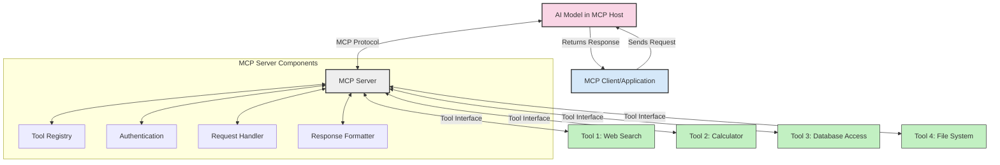
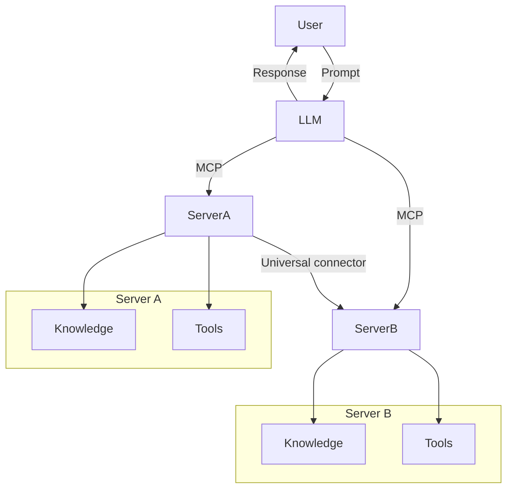
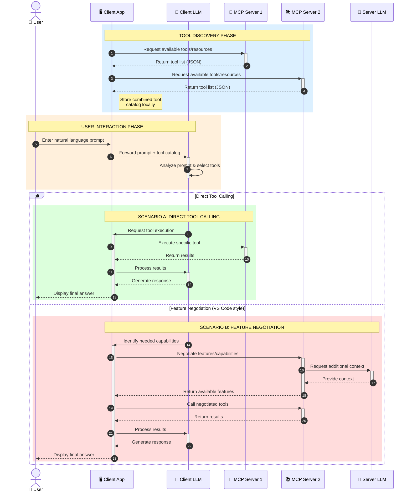

<!--
CO_OP_TRANSLATOR_METADATA:
{
  "original_hash": "25a94c681cf43612ff394d8cf78a74de",
  "translation_date": "2025-05-27T16:09:52+00:00",
  "source_file": "00-Introduction/README.md",
  "language_code": "ms"
}
-->
# Introduction to Model Context Protocol (MCP): Why It Matters for Scalable AI Applications

Generative AI applications represent a significant advancement by allowing users to interact with apps through natural language prompts. However, as you invest more time and resources in these apps, it's important to ensure easy integration of functionalities and resources, making it simple to extend, support multiple models simultaneously, and manage various model complexities. In short, building Gen AI apps is straightforward initially, but as they scale and become more complex, defining an architecture becomes necessary, often relying on a standard to ensure consistent app development. This is where MCP steps in to organize and provide such a standard.

---

## **🔍 What Is the Model Context Protocol (MCP)?**

The **Model Context Protocol (MCP)** is an **open, standardized interface** that enables Large Language Models (LLMs) to interact smoothly with external tools, APIs, and data sources. It offers a consistent framework to enhance AI model capabilities beyond their training data, fostering smarter, scalable, and more responsive AI systems.

---

## **🎯 Why Standardization in AI Matters**

As generative AI applications grow more complex, adopting standards that guarantee **scalability, extensibility**, and **maintainability** is crucial. MCP addresses these needs by:

- Unifying model-tool integrations
- Minimizing fragile, one-off custom solutions
- Supporting multiple models coexisting within a single ecosystem

---

## **📚 Learning Objectives**

By the end of this article, you will be able to:

- Define **Model Context Protocol (MCP)** and its practical applications
- Understand how MCP standardizes communication between models and tools
- Identify the main components of MCP architecture
- Explore real-world MCP applications in enterprise and development settings

---

## **💡 Why the Model Context Protocol (MCP) Is a Game-Changer**

### **🔗 MCP Solves Fragmentation in AI Interactions**

Before MCP, integrating models with tools involved:

- Writing custom code for each tool-model pair
- Dealing with non-standard APIs from different vendors
- Frequent disruptions due to updates
- Limited scalability as the number of tools increased

### **✅ Benefits of MCP Standardization**

| **Benefit**              | **Description**                                                                |
|--------------------------|--------------------------------------------------------------------------------|
| Interoperability         | LLMs seamlessly work with tools from various vendors                          |
| Consistency              | Uniform behavior across platforms and tools                                   |
| Reusability              | Tools built once can be reused across different projects and systems          |
| Accelerated Development  | Development time is reduced by using standardized, plug-and-play interfaces   |

---

## **🧱 High-Level MCP Architecture Overview**

MCP uses a **client-server model**, where:

- **MCP Hosts** run the AI models
- **MCP Clients** initiate requests
- **MCP Servers** provide context, tools, and capabilities

### **Key Components:**

- **Resources** – Static or dynamic data accessible to models  
- **Prompts** – Predefined workflows guiding generation  
- **Tools** – Executable functions such as search or calculations  
- **Sampling** – Agentic behavior enabled through recursive interactions

---

## How MCP Servers Work

MCP servers function as follows:

- **Request Flow**: 
    1. The MCP Client sends a request to the AI Model hosted in an MCP Host.
    2. The AI Model determines when it requires external tools or data.
    3. The model communicates with the MCP Server using the standardized protocol.

- **MCP Server Functionality**:
    - Tool Registry: Keeps a catalog of available tools and their features.
    - Authentication: Confirms permissions for accessing tools.
    - Request Handler: Manages incoming tool requests from the model.
    - Response Formatter: Organizes tool outputs into a format the model understands.

- **Tool Execution**: 
    - The server forwards requests to the appropriate external tools.
    - Tools perform their specialized functions (search, calculations, database queries, etc.).
    - Results are returned to the model in a uniform format.

- **Response Completion**: 
    - The AI model incorporates the tool outputs into its response.
    - The final response is sent back to the client application.

## 👨‍💻 How to Build an MCP Server (With Examples)

MCP servers enable you to extend LLM capabilities by supplying data and functionality.

Ready to get started? Here are examples of building a simple MCP server in various languages:

- **Python Example**: https://github.com/modelcontextprotocol/python-sdk

- **TypeScript Example**: https://github.com/modelcontextprotocol/typescript-sdk

- **Java Example**: https://github.com/modelcontextprotocol/java-sdk

- **C#/.NET Example**: https://github.com/modelcontextprotocol/csharp-sdk

## 🌍 Real-World Use Cases for MCP

MCP empowers a broad range of applications by extending AI capabilities:

| **Application**              | **Description**                                                                |
|------------------------------|--------------------------------------------------------------------------------|
| Enterprise Data Integration  | Connect LLMs to databases, CRMs, or internal tools                             |
| Agentic AI Systems           | Enable autonomous agents with tool access and decision-making workflows        |
| Multi-modal Applications     | Combine text, image, and audio tools within a single unified AI app            |
| Real-time Data Integration   | Incorporate live data into AI interactions for more accurate, up-to-date outputs|

### 🧠 MCP = Universal Standard for AI Interactions

The Model Context Protocol (MCP) serves as a universal standard for AI interactions, much like USB-C standardized device connections. In AI, MCP provides a consistent interface allowing models (clients) to integrate effortlessly with external tools and data providers (servers). This removes the need for diverse, custom protocols for every API or data source.

An MCP-compatible tool (an MCP server) follows a unified standard. These servers list the tools or actions they offer and execute those actions when requested by an AI agent. Platforms supporting MCP can discover available tools from servers and invoke them via this standard protocol.

### 💡 Facilitates access to knowledge

Besides providing tools, MCP facilitates knowledge access. It allows applications to supply context to large language models (LLMs) by linking them to various data sources. For example, an MCP server might represent a company’s document repository, enabling agents to fetch relevant information on demand. Another server could handle specific tasks like sending emails or updating records. From the agent’s point of view, these are simply tools—some return data (knowledge context), others perform actions. MCP manages both efficiently.

When an agent connects to an MCP server, it automatically learns the server's available capabilities and accessible data through a standard format. This standardization enables dynamic tool availability. For instance, adding a new MCP server to an agent’s system immediately makes its functions usable without needing to modify the agent’s instructions.

This streamlined integration matches the flow shown in the mermaid diagram, where servers provide both tools and knowledge, ensuring smooth collaboration across systems.

### 👉 Example: Scalable Agent Solution

### 🔄 Advanced MCP Scenarios with Client-Side LLM Integration

Beyond the basic MCP architecture, advanced scenarios exist where both client and server include LLMs, enabling more sophisticated interactions:

## 🔐 Practical Benefits of MCP

Here are the practical advantages of using MCP:

- **Freshness**: Models can access up-to-date information beyond their training data
- **Capability Extension**: Models can use specialized tools for tasks outside their training
- **Reduced Hallucinations**: External data sources provide factual grounding
- **Privacy**: Sensitive data remains secure instead of being embedded in prompts

## 📌 Key Takeaways

Key points to remember about MCP:

- **MCP** standardizes AI model interaction with tools and data
- Encourages **extensibility, consistency, and interoperability**
- MCP helps **reduce development time, improve reliability, and expand model capabilities**
- The client-server architecture **supports flexible, extensible AI applications**

## 🧠 Exercise

Consider an AI application you want to build.

- What **external tools or data** could enhance its capabilities?
- How could MCP make integration **simpler and more reliable?**

## Additional Resources

- [MCP GitHub Repository](https://github.com/modelcontextprotocol)

## What's next

Next: [Chapter 1: Core Concepts](/01-CoreConcepts/README.md)

**Penafian**:  
Dokumen ini telah diterjemahkan menggunakan perkhidmatan terjemahan AI [Co-op Translator](https://github.com/Azure/co-op-translator). Walaupun kami berusaha untuk ketepatan, sila maklum bahawa terjemahan automatik mungkin mengandungi kesilapan atau ketidaktepatan. Dokumen asal dalam bahasa asalnya harus dianggap sebagai sumber yang sahih. Untuk maklumat penting, terjemahan profesional oleh manusia adalah disyorkan. Kami tidak bertanggungjawab atas sebarang salah faham atau salah tafsir yang timbul daripada penggunaan terjemahan ini.