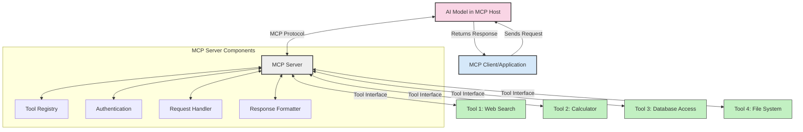
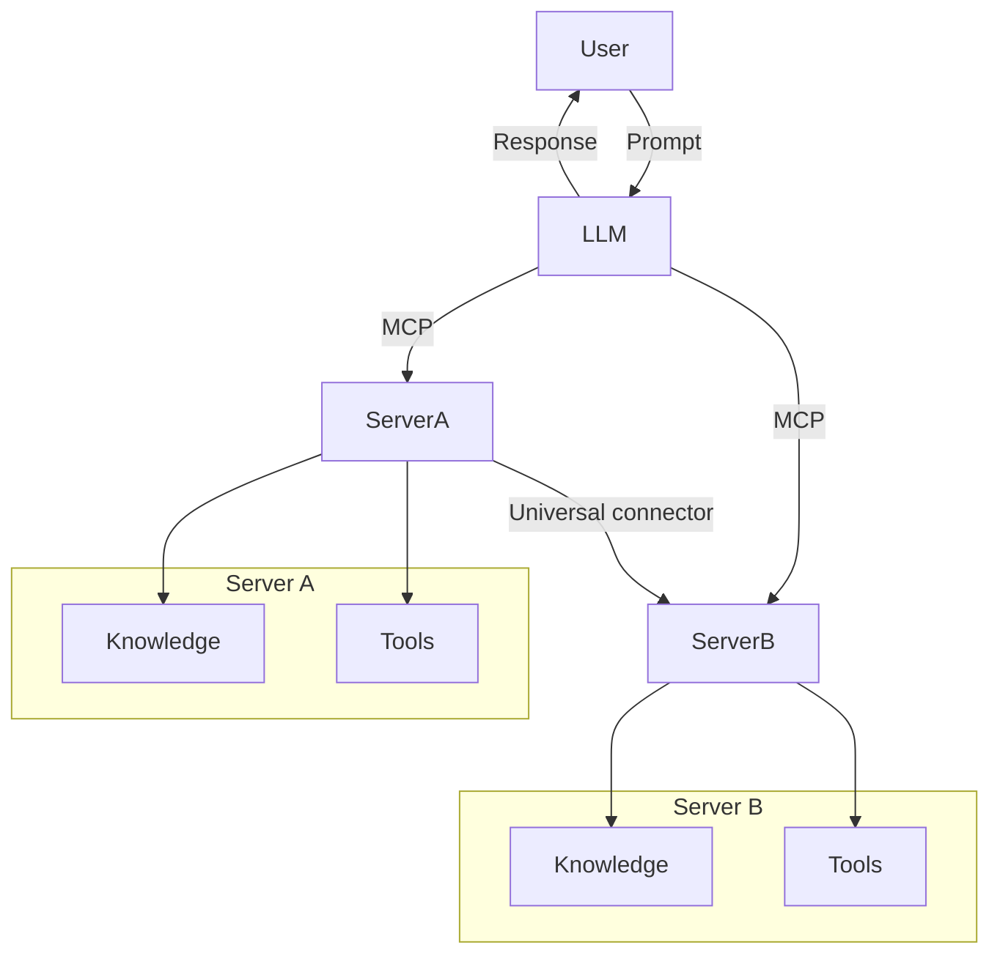

<!--
CO_OP_TRANSLATOR_METADATA:
{
  "original_hash": "1d88dee994dcbb3fa52c271d0c0817b5",
  "translation_date": "2025-05-20T22:07:01+00:00",
  "source_file": "00-Introduction/README.md",
  "language_code": "ms"
}
-->
# Introduction to Model Context Protocol (MCP): Why It Matters for Scalable AI Applications

Generative AI applications represent a significant advancement by allowing users to interact with the app through natural language prompts. However, as more time and resources are invested in these apps, it becomes crucial to integrate functionalities and resources in a way that’s easy to expand, supports multiple models simultaneously, and manages various model complexities. In short, building Gen AI apps is simple at first, but as they grow more complex, defining a solid architecture and relying on a standard becomes necessary to ensure consistent app development. This is where MCP steps in to organize and provide a standard.

---

## **🔍 What Is the Model Context Protocol (MCP)?**

The **Model Context Protocol (MCP)** is an **open, standardized interface** that enables Large Language Models (LLMs) to seamlessly connect with external tools, APIs, and data sources. It offers a consistent framework to enhance AI model capabilities beyond their training data, allowing for smarter, scalable, and more responsive AI systems.

---

## **🎯 Why Standardization in AI Matters**

As generative AI applications grow more sophisticated, adopting standards that ensure **scalability, extensibility**, and **maintainability** is essential. MCP addresses these needs by:

- Unifying model-tool integrations  
- Reducing fragile, one-off custom solutions  
- Allowing multiple models to coexist within a single ecosystem  

---

## **📚 Learning Objectives**

By the end of this article, you will be able to:

- Define **Model Context Protocol (MCP)** and its use cases  
- Understand how MCP standardizes communication between models and tools  
- Identify the core components of MCP architecture  
- Explore real-world applications of MCP in enterprise and development contexts  

---

## **💡 Why the Model Context Protocol (MCP) Is a Game-Changer**

### **🔗 MCP Solves Fragmentation in AI Interactions**

Before MCP, integrating models with tools required:

- Custom code for each tool-model combination  
- Non-standard APIs from different vendors  
- Frequent breaks due to updates  
- Poor scalability as the number of tools increased  

### **✅ Benefits of MCP Standardization**

| **Benefit**              | **Description**                                                                |
|--------------------------|--------------------------------------------------------------------------------|
| Interoperability         | LLMs work seamlessly with tools from various vendors                           |
| Consistency              | Uniform behavior across platforms and tools                                    |
| Reusability              | Tools built once can be reused across projects and systems                     |
| Accelerated Development  | Reduced development time through standardized, plug-and-play interfaces       |

---

## **🧱 High-Level MCP Architecture Overview**

MCP follows a **client-server model**, where:

- **MCP Hosts** run the AI models  
- **MCP Clients** initiate requests  
- **MCP Servers** provide context, tools, and capabilities  

### **Key Components:**

- **Resources** – Static or dynamic data available to models  
- **Prompts** – Predefined workflows guiding generation  
- **Tools** – Executable functions like search or calculations  
- **Sampling** – Agentic behavior enabled through recursive interactions  

---

## How MCP Servers Work

MCP servers operate as follows:

- **Request Flow**:  
    1. The MCP Client sends a request to the AI Model running on an MCP Host.  
    2. The AI Model determines when it requires external tools or data.  
    3. The model communicates with the MCP Server using the standardized protocol.  

- **MCP Server Functionality**:  
    - Tool Registry: Maintains a catalog of available tools and their capabilities.  
    - Authentication: Verifies permissions for tool access.  
    - Request Handler: Processes incoming tool requests from the model.  
    - Response Formatter: Structures tool outputs in a format the model understands.  

- **Tool Execution**:  
    - The server routes requests to the appropriate external tools.  
    - Tools perform their specialized functions (search, calculations, database queries, etc.).  
    - Results are returned to the model in a consistent format.  

- **Response Completion**:  
    - The AI model integrates tool outputs into its response.  
    - The final response is sent back to the client application.  

## 👨‍💻 How to Build an MCP Server (With Examples)

MCP servers let you extend LLM capabilities by providing additional data and functionality.

Ready to get started? Here are examples of how to create a simple MCP server in different programming languages:

- **Python Example**: https://github.com/modelcontextprotocol/python-sdk  
- **TypeScript Example**: https://github.com/modelcontextprotocol/typescript-sdk  
- **Java Example**: https://github.com/modelcontextprotocol/java-sdk  
- **C#/.NET Example**: https://github.com/modelcontextprotocol/csharp-sdk  

## 🌍 Real-World Use Cases for MCP

MCP powers a variety of applications by extending AI capabilities:

| **Application**              | **Description**                                                                |
|------------------------------|--------------------------------------------------------------------------------|
| Enterprise Data Integration  | Connect LLMs to databases, CRMs, or internal tools                             |
| Agentic AI Systems           | Enable autonomous agents with access to tools and decision-making workflows    |
| Multi-modal Applications     | Combine text, image, and audio tools within a single unified AI app            |
| Real-time Data Integration   | Incorporate live data into AI interactions for more accurate, up-to-date outputs|

### 🧠 MCP = Universal Standard for AI Interactions

The Model Context Protocol (MCP) acts as a universal standard for AI interactions, similar to how USB-C standardized physical device connections. In AI, MCP provides a consistent interface allowing models (clients) to seamlessly integrate with external tools and data providers (servers). This removes the need for a variety of custom protocols for each API or data source.

An MCP-compatible tool (an MCP server) adheres to a unified standard. These servers list the tools or actions they offer and execute those actions when requested by an AI agent. AI platforms that support MCP can discover available tools from these servers and invoke them through this standard protocol.

### 💡 Facilitates access to knowledge

Beyond providing tools, MCP also facilitates access to knowledge. It allows applications to supply context to large language models (LLMs) by connecting them to diverse data sources. For example, an MCP server might represent a company’s document repository, letting agents retrieve relevant information on demand. Another server might handle specific tasks like sending emails or updating records. From the agent’s perspective, these are just tools it can use—some return data (knowledge context), while others perform actions. MCP manages both efficiently.

When an agent connects to an MCP server, it automatically learns the server's available capabilities and accessible data through a standard format. This standardization enables dynamic tool availability. For instance, adding a new MCP server to an agent’s system immediately makes its functions usable without needing to customize the agent's instructions further.

This smooth integration matches the flow shown in the mermaid diagram, where servers provide both tools and knowledge, ensuring seamless collaboration across systems.

### 👉 Example: Scalable Agent Solution

## 🔐 Practical Benefits of MCP

Here are the practical benefits of using MCP:

- **Freshness**: Models gain access to up-to-date information beyond their training data  
- **Capability Extension**: Models can use specialized tools for tasks they weren’t originally trained for  
- **Reduced Hallucinations**: External data sources provide factual grounding  
- **Privacy**: Sensitive data stays secure within controlled environments rather than embedded in prompts  

## 📌 Key Takeaways

Key points to remember about MCP:

- **MCP** standardizes how AI models interact with tools and data  
- Promotes **extensibility, consistency, and interoperability**  
- Helps **reduce development time, improve reliability, and expand model capabilities**  
- The client-server architecture **enables flexible, extensible AI applications**  

## 🧠 Exercise

Consider an AI application you want to build.

- What **external tools or data** could enhance its capabilities?  
- How might MCP make integration **simpler and more reliable?**  

## Additional Resources

- [MCP GitHub Repository](https://github.com/modelcontextprotocol)

## What's next

Next: [Chapter 1: Core Concepts](/01-CoreConcepts/README.md)

**Penafian**:  
Dokumen ini telah diterjemahkan menggunakan perkhidmatan terjemahan AI [Co-op Translator](https://github.com/Azure/co-op-translator). Walaupun kami berusaha untuk ketepatan, sila ambil maklum bahawa terjemahan automatik mungkin mengandungi kesilapan atau ketidaktepatan. Dokumen asal dalam bahasa asalnya harus dianggap sebagai sumber yang sahih. Untuk maklumat penting, terjemahan profesional oleh manusia adalah disyorkan. Kami tidak bertanggungjawab atas sebarang salah faham atau salah tafsir yang timbul daripada penggunaan terjemahan ini.