<!--
CO_OP_TRANSLATOR_METADATA:
{
  "original_hash": "1446979020432f512c883848d7eca144",
  "translation_date": "2025-05-29T21:52:01+00:00",
  "source_file": "00-Introduction/README.md",
  "language_code": "ms"
}
-->
# Introduction to Model Context Protocol (MCP): Why It Matters for Scalable AI Applications

Generative AI applications mark a significant advancement by allowing users to interact with apps using natural language prompts. However, as more time and resources are invested in these applications, it becomes important to ensure easy integration of functionalities and resources in a way that supports scalability, accommodates multiple models, and manages various model complexities. In short, building Gen AI apps is straightforward at first, but as they grow and become more complex, you need to define an architecture and likely rely on a standard to ensure consistent development. This is where MCP steps in to organize and provide such a standard.

---

## **🔍 What Is the Model Context Protocol (MCP)?**

The **Model Context Protocol (MCP)** is an **open, standardized interface** that enables Large Language Models (LLMs) to seamlessly interact with external tools, APIs, and data sources. It establishes a consistent architecture that enhances AI model capabilities beyond their training data, facilitating smarter, scalable, and more responsive AI systems.

---

## **🎯 Why Standardization in AI Matters**

As generative AI applications grow more complex, adopting standards that ensure **scalability, extensibility**, and **maintainability** becomes essential. MCP addresses these needs by:

- Unifying model-to-tool integrations  
- Minimizing fragile, one-off custom solutions  
- Enabling multiple models to coexist within a single ecosystem  

---

## **📚 Learning Objectives**

By the end of this article, you will be able to:

- Define **Model Context Protocol (MCP)** and its use cases  
- Understand how MCP standardizes communication between models and tools  
- Identify the core components of MCP architecture  
- Explore real-world applications of MCP in enterprise and development environments  

---

## **💡 Why the Model Context Protocol (MCP) Is a Game-Changer**

### **🔗 MCP Solves Fragmentation in AI Interactions**

Before MCP, integrating models with tools required:

- Custom code for each tool-model combination  
- Non-standard APIs for every vendor  
- Frequent breakages due to updates  
- Poor scalability as more tools were added  

### **✅ Benefits of MCP Standardization**

| **Benefit**              | **Description**                                                                |
|--------------------------|--------------------------------------------------------------------------------|
| Interoperability         | LLMs work seamlessly with tools from different vendors                        |
| Consistency              | Uniform behavior across platforms and tools                                   |
| Reusability              | Tools developed once can be reused across projects and systems                |
| Accelerated Development  | Development time is reduced through standardized, plug-and-play interfaces    |

---

## **🧱 High-Level MCP Architecture Overview**

MCP operates on a **client-server model**, where:

- **MCP Hosts** run the AI models  
- **MCP Clients** initiate requests  
- **MCP Servers** provide context, tools, and capabilities  

### **Key Components:**

- **Resources** – Static or dynamic data available to models  
- **Prompts** – Predefined workflows guiding generation  
- **Tools** – Executable functions such as search or calculations  
- **Sampling** – Agentic behavior enabled through recursive interactions  

---

## How MCP Servers Work

MCP servers function as follows:

- **Request Flow**:  
    1. The MCP Client sends a request to the AI Model hosted on an MCP Host.  
    2. The AI Model detects when it requires external tools or data.  
    3. The model communicates with the MCP Server using the standardized protocol.  

- **MCP Server Functionality**:  
    - Tool Registry: Maintains a catalog of available tools and their features.  
    - Authentication: Validates permissions for tool access.  
    - Request Handler: Processes incoming tool requests from the model.  
    - Response Formatter: Structures tool outputs into a format the model understands.  

- **Tool Execution**:  
    - The server routes requests to the appropriate external tools.  
    - Tools perform their specialized functions (search, calculations, database queries, etc.).  
    - Results are returned to the model in a consistent format.  

- **Response Completion**:  
    - The AI model integrates tool outputs into its response.  
    - The final response is sent back to the client application.  

## 👨‍💻 How to Build an MCP Server (With Examples)

MCP servers enable you to extend LLM capabilities by providing data and additional functionality.

Ready to get started? Here are examples of creating a simple MCP server in various programming languages:

- **Python Example**: https://github.com/modelcontextprotocol/python-sdk  
- **TypeScript Example**: https://github.com/modelcontextprotocol/typescript-sdk  
- **Java Example**: https://github.com/modelcontextprotocol/java-sdk  
- **C#/.NET Example**: https://github.com/modelcontextprotocol/csharp-sdk  

## 🌍 Real-World Use Cases for MCP

MCP supports a broad range of applications by expanding AI capabilities:

| **Application**              | **Description**                                                                |
|------------------------------|--------------------------------------------------------------------------------|
| Enterprise Data Integration  | Connect LLMs to databases, CRMs, or internal tools                             |
| Agentic AI Systems           | Enable autonomous agents with tool access and decision-making workflows        |
| Multi-modal Applications     | Combine text, image, and audio tools within a single unified AI app            |
| Real-time Data Integration   | Incorporate live data into AI interactions for more accurate, up-to-date outputs|

### 🧠 MCP = Universal Standard for AI Interactions

The Model Context Protocol (MCP) serves as a universal standard for AI interactions, much like USB-C standardized physical connections for devices. Within AI, MCP offers a consistent interface that allows models (clients) to integrate smoothly with external tools and data providers (servers). This removes the need for diverse, custom protocols for each API or data source.

An MCP-compatible tool (called an MCP server) adheres to a unified standard. These servers list the tools or actions they provide and execute those actions when requested by an AI agent. AI agent platforms supporting MCP can discover available tools from these servers and invoke them via the standard protocol.

### 💡 Facilitates access to knowledge

Beyond just tools, MCP also enables access to knowledge. It allows applications to provide context to large language models (LLMs) by connecting them to various data sources. For example, an MCP server might represent a company’s document repository, letting agents retrieve relevant information on demand. Another server might handle specific actions like sending emails or updating records. From the agent’s perspective, these are simply tools it can use—some return data (knowledge context), while others perform actions. MCP efficiently manages both.

When an agent connects to an MCP server, it automatically learns about the server’s available capabilities and accessible data through a standardized format. This standardization enables dynamic tool availability. For instance, adding a new MCP server to an agent’s system makes its functions immediately usable without needing further customization of the agent’s instructions.

This streamlined integration aligns with the flow shown in the mermaid diagram, where servers provide both tools and knowledge, ensuring smooth collaboration across systems.

### 👉 Example: Scalable Agent Solution

### 🔄 Advanced MCP Scenarios with Client-Side LLM Integration

Beyond the basic MCP architecture, there are advanced scenarios where both client and server include LLMs, enabling more sophisticated interactions:

```mermaid
---
title: Advanced MCP Scenarios with Client-Server LLM Integration
description: A sequence diagram showing the detailed interaction flow between user, client application, client LLM, multiple MCP servers, and server LLM, illustrating tool discovery, user interaction, direct tool calling, and feature negotiation phases
---
sequenceDiagram
    autonumber
    actor User as 👤 User
    participant ClientApp as 🖥️ Client App
    participant ClientLLM as 🧠 Client LLM
    participant Server1 as 🔧 MCP Server 1
    participant Server2 as 📚 MCP Server 2
    participant ServerLLM as 🤖 Server LLM
    
    %% Discovery Phase
    rect rgb(220, 240, 255)
        Note over ClientApp, Server2: TOOL DISCOVERY PHASE
        ClientApp->>+Server1: Request available tools/resources
        Server1-->>-ClientApp: Return tool list (JSON)
        ClientApp->>+Server2: Request available tools/resources
        Server2-->>-ClientApp: Return tool list (JSON)
        Note right of ClientApp: Store combined tool<br/>catalog locally
    end
    
    %% User Interaction
    rect rgb(255, 240, 220)
        Note over User, ClientLLM: USER INTERACTION PHASE
        User->>+ClientApp: Enter natural language prompt
        ClientApp->>+ClientLLM: Forward prompt + tool catalog
        ClientLLM->>-ClientLLM: Analyze prompt & select tools
    end
    
    %% Scenario A: Direct Tool Calling
    alt Direct Tool Calling
        rect rgb(220, 255, 220)
            Note over ClientApp, Server1: SCENARIO A: DIRECT TOOL CALLING
            ClientLLM->>+ClientApp: Request tool execution
            ClientApp->>+Server1: Execute specific tool
            Server1-->>-ClientApp: Return results
            ClientApp->>+ClientLLM: Process results
            ClientLLM-->>-ClientApp: Generate response
            ClientApp-->>-User: Display final answer
        end
    
    %% Scenario B: Feature Negotiation (VS Code style)
    else Feature Negotiation (VS Code style)
        rect rgb(255, 220, 220)
            Note over ClientApp, ServerLLM: SCENARIO B: FEATURE NEGOTIATION
            ClientLLM->>+ClientApp: Identify needed capabilities
            ClientApp->>+Server2: Negotiate features/capabilities
            Server2->>+ServerLLM: Request additional context
            ServerLLM-->>-Server2: Provide context
            Server2-->>-ClientApp: Return available features
            ClientApp->>+Server2: Call negotiated tools
            Server2-->>-ClientApp: Return results
            ClientApp->>+ClientLLM: Process results
            ClientLLM-->>-ClientApp: Generate response
            ClientApp-->>-User: Display final answer
        end
    end
```

## 🔐 Practical Benefits of MCP

Here are some practical advantages of using MCP:

- **Freshness**: Models can access up-to-date information beyond their training data  
- **Capability Extension**: Models can utilize specialized tools for tasks they weren’t originally trained for  
- **Reduced Hallucinations**: External data sources provide factual grounding  
- **Privacy**: Sensitive data can remain in secure environments instead of being embedded in prompts  

## 📌 Key Takeaways

Key points to remember about MCP:

- **MCP** standardizes how AI models interact with tools and data  
- Promotes **extensibility, consistency, and interoperability**  
- Helps **reduce development time, improve reliability, and expand model capabilities**  
- The client-server architecture **enables flexible, extensible AI applications**  

## 🧠 Exercise

Consider an AI application you want to build.

- Which **external tools or data** could enhance its capabilities?  
- How might MCP make integration **simpler and more reliable?**  

## Additional Resources

- [MCP GitHub Repository](https://github.com/modelcontextprotocol)  

## What's next

Next: [Chapter 1: Core Concepts](/01-CoreConcepts/README.md)

**Penafian**:  
Dokumen ini telah diterjemahkan menggunakan perkhidmatan terjemahan AI [Co-op Translator](https://github.com/Azure/co-op-translator). Walaupun kami berusaha untuk ketepatan, sila ambil perhatian bahawa terjemahan automatik mungkin mengandungi kesilapan atau ketidaktepatan. Dokumen asal dalam bahasa asalnya harus dianggap sebagai sumber yang sahih. Untuk maklumat penting, terjemahan profesional oleh manusia adalah disyorkan. Kami tidak bertanggungjawab atas sebarang salah faham atau salah tafsir yang timbul daripada penggunaan terjemahan ini.