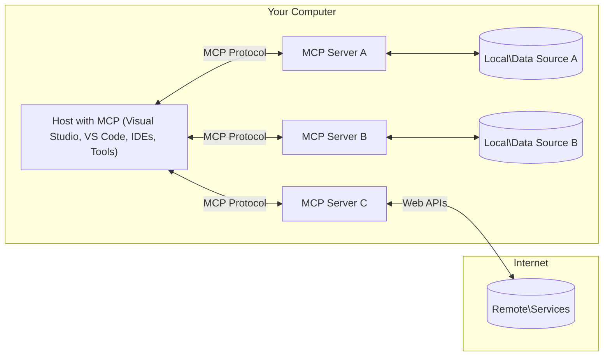

<!--
CO_OP_TRANSLATOR_METADATA:
{
  "original_hash": "904b59de1de9264801242d90a42cdd9d",
  "translation_date": "2025-09-05T11:20:07+00:00",
  "source_file": "01-CoreConcepts/README.md",
  "language_code": "ms"
}
-->
# Konsep Teras MCP: Menguasai Protokol Konteks Model untuk Integrasi AI

[](https://youtu.be/earDzWGtE84)

_(Klik imej di atas untuk menonton video pelajaran ini)_

[Model Context Protocol (MCP)](https://github.com/modelcontextprotocol) adalah kerangka kerja standard yang kuat untuk mengoptimumkan komunikasi antara Model Bahasa Besar (LLM) dan alat, aplikasi, serta sumber data luaran. Panduan ini akan membawa anda memahami konsep teras MCP. Anda akan mempelajari seni bina klien-pelayan, komponen penting, mekanik komunikasi, dan amalan terbaik pelaksanaannya.

- **Persetujuan Pengguna Secara Jelas**: Semua akses data dan operasi memerlukan kelulusan pengguna secara jelas sebelum dilaksanakan. Pengguna mesti memahami dengan jelas data apa yang akan diakses dan tindakan apa yang akan dilakukan, dengan kawalan terperinci terhadap kebenaran dan pengesahan.

- **Perlindungan Privasi Data**: Data pengguna hanya didedahkan dengan persetujuan jelas dan mesti dilindungi oleh kawalan akses yang kukuh sepanjang kitaran interaksi. Pelaksanaan mesti mencegah penghantaran data tanpa kebenaran dan mengekalkan sempadan privasi yang ketat.

- **Keselamatan Pelaksanaan Alat**: Setiap pelaksanaan alat memerlukan persetujuan pengguna secara jelas dengan pemahaman yang jelas tentang fungsi alat, parameter, dan kesan potensial. Sempadan keselamatan yang kukuh mesti mencegah pelaksanaan alat yang tidak disengajakan, tidak selamat, atau berniat jahat.

- **Keselamatan Lapisan Pengangkutan**: Semua saluran komunikasi harus menggunakan mekanisme penyulitan dan pengesahan yang sesuai. Sambungan jauh harus melaksanakan protokol pengangkutan yang selamat dan pengurusan kelayakan yang betul.

#### Garis Panduan Pelaksanaan:

- **Pengurusan Kebenaran**: Laksanakan sistem kebenaran yang terperinci yang membolehkan pengguna mengawal pelayan, alat, dan sumber yang boleh diakses
- **Pengesahan & Pengesahan**: Gunakan kaedah pengesahan yang selamat (OAuth, kunci API) dengan pengurusan token dan tamat tempoh yang betul  
- **Pengesahan Input**: Sahkan semua parameter dan input data mengikut skema yang ditentukan untuk mencegah serangan suntikan
- **Log Audit**: Kekalkan log komprehensif semua operasi untuk pemantauan keselamatan dan pematuhan

## Gambaran Keseluruhan

Pelajaran ini meneroka seni bina asas dan komponen yang membentuk ekosistem Model Context Protocol (MCP). Anda akan mempelajari seni bina klien-pelayan, komponen utama, dan mekanisme komunikasi yang menggerakkan interaksi MCP.

## Objektif Pembelajaran Utama

Menjelang akhir pelajaran ini, anda akan:

- Memahami seni bina klien-pelayan MCP.
- Mengenal pasti peranan dan tanggungjawab Host, Klien, dan Pelayan.
- Menganalisis ciri teras yang menjadikan MCP sebagai lapisan integrasi yang fleksibel.
- Mempelajari bagaimana maklumat mengalir dalam ekosistem MCP.
- Mendapatkan pandangan praktikal melalui contoh kod dalam .NET, Java, Python, dan JavaScript.

## Seni Bina MCP: Penjelasan Mendalam

Ekosistem MCP dibina berdasarkan model klien-pelayan. Struktur modular ini membolehkan aplikasi AI berinteraksi dengan alat, pangkalan data, API, dan sumber kontekstual dengan cekap. Mari kita pecahkan seni bina ini kepada komponen terasnya.

Pada asasnya, MCP mengikuti seni bina klien-pelayan di mana aplikasi host boleh menyambung kepada pelbagai pelayan:



- **Host MCP**: Program seperti VSCode, Claude Desktop, IDE, atau alat AI yang ingin mengakses data melalui MCP
- **Klien MCP**: Klien protokol yang mengekalkan sambungan 1:1 dengan pelayan
- **Pelayan MCP**: Program ringan yang masing-masing mendedahkan keupayaan tertentu melalui Model Context Protocol yang standard
- **Sumber Data Tempatan**: Fail, pangkalan data, dan perkhidmatan komputer anda yang boleh diakses dengan selamat oleh pelayan MCP
- **Perkhidmatan Jauh**: Sistem luaran yang tersedia melalui internet yang boleh disambungkan oleh pelayan MCP melalui API.

Protokol MCP adalah standard yang berkembang menggunakan penomboran versi berdasarkan tarikh (format YYYY-MM-DD). Versi protokol semasa ialah **2025-06-18**. Anda boleh melihat kemas kini terkini kepada [spesifikasi protokol](https://modelcontextprotocol.io/specification/2025-06-18/)

### 1. Host

Dalam Model Context Protocol (MCP), **Host** adalah aplikasi AI yang berfungsi sebagai antara muka utama di mana pengguna berinteraksi dengan protokol. Host menyelaraskan dan mengurus sambungan kepada pelbagai pelayan MCP dengan mencipta klien MCP khusus untuk setiap sambungan pelayan. Contoh Host termasuk:

- **Aplikasi AI**: Claude Desktop, Visual Studio Code, Claude Code
- **Persekitaran Pembangunan**: IDE dan editor kod dengan integrasi MCP  
- **Aplikasi Tersuai**: Ejen AI dan alat yang dibina khas

**Host** adalah aplikasi yang menyelaraskan interaksi model AI. Mereka:

- **Menyelaraskan Model AI**: Melaksanakan atau berinteraksi dengan LLM untuk menghasilkan respons dan menyelaraskan aliran kerja AI
- **Mengurus Sambungan Klien**: Mencipta dan mengekalkan satu klien MCP bagi setiap sambungan pelayan MCP
- **Mengawal Antara Muka Pengguna**: Mengendalikan aliran perbualan, interaksi pengguna, dan penyampaian respons  
- **Menguatkuasakan Keselamatan**: Mengawal kebenaran, kekangan keselamatan, dan pengesahan
- **Mengendalikan Persetujuan Pengguna**: Mengurus kelulusan pengguna untuk perkongsian data dan pelaksanaan alat

### 2. Klien

**Klien** adalah komponen penting yang mengekalkan sambungan satu-ke-satu khusus antara Host dan pelayan MCP. Setiap klien MCP diwujudkan oleh Host untuk menyambung kepada pelayan MCP tertentu, memastikan saluran komunikasi yang teratur dan selamat. Pelbagai klien membolehkan Host menyambung kepada pelbagai pelayan secara serentak.

**Klien** adalah komponen penyambung dalam aplikasi host. Mereka:

- **Komunikasi Protokol**: Menghantar permintaan JSON-RPC 2.0 kepada pelayan dengan arahan dan arahan
- **Rundingan Keupayaan**: Merundingkan ciri yang disokong dan versi protokol dengan pelayan semasa inisialisasi
- **Pelaksanaan Alat**: Mengurus permintaan pelaksanaan alat daripada model dan memproses respons
- **Kemas Kini Masa Nyata**: Mengendalikan pemberitahuan dan kemas kini masa nyata daripada pelayan
- **Pemprosesan Respons**: Memproses dan memformat respons pelayan untuk dipaparkan kepada pengguna

### 3. Pelayan

**Pelayan** adalah program yang menyediakan konteks, alat, dan keupayaan kepada klien MCP. Mereka boleh dilaksanakan secara tempatan (mesin yang sama dengan Host) atau jauh (di platform luaran), dan bertanggungjawab untuk mengendalikan permintaan klien dan menyediakan respons yang berstruktur. Pelayan mendedahkan fungsi tertentu melalui Model Context Protocol yang standard.

**Pelayan** adalah perkhidmatan yang menyediakan konteks dan keupayaan. Mereka:

- **Pendaftaran Ciri**: Mendaftar dan mendedahkan primitif yang tersedia (sumber, arahan, alat) kepada klien
- **Pemprosesan Permintaan**: Menerima dan melaksanakan panggilan alat, permintaan sumber, dan permintaan arahan daripada klien
- **Penyediaan Konteks**: Memberikan maklumat kontekstual dan data untuk meningkatkan respons model
- **Pengurusan Keadaan**: Mengekalkan keadaan sesi dan mengendalikan interaksi berkeadaan apabila diperlukan
- **Pemberitahuan Masa Nyata**: Menghantar pemberitahuan tentang perubahan keupayaan dan kemas kini kepada klien yang disambungkan

Pelayan boleh dibangunkan oleh sesiapa sahaja untuk memperluaskan keupayaan model dengan fungsi khusus, dan mereka menyokong senario pelaksanaan tempatan dan jauh.

### 4. Primitif Pelayan

Pelayan dalam Model Context Protocol (MCP) menyediakan tiga **primitif** teras yang menentukan blok binaan asas untuk interaksi yang kaya antara klien, host, dan model bahasa. Primitif ini menentukan jenis maklumat kontekstual dan tindakan yang tersedia melalui protokol.

Pelayan MCP boleh mendedahkan mana-mana kombinasi daripada tiga primitif teras berikut:

#### Sumber 

**Sumber** adalah sumber data yang menyediakan maklumat kontekstual kepada aplikasi AI. Mereka mewakili kandungan statik atau dinamik yang boleh meningkatkan pemahaman dan pembuatan keputusan model:

- **Data Kontekstual**: Maklumat berstruktur dan konteks untuk penggunaan model AI
- **Pangkalan Pengetahuan**: Repositori dokumen, artikel, manual, dan kertas penyelidikan
- **Sumber Data Tempatan**: Fail, pangkalan data, dan maklumat sistem tempatan  
- **Data Luaran**: Respons API, perkhidmatan web, dan data sistem jauh
- **Kandungan Dinamik**: Data masa nyata yang dikemas kini berdasarkan keadaan luaran

Sumber dikenal pasti oleh URI dan menyokong penemuan melalui kaedah `resources/list` dan pengambilan melalui `resources/read`:

```text
file://documents/project-spec.md
database://production/users/schema
api://weather/current
```

#### Arahan

**Arahan** adalah templat yang boleh digunakan semula yang membantu menyusun interaksi dengan model bahasa. Mereka menyediakan corak interaksi standard dan aliran kerja templat:

- **Interaksi Berasaskan Templat**: Mesej yang telah disusun dan permulaan perbualan
- **Templat Aliran Kerja**: Urutan standard untuk tugas dan interaksi biasa
- **Contoh Few-shot**: Templat berasaskan contoh untuk arahan model
- **Arahan Sistem**: Arahan asas yang menentukan tingkah laku dan konteks model
- **Templat Dinamik**: Arahan yang diparameterkan yang menyesuaikan diri dengan konteks tertentu

Arahan menyokong penggantian pembolehubah dan boleh ditemui melalui `prompts/list` dan diambil dengan `prompts/get`:

```markdown
Generate a {{task_type}} for {{product}} targeting {{audience}} with the following requirements: {{requirements}}
```

#### Alat

**Alat** adalah fungsi yang boleh dilaksanakan yang boleh dipanggil oleh model AI untuk melaksanakan tindakan tertentu. Mereka mewakili "kata kerja" ekosistem MCP, membolehkan model berinteraksi dengan sistem luaran:

- **Fungsi Boleh Dilaksanakan**: Operasi diskret yang boleh dipanggil oleh model dengan parameter tertentu
- **Integrasi Sistem Luaran**: Panggilan API, pertanyaan pangkalan data, operasi fail, pengiraan
- **Identiti Unik**: Setiap alat mempunyai nama, deskripsi, dan skema parameter yang berbeza
- **I/O Berstruktur**: Alat menerima parameter yang disahkan dan mengembalikan respons yang berstruktur dan ditaip
- **Keupayaan Tindakan**: Membolehkan model melaksanakan tindakan dunia nyata dan mendapatkan data langsung

Alat ditakrifkan dengan JSON Schema untuk pengesahan parameter dan ditemui melalui `tools/list` dan dilaksanakan melalui `tools/call`:

```typescript
server.tool(
  "search_products", 
  {
    query: z.string().describe("Search query for products"),
    category: z.string().optional().describe("Product category filter"),
    max_results: z.number().default(10).describe("Maximum results to return")
  }, 
  async (params) => {
    // Execute search and return structured results
    return await productService.search(params);
  }
);
```

## Primitif Klien

Dalam Model Context Protocol (MCP), **klien** boleh mendedahkan primitif yang membolehkan pelayan meminta keupayaan tambahan daripada aplikasi host. Primitif sisi klien ini membolehkan pelaksanaan pelayan yang lebih kaya dan interaktif yang boleh mengakses keupayaan model AI dan interaksi pengguna.

### Pensampelan

**Pensampelan** membolehkan pelayan meminta penyelesaian model bahasa daripada aplikasi AI klien. Primitif ini membolehkan pelayan mengakses keupayaan LLM tanpa memasukkan kebergantungan model mereka sendiri:

- **Akses Bebas Model**: Pelayan boleh meminta penyelesaian tanpa memasukkan SDK LLM atau mengurus akses model
- **AI Dimulakan Pelayan**: Membolehkan pelayan menghasilkan kandungan secara autonomi menggunakan model AI klien
- **Interaksi LLM Berulang**: Menyokong senario kompleks di mana pelayan memerlukan bantuan AI untuk pemprosesan
- **Penjanaan Kandungan Dinamik**: Membolehkan pelayan mencipta respons kontekstual menggunakan model host

Pensampelan dimulakan melalui kaedah `sampling/complete`, di mana pelayan menghantar permintaan penyelesaian kepada klien.

### Elicitasi  

**Elicitasi** membolehkan pelayan meminta maklumat tambahan atau pengesahan daripada pengguna melalui antara muka klien:

- **Permintaan Input Pengguna**: Pelayan boleh meminta maklumat tambahan apabila diperlukan untuk pelaksanaan alat
- **Dialog Pengesahan**: Meminta kelulusan pengguna untuk operasi yang sensitif atau berimpak
- **Aliran Kerja Interaktif**: Membolehkan pelayan mencipta interaksi pengguna langkah demi langkah
- **Pengumpulan Parameter Dinamik**: Mengumpulkan parameter yang hilang atau pilihan semasa pelaksanaan alat

Permintaan elicitasi dibuat menggunakan kaedah `elicitation/request` untuk mengumpulkan input pengguna melalui antara muka klien.

### Logging

**Logging** membolehkan pelayan menghantar mesej log berstruktur kepada klien untuk penyahpepijatan, pemantauan, dan keterlihatan operasi:

- **Sokongan Penyahpepijatan**: Membolehkan pelayan menyediakan log pelaksanaan terperinci untuk penyelesaian masalah
- **Pemantauan Operasi**: Menghantar kemas kini status dan metrik prestasi kepada klien
- **Pelaporan Ralat**: Memberikan konteks ralat terperinci dan maklumat diagnostik
- **Jejak Audit**: Mencipta log komprehensif operasi pelayan dan keputusan

Mesej log dihantar kepada klien untuk memberikan ketelusan dalam operasi pelayan dan memudahkan penyahpepijatan.

## Aliran Maklumat dalam MCP

Model Context Protocol (MCP) mentakrifkan aliran maklumat yang berstruktur antara host, klien, pelayan, dan model. Memahami aliran ini membantu menjelaskan bagaimana permintaan pengguna diproses dan bagaimana alat serta data luaran diintegrasikan ke dalam respons model.

- **Host Memulakan Sambungan**  
  Aplikasi host (seperti IDE atau antara muka sembang) mewujudkan sambungan kepada pelayan MCP, biasanya melalui STDIO, WebSocket, atau pengangkutan lain yang disokong.

- **Rundingan Keupayaan**  
  Klien (terbenam dalam host) dan pelayan bertukar maklumat tentang ciri, alat, sumber, dan versi protokol yang disokong. Ini memastikan kedua-dua pihak memahami keupayaan yang tersedia untuk sesi tersebut.

- **Permintaan Pengguna**  
  Pengguna berinteraksi dengan host (contohnya, memasukkan arahan atau perintah). Host mengumpulkan input ini dan menyerahkannya kepada klien untuk diproses.

- **Penggunaan Sumber atau Alat**  
  - Klien boleh meminta konteks tambahan atau sumber daripada pelayan (seperti fail, entri pangkalan data, atau artikel pangkalan pengetahuan) untuk memperkayakan pemahaman model.
  - Jika model menentukan bahawa alat diperlukan (contohnya, untuk mendapatkan data, melaksanakan pengiraan, atau memanggil API), klien menghantar permintaan pelaksanaan alat kepada pelayan, menentukan nama alat dan parameter.

- **Pelaksanaan Pelayan**  
  Pelayan menerima permintaan sumber atau alat, melaksanakan operasi yang diperlukan (seperti menjalankan fungsi, membuat pertanyaan pangkalan data, atau mendapatkan fail), dan mengembalikan hasil kepada klien dalam format berstruktur.

- **Penjanaan Respons**  
  Klien mengintegrasikan respons pelayan (data sumber, output alat, dll.) ke dalam interaksi model yang sedang berlangsung. Model menggunakan maklumat ini untuk menghasilkan respons yang komprehensif dan relevan secara kontekstual.

- **Penyampaian Hasil**  
  Host menerima output akhir daripada klien dan menyampaikannya kepada pengguna, sering kali termasuk teks yang dihasilkan oleh model dan sebarang hasil daripada pelaksanaan alat atau carian sumber.

Aliran ini membolehkan MCP menyokong aplikasi AI yang maju, interaktif, dan sedar konteks dengan menghubungkan model dengan alat dan sumber data luaran secara lancar.

## Seni Bina & Lapisan Protokol

MCP terdiri daripada dua lapisan seni bina yang berbeza yang bekerjasama untuk menyediakan kerangka komunikasi yang lengkap:

### Lapisan Data

**Lapisan Data** melaksanakan protokol MCP teras menggunakan **JSON-RPC 2.0** sebagai asasnya. Lapisan ini mentakrifkan struktur mesej, semantik, dan corak interaksi:

#### Komponen Teras:
- **Protokol JSON-RPC 2.0**: Semua komunikasi menggunakan format mesej JSON-RPC 2.0 yang standard untuk panggilan kaedah, respons, dan notifikasi
- **Pengurusan Kitaran Hayat**: Menguruskan inisialisasi sambungan, rundingan keupayaan, dan penamatan sesi antara klien dan pelayan
- **Primitif Pelayan**: Membolehkan pelayan menyediakan fungsi teras melalui alat, sumber, dan templat
- **Primitif Klien**: Membolehkan pelayan meminta pensampelan daripada LLM, mendapatkan input pengguna, dan menghantar mesej log
- **Notifikasi Masa Nyata**: Menyokong notifikasi asinkron untuk kemas kini dinamik tanpa perlu polling

#### Ciri-ciri Utama:

- **Rundingan Versi Protokol**: Menggunakan penentuan versi berdasarkan tarikh (YYYY-MM-DD) untuk memastikan keserasian
- **Penemuan Keupayaan**: Klien dan pelayan bertukar maklumat ciri yang disokong semasa inisialisasi
- **Sesi Berkeadaan**: Mengekalkan keadaan sambungan merentasi pelbagai interaksi untuk kesinambungan konteks

### Lapisan Pengangkutan

**Lapisan Pengangkutan** menguruskan saluran komunikasi, pembingkaian mesej, dan pengesahan antara peserta MCP:

#### Mekanisme Pengangkutan yang Disokong:

1. **Pengangkutan STDIO**:
   - Menggunakan aliran input/output standard untuk komunikasi proses langsung
   - Optimum untuk proses tempatan pada mesin yang sama tanpa beban rangkaian
   - Lazim digunakan untuk pelaksanaan pelayan MCP tempatan

2. **Pengangkutan HTTP yang Boleh Distrim**:
   - Menggunakan HTTP POST untuk mesej klien-ke-pelayan  
   - Pilihan Server-Sent Events (SSE) untuk penstriman pelayan-ke-klien
   - Membolehkan komunikasi pelayan jauh merentasi rangkaian
   - Menyokong pengesahan HTTP standard (token pembawa, kunci API, header tersuai)
   - MCP mengesyorkan OAuth untuk pengesahan berasaskan token yang selamat

#### Abstraksi Pengangkutan:

Lapisan pengangkutan mengabstrakkan butiran komunikasi daripada lapisan data, membolehkan format mesej JSON-RPC 2.0 yang sama digunakan merentasi semua mekanisme pengangkutan. Abstraksi ini membolehkan aplikasi bertukar antara pelayan tempatan dan jauh dengan lancar.

### Pertimbangan Keselamatan

Pelaksanaan MCP mesti mematuhi beberapa prinsip keselamatan kritikal untuk memastikan interaksi yang selamat, boleh dipercayai, dan terjamin merentasi semua operasi protokol:

- **Persetujuan dan Kawalan Pengguna**: Pengguna mesti memberikan persetujuan eksplisit sebelum sebarang data diakses atau operasi dilakukan. Mereka harus mempunyai kawalan yang jelas terhadap data yang dikongsi dan tindakan yang dibenarkan, disokong oleh antara muka pengguna yang intuitif untuk menyemak dan meluluskan aktiviti.

- **Privasi Data**: Data pengguna hanya boleh didedahkan dengan persetujuan eksplisit dan mesti dilindungi oleh kawalan akses yang sesuai. Pelaksanaan MCP mesti melindungi daripada penghantaran data yang tidak dibenarkan dan memastikan privasi dikekalkan sepanjang semua interaksi.

- **Keselamatan Alat**: Sebelum menggunakan sebarang alat, persetujuan eksplisit pengguna diperlukan. Pengguna harus mempunyai pemahaman yang jelas tentang fungsi setiap alat, dan sempadan keselamatan yang kukuh mesti dikuatkuasakan untuk mencegah pelaksanaan alat yang tidak disengajakan atau tidak selamat.

Dengan mengikuti prinsip keselamatan ini, MCP memastikan kepercayaan, privasi, dan keselamatan pengguna dikekalkan merentasi semua interaksi protokol sambil membolehkan integrasi AI yang berkuasa.

## Contoh Kod: Komponen Utama

Berikut adalah contoh kod dalam beberapa bahasa pengaturcaraan popular yang menunjukkan cara melaksanakan komponen pelayan MCP dan alat utama.

### Contoh .NET: Membina Pelayan MCP Ringkas dengan Alat

Berikut adalah contoh kod praktikal dalam .NET yang menunjukkan cara melaksanakan pelayan MCP ringkas dengan alat tersuai. Contoh ini memaparkan cara mentakrifkan dan mendaftarkan alat, mengendalikan permintaan, dan menyambungkan pelayan menggunakan Protokol Konteks Model.

```csharp
using System;
using System.Threading.Tasks;
using ModelContextProtocol.Server;
using ModelContextProtocol.Server.Transport;
using ModelContextProtocol.Server.Tools;

public class WeatherServer
{
    public static async Task Main(string[] args)
    {
        // Create an MCP server
        var server = new McpServer(
            name: "Weather MCP Server",
            version: "1.0.0"
        );
        
        // Register our custom weather tool
        server.AddTool<string, WeatherData>("weatherTool", 
            description: "Gets current weather for a location",
            execute: async (location) => {
                // Call weather API (simplified)
                var weatherData = await GetWeatherDataAsync(location);
                return weatherData;
            });
        
        // Connect the server using stdio transport
        var transport = new StdioServerTransport();
        await server.ConnectAsync(transport);
        
        Console.WriteLine("Weather MCP Server started");
        
        // Keep the server running until process is terminated
        await Task.Delay(-1);
    }
    
    private static async Task<WeatherData> GetWeatherDataAsync(string location)
    {
        // This would normally call a weather API
        // Simplified for demonstration
        await Task.Delay(100); // Simulate API call
        return new WeatherData { 
            Temperature = 72.5,
            Conditions = "Sunny",
            Location = location
        };
    }
}

public class WeatherData
{
    public double Temperature { get; set; }
    public string Conditions { get; set; }
    public string Location { get; set; }
}
```

### Contoh Java: Komponen Pelayan MCP

Contoh ini menunjukkan pelayan MCP dan pendaftaran alat yang sama seperti contoh .NET di atas, tetapi dilaksanakan dalam Java.

```java
import io.modelcontextprotocol.server.McpServer;
import io.modelcontextprotocol.server.McpToolDefinition;
import io.modelcontextprotocol.server.transport.StdioServerTransport;
import io.modelcontextprotocol.server.tool.ToolExecutionContext;
import io.modelcontextprotocol.server.tool.ToolResponse;

public class WeatherMcpServer {
    public static void main(String[] args) throws Exception {
        // Create an MCP server
        McpServer server = McpServer.builder()
            .name("Weather MCP Server")
            .version("1.0.0")
            .build();
            
        // Register a weather tool
        server.registerTool(McpToolDefinition.builder("weatherTool")
            .description("Gets current weather for a location")
            .parameter("location", String.class)
            .execute((ToolExecutionContext ctx) -> {
                String location = ctx.getParameter("location", String.class);
                
                // Get weather data (simplified)
                WeatherData data = getWeatherData(location);
                
                // Return formatted response
                return ToolResponse.content(
                    String.format("Temperature: %.1f°F, Conditions: %s, Location: %s", 
                    data.getTemperature(), 
                    data.getConditions(), 
                    data.getLocation())
                );
            })
            .build());
        
        // Connect the server using stdio transport
        try (StdioServerTransport transport = new StdioServerTransport()) {
            server.connect(transport);
            System.out.println("Weather MCP Server started");
            // Keep server running until process is terminated
            Thread.currentThread().join();
        }
    }
    
    private static WeatherData getWeatherData(String location) {
        // Implementation would call a weather API
        // Simplified for example purposes
        return new WeatherData(72.5, "Sunny", location);
    }
}

class WeatherData {
    private double temperature;
    private String conditions;
    private String location;
    
    public WeatherData(double temperature, String conditions, String location) {
        this.temperature = temperature;
        this.conditions = conditions;
        this.location = location;
    }
    
    public double getTemperature() {
        return temperature;
    }
    
    public String getConditions() {
        return conditions;
    }
    
    public String getLocation() {
        return location;
    }
}
```

### Contoh Python: Membina Pelayan MCP

Contoh ini menggunakan fastmcp, jadi pastikan anda memasangnya terlebih dahulu:

```python
pip install fastmcp
```
Contoh Kod:

```python
#!/usr/bin/env python3
import asyncio
from fastmcp import FastMCP
from fastmcp.transports.stdio import serve_stdio

# Create a FastMCP server
mcp = FastMCP(
    name="Weather MCP Server",
    version="1.0.0"
)

@mcp.tool()
def get_weather(location: str) -> dict:
    """Gets current weather for a location."""
    return {
        "temperature": 72.5,
        "conditions": "Sunny",
        "location": location
    }

# Alternative approach using a class
class WeatherTools:
    @mcp.tool()
    def forecast(self, location: str, days: int = 1) -> dict:
        """Gets weather forecast for a location for the specified number of days."""
        return {
            "location": location,
            "forecast": [
                {"day": i+1, "temperature": 70 + i, "conditions": "Partly Cloudy"}
                for i in range(days)
            ]
        }

# Register class tools
weather_tools = WeatherTools()

# Start the server
if __name__ == "__main__":
    asyncio.run(serve_stdio(mcp))
```

### Contoh JavaScript: Membina Pelayan MCP

Contoh ini menunjukkan cara membina pelayan MCP dalam JavaScript dan cara mendaftarkan dua alat berkaitan cuaca.

```javascript
// Using the official Model Context Protocol SDK
import { McpServer } from "@modelcontextprotocol/sdk/server/mcp.js";
import { StdioServerTransport } from "@modelcontextprotocol/sdk/server/stdio.js";
import { z } from "zod"; // For parameter validation

// Create an MCP server
const server = new McpServer({
  name: "Weather MCP Server",
  version: "1.0.0"
});

// Define a weather tool
server.tool(
  "weatherTool",
  {
    location: z.string().describe("The location to get weather for")
  },
  async ({ location }) => {
    // This would normally call a weather API
    // Simplified for demonstration
    const weatherData = await getWeatherData(location);
    
    return {
      content: [
        { 
          type: "text", 
          text: `Temperature: ${weatherData.temperature}°F, Conditions: ${weatherData.conditions}, Location: ${weatherData.location}` 
        }
      ]
    };
  }
);

// Define a forecast tool
server.tool(
  "forecastTool",
  {
    location: z.string(),
    days: z.number().default(3).describe("Number of days for forecast")
  },
  async ({ location, days }) => {
    // This would normally call a weather API
    // Simplified for demonstration
    const forecast = await getForecastData(location, days);
    
    return {
      content: [
        { 
          type: "text", 
          text: `${days}-day forecast for ${location}: ${JSON.stringify(forecast)}` 
        }
      ]
    };
  }
);

// Helper functions
async function getWeatherData(location) {
  // Simulate API call
  return {
    temperature: 72.5,
    conditions: "Sunny",
    location: location
  };
}

async function getForecastData(location, days) {
  // Simulate API call
  return Array.from({ length: days }, (_, i) => ({
    day: i + 1,
    temperature: 70 + Math.floor(Math.random() * 10),
    conditions: i % 2 === 0 ? "Sunny" : "Partly Cloudy"
  }));
}

// Connect the server using stdio transport
const transport = new StdioServerTransport();
server.connect(transport).catch(console.error);

console.log("Weather MCP Server started");
```

Contoh JavaScript ini menunjukkan cara mencipta klien MCP yang menyambung ke pelayan, menghantar prompt, dan memproses respons termasuk sebarang panggilan alat yang dibuat.

## Keselamatan dan Kebenaran

MCP merangkumi beberapa konsep dan mekanisme terbina dalam untuk menguruskan keselamatan dan kebenaran sepanjang protokol:

1. **Kawalan Kebenaran Alat**:  
   Klien boleh menentukan alat mana yang dibenarkan digunakan oleh model semasa sesi. Ini memastikan hanya alat yang dibenarkan secara eksplisit boleh diakses, mengurangkan risiko operasi yang tidak disengajakan atau tidak selamat. Kebenaran boleh dikonfigurasi secara dinamik berdasarkan keutamaan pengguna, dasar organisasi, atau konteks interaksi.

2. **Pengesahan**:  
   Pelayan boleh memerlukan pengesahan sebelum memberikan akses kepada alat, sumber, atau operasi sensitif. Ini mungkin melibatkan kunci API, token OAuth, atau skim pengesahan lain. Pengesahan yang betul memastikan hanya klien dan pengguna yang dipercayai boleh menggunakan keupayaan pelayan.

3. **Pengesahan**:  
   Pengesahan parameter dikuatkuasakan untuk semua pelaksanaan alat. Setiap alat mentakrifkan jenis, format, dan kekangan yang dijangkakan untuk parameternya, dan pelayan mengesahkan permintaan yang masuk dengan sewajarnya. Ini mencegah input yang salah atau berniat jahat daripada mencapai pelaksanaan alat dan membantu mengekalkan integriti operasi.

4. **Had Kadar**:  
   Untuk mencegah penyalahgunaan dan memastikan penggunaan sumber pelayan yang adil, pelayan MCP boleh melaksanakan had kadar untuk panggilan alat dan akses sumber. Had kadar boleh dikenakan per pengguna, per sesi, atau secara global, dan membantu melindungi daripada serangan penafian perkhidmatan atau penggunaan sumber yang berlebihan.

Dengan menggabungkan mekanisme ini, MCP menyediakan asas yang selamat untuk mengintegrasikan model bahasa dengan alat dan sumber data luaran, sambil memberikan kawalan terperinci kepada pengguna dan pembangun terhadap akses dan penggunaan.

## Mesej Protokol & Aliran Komunikasi

Komunikasi MCP menggunakan mesej **JSON-RPC 2.0** yang berstruktur untuk memudahkan interaksi yang jelas dan boleh dipercayai antara hos, klien, dan pelayan. Protokol ini mentakrifkan corak mesej tertentu untuk pelbagai jenis operasi:

### Jenis Mesej Teras:

#### **Mesej Inisialisasi**
- **Permintaan `initialize`**: Menjalin sambungan dan merundingkan versi protokol dan keupayaan
- **Respons `initialize`**: Mengesahkan ciri yang disokong dan maklumat pelayan  
- **`notifications/initialized`**: Menandakan bahawa inisialisasi selesai dan sesi sedia

#### **Mesej Penemuan**
- **Permintaan `tools/list`**: Menemui alat yang tersedia daripada pelayan
- **Permintaan `resources/list`**: Menyenaraikan sumber yang tersedia (sumber data)
- **Permintaan `prompts/list`**: Mendapatkan templat prompt yang tersedia

#### **Mesej Pelaksanaan**  
- **Permintaan `tools/call`**: Melaksanakan alat tertentu dengan parameter yang diberikan
- **Permintaan `resources/read`**: Mendapatkan kandungan daripada sumber tertentu
- **Permintaan `prompts/get`**: Mendapatkan templat prompt dengan parameter pilihan

#### **Mesej Klien**
- **Permintaan `sampling/complete`**: Pelayan meminta penyelesaian LLM daripada klien
- **`elicitation/request`**: Pelayan meminta input pengguna melalui antara muka klien
- **Mesej Log**: Pelayan menghantar mesej log berstruktur kepada klien

#### **Mesej Notifikasi**
- **`notifications/tools/list_changed`**: Pelayan memberitahu klien tentang perubahan alat
- **`notifications/resources/list_changed`**: Pelayan memberitahu klien tentang perubahan sumber  
- **`notifications/prompts/list_changed`**: Pelayan memberitahu klien tentang perubahan templat

### Struktur Mesej:

Semua mesej MCP mengikuti format JSON-RPC 2.0 dengan:
- **Mesej Permintaan**: Termasuk `id`, `method`, dan `params` pilihan
- **Mesej Respons**: Termasuk `id` dan sama ada `result` atau `error`  
- **Mesej Notifikasi**: Termasuk `method` dan `params` pilihan (tiada `id` atau respons dijangka)

Komunikasi berstruktur ini memastikan interaksi yang boleh dipercayai, boleh dikesan, dan boleh diperluas yang menyokong senario lanjutan seperti kemas kini masa nyata, rantaian alat, dan pengendalian ralat yang mantap.

## Intipati Utama

- **Seni Bina**: MCP menggunakan seni bina klien-pelayan di mana hos menguruskan pelbagai sambungan klien ke pelayan
- **Peserta**: Ekosistem ini merangkumi hos (aplikasi AI), klien (penyambung protokol), dan pelayan (penyedia keupayaan)
- **Mekanisme Pengangkutan**: Komunikasi menyokong STDIO (tempatan) dan HTTP yang boleh distrim dengan SSE pilihan (jauh)
- **Primitif Teras**: Pelayan mendedahkan alat (fungsi boleh laksana), sumber (sumber data), dan templat (prompt)
- **Primitif Klien**: Pelayan boleh meminta pensampelan (penyelesaian LLM), elisitasi (input pengguna), dan log daripada klien
- **Asas Protokol**: Dibina di atas JSON-RPC 2.0 dengan penentuan versi berdasarkan tarikh (semasa: 2025-06-18)
- **Keupayaan Masa Nyata**: Menyokong notifikasi untuk kemas kini dinamik dan penyelarasan masa nyata
- **Keselamatan Utama**: Persetujuan pengguna eksplisit, perlindungan privasi data, dan pengangkutan selamat adalah keperluan teras

## Latihan

Reka alat MCP ringkas yang berguna dalam domain anda. Tentukan:
1. Nama alat tersebut
2. Parameter yang akan diterima
3. Output yang akan dikembalikan
4. Bagaimana model boleh menggunakan alat ini untuk menyelesaikan masalah pengguna


---

## Apa yang seterusnya

Seterusnya: [Bab 2: Keselamatan](../02-Security/README.md)

---

**Penafian**:  
Dokumen ini telah diterjemahkan menggunakan perkhidmatan terjemahan AI [Co-op Translator](https://github.com/Azure/co-op-translator). Walaupun kami berusaha untuk memastikan ketepatan, sila ambil maklum bahawa terjemahan automatik mungkin mengandungi kesilapan atau ketidaktepatan. Dokumen asal dalam bahasa asalnya harus dianggap sebagai sumber yang berwibawa. Untuk maklumat yang kritikal, terjemahan manusia profesional adalah disyorkan. Kami tidak bertanggungjawab atas sebarang salah faham atau salah tafsir yang timbul daripada penggunaan terjemahan ini.