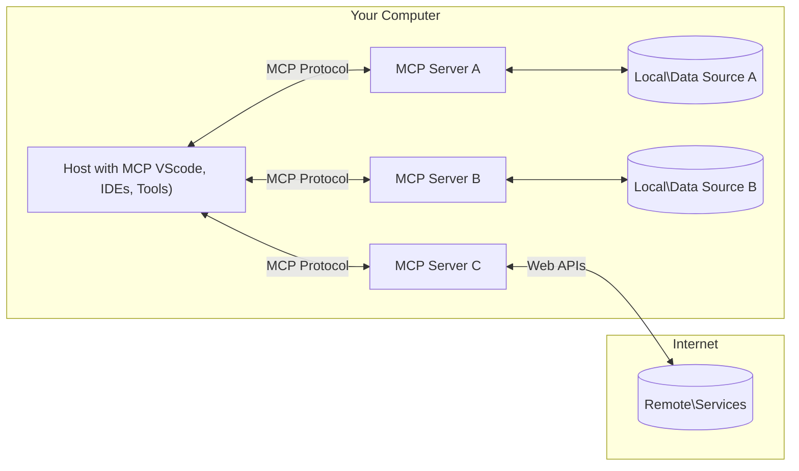

<!--
CO_OP_TRANSLATOR_METADATA:
{
  "original_hash": "355b12a5970c5c9e6db0bee970c751ba",
  "translation_date": "2025-07-04T18:12:46+00:00",
  "source_file": "01-CoreConcepts/README.md",
  "language_code": "ms"
}
-->
# 📖 Konsep Teras MCP: Menguasai Protokol Konteks Model untuk Integrasi AI

[Model Context Protocol (MCP)](https://github.com/modelcontextprotocol) adalah rangka kerja berstandard yang kuat yang mengoptimumkan komunikasi antara Model Bahasa Besar (LLM) dan alat, aplikasi, serta sumber data luaran. Panduan yang dioptimumkan untuk SEO ini akan membawa anda melalui konsep teras MCP, memastikan anda memahami seni bina klien-pelayan, komponen penting, mekanisme komunikasi, dan amalan terbaik pelaksanaan.

## Gambaran Keseluruhan

Pelajaran ini meneroka seni bina asas dan komponen yang membentuk ekosistem Model Context Protocol (MCP). Anda akan mempelajari seni bina klien-pelayan, komponen utama, dan mekanisme komunikasi yang menggerakkan interaksi MCP.

## 👩‍🎓 Objektif Pembelajaran Utama

Menjelang akhir pelajaran ini, anda akan:

- Memahami seni bina klien-pelayan MCP.
- Mengenal pasti peranan dan tanggungjawab Hosts, Clients, dan Servers.
- Menganalisis ciri teras yang menjadikan MCP lapisan integrasi yang fleksibel.
- Mempelajari bagaimana maklumat mengalir dalam ekosistem MCP.
- Mendapatkan pandangan praktikal melalui contoh kod dalam .NET, Java, Python, dan JavaScript.

## 🔎 Seni Bina MCP: Tinjauan Mendalam

Ekosistem MCP dibina berdasarkan model klien-pelayan. Struktur modular ini membolehkan aplikasi AI berinteraksi dengan alat, pangkalan data, API, dan sumber kontekstual dengan cekap. Mari kita pecahkan seni bina ini kepada komponen terasnya.

Pada asasnya, MCP mengikuti seni bina klien-pelayan di mana aplikasi hos boleh berhubung dengan pelbagai pelayan:



- **MCP Hosts**: Program seperti VSCode, Claude Desktop, IDE, atau alat AI yang ingin mengakses data melalui MCP
- **MCP Clients**: Klien protokol yang mengekalkan sambungan 1:1 dengan pelayan
- **MCP Servers**: Program ringan yang masing-masing mendedahkan keupayaan tertentu melalui Model Context Protocol yang berstandard
- **Sumber Data Tempatan**: Fail, pangkalan data, dan perkhidmatan komputer anda yang boleh diakses dengan selamat oleh pelayan MCP
- **Perkhidmatan Jauh**: Sistem luaran yang tersedia melalui internet yang boleh disambungkan oleh pelayan MCP melalui API.

Protokol MCP adalah standard yang sentiasa berkembang, anda boleh melihat kemas kini terkini pada [spesifikasi protokol](https://modelcontextprotocol.io/specification/2025-06-18/)

### 1. Hosts

Dalam Model Context Protocol (MCP), Hosts memainkan peranan penting sebagai antara muka utama di mana pengguna berinteraksi dengan protokol. Hosts adalah aplikasi atau persekitaran yang memulakan sambungan dengan pelayan MCP untuk mengakses data, alat, dan arahan. Contoh Hosts termasuk persekitaran pembangunan bersepadu (IDE) seperti Visual Studio Code, alat AI seperti Claude Desktop, atau agen yang dibina khas untuk tugasan tertentu.

**Hosts** adalah aplikasi LLM yang memulakan sambungan. Mereka:

- Melaksanakan atau berinteraksi dengan model AI untuk menghasilkan respons.
- Memulakan sambungan dengan pelayan MCP.
- Mengurus aliran perbualan dan antara muka pengguna.
- Mengawal kebenaran dan sekatan keselamatan.
- Mengendalikan persetujuan pengguna untuk perkongsian data dan pelaksanaan alat.

### 2. Clients

Clients adalah komponen penting yang memudahkan interaksi antara Hosts dan pelayan MCP. Clients bertindak sebagai perantara, membolehkan Hosts mengakses dan menggunakan fungsi yang disediakan oleh pelayan MCP. Mereka memainkan peranan penting dalam memastikan komunikasi lancar dan pertukaran data yang cekap dalam seni bina MCP.

**Clients** adalah penyambung dalam aplikasi hos. Mereka:

- Menghantar permintaan kepada pelayan dengan arahan/prompts.
- Merundingkan keupayaan dengan pelayan.
- Mengurus permintaan pelaksanaan alat dari model.
- Memproses dan memaparkan respons kepada pengguna.

### 3. Servers

Servers bertanggungjawab mengendalikan permintaan dari klien MCP dan memberikan respons yang sesuai. Mereka mengurus pelbagai operasi seperti pengambilan data, pelaksanaan alat, dan penjanaan arahan. Servers memastikan komunikasi antara klien dan Hosts berjalan dengan cekap dan boleh dipercayai, mengekalkan integriti proses interaksi.

**Servers** adalah perkhidmatan yang menyediakan konteks dan keupayaan. Mereka:

- Mendaftar ciri yang tersedia (sumber, arahan, alat)
- Menerima dan melaksanakan panggilan alat dari klien
- Memberi maklumat kontekstual untuk meningkatkan respons model
- Mengembalikan output kepada klien
- Mengekalkan keadaan sepanjang interaksi apabila diperlukan

Servers boleh dibangunkan oleh sesiapa sahaja untuk memperluas keupayaan model dengan fungsi khusus.

### 4. Ciri Pelayan

Pelayan dalam Model Context Protocol (MCP) menyediakan blok binaan asas yang membolehkan interaksi kaya antara klien, hos, dan model bahasa. Ciri-ciri ini direka untuk meningkatkan keupayaan MCP dengan menawarkan konteks berstruktur, alat, dan arahan.

Pelayan MCP boleh menawarkan mana-mana ciri berikut:

#### 📑 Sumber

Sumber dalam Model Context Protocol (MCP) merangkumi pelbagai jenis konteks dan data yang boleh digunakan oleh pengguna atau model AI. Ini termasuk:

- **Data Kontekstual**: Maklumat dan konteks yang boleh dimanfaatkan oleh pengguna atau model AI untuk membuat keputusan dan melaksanakan tugasan.
- **Pangkalan Pengetahuan dan Repositori Dokumen**: Koleksi data berstruktur dan tidak berstruktur, seperti artikel, manual, dan kertas penyelidikan, yang menyediakan pandangan dan maklumat berharga.
- **Fail dan Pangkalan Data Tempatan**: Data yang disimpan secara tempatan pada peranti atau dalam pangkalan data, boleh diakses untuk pemprosesan dan analisis.
- **API dan Perkhidmatan Web**: Antara muka dan perkhidmatan luaran yang menawarkan data dan fungsi tambahan, membolehkan integrasi dengan pelbagai sumber dan alat dalam talian.

Contoh sumber boleh berupa skema pangkalan data atau fail yang boleh diakses seperti berikut:

```text
file://log.txt
database://schema
```

### 🤖 Arahan

Arahan dalam Model Context Protocol (MCP) merangkumi pelbagai templat dan corak interaksi yang telah ditetapkan untuk memudahkan aliran kerja pengguna dan meningkatkan komunikasi. Ini termasuk:

- **Mesej dan Aliran Kerja Bertemplated**: Mesej dan proses yang telah distrukturkan untuk membimbing pengguna melalui tugasan dan interaksi tertentu.
- **Corak Interaksi Pra-Tetap**: Urutan tindakan dan respons yang distandardkan untuk memudahkan komunikasi yang konsisten dan cekap.
- **Templat Perbualan Khusus**: Templat yang boleh disesuaikan untuk jenis perbualan tertentu, memastikan interaksi yang relevan dan sesuai konteks.

Contoh templat arahan boleh kelihatan seperti berikut:

```markdown
Generate a product slogan based on the following {{product}} with the following {{keywords}}
```

#### ⛏️ Alat

Alat dalam Model Context Protocol (MCP) adalah fungsi yang boleh dilaksanakan oleh model AI untuk melaksanakan tugasan tertentu. Alat ini direka untuk meningkatkan keupayaan model AI dengan menyediakan operasi yang berstruktur dan boleh dipercayai. Aspek utama termasuk:

- **Fungsi untuk model AI laksanakan**: Alat adalah fungsi yang boleh dijalankan yang boleh dipanggil oleh model AI untuk melaksanakan pelbagai tugasan.
- **Nama dan Penerangan Unik**: Setiap alat mempunyai nama yang tersendiri dan penerangan terperinci yang menerangkan tujuan dan fungsinya.
- **Parameter dan Output**: Alat menerima parameter tertentu dan mengembalikan output berstruktur, memastikan hasil yang konsisten dan boleh diramal.
- **Fungsi Diskret**: Alat melaksanakan fungsi diskret seperti carian web, pengiraan, dan pertanyaan pangkalan data.

Contoh alat boleh kelihatan seperti berikut:

```typescript
server.tool(
  "GetProducts",
  {
    pageSize: z.string().optional(),
    pageCount: z.string().optional()
  }, () => {
    // return results from API
  }
)
```

## Ciri Klien

Dalam Model Context Protocol (MCP), klien menawarkan beberapa ciri utama kepada pelayan, meningkatkan fungsi keseluruhan dan interaksi dalam protokol. Salah satu ciri penting ialah Sampling.

### 👉 Sampling

- **Tingkah Laku Agen yang Dimulakan oleh Pelayan**: Klien membolehkan pelayan memulakan tindakan atau tingkah laku tertentu secara autonomi, meningkatkan keupayaan dinamik sistem.
- **Interaksi LLM Rekursif**: Ciri ini membolehkan interaksi rekursif dengan model bahasa besar (LLM), membolehkan pemprosesan tugasan yang lebih kompleks dan berulang.
- **Meminta Lengkap Model Tambahan**: Pelayan boleh meminta lengkapan tambahan dari model, memastikan respons yang menyeluruh dan relevan secara kontekstual.

## Aliran Maklumat dalam MCP

Model Context Protocol (MCP) mentakrifkan aliran maklumat berstruktur antara hos, klien, pelayan, dan model. Memahami aliran ini membantu menjelaskan bagaimana permintaan pengguna diproses dan bagaimana alat serta data luaran diintegrasikan ke dalam respons model.

- **Hos Memulakan Sambungan**  
  Aplikasi hos (seperti IDE atau antara muka sembang) mewujudkan sambungan ke pelayan MCP, biasanya melalui STDIO, WebSocket, atau pengangkutan lain yang disokong.

- **Rundingan Keupayaan**  
  Klien (terbenam dalam hos) dan pelayan bertukar maklumat mengenai ciri, alat, sumber, dan versi protokol yang disokong. Ini memastikan kedua-dua pihak memahami keupayaan yang tersedia untuk sesi tersebut.

- **Permintaan Pengguna**  
  Pengguna berinteraksi dengan hos (contohnya, memasukkan arahan atau perintah). Hos mengumpul input ini dan menghantarnya ke klien untuk diproses.

- **Penggunaan Sumber atau Alat**  
  - Klien mungkin meminta konteks atau sumber tambahan dari pelayan (seperti fail, entri pangkalan data, atau artikel pangkalan pengetahuan) untuk memperkayakan pemahaman model.
  - Jika model menentukan bahawa alat diperlukan (contohnya, untuk mendapatkan data, melakukan pengiraan, atau memanggil API), klien menghantar permintaan panggilan alat kepada pelayan, menyatakan nama alat dan parameter.

- **Pelaksanaan Pelayan**  
  Pelayan menerima permintaan sumber atau alat, melaksanakan operasi yang diperlukan (seperti menjalankan fungsi, membuat pertanyaan pangkalan data, atau mendapatkan fail), dan mengembalikan hasil kepada klien dalam format berstruktur.

- **Penjanaan Respons**  
  Klien menggabungkan respons pelayan (data sumber, output alat, dan lain-lain) ke dalam interaksi model yang sedang berjalan. Model menggunakan maklumat ini untuk menghasilkan respons yang komprehensif dan relevan secara kontekstual.

- **Pembentangan Keputusan**  
  Hos menerima output akhir dari klien dan membentangkannya kepada pengguna, sering kali termasuk teks yang dijana model dan sebarang hasil dari pelaksanaan alat atau pencarian sumber.

Aliran ini membolehkan MCP menyokong aplikasi AI yang maju, interaktif, dan peka konteks dengan menghubungkan model dengan alat dan sumber data luaran secara lancar.

## Butiran Protokol

MCP (Model Context Protocol) dibina di atas [JSON-RPC 2.0](https://www.jsonrpc.org/), menyediakan format mesej berstandard dan bebas bahasa untuk komunikasi antara hos, klien, dan pelayan. Asas ini membolehkan interaksi yang boleh dipercayai, berstruktur, dan boleh dikembangkan merentasi pelbagai platform dan bahasa pengaturcaraan.

### Ciri Protokol Utama

MCP meluaskan JSON-RPC 2.0 dengan konvensyen tambahan untuk panggilan alat, akses sumber, dan pengurusan arahan. Ia menyokong pelbagai lapisan pengangkutan (STDIO, WebSocket, SSE) dan membolehkan komunikasi yang selamat, boleh dikembangkan, dan bebas bahasa antara komponen.

#### 🧢 Protokol Asas

- **Format Mesej JSON-RPC**: Semua permintaan dan respons menggunakan spesifikasi JSON-RPC 2.0, memastikan struktur konsisten untuk panggilan kaedah, parameter, hasil, dan pengendalian ralat.
- **Sambungan Berkeadaan**: Sesi MCP mengekalkan keadaan merentasi pelbagai permintaan, menyokong perbualan berterusan, pengumpulan konteks, dan pengurusan sumber.
- **Rundingan Keupayaan**: Semasa penyediaan sambungan, klien dan pelayan bertukar maklumat mengenai ciri yang disokong, versi protokol, alat dan sumber yang tersedia. Ini memastikan kedua-dua pihak memahami keupayaan masing-masing dan boleh menyesuaikan diri.

#### ➕ Utiliti Tambahan

Berikut adalah beberapa utiliti tambahan dan peluasan protokol yang disediakan MCP untuk meningkatkan pengalaman pembangun dan membolehkan senario lanjutan:

- **Pilihan Konfigurasi**: MCP membenarkan konfigurasi dinamik parameter sesi, seperti kebenaran alat, akses sumber, dan tetapan model, disesuaikan untuk setiap interaksi.
- **Penjejakan Kemajuan**: Operasi yang mengambil masa lama boleh melaporkan kemas kini kemajuan, membolehkan antara muka pengguna yang responsif dan pengalaman pengguna yang lebih baik semasa tugasan kompleks.
- **Pembatalan Permintaan**: Klien boleh membatalkan permintaan yang sedang berjalan, membolehkan pengguna menghentikan operasi yang tidak lagi diperlukan atau mengambil masa terlalu lama.
- **Laporan Ralat**: Mesej dan kod ralat berstandard membantu mendiagnosis isu, mengendalikan kegagalan dengan baik, dan memberikan maklum balas yang berguna kepada pengguna dan pembangun.
- **Pencatatan**: Kedua-dua klien dan pelayan boleh mengeluarkan log berstruktur untuk audit, penyahpepijatan, dan pemantauan interaksi protokol.

Dengan memanfaatkan ciri protokol ini, MCP memastikan komunikasi yang kukuh, selamat, dan fleksibel antara model bahasa dan alat atau sumber data luaran.

### 🔐 Pertimbangan Keselamatan

Pelaksanaan MCP harus mematuhi beberapa prinsip keselamatan utama untuk memastikan interaksi yang selamat dan boleh dipercayai:

- **Persetujuan dan Kawalan Pengguna**: Pengguna mesti memberikan persetujuan jelas sebelum sebarang data diakses atau operasi dilaksanakan. Mereka harus mempunyai kawalan yang jelas terhadap data yang dikongsi dan tindakan yang dibenarkan, disokong oleh antara muka pengguna yang intuitif untuk menyemak dan meluluskan aktiviti.

- **Privasi Data**: Data pengguna hanya boleh didedahkan dengan persetujuan jelas dan mesti dilindungi oleh kawalan akses yang sesuai. Pelaksanaan MCP mesti melindungi daripada penghantaran data tanpa kebenaran dan memastikan privasi terpelihara sepanjang interaksi.

- **Keselamatan Alat**: Sebelum memanggil mana-mana alat, persetujuan jelas pengguna diperlukan. Pengguna harus memahami dengan jelas fungsi setiap alat, dan sempadan keselamatan yang kukuh mesti dikuatkuasakan untuk mengelakkan pelaksanaan alat yang tidak diingini atau tidak selamat.

Dengan mengikuti prinsip ini, MCP memastikan kepercayaan, privasi, dan keselamatan pengguna terpelihara dalam semua interaksi protokol.

## Contoh Kod: Komponen Utama

Berikut adalah contoh kod dalam beberapa bahasa pengaturcaraan popular yang menunjukkan cara melaksanakan komponen pelayan MCP utama dan alat.

### Contoh .NET: Membina Pelayan MCP Ringkas dengan Alat

Berikut adalah contoh kod .NET praktikal yang menunjukkan cara melaksanakan pelayan MCP ringkas dengan alat tersuai. Contoh ini mempamerkan cara mentakrif dan mendaftar alat, mengendalikan permintaan, dan menyambungkan pelayan menggunakan Model Context Protocol.

```csharp
using System;
using System.Threading.Tasks;
using ModelContextProtocol.Server;
using ModelContextProtocol.Server.Transport;
using ModelContextProtocol.Server.Tools;

public class WeatherServer
{
    public static async Task Main(string[] args)
    {
        // Create an MCP server
        var server = new McpServer(
            name: "Weather MCP Server",
            version: "1.0.0"
        );
        
        // Register our custom weather tool
        server.AddTool<string, WeatherData>("weatherTool", 
            description: "Gets current weather for a location",
            execute: async (location) => {
                // Call weather API (simplified)
                var weatherData = await GetWeatherDataAsync(location);
                return weatherData;
            });
        
        // Connect the server using stdio transport
        var transport = new StdioServerTransport();
        await server.ConnectAsync(transport);
        
        Console.WriteLine("Weather MCP Server started");
        
        // Keep the server running until process is terminated
        await Task.Delay(-1);
    }
    
    private static async Task<WeatherData> GetWeatherDataAsync(string location)
    {
        // This would normally call a weather API
        // Simplified for demonstration
        await Task.Delay(100); // Simulate API call
        return new WeatherData { 
            Temperature = 72.5,
            Conditions = "Sunny",
            Location = location
        };
    }
}

public class WeatherData
{
    public double Temperature { get; set; }
    public string Conditions { get; set; }
    public string Location { get; set; }
}
```

### Contoh Java: Komponen Pelayan MCP

Contoh ini menunjukkan pelayan MCP dan pendaftaran alat yang sama seperti contoh .NET di atas, tetapi dilaksanakan dalam Java.

```java
import io.modelcontextprotocol.server.McpServer;
import io.modelcontextprotocol.server.McpToolDefinition;
import io.modelcontextprotocol.server.transport.StdioServerTransport;
import io.modelcontextprotocol.server.tool.ToolExecutionContext;
import io.modelcontextprotocol.server.tool.ToolResponse;

public class WeatherMcpServer {
    public static void main(String[] args) throws Exception {
        // Create an MCP server
        McpServer server = McpServer.builder()
            .name("Weather MCP Server")
            .version("1.0.0")
            .build();
            
        // Register a weather tool
        server.registerTool(McpToolDefinition.builder("weatherTool")
            .description("Gets current weather for a location")
            .parameter("location", String.class)
            .execute((ToolExecutionContext ctx) -> {
                String location = ctx.getParameter("location", String.class);
                
                // Get weather data (simplified)
                WeatherData data = getWeatherData(location);
                
                // Return formatted response
                return ToolResponse.content(
                    String.format("Temperature: %.1f°F, Conditions: %s, Location: %s", 
                    data.getTemperature(), 
                    data.getConditions(), 
                    data.getLocation())
                );
            })
            .build());
        
        // Connect the server using stdio transport
        try (StdioServerTransport transport = new StdioServerTransport()) {
            server.connect(transport);
            System.out.println("Weather MCP Server started");
            // Keep server running until process is terminated
            Thread.currentThread().join();
        }
    }
    
    private static WeatherData getWeatherData(String location) {
        // Implementation would call a weather API
        // Simplified for example purposes
        return new WeatherData(72.5, "Sunny", location);
    }
}

class WeatherData {
    private double temperature;
    private String conditions;
    private String location;
    
    public WeatherData(double temperature, String conditions, String location) {
        this.temperature = temperature;
        this.conditions = conditions;
        this.location = location;
    }
    
    public double getTemperature() {
        return temperature;
    }
    
    public String getConditions() {
        return conditions;
    }
    
    public String getLocation() {
        return location;
    }
}
```

### Contoh Python: Membina Pelayan MCP

Dalam contoh ini kami menunjukkan cara membina pelayan MCP dalam Python. Anda juga ditunjukkan dua cara berbeza untuk mencipta alat.

```python
#!/usr/bin/env python3
import asyncio
from mcp.server.fastmcp import FastMCP
from mcp.server.transports.stdio import serve_stdio

# Create a FastMCP server
mcp = FastMCP(
    name="Weather MCP Server",
    version="1.0.0"
)

@mcp.tool()
def get_weather(location: str) -> dict:
    """Gets current weather for a location."""
    # This would normally call a weather API
    # Simplified for demonstration
    return {
        "temperature": 72.5,
        "conditions": "Sunny",
        "location": location
    }

# Alternative approach using a class
class WeatherTools:
    @mcp.tool()
    def forecast(self, location: str, days: int = 1) -> dict:
        """Gets weather forecast for a location for the specified number of days."""
        # This would normally call a weather API forecast endpoint
        # Simplified for demonstration
        return {
            "location": location,
            "forecast": [
                {"day": i+1, "temperature": 70 + i, "conditions": "Partly Cloudy"}
                for i in range(days)
            ]
        }

# Instantiate the class to register its tools
weather_tools = WeatherTools()

# Start the server using stdio transport
if __name__ == "__main__":
    asyncio.run(serve_stdio(mcp))
```

### Contoh JavaScript: Membina Pelayan MCP

Contoh ini menunjukkan penciptaan pelayan MCP dalam JavaScript dan cara mendaftar dua alat berkaitan cuaca.

```javascript
// Using the official Model Context Protocol SDK
import { McpServer } from "@modelcontextprotocol/sdk/server/mcp.js";
import { StdioServerTransport } from "@modelcontextprotocol/sdk/server/stdio.js";
import { z } from "zod"; // For parameter validation

// Create an MCP server
const server = new McpServer({
  name: "Weather MCP Server",
  version: "1.0.0"
});

// Define a weather tool
server.tool(
  "weatherTool",
  {
    location: z.string().describe("The location to get weather for")
  },
  async ({ location }) => {
    // This would normally call a weather API
    // Simplified for demonstration
    const weatherData = await getWeatherData(location);
    
    return {
      content: [
        { 
          type: "text", 
          text: `Temperature: ${weatherData.temperature}°F, Conditions: ${weatherData.conditions}, Location: ${weatherData.location}` 
        }
      ]
    };
  }
);

// Define a forecast tool
server.tool(
  "forecastTool",
  {
    location: z.string(),
    days: z.number().default(3).describe("Number of days for forecast")
  },
  async ({ location, days }) => {
    // This would normally call a weather API
    // Simplified for demonstration
    const forecast = await getForecastData(location, days);
    
    return {
      content: [
        { 
          type: "text", 
          text: `${days}-day forecast for ${location}: ${JSON.stringify(forecast)}` 
        }
      ]
    };
  }
);

// Helper functions
async function getWeatherData(location) {
  // Simulate API call
  return {
    temperature: 72.5,
    conditions: "Sunny",
    location: location
  };
}

async function getForecastData(location, days) {
  // Simulate API call
  return Array.from({ length: days }, (_, i) => ({
    day: i + 1,
    temperature: 70 + Math.floor(Math.random() * 10),
    conditions: i % 2 === 0 ? "Sunny" : "Partly Cloudy"
  }));
}

// Connect the server using stdio transport
const transport = new StdioServerTransport();
server.connect(transport).catch(console.error);

console.log("Weather MCP Server started");
```

Contoh JavaScript ini menunjukkan cara mencipta klien MCP yang menyambung ke pelayan, menghantar arahan, dan memproses respons termasuk sebarang panggilan alat yang dibuat.

## Keselamatan dan Kebenaran
MCP merangkumi beberapa konsep dan mekanisme terbina dalam untuk mengurus keselamatan dan kebenaran sepanjang protokol:

1. **Kawalan Kebenaran Alat**:  
  Pelanggan boleh menentukan alat mana yang dibenarkan digunakan oleh model semasa sesi. Ini memastikan hanya alat yang diberi kebenaran secara eksplisit boleh diakses, mengurangkan risiko operasi yang tidak disengajakan atau tidak selamat. Kebenaran boleh dikonfigurasikan secara dinamik berdasarkan keutamaan pengguna, polisi organisasi, atau konteks interaksi.

2. **Pengesahan**:  
  Pelayan boleh memerlukan pengesahan sebelum memberikan akses kepada alat, sumber, atau operasi sensitif. Ini mungkin melibatkan kunci API, token OAuth, atau skema pengesahan lain. Pengesahan yang betul memastikan hanya pelanggan dan pengguna yang dipercayai boleh menggunakan keupayaan pelayan.

3. **Pengesahan Parameter**:  
  Pengesahan parameter dikuatkuasakan untuk semua panggilan alat. Setiap alat menentukan jenis, format, dan had yang dijangka untuk parameternya, dan pelayan mengesahkan permintaan yang diterima mengikut itu. Ini menghalang input yang tidak betul atau berniat jahat daripada sampai ke pelaksanaan alat dan membantu mengekalkan integriti operasi.

4. **Had Kadar**:  
  Untuk mengelakkan penyalahgunaan dan memastikan penggunaan sumber pelayan yang adil, pelayan MCP boleh melaksanakan had kadar untuk panggilan alat dan akses sumber. Had kadar boleh dikenakan mengikut pengguna, sesi, atau secara global, dan membantu melindungi daripada serangan penafian perkhidmatan atau penggunaan sumber yang berlebihan.

Dengan menggabungkan mekanisme ini, MCP menyediakan asas yang selamat untuk mengintegrasikan model bahasa dengan alat dan sumber data luaran, sambil memberi pengguna dan pembangun kawalan terperinci ke atas akses dan penggunaan.

## Mesej Protokol

Komunikasi MCP menggunakan mesej JSON berstruktur untuk memudahkan interaksi yang jelas dan boleh dipercayai antara pelanggan, pelayan, dan model. Jenis mesej utama termasuk:

- **Permintaan Pelanggan**  
  Dihantar dari pelanggan ke pelayan, mesej ini biasanya mengandungi:
  - Arahan atau arahan pengguna
  - Sejarah perbualan untuk konteks
  - Konfigurasi dan kebenaran alat
  - Sebarang metadata tambahan atau maklumat sesi

- **Respons Model**  
  Dikembalikan oleh model (melalui pelanggan), mesej ini mengandungi:
  - Teks yang dijana atau penyelesaian berdasarkan arahan dan konteks
  - Arahan panggilan alat pilihan jika model menentukan alat perlu digunakan
  - Rujukan kepada sumber atau konteks tambahan jika perlu

- **Permintaan Alat**  
  Dihantar dari pelanggan ke pelayan apabila alat perlu dijalankan. Mesej ini mengandungi:
  - Nama alat yang hendak dipanggil
  - Parameter yang diperlukan oleh alat (disahkan mengikut skema alat)
  - Maklumat kontekstual atau pengecam untuk menjejak permintaan

- **Respons Alat**  
  Dikembalikan oleh pelayan selepas menjalankan alat. Mesej ini menyediakan:
  - Keputusan pelaksanaan alat (data berstruktur atau kandungan)
  - Sebarang ralat atau maklumat status jika panggilan alat gagal
  - Secara pilihan, metadata tambahan atau log berkaitan pelaksanaan

Mesej berstruktur ini memastikan setiap langkah dalam aliran kerja MCP adalah jelas, boleh dijejak, dan boleh dikembangkan, menyokong senario lanjutan seperti perbualan berbilang pusingan, rantai alat, dan pengendalian ralat yang kukuh.

## Perkara Penting

- MCP menggunakan seni bina pelanggan-pelayan untuk menghubungkan model dengan keupayaan luaran
- Ekosistem terdiri daripada pelanggan, hos, pelayan, alat, dan sumber data
- Komunikasi boleh berlaku melalui STDIO, SSE, atau WebSockets
- Alat adalah unit asas fungsi yang didedahkan kepada model
- Protokol komunikasi berstruktur memastikan interaksi yang konsisten

## Latihan

Reka bentuk alat MCP ringkas yang berguna dalam bidang anda. Tentukan:
1. Nama alat tersebut
2. Parameter yang diterima
3. Output yang akan dikembalikan
4. Bagaimana model boleh menggunakan alat ini untuk menyelesaikan masalah pengguna


---

## Apa seterusnya

Seterusnya: [Chapter 2: Security](../02-Security/README.md)

**Penafian**:  
Dokumen ini telah diterjemahkan menggunakan perkhidmatan terjemahan AI [Co-op Translator](https://github.com/Azure/co-op-translator). Walaupun kami berusaha untuk ketepatan, sila ambil maklum bahawa terjemahan automatik mungkin mengandungi kesilapan atau ketidaktepatan. Dokumen asal dalam bahasa asalnya harus dianggap sebagai sumber yang sahih. Untuk maklumat penting, terjemahan profesional oleh manusia adalah disyorkan. Kami tidak bertanggungjawab atas sebarang salah faham atau salah tafsir yang timbul daripada penggunaan terjemahan ini.