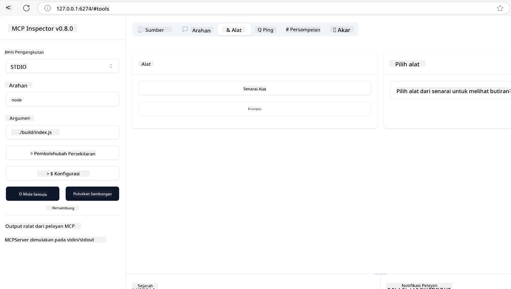
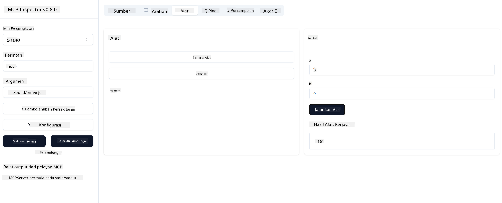

<!--
CO_OP_TRANSLATOR_METADATA:
{
  "original_hash": "d730cbe43a8efc148677fdbc849a7d5e",
  "translation_date": "2025-06-02T17:05:48+00:00",
  "source_file": "03-GettingStarted/01-first-server/README.md",
  "language_code": "ms"
}
-->
### -2- Create project

ഇപ്പോൾ നിങ്ങൾക്ക് SDK ഇൻസ്റ്റാൾ ചെയ്തതിനുശേഷം, അടുത്തത് ഒരു പ്രോജക്ട് സൃഷ്ടിക്കാം:

### -3- Create project files

### -4- Create server code

### -5- Adding a tool and a resource

താഴെ കാണിക്കുന്ന കോഡ് ചേർത്ത് ഒരു ടൂൾ ഒപ്പം ഒരു റിസോഴ്‌സ് ചേർക്കുക:

### -6 Final code

സർവർ ആരംഭിക്കാൻ വേണ്ട അവസാന കോഡ് ചേർക്കാം:

### -7- Test the server

താഴെ കാണുന്ന കമാൻഡ് ഉപയോഗിച്ച് സർവർ സ്റ്റാർട്ട് ചെയ്യുക:

### -8- Run using the inspector

Inspector ഒരു മികച്ച ടൂൾ ആണ്, ഇത് നിങ്ങളുടെ സർവർ ആരംഭിപ്പിച്ച് അതുമായി ഇടപഴകാൻ സഹായിക്കുന്നു, അതിലൂടെ നിങ്ങൾക്ക് അത് ശരിയായി പ്രവർത്തിക്കുന്നുണ്ടോ എന്ന് പരിശോധിക്കാം. അതിന് തുടക്കം കുറിക്കാം:

> [!NOTE]
> "command" ഫീൽഡിൽ കാണുന്നത് നിങ്ങളുടെ പ്രത്യേക റൺടൈമിനുള്ള സർവർ ഓടിക്കുന്ന കമാൻഡ് ആയതിനാൽ വ്യത്യസ്തമായി കാണാം

നിങ്ങൾക്ക് താഴെ കാണുന്ന യൂസർ ഇന്റർഫേസ് കാണാം:

1. Connect ബട്ടൺ തിരഞ്ഞെടുക്കുക, സർവറുമായി കണക്ട് ചെയ്യാൻ
   സർവറുമായി കണക്ട് ചെയ്ത ശേഷം, താഴെ കാണുന്ന ഇന്റർഫേസ് കാണാം:

   

2. "Tools" തിരഞ്ഞെടുക്കുക, ശേഷം "listTools" തിരഞ്ഞെടുക്കുക, "Add" കാണാനാകും, അതിൽ ക്ലിക്ക് ചെയ്ത് പാരാമീറ്റർ മൂല്യങ്ങൾ പൂരിപ്പിക്കുക.

   "add" ടൂളിൽ നിന്നുള്ള ഫലമായി താഴെ കാണുന്ന റെസ്പോൺസ് ലഭിക്കും:

   

അഭിനന്ദനങ്ങൾ, നിങ്ങൾ ആദ്യ MCP സർവർ സൃഷ്ടിച്ച് ഓടിക്കാനായി കഴിഞ്ഞു!

### Official SDKs

MCP വിവിധ ഭാഷകളിൽ ഔദ്യോഗിക SDKകൾ നൽകുന്നു:
- [C# SDK](https://github.com/modelcontextprotocol/csharp-sdk) - Microsoft സഹകരണത്തോടെ പരിപാലിക്കുന്നു
- [Java SDK](https://github.com/modelcontextprotocol/java-sdk) - Spring AI സഹകരണത്തോടെ പരിപാലിക്കുന്നു
- [TypeScript SDK](https://github.com/modelcontextprotocol/typescript-sdk) - ഔദ്യോഗിക TypeScript ഇംപ്ലിമെന്റേഷൻ
- [Python SDK](https://github.com/modelcontextprotocol/python-sdk) - ഔദ്യോഗിക Python ഇംപ്ലിമെന്റേഷൻ
- [Kotlin SDK](https://github.com/modelcontextprotocol/kotlin-sdk) - ഔദ്യോഗിക Kotlin ഇംപ്ലിമെന്റേഷൻ
- [Swift SDK](https://github.com/modelcontextprotocol/swift-sdk) - Loopwork AI സഹകരണത്തോടെ പരിപാലിക്കുന്നു
- [Rust SDK](https://github.com/modelcontextprotocol/rust-sdk) - ഔദ്യോഗിക Rust ഇംപ്ലിമെന്റേഷൻ

## Key Takeaways

- MCP ഡെവലപ്പ്മെന്റ് എൻവയോൺമെന്റ് സജ്ജമാക്കുന്നത് ഭാഷാ-പ്രത്യേക SDKകൾ ഉപയോഗിച്ച് എളുപ്പമാണ്
- MCP സർവറുകൾ നിർമ്മിക്കുന്നത് ടൂളുകൾ സൃഷ്ടിക്കുകയും വ്യക്തമായ സ്കീമകൾ ഉപയോഗിച്ച് രജിസ്റ്റർ ചെയ്യുകയും ചെയ്യുന്നതാണ്
- വിശ്വസനീയമായ MCP ഇംപ്ലിമെന്റേഷനുകൾക്കായി ടെസ്റ്റിങ്ങും ഡീബഗ്ഗിംഗും അനിവാര്യമാണ്

## Samples 

- [Java Calculator](../samples/java/calculator/README.md)
- [.Net Calculator](../../../../03-GettingStarted/samples/csharp)
- [JavaScript Calculator](../samples/javascript/README.md)
- [TypeScript Calculator](../samples/typescript/README.md)
- [Python Calculator](../../../../03-GettingStarted/samples/python)

## Assignment

നിങ്ങളുടെ ഇഷ്ടത്തിലുള്ള ഒരു ടൂൾ ഉപയോഗിച്ച് ഒരു ലളിതമായ MCP സർവർ സൃഷ്ടിക്കുക:
1. നിങ്ങളുടെ ഇഷ്ടഭാഷയിൽ (.NET, Java, Python, അല്ലെങ്കിൽ JavaScript) ടൂൾ ഇംപ്ലിമെന്റ് ചെയ്യുക.
2. ഇൻപുട്ട് പാരാമീറ്ററുകളും റിട്ടേൺ മൂല്യങ്ങളും നിർവചിക്കുക.
3. സർവർ ശരിയായി പ്രവർത്തിക്കുന്നുണ്ടോ എന്ന് ഉറപ്പാക്കാൻ inspector ടൂൾ ഓടിക്കുക.
4. വ്യത്യസ്ത ഇൻപുട്ടുകൾ ഉപയോഗിച്ച് ഇംപ്ലിമെന്റേഷൻ ടെസ്റ്റ് ചെയ്യുക.

## Solution

[Solution](./solution/README.md)

## Additional Resources

- [MCP GitHub Repository](https://github.com/microsoft/mcp-for-beginners)

## What's next

അടുത്തത്: [Getting Started with MCP Clients](/03-GettingStarted/02-client/README.md)

**Penafian**:  
Dokumen ini telah diterjemahkan menggunakan perkhidmatan terjemahan AI [Co-op Translator](https://github.com/Azure/co-op-translator). Walaupun kami berusaha untuk ketepatan, sila maklum bahawa terjemahan automatik mungkin mengandungi kesilapan atau ketidaktepatan. Dokumen asal dalam bahasa asalnya harus dianggap sebagai sumber yang sahih. Untuk maklumat penting, terjemahan profesional oleh manusia adalah disyorkan. Kami tidak bertanggungjawab atas sebarang salah faham atau salah tafsir yang timbul daripada penggunaan terjemahan ini.