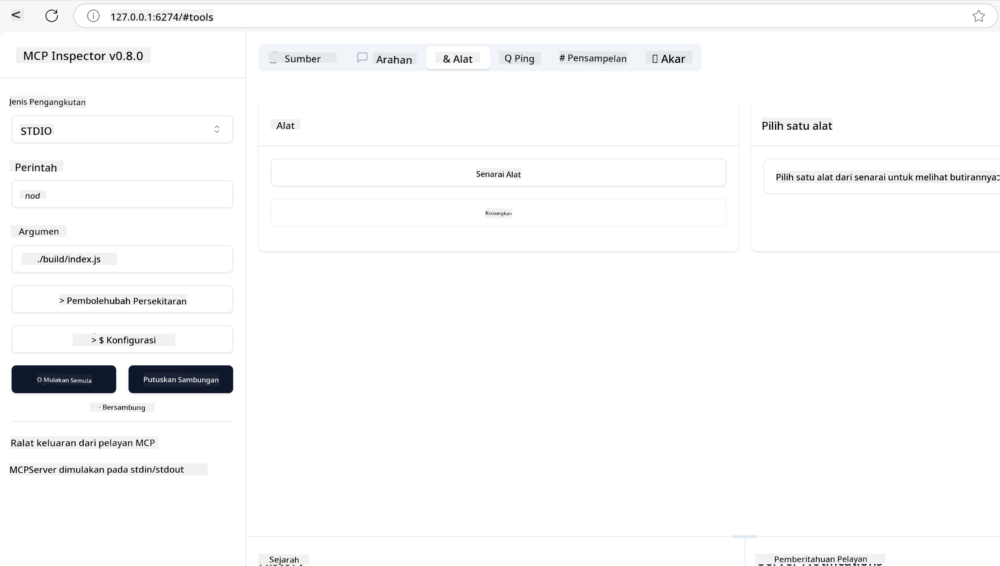
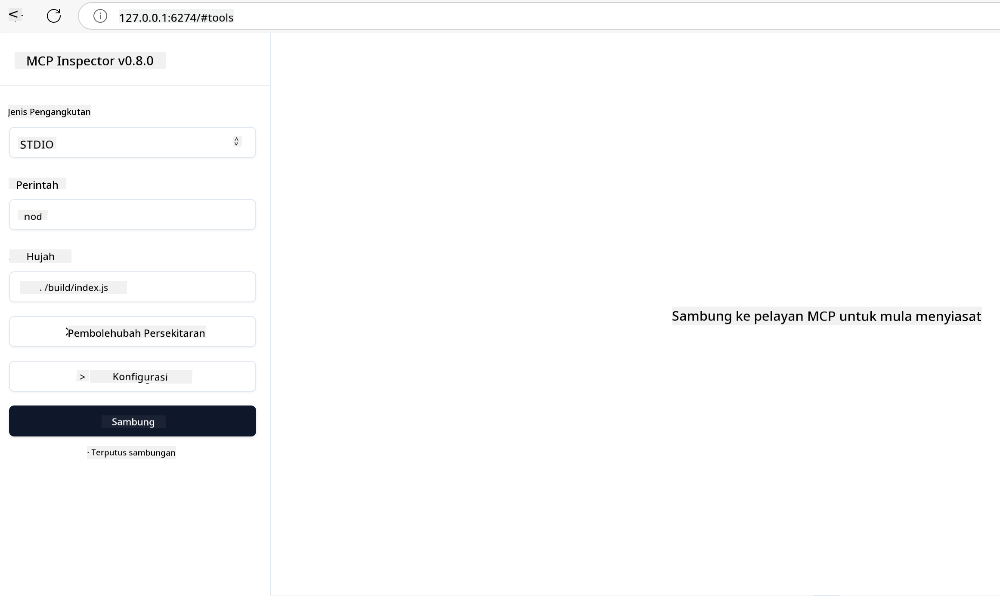
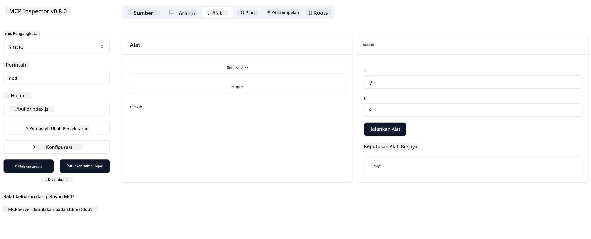

<!--
CO_OP_TRANSLATOR_METADATA:
{
  "original_hash": "5331ffd328a54b90f76706c52b673e27",
  "translation_date": "2025-05-17T08:47:21+00:00",
  "source_file": "03-GettingStarted/01-first-server/README.md",
  "language_code": "ms"
}
-->
# Memulakan dengan MCP

Selamat datang ke langkah pertama anda dengan Model Context Protocol (MCP)! Sama ada anda baru dengan MCP atau ingin mendalami pemahaman anda, panduan ini akan membimbing anda melalui proses persediaan dan pembangunan yang penting. Anda akan menemui bagaimana MCP membolehkan integrasi yang lancar antara model AI dan aplikasi, dan belajar bagaimana untuk menyediakan persekitaran anda dengan cepat untuk membina dan menguji penyelesaian berkuasa MCP.

> TLDR; Jika anda membina aplikasi AI, anda tahu bahawa anda boleh menambah alat dan sumber lain kepada LLM (model bahasa besar), untuk menjadikan LLM lebih berpengetahuan. Walau bagaimanapun, jika anda meletakkan alat dan sumber tersebut pada pelayan, aplikasi dan keupayaan pelayan boleh digunakan oleh mana-mana klien dengan/tanpa LLM.

## Gambaran Keseluruhan

Pelajaran ini memberikan panduan praktikal tentang cara menyediakan persekitaran MCP dan membina aplikasi MCP pertama anda. Anda akan belajar cara menyediakan alat dan kerangka kerja yang diperlukan, membina pelayan MCP asas, mencipta aplikasi hos, dan menguji pelaksanaan anda.

Model Context Protocol (MCP) adalah protokol terbuka yang menyeragamkan cara aplikasi menyediakan konteks kepada LLM. Fikirkan MCP seperti port USB-C untuk aplikasi AI - ia menyediakan cara standard untuk menghubungkan model AI kepada sumber data dan alat yang berbeza.

## Objektif Pembelajaran

Pada akhir pelajaran ini, anda akan dapat:

- Menyediakan persekitaran pembangunan untuk MCP dalam C#, Java, Python, TypeScript, dan JavaScript
- Membina dan menyebarkan pelayan MCP asas dengan ciri-ciri tersuai (sumber, petunjuk, dan alat)
- Mencipta aplikasi hos yang menghubungkan kepada pelayan MCP
- Menguji dan membetulkan pelaksanaan MCP

## Menyediakan Persekitaran MCP Anda

Sebelum anda mula bekerja dengan MCP, penting untuk menyediakan persekitaran pembangunan anda dan memahami aliran kerja asas. Bahagian ini akan membimbing anda melalui langkah persediaan awal untuk memastikan permulaan yang lancar dengan MCP.

### Prasyarat

Sebelum terjun ke pembangunan MCP, pastikan anda mempunyai:

- **Persekitaran Pembangunan**: Untuk bahasa pilihan anda (C#, Java, Python, TypeScript, atau JavaScript)
- **IDE/Editor**: Visual Studio, Visual Studio Code, IntelliJ, Eclipse, PyCharm, atau mana-mana editor kod moden
- **Pengurus Pakej**: NuGet, Maven/Gradle, pip, atau npm/yarn
- **Kunci API**: Untuk sebarang perkhidmatan AI yang anda rancang untuk digunakan dalam aplikasi hos anda

## Struktur Pelayan MCP Asas

Pelayan MCP biasanya merangkumi:

- **Konfigurasi Pelayan**: Menyediakan port, pengesahan, dan tetapan lain
- **Sumber**: Data dan konteks yang tersedia kepada LLM
- **Alat**: Fungsi yang boleh dipanggil oleh model
- **Petunjuk**: Templat untuk menjana atau menyusun teks

Berikut adalah contoh ringkas dalam TypeScript:

```typescript
import { Server, Tool, Resource } from "@modelcontextprotocol/typescript-server-sdk";

// Create a new MCP server
const server = new Server({
  port: 3000,
  name: "Example MCP Server",
  version: "1.0.0"
});

// Register a tool
server.registerTool({
  name: "calculator",
  description: "Performs basic calculations",
  parameters: {
    expression: {
      type: "string",
      description: "The math expression to evaluate"
    }
  },
  handler: async (params) => {
    const result = eval(params.expression);
    return { result };
  }
});

// Start the server
server.start();
```

Dalam kod terdahulu kami:

- Mengimport kelas yang diperlukan dari MCP TypeScript SDK.
- Mencipta dan mengkonfigurasi contoh pelayan MCP baru.
- Mendaftar alat tersuai (`calculator`) dengan fungsi pengendali.
- Memulakan pelayan untuk mendengar permintaan MCP yang masuk.

## Menguji dan Membetulkan

Sebelum anda mula menguji pelayan MCP anda, penting untuk memahami alat yang tersedia dan amalan terbaik untuk pembetulan. Pengujian yang berkesan memastikan pelayan anda berkelakuan seperti yang diharapkan dan membantu anda mengenal pasti dan menyelesaikan isu dengan cepat. Bahagian berikut menggariskan pendekatan yang disyorkan untuk mengesahkan pelaksanaan MCP anda.

MCP menyediakan alat untuk membantu anda menguji dan membetulkan pelayan anda:

- **Alat Inspector**, antara muka grafik ini membolehkan anda menyambung ke pelayan anda dan menguji alat, petunjuk dan sumber anda.
- **curl**, anda juga boleh menyambung ke pelayan anda menggunakan alat baris perintah seperti curl atau klien lain yang boleh mencipta dan menjalankan arahan HTTP.

### Menggunakan MCP Inspector

[MCP Inspector](https://github.com/modelcontextprotocol/inspector) adalah alat pengujian visual yang membantu anda:

1. **Menemui Keupayaan Pelayan**: Mengesan secara automatik sumber, alat, dan petunjuk yang tersedia
2. **Uji Pelaksanaan Alat**: Cuba parameter yang berbeza dan lihat respons dalam masa nyata
3. **Lihat Metadata Pelayan**: Periksa info pelayan, skema, dan konfigurasi

```bash
# ex TypeScript, installing and running MCP Inspector
npx @modelcontextprotocol/inspector node build/index.js
```

Apabila anda menjalankan arahan di atas, MCP Inspector akan melancarkan antara muka web tempatan dalam pelayar anda. Anda boleh mengharapkan untuk melihat papan pemuka yang memaparkan pelayan MCP yang didaftarkan, alat, sumber, dan petunjuk yang tersedia. Antara muka membolehkan anda menguji pelaksanaan alat secara interaktif, memeriksa metadata pelayan, dan melihat respons masa nyata, menjadikannya lebih mudah untuk mengesahkan dan membetulkan pelaksanaan pelayan MCP anda.

Berikut adalah tangkapan skrin bagaimana rupanya:



## Masalah dan Penyelesaian Persediaan Biasa

| Masalah | Penyelesaian Mungkin |
|---------|---------------------|
| Sambungan ditolak | Periksa jika pelayan berjalan dan port adalah betul |
| Kesalahan pelaksanaan alat | Semak pengesahan parameter dan pengendalian kesalahan |
| Kegagalan pengesahan | Sahkan kunci API dan kebenaran |
| Kesalahan pengesahan skema | Pastikan parameter sepadan dengan skema yang ditentukan |
| Pelayan tidak bermula | Periksa konflik port atau kebergantungan yang hilang |
| Kesalahan CORS | Konfigurasi header CORS yang betul untuk permintaan rentas asal |
| Masalah pengesahan | Sahkan kesahan token dan kebenaran |

## Pembangunan Tempatan

Untuk pembangunan dan pengujian tempatan, anda boleh menjalankan pelayan MCP terus pada mesin anda:

1. **Mulakan proses pelayan**: Jalankan aplikasi pelayan MCP anda
2. **Konfigurasi rangkaian**: Pastikan pelayan boleh diakses pada port yang dijangka
3. **Sambung klien**: Gunakan URL sambungan tempatan seperti `http://localhost:3000`

```bash
# Example: Running a TypeScript MCP server locally
npm run start
# Server running at http://localhost:3000
```

## Membina Pelayan MCP Pertama Anda

Kami telah membincangkan [Konsep Teras](/01-CoreConcepts/README.md) dalam pelajaran sebelumnya, sekarang masa untuk meletakkan pengetahuan itu dalam amalan.

### Apa yang pelayan boleh lakukan

Sebelum kita mula menulis kod, mari ingatkan diri kita apa yang pelayan boleh lakukan:

Pelayan MCP boleh sebagai contoh:

- Mengakses fail dan pangkalan data tempatan
- Menyambung ke API jauh
- Melakukan pengiraan
- Mengintegrasi dengan alat dan perkhidmatan lain
- Menyediakan antara muka pengguna untuk interaksi

Hebat, sekarang kita tahu apa yang kita boleh lakukan untuknya, mari kita mula menulis kod.

## Latihan: Mencipta pelayan

Untuk mencipta pelayan, anda perlu mengikuti langkah-langkah berikut:

- Pasang MCP SDK.
- Cipta projek dan sediakan struktur projek.
- Tulis kod pelayan.
- Uji pelayan.

### -1- Pasang SDK

Ini berbeza sedikit bergantung pada runtime pilihan anda, jadi pilih salah satu runtime di bawah:

Generative AI boleh menjana teks, imej, dan juga kod.
Anda dilatih pada data sehingga Oktober 2023.

### -2- Cipta projek

Sekarang anda telah memasang SDK anda, mari kita cipta projek seterusnya:

### -3- Cipta fail projek

### -4- Cipta kod pelayan

### -5- Menambah alat dan sumber

Tambah alat dan sumber dengan menambah kod berikut:

### -6 Kod akhir

Mari kita tambah kod terakhir yang kita perlukan supaya pelayan boleh mula:

### -7- Uji pelayan

Mulakan pelayan dengan arahan berikut:

### -8- Jalankan menggunakan inspector

Inspector adalah alat yang hebat yang boleh memulakan pelayan anda dan membolehkan anda berinteraksi dengannya supaya anda boleh menguji bahawa ia berfungsi. Mari kita mulakannya:

> [!NOTE]
> ia mungkin kelihatan berbeza dalam medan "command" kerana ia mengandungi arahan untuk menjalankan pelayan dengan runtime khusus anda

Anda harus melihat antara muka pengguna berikut:



1. Sambung ke pelayan dengan memilih butang Connect 
   Setelah anda menyambung ke pelayan, anda kini sepatutnya melihat yang berikut:

   

1. Pilih "Tools" dan "listTools", anda sepatutnya melihat "Add" muncul, pilih "Add" dan isikan nilai parameter.

   Anda sepatutnya melihat respons berikut, iaitu hasil daripada alat "add":

   

Tahniah, anda telah berjaya mencipta dan menjalankan pelayan pertama anda!

### SDK Rasmi

MCP menyediakan SDK rasmi untuk pelbagai bahasa:
- [C# SDK](https://github.com/modelcontextprotocol/csharp-sdk) - Dikendalikan bersama dengan Microsoft
- [Java SDK](https://github.com/modelcontextprotocol/java-sdk) - Dikendalikan bersama dengan Spring AI
- [TypeScript SDK](https://github.com/modelcontextprotocol/typescript-sdk) - Pelaksanaan TypeScript rasmi
- [Python SDK](https://github.com/modelcontextprotocol/python-sdk) - Pelaksanaan Python rasmi
- [Kotlin SDK](https://github.com/modelcontextprotocol/kotlin-sdk) - Pelaksanaan Kotlin rasmi
- [Swift SDK](https://github.com/modelcontextprotocol/swift-sdk) - Dikendalikan bersama dengan Loopwork AI
- [Rust SDK](https://github.com/modelcontextprotocol/rust-sdk) - Pelaksanaan Rust rasmi

## Poin Penting

- Menyediakan persekitaran pembangunan MCP adalah mudah dengan SDK khusus bahasa
- Membina pelayan MCP melibatkan penciptaan dan pendaftaran alat dengan skema yang jelas
- Pengujian dan pembetulan adalah penting untuk pelaksanaan MCP yang boleh dipercayai

## Contoh 

- [Java Calculator](../samples/java/calculator/README.md)
- [.Net Calculator](../../../../03-GettingStarted/samples/csharp)
- [JavaScript Calculator](../samples/javascript/README.md)
- [TypeScript Calculator](../samples/typescript/README.md)
- [Python Calculator](../../../../03-GettingStarted/samples/python)

## Tugasan

Cipta pelayan MCP ringkas dengan alat pilihan anda:
1. Laksanakan alat dalam bahasa pilihan anda (.NET, Java, Python, atau JavaScript).
2. Tentukan parameter input dan nilai pulangan.
3. Jalankan alat inspector untuk memastikan pelayan berfungsi seperti yang diharapkan.
4. Uji pelaksanaan dengan pelbagai input.

## Penyelesaian

[Penyelesaian](./solution/README.md)

## Sumber Tambahan

- [Repositori GitHub MCP](https://github.com/microsoft/mcp-for-beginners)

## Apa seterusnya

Seterusnya: [Memulakan dengan Klien MCP](/03-GettingStarted/02-client/README.md)

**Penafian**:  
Dokumen ini telah diterjemahkan menggunakan perkhidmatan terjemahan AI [Co-op Translator](https://github.com/Azure/co-op-translator). Walaupun kami berusaha untuk ketepatan, sila ambil perhatian bahawa terjemahan automatik mungkin mengandungi kesilapan atau ketidaktepatan. Dokumen asal dalam bahasa asalnya harus dianggap sebagai sumber yang berwibawa. Untuk maklumat kritikal, terjemahan manusia profesional adalah disyorkan. Kami tidak bertanggungjawab atas sebarang salah faham atau salah tafsir yang timbul daripada penggunaan terjemahan ini.