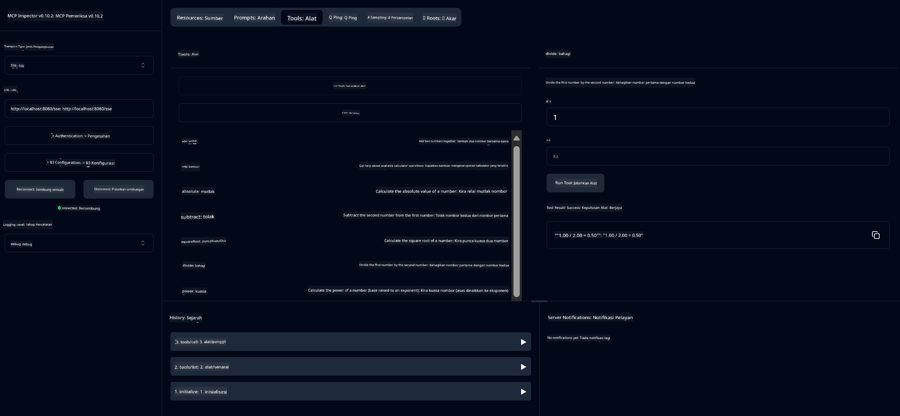

<!--
CO_OP_TRANSLATOR_METADATA:
{
  "original_hash": "ed9cab32cc67c12d8969b407aa47100a",
  "translation_date": "2025-07-13T17:55:45+00:00",
  "source_file": "03-GettingStarted/01-first-server/solution/java/README.md",
  "language_code": "ms"
}
-->
# Perkhidmatan Kalkulator Asas MCP

Perkhidmatan ini menyediakan operasi kalkulator asas melalui Model Context Protocol (MCP) menggunakan Spring Boot dengan pengangkutan WebFlux. Ia direka sebagai contoh mudah untuk pemula yang ingin mempelajari tentang pelaksanaan MCP.

Untuk maklumat lanjut, lihat dokumentasi rujukan [MCP Server Boot Starter](https://docs.spring.io/spring-ai/reference/api/mcp/mcp-server-boot-starter-docs.html).


## Menggunakan Perkhidmatan

Perkhidmatan ini mendedahkan API berikut melalui protokol MCP:

- `add(a, b)`: Menambah dua nombor
- `subtract(a, b)`: Menolak nombor kedua daripada nombor pertama
- `multiply(a, b)`: Mendarab dua nombor
- `divide(a, b)`: Membahagi nombor pertama dengan nombor kedua (dengan pemeriksaan sifar)
- `power(base, exponent)`: Mengira kuasa nombor
- `squareRoot(number)`: Mengira punca kuasa dua (dengan pemeriksaan nombor negatif)
- `modulus(a, b)`: Mengira baki apabila dibahagi
- `absolute(number)`: Mengira nilai mutlak

## Kebergantungan

Projek ini memerlukan kebergantungan utama berikut:

```xml
<dependency>
    <groupId>org.springframework.ai</groupId>
    <artifactId>spring-ai-starter-mcp-server-webflux</artifactId>
</dependency>
```

## Membina Projek

Bina projek menggunakan Maven:
```bash
./mvnw clean install -DskipTests
```

## Menjalankan Pelayan

### Menggunakan Java

```bash
java -jar target/calculator-server-0.0.1-SNAPSHOT.jar
```

### Menggunakan MCP Inspector

MCP Inspector adalah alat berguna untuk berinteraksi dengan perkhidmatan MCP. Untuk menggunakannya dengan perkhidmatan kalkulator ini:

1. **Pasang dan jalankan MCP Inspector** dalam tetingkap terminal baru:
   ```bash
   npx @modelcontextprotocol/inspector
   ```

2. **Akses UI web** dengan mengklik URL yang dipaparkan oleh aplikasi (biasanya http://localhost:6274)

3. **Konfigurasikan sambungan**:
   - Tetapkan jenis pengangkutan kepada "SSE"
   - Tetapkan URL ke titik akhir SSE pelayan anda yang sedang berjalan: `http://localhost:8080/sse`
   - Klik "Connect"

4. **Gunakan alat-alat**:
   - Klik "List Tools" untuk melihat operasi kalkulator yang tersedia
   - Pilih alat dan klik "Run Tool" untuk menjalankan operasi



**Penafian**:  
Dokumen ini telah diterjemahkan menggunakan perkhidmatan terjemahan AI [Co-op Translator](https://github.com/Azure/co-op-translator). Walaupun kami berusaha untuk ketepatan, sila ambil maklum bahawa terjemahan automatik mungkin mengandungi kesilapan atau ketidaktepatan. Dokumen asal dalam bahasa asalnya harus dianggap sebagai sumber yang sahih. Untuk maklumat penting, terjemahan profesional oleh manusia adalah disyorkan. Kami tidak bertanggungjawab atas sebarang salah faham atau salah tafsir yang timbul daripada penggunaan terjemahan ini.