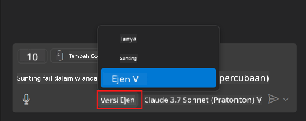
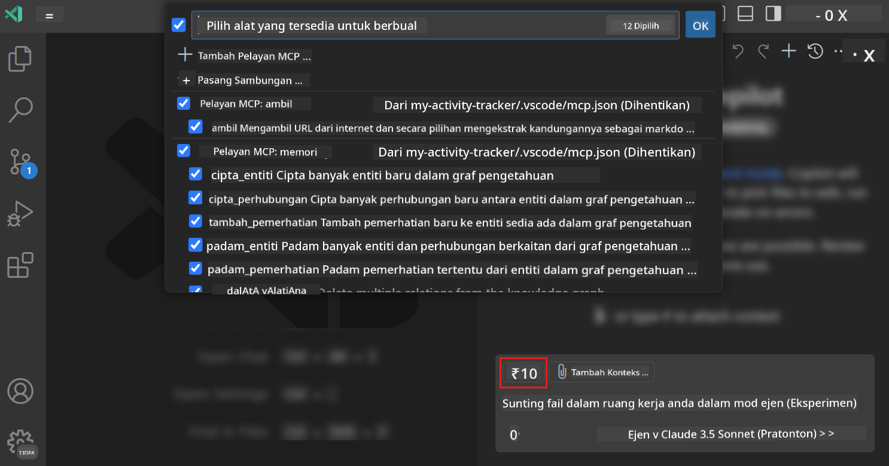
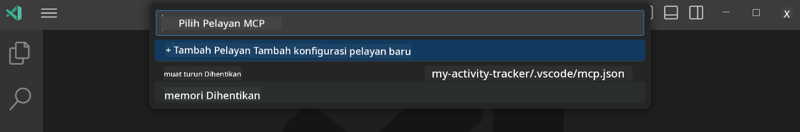
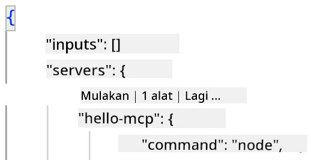
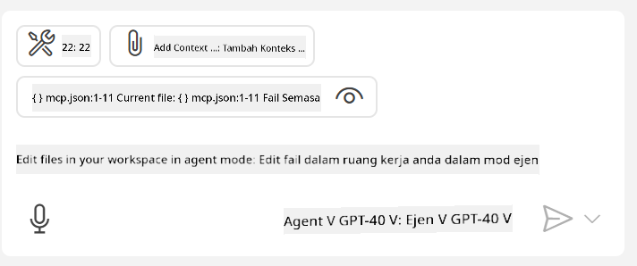
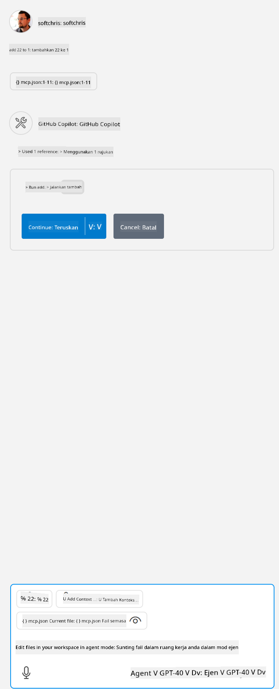

<!--
CO_OP_TRANSLATOR_METADATA:
{
  "original_hash": "d940b5e0af75e3a3a4d1c3179120d1d9",
  "translation_date": "2025-08-26T18:05:54+00:00",
  "source_file": "03-GettingStarted/04-vscode/README.md",
  "language_code": "ms"
}
-->
# Menggunakan pelayan dari mod Agen GitHub Copilot

Visual Studio Code dan GitHub Copilot boleh bertindak sebagai klien dan menggunakan MCP Server. Kenapa kita mahu melakukannya, anda mungkin bertanya? Nah, ini bermakna apa sahaja ciri yang dimiliki oleh MCP Server kini boleh digunakan terus dari dalam IDE anda. Bayangkan anda menambah, sebagai contoh, pelayan MCP GitHub, ini akan membolehkan anda mengawal GitHub melalui arahan semula jadi tanpa perlu menaip perintah tertentu di terminal. Atau bayangkan apa sahaja yang secara amnya boleh meningkatkan pengalaman pembangun anda, semuanya dikawal melalui bahasa semula jadi. Sekarang anda mula nampak kelebihannya, bukan?

## Gambaran Keseluruhan

Pelajaran ini merangkumi cara menggunakan mod Agen Visual Studio Code dan GitHub Copilot sebagai klien untuk MCP Server.

## Objektif Pembelajaran

Pada akhir pelajaran ini, anda akan dapat:

- Menggunakan MCP Server melalui Visual Studio Code.
- Menjalankan keupayaan seperti alat melalui GitHub Copilot.
- Mengkonfigurasi Visual Studio Code untuk mencari dan mengurus MCP Server anda.

## Penggunaan

Anda boleh mengawal MCP Server anda dengan dua cara berbeza:

- Antara muka pengguna, anda akan melihat bagaimana ini dilakukan dalam bab ini.
- Terminal, adalah mungkin untuk mengawal perkara dari terminal menggunakan `code` executable:

  Untuk menambah MCP Server ke profil pengguna anda, gunakan pilihan baris perintah --add-mcp, dan sediakan konfigurasi pelayan JSON dalam bentuk {\"name\":\"server-name\",\"command\":...}.

  ```
  code --add-mcp "{\"name\":\"my-server\",\"command\": \"uvx\",\"args\": [\"mcp-server-fetch\"]}"
  ```

### Tangkapan Skrin

  
  
  

Mari kita bincangkan lebih lanjut tentang bagaimana kita menggunakan antara muka visual dalam bahagian seterusnya.

## Pendekatan

Berikut adalah pendekatan yang perlu kita ambil pada tahap tinggi:

- Konfigurasi fail untuk mencari MCP Server kita.
- Mulakan/Sambungkan ke pelayan tersebut untuk menyenaraikan keupayaannya.
- Gunakan keupayaan tersebut melalui antara muka Chat GitHub Copilot.

Bagus, sekarang kita faham alirannya, mari kita cuba menggunakan MCP Server melalui Visual Studio Code melalui latihan.

## Latihan: Menggunakan pelayan

Dalam latihan ini, kita akan mengkonfigurasi Visual Studio Code untuk mencari MCP Server anda supaya ia boleh digunakan melalui antara muka Chat GitHub Copilot.

### -0- Langkah awal, aktifkan penemuan MCP Server

Anda mungkin perlu mengaktifkan penemuan MCP Server.

1. Pergi ke `File -> Preferences -> Settings` dalam Visual Studio Code.

1. Cari "MCP" dan aktifkan `chat.mcp.discovery.enabled` dalam fail settings.json.

### -1- Cipta fail konfigurasi

Mulakan dengan mencipta fail konfigurasi dalam root projek anda, anda memerlukan fail bernama MCP.json dan letakkannya dalam folder bernama .vscode. Ia sepatutnya kelihatan seperti ini:

```text
.vscode
|-- mcp.json
```

Seterusnya, mari kita lihat bagaimana kita boleh menambah entri pelayan.

### -2- Konfigurasi pelayan

Tambah kandungan berikut ke dalam *mcp.json*:

```json
{
    "inputs": [],
    "servers": {
       "hello-mcp": {
           "command": "node",
           "args": [
               "build/index.js"
           ]
       }
    }
}
```

Contoh di atas adalah cara mudah untuk memulakan pelayan yang ditulis dalam Node.js, untuk runtime lain, nyatakan perintah yang sesuai untuk memulakan pelayan menggunakan `command` dan `args`.

### -3- Mulakan pelayan

Sekarang anda telah menambah entri, mari mulakan pelayan:

1. Cari entri anda dalam *mcp.json* dan pastikan anda menemui ikon "play":

    

1. Klik ikon "play", anda sepatutnya melihat ikon alat dalam GitHub Copilot Chat menambah bilangan alat yang tersedia. Jika anda klik ikon alat tersebut, anda akan melihat senarai alat yang didaftarkan. Anda boleh tandakan/tidak tandakan setiap alat bergantung sama ada anda mahu GitHub Copilot menggunakannya sebagai konteks:

  

1. Untuk menjalankan alat, taipkan arahan yang anda tahu akan sepadan dengan penerangan salah satu alat anda, contohnya arahan seperti "tambah 22 kepada 1":

  

  Anda sepatutnya melihat respons mengatakan 23.

## Tugasan

Cuba tambahkan entri pelayan ke fail *mcp.json* anda dan pastikan anda boleh memulakan/menamatkan pelayan. Pastikan anda juga boleh berkomunikasi dengan alat pada pelayan anda melalui antara muka Chat GitHub Copilot.

## Penyelesaian

[Penyelesaian](./solution/README.md)

## Poin Penting

Poin penting dari bab ini adalah seperti berikut:

- Visual Studio Code adalah klien yang hebat yang membolehkan anda menggunakan beberapa MCP Server dan alat mereka.
- Antara muka Chat GitHub Copilot adalah cara anda berinteraksi dengan pelayan.
- Anda boleh meminta input pengguna seperti kunci API yang boleh dihantar ke MCP Server semasa mengkonfigurasi entri pelayan dalam fail *mcp.json*.

## Contoh

- [Java Calculator](../samples/java/calculator/README.md)  
- [.Net Calculator](../../../../03-GettingStarted/samples/csharp)  
- [JavaScript Calculator](../samples/javascript/README.md)  
- [TypeScript Calculator](../samples/typescript/README.md)  
- [Python Calculator](../../../../03-GettingStarted/samples/python)  

## Sumber Tambahan

- [Dokumentasi Visual Studio](https://code.visualstudio.com/docs/copilot/chat/mcp-servers)

## Apa Seterusnya

- Seterusnya: [Mencipta Pelayan stdio](../05-stdio-server/README.md)

---

**Penafian**:  
Dokumen ini telah diterjemahkan menggunakan perkhidmatan terjemahan AI [Co-op Translator](https://github.com/Azure/co-op-translator). Walaupun kami berusaha untuk memastikan ketepatan, sila ambil perhatian bahawa terjemahan automatik mungkin mengandungi kesilapan atau ketidaktepatan. Dokumen asal dalam bahasa asalnya harus dianggap sebagai sumber yang berwibawa. Untuk maklumat yang kritikal, terjemahan manusia profesional adalah disyorkan. Kami tidak bertanggungjawab atas sebarang salah faham atau salah tafsir yang timbul daripada penggunaan terjemahan ini.