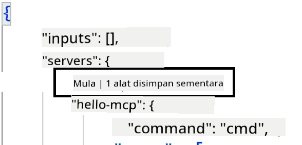
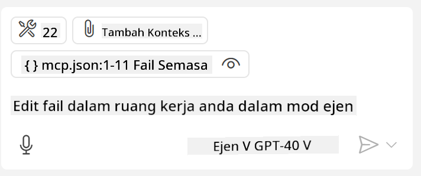

<!--
CO_OP_TRANSLATOR_METADATA:
{
  "original_hash": "c37fabfbc0dcbc9a4afb6d17e7d3be9f",
  "translation_date": "2025-05-17T11:12:50+00:00",
  "source_file": "03-GettingStarted/04-vscode/README.md",
  "language_code": "ms"
}
-->
Mari kita bincangkan lebih lanjut bagaimana kita menggunakan antara muka visual dalam bahagian seterusnya.

## Pendekatan

Berikut adalah cara kita perlu mendekati ini pada tahap tinggi:

- Konfigurasikan fail untuk mencari MCP Server kita.
- Mulakan/Hubungkan ke server tersebut untuk mendapatkan senarai kemampuannya.
- Gunakan kemampuan tersebut melalui antara muka sembang GitHub Copilot.

Bagus, sekarang kita faham alirannya, mari cuba gunakan MCP Server melalui Visual Studio Code melalui latihan.

## Latihan: Menggunakan server

Dalam latihan ini, kita akan mengkonfigurasi Visual Studio Code untuk mencari MCP server anda supaya ia boleh digunakan dari antara muka sembang GitHub Copilot.

### -0- Langkah awal, aktifkan penemuan MCP Server

Anda mungkin perlu mengaktifkan penemuan MCP Server.

1. Pergi ke `File -> Preferences -> Settings` in Visual Studio Code.

1. Search for "MCP" and enable `chat.mcp.discovery.enabled` dalam fail settings.json.

### -1- Buat fail konfigurasi

Mulakan dengan membuat fail konfigurasi dalam akar projek anda, anda akan memerlukan fail yang dipanggil MCP.json dan meletakkannya dalam folder yang dipanggil .vscode. Ia sepatutnya kelihatan seperti ini:

```text
.vscode
|-- mcp.json
```

Seterusnya, mari lihat bagaimana kita boleh menambah entri server.

### -2- Konfigurasikan server

Tambah kandungan berikut ke dalam *mcp.json*:

```json
{
    "inputs": [],
    "servers": {
       "hello-mcp": {
           "command": "cmd",
           "args": [
               "/c", "node", "<absolute path>\\build\\index.js"
           ]
       }
    }
}
```

Ini adalah contoh mudah bagaimana untuk memulakan server yang ditulis dalam Node.js, untuk runtime lain nyatakan perintah yang betul untuk memulakan server menggunakan `command` and `args`.

### -3- Mulakan server

Sekarang anda telah menambah entri, mari mulakan server:

1. Cari entri anda dalam *mcp.json* dan pastikan anda menemui ikon "main":

    

1. Klik ikon "main", anda sepatutnya melihat ikon alat dalam sembang GitHub Copilot meningkatkan bilangan alat yang tersedia. Jika anda klik ikon alat tersebut, anda akan melihat senarai alat yang didaftarkan. Anda boleh menandakan/tidak menandakan setiap alat bergantung jika anda mahu GitHub Copilot menggunakannya sebagai konteks: 

  

1. Untuk menjalankan alat, taipkan prompt yang anda tahu akan sepadan dengan penerangan salah satu alat anda, sebagai contoh prompt seperti ini "tambah 22 kepada 1":

  

  Anda sepatutnya melihat respons mengatakan 23.

## Tugasan

Cuba tambahkan entri server ke dalam fail *mcp.json* anda dan pastikan anda boleh memulakan/menghentikan server. Pastikan anda juga boleh berkomunikasi dengan alat di server anda melalui antara muka sembang GitHub Copilot.

## Penyelesaian

[Penyelesaian](./solution/README.md)

## Pengajaran Utama

Pengajaran utama dari bab ini adalah seperti berikut:

- Visual Studio Code adalah klien yang hebat yang membolehkan anda menggunakan beberapa MCP Server dan alat mereka.
- Antara muka sembang GitHub Copilot adalah cara anda berinteraksi dengan server.
- Anda boleh meminta pengguna untuk input seperti kunci API yang boleh dihantar ke MCP Server apabila mengkonfigurasi entri server dalam fail *mcp.json*.

## Contoh 

- [Java Calculator](../samples/java/calculator/README.md)
- [.Net Calculator](../../../../03-GettingStarted/samples/csharp)
- [JavaScript Calculator](../samples/javascript/README.md)
- [TypeScript Calculator](../samples/typescript/README.md)
- [Python Calculator](../../../../03-GettingStarted/samples/python) 

## Sumber Tambahan

- [Dokumentasi Visual Studio](https://code.visualstudio.com/docs/copilot/chat/mcp-servers)

## Apa Seterusnya

- Seterusnya: [Membuat SSE Server](/03-GettingStarted/05-sse-server/README.md)

**Penafian**:  
Dokumen ini telah diterjemahkan menggunakan perkhidmatan terjemahan AI [Co-op Translator](https://github.com/Azure/co-op-translator). Walaupun kami berusaha untuk memastikan ketepatan, sila ambil perhatian bahawa terjemahan automatik mungkin mengandungi kesilapan atau ketidaktepatan. Dokumen asal dalam bahasa asalnya harus dianggap sebagai sumber yang berwibawa. Untuk maklumat kritikal, terjemahan manusia profesional adalah disyorkan. Kami tidak bertanggungjawab atas sebarang salah faham atau salah tafsir yang timbul daripada penggunaan terjemahan ini.