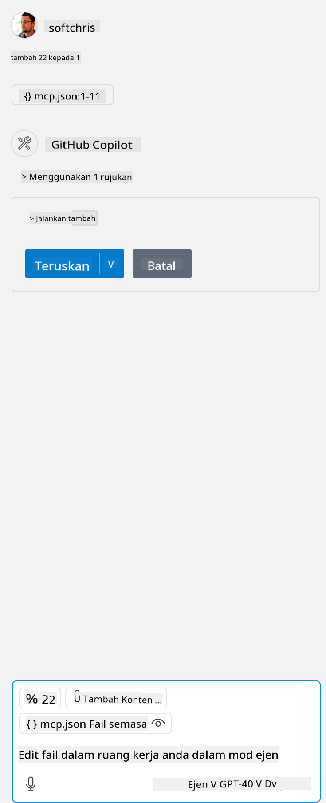

<!--
CO_OP_TRANSLATOR_METADATA:
{
  "original_hash": "96e08a8c1049dab757deb64cce4ea1e8",
  "translation_date": "2025-05-17T11:22:48+00:00",
  "source_file": "03-GettingStarted/04-vscode/solution/README.md",
  "language_code": "ms"
}
-->
# Menjalankan sampel

Di sini kita anggap anda sudah memiliki kode server yang berfungsi. Sila cari server dari salah satu bab terdahulu.

## Menyediakan mcp.json

Berikut adalah fail yang anda gunakan untuk rujukan, [mcp.json](../../../../../03-GettingStarted/04-vscode/solution/mcp.json).

Ubah entri server seperti yang diperlukan untuk menunjukkan jalan mutlak ke server anda termasuk perintah penuh yang diperlukan untuk dijalankan.

Dalam fail contoh yang dirujuk di atas, entri server kelihatan seperti ini:

```json
"hello-mcp": {
    "command": "cmd",
    "args": [
        "/c", "node", "<absolute path>\\build\\index.js"
    ]
}
```

Ini sepadan dengan menjalankan perintah seperti ini: `cmd /c node <absolute path>\\build\index.js`. 

- Change this server entry to fit where your server file is located or to what's needed to startup your server depending on your chosen runtime and server location.

## Consume the features in the server

- Click the `play` icon, once you've added *mcp.json* to *./vscode* folder, 

    Observe the tooling icon change to increase the number of available tools. Tooling icon is located right above the chat field in GitHub Copilot.

## Run a tool

- Type a prompt in your chat window that matches the description of your tool. For example to trigger the tool `add` taip sesuatu seperti "add 3 to 20".

Anda seharusnya melihat alat dipaparkan di atas kotak teks chat yang menunjukkan untuk anda memilih untuk menjalankan alat seperti dalam visual ini:



Memilih alat tersebut seharusnya menghasilkan keputusan angka mengatakan "23" jika arahan anda seperti yang kami sebutkan sebelumnya.

**Penafian**:  
Dokumen ini telah diterjemahkan menggunakan perkhidmatan terjemahan AI [Co-op Translator](https://github.com/Azure/co-op-translator). Walaupun kami berusaha untuk ketepatan, sila ambil perhatian bahawa terjemahan automatik mungkin mengandungi kesilapan atau ketidaktepatan. Dokumen asal dalam bahasa asalnya harus dianggap sebagai sumber berwibawa. Untuk maklumat kritikal, terjemahan manusia profesional adalah disyorkan. Kami tidak bertanggungjawab terhadap sebarang salah faham atau salah tafsir yang timbul daripada penggunaan terjemahan ini.