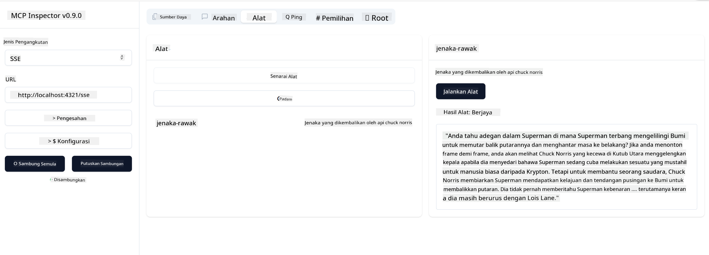

<!--
CO_OP_TRANSLATOR_METADATA:
{
  "original_hash": "0a8086dc4bf89448f83e7936db972c42",
  "translation_date": "2025-05-17T11:40:22+00:00",
  "source_file": "03-GettingStarted/05-sse-server/README.md",
  "language_code": "ms"
}
-->
Sekarang kita sudah tahu lebih lanjut tentang SSE, mari kita bina pelayan SSE seterusnya.

## Latihan: Mencipta Pelayan SSE

Untuk mencipta pelayan kita, kita perlu ingat dua perkara:

- Kita perlu menggunakan pelayan web untuk mendedahkan titik akhir untuk sambungan dan mesej.
- Bina pelayan kita seperti biasa dengan alat, sumber dan arahan seperti ketika kita menggunakan stdio.

### -1- Cipta instans pelayan

Untuk mencipta pelayan kita, kita gunakan jenis yang sama seperti dengan stdio. Walau bagaimanapun, untuk pengangkutan, kita perlu memilih SSE.

Mari kita tambah laluan yang diperlukan seterusnya.

### -2- Tambah laluan

Mari kita tambah laluan seterusnya yang mengendalikan sambungan dan mesej masuk:

Mari kita tambah keupayaan kepada pelayan seterusnya.

### -3- Menambah keupayaan pelayan

Sekarang kita telah mendefinisikan segala yang khusus kepada SSE, mari kita tambah keupayaan pelayan seperti alat, arahan dan sumber.

Kod penuh anda seharusnya kelihatan seperti ini:

Bagus, kita ada pelayan menggunakan SSE, mari kita cuba seterusnya.

## Latihan: Menyahpepijat Pelayan SSE dengan Inspector

Inspector adalah alat yang hebat yang kita lihat dalam pelajaran sebelumnya [Mencipta pelayan pertama anda](/03-GettingStarted/01-first-server/README.md). Mari kita lihat jika kita boleh menggunakan Inspector di sini juga:

### -1- Menjalankan inspector

Untuk menjalankan inspector, anda mesti mempunyai pelayan SSE yang berjalan terlebih dahulu, jadi mari kita lakukan itu seterusnya:

1. Jalankan pelayan

1. Jalankan inspector

    > ![NOTE]
    > Jalankan ini dalam tetingkap terminal yang berasingan dari pelayan yang sedang berjalan. Juga perhatikan, anda perlu menyesuaikan arahan di bawah agar sesuai dengan URL di mana pelayan anda berjalan.

    ```sh
    npx @modelcontextprotocol/inspector --cli http://localhost:8000/sse --method tools/list
    ```

    Menjalankan inspector kelihatan sama dalam semua runtime. Perhatikan bagaimana kita, bukannya menghantar laluan ke pelayan kita dan arahan untuk memulakan pelayan, kita menghantar URL di mana pelayan sedang berjalan dan kita juga menetapkan laluan `/sse`.

### -2- Mencuba alat

Sambungkan pelayan dengan memilih SSE dalam droplist dan isikan medan URL di mana pelayan anda sedang berjalan, sebagai contoh http:localhost:4321/sse. Sekarang klik butang "Connect". Seperti sebelum ini, pilih untuk menyenaraikan alat, pilih alat dan berikan nilai input. Anda seharusnya melihat hasil seperti di bawah:



Bagus, anda boleh bekerja dengan inspector, mari kita lihat bagaimana kita boleh bekerja dengan Visual Studio Code seterusnya.

## Tugasan

Cuba bina pelayan anda dengan lebih banyak keupayaan. Lihat [halaman ini](https://api.chucknorris.io/) untuk sebagai contoh menambah alat yang memanggil API, anda tentukan bagaimana pelayan sepatutnya kelihatan. Selamat berseronok :)

## Penyelesaian

[Penyelesaian](./solution/README.md) Berikut adalah penyelesaian yang mungkin dengan kod yang berfungsi.

## Poin Penting

Poin penting dari bab ini adalah seperti berikut:

- SSE adalah jenis pengangkutan kedua yang disokong selain stdio.
- Untuk menyokong SSE, anda perlu menguruskan sambungan masuk dan mesej menggunakan kerangka web.
- Anda boleh menggunakan kedua-dua Inspector dan Visual Studio Code untuk menggunakan pelayan SSE, sama seperti pelayan stdio. Perhatikan bagaimana ia sedikit berbeza antara stdio dan SSE. Untuk SSE, anda perlu memulakan pelayan secara berasingan dan kemudian menjalankan alat inspector anda. Untuk alat inspector, terdapat juga beberapa perbezaan di mana anda perlu menetapkan URL.

## Contoh

- [Java Calculator](../samples/java/calculator/README.md)
- [.Net Calculator](../../../../03-GettingStarted/samples/csharp)
- [JavaScript Calculator](../samples/javascript/README.md)
- [TypeScript Calculator](../samples/typescript/README.md)
- [Python Calculator](../../../../03-GettingStarted/samples/python)

## Sumber Tambahan

- [SSE](https://developer.mozilla.org/en-US/docs/Web/API/Server-sent_events)

## Apa Seterusnya

- Seterusnya: [Memulakan dengan AI Toolkit untuk VSCode](/03-GettingStarted/06-aitk/README.md)

**Penafian**:  
Dokumen ini telah diterjemahkan menggunakan perkhidmatan terjemahan AI [Co-op Translator](https://github.com/Azure/co-op-translator). Walaupun kami berusaha untuk ketepatan, sila ambil perhatian bahawa terjemahan automatik mungkin mengandungi kesilapan atau ketidaktepatan. Dokumen asal dalam bahasa asalnya harus dianggap sebagai sumber yang berwibawa. Untuk maklumat kritikal, terjemahan manusia profesional disyorkan. Kami tidak bertanggungjawab atas sebarang salah faham atau salah tafsir yang timbul daripada penggunaan terjemahan ini.