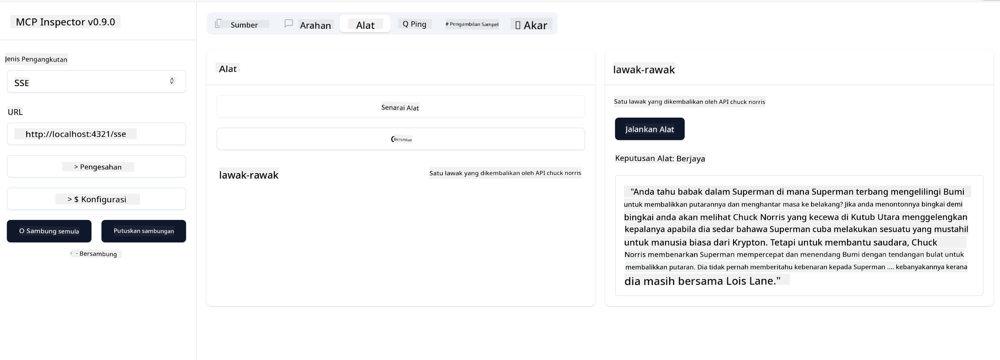

<!--
CO_OP_TRANSLATOR_METADATA:
{
  "original_hash": "d90ca3d326c48fab2ac0ebd3a9876f59",
  "translation_date": "2025-07-13T19:59:20+00:00",
  "source_file": "03-GettingStarted/05-sse-server/README.md",
  "language_code": "ms"
}
-->
Sekarang kita sudah tahu sedikit lebih banyak tentang SSE, mari bina server SSE pula.

## Latihan: Mencipta Server SSE

Untuk mencipta server kita, kita perlu ingat dua perkara:

- Kita perlu menggunakan pelayan web untuk mendedahkan titik akhir bagi sambungan dan mesej.
- Bina server kita seperti biasa dengan menggunakan alat, sumber dan arahan ketika kita menggunakan stdio.

### -1- Cipta instans server

Untuk mencipta server kita, kita gunakan jenis yang sama seperti dengan stdio. Namun, untuk pengangkutan, kita perlu memilih SSE.

Mari kita tambah laluan yang diperlukan seterusnya.

### -2- Tambah laluan

Mari kita tambah laluan yang mengendalikan sambungan dan mesej masuk:

Mari kita tambah keupayaan pada server seterusnya.

### -3- Menambah keupayaan server

Sekarang kita sudah tentukan segala yang khusus untuk SSE, mari tambah keupayaan server seperti alat, arahan dan sumber.

Kod penuh anda sepatutnya kelihatan seperti ini:

Bagus, kita sudah ada server menggunakan SSE, mari cuba jalankan pula.

## Latihan: Menyahpepijat Server SSE dengan Inspector

Inspector adalah alat hebat yang kita lihat dalam pelajaran sebelum ini [Mencipta server pertama anda](/03-GettingStarted/01-first-server/README.md). Mari kita lihat jika kita boleh gunakan Inspector di sini juga:

### -1- Menjalankan inspector

Untuk menjalankan inspector, anda mesti mempunyai server SSE yang sedang berjalan, jadi mari lakukan itu dahulu:

1. Jalankan server

1. Jalankan inspector

    > ![NOTE]
    > Jalankan ini di tetingkap terminal yang berasingan daripada tempat server dijalankan. Juga ambil perhatian, anda perlu sesuaikan arahan di bawah untuk sesuai dengan URL di mana server anda berjalan.

    ```sh
    npx @modelcontextprotocol/inspector --cli http://localhost:8000/sse --method tools/list
    ```

    Menjalankan inspector kelihatan sama dalam semua runtime. Perhatikan bagaimana kita bukannya memberikan laluan ke server dan arahan untuk memulakan server, sebaliknya kita berikan URL di mana server berjalan dan juga nyatakan laluan `/sse`.

### -2- Mencuba alat ini

Sambungkan server dengan memilih SSE dalam senarai dropdown dan isi medan url di mana server anda berjalan, contohnya http:localhost:4321/sse. Kini klik butang "Connect". Seperti sebelum ini, pilih untuk menyenaraikan alat, pilih alat dan berikan nilai input. Anda sepatutnya melihat hasil seperti di bawah:



Bagus, anda boleh bekerja dengan inspector, mari lihat bagaimana kita boleh bekerja dengan Visual Studio Code pula.

## Tugasan

Cuba bina server anda dengan lebih banyak keupayaan. Lihat [laman ini](https://api.chucknorris.io/) untuk, contohnya, menambah alat yang memanggil API. Anda tentukan bagaimana rupa server itu. Selamat mencuba :)

## Penyelesaian

[Penyelesaian](./solution/README.md) Berikut adalah penyelesaian yang mungkin dengan kod yang berfungsi.

## Perkara Penting

Perkara penting dari bab ini adalah seperti berikut:

- SSE adalah pengangkutan kedua yang disokong selepas stdio.
- Untuk menyokong SSE, anda perlu mengurus sambungan masuk dan mesej menggunakan rangka kerja web.
- Anda boleh menggunakan kedua-dua Inspector dan Visual Studio Code untuk menggunakan server SSE, sama seperti server stdio. Perhatikan bagaimana ia berbeza sedikit antara stdio dan SSE. Untuk SSE, anda perlu memulakan server secara berasingan dan kemudian jalankan alat inspector anda. Untuk alat inspector, terdapat juga beberapa perbezaan di mana anda perlu nyatakan URL.

## Contoh

- [Kalkulator Java](../samples/java/calculator/README.md)
- [Kalkulator .Net](../../../../03-GettingStarted/samples/csharp)
- [Kalkulator JavaScript](../samples/javascript/README.md)
- [Kalkulator TypeScript](../samples/typescript/README.md)
- [Kalkulator Python](../../../../03-GettingStarted/samples/python)

## Sumber Tambahan

- [SSE](https://developer.mozilla.org/en-US/docs/Web/API/Server-sent_events)

## Apa Seterusnya

- Seterusnya: [HTTP Streaming dengan MCP (Streamable HTTP)](../06-http-streaming/README.md)

**Penafian**:  
Dokumen ini telah diterjemahkan menggunakan perkhidmatan terjemahan AI [Co-op Translator](https://github.com/Azure/co-op-translator). Walaupun kami berusaha untuk ketepatan, sila ambil maklum bahawa terjemahan automatik mungkin mengandungi kesilapan atau ketidaktepatan. Dokumen asal dalam bahasa asalnya harus dianggap sebagai sumber yang sahih. Untuk maklumat penting, terjemahan profesional oleh manusia adalah disyorkan. Kami tidak bertanggungjawab atas sebarang salah faham atau salah tafsir yang timbul daripada penggunaan terjemahan ini.