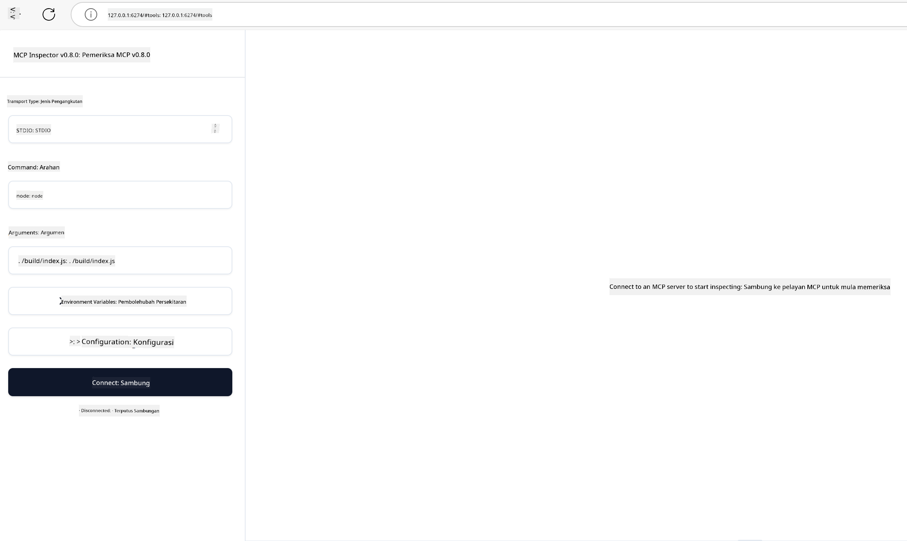

<!--
CO_OP_TRANSLATOR_METADATA:
{
  "original_hash": "4e34e34e84f013e73c7eaa6d09884756",
  "translation_date": "2025-07-13T22:02:35+00:00",
  "source_file": "03-GettingStarted/08-testing/README.md",
  "language_code": "ms"
}
-->
## Ujian dan Penyahpepijatan

Sebelum anda mula menguji pelayan MCP anda, adalah penting untuk memahami alat yang tersedia dan amalan terbaik untuk penyahpepijatan. Ujian yang berkesan memastikan pelayan anda berfungsi seperti yang dijangkakan dan membantu anda mengenal pasti serta menyelesaikan masalah dengan cepat. Bahagian berikut menerangkan pendekatan yang disyorkan untuk mengesahkan pelaksanaan MCP anda.

## Gambaran Keseluruhan

Pelajaran ini membincangkan cara memilih pendekatan ujian yang sesuai dan alat ujian yang paling berkesan.

## Objektif Pembelajaran

Menjelang akhir pelajaran ini, anda akan dapat:

- Menerangkan pelbagai pendekatan untuk ujian.
- Menggunakan pelbagai alat untuk menguji kod anda dengan berkesan.

## Menguji Pelayan MCP

MCP menyediakan alat untuk membantu anda menguji dan menyahpepijat pelayan anda:

- **MCP Inspector**: Alat baris perintah yang boleh dijalankan sebagai alat CLI dan juga sebagai alat visual.
- **Ujian manual**: Anda boleh menggunakan alat seperti curl untuk menjalankan permintaan web, tetapi mana-mana alat yang mampu menjalankan HTTP juga boleh digunakan.
- **Ujian unit**: Anda boleh menggunakan rangka kerja ujian pilihan anda untuk menguji ciri-ciri pelayan dan klien.

### Menggunakan MCP Inspector

Kami telah menerangkan penggunaan alat ini dalam pelajaran sebelum ini tetapi mari kita bincangkan secara ringkas. Ia adalah alat yang dibina menggunakan Node.js dan anda boleh menggunakannya dengan memanggil executable `npx` yang akan memuat turun dan memasang alat ini secara sementara dan akan membersihkan dirinya selepas selesai menjalankan permintaan anda.

[MCP Inspector](https://github.com/modelcontextprotocol/inspector) membantu anda:

- **Mengesan Keupayaan Pelayan**: Mengesan secara automatik sumber, alat, dan arahan yang tersedia
- **Uji Pelaksanaan Alat**: Cuba parameter berbeza dan lihat respons secara masa nyata
- **Lihat Metadata Pelayan**: Periksa maklumat pelayan, skema, dan konfigurasi

Contoh penggunaan alat ini adalah seperti berikut:

```bash
npx @modelcontextprotocol/inspector node build/index.js
```

Arahan di atas memulakan MCP dan antara muka visualnya serta melancarkan antara muka web tempatan dalam pelayar anda. Anda boleh menjangkakan untuk melihat papan pemuka yang memaparkan pelayan MCP yang didaftarkan, alat, sumber, dan arahan yang tersedia. Antara muka ini membolehkan anda menguji pelaksanaan alat secara interaktif, memeriksa metadata pelayan, dan melihat respons masa nyata, menjadikan ia lebih mudah untuk mengesahkan dan menyahpepijat pelaksanaan pelayan MCP anda.

Ini adalah contoh rupa antara mukanya: 

Anda juga boleh menjalankan alat ini dalam mod CLI dengan menambah atribut `--cli`. Berikut adalah contoh menjalankan alat dalam mod "CLI" yang menyenaraikan semua alat pada pelayan:

```sh
npx @modelcontextprotocol/inspector --cli node build/index.js --method tools/list
```

### Ujian Manual

Selain menjalankan alat inspector untuk menguji keupayaan pelayan, satu pendekatan serupa adalah menjalankan klien yang mampu menggunakan HTTP seperti curl contohnya.

Dengan curl, anda boleh menguji pelayan MCP secara langsung menggunakan permintaan HTTP:

```bash
# Example: Test server metadata
curl http://localhost:3000/v1/metadata

# Example: Execute a tool
curl -X POST http://localhost:3000/v1/tools/execute \
  -H "Content-Type: application/json" \
  -d '{"name": "calculator", "parameters": {"expression": "2+2"}}'
```

Seperti yang anda lihat daripada penggunaan curl di atas, anda menggunakan permintaan POST untuk memanggil alat menggunakan payload yang mengandungi nama alat dan parameternya. Gunakan pendekatan yang paling sesuai untuk anda. Alat CLI secara amnya lebih pantas digunakan dan mudah untuk diskripkan yang boleh berguna dalam persekitaran CI/CD.

### Ujian Unit

Buat ujian unit untuk alat dan sumber anda bagi memastikan ia berfungsi seperti yang dijangkakan. Berikut adalah contoh kod ujian.

```python
import pytest

from mcp.server.fastmcp import FastMCP
from mcp.shared.memory import (
    create_connected_server_and_client_session as create_session,
)

# Mark the whole module for async tests
pytestmark = pytest.mark.anyio


async def test_list_tools_cursor_parameter():
    """Test that the cursor parameter is accepted for list_tools.

    Note: FastMCP doesn't currently implement pagination, so this test
    only verifies that the cursor parameter is accepted by the client.
    """

 server = FastMCP("test")

    # Create a couple of test tools
    @server.tool(name="test_tool_1")
    async def test_tool_1() -> str:
        """First test tool"""
        return "Result 1"

    @server.tool(name="test_tool_2")
    async def test_tool_2() -> str:
        """Second test tool"""
        return "Result 2"

    async with create_session(server._mcp_server) as client_session:
        # Test without cursor parameter (omitted)
        result1 = await client_session.list_tools()
        assert len(result1.tools) == 2

        # Test with cursor=None
        result2 = await client_session.list_tools(cursor=None)
        assert len(result2.tools) == 2

        # Test with cursor as string
        result3 = await client_session.list_tools(cursor="some_cursor_value")
        assert len(result3.tools) == 2

        # Test with empty string cursor
        result4 = await client_session.list_tools(cursor="")
        assert len(result4.tools) == 2
    
```

Kod di atas melakukan perkara berikut:

- Menggunakan rangka kerja pytest yang membolehkan anda membuat ujian sebagai fungsi dan menggunakan pernyataan assert.
- Membuat Pelayan MCP dengan dua alat yang berbeza.
- Menggunakan pernyataan `assert` untuk memeriksa bahawa syarat tertentu dipenuhi.

Lihat [fail penuh di sini](https://github.com/modelcontextprotocol/python-sdk/blob/main/tests/client/test_list_methods_cursor.py)

Berdasarkan fail di atas, anda boleh menguji pelayan anda sendiri untuk memastikan keupayaan dicipta seperti yang sepatutnya.

Semua SDK utama mempunyai bahagian ujian yang serupa supaya anda boleh menyesuaikan dengan runtime pilihan anda.

## Contoh

- [Java Calculator](../samples/java/calculator/README.md)
- [.Net Calculator](../../../../03-GettingStarted/samples/csharp)
- [JavaScript Calculator](../samples/javascript/README.md)
- [TypeScript Calculator](../samples/typescript/README.md)
- [Python Calculator](../../../../03-GettingStarted/samples/python)

## Sumber Tambahan

- [Python SDK](https://github.com/modelcontextprotocol/python-sdk)

## Apa Seterusnya

- Seterusnya: [Deployment](../09-deployment/README.md)

**Penafian**:  
Dokumen ini telah diterjemahkan menggunakan perkhidmatan terjemahan AI [Co-op Translator](https://github.com/Azure/co-op-translator). Walaupun kami berusaha untuk ketepatan, sila ambil maklum bahawa terjemahan automatik mungkin mengandungi kesilapan atau ketidaktepatan. Dokumen asal dalam bahasa asalnya harus dianggap sebagai sumber yang sahih. Untuk maklumat penting, terjemahan profesional oleh manusia adalah disyorkan. Kami tidak bertanggungjawab atas sebarang salah faham atau salah tafsir yang timbul daripada penggunaan terjemahan ini.